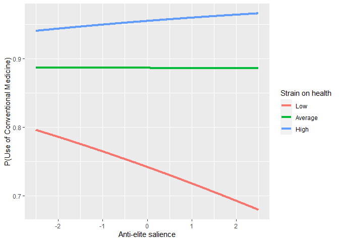
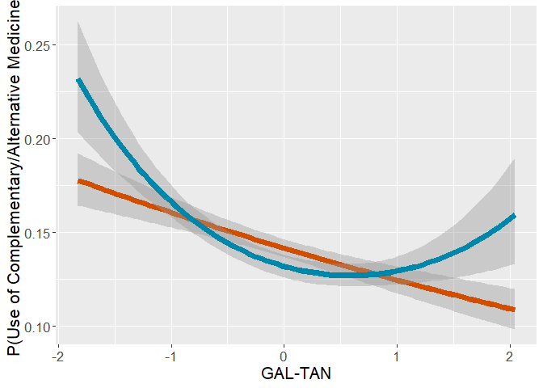
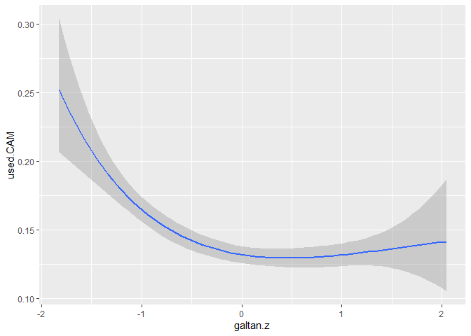

# Preparations

## Packages


```r
library(mclogit)
library(emmeans)
library(dplyr)
library(rio)
library(memisc)
library(psych)
library(ggplot2)
source("../custom_functions.R")
```
## Dataset


```r
dat<-import("../../data/processed/fdat.xlsx")

str(dat)
```

```
## 'data.frame':	40185 obs. of  32 variables:
##  $ idno                      : num  1 2 3 4 5 6 7 13 14 21 ...
##  $ cntry                     : chr  "AT" "AT" "AT" "AT" ...
##  $ dweight                   : num  0.938 0.938 0.938 0.938 0.938 ...
##  $ pspwght                   : num  0.871 0.864 1.419 1.026 0.739 ...
##  $ pweight                   : num  0.406 0.406 0.406 0.406 0.406 ...
##  $ pt.nmbr                   : num  NA 6 2 3 NA 1 1 1 7 2 ...
##  $ pt.name                   : chr  NA NA "ÖVP" "FPÖ" ...
##  $ gndr.f                    : chr  "Male" "Male" "Female" "Male" ...
##  $ gndr.c                    : num  -0.5 -0.5 0.5 -0.5 0.5 0.5 -0.5 0.5 0.5 0.5 ...
##  $ agea                      : num  51 67 89 32 56 67 66 67 34 66 ...
##  $ age10.c                   : num  0.172 1.772 3.972 -1.728 0.672 ...
##  $ income                    : chr  "quint.2" "quint.2" "quint.1" "quint.2" ...
##  $ income.f                  : chr  "quint.2" "quint.2" "quint.1" "quint.2" ...
##  $ income.fr                 : chr  "quint.2" "quint.2" "quint.1" "quint.2" ...
##  $ edu                       : chr  "3. LUS" "1. <LS" "1. <LS" "3. LUS" ...
##  $ edu.f                     : chr  "3. LUS" "1. <LS" "1. <LS" "3. LUS" ...
##  $ strain.on.health          : num  1 7 2 4 2 2 5 6 6 3 ...
##  $ used.conv                 : num  0 1 1 1 1 1 1 1 1 1 ...
##  $ used.CAM                  : num  0 0 0 0 0 0 0 1 0 1 ...
##  $ DV                        : chr  "NN" "Used_conv_ONLY" "Used_conv_ONLY" "Used_conv_ONLY" ...
##  $ used.CAM.no.home          : num  0 0 0 0 0 0 0 1 0 1 ...
##  $ DV.no.home                : chr  "NN" "Used_conv_ONLY" "Used_conv_ONLY" "Used_conv_ONLY" ...
##  $ lrgen                     : num  NA NA 6.1 8.7 NA ...
##  $ lrecon                    : num  NA NA 6.4 5.5 NA ...
##  $ galtan                    : num  NA NA 7.2 8.8 NA ...
##  $ antielite_salience        : num  NA NA 1.6 8 NA ...
##  $ corrupt_salience          : num  NA NA 2.4 5.1 NA ...
##  $ lrgen.scaling             : num  2.3 2.3 2.3 2.3 2.3 ...
##  $ lrecon.scaling            : num  2.21 2.21 2.21 2.21 2.21 ...
##  $ galtan.scaling            : num  2.63 2.63 2.63 2.63 2.63 ...
##  $ antielite_salience.scaling: num  2.59 2.59 2.59 2.59 2.59 ...
##  $ corrupt_salience.scaling  : num  2.32 2.32 2.32 2.32 2.32 ...
```

## Data transformations

The reference levels for factorial variables need to be redefined, .xlsx format does not understand factor formats.

### Income


```r
dat$income.f<-case_when(
  is.na(dat$income) ~ "missing",
  TRUE ~ dat$income
)

#define reference level (top quintile)
table(dat$income.f,useNA="always")
```

```
## 
## missing quint.1 quint.2 quint.3 quint.4 quint.5    <NA> 
##    8296    6427    6999    6793    6408    5262       0
```

```r
dat$income.fr = relevel(as.factor(dat$income.f), ref="quint.5")
table(dat$income.fr,useNA="always")
```

```
## 
## quint.5 missing quint.1 quint.2 quint.3 quint.4    <NA> 
##    5262    8296    6427    6999    6793    6408       0
```

### Education


```r
table(dat$edu,useNA="always")
```

```
## 
## 1. <LS  2. LS 3. LUS 4. UUS  5. AV  6. BA  7. MA   <NA> 
##   4085   6760   7213   7094   5671   4366   4730    266
```

```r
dat$edu.f<-relevel(as.factor(dat$edu),ref="7. MA")
table(dat$edu.f,useNA="always")
```

```
## 
##  7. MA 1. <LS  2. LS 3. LUS 4. UUS  5. AV  6. BA   <NA> 
##   4730   4085   6760   7213   7094   5671   4366    266
```

### DV


```r
table(dat$DV,useNA="always")
```

```
## 
##                NN     Used_CAM_ONLY Used_conv_and_CAM    Used_conv_ONLY 
##              6877               503              5100             27705 
##              <NA> 
##                 0
```

```r
dat$DV.f<-relevel(as.factor(dat$DV),ref="NN")
table(dat$DV.f,useNA="always")
```

```
## 
##                NN     Used_CAM_ONLY Used_conv_and_CAM    Used_conv_ONLY 
##              6877               503              5100             27705 
##              <NA> 
##                 0
```

```r
table(dat$DV.no.home,useNA="always")
```

```
## 
##                NN     Used_CAM_ONLY Used_conv_and_CAM    Used_conv_ONLY 
##              6957               423              4155             28650 
##              <NA> 
##                 0
```

```r
dat$DV.no.home.f<-relevel(as.factor(dat$DV.no.home),ref="NN")
table(dat$DV.no.home.f,useNA="always")
```

```
## 
##                NN     Used_CAM_ONLY Used_conv_and_CAM    Used_conv_ONLY 
##              6957               423              4155             28650 
##              <NA> 
##                 0
```

### Strain on health and political orientation

Calculate country means for centering


```r
# Calculate country means for centering

cntry.means<-dat %>%
  group_by(cntry) %>%
  summarise(strain.on.health.cntry.mean=
              mean(strain.on.health,na.rm=T),
            lrgen.cntry.mean=
              mean(lrgen,na.rm=T),
            lrecon.cntry.mean=
              mean(lrecon,na.rm=T),
            galtan.cntry.mean=
              mean(galtan,na.rm=T),
            antielite_salience.cntry.mean=
              mean(antielite_salience,na.rm=T),
            corrupt_salience.cntry.mean=
              mean(corrupt_salience,na.rm=T))

#combine data frames

dat<-left_join(
  x=dat,
  y=cntry.means,
  by="cntry"
)

#country-mean center strain on health

dat$strain.on.health.c<-
  dat$strain.on.health-dat$strain.on.health.cntry.mean

#country-mean center political orientation

dat$lrgen.c<-
  dat$lrgen-dat$lrgen.cntry.mean
dat$lrecon.c<-
  dat$lrecon-dat$lrecon.cntry.mean
dat$galtan.c<-
  dat$galtan-dat$galtan.cntry.mean
dat$antielite_salience.c<-
  dat$antielite_salience-dat$antielite_salience.cntry.mean
dat$corrupt_salience.c<-
  dat$corrupt_salience-dat$corrupt_salience.cntry.mean

#scale with CHES grand SD
dat$lrgen.z<-
  dat$lrgen.c/dat$lrgen.scaling
dat$lrecon.z<-
  dat$lrecon.c/dat$lrecon.scaling
dat$galtan.z<-
  dat$galtan.c/dat$galtan.scaling
dat$antielite_salience.z<-
  dat$antielite_salience.c/dat$antielite_salience.scaling
dat$corrupt_salience.z<-
  dat$corrupt_salience.c/dat$corrupt_salience.scaling
```

## Exclude missing variable


```r
fdat<-dat %>%
  filter(cntry!="IL" & cntry!="EE") %>%
  filter(!is.na(cntry) & 
         !is.na(gndr.c) &
         !is.na(age10.c) &
         !is.na(income.fr) &
           !is.na(edu.f) &
           !is.na(strain.on.health.c) &
           !is.na(DV) &
           !is.na(lrgen.z) &
           !is.na(lrecon.z) &
           !is.na(galtan.z) &
           !is.na(antielite_salience.z) &
           !is.na(corrupt_salience.z))
```

## Construct anweight variable for weighting


```r
fdat$anweight=fdat$pspwght*fdat$pweight
```

# Descriptive analysis

## Check the presence of all DV-groups across countries


```r
table(fdat$cntry,fdat$DV.f)
```

```
##     
##        NN Used_CAM_ONLY Used_conv_and_CAM Used_conv_ONLY
##   AT  115            18               206            718
##   BE  134             5               143            962
##   CH   89            25               131            397
##   CZ  145             4               160            755
##   DE  155            10               370           1507
##   DK  174             8               150            818
##   ES  106             7               111            807
##   FI  175            12               117           1016
##   FR   66             8               212            651
##   GB  201            10               138            951
##   HU  255             9                55            524
##   IE  255            13               103            903
##   LT  223            34               276            472
##   NL  238            17               111            968
##   NO  163             9               107            772
##   PL  122             6                49            593
##   PT   30             1                46            485
##   SE  312            17               135            947
##   SI   59             8                89            399
```

```r
round(100*prop.table(table(fdat$cntry,fdat$DV.f),
                     margin = 1),1)
```

```
##     
##        NN Used_CAM_ONLY Used_conv_and_CAM Used_conv_ONLY
##   AT 10.9           1.7              19.5           67.9
##   BE 10.8           0.4              11.5           77.3
##   CH 13.9           3.9              20.4           61.8
##   CZ 13.6           0.4              15.0           71.0
##   DE  7.6           0.5              18.1           73.8
##   DK 15.1           0.7              13.0           71.1
##   ES 10.3           0.7              10.8           78.3
##   FI 13.3           0.9               8.9           77.0
##   FR  7.0           0.9              22.6           69.5
##   GB 15.5           0.8              10.6           73.2
##   HU 30.2           1.1               6.5           62.2
##   IE 20.0           1.0               8.1           70.9
##   LT 22.2           3.4              27.5           47.0
##   NL 17.8           1.3               8.3           72.6
##   NO 15.5           0.9              10.2           73.5
##   PL 15.8           0.8               6.4           77.0
##   PT  5.3           0.2               8.2           86.3
##   SE 22.1           1.2               9.6           67.1
##   SI 10.6           1.4              16.0           71.9
```


# Analysis

## Empty model


```r
mod0<-mblogit(DV.f~1,
              random= ~1|cntry,
              estimator="ML",
              data=fdat,weights=anweight)
```

```
## Iteration 1 - deviance = 30927.51 - criterion = 0.7408561
## Iteration 2 - deviance = 29867.41 - criterion = 0.2229008
## Iteration 3 - deviance = 29750.29 - criterion = 0.02726427
## Iteration 4 - deviance = 29734.29 - criterion = 0.00488712
## Iteration 5 - deviance = 29731.99 - criterion = 0.0001792897
## Iteration 6 - deviance = 29731.77 - criterion = 2.610936e-06
## Iteration 7 - deviance = 29731.79 - criterion = 6.825405e-08
## Iteration 8 - deviance = 29731.79 - criterion = 2.925532e-09
## converged
```

```r
mod0
```

```
## mblogit(formula = DV.f ~ 1, data = fdat, random = ~1 | cntry, 
##     weights = anweight, estimator = "ML")
## 
## Coefficients:
##                       Predictors
## Response categories     (Intercept)
##   Used_CAM_ONLY/NN      -2.6876    
##   Used_conv_and_CAM/NN  -0.1656    
##   Used_conv_ONLY/NN      1.5966    
## 
## (Co-)Variances:
## Grouping level: 1 
##                      Used_CAM_ONLY~1  Used_conv_and_CAM~1
## Used_CAM_ONLY~1       0.36200                            
## Used_conv_and_CAM~1   0.20103          0.51552           
## Used_conv_ONLY~1     -0.03013          0.23253           
##                      Used_conv_ONLY~1
## Used_CAM_ONLY~1                      
## Used_conv_and_CAM~1                  
## Used_conv_ONLY~1      0.23767        
## 
## Null Deviance:     52210 
## Residual Deviance: 29730
```

```r
summary(mod0)
```

```
## 
## Call:
## mblogit(formula = DV.f ~ 1, data = fdat, random = ~1 | cntry, 
##     weights = anweight, estimator = "ML")
## 
## Equation for Used_CAM_ONLY vs NN:
##             Estimate Std. Error z value Pr(>|z|)    
## (Intercept)  -2.6876     0.1718  -15.65   <2e-16 ***
## 
## Equation for Used_conv_and_CAM vs NN:
##             Estimate Std. Error z value Pr(>|z|)
## (Intercept)  -0.1656     0.1713  -0.966    0.334
## 
## Equation for Used_conv_ONLY vs NN:
##             Estimate Std. Error z value Pr(>|z|)    
## (Intercept)   1.5966     0.1171   13.64   <2e-16 ***
## ---
## Signif. codes:  0 '***' 0.001 '**' 0.01 '*' 0.05 '.' 0.1 ' ' 1
## 
## (Co-)Variances:
## Grouping level: cntry 
##                     Estimate                     Std.Err.               
## Used_CAM_ONLY~1      0.36200                     0.03278                
## Used_conv_and_CAM~1  0.20103  0.51552            0.04929 0.08836        
## Used_conv_ONLY~1    -0.03013  0.23253  0.23767   0.02142 0.04215 0.02184
## 
## Null Deviance:     52210 
## Residual Deviance: 29730 
## Number of Fisher Scoring iterations:  8
## Number of observations
##   Groups by cntry: 19
##   Individual observations:  18832.14
```

```r
mtable(mod0,show.baselevel = T)
```

```
## 
## Calls:
## mod0: mblogit(formula = DV.f ~ 1, data = fdat, random = ~1 | cntry, 
##     weights = anweight, estimator = "ML")
## 
## ================================================================================================
##                                        Used_CAM_ONLY/NN Used_conv_and_CAM/NN Used_conv_ONLY/NN  
## ------------------------------------------------------------------------------------------------
##   (Intercept)                               -2.688***         -0.166              1.597***      
##                                             (0.172)           (0.171)            (0.117)        
## ------------------------------------------------------------------------------------------------
##   Used_CAM_ONLY/NN x  VCov(~1,~1)            0.362             0.201             -0.030         
##                                             (0.033)           (0.049)            (0.021)        
##   Used_conv_and_CAM/NN x  VCov(~1,~1)        0.201             0.516              0.233         
##                                             (0.049)           (0.088)            (0.042)        
##   Used_conv_ONLY/NN x  VCov(~1,~1)          -0.030             0.233              0.238         
##                                             (0.021)           (0.042)            (0.022)        
## ------------------------------------------------------------------------------------------------
##   Groups by cntry                           19                                                  
## ------------------------------------------------------------------------------------------------
##   Deviance                               29731.8                                                
##   N                                      18832                                                  
## ================================================================================================
##   Significance: *** = p < 0.001; ** = p < 0.01; * = p < 0.05
```

## Model with covariates


```r
mod1<-
  mblogit(DV.f~gndr.c+age10.c+income.fr+edu.f+
            strain.on.health.c,
              random= ~1|cntry,
              estimator="ML",
              data=fdat,weights=anweight)
```

```
## Iteration 1 - deviance = 28780.99 - criterion = 0.7767338
## Iteration 2 - deviance = 27499.91 - criterion = 0.1513443
## Iteration 3 - deviance = 27338.28 - criterion = 0.02458078
## Iteration 4 - deviance = 27303.51 - criterion = 0.01366244
## Iteration 5 - deviance = 27297.18 - criterion = 0.004118596
## Iteration 6 - deviance = 27295.98 - criterion = 0.000786703
## Iteration 7 - deviance = 27295.75 - criterion = 3.506404e-05
## Iteration 8 - deviance = 27295.63 - criterion = 1.22363e-06
## Iteration 9 - deviance = 27295.61 - criterion = 1.227778e-08
## Iteration 10 - deviance = 27295.6 - criterion = 4.563415e-10
## converged
```

```r
summary(mod1)
```

```
## 
## Call:
## mblogit(formula = DV.f ~ gndr.c + age10.c + income.fr + edu.f + 
##     strain.on.health.c, data = fdat, random = ~1 | cntry, weights = anweight, 
##     estimator = "ML")
## 
## Equation for Used_CAM_ONLY vs NN:
##                    Estimate Std. Error z value Pr(>|z|)    
## (Intercept)        -1.32580    0.25989  -5.101 3.37e-07 ***
## gndr.c              0.35489    0.16912   2.098 0.035863 *  
## age10.c            -0.03133    0.05711  -0.549 0.583246    
## income.frmissing   -1.09850    0.38669  -2.841 0.004500 ** 
## income.frquint.1   -0.52135    0.38477  -1.355 0.175425    
## income.frquint.2   -0.07632    0.27207  -0.281 0.779089    
## income.frquint.3   -0.07645    0.24757  -0.309 0.757486    
## income.frquint.4   -0.24306    0.23589  -1.030 0.302819    
## edu.f1. <LS        -2.80357    0.86396  -3.245 0.001175 ** 
## edu.f2. LS         -1.19195    0.30864  -3.862 0.000113 ***
## edu.f3. LUS        -1.21582    0.27471  -4.426 9.61e-06 ***
## edu.f4. UUS        -1.36578    0.32236  -4.237 2.27e-05 ***
## edu.f5. AV         -0.61518    0.25478  -2.415 0.015755 *  
## edu.f6. BA         -0.76610    0.27654  -2.770 0.005601 ** 
## strain.on.health.c  0.26687    0.04714   5.661 1.50e-08 ***
## 
## Equation for Used_conv_and_CAM vs NN:
##                    Estimate Std. Error z value Pr(>|z|)    
## (Intercept)         0.54631    0.20264   2.696  0.00702 ** 
## gndr.c              1.17761    0.06321  18.631  < 2e-16 ***
## age10.c             0.09232    0.01978   4.667 3.05e-06 ***
## income.frmissing   -0.23597    0.11671  -2.022  0.04319 *  
## income.frquint.1   -0.09334    0.12151  -0.768  0.44239    
## income.frquint.2   -0.08380    0.10541  -0.795  0.42661    
## income.frquint.3   -0.06573    0.09978  -0.659  0.51006    
## income.frquint.4    0.02410    0.09324   0.259  0.79602    
## edu.f1. <LS        -1.12778    0.15490  -7.281 3.32e-13 ***
## edu.f2. LS         -0.63559    0.11547  -5.504 3.70e-08 ***
## edu.f3. LUS        -0.49391    0.10450  -4.726 2.29e-06 ***
## edu.f4. UUS        -0.46015    0.11641  -3.953 7.72e-05 ***
## edu.f5. AV         -0.30248    0.11070  -2.732  0.00629 ** 
## edu.f6. BA         -0.25619    0.11919  -2.150  0.03159 *  
## strain.on.health.c  0.54400    0.01749  31.110  < 2e-16 ***
## 
## Equation for Used_conv_ONLY vs NN:
##                     Estimate Std. Error z value Pr(>|z|)    
## (Intercept)         2.023114   0.145580  13.897   <2e-16 ***
## gndr.c              0.508387   0.048543  10.473   <2e-16 ***
## age10.c             0.196135   0.015303  12.817   <2e-16 ***
## income.frmissing   -0.148809   0.084151  -1.768   0.0770 .  
## income.frquint.1    0.055202   0.095012   0.581   0.5612    
## income.frquint.2   -0.007559   0.082445  -0.092   0.9269    
## income.frquint.3   -0.012097   0.077046  -0.157   0.8752    
## income.frquint.4   -0.019223   0.072854  -0.264   0.7919    
## edu.f1. <LS        -0.066621   0.114344  -0.583   0.5601    
## edu.f2. LS         -0.108945   0.088467  -1.231   0.2181    
## edu.f3. LUS        -0.139945   0.083435  -1.677   0.0935 .  
## edu.f4. UUS        -0.069043   0.088699  -0.778   0.4363    
## edu.f5. AV         -0.126215   0.089416  -1.412   0.1581    
## edu.f6. BA         -0.050223   0.092290  -0.544   0.5863    
## strain.on.health.c  0.412607   0.015919  25.919   <2e-16 ***
## ---
## Signif. codes:  0 '***' 0.001 '**' 0.01 '*' 0.05 '.' 0.1 ' ' 1
## 
## (Co-)Variances:
## Grouping level: cntry 
##                     Estimate                     Std.Err.               
## Used_CAM_ONLY~1      0.51500                     0.05372                
## Used_conv_and_CAM~1  0.06878  0.59282            0.05605 0.11463        
## Used_conv_ONLY~1    -0.09915  0.29201  0.28397   0.03494 0.06826 0.04343
## 
## Null Deviance:     52210 
## Residual Deviance: 27300 
## Number of Fisher Scoring iterations:  10
## Number of observations
##   Groups by cntry: 19
##   Individual observations:  18832.14
```

```r
mod1
```

```
## mblogit(formula = DV.f ~ gndr.c + age10.c + income.fr + edu.f + 
##     strain.on.health.c, data = fdat, random = ~1 | cntry, weights = anweight, 
##     estimator = "ML")
## 
## Coefficients:
##                       Predictors
## Response categories     (Intercept)  gndr.c     age10.c  
##   Used_CAM_ONLY/NN      -1.325799     0.354890  -0.031334
##   Used_conv_and_CAM/NN   0.546310     1.177607   0.092316
##   Used_conv_ONLY/NN      2.023114     0.508387   0.196135
##                       Predictors
## Response categories     income.frmissing  income.frquint.1
##   Used_CAM_ONLY/NN      -1.098502         -0.521355       
##   Used_conv_and_CAM/NN  -0.235971         -0.093342       
##   Used_conv_ONLY/NN     -0.148809          0.055202       
##                       Predictors
## Response categories     income.frquint.2  income.frquint.3
##   Used_CAM_ONLY/NN      -0.076317         -0.076446       
##   Used_conv_and_CAM/NN  -0.083800         -0.065726       
##   Used_conv_ONLY/NN     -0.007559         -0.012097       
##                       Predictors
## Response categories     income.frquint.4  edu.f1. <LS  edu.f2. LS
##   Used_CAM_ONLY/NN      -0.243059         -2.803566    -1.191947 
##   Used_conv_and_CAM/NN   0.024103         -1.127776    -0.635586 
##   Used_conv_ONLY/NN     -0.019223         -0.066621    -0.108945 
##                       Predictors
## Response categories     edu.f3. LUS  edu.f4. UUS  edu.f5. AV  edu.f6. BA
##   Used_CAM_ONLY/NN      -1.215822    -1.365780    -0.615184   -0.766101 
##   Used_conv_and_CAM/NN  -0.493907    -0.460153    -0.302479   -0.256192 
##   Used_conv_ONLY/NN     -0.139945    -0.069043    -0.126215   -0.050223 
##                       Predictors
## Response categories     strain.on.health.c
##   Used_CAM_ONLY/NN       0.266866         
##   Used_conv_and_CAM/NN   0.543999         
##   Used_conv_ONLY/NN      0.412607         
## 
## (Co-)Variances:
## Grouping level: 1 
##                      Used_CAM_ONLY~1  Used_conv_and_CAM~1
## Used_CAM_ONLY~1       0.51500                            
## Used_conv_and_CAM~1   0.06878          0.59282           
## Used_conv_ONLY~1     -0.09915          0.29201           
##                      Used_conv_ONLY~1
## Used_CAM_ONLY~1                      
## Used_conv_and_CAM~1                  
## Used_conv_ONLY~1      0.28397        
## 
## Null Deviance:     52210 
## Residual Deviance: 27300
```

```r
mtable(mod1,show.baselevel = T)
```

```
## 
## Calls:
## mod1: mblogit(formula = DV.f ~ gndr.c + age10.c + income.fr + edu.f + 
##     strain.on.health.c, data = fdat, random = ~1 | cntry, weights = anweight, 
##     estimator = "ML")
## 
## ================================================================================================
##                                        Used_CAM_ONLY/NN Used_conv_and_CAM/NN Used_conv_ONLY/NN  
## ------------------------------------------------------------------------------------------------
##   (Intercept)                               -1.326***         0.546**             2.023***      
##                                             (0.260)          (0.203)             (0.146)        
##   gndr.c                                     0.355*           1.178***            0.508***      
##                                             (0.169)          (0.063)             (0.049)        
##   age10.c                                   -0.031            0.092***            0.196***      
##                                             (0.057)          (0.020)             (0.015)        
##   income.fr: missing/quint.5                -1.099**         -0.236*             -0.149         
##                                             (0.387)          (0.117)             (0.084)        
##   income.fr: quint.1/quint.5                -0.521           -0.093               0.055         
##                                             (0.385)          (0.122)             (0.095)        
##   income.fr: quint.2/quint.5                -0.076           -0.084              -0.008         
##                                             (0.272)          (0.105)             (0.082)        
##   income.fr: quint.3/quint.5                -0.076           -0.066              -0.012         
##                                             (0.248)          (0.100)             (0.077)        
##   income.fr: quint.4/quint.5                -0.243            0.024              -0.019         
##                                             (0.236)          (0.093)             (0.073)        
##   edu.f: 1. <LS/7. MA                       -2.804**         -1.128***           -0.067         
##                                             (0.864)          (0.155)             (0.114)        
##   edu.f: 2. LS/7. MA                        -1.192***        -0.636***           -0.109         
##                                             (0.309)          (0.115)             (0.088)        
##   edu.f: 3. LUS/7. MA                       -1.216***        -0.494***           -0.140         
##                                             (0.275)          (0.105)             (0.083)        
##   edu.f: 4. UUS/7. MA                       -1.366***        -0.460***           -0.069         
##                                             (0.322)          (0.116)             (0.089)        
##   edu.f: 5. AV/7. MA                        -0.615*          -0.302**            -0.126         
##                                             (0.255)          (0.111)             (0.089)        
##   edu.f: 6. BA/7. MA                        -0.766**         -0.256*             -0.050         
##                                             (0.277)          (0.119)             (0.092)        
##   strain.on.health.c                         0.267***         0.544***            0.413***      
##                                             (0.047)          (0.017)             (0.016)        
## ------------------------------------------------------------------------------------------------
##   Used_CAM_ONLY/NN x  VCov(~1,~1)            0.515            0.069              -0.099         
##                                             (0.054)          (0.056)             (0.035)        
##   Used_conv_and_CAM/NN x  VCov(~1,~1)        0.069            0.593               0.292         
##                                             (0.056)          (0.115)             (0.068)        
##   Used_conv_ONLY/NN x  VCov(~1,~1)          -0.099            0.292               0.284         
##                                             (0.035)          (0.068)             (0.043)        
## ------------------------------------------------------------------------------------------------
##   Groups by cntry                           19                                                  
## ------------------------------------------------------------------------------------------------
##   Deviance                               27295.6                                                
##   N                                      18832                                                  
## ================================================================================================
##   Significance: *** = p < 0.001; ** = p < 0.01; * = p < 0.05
```

### Strain on health main effects


```r
ref_grid(mod1)
```

```
## 'emmGrid' object with variables:
##     gndr.c = -0.5,  0.5
##     age10.c = 0.39152
##     income.fr = quint.5, missing, quint.1, quint.2, quint.3, quint.4
##     edu.f = 7. MA, 1. <LS, 2. LS, 3. LUS, 4. UUS, 5. AV, 6. BA
##     strain.on.health.c = 0.065329
##     DV.f = multivariate response levels: NN, Used_CAM_ONLY, Used_conv_and_CAM, Used_conv_ONLY
```

```r
mod1.strain.trends<-
  emtrends(mod1,~1|DV.f,
           var="strain.on.health.c",infer=T,mode="latent",
           at=list(gndr.c=0,age10.c=0))

#effects for each DV-category
(mod1.strain.eff<-
  contrast(mod1.strain.trends,simple="DV.f",
         adjust="none","eff",infer=c(T,T)))
```

```
##  contrast                 estimate     SE  df asymp.LCL asymp.UCL z.ratio
##  NN effect                  -0.306 0.0162 Inf   -0.3376   -0.2742 -18.906
##  Used_CAM_ONLY effect       -0.039 0.0338 Inf   -0.1053    0.0273  -1.153
##  Used_conv_and_CAM effect    0.238 0.0133 Inf    0.2121    0.2642  17.923
##  Used_conv_ONLY effect       0.107 0.0123 Inf    0.0825    0.1309   8.646
##  p.value
##   <.0001
##   0.2488
##   <.0001
##   <.0001
## 
## Results are averaged over the levels of: income.fr, edu.f 
## Confidence level used: 0.95
```

```r
#save to file
export(data.frame(mod1.strain.eff),
       "../../results/mod1.strain.eff.MN.xlsx",
       overwrite=T)

#Use of conventional medicine

(mod1.strain.eff.CM<-
  contrast(mod1.strain.trends,
           method = list("Conv - No conv" = contrast.weights.total(effects=mod1.strain.eff,
          signs=c(-2,-2,2,2))),
           simple="DV.f",
           infer=c(T,T)))
```

```
##  contrast       estimate     SE  df asymp.LCL asymp.UCL z.ratio p.value
##  Conv - No conv    0.384 0.0186 Inf     0.348     0.421  20.650  <.0001
## 
## Results are averaged over the levels of: income.fr, edu.f 
## Confidence level used: 0.95
```

```r
(mod1.strain.eff.CAM<-
    contrast(mod1.strain.trends,
         method = list("CAM - No CAM" = contrast.weights.total(effects=mod1.strain.eff,
                 signs=c(-2,2,2,-2))),
         simple="DV.f",
           infer=c(T,T)))
```

```
##  contrast     estimate     SE  df asymp.LCL asymp.UCL z.ratio p.value
##  CAM - No CAM    0.211 0.0127 Inf     0.186     0.236  16.535  <.0001
## 
## Results are averaged over the levels of: income.fr, edu.f 
## Confidence level used: 0.95
```

```r
# save to file
export(data.frame(rbind(mod1.strain.eff.CM,
      mod1.strain.eff.CAM,adjust="none")),
      "../../results/mod1.strain.eff.COMB.xlsx")
```


## Model for lrgen


```r
mod2.lrgen<-
  mblogit(DV.f~gndr.c+age10.c+income.fr+edu.f+
            strain.on.health.c+
            lrgen.z,
                    random= ~1|cntry,
                    estimator="ML",
                    control = mmclogit.control(maxit = 250, trace=TRUE),
                    data=fdat,weights=anweight)
```

```
## Iteration 1 - deviance = 28771.22 - criterion = 0.7769089
## Iteration 2 - deviance = 27488.25 - criterion = 0.1512432
## Iteration 3 - deviance = 27326.53 - criterion = 0.02448033
## Iteration 4 - deviance = 27291.78 - criterion = 0.01362016
## Iteration 5 - deviance = 27285.47 - criterion = 0.004109388
## Iteration 6 - deviance = 27284.27 - criterion = 0.000752534
## Iteration 7 - deviance = 27284 - criterion = 3.423559e-05
## Iteration 8 - deviance = 27283.9 - criterion = 1.129012e-06
## Iteration 9 - deviance = 27283.87 - criterion = 7.462548e-09
## converged
```

```r
# general model comparison

anova(mod1,mod2.lrgen,test="Chisq")
```

```
## Analysis of Deviance Table
## 
## Model 1: DV.f ~ gndr.c + age10.c + income.fr + edu.f + strain.on.health.c
## Model 2: DV.f ~ gndr.c + age10.c + income.fr + edu.f + strain.on.health.c + 
##     lrgen.z
##   Resid. Df Resid. Dev Df Deviance Pr(>Chi)   
## 1     82323      27296                        
## 2     82320      27284  3   11.728 0.008375 **
## ---
## Signif. codes:  0 '***' 0.001 '**' 0.01 '*' 0.05 '.' 0.1 ' ' 1
```

```r
# Is lrgen associated with using conventional medicine?
ref_grid(mod2.lrgen)
```

```
## 'emmGrid' object with variables:
##     gndr.c = -0.5,  0.5
##     age10.c = 0.39152
##     income.fr = quint.5, missing, quint.1, quint.2, quint.3, quint.4
##     edu.f = 7. MA, 1. <LS, 2. LS, 3. LUS, 4. UUS, 5. AV, 6. BA
##     strain.on.health.c = 0.065329
##     lrgen.z = -0.00060242
##     DV.f = multivariate response levels: NN, Used_CAM_ONLY, Used_conv_and_CAM, Used_conv_ONLY
```

```r
mod2.lrgen.trends<-
  emtrends(mod2.lrgen,~1|DV.f,
           var="lrgen.z",infer=c(T,T),mode="latent",
           at=list(gndr.c=0,age10.c=0,
                   strain.on.health.c=0))

#effects for each DV-category
(mod2.lrgen.eff<-
  contrast(mod2.lrgen.trends,simple="DV.f",
         adjust="none","eff", infer=c(T,T)))
```

```
##  contrast                 estimate     SE  df asymp.LCL asymp.UCL z.ratio
##  NN effect                 0.07074 0.0306 Inf    0.0107    0.1308   2.310
##  Used_CAM_ONLY effect     -0.01982 0.0705 Inf   -0.1580    0.1184  -0.281
##  Used_conv_and_CAM effect -0.04844 0.0303 Inf   -0.1078    0.0109  -1.600
##  Used_conv_ONLY effect    -0.00248 0.0261 Inf   -0.0536    0.0486  -0.095
##  p.value
##   0.0209
##   0.7787
##   0.1097
##   0.9241
## 
## Results are averaged over the levels of: income.fr, edu.f 
## Confidence level used: 0.95
```

```r
#save to file
export(data.frame(mod2.lrgen.eff),
       "../../results/mod2.lrgen.eff.MN.xlsx",
       overwrite=T)

#Use of conventional medicine

(mod2.lrgen.eff.CM<-
    contrast(mod2.lrgen.trends,
         method = list("Conv - No conv" = contrast.weights.total(effects=mod2.lrgen.eff,
                 signs=c(-2,-2,2,2))),
         simple="DV.f", infer=c(T,T)))
```

```
##  contrast       estimate     SE  df asymp.LCL asymp.UCL z.ratio p.value
##  Conv - No conv  -0.0668 0.0339 Inf    -0.133 -0.000435  -1.973  0.0485
## 
## Results are averaged over the levels of: income.fr, edu.f 
## Confidence level used: 0.95
```

```r
#Use of CAM

(mod2.lrgen.eff.CAM<-
    contrast(mod2.lrgen.trends,
         method = list("CAM - No CAM" = contrast.weights.total(effects=mod2.lrgen.eff,
                 signs=c(-2,2,2,-2))),
         simple="DV.f", infer=c(T,T)))
```

```
##  contrast     estimate     SE  df asymp.LCL asymp.UCL z.ratio p.value
##  CAM - No CAM  -0.0672 0.0326 Inf    -0.131  -0.00327  -2.060  0.0394
## 
## Results are averaged over the levels of: income.fr, edu.f 
## Confidence level used: 0.95
```

```r
# save to file
export(data.frame(rbind(
  mod2.lrgen.eff.CM,
  mod2.lrgen.eff.CAM,adjust="none")),
  "../../results/mod2.lrgen.eff.COMB.xlsx")
```

## Model for lrecon


```r
mod2.lrecon<-
  mblogit(DV.f~gndr.c+age10.c+income.fr+edu.f+
            strain.on.health.c+
            lrecon.z,
                    random= ~1|cntry,
                    estimator="ML",
                    control = mmclogit.control(maxit = 250, trace=TRUE),
                    data=fdat,weights=anweight)
```

```
## Iteration 1 - deviance = 28775.53 - criterion = 0.7768936
## Iteration 2 - deviance = 27493.05 - criterion = 0.1513434
## Iteration 3 - deviance = 27331.27 - criterion = 0.02449859
## Iteration 4 - deviance = 27296.5 - criterion = 0.01362523
## Iteration 5 - deviance = 27290.19 - criterion = 0.004110829
## Iteration 6 - deviance = 27289 - criterion = 0.0007531886
## Iteration 7 - deviance = 27288.74 - criterion = 3.410673e-05
## Iteration 8 - deviance = 27288.63 - criterion = 1.111981e-06
## Iteration 9 - deviance = 27288.6 - criterion = 7.206406e-09
## converged
```

```r
# general model comparison

anova(mod1,mod2.lrecon,test="Chisq")
```

```
## Analysis of Deviance Table
## 
## Model 1: DV.f ~ gndr.c + age10.c + income.fr + edu.f + strain.on.health.c
## Model 2: DV.f ~ gndr.c + age10.c + income.fr + edu.f + strain.on.health.c + 
##     lrecon.z
##   Resid. Df Resid. Dev Df Deviance Pr(>Chi)  
## 1     82323      27296                       
## 2     82320      27289  3    6.996  0.07202 .
## ---
## Signif. codes:  0 '***' 0.001 '**' 0.01 '*' 0.05 '.' 0.1 ' ' 1
```

```r
# Is lrecon associated with using conventional medicine?
ref_grid(mod2.lrecon)
```

```
## 'emmGrid' object with variables:
##     gndr.c = -0.5,  0.5
##     age10.c = 0.39152
##     income.fr = quint.5, missing, quint.1, quint.2, quint.3, quint.4
##     edu.f = 7. MA, 1. <LS, 2. LS, 3. LUS, 4. UUS, 5. AV, 6. BA
##     strain.on.health.c = 0.065329
##     lrecon.z = -0.00052762
##     DV.f = multivariate response levels: NN, Used_CAM_ONLY, Used_conv_and_CAM, Used_conv_ONLY
```

```r
mod2.lrecon.trends<-
  emtrends(mod2.lrecon,~1|DV.f,
           var="lrecon.z",infer=c(T,T),mode="latent",
           at=list(gndr.c=0,age10.c=0,
                   strain.on.health.c=0))

#effects for each DV-category
(mod2.lrecon.eff<-
  contrast(mod2.lrecon.trends,simple="DV.f",
         adjust="none","eff", infer=c(T,T)))
```

```
##  contrast                 estimate     SE  df asymp.LCL asymp.UCL z.ratio
##  NN effect                 0.05991 0.0298 Inf   0.00157    0.1182   2.013
##  Used_CAM_ONLY effect     -0.03380 0.0679 Inf  -0.16695    0.0993  -0.498
##  Used_conv_and_CAM effect -0.02917 0.0297 Inf  -0.08738    0.0290  -0.982
##  Used_conv_ONLY effect     0.00306 0.0253 Inf  -0.04650    0.0526   0.121
##  p.value
##   0.0441
##   0.6188
##   0.3260
##   0.9036
## 
## Results are averaged over the levels of: income.fr, edu.f 
## Confidence level used: 0.95
```

```r
#save to file
export(data.frame(mod2.lrecon.eff),
       "../../results/mod2.lrecon.eff.MN.xlsx",
       overwrite=T)

#Use of conventional medicine

(mod2.lrecon.eff.CM<-
    contrast(mod2.lrecon.trends,
         method = list("Conv - No conv" = contrast.weights.total(effects=mod2.lrecon.eff,
                 signs=c(-2,-2,2,2))),
         simple="DV.f", infer=c(T,T)))
```

```
##  contrast       estimate     SE  df asymp.LCL asymp.UCL z.ratio p.value
##  Conv - No conv  -0.0438 0.0329 Inf    -0.108    0.0207  -1.331  0.1833
## 
## Results are averaged over the levels of: income.fr, edu.f 
## Confidence level used: 0.95
```

```r
#Use of CAM

(mod2.lrecon.eff.CAM<-
    contrast(mod2.lrecon.trends,
         method = list("CAM - No CAM" = contrast.weights.total(effects=mod2.lrecon.eff,
                 signs=c(-2,2,2,-2))),
         simple="DV.f", infer=c(T,T)))
```

```
##  contrast     estimate     SE  df asymp.LCL asymp.UCL z.ratio p.value
##  CAM - No CAM  -0.0558 0.0323 Inf    -0.119   0.00746  -1.729  0.0838
## 
## Results are averaged over the levels of: income.fr, edu.f 
## Confidence level used: 0.95
```

```r
# save to file
export(data.frame(rbind(
  mod2.lrecon.eff.CM,
  mod2.lrecon.eff.CAM,adjust="none")),
  "../../results/mod2.lrecon.eff.COMB.xlsx")
```

## Model for galtan


```r
mod2.galtan<-
  mblogit(DV.f~gndr.c+age10.c+income.fr+edu.f+
            strain.on.health.c+
            galtan.z,
                    random= ~1|cntry,
                    estimator="ML",
                    control = mmclogit.control(maxit = 250, trace=TRUE),
                    data=fdat,weights=anweight)
```

```
## Iteration 1 - deviance = 28768.83 - criterion = 0.7767661
## Iteration 2 - deviance = 27485.75 - criterion = 0.1514665
## Iteration 3 - deviance = 27322.76 - criterion = 0.02491092
## Iteration 4 - deviance = 27287.42 - criterion = 0.01399645
## Iteration 5 - deviance = 27281.05 - criterion = 0.004198558
## Iteration 6 - deviance = 27279.93 - criterion = 0.0007507631
## Iteration 7 - deviance = 27279.91 - criterion = 0.0001008569
## Iteration 8 - deviance = 27279.76 - criterion = 2.075592e-06
## Iteration 9 - deviance = 27279.72 - criterion = 3.18768e-08
## Iteration 10 - deviance = 27279.72 - criterion = 9.228471e-10
## converged
```

```r
# general model comparison

anova(mod1,mod2.galtan,test="Chisq")
```

```
## Analysis of Deviance Table
## 
## Model 1: DV.f ~ gndr.c + age10.c + income.fr + edu.f + strain.on.health.c
## Model 2: DV.f ~ gndr.c + age10.c + income.fr + edu.f + strain.on.health.c + 
##     galtan.z
##   Resid. Df Resid. Dev Df Deviance Pr(>Chi)   
## 1     82323      27296                        
## 2     82320      27280  3   15.886 0.001197 **
## ---
## Signif. codes:  0 '***' 0.001 '**' 0.01 '*' 0.05 '.' 0.1 ' ' 1
```

```r
# Is galtan associated with using conventional medicine?
ref_grid(mod2.galtan)
```

```
## 'emmGrid' object with variables:
##     gndr.c = -0.5,  0.5
##     age10.c = 0.39152
##     income.fr = quint.5, missing, quint.1, quint.2, quint.3, quint.4
##     edu.f = 7. MA, 1. <LS, 2. LS, 3. LUS, 4. UUS, 5. AV, 6. BA
##     strain.on.health.c = 0.065329
##     galtan.z = -0.00084763
##     DV.f = multivariate response levels: NN, Used_CAM_ONLY, Used_conv_and_CAM, Used_conv_ONLY
```

```r
mod2.galtan.trends<-
  emtrends(mod2.galtan,~1|DV.f,
           var="galtan.z",infer=c(T,T),mode="latent",
           at=list(gndr.c=0,age10.c=0,
                   strain.on.health.c=0))

#effects for each DV-category
(mod2.galtan.eff<-
  contrast(mod2.galtan.trends,simple="DV.f",
         adjust="none","eff", infer=c(T,T)))
```

```
##  contrast                 estimate     SE  df asymp.LCL asymp.UCL z.ratio
##  NN effect                  0.0996 0.0324 Inf   0.03615    0.1631   3.076
##  Used_CAM_ONLY effect      -0.1341 0.0747 Inf  -0.28054    0.0123  -1.795
##  Used_conv_and_CAM effect  -0.0246 0.0322 Inf  -0.08773    0.0386  -0.763
##  Used_conv_ONLY effect      0.0590 0.0276 Inf   0.00484    0.1132   2.135
##  p.value
##   0.0021
##   0.0727
##   0.4456
##   0.0328
## 
## Results are averaged over the levels of: income.fr, edu.f 
## Confidence level used: 0.95
```

```r
#save to file
export(data.frame(mod2.galtan.eff),
       "../../results/mod2.galtan.eff.MN.xlsx",
       overwrite=T)

#Use of conventional medicine

(mod2.galtan.eff.CM<-
    contrast(mod2.galtan.trends,
         method = list("Conv - No conv" = contrast.weights.total(effects=mod2.galtan.eff,
                 signs=c(-2,-2,2,2))),
         simple="DV.f", infer=c(T,T)))
```

```
##  contrast       estimate     SE  df asymp.LCL asymp.UCL z.ratio p.value
##  Conv - No conv  -0.0102 0.0357 Inf   -0.0802    0.0598  -0.286  0.7752
## 
## Results are averaged over the levels of: income.fr, edu.f 
## Confidence level used: 0.95
```

```r
#Use of CAM

(mod2.galtan.eff.CAM<-
    contrast(mod2.galtan.trends,
         method = list("CAM - No CAM" = contrast.weights.total(effects=mod2.galtan.eff,
                 signs=c(-2,2,2,-2))),
         simple="DV.f", infer=c(T,T)))
```

```
##  contrast     estimate     SE  df asymp.LCL asymp.UCL z.ratio p.value
##  CAM - No CAM   -0.129 0.0349 Inf    -0.198   -0.0609  -3.707  0.0002
## 
## Results are averaged over the levels of: income.fr, edu.f 
## Confidence level used: 0.95
```

```r
# save to file
export(data.frame(rbind(
  mod2.galtan.eff.CM,
  mod2.galtan.eff.CAM,adjust="none")),
  "../../results/mod2.galtan.eff.COMB.xlsx")
```

### Contrast between CAM-only and CAM-and-conv against no-CAM


```r
pairs(mod2.galtan.eff,adjust="none",infer=c(T,T))
```

```
##  contrast                                         estimate     SE  df
##  NN effect - Used_CAM_ONLY effect                   0.2338 0.1021 Inf
##  NN effect - Used_conv_and_CAM effect               0.1242 0.0374 Inf
##  NN effect - Used_conv_ONLY effect                  0.0406 0.0286 Inf
##  Used_CAM_ONLY effect - Used_conv_and_CAM effect   -0.1095 0.1021 Inf
##  Used_CAM_ONLY effect - Used_conv_ONLY effect      -0.1931 0.0996 Inf
##  Used_conv_and_CAM effect - Used_conv_ONLY effect  -0.0836 0.0275 Inf
##  asymp.LCL asymp.UCL z.ratio p.value
##     0.0337   0.43378   2.290  0.0220
##     0.0509   0.19751   3.322  0.0009
##    -0.0155   0.09672   1.419  0.1559
##    -0.3097   0.09065  -1.072  0.2835
##    -0.3883   0.00203  -1.940  0.0524
##    -0.1375  -0.02967  -3.038  0.0024
## 
## Results are averaged over the levels of: income.fr, edu.f 
## Confidence level used: 0.95
```

```r
#save to file

export(data.frame(pairs(mod2.galtan.eff,
                        adjust="none",
                        infer=c(T,T))),
  "../../results/mod2.galtan.eff.CAM.contrast.xlsx")
```

## Model for antielite_salience


```r
mod2.antielite_salience<-
  mblogit(DV.f~gndr.c+age10.c+income.fr+edu.f+
            strain.on.health.c+
            antielite_salience.z,
                    random= ~1|cntry,
                    estimator="ML",
                    control = mmclogit.control(maxit = 250, trace=TRUE),
                    data=fdat,weights=anweight)
```

```
## Iteration 1 - deviance = 28778.8 - criterion = 0.7767419
## Iteration 2 - deviance = 27495.17 - criterion = 0.1515211
## Iteration 3 - deviance = 27332.62 - criterion = 0.02478261
## Iteration 4 - deviance = 27297.41 - criterion = 0.01394782
## Iteration 5 - deviance = 27291.12 - criterion = 0.004214193
## Iteration 6 - deviance = 27289.99 - criterion = 0.0007109456
## Iteration 7 - deviance = 27289.84 - criterion = 6.006146e-05
## Iteration 8 - deviance = 27289.7 - criterion = 1.526709e-06
## Iteration 9 - deviance = 27289.68 - criterion = 2.147124e-08
## Iteration 10 - deviance = 27289.67 - criterion = 6.360963e-10
## converged
```

```r
# general model comparison

anova(mod1,mod2.antielite_salience,test="Chisq")
```

```
## Analysis of Deviance Table
## 
## Model 1: DV.f ~ gndr.c + age10.c + income.fr + edu.f + strain.on.health.c
## Model 2: DV.f ~ gndr.c + age10.c + income.fr + edu.f + strain.on.health.c + 
##     antielite_salience.z
##   Resid. Df Resid. Dev Df Deviance Pr(>Chi)
## 1     82323      27296                     
## 2     82320      27290  3   5.9293   0.1151
```

```r
# Is antielite_salience associated with using conventional medicine?
ref_grid(mod2.antielite_salience)
```

```
## 'emmGrid' object with variables:
##     gndr.c = -0.5,  0.5
##     age10.c = 0.39152
##     income.fr = quint.5, missing, quint.1, quint.2, quint.3, quint.4
##     edu.f = 7. MA, 1. <LS, 2. LS, 3. LUS, 4. UUS, 5. AV, 6. BA
##     strain.on.health.c = 0.065329
##     antielite_salience.z = -0.0002272
##     DV.f = multivariate response levels: NN, Used_CAM_ONLY, Used_conv_and_CAM, Used_conv_ONLY
```

```r
mod2.antielite_salience.trends<-
  emtrends(mod2.antielite_salience,~1|DV.f,
           var="antielite_salience.z",infer=c(T,T),mode="latent",
           at=list(gndr.c=0,age10.c=0,
                   strain.on.health.c=0))

#effects for each DV-category
(mod2.antielite_salience.eff<-
  contrast(mod2.antielite_salience.trends,simple="DV.f",
         adjust="none","eff", infer=c(T,T)))
```

```
##  contrast                  estimate     SE  df asymp.LCL asymp.UCL z.ratio
##  NN effect                 0.000626 0.0313 Inf   -0.0607   0.06191   0.020
##  Used_CAM_ONLY effect      0.113605 0.0716 Inf   -0.0266   0.25384   1.588
##  Used_conv_and_CAM effect -0.064717 0.0322 Inf   -0.1277  -0.00170  -2.013
##  Used_conv_ONLY effect    -0.049515 0.0268 Inf   -0.1020   0.00298  -1.849
##  p.value
##   0.9840
##   0.1123
##   0.0441
##   0.0645
## 
## Results are averaged over the levels of: income.fr, edu.f 
## Confidence level used: 0.95
```

```r
#save to file
export(data.frame(mod2.antielite_salience.eff),
       "../../results/mod2.antielite_salience.eff.MN.xlsx",
       overwrite=T)

#Use of conventional medicine

(mod2.antielite_salience.eff.CM<-
    contrast(mod2.antielite_salience.trends,
         method = list("Conv - No conv" = contrast.weights.total(effects=mod2.antielite_salience.eff,
                 signs=c(-2,-2,2,2))),
         simple="DV.f", infer=c(T,T)))
```

```
##  contrast       estimate     SE  df asymp.LCL asymp.UCL z.ratio p.value
##  Conv - No conv  -0.0863 0.0344 Inf    -0.154   -0.0188  -2.507  0.0122
## 
## Results are averaged over the levels of: income.fr, edu.f 
## Confidence level used: 0.95
```

```r
#Use of CAM

(mod2.antielite_salience.eff.CAM<-
    contrast(mod2.antielite_salience.trends,
         method = list("CAM - No CAM" = contrast.weights.total(effects=mod2.antielite_salience.eff,
                 signs=c(-2,2,2,-2))),
         simple="DV.f", infer=c(T,T)))
```

```
##  contrast     estimate     SE  df asymp.LCL asymp.UCL z.ratio p.value
##  CAM - No CAM   0.0156 0.0354 Inf   -0.0537     0.085   0.442  0.6586
## 
## Results are averaged over the levels of: income.fr, edu.f 
## Confidence level used: 0.95
```

```r
# save to file
export(data.frame(rbind(
  mod2.antielite_salience.eff.CM,
  mod2.antielite_salience.eff.CAM,adjust="none")),
  "../../results/mod2.antielite_salience.eff.COMB.xlsx")
```

## Model for corrupt_salience


```r
mod2.corrupt_salience<-
  mblogit(DV.f~gndr.c+age10.c+income.fr+edu.f+
            strain.on.health.c+
            corrupt_salience.z,
                    random= ~1|cntry,
                    estimator="ML",
                    control = mmclogit.control(maxit = 250, trace=TRUE),
                    data=fdat,weights=anweight)
```

```
## Iteration 1 - deviance = 28777.73 - criterion = 0.7767399
## Iteration 2 - deviance = 27492.74 - criterion = 0.1516029
## Iteration 3 - deviance = 27326.89 - criterion = 0.02561842
## Iteration 4 - deviance = 27290.43 - criterion = 0.01476232
## Iteration 5 - deviance = 27284.19 - criterion = 0.004363448
## Iteration 6 - deviance = 27283.2 - criterion = 0.0007092023
## Iteration 7 - deviance = 27282.74 - criterion = 4.250007e-05
## Iteration 8 - deviance = 27282.64 - criterion = 7.356759e-07
## Iteration 9 - deviance = 27282.63 - criterion = 1.502259e-09
## converged
```

```r
# general model comparison

anova(mod1,mod2.corrupt_salience,test="Chisq")
```

```
## Analysis of Deviance Table
## 
## Model 1: DV.f ~ gndr.c + age10.c + income.fr + edu.f + strain.on.health.c
## Model 2: DV.f ~ gndr.c + age10.c + income.fr + edu.f + strain.on.health.c + 
##     corrupt_salience.z
##   Resid. Df Resid. Dev Df Deviance Pr(>Chi)   
## 1     82323      27296                        
## 2     82320      27283  3   12.974 0.004692 **
## ---
## Signif. codes:  0 '***' 0.001 '**' 0.01 '*' 0.05 '.' 0.1 ' ' 1
```

```r
# Is corrupt_salience associated with using conventional medicine?
ref_grid(mod2.corrupt_salience)
```

```
## 'emmGrid' object with variables:
##     gndr.c = -0.5,  0.5
##     age10.c = 0.39152
##     income.fr = quint.5, missing, quint.1, quint.2, quint.3, quint.4
##     edu.f = 7. MA, 1. <LS, 2. LS, 3. LUS, 4. UUS, 5. AV, 6. BA
##     strain.on.health.c = 0.065329
##     corrupt_salience.z = -0.00015779
##     DV.f = multivariate response levels: NN, Used_CAM_ONLY, Used_conv_and_CAM, Used_conv_ONLY
```

```r
mod2.corrupt_salience.trends<-
  emtrends(mod2.corrupt_salience,~1|DV.f,
           var="corrupt_salience.z",infer=c(T,T),mode="latent",
           at=list(gndr.c=0,age10.c=0,
                   strain.on.health.c=0))

#effects for each DV-category
(mod2.corrupt_salience.eff<-
  contrast(mod2.corrupt_salience.trends,simple="DV.f",
         adjust="none","eff", infer=c(T,T)))
```

```
##  contrast                 estimate     SE  df asymp.LCL asymp.UCL z.ratio
##  NN effect                 -0.0853 0.0440 Inf    -0.172  0.000995  -1.937
##  Used_CAM_ONLY effect       0.3259 0.0995 Inf     0.131  0.520813   3.277
##  Used_conv_and_CAM effect  -0.1029 0.0450 Inf    -0.191 -0.014666  -2.286
##  Used_conv_ONLY effect     -0.1377 0.0374 Inf    -0.211 -0.064297  -3.678
##  p.value
##   0.0527
##   0.0010
##   0.0223
##   0.0002
## 
## Results are averaged over the levels of: income.fr, edu.f 
## Confidence level used: 0.95
```

```r
#save to file
export(data.frame(mod2.corrupt_salience.eff),
       "../../results/mod2.corrupt_salience.eff.MN.xlsx",
       overwrite=T)

#Use of conventional medicine

(mod2.corrupt_salience.eff.CM<-
    contrast(mod2.corrupt_salience.trends,
         method = list("Conv - No conv" = contrast.weights.total(effects=mod2.corrupt_salience.eff,
                 signs=c(-2,-2,2,2))),
         simple="DV.f", infer=c(T,T)))
```

```
##  contrast       estimate     SE  df asymp.LCL asymp.UCL z.ratio p.value
##  Conv - No conv   -0.151 0.0486 Inf    -0.247    -0.056  -3.112  0.0019
## 
## Results are averaged over the levels of: income.fr, edu.f 
## Confidence level used: 0.95
```

```r
#Use of CAM

(mod2.corrupt_salience.eff.CAM<-
    contrast(mod2.corrupt_salience.trends,
         method = list("CAM - No CAM" = contrast.weights.total(effects=mod2.corrupt_salience.eff,
                 signs=c(-2,2,2,-2))),
         simple="DV.f", infer=c(T,T)))
```

```
##  contrast     estimate     SE  df asymp.LCL asymp.UCL z.ratio p.value
##  CAM - No CAM    0.136 0.0497 Inf     0.039     0.234   2.745  0.0060
## 
## Results are averaged over the levels of: income.fr, edu.f 
## Confidence level used: 0.95
```

```r
# save to file
export(data.frame(rbind(
  mod2.corrupt_salience.eff.CM,
  mod2.corrupt_salience.eff.CAM,adjust="none")),
  "../../results/mod2.corrupt_salience.eff.COMB.xlsx")
```


### Contrast between CAM-only and CAM-and-conv against no-CAM


```r
pairs(mod2.corrupt_salience.eff,
      adjust="none",infer=c(T,T))
```

```
##  contrast                                         estimate     SE  df
##  NN effect - Used_CAM_ONLY effect                  -0.4112 0.1360 Inf
##  NN effect - Used_conv_and_CAM effect               0.0176 0.0540 Inf
##  NN effect - Used_conv_ONLY effect                  0.0523 0.0399 Inf
##  Used_CAM_ONLY effect - Used_conv_and_CAM effect    0.4288 0.1369 Inf
##  Used_CAM_ONLY effect - Used_conv_ONLY effect       0.4636 0.1325 Inf
##  Used_conv_and_CAM effect - Used_conv_ONLY effect   0.0347 0.0413 Inf
##  asymp.LCL asymp.UCL z.ratio p.value
##    -0.6778    -0.145  -3.023  0.0025
##    -0.0883     0.123   0.326  0.7446
##    -0.0258     0.131   1.312  0.1894
##     0.1605     0.697   3.132  0.0017
##     0.2038     0.723   3.497  0.0005
##    -0.0462     0.116   0.842  0.3999
## 
## Results are averaged over the levels of: income.fr, edu.f 
## Confidence level used: 0.95
```

```r
#save to file

export(data.frame(pairs(mod2.corrupt_salience.eff,
                        adjust="none",
                        infer=c(T,T))),
  "../../results/mod2.corrupt_salience.eff.CAM.contrast.xlsx")
```


## galtan and corrupt_salience


```r
mod2.galtan_corrupt<-
  mblogit(DV.f~gndr.c+age10.c+income.fr+edu.f+strain.on.health.c+
            galtan.z+
            corrupt_salience.z,
          random= ~1|cntry,
          estimator="ML",
          control = mmclogit.control(maxit = 250, trace=TRUE),
          data=fdat,weights=anweight)
```

```
## Iteration 1 - deviance = 28766.13 - criterion = 0.776773
## Iteration 2 - deviance = 27479.36 - criterion = 0.1517282
## Iteration 3 - deviance = 27312.59 - criterion = 0.02584566
## Iteration 4 - deviance = 27275.79 - criterion = 0.01497312
## Iteration 5 - deviance = 27269.53 - criterion = 0.004345197
## Iteration 6 - deviance = 27268.48 - criterion = 0.0007013075
## Iteration 7 - deviance = 27268.06 - criterion = 4.264971e-05
## Iteration 8 - deviance = 27267.97 - criterion = 7.165596e-07
## Iteration 9 - deviance = 27267.96 - criterion = 1.264942e-09
## converged
```

```r
# general model comparison

anova(mod1,mod2.galtan_corrupt,test="Chisq")
```

```
## Analysis of Deviance Table
## 
## Model 1: DV.f ~ gndr.c + age10.c + income.fr + edu.f + strain.on.health.c
## Model 2: DV.f ~ gndr.c + age10.c + income.fr + edu.f + strain.on.health.c + 
##     galtan.z + corrupt_salience.z
##   Resid. Df Resid. Dev Df Deviance  Pr(>Chi)    
## 1     82323      27296                          
## 2     82317      27268  6   27.643 0.0001097 ***
## ---
## Signif. codes:  0 '***' 0.001 '**' 0.01 '*' 0.05 '.' 0.1 ' ' 1
```

```r
anova(mod2.galtan,mod2.galtan_corrupt,test="Chisq")
```

```
## Analysis of Deviance Table
## 
## Model 1: DV.f ~ gndr.c + age10.c + income.fr + edu.f + strain.on.health.c + 
##     galtan.z
## Model 2: DV.f ~ gndr.c + age10.c + income.fr + edu.f + strain.on.health.c + 
##     galtan.z + corrupt_salience.z
##   Resid. Df Resid. Dev Df Deviance Pr(>Chi)   
## 1     82320      27280                        
## 2     82317      27268  3   11.757 0.008262 **
## ---
## Signif. codes:  0 '***' 0.001 '**' 0.01 '*' 0.05 '.' 0.1 ' ' 1
```

```r
anova(mod2.corrupt_salience,mod2.galtan_corrupt,test="Chisq")
```

```
## Analysis of Deviance Table
## 
## Model 1: DV.f ~ gndr.c + age10.c + income.fr + edu.f + strain.on.health.c + 
##     corrupt_salience.z
## Model 2: DV.f ~ gndr.c + age10.c + income.fr + edu.f + strain.on.health.c + 
##     galtan.z + corrupt_salience.z
##   Resid. Df Resid. Dev Df Deviance Pr(>Chi)   
## 1     82320      27283                        
## 2     82317      27268  3   14.669 0.002123 **
## ---
## Signif. codes:  0 '***' 0.001 '**' 0.01 '*' 0.05 '.' 0.1 ' ' 1
```

### galtan trends


```r
# Is galtan_corrupt associated with using conventional medicine?
ref_grid(mod2.galtan_corrupt)
```

```
## 'emmGrid' object with variables:
##     gndr.c = -0.5,  0.5
##     age10.c = 0.39152
##     income.fr = quint.5, missing, quint.1, quint.2, quint.3, quint.4
##     edu.f = 7. MA, 1. <LS, 2. LS, 3. LUS, 4. UUS, 5. AV, 6. BA
##     strain.on.health.c = 0.065329
##     galtan.z = -0.00084763
##     corrupt_salience.z = -0.00015779
##     DV.f = multivariate response levels: NN, Used_CAM_ONLY, Used_conv_and_CAM, Used_conv_ONLY
```

```r
mod2.galtan_corrupt.galtan.trends<-
  emtrends(mod2.galtan_corrupt,~1|DV.f,
           var="galtan.z",infer=c(T,T),mode="latent",
           at=list(gndr.c=0,age10.c=0,
                   strain.on.health.c=0))

#effects for each DV-category
(mod2.galtan_corrupt.galtan.eff<-
  contrast(mod2.galtan_corrupt.galtan.trends,simple="DV.f",
         adjust="none","eff", infer=c(T,T)))
```

```
##  contrast                 estimate     SE  df asymp.LCL asymp.UCL z.ratio
##  NN effect                  0.0902 0.0317 Inf   0.02809    0.1523   2.846
##  Used_CAM_ONLY effect      -0.1060 0.0721 Inf  -0.24736    0.0353  -1.471
##  Used_conv_and_CAM effect  -0.0335 0.0317 Inf  -0.09568    0.0287  -1.056
##  Used_conv_ONLY effect      0.0494 0.0269 Inf  -0.00334    0.1021   1.836
##  p.value
##   0.0044
##   0.1414
##   0.2908
##   0.0664
## 
## Results are averaged over the levels of: income.fr, edu.f 
## Confidence level used: 0.95
```

```r
#save to file
export(data.frame(mod2.galtan_corrupt.galtan.eff),
       "../../results/mod2.galtan_corrupt.galtan.eff.MN.xlsx",
       overwrite=T)

#Use of conventional medicine

(mod2.galtan_corrupt.galtan.eff.CM<-
    contrast(mod2.galtan_corrupt.galtan.trends,
         method = list("Conv - No conv" = contrast.weights.total(effects=mod2.galtan_corrupt.galtan.eff,
                 signs=c(-2,-2,2,2))),
         simple="DV.f", infer=c(T,T)))
```

```
##  contrast       estimate     SE  df asymp.LCL asymp.UCL z.ratio p.value
##  Conv - No conv  -0.0193 0.0351 Inf   -0.0882    0.0495  -0.551  0.5816
## 
## Results are averaged over the levels of: income.fr, edu.f 
## Confidence level used: 0.95
```

```r
#Use of CAM

(mod2.galtan_corrupt.galtan.eff.CAM<-
    contrast(mod2.galtan_corrupt.galtan.trends,
         method = list("CAM - No CAM" = contrast.weights.total(effects=mod2.galtan_corrupt.galtan.eff,
                 signs=c(-2,2,2,-2))),
         simple="DV.f", infer=c(T,T)))
```

```
##  contrast     estimate     SE  df asymp.LCL asymp.UCL z.ratio p.value
##  CAM - No CAM   -0.119 0.0345 Inf    -0.187   -0.0511  -3.440  0.0006
## 
## Results are averaged over the levels of: income.fr, edu.f 
## Confidence level used: 0.95
```

```r
# save to file
export(data.frame(rbind(
  mod2.galtan_corrupt.galtan.eff.CM,
  mod2.galtan_corrupt.galtan.eff.CAM,adjust="none")),
  "../../results/mod2.galtan_corrupt.galtan.eff.COMB.xlsx")
```

### corrupt_salience trends


```r
# Is galtan_corrupt associated with using conventional medicine?
ref_grid(mod2.galtan_corrupt)
```

```
## 'emmGrid' object with variables:
##     gndr.c = -0.5,  0.5
##     age10.c = 0.39152
##     income.fr = quint.5, missing, quint.1, quint.2, quint.3, quint.4
##     edu.f = 7. MA, 1. <LS, 2. LS, 3. LUS, 4. UUS, 5. AV, 6. BA
##     strain.on.health.c = 0.065329
##     galtan.z = -0.00084763
##     corrupt_salience.z = -0.00015779
##     DV.f = multivariate response levels: NN, Used_CAM_ONLY, Used_conv_and_CAM, Used_conv_ONLY
```

```r
mod2.galtan_corrupt.corrupt.trends<-
  emtrends(mod2.galtan_corrupt,~1|DV.f,
           var="corrupt_salience.z",infer=c(T,T),mode="latent",
           at=list(gndr.c=0,age10.c=0,
                   strain.on.health.c=0))

#effects for each DV-category
(mod2.galtan_corrupt.corrupt.eff<-
  contrast(mod2.galtan_corrupt.corrupt.trends,simple="DV.f",
         adjust="none","eff", infer=c(T,T)))
```

```
##  contrast                 estimate     SE  df asymp.LCL asymp.UCL z.ratio
##  NN effect                 -0.0788 0.0447 Inf    -0.167   0.00885  -1.762
##  Used_CAM_ONLY effect       0.3239 0.1023 Inf     0.123   0.52446   3.165
##  Used_conv_and_CAM effect  -0.1143 0.0462 Inf    -0.205  -0.02374  -2.474
##  Used_conv_ONLY effect     -0.1307 0.0383 Inf    -0.206  -0.05556  -3.409
##  p.value
##   0.0780
##   0.0016
##   0.0134
##   0.0007
## 
## Results are averaged over the levels of: income.fr, edu.f 
## Confidence level used: 0.95
```

```r
#save to file
export(data.frame(mod2.galtan_corrupt.corrupt.eff),
       "../../results/mod2.galtan_corrupt.corrupt.eff.MN.xlsx",
       overwrite=T)

#Use of conventional medicine

(mod2.galtan_corrupt.corrupt.eff.CM<-
    contrast(mod2.galtan_corrupt.corrupt.trends,
         method = list("Conv - No conv" = contrast.weights.total(effects=mod2.galtan_corrupt.corrupt.eff,
                 signs=c(-2,-2,2,2))),
         simple="DV.f", infer=c(T,T)))
```

```
##  contrast       estimate     SE  df asymp.LCL asymp.UCL z.ratio p.value
##  Conv - No conv   -0.154 0.0491 Inf     -0.25   -0.0575  -3.133  0.0017
## 
## Results are averaged over the levels of: income.fr, edu.f 
## Confidence level used: 0.95
```

```r
#Use of CAM

(mod2.galtan_corrupt.corrupt.eff.CAM<-
    contrast(mod2.galtan_corrupt.corrupt.trends,
         method = list("CAM - No CAM" = contrast.weights.total(effects=mod2.galtan_corrupt.corrupt.eff,
                 signs=c(-2,2,2,-2))),
         simple="DV.f", infer=c(T,T)))
```

```
##  contrast     estimate     SE  df asymp.LCL asymp.UCL z.ratio p.value
##  CAM - No CAM    0.121 0.0511 Inf    0.0211     0.221   2.374  0.0176
## 
## Results are averaged over the levels of: income.fr, edu.f 
## Confidence level used: 0.95
```

```r
# save to file
export(data.frame(rbind(
  mod2.galtan_corrupt.corrupt.eff.CM,
  mod2.galtan_corrupt.corrupt.eff.CAM,adjust="none")),
  "../../results/mod2.galtan_corrupt.corrupt.eff.COMB.xlsx")
```


# Interactions by strain on health

## Model for lrgen


```r
mod3.lrgen<-
  mblogit(DV.f~gndr.c+age10.c+income.fr+
            edu.f+strain.on.health.c+lrgen.z+
            strain.on.health.c:lrgen.z,
          random= ~1|cntry,
          estimator="ML",
          control = 
            mmclogit.control(maxit = 250,
                             trace=TRUE),
          data=fdat,weights=anweight)
```

```
## Iteration 1 - deviance = 28771.27 - criterion = 0.7768987
## Iteration 2 - deviance = 27487.1 - criterion = 0.1515517
## Iteration 3 - deviance = 27324.48 - criterion = 0.02450789
## Iteration 4 - deviance = 27289.75 - criterion = 0.01353209
## Iteration 5 - deviance = 27283.45 - criterion = 0.00408465
## Iteration 6 - deviance = 27282.24 - criterion = 0.0007775552
## Iteration 7 - deviance = 27282.02 - criterion = 3.457456e-05
## Iteration 8 - deviance = 27281.89 - criterion = 1.132997e-06
## Iteration 9 - deviance = 27281.86 - criterion = 1.168066e-08
## Iteration 10 - deviance = 27281.86 - criterion = 4.37757e-10
## converged
```

```r
anova(mod2.lrgen,mod3.lrgen,test="Chisq")
```

```
## Analysis of Deviance Table
## 
## Model 1: DV.f ~ gndr.c + age10.c + income.fr + edu.f + strain.on.health.c + 
##     lrgen.z
## Model 2: DV.f ~ gndr.c + age10.c + income.fr + edu.f + strain.on.health.c + 
##     lrgen.z + strain.on.health.c:lrgen.z
##   Resid. Df Resid. Dev Df Deviance Pr(>Chi)
## 1     82320      27284                     
## 2     82317      27282  3   2.0124   0.5698
```

```r
#Alternative model with manually defined interaction
fdat$lrgen.zXstrain.on.health.c<-fdat$lrgen.z*fdat$strain.on.health.c

mod3.lrgen.alt<-
  mblogit(DV.f~gndr.c+age10.c+income.fr+
            edu.f+strain.on.health.c+lrgen.z+
            lrgen.zXstrain.on.health.c,
          random= ~1|cntry,
          estimator="ML",
          control = 
            mmclogit.control(maxit = 250,
                             trace=TRUE),
          data=fdat,weights=anweight)
```

```
## Iteration 1 - deviance = 28771.27 - criterion = 0.7768987
## Iteration 2 - deviance = 27487.1 - criterion = 0.1515517
## Iteration 3 - deviance = 27324.48 - criterion = 0.02450789
## Iteration 4 - deviance = 27289.75 - criterion = 0.01353209
## Iteration 5 - deviance = 27283.45 - criterion = 0.00408465
## Iteration 6 - deviance = 27282.24 - criterion = 0.0007775552
## Iteration 7 - deviance = 27282.02 - criterion = 3.457456e-05
## Iteration 8 - deviance = 27281.89 - criterion = 1.132997e-06
## Iteration 9 - deviance = 27281.86 - criterion = 1.168066e-08
## Iteration 10 - deviance = 27281.86 - criterion = 4.37757e-10
## converged
```

```r
mod3.lrgen.alt.trends<-
  emtrends(mod3.lrgen.alt,~1|DV.f,
           var="lrgen.zXstrain.on.health.c",
           infer=c(T,T),mode="latent",
           at=list(gndr.c=0,age10.c=0))

#effects for each DV-category
(mod3.lrgen.alt.eff<-
  contrast(mod3.lrgen.alt.trends,simple="DV.f",
         adjust="none","eff",infer=c(T,T)))
```

```
##  contrast                 estimate     SE  df asymp.LCL asymp.UCL z.ratio
##  NN effect                 0.00849 0.0182 Inf   -0.0272    0.0442   0.466
##  Used_CAM_ONLY effect      0.01800 0.0381 Inf   -0.0567    0.0927   0.472
##  Used_conv_and_CAM effect -0.01198 0.0150 Inf   -0.0413    0.0173  -0.801
##  Used_conv_ONLY effect    -0.01451 0.0139 Inf   -0.0418    0.0127  -1.044
##  p.value
##   0.6413
##   0.6366
##   0.4231
##   0.2966
## 
## Results are averaged over the levels of: income.fr, edu.f 
## Confidence level used: 0.95
```

```r
#save to file
export(data.frame(mod3.lrgen.alt.eff),
       "../../results/mod3.lrgenBYhealth.eff.MN.xlsx",
       overwrite=T)

#Use of conventional medicine

(mod3.lrgen.eff.CM<-contrast(mod3.lrgen.alt.trends,
         method = list("Conv - No conv" = contrast.weights.total(effects=mod3.lrgen.alt.eff,
                 signs=c(-2,-2,2,2))),
         simple="DV.f", infer=c(T,T)))
```

```
##  contrast       estimate    SE  df asymp.LCL asymp.UCL z.ratio p.value
##  Conv - No conv   -0.025 0.021 Inf   -0.0661    0.0161  -1.191  0.2336
## 
## Results are averaged over the levels of: income.fr, edu.f 
## Confidence level used: 0.95
```

```r
#Use of CAM

#weighted across all effects

(mod3.lrgen.eff.CAM<-contrast(mod3.lrgen.alt.trends,
         method = list("CAM - No CAM" = contrast.weights.total(effects=mod3.lrgen.alt.eff,
                 signs=c(-2,2,2,-2))),
         simple="DV.f", infer=c(T,T)))
```

```
##  contrast     estimate     SE  df asymp.LCL asymp.UCL z.ratio p.value
##  CAM - No CAM  0.00125 0.0143 Inf   -0.0268    0.0293   0.087  0.9305
## 
## Results are averaged over the levels of: income.fr, edu.f 
## Confidence level used: 0.95
```

```r
# save to file
export(data.frame(rbind(
  mod3.lrgen.eff.CM,
  mod3.lrgen.eff.CAM,adjust="none")),
  "../../results/mod3.lrgenBYhealth.eff.COMB.xlsx")
```


## Model for lrecon


```r
mod3.lrecon<-
  mblogit(DV.f~gndr.c+age10.c+income.fr+
            edu.f+strain.on.health.c+lrecon.z+
            strain.on.health.c:lrecon.z,
          random= ~1|cntry,
          estimator="ML",
          control = 
            mmclogit.control(maxit = 250,
                             trace=TRUE),
          data=fdat,weights=anweight)
```

```
## Iteration 1 - deviance = 28775.4 - criterion = 0.7768794
## Iteration 2 - deviance = 27492.01 - criterion = 0.1515407
## Iteration 3 - deviance = 27328.9 - criterion = 0.02464025
## Iteration 4 - deviance = 27293.82 - criterion = 0.01379882
## Iteration 5 - deviance = 27287.48 - criterion = 0.004179117
## Iteration 6 - deviance = 27286.26 - criterion = 0.0007980269
## Iteration 7 - deviance = 27286.05 - criterion = 3.631264e-05
## Iteration 8 - deviance = 27285.91 - criterion = 1.120559e-06
## Iteration 9 - deviance = 27285.88 - criterion = 1.295573e-08
## Iteration 10 - deviance = 27285.88 - criterion = 5.12291e-10
## converged
```

```r
anova(mod2.lrecon,mod3.lrecon,test="Chisq")
```

```
## Analysis of Deviance Table
## 
## Model 1: DV.f ~ gndr.c + age10.c + income.fr + edu.f + strain.on.health.c + 
##     lrecon.z
## Model 2: DV.f ~ gndr.c + age10.c + income.fr + edu.f + strain.on.health.c + 
##     lrecon.z + strain.on.health.c:lrecon.z
##   Resid. Df Resid. Dev Df Deviance Pr(>Chi)
## 1     82320      27289                     
## 2     82317      27286  3   2.7246   0.4361
```

```r
#Alternative model with manually defined interaction
fdat$lrecon.zXstrain.on.health.c<-fdat$lrecon.z*fdat$strain.on.health.c

mod3.lrecon.alt<-
  mblogit(DV.f~gndr.c+age10.c+income.fr+
            edu.f+strain.on.health.c+lrecon.z+
            lrecon.zXstrain.on.health.c,
          random= ~1|cntry,
          estimator="ML",
          control = 
            mmclogit.control(maxit = 250,
                             trace=TRUE),
          data=fdat,weights=anweight)
```

```
## Iteration 1 - deviance = 28775.4 - criterion = 0.7768794
## Iteration 2 - deviance = 27492.01 - criterion = 0.1515407
## Iteration 3 - deviance = 27328.9 - criterion = 0.02464025
## Iteration 4 - deviance = 27293.82 - criterion = 0.01379882
## Iteration 5 - deviance = 27287.48 - criterion = 0.004179117
## Iteration 6 - deviance = 27286.26 - criterion = 0.0007980269
## Iteration 7 - deviance = 27286.05 - criterion = 3.631264e-05
## Iteration 8 - deviance = 27285.91 - criterion = 1.120559e-06
## Iteration 9 - deviance = 27285.88 - criterion = 1.295573e-08
## Iteration 10 - deviance = 27285.88 - criterion = 5.12291e-10
## converged
```

```r
mod3.lrecon.alt.trends<-
  emtrends(mod3.lrecon.alt,~1|DV.f,
           var="lrecon.zXstrain.on.health.c",
           infer=c(T,T),mode="latent",
           at=list(gndr.c=0,age10.c=0))

#effects for each DV-category
(mod3.lrecon.alt.eff<-
  contrast(mod3.lrecon.alt.trends,simple="DV.f",
         adjust="none","eff",infer=c(T,T)))
```

```
##  contrast                 estimate     SE  df asymp.LCL asymp.UCL z.ratio
##  NN effect                -0.00273 0.0179 Inf   -0.0378   0.03239  -0.152
##  Used_CAM_ONLY effect      0.04512 0.0374 Inf   -0.0282   0.11841   1.207
##  Used_conv_and_CAM effect -0.02145 0.0148 Inf   -0.0505   0.00758  -1.448
##  Used_conv_ONLY effect    -0.02095 0.0137 Inf   -0.0478   0.00586  -1.532
##  p.value
##   0.8790
##   0.2275
##   0.1476
##   0.1256
## 
## Results are averaged over the levels of: income.fr, edu.f 
## Confidence level used: 0.95
```

```r
#save to file
export(data.frame(mod3.lrecon.alt.eff),
       "../../results/mod3.lreconBYhealth.eff.MN.xlsx",
       overwrite=T)

#Use of conventional medicine

(mod3.lrecon.eff.CM<-contrast(mod3.lrecon.alt.trends,
         method = list("Conv - No conv" = contrast.weights.total(effects=mod3.lrecon.alt.eff,
                 signs=c(-2,-2,2,2))),
         simple="DV.f", infer=c(T,T)))
```

```
##  contrast       estimate     SE  df asymp.LCL asymp.UCL z.ratio p.value
##  Conv - No conv   -0.034 0.0206 Inf   -0.0744    0.0064  -1.650  0.0990
## 
## Results are averaged over the levels of: income.fr, edu.f 
## Confidence level used: 0.95
```

```r
#Use of CAM

#weighted across all effects

(mod3.lrecon.eff.CAM<-contrast(mod3.lrecon.alt.trends,
         method = list("CAM - No CAM" = contrast.weights.total(effects=mod3.lrecon.alt.eff,
                 signs=c(-2,2,2,-2))),
         simple="DV.f", infer=c(T,T)))
```

```
##  contrast     estimate     SE  df asymp.LCL asymp.UCL z.ratio p.value
##  CAM - No CAM    0.008 0.0143 Inf   -0.0201    0.0361   0.558  0.5766
## 
## Results are averaged over the levels of: income.fr, edu.f 
## Confidence level used: 0.95
```

```r
# save to file
export(data.frame(rbind(
  mod3.lrecon.eff.CM,
  mod3.lrecon.eff.CAM,adjust="none")),
  "../../results/mod3.lreconBYhealth.eff.COMB.xlsx")
```


## Model for galtan

(Here it was necessary to change the epsilon convergence criterion 1e-04 instead of 1e-08)


```r
mod3.galtan<-
  mblogit(DV.f~gndr.c+age10.c+income.fr+
            edu.f+strain.on.health.c+galtan.z+
            strain.on.health.c:galtan.z,
          random= ~1|cntry,
          estimator="ML",
          control = 
            mmclogit.control(maxit = 250,
                             epsilon=0.0001,
                             trace=TRUE),
          data=fdat,weights=anweight)
```

```
## Iteration 1 - deviance = 28768.72 - criterion = 0.7767607
## Iteration 2 - deviance = 27484.69 - criterion = 0.1516459
## Iteration 3 - deviance = 27321.61 - criterion = 0.0248638
## Iteration 4 - deviance = 27286.56 - criterion = 0.01375003
## Iteration 5 - deviance = 27280.22 - criterion = 0.004183915
## Iteration 6 - deviance = 27279.1 - criterion = 0.0007528631
## Iteration 7 - deviance = 27278.86 - criterion = 3.368912e-05
## converged
```

```r
anova(mod2.galtan,mod3.galtan,test="Chisq")
```

```
## Analysis of Deviance Table
## 
## Model 1: DV.f ~ gndr.c + age10.c + income.fr + edu.f + strain.on.health.c + 
##     galtan.z
## Model 2: DV.f ~ gndr.c + age10.c + income.fr + edu.f + strain.on.health.c + 
##     galtan.z + strain.on.health.c:galtan.z
##   Resid. Df Resid. Dev Df Deviance Pr(>Chi)
## 1     82320      27280                     
## 2     82317      27279  3  0.85426   0.8364
```

```r
#Alternative model with manually defined interaction
fdat$galtan.zXstrain.on.health.c<-fdat$galtan.z*fdat$strain.on.health.c

mod3.galtan.alt<-
  mblogit(DV.f~gndr.c+age10.c+income.fr+
            edu.f+strain.on.health.c+galtan.z+
            galtan.zXstrain.on.health.c,
          random= ~1|cntry,
          estimator="ML",
          control = 
            mmclogit.control(maxit = 250,
                             trace=TRUE,
                             epsilon=0.0001),
          data=fdat,weights=anweight)
```

```
## Iteration 1 - deviance = 28768.72 - criterion = 0.7767607
## Iteration 2 - deviance = 27484.69 - criterion = 0.1516459
## Iteration 3 - deviance = 27321.61 - criterion = 0.0248638
## Iteration 4 - deviance = 27286.56 - criterion = 0.01375003
## Iteration 5 - deviance = 27280.22 - criterion = 0.004183915
## Iteration 6 - deviance = 27279.1 - criterion = 0.0007528631
## Iteration 7 - deviance = 27278.86 - criterion = 3.368912e-05
## converged
```

```r
mod3.galtan.alt.trends<-
  emtrends(mod3.galtan.alt,~1|DV.f,
           var="galtan.zXstrain.on.health.c",
           infer=c(T,T),mode="latent",
           at=list(gndr.c=0,age10.c=0))

#effects for each DV-category
(mod3.galtan.alt.eff<-
  contrast(mod3.galtan.alt.trends,simple="DV.f",
         adjust="none","eff",infer=c(T,T)))
```

```
##  contrast                  estimate     SE  df asymp.LCL asymp.UCL z.ratio
##  NN effect                 4.71e-05 0.0190 Inf   -0.0372    0.0373   0.002
##  Used_CAM_ONLY effect      1.21e-02 0.0398 Inf   -0.0659    0.0901   0.304
##  Used_conv_and_CAM effect -2.57e-03 0.0157 Inf   -0.0333    0.0282  -0.164
##  Used_conv_ONLY effect    -9.57e-03 0.0145 Inf   -0.0380    0.0189  -0.659
##  p.value
##   0.9980
##   0.7611
##   0.8696
##   0.5097
## 
## Results are averaged over the levels of: income.fr, edu.f 
## Confidence level used: 0.95
```

```r
#save to file
export(data.frame(mod3.galtan.alt.eff),
       "../../results/mod3.galtanBYhealth.eff.MN.xlsx",
       overwrite=T)

#Use of conventional medicine

(mod3.galtan.eff.CM<-contrast(mod3.galtan.alt.trends,
         method = list("Conv - No conv" = contrast.weights.total(effects=mod3.galtan.alt.eff,
                 signs=c(-2,-2,2,2))),
         simple="DV.f", infer=c(T,T)))
```

```
##  contrast       estimate     SE  df asymp.LCL asymp.UCL z.ratio p.value
##  Conv - No conv  -0.0104 0.0218 Inf   -0.0531    0.0323  -0.478  0.6327
## 
## Results are averaged over the levels of: income.fr, edu.f 
## Confidence level used: 0.95
```

```r
#Use of CAM

#weighted across all effects

(mod3.galtan.eff.CAM<-contrast(mod3.galtan.alt.trends,
         method = list("CAM - No CAM" = contrast.weights.total(effects=mod3.galtan.alt.eff,
                 signs=c(-2,2,2,-2))),
         simple="DV.f", infer=c(T,T)))
```

```
##  contrast     estimate     SE  df asymp.LCL asymp.UCL z.ratio p.value
##  CAM - No CAM  0.00695 0.0151 Inf   -0.0227    0.0366   0.459  0.6462
## 
## Results are averaged over the levels of: income.fr, edu.f 
## Confidence level used: 0.95
```

```r
# save to file
export(data.frame(rbind(
  mod3.galtan.eff.CM,
  mod3.galtan.eff.CAM,adjust="none")),
  "../../results/mod3.galtanBYhealth.eff.COMB.xlsx")
```


## Model for antielite_salience


```r
mod3.antielite_salience<-
  mblogit(DV.f~gndr.c+age10.c+income.fr+
            edu.f+strain.on.health.c+antielite_salience.z+
            strain.on.health.c:antielite_salience.z,
          random= ~1|cntry,
          estimator="ML",
          control = 
            mmclogit.control(maxit = 250,
                             trace=TRUE),
          data=fdat,weights=anweight)
```

```
## Iteration 1 - deviance = 28771.22 - criterion = 0.7768843
## Iteration 2 - deviance = 27486.09 - criterion = 0.1514824
## Iteration 3 - deviance = 27320.36 - criterion = 0.02573135
## Iteration 4 - deviance = 27283.29 - criterion = 0.01517653
## Iteration 5 - deviance = 27276.37 - criterion = 0.004682238
## Iteration 6 - deviance = 27275.1 - criterion = 0.0007372003
## Iteration 7 - deviance = 27275 - criterion = 6.181646e-05
## Iteration 8 - deviance = 27274.9 - criterion = 1.417351e-06
## Iteration 9 - deviance = 27274.87 - criterion = 1.380148e-08
## Iteration 10 - deviance = 27274.87 - criterion = 3.942937e-10
## converged
```

```r
anova(mod2.antielite_salience,
      mod3.antielite_salience,test="Chisq")
```

```
## Analysis of Deviance Table
## 
## Model 1: DV.f ~ gndr.c + age10.c + income.fr + edu.f + strain.on.health.c + 
##     antielite_salience.z
## Model 2: DV.f ~ gndr.c + age10.c + income.fr + edu.f + strain.on.health.c + 
##     antielite_salience.z + strain.on.health.c:antielite_salience.z
##   Resid. Df Resid. Dev Df Deviance Pr(>Chi)   
## 1     82320      27290                        
## 2     82317      27275  3   14.801 0.001994 **
## ---
## Signif. codes:  0 '***' 0.001 '**' 0.01 '*' 0.05 '.' 0.1 ' ' 1
```

```r
#Alternative model with manually defined interaction
fdat$antielite_salience.zXstrain.on.health.c<-fdat$antielite_salience.z*fdat$strain.on.health.c

mod3.antielite_salience.alt<-
  mblogit(DV.f~gndr.c+age10.c+income.fr+
            edu.f+strain.on.health.c+antielite_salience.z+
            antielite_salience.zXstrain.on.health.c,
          random= ~1|cntry,
          estimator="ML",
          control = 
            mmclogit.control(maxit = 250,
                             trace=TRUE),
          data=fdat,weights=anweight)
```

```
## Iteration 1 - deviance = 28771.22 - criterion = 0.7768843
## Iteration 2 - deviance = 27486.09 - criterion = 0.1514824
## Iteration 3 - deviance = 27320.36 - criterion = 0.02573135
## Iteration 4 - deviance = 27283.29 - criterion = 0.01517653
## Iteration 5 - deviance = 27276.37 - criterion = 0.004682238
## Iteration 6 - deviance = 27275.1 - criterion = 0.0007372003
## Iteration 7 - deviance = 27275 - criterion = 6.181646e-05
## Iteration 8 - deviance = 27274.9 - criterion = 1.417351e-06
## Iteration 9 - deviance = 27274.87 - criterion = 1.380148e-08
## Iteration 10 - deviance = 27274.87 - criterion = 3.942937e-10
## converged
```

```r
mod3.antielite_salience.alt.trends<-
  emtrends(mod3.antielite_salience.alt,~1|DV.f,
           var="antielite_salience.zXstrain.on.health.c",
           infer=c(T,T),mode="latent",
           at=list(gndr.c=0,age10.c=0))

#effects for each DV-category
(mod3.antielite_salience.alt.eff<-
  contrast(mod3.antielite_salience.alt.trends,simple="DV.f",
         adjust="none","eff",infer=c(T,T)))
```

```
##  contrast                 estimate     SE  df asymp.LCL asymp.UCL z.ratio
##  NN effect                  0.0163 0.0197 Inf   -0.0222    0.0548   0.831
##  Used_CAM_ONLY effect      -0.1220 0.0432 Inf   -0.2067   -0.0373  -2.822
##  Used_conv_and_CAM effect   0.0610 0.0169 Inf    0.0279    0.0942   3.606
##  Used_conv_ONLY effect      0.0446 0.0156 Inf    0.0140    0.0753   2.853
##  p.value
##   0.4060
##   0.0048
##   0.0003
##   0.0043
## 
## Results are averaged over the levels of: income.fr, edu.f 
## Confidence level used: 0.95
```

```r
#save to file
export(data.frame(mod3.antielite_salience.alt.eff),
       "../../results/mod3.antielite_salienceBYhealth.eff.MN.xlsx",
       overwrite=T)

#Use of conventional medicine

(mod3.antielite_salience.eff.CM<-
    contrast(mod3.antielite_salience.alt.trends,
         method = list("Conv - No conv" = contrast.weights.total(effects=mod3.antielite_salience.alt.eff,
                 signs=c(-2,-2,2,2))),
         simple="DV.f", infer=c(T,T)))
```

```
##  contrast       estimate     SE  df asymp.LCL asymp.UCL z.ratio p.value
##  Conv - No conv   0.0782 0.0226 Inf    0.0339     0.122   3.462  0.0005
## 
## Results are averaged over the levels of: income.fr, edu.f 
## Confidence level used: 0.95
```

```r
#Use of CAM

#weighted across all effects

(mod3.antielite_salience.eff.CAM<-
    contrast(mod3.antielite_salience.alt.trends,
         method = list("CAM - No CAM" = contrast.weights.total(effects=mod3.antielite_salience.alt.eff,
                 signs=c(-2,2,2,-2))),
         simple="DV.f", infer=c(T,T)))
```

```
##  contrast     estimate     SE  df asymp.LCL asymp.UCL z.ratio p.value
##  CAM - No CAM  -0.0144 0.0163 Inf   -0.0464    0.0177  -0.879  0.3797
## 
## Results are averaged over the levels of: income.fr, edu.f 
## Confidence level used: 0.95
```

```r
# save to file
export(data.frame(rbind(
  mod3.antielite_salience.eff.CM,
  mod3.antielite_salience.eff.CAM,adjust="none")),
  "../../results/mod3.antielite_salienceBYhealth.eff.COMB.xlsx")
```

### Probing simple slopes


```r
ref_grid(mod3.antielite_salience)
```

```
## 'emmGrid' object with variables:
##     gndr.c = -0.5,  0.5
##     age10.c = 0.39152
##     income.fr = quint.5, missing, quint.1, quint.2, quint.3, quint.4
##     edu.f = 7. MA, 1. <LS, 2. LS, 3. LUS, 4. UUS, 5. AV, 6. BA
##     strain.on.health.c = 0.065329
##     antielite_salience.z = -0.0002272
##     DV.f = multivariate response levels: NN, Used_CAM_ONLY, Used_conv_and_CAM, Used_conv_ONLY
```

```r
#pick points for inference

strain.on.health.c.points<-
  c(mean(fdat$strain.on.health.c)-
      sd(fdat$strain.on.health.c),
    mean(fdat$strain.on.health.c)-
      0*sd(fdat$strain.on.health.c),
    mean(fdat$strain.on.health.c)+
      sd(fdat$strain.on.health.c))

#conv

#low

mod3.antielite_salience.slopes.low<-
  emtrends(mod3.antielite_salience,~1|DV.f,
           var="antielite_salience.z",
           by="strain.on.health.c",
           at=list(strain.on.health.c=
                     strain.on.health.c.points[1],
                   gndr.c=0,
                   age.10.c=0),
           infer=c(T,T),
           mode="latent")

(mod3.antielite_salience.slopes.low.eff<-
  contrast(mod3.antielite_salience.slopes.low,
                                         simple="DV.f",
                                         adjust="none","eff",
           infer=c(T,T)))
```

```
## strain.on.health.c = -2.38:
##  contrast                 estimate     SE  df asymp.LCL asymp.UCL z.ratio
##  NN effect                 -0.0255 0.0398 Inf    -0.104    0.0526  -0.640
##  Used_CAM_ONLY effect       0.3125 0.0916 Inf     0.133    0.4920   3.414
##  Used_conv_and_CAM effect  -0.1786 0.0452 Inf    -0.267   -0.0900  -3.949
##  Used_conv_ONLY effect     -0.1084 0.0352 Inf    -0.177   -0.0394  -3.081
##  p.value
##   0.5219
##   0.0006
##   0.0001
##   0.0021
## 
## Results are averaged over the levels of: income.fr, edu.f 
## Confidence level used: 0.95
```

```r
#mid


mod3.antielite_salience.slopes.mid<-
  emtrends(mod3.antielite_salience,~1|DV.f,
           var="antielite_salience.z",
           by="strain.on.health.c",
           at=list(strain.on.health.c=
                     strain.on.health.c.points[2],
                   gndr.c=0,
                   age.10.c=0),
           infer=c(T,T),
           mode="latent")

(mod3.antielite_salience.slopes.mid.eff<-
  contrast(mod3.antielite_salience.slopes.mid,
                                         simple="DV.f",
                                         adjust="none","eff",
           infer=c(T,T)))
```

```
## strain.on.health.c = 0.0653:
##  contrast                  estimate     SE  df asymp.LCL asymp.UCL z.ratio
##  NN effect                 0.014360 0.0398 Inf   -0.0636    0.0924   0.361
##  Used_CAM_ONLY effect      0.014735 0.0880 Inf   -0.1577    0.1872   0.167
##  Used_conv_and_CAM effect -0.029677 0.0373 Inf   -0.1028    0.0435  -0.795
##  Used_conv_ONLY effect     0.000583 0.0324 Inf   -0.0629    0.0640   0.018
##  p.value
##   0.7183
##   0.8670
##   0.4264
##   0.9856
## 
## Results are averaged over the levels of: income.fr, edu.f 
## Confidence level used: 0.95
```

```r
#high


mod3.antielite_salience.slopes.high<-
  emtrends(mod3.antielite_salience,~1|DV.f,
           var="antielite_salience.z",
           by="strain.on.health.c",
           at=list(strain.on.health.c=
                     strain.on.health.c.points[3],
                   gndr.c=0,
                   age.10.c=0),
           infer=c(T,T),
           mode="latent")

(mod3.antielite_salience.slopes.high.eff<-
  contrast(mod3.antielite_salience.slopes.high,
                                         simple="DV.f",
                                         adjust="none","eff",
           infer=c(T,T)))
```

```
## strain.on.health.c = 2.51:
##  contrast                 estimate     SE  df asymp.LCL asymp.UCL z.ratio
##  NN effect                  0.0542 0.0786 Inf  -0.09992    0.2084   0.690
##  Used_CAM_ONLY effect      -0.2831 0.1714 Inf  -0.61896    0.0528  -1.652
##  Used_conv_and_CAM effect   0.1193 0.0644 Inf  -0.00697    0.2456   1.852
##  Used_conv_ONLY effect      0.1095 0.0614 Inf  -0.01087    0.2300   1.783
##  p.value
##   0.4905
##   0.0986
##   0.0641
##   0.0746
## 
## Results are averaged over the levels of: income.fr, edu.f 
## Confidence level used: 0.95
```

```r
# save to file

export(rbind(data.frame(mod3.antielite_salience.slopes.low.eff),
             data.frame(mod3.antielite_salience.slopes.mid.eff),
             data.frame(mod3.antielite_salience.slopes.high.eff)),
       "../../results/mod3.antielite_salience.slopes.eff.MN.xlsx")


# combined CM for low

(mod3.antielite_salience.slopes.low.CM<-
  contrast(mod3.antielite_salience.slopes.low,
         method = list("Conv - No conv" = 
                         contrast.weights.total(
                           effects=
                           mod3.antielite_salience.slopes.low.eff,
                           signs=c(-2,-2,2,2))),
         simple="DV.f", infer=c(T,T)))
```

```
## strain.on.health.c = -2.38:
##  contrast       estimate     SE  df asymp.LCL asymp.UCL z.ratio p.value
##  Conv - No conv   -0.192 0.0434 Inf    -0.277    -0.107  -4.414  <.0001
## 
## Results are averaged over the levels of: income.fr, edu.f 
## Confidence level used: 0.95
```

```r
# combined CM for mid

(mod3.antielite_salience.slopes.mid.CM<-
  contrast(mod3.antielite_salience.slopes.mid,
         method = list("Conv - No conv" = 
                         contrast.weights.total(
                           effects=
                           mod3.antielite_salience.slopes.mid.eff,
                           signs=c(-2,-2,2,2))),
         simple="DV.f", infer=c(T,T)))
```

```
## strain.on.health.c = 0.0653:
##  contrast       estimate     SE  df asymp.LCL asymp.UCL z.ratio p.value
##  Conv - No conv  -0.0261 0.0444 Inf    -0.113     0.061  -0.587  0.5570
## 
## Results are averaged over the levels of: income.fr, edu.f 
## Confidence level used: 0.95
```

```r
# combined CM for high

(mod3.antielite_salience.slopes.high.CM<-
  contrast(mod3.antielite_salience.slopes.high,
         method = list("Conv - No conv" = 
                         contrast.weights.total(
                           effects=
                           mod3.antielite_salience.slopes.high.eff,
                           signs=c(-2,-2,2,2))),
         simple="DV.f", infer=c(T,T)))
```

```
## strain.on.health.c = 2.51:
##  contrast       estimate     SE  df asymp.LCL asymp.UCL z.ratio p.value
##  Conv - No conv    0.167 0.0901 Inf  -0.00954     0.344   1.854  0.0637
## 
## Results are averaged over the levels of: income.fr, edu.f 
## Confidence level used: 0.95
```

```r
#Combined CAM for low


(mod3.antielite_salience.slopes.low.CAM<-
    contrast(mod3.antielite_salience.slopes.low,
         method = list("CAM - No CAM" = 
                         contrast.weights.total(
                           effects=
                           mod3.antielite_salience.slopes.low.eff,
                           signs=c(-2,2,2,-2))),
         simple="DV.f", infer=c(T,T)))
```

```
## strain.on.health.c = -2.38:
##  contrast     estimate     SE  df asymp.LCL asymp.UCL z.ratio p.value
##  CAM - No CAM   0.0525 0.0508 Inf   -0.0471     0.152   1.032  0.3019
## 
## Results are averaged over the levels of: income.fr, edu.f 
## Confidence level used: 0.95
```

```r
#Combined CAM for mid


(mod3.antielite_salience.slopes.mid.CAM<-
    contrast(mod3.antielite_salience.slopes.mid,
         method = list("CAM - No CAM" = 
                         contrast.weights.total(
                           effects=
                           mod3.antielite_salience.slopes.mid.eff,
                           signs=c(-2,2,2,-2))),
         simple="DV.f", infer=c(T,T)))
```

```
## strain.on.health.c = 0.0653:
##  contrast     estimate     SE  df asymp.LCL asymp.UCL z.ratio p.value
##  CAM - No CAM  -0.0239 0.0396 Inf    -0.101    0.0537  -0.603  0.5465
## 
## Results are averaged over the levels of: income.fr, edu.f 
## Confidence level used: 0.95
```

```r
#Combined CAM for high


(mod3.antielite_salience.slopes.high.CAM<-
    contrast(mod3.antielite_salience.slopes.high,
         method = list("CAM - No CAM" = 
                         contrast.weights.total(
                           effects=
                           mod3.antielite_salience.slopes.high.eff,
                           signs=c(-2,2,2,-2))),
         simple="DV.f", infer=c(T,T)))
```

```
## strain.on.health.c = 2.51:
##  contrast     estimate    SE  df asymp.LCL asymp.UCL z.ratio p.value
##  CAM - No CAM  -0.0533 0.059 Inf    -0.169    0.0624  -0.902  0.3669
## 
## Results are averaged over the levels of: income.fr, edu.f 
## Confidence level used: 0.95
```

```r
export(data.frame(rbind(
  mod3.antielite_salience.slopes.low.CM,
  mod3.antielite_salience.slopes.mid.CM,
  mod3.antielite_salience.slopes.high.CM,
  mod3.antielite_salience.slopes.low.CAM,
  mod3.antielite_salience.slopes.mid.CAM,
  mod3.antielite_salience.slopes.high.CAM,adjust="none")),
  "../../results/mod3.antielite_salience.slopes.eff.COMB.xlsx")
```

### Plot association by strain on health

#### Run logistic binomial model to confirm the effect


```r
library(lme4)

mod3.antielite_salience.bin.conv<-
  glmer(used.conv~gndr.c+age10.c+income.fr+
            edu.f+strain.on.health.c+
            antielite_salience.z+
            strain.on.health.c:antielite_salience.z+
          (1|cntry),family=binomial(link="logit"),
        control=
          glmerControl(optimizer="bobyqa",
                       optCtrl=list(maxfun=100000)),
          data=fdat,weights=anweight)
```

```
## Warning in eval(family$initialize, rho): non-integer #successes in a
## binomial glm!
```

```r
summary(mod3.antielite_salience.bin.conv)
```

```
## Generalized linear mixed model fit by maximum likelihood (Laplace
##   Approximation) [glmerMod]
##  Family: binomial  ( logit )
## Formula: 
## used.conv ~ gndr.c + age10.c + income.fr + edu.f + strain.on.health.c +  
##     antielite_salience.z + strain.on.health.c:antielite_salience.z +  
##     (1 | cntry)
##    Data: fdat
## Weights: anweight
## Control: 
## glmerControl(optimizer = "bobyqa", optCtrl = list(maxfun = 1e+05))
## 
##      AIC      BIC   logLik deviance df.resid 
##  10338.4  10481.2  -5151.2  10302.4    20574 
## 
## Scaled residuals: 
##      Min       1Q   Median       3Q      Max 
## -22.9333   0.0909   0.2056   0.3591   2.9943 
## 
## Random effects:
##  Groups Name        Variance Std.Dev.
##  cntry  (Intercept) 0.2772   0.5265  
## Number of obs: 20592, groups:  cntry, 19
## 
## Fixed effects:
##                                           Estimate Std. Error z value
## (Intercept)                              2.0436714  0.1483891  13.772
## gndr.c                                   0.6039560  0.0529580  11.404
## age10.c                                  0.1808704  0.0168835  10.713
## income.frmissing                        -0.1128504  0.0906583  -1.245
## income.frquint.1                         0.1082306  0.1059187   1.022
## income.frquint.2                        -0.0047968  0.0892787  -0.054
## income.frquint.3                         0.0083563  0.0835907   0.100
## income.frquint.4                         0.0156485  0.0782938   0.200
## edu.f1. <LS                             -0.0004202  0.1216615  -0.003
## edu.f2. LS                              -0.0472578  0.0924995  -0.511
## edu.f3. LUS                             -0.0782230  0.0887004  -0.882
## edu.f4. UUS                             -0.0255409  0.0971743  -0.263
## edu.f5. AV                              -0.0913086  0.0954480  -0.957
## edu.f6. BA                              -0.0400850  0.0987859  -0.406
## strain.on.health.c                       0.4083541  0.0168113  24.290
## antielite_salience.z                    -0.0055391  0.0394137  -0.141
## strain.on.health.c:antielite_salience.z  0.0489249  0.0200131   2.445
##                                         Pr(>|z|)    
## (Intercept)                               <2e-16 ***
## gndr.c                                    <2e-16 ***
## age10.c                                   <2e-16 ***
## income.frmissing                          0.2132    
## income.frquint.1                          0.3069    
## income.frquint.2                          0.9572    
## income.frquint.3                          0.9204    
## income.frquint.4                          0.8416    
## edu.f1. <LS                               0.9972    
## edu.f2. LS                                0.6094    
## edu.f3. LUS                               0.3778    
## edu.f4. UUS                               0.7927    
## edu.f5. AV                                0.3388    
## edu.f6. BA                                0.6849    
## strain.on.health.c                        <2e-16 ***
## antielite_salience.z                      0.8882    
## strain.on.health.c:antielite_salience.z   0.0145 *  
## ---
## Signif. codes:  0 '***' 0.001 '**' 0.01 '*' 0.05 '.' 0.1 ' ' 1
```

```
## 
## Correlation matrix not shown by default, as p = 17 > 12.
## Use print(x, correlation=TRUE)  or
##     vcov(x)        if you need it
```

```r
(mod3.antielite_salience.bin.conv.trends<-
  emtrends(mod3.antielite_salience.bin.conv,
         var="antielite_salience.z",
         specs="strain.on.health.c",
         at=list(age10.c=0,
                 gndr.c=0,
                 strain.on.health.c=strain.on.health.c.points),
         infer=c(F,T)))
```

```
##  strain.on.health.c antielite_salience.z.trend     SE  df z.ratio p.value
##             -2.3765                   -0.12181 0.0384 Inf  -3.170  0.0015
##              0.0653                   -0.00234 0.0402 Inf  -0.058  0.9536
##              2.5072                    0.11713 0.0809 Inf   1.448  0.1475
## 
## Results are averaged over the levels of: income.fr, edu.f
```

#### Plot predicted values for the certain points


```r
mod3.antielite_salience.pred.dat<-
  data.frame(antielite_salience.z=
               rep(seq(from=-2.5,to=2.5,by=0.01),3),
             strain.on.health.c=
               rep(strain.on.health.c.points,each=501),
             gndr.c=0,
             age10.c=0,
             income.fr="quint.3",
             edu.f="4. UUS")


mod3.antielite_salience.plot.dat<-
  cbind(mod3.antielite_salience.pred.dat,
        P.CONV.USE=predict(mod3.antielite_salience.bin.conv,
        newdata=
          mod3.antielite_salience.pred.dat,
        type = "response",re.form=NA))

names(mod3.antielite_salience.plot.dat)
```

```
## [1] "antielite_salience.z" "strain.on.health.c"   "gndr.c"              
## [4] "age10.c"              "income.fr"            "edu.f"               
## [7] "P.CONV.USE"
```

```r
ggplot(data=mod3.antielite_salience.plot.dat,
       aes(y=P.CONV.USE,x=antielite_salience.z,
           color=as.factor(strain.on.health.c)))+
  geom_line(size=1.75)+
  xlab("Anti-elite salience")+
  ylab("P(Use of Conventional Medicine)")+
  guides(color=guide_legend(title="Strain on health"))+
  scale_color_discrete(labels = c("Low", "Average", "High"))
```

<!-- -->

## Model for corrupt_salience


```r
mod3.corrupt_salience<-
  mblogit(DV.f~gndr.c+age10.c+income.fr+
            edu.f+strain.on.health.c+corrupt_salience.z+
            strain.on.health.c:corrupt_salience.z,
          random= ~1|cntry,
          estimator="ML",
          control = 
            mmclogit.control(maxit = 250,
                             trace=TRUE),
          data=fdat,weights=anweight)
```

```
## Iteration 1 - deviance = 28773.39 - criterion = 0.7767689
## Iteration 2 - deviance = 27485 - criterion = 0.1519852
## Iteration 3 - deviance = 27314.59 - criterion = 0.02675882
## Iteration 4 - deviance = 27276.77 - criterion = 0.0152885
## Iteration 5 - deviance = 27269.97 - criterion = 0.004441864
## Iteration 6 - deviance = 27268.93 - criterion = 0.0007148364
## Iteration 7 - deviance = 27268.58 - criterion = 4.373713e-05
## Iteration 8 - deviance = 27268.51 - criterion = 6.871294e-07
## Iteration 9 - deviance = 27268.5 - criterion = 7.944688e-10
## converged
```

```r
anova(mod2.corrupt_salience,
      mod3.corrupt_salience,test="Chisq")
```

```
## Analysis of Deviance Table
## 
## Model 1: DV.f ~ gndr.c + age10.c + income.fr + edu.f + strain.on.health.c + 
##     corrupt_salience.z
## Model 2: DV.f ~ gndr.c + age10.c + income.fr + edu.f + strain.on.health.c + 
##     corrupt_salience.z + strain.on.health.c:corrupt_salience.z
##   Resid. Df Resid. Dev Df Deviance Pr(>Chi)   
## 1     82320      27283                        
## 2     82317      27269  3   14.129 0.002735 **
## ---
## Signif. codes:  0 '***' 0.001 '**' 0.01 '*' 0.05 '.' 0.1 ' ' 1
```

```r
#Alternative model with manually defined interaction
fdat$corrupt_salience.zXstrain.on.health.c<-fdat$corrupt_salience.z*fdat$strain.on.health.c

mod3.corrupt_salience.alt<-
  mblogit(DV.f~gndr.c+age10.c+income.fr+
            edu.f+strain.on.health.c+corrupt_salience.z+
            corrupt_salience.zXstrain.on.health.c,
          random= ~1|cntry,
          estimator="ML",
          control = 
            mmclogit.control(maxit = 250,
                             trace=TRUE),
          data=fdat,weights=anweight)
```

```
## Iteration 1 - deviance = 28773.39 - criterion = 0.7767689
## Iteration 2 - deviance = 27485 - criterion = 0.1519852
## Iteration 3 - deviance = 27314.59 - criterion = 0.02675882
## Iteration 4 - deviance = 27276.77 - criterion = 0.0152885
## Iteration 5 - deviance = 27269.97 - criterion = 0.004441864
## Iteration 6 - deviance = 27268.93 - criterion = 0.0007148364
## Iteration 7 - deviance = 27268.58 - criterion = 4.373713e-05
## Iteration 8 - deviance = 27268.51 - criterion = 6.871294e-07
## Iteration 9 - deviance = 27268.5 - criterion = 7.944688e-10
## converged
```

```r
mod3.corrupt_salience.alt.trends<-
  emtrends(mod3.corrupt_salience.alt,~1|DV.f,
           var="corrupt_salience.zXstrain.on.health.c",
           infer=c(T,T),mode="latent",
           at=list(gndr.c=0,age10.c=0))

#effects for each DV-category
(mod3.corrupt_salience.alt.eff<-
  contrast(mod3.corrupt_salience.alt.trends,simple="DV.f",
         adjust="none","eff",infer=c(T,T)))
```

```
##  contrast                 estimate     SE  df asymp.LCL asymp.UCL z.ratio
##  NN effect                  0.0564 0.0274 Inf   0.00267    0.1102   2.057
##  Used_CAM_ONLY effect      -0.1991 0.0576 Inf  -0.31198   -0.0861  -3.455
##  Used_conv_and_CAM effect   0.0789 0.0229 Inf   0.03392    0.1239   3.438
##  Used_conv_ONLY effect      0.0637 0.0211 Inf   0.02243    0.1050   3.024
##  p.value
##   0.0397
##   0.0005
##   0.0006
##   0.0025
## 
## Results are averaged over the levels of: income.fr, edu.f 
## Confidence level used: 0.95
```

```r
#save to file
export(data.frame(mod3.corrupt_salience.alt.eff),
       "../../results/mod3.corrupt_salienceBYhealth.eff.MN.xlsx",
       overwrite=T)

#Use of conventional medicine

(mod3.corrupt_salience.eff.CM<-
    contrast(mod3.corrupt_salience.alt.trends,
         method = list("Conv - No conv" = contrast.weights.total(effects=mod3.corrupt_salience.alt.eff,
                 signs=c(-2,-2,2,2))),
         simple="DV.f", infer=c(T,T)))
```

```
##  contrast       estimate     SE  df asymp.LCL asymp.UCL z.ratio p.value
##  Conv - No conv   0.0963 0.0316 Inf    0.0344     0.158   3.048  0.0023
## 
## Results are averaged over the levels of: income.fr, edu.f 
## Confidence level used: 0.95
```

```r
#Use of CAM

#weighted across all effects

(mod3.corrupt_salience.eff.CAM<-
    contrast(mod3.corrupt_salience.alt.trends,
         method = list("CAM - No CAM" = contrast.weights.total(effects=mod3.corrupt_salience.alt.eff,
                 signs=c(-2,2,2,-2))),
         simple="DV.f", infer=c(T,T)))
```

```
##  contrast     estimate     SE  df asymp.LCL asymp.UCL z.ratio p.value
##  CAM - No CAM  -0.0445 0.0223 Inf   -0.0883 -0.000721  -1.992  0.0463
## 
## Results are averaged over the levels of: income.fr, edu.f 
## Confidence level used: 0.95
```

```r
# save to file
export(data.frame(rbind(
  mod3.corrupt_salience.eff.CM,
  mod3.corrupt_salience.eff.CAM,adjust="none")),
  "../../results/mod3.corrupt_salienceBYhealth.eff.COMB.xlsx")
```

### Probing simple slopes


```r
ref_grid(mod3.corrupt_salience)
```

```
## 'emmGrid' object with variables:
##     gndr.c = -0.5,  0.5
##     age10.c = 0.39152
##     income.fr = quint.5, missing, quint.1, quint.2, quint.3, quint.4
##     edu.f = 7. MA, 1. <LS, 2. LS, 3. LUS, 4. UUS, 5. AV, 6. BA
##     strain.on.health.c = 0.065329
##     corrupt_salience.z = -0.00015779
##     DV.f = multivariate response levels: NN, Used_CAM_ONLY, Used_conv_and_CAM, Used_conv_ONLY
```

```r
#pick points for inference

strain.on.health.c.points<-
  c(mean(fdat$strain.on.health.c)-
      sd(fdat$strain.on.health.c),
    mean(fdat$strain.on.health.c)-
      0*sd(fdat$strain.on.health.c),
    mean(fdat$strain.on.health.c)+
      sd(fdat$strain.on.health.c))

#conv

#low

mod3.corrupt_salience.slopes.low<-
  emtrends(mod3.corrupt_salience,~1|DV.f,
           var="corrupt_salience.z",
           by="strain.on.health.c",
           at=list(strain.on.health.c=
                     strain.on.health.c.points[1],
                   gndr.c=0,
                   age.10.c=0),
           infer=c(T,T),
           mode="latent")

(mod3.corrupt_salience.slopes.low.eff<-
  contrast(mod3.corrupt_salience.slopes.low,
                                         simple="DV.f",
                                         adjust="none","eff",
           infer=c(T,T)))
```

```
## strain.on.health.c = -2.38:
##  contrast                 estimate     SE  df asymp.LCL asymp.UCL z.ratio
##  NN effect                  -0.171 0.0573 Inf    -0.283   -0.0584  -2.979
##  Used_CAM_ONLY effect        0.649 0.1310 Inf     0.392    0.9061   4.955
##  Used_conv_and_CAM effect   -0.246 0.0634 Inf    -0.371   -0.1220  -3.883
##  Used_conv_ONLY effect      -0.232 0.0501 Inf    -0.331   -0.1341  -4.635
##  p.value
##   0.0029
##   <.0001
##   0.0001
##   <.0001
## 
## Results are averaged over the levels of: income.fr, edu.f 
## Confidence level used: 0.95
```

```r
#mid


mod3.corrupt_salience.slopes.mid<-
  emtrends(mod3.corrupt_salience,~1|DV.f,
           var="corrupt_salience.z",
           by="strain.on.health.c",
           at=list(strain.on.health.c=
                     strain.on.health.c.points[2],
                   gndr.c=0,
                   age.10.c=0),
           infer=c(T,T),
           mode="latent")

(mod3.corrupt_salience.slopes.mid.eff<-
  contrast(mod3.corrupt_salience.slopes.mid,
                                         simple="DV.f",
                                         adjust="none","eff",
           infer=c(T,T)))
```

```
## strain.on.health.c = 0.0653:
##  contrast                 estimate     SE  df asymp.LCL asymp.UCL z.ratio
##  NN effect                 -0.0329 0.0549 Inf   -0.1404   0.07468  -0.599
##  Used_CAM_ONLY effect       0.1632 0.1168 Inf   -0.0658   0.39216   1.397
##  Used_conv_and_CAM effect  -0.0536 0.0505 Inf   -0.1525   0.04533  -1.062
##  Used_conv_ONLY effect     -0.0767 0.0435 Inf   -0.1620   0.00856  -1.763
##  p.value
##   0.5492
##   0.1624
##   0.2882
##   0.0779
## 
## Results are averaged over the levels of: income.fr, edu.f 
## Confidence level used: 0.95
```

```r
#high


mod3.corrupt_salience.slopes.high<-
  emtrends(mod3.corrupt_salience,~1|DV.f,
           var="corrupt_salience.z",
           by="strain.on.health.c",
           at=list(strain.on.health.c=
                     strain.on.health.c.points[3],
                   gndr.c=0,
                   age.10.c=0),
           infer=c(T,T),
           mode="latent")

(mod3.corrupt_salience.slopes.high.eff<-
  contrast(mod3.corrupt_salience.slopes.high,
                                         simple="DV.f",
                                         adjust="none","eff",
           infer=c(T,T)))
```

```
## strain.on.health.c = 2.51:
##  contrast                 estimate     SE  df asymp.LCL asymp.UCL z.ratio
##  NN effect                  0.1050 0.1082 Inf   -0.1072     0.317   0.970
##  Used_CAM_ONLY effect      -0.3229 0.2229 Inf   -0.7599     0.114  -1.448
##  Used_conv_and_CAM effect   0.1390 0.0858 Inf   -0.0291     0.307   1.621
##  Used_conv_ONLY effect      0.0789 0.0810 Inf   -0.0800     0.238   0.973
##  p.value
##   0.3322
##   0.1475
##   0.1050
##   0.3304
## 
## Results are averaged over the levels of: income.fr, edu.f 
## Confidence level used: 0.95
```

```r
# save to file

export(rbind(data.frame(mod3.corrupt_salience.slopes.low.eff),
             data.frame(mod3.corrupt_salience.slopes.mid.eff),
             data.frame(mod3.corrupt_salience.slopes.high.eff)),
       "../../results/mod3.corrupt_salience.slopes.eff.MN.xlsx")


# combined CM for low

(mod3.corrupt_salience.slopes.low.CM<-
  contrast(mod3.corrupt_salience.slopes.low,
         method = list("Conv - No conv" = 
                         contrast.weights.total(
                           effects=
                           mod3.corrupt_salience.slopes.low.eff,
                           signs=c(-2,-2,2,2))),
         simple="DV.f", infer=c(T,T)))
```

```
## strain.on.health.c = -2.38:
##  contrast       estimate     SE  df asymp.LCL asymp.UCL z.ratio p.value
##  Conv - No conv   -0.277 0.0624 Inf    -0.399    -0.154  -4.428  <.0001
## 
## Results are averaged over the levels of: income.fr, edu.f 
## Confidence level used: 0.95
```

```r
# combined CM for mid

(mod3.corrupt_salience.slopes.mid.CM<-
  contrast(mod3.corrupt_salience.slopes.mid,
         method = list("Conv - No conv" = 
                         contrast.weights.total(
                           effects=
                           mod3.corrupt_salience.slopes.mid.eff,
                           signs=c(-2,-2,2,2))),
         simple="DV.f", infer=c(T,T)))
```

```
## strain.on.health.c = 0.0653:
##  contrast       estimate     SE  df asymp.LCL asymp.UCL z.ratio p.value
##  Conv - No conv  -0.0944 0.0616 Inf    -0.215    0.0263  -1.533  0.1254
## 
## Results are averaged over the levels of: income.fr, edu.f 
## Confidence level used: 0.95
```

```r
# combined CM for high

(mod3.corrupt_salience.slopes.high.CM<-
  contrast(mod3.corrupt_salience.slopes.high,
         method = list("Conv - No conv" = 
                         contrast.weights.total(
                           effects=
                           mod3.corrupt_salience.slopes.high.eff,
                           signs=c(-2,-2,2,2))),
         simple="DV.f", infer=c(T,T)))
```

```
## strain.on.health.c = 2.51:
##  contrast       estimate    SE  df asymp.LCL asymp.UCL z.ratio p.value
##  Conv - No conv    0.145 0.124 Inf   -0.0992     0.388   1.162  0.2452
## 
## Results are averaged over the levels of: income.fr, edu.f 
## Confidence level used: 0.95
```

```r
#Combined CAM for low


(mod3.corrupt_salience.slopes.low.CAM<-
    contrast(mod3.corrupt_salience.slopes.low,
         method = list("CAM - No CAM" = 
                         contrast.weights.total(
                           effects=
                           mod3.corrupt_salience.slopes.low.eff,
                           signs=c(-2,2,2,-2))),
         simple="DV.f", infer=c(T,T)))
```

```
## strain.on.health.c = -2.38:
##  contrast     estimate     SE  df asymp.LCL asymp.UCL z.ratio p.value
##  CAM - No CAM     0.24 0.0713 Inf       0.1     0.379   3.364  0.0008
## 
## Results are averaged over the levels of: income.fr, edu.f 
## Confidence level used: 0.95
```

```r
#Combined CAM for mid


(mod3.corrupt_salience.slopes.mid.CAM<-
    contrast(mod3.corrupt_salience.slopes.mid,
         method = list("CAM - No CAM" = 
                         contrast.weights.total(
                           effects=
                           mod3.corrupt_salience.slopes.mid.eff,
                           signs=c(-2,2,2,-2))),
         simple="DV.f", infer=c(T,T)))
```

```
## strain.on.health.c = 0.0653:
##  contrast     estimate     SE  df asymp.LCL asymp.UCL z.ratio p.value
##  CAM - No CAM   0.0639 0.0538 Inf   -0.0416     0.169   1.187  0.2352
## 
## Results are averaged over the levels of: income.fr, edu.f 
## Confidence level used: 0.95
```

```r
#Combined CAM for high


(mod3.corrupt_salience.slopes.high.CAM<-
    contrast(mod3.corrupt_salience.slopes.high,
         method = list("CAM - No CAM" = 
                         contrast.weights.total(
                           effects=
                           mod3.corrupt_salience.slopes.high.eff,
                           signs=c(-2,2,2,-2))),
         simple="DV.f", infer=c(T,T)))
```

```
## strain.on.health.c = 2.51:
##  contrast     estimate     SE  df asymp.LCL asymp.UCL z.ratio p.value
##  CAM - No CAM  -0.0435 0.0795 Inf    -0.199     0.112  -0.547  0.5844
## 
## Results are averaged over the levels of: income.fr, edu.f 
## Confidence level used: 0.95
```

```r
export(data.frame(rbind(
  mod3.corrupt_salience.slopes.low.CM,
  mod3.corrupt_salience.slopes.mid.CM,
  mod3.corrupt_salience.slopes.high.CM,
  mod3.corrupt_salience.slopes.low.CAM,
  mod3.corrupt_salience.slopes.mid.CAM,
  mod3.corrupt_salience.slopes.high.CAM,adjust="none")),
  "../../results/mod3.corrupt_salience.slopes.eff.COMB.xlsx")
```

### Plot association by strain on health

#### Run logistic binomial model to confirm the effect


```r
mod3.corrupt_salience.bin.conv<-
  glmer(used.conv~gndr.c+age10.c+income.fr+
            edu.f+strain.on.health.c+
            corrupt_salience.z+
            strain.on.health.c:corrupt_salience.z+
          (1|cntry),family=binomial(link="logit"),
        control=
          glmerControl(optimizer="bobyqa",
                       optCtrl=list(maxfun=100000)),
          data=fdat,weights=anweight)
```

```
## Warning in eval(family$initialize, rho): non-integer #successes in a
## binomial glm!
```

```r
summary(mod3.corrupt_salience.bin.conv)
```

```
## Generalized linear mixed model fit by maximum likelihood (Laplace
##   Approximation) [glmerMod]
##  Family: binomial  ( logit )
## Formula: 
## used.conv ~ gndr.c + age10.c + income.fr + edu.f + strain.on.health.c +  
##     corrupt_salience.z + strain.on.health.c:corrupt_salience.z +  
##     (1 | cntry)
##    Data: fdat
## Weights: anweight
## Control: 
## glmerControl(optimizer = "bobyqa", optCtrl = list(maxfun = 1e+05))
## 
##      AIC      BIC   logLik deviance df.resid 
##  10341.1  10483.9  -5152.6  10305.1    20574 
## 
## Scaled residuals: 
##      Min       1Q   Median       3Q      Max 
## -23.8529   0.0914   0.2058   0.3594   3.0665 
## 
## Random effects:
##  Groups Name        Variance Std.Dev.
##  cntry  (Intercept) 0.2782   0.5275  
## Number of obs: 20592, groups:  cntry, 19
## 
## Fixed effects:
##                                         Estimate Std. Error z value
## (Intercept)                            2.0417120  0.1485029  13.749
## gndr.c                                 0.6035150  0.0529338  11.401
## age10.c                                0.1801060  0.0168759  10.672
## income.frmissing                      -0.1122512  0.0906639  -1.238
## income.frquint.1                       0.1108318  0.1057660   1.048
## income.frquint.2                      -0.0004359  0.0892796  -0.005
## income.frquint.3                       0.0102890  0.0835597   0.123
## income.frquint.4                       0.0168730  0.0782759   0.216
## edu.f1. <LS                           -0.0006706  0.1216019  -0.006
## edu.f2. LS                            -0.0459006  0.0924537  -0.496
## edu.f3. LUS                           -0.0791012  0.0885858  -0.893
## edu.f4. UUS                           -0.0220444  0.0971867  -0.227
## edu.f5. AV                            -0.0901368  0.0954380  -0.944
## edu.f6. BA                            -0.0379560  0.0988003  -0.384
## strain.on.health.c                     0.4080345  0.0168233  24.254
## corrupt_salience.z                    -0.0703723  0.0534655  -1.316
## strain.on.health.c:corrupt_salience.z  0.0311902  0.0276592   1.128
##                                       Pr(>|z|)    
## (Intercept)                             <2e-16 ***
## gndr.c                                  <2e-16 ***
## age10.c                                 <2e-16 ***
## income.frmissing                         0.216    
## income.frquint.1                         0.295    
## income.frquint.2                         0.996    
## income.frquint.3                         0.902    
## income.frquint.4                         0.829    
## edu.f1. <LS                              0.996    
## edu.f2. LS                               0.620    
## edu.f3. LUS                              0.372    
## edu.f4. UUS                              0.821    
## edu.f5. AV                               0.345    
## edu.f6. BA                               0.701    
## strain.on.health.c                      <2e-16 ***
## corrupt_salience.z                       0.188    
## strain.on.health.c:corrupt_salience.z    0.259    
## ---
## Signif. codes:  0 '***' 0.001 '**' 0.01 '*' 0.05 '.' 0.1 ' ' 1
```

```
## 
## Correlation matrix not shown by default, as p = 17 > 12.
## Use print(x, correlation=TRUE)  or
##     vcov(x)        if you need it
```

```r
(mod3.corrupt_salience.bin.conv.trends<-
  emtrends(mod3.corrupt_salience.bin.conv,
         var="corrupt_salience.z",
         specs="strain.on.health.c",
         at=list(age10.c=0,
                 gndr.c=0,
                 strain.on.health.c=strain.on.health.c.points),
         infer=c(F,T)))
```

```
##  strain.on.health.c corrupt_salience.z.trend     SE  df z.ratio p.value
##             -2.3765                 -0.14450 0.0536 Inf  -2.698  0.0070
##              0.0653                 -0.06833 0.0546 Inf  -1.252  0.2107
##              2.5072                  0.00783 0.1105 Inf   0.071  0.9435
## 
## Results are averaged over the levels of: income.fr, edu.f
```

#### Plot predicted values for the certain points


```r
mod3.corrupt_salience.pred.dat<-
  data.frame(corrupt_salience.z=
               rep(seq(from=-2.5,to=2.5,by=0.01),3),
             strain.on.health.c=
               rep(strain.on.health.c.points,each=501),
             gndr.c=0,
             age10.c=0,
             income.fr="quint.3",
             edu.f="4. UUS")


mod3.corrupt_salience.plot.dat<-
  cbind(mod3.corrupt_salience.pred.dat,
        P.CONV.USE=predict(mod3.corrupt_salience.bin.conv,
        newdata=
          mod3.corrupt_salience.pred.dat,
        type = "response",re.form=NA))

names(mod3.corrupt_salience.plot.dat)
```

```
## [1] "corrupt_salience.z" "strain.on.health.c" "gndr.c"            
## [4] "age10.c"            "income.fr"          "edu.f"             
## [7] "P.CONV.USE"
```

```r
ggplot(data=mod3.corrupt_salience.plot.dat,
       aes(y=P.CONV.USE,x=corrupt_salience.z,
           color=as.factor(strain.on.health.c)))+
  geom_line(size=1.75)+
  xlab("Anti-elite salience")+
  ylab("P(Use of Conventional Medicine)")+
  guides(color=guide_legend(title="Strain on health"))+
  scale_color_discrete(labels = c("Low", "Average", "High"))
```

<!-- -->

# Exploratory analysis

## Nonlinearity

### lrgen


```r
fdat$lrgen.z.1<-fdat$lrgen.z
fdat$lrgen.z.2<-fdat$lrgen.z^2
fdat$lrgen.z.3<-fdat$lrgen.z^3

mod4.lrgen<-mblogit(DV.f~gndr.c+age10.c+income.fr+edu.f+strain.on.health.c+
                       lrgen.z+I(lrgen.z^2)+I(lrgen.z^3),
                     random= ~1|cntry,
                     estimator="ML",
                     data=fdat,weights=anweight)
```

```
## Iteration 1 - deviance = 28766.33 - criterion = 0.7769317
## Iteration 2 - deviance = 27477.98 - criterion = 0.1514974
## Iteration 3 - deviance = 27315.03 - criterion = 0.0247939
## Iteration 4 - deviance = 27279.42 - criterion = 0.01412413
## Iteration 5 - deviance = 27273.03 - criterion = 0.00422548
## Iteration 6 - deviance = 27271.85 - criterion = 0.0007051173
## Iteration 7 - deviance = 27271.67 - criterion = 5.937087e-05
## Iteration 8 - deviance = 27271.51 - criterion = 1.457888e-06
## Iteration 9 - deviance = 27271.49 - criterion = 1.506756e-08
## Iteration 10 - deviance = 27271.49 - criterion = 3.819325e-10
## converged
```

```r
anova(mod2.lrgen,mod4.lrgen,test="Chisq")
```

```
## Analysis of Deviance Table
## 
## Model 1: DV.f ~ gndr.c + age10.c + income.fr + edu.f + strain.on.health.c + 
##     lrgen.z
## Model 2: DV.f ~ gndr.c + age10.c + income.fr + edu.f + strain.on.health.c + 
##     lrgen.z + I(lrgen.z^2) + I(lrgen.z^3)
##   Resid. Df Resid. Dev Df Deviance Pr(>Chi)  
## 1     82320      27284                       
## 2     82314      27272  6   12.385  0.05391 .
## ---
## Signif. codes:  0 '***' 0.001 '**' 0.01 '*' 0.05 '.' 0.1 ' ' 1
```


### lrecon


```r
fdat$lrecon.z.1<-fdat$lrecon.z
fdat$lrecon.z.2<-fdat$lrecon.z^2
fdat$lrecon.z.3<-fdat$lrecon.z^3

mod4.lrecon<-mblogit(DV.f~gndr.c+age10.c+income.fr+edu.f+strain.on.health.c+
                       lrecon.z+I(lrecon.z^2)+I(lrecon.z^3),
                     random= ~1|cntry,
                     estimator="ML",
                     data=fdat,weights=anweight)
```

```
## Iteration 1 - deviance = 28772.9 - criterion = 0.7769189
## Iteration 2 - deviance = 27490.27 - criterion = 0.1514924
## Iteration 3 - deviance = 27327.4 - criterion = 0.02478379
## Iteration 4 - deviance = 27291.88 - criterion = 0.01401112
## Iteration 5 - deviance = 27285.39 - criterion = 0.004061947
## Iteration 6 - deviance = 27283.91 - criterion = 0.0007686887
## Iteration 7 - deviance = 27283.67 - criterion = 4.415057e-05
## Iteration 8 - deviance = 27283.61 - criterion = 1.287067e-06
## Iteration 9 - deviance = 27283.58 - criterion = 1.699879e-08
## Iteration 10 - deviance = 27283.57 - criterion = 7.911914e-10
## converged
```

```r
anova(mod2.lrecon,mod4.lrecon,test="Chisq")
```

```
## Analysis of Deviance Table
## 
## Model 1: DV.f ~ gndr.c + age10.c + income.fr + edu.f + strain.on.health.c + 
##     lrecon.z
## Model 2: DV.f ~ gndr.c + age10.c + income.fr + edu.f + strain.on.health.c + 
##     lrecon.z + I(lrecon.z^2) + I(lrecon.z^3)
##   Resid. Df Resid. Dev Df Deviance Pr(>Chi)
## 1     82320      27289                     
## 2     82314      27284  6    5.034   0.5395
```


### galtan


```r
fdat$galtan.z.1<-fdat$galtan.z
fdat$galtan.z.2<-fdat$galtan.z^2
fdat$galtan.z.3<-fdat$galtan.z^3

mod4.galtan<-mblogit(DV.f~gndr.c+age10.c+income.fr+edu.f+
                       strain.on.health.c+
                       galtan.z+I(galtan.z^2)+I(galtan.z^3),
                     random= ~1|cntry,
                     estimator="ML",
                     data=fdat,weights=anweight)
```

```
## Iteration 1 - deviance = 28751.63 - criterion = 0.7769345
## Iteration 2 - deviance = 27464.4 - criterion = 0.151938
## Iteration 3 - deviance = 27298.74 - criterion = 0.02582724
## Iteration 4 - deviance = 27262.77 - criterion = 0.01453889
## Iteration 5 - deviance = 27256.59 - criterion = 0.004249416
## Iteration 6 - deviance = 27255.7 - criterion = 0.0007199339
## Iteration 7 - deviance = 27255.18 - criterion = 4.162639e-05
## Iteration 8 - deviance = 27255.09 - criterion = 6.66638e-07
## Iteration 9 - deviance = 27255.08 - criterion = 1.009617e-09
## converged
```

```r
anova(mod2.galtan,mod4.galtan,test="Chisq")
```

```
## Analysis of Deviance Table
## 
## Model 1: DV.f ~ gndr.c + age10.c + income.fr + edu.f + strain.on.health.c + 
##     galtan.z
## Model 2: DV.f ~ gndr.c + age10.c + income.fr + edu.f + strain.on.health.c + 
##     galtan.z + I(galtan.z^2) + I(galtan.z^3)
##   Resid. Df Resid. Dev Df Deviance  Pr(>Chi)    
## 1     82320      27280                          
## 2     82314      27255  6   24.636 0.0003988 ***
## ---
## Signif. codes:  0 '***' 0.001 '**' 0.01 '*' 0.05 '.' 0.1 ' ' 1
```


#### Simple slopes


```r
#low
mod4.galtan.slopes.low<-
  emtrends(mod4.galtan,~1|DV.f,
           var="galtan.z",
           by="galtan.z",
           at=list(strain.on.health.c=0,
                   gndr.c=0,
                   age10.c=0,
                   galtan.z=c(-1)),
           infer=c(T,T),
           mode="latent")


(mod4.galtan.slopes.low.eff<-
  contrast(mod4.galtan.slopes.low,
         simple="DV.f",
         infer=c(T,T),
         adjust="none","eff"))
```

```
## galtan.z = -1:
##  contrast                 estimate     SE  df asymp.LCL asymp.UCL z.ratio
##  NN effect                  0.2630 0.0991 Inf    0.0687     0.457   2.653
##  Used_CAM_ONLY effect      -0.5350 0.1976 Inf   -0.9223    -0.148  -2.707
##  Used_conv_and_CAM effect  -0.0386 0.0984 Inf   -0.2314     0.154  -0.393
##  Used_conv_ONLY effect      0.3106 0.0802 Inf    0.1535     0.468   3.875
##  p.value
##   0.0080
##   0.0068
##   0.6945
##   0.0001
## 
## Results are averaged over the levels of: income.fr, edu.f 
## Confidence level used: 0.95
```

```r
#mid
mod4.galtan.slopes.mid<-
  emtrends(mod4.galtan,~1|DV.f,
           var="galtan.z",
           by="galtan.z",
           at=list(strain.on.health.c=0,
                   gndr.c=0,
                   age10.c=0,
                   galtan.z=c(0)),
           infer=c(T,T),
           mode="latent")


(mod4.galtan.slopes.mid.eff<-
  contrast(mod4.galtan.slopes.mid,
         simple="DV.f",
         infer=c(T,T),
         adjust="none","eff"))
```

```
## galtan.z = 0:
##  contrast                 estimate     SE  df asymp.LCL asymp.UCL z.ratio
##  NN effect                  0.0269 0.0603 Inf   -0.0912     0.145   0.446
##  Used_CAM_ONLY effect      -0.1283 0.1392 Inf   -0.4012     0.145  -0.922
##  Used_conv_and_CAM effect   0.0396 0.0605 Inf   -0.0790     0.158   0.654
##  Used_conv_ONLY effect      0.0618 0.0517 Inf   -0.0395     0.163   1.196
##  p.value
##   0.6553
##   0.3567
##   0.5129
##   0.2318
## 
## Results are averaged over the levels of: income.fr, edu.f 
## Confidence level used: 0.95
```

```r
#high
mod4.galtan.slopes.high<-
  emtrends(mod4.galtan,~1|DV.f,
           var="galtan.z",
           by="galtan.z",
           at=list(strain.on.health.c=0,
                   gndr.c=0,
                   age10.c=0,
                   galtan.z=c(1)),
           infer=c(T,T),
           mode="latent")


(mod4.galtan.slopes.high.eff<-
  contrast(mod4.galtan.slopes.high,
         simple="DV.f",
         infer=c(T,T),
         adjust="none","eff"))
```

```
## galtan.z = 1:
##  contrast                 estimate     SE  df asymp.LCL asymp.UCL z.ratio
##  NN effect                  0.0499 0.0839 Inf   -0.1145    0.2142   0.595
##  Used_CAM_ONLY effect       0.3514 0.1881 Inf   -0.0172    0.7200   1.869
##  Used_conv_and_CAM effect  -0.1919 0.0916 Inf   -0.3714   -0.0123  -2.095
##  Used_conv_ONLY effect     -0.2094 0.0727 Inf   -0.3519   -0.0670  -2.882
##  p.value
##   0.5519
##   0.0617
##   0.0362
##   0.0040
## 
## Results are averaged over the levels of: income.fr, edu.f 
## Confidence level used: 0.95
```

```r
#save to file

export(
  data.frame(
  rbind(
    mod4.galtan.slopes.low.eff,
    mod4.galtan.slopes.mid.eff,
    mod4.galtan.slopes.high.eff,adjust="none")),
  "../../results/mod4.galtan.nonlinear.slopes.MN.xlsx")

# CM low

(mod4.galtan.slopes.low.eff.CM<-
    contrast(mod4.galtan.slopes.low,
         method = list("Conv - No conv" = 
                         contrast.weights.total(
                           effects=
                           mod4.galtan.slopes.low.eff,
                           signs=c(-2,-2,2,2))),
         simple="DV.f",infer=c(T,T)))
```

```
## galtan.z = -1:
##  contrast       estimate    SE  df asymp.LCL asymp.UCL z.ratio p.value
##  Conv - No conv    0.162 0.114 Inf   -0.0621     0.386   1.416  0.1566
## 
## Results are averaged over the levels of: income.fr, edu.f 
## Confidence level used: 0.95
```

```r
# CM mid

(mod4.galtan.slopes.mid.eff.CM<-
    contrast(mod4.galtan.slopes.mid,
         method = list("Conv - No conv" = 
                         contrast.weights.total(
                           effects=
                           mod4.galtan.slopes.mid.eff,
                           signs=c(-2,-2,2,2))),
         simple="DV.f",infer=c(T,T)))
```

```
## galtan.z = 0:
##  contrast       estimate     SE  df asymp.LCL asymp.UCL z.ratio p.value
##  Conv - No conv   0.0681 0.0667 Inf   -0.0626     0.199   1.021  0.3074
## 
## Results are averaged over the levels of: income.fr, edu.f 
## Confidence level used: 0.95
```

```r
# CM high

(mod4.galtan.slopes.high.eff.CM<-
    contrast(mod4.galtan.slopes.high,
         method = list("Conv - No conv" = 
                         contrast.weights.total(
                           effects=
                           mod4.galtan.slopes.high.eff,
                           signs=c(-2,-2,2,2))),
         simple="DV.f",infer=c(T,T)))
```

```
## galtan.z = 1:
##  contrast       estimate    SE  df asymp.LCL asymp.UCL z.ratio p.value
##  Conv - No conv   -0.332 0.093 Inf    -0.514     -0.15  -3.571  0.0004
## 
## Results are averaged over the levels of: income.fr, edu.f 
## Confidence level used: 0.95
```

```r
#CAM low

(mod4.galtan.slopes.low.eff.CAM<-
    contrast(mod4.galtan.slopes.low,
         method = list("CAM - No CAM" = 
                         contrast.weights.total(
                           effects=
                           mod4.galtan.slopes.low.eff,
                           signs=c(-2,2,2,-2))),
         simple="DV.f",infer=c(T,T)))
```

```
## galtan.z = -1:
##  contrast     estimate   SE  df asymp.LCL asymp.UCL z.ratio p.value
##  CAM - No CAM    -0.48 0.11 Inf    -0.696    -0.265  -4.376  <.0001
## 
## Results are averaged over the levels of: income.fr, edu.f 
## Confidence level used: 0.95
```

```r
#CAM mid

(mod4.galtan.slopes.mid.eff.CAM<-
    contrast(mod4.galtan.slopes.mid,
         method = list("CAM - No CAM" = 
                         contrast.weights.total(
                           effects=
                           mod4.galtan.slopes.mid.eff,
                           signs=c(-2,2,2,-2))),
         simple="DV.f",infer=c(T,T)))
```

```
## galtan.z = 0:
##  contrast     estimate     SE  df asymp.LCL asymp.UCL z.ratio p.value
##  CAM - No CAM  -0.0541 0.0656 Inf    -0.183    0.0745  -0.825  0.4096
## 
## Results are averaged over the levels of: income.fr, edu.f 
## Confidence level used: 0.95
```

```r
#CAM high

(mod4.galtan.slopes.high.eff.CAM<-
    contrast(mod4.galtan.slopes.high,
         method = list("CAM - No CAM" = 
                         contrast.weights.total(
                           effects=
                           mod4.galtan.slopes.high.eff,
                           signs=c(-2,2,2,-2))),
         simple="DV.f",infer=c(T,T)))
```

```
## galtan.z = 1:
##  contrast     estimate    SE  df asymp.LCL asymp.UCL z.ratio p.value
##  CAM - No CAM    0.082 0.103 Inf    -0.119     0.283   0.799  0.4242
## 
## Results are averaged over the levels of: income.fr, edu.f 
## Confidence level used: 0.95
```

```r
export(data.frame(rbind(mod4.galtan.slopes.low.eff.CM,
      mod4.galtan.slopes.mid.eff.CM,
      mod4.galtan.slopes.high.eff.CM,
      mod4.galtan.slopes.low.eff.CAM,
      mod4.galtan.slopes.mid.eff.CAM,
      mod4.galtan.slopes.high.eff.CAM,adjust="none")),
      "../../results/mod4.galtan.nonlinear.slopes.COMB.xlsx")
```

#### Plot predicted probabilities

First fit binary logistic models


```r
#conv
#first without any polynomials
mod2.galtan.bin.conv<-
  glmer(used.conv~gndr.c+age10.c+income.fr+
            edu.f+strain.on.health.c+
            galtan.z+
          (1|cntry),family=binomial(link="logit"),
        control=
          glmerControl(optimizer="bobyqa",
                       optCtrl=list(maxfun=100000)),
          data=fdat,weights=anweight)
```

```
## Warning in eval(family$initialize, rho): non-integer #successes in a
## binomial glm!
```

```r
#include polynomials
mod4.galtan.bin.conv<-
  glmer(used.conv~gndr.c+age10.c+income.fr+
            edu.f+strain.on.health.c+
            galtan.z+I(galtan.z^2)+I(galtan.z^3)+
          (1|cntry),family=binomial(link="logit"),
        control=
          glmerControl(optimizer="bobyqa",
                       optCtrl=list(maxfun=100000)),
          data=fdat,weights=anweight)
```

```
## Warning in eval(family$initialize, rho): non-integer #successes in a
## binomial glm!
```

```r
anova(mod2.galtan.bin.conv,mod4.galtan.bin.conv)
```

```
## Data: fdat
## Models:
## mod2.galtan.bin.conv: used.conv ~ gndr.c + age10.c + income.fr + edu.f + strain.on.health.c + galtan.z + (1 | cntry)
## mod4.galtan.bin.conv: used.conv ~ gndr.c + age10.c + income.fr + edu.f + strain.on.health.c + galtan.z + I(galtan.z^2) + I(galtan.z^3) + (1 | cntry)
##                      npar   AIC   BIC  logLik deviance Chisq Df Pr(>Chisq)
## mod2.galtan.bin.conv   17 10346 10481 -5156.2    10312                    
## mod4.galtan.bin.conv   19 10339 10490 -5150.6    10301 11.06  2   0.003965
##                        
## mod2.galtan.bin.conv   
## mod4.galtan.bin.conv **
## ---
## Signif. codes:  0 '***' 0.001 '**' 0.01 '*' 0.05 '.' 0.1 ' ' 1
```

```r
summary(mod4.galtan.bin.conv)
```

```
## Generalized linear mixed model fit by maximum likelihood (Laplace
##   Approximation) [glmerMod]
##  Family: binomial  ( logit )
## Formula: 
## used.conv ~ gndr.c + age10.c + income.fr + edu.f + strain.on.health.c +  
##     galtan.z + I(galtan.z^2) + I(galtan.z^3) + (1 | cntry)
##    Data: fdat
## Weights: anweight
## Control: 
## glmerControl(optimizer = "bobyqa", optCtrl = list(maxfun = 1e+05))
## 
##      AIC      BIC   logLik deviance df.resid 
##  10339.2  10490.0  -5150.6  10301.2    20573 
## 
## Scaled residuals: 
##      Min       1Q   Median       3Q      Max 
## -24.6874   0.0910   0.2053   0.3589   3.0560 
## 
## Random effects:
##  Groups Name        Variance Std.Dev.
##  cntry  (Intercept) 0.2766   0.526   
## Number of obs: 20592, groups:  cntry, 19
## 
## Fixed effects:
##                     Estimate Std. Error z value Pr(>|z|)    
## (Intercept)         2.125194   0.150434  14.127  < 2e-16 ***
## gndr.c              0.601036   0.052972  11.346  < 2e-16 ***
## age10.c             0.181437   0.016865  10.758  < 2e-16 ***
## income.frmissing   -0.107064   0.090652  -1.181  0.23759    
## income.frquint.1    0.108123   0.105760   1.022  0.30662    
## income.frquint.2   -0.001743   0.089220  -0.020  0.98441    
## income.frquint.3    0.013567   0.083564   0.162  0.87102    
## income.frquint.4    0.016954   0.078306   0.217  0.82859    
## edu.f1. <LS         0.002191   0.121802   0.018  0.98565    
## edu.f2. LS         -0.048392   0.092814  -0.521  0.60210    
## edu.f3. LUS        -0.081764   0.088921  -0.920  0.35783    
## edu.f4. UUS        -0.022768   0.097401  -0.234  0.81517    
## edu.f5. AV         -0.090337   0.095644  -0.945  0.34491    
## edu.f6. BA         -0.042971   0.098839  -0.435  0.66374    
## strain.on.health.c  0.410167   0.016820  24.386  < 2e-16 ***
## galtan.z            0.021281   0.056714   0.375  0.70749    
## I(galtan.z^2)      -0.119968   0.038849  -3.088  0.00201 ** 
## I(galtan.z^3)      -0.023841   0.033966  -0.702  0.48274    
## ---
## Signif. codes:  0 '***' 0.001 '**' 0.01 '*' 0.05 '.' 0.1 ' ' 1
```

```
## 
## Correlation matrix not shown by default, as p = 18 > 12.
## Use print(x, correlation=TRUE)  or
##     vcov(x)        if you need it
```

```r
#CAM
#first without any polynomials
mod2.galtan.bin.CAM<-
  glmer(used.CAM~gndr.c+age10.c+income.fr+
            edu.f+strain.on.health.c+
            galtan.z+
          (1|cntry),family=binomial(link="logit"),
        control=
          glmerControl(optimizer="bobyqa",
                       optCtrl=list(maxfun=100000)),
          data=fdat,weights=anweight)
```

```
## Warning in eval(family$initialize, rho): non-integer #successes in a
## binomial glm!
```

```r
#include polynomials
mod4.galtan.bin.CAM<-
  glmer(used.CAM~gndr.c+age10.c+income.fr+
            edu.f+strain.on.health.c+
            galtan.z+I(galtan.z^2)+I(galtan.z^3)+
          (1|cntry),family=binomial(link="logit"),
        control=
          glmerControl(optimizer="bobyqa",
                       optCtrl=list(maxfun=100000)),
          data=fdat,weights=anweight)
```

```
## Warning in eval(family$initialize, rho): non-integer #successes in a
## binomial glm!
```

```r
anova(mod2.galtan.bin.CAM,mod4.galtan.bin.CAM)
```

```
## Data: fdat
## Models:
## mod2.galtan.bin.CAM: used.CAM ~ gndr.c + age10.c + income.fr + edu.f + strain.on.health.c + galtan.z + (1 | cntry)
## mod4.galtan.bin.CAM: used.CAM ~ gndr.c + age10.c + income.fr + edu.f + strain.on.health.c + galtan.z + I(galtan.z^2) + I(galtan.z^3) + (1 | cntry)
##                     npar   AIC   BIC  logLik deviance  Chisq Df Pr(>Chisq)
## mod2.galtan.bin.CAM   17 12093 12228 -6029.4    12059                     
## mod4.galtan.bin.CAM   19 12090 12241 -6026.0    12052 6.9261  2    0.03133
##                      
## mod2.galtan.bin.CAM  
## mod4.galtan.bin.CAM *
## ---
## Signif. codes:  0 '***' 0.001 '**' 0.01 '*' 0.05 '.' 0.1 ' ' 1
```

```r
summary(mod4.galtan.bin.CAM)
```

```
## Generalized linear mixed model fit by maximum likelihood (Laplace
##   Approximation) [glmerMod]
##  Family: binomial  ( logit )
## Formula: 
## used.CAM ~ gndr.c + age10.c + income.fr + edu.f + strain.on.health.c +  
##     galtan.z + I(galtan.z^2) + I(galtan.z^3) + (1 | cntry)
##    Data: fdat
## Weights: anweight
## Control: 
## glmerControl(optimizer = "bobyqa", optCtrl = list(maxfun = 1e+05))
## 
##      AIC      BIC   logLik deviance df.resid 
##  12090.0  12240.7  -6026.0  12052.0    20573 
## 
## Scaled residuals: 
##     Min      1Q  Median      3Q     Max 
## -3.2267 -0.3525 -0.2121 -0.1273  9.8724 
## 
## Random effects:
##  Groups Name        Variance Std.Dev.
##  cntry  (Intercept) 0.1811   0.4255  
## Number of obs: 20592, groups:  cntry, 19
## 
## Fixed effects:
##                     Estimate Std. Error z value Pr(>|z|)    
## (Intercept)        -1.549820   0.126790 -12.224  < 2e-16 ***
## gndr.c              0.669751   0.048680  13.758  < 2e-16 ***
## age10.c            -0.087162   0.015382  -5.667 1.46e-08 ***
## income.frmissing   -0.203602   0.096941  -2.100 0.035705 *  
## income.frquint.1   -0.186647   0.091811  -2.033 0.042057 *  
## income.frquint.2   -0.108735   0.079036  -1.376 0.168892    
## income.frquint.3   -0.134095   0.077270  -1.735 0.082669 .  
## income.frquint.4    0.007077   0.070577   0.100 0.920124    
## edu.f1. <LS        -1.158696   0.120338  -9.629  < 2e-16 ***
## edu.f2. LS         -0.542001   0.087111  -6.222 4.91e-10 ***
## edu.f3. LUS        -0.411591   0.077585  -5.305 1.13e-07 ***
## edu.f4. UUS        -0.446981   0.094304  -4.740 2.14e-06 ***
## edu.f5. AV         -0.212901   0.081273  -2.620 0.008804 ** 
## edu.f6. BA         -0.317221   0.095158  -3.334 0.000857 ***
## strain.on.health.c  0.145184   0.008801  16.496  < 2e-16 ***
## galtan.z           -0.041666   0.054061  -0.771 0.440872    
## I(galtan.z^2)       0.095352   0.038434   2.481 0.013104 *  
## I(galtan.z^3)      -0.040240   0.034675  -1.161 0.245839    
## ---
## Signif. codes:  0 '***' 0.001 '**' 0.01 '*' 0.05 '.' 0.1 ' ' 1
```

```
## 
## Correlation matrix not shown by default, as p = 18 > 12.
## Use print(x, correlation=TRUE)  or
##     vcov(x)        if you need it
```

#### Plot predicted probabilities


```r
ggplot(data=fdat,aes(x=galtan.z,y=used.conv))+
  geom_smooth(method = "glm", formula=y~poly(x,3),
    method.args = list(family = "binomial"), 
    se = TRUE)
```

<!-- -->

```r
ggplot(data=fdat,aes(x=galtan.z,y=used.CAM))+
  geom_smooth(method = "glm", formula=y~poly(x,3),
    method.args = list(family = "binomial"), 
    se = TRUE)
```

<!-- -->


### antielite_salience


```r
fdat$antielite_salience.z.1<-fdat$antielite_salience.z
fdat$antielite_salience.z.2<-fdat$antielite_salience.z^2
fdat$antielite_salience.z.3<-fdat$antielite_salience.z^3

mod4.antielite_salience<-
  mblogit(DV.f~gndr.c+age10.c+
            income.fr+edu.f+
            strain.on.health.c+
            antielite_salience.z+
            I(antielite_salience.z^2)+
            I(antielite_salience.z^3),
                     random= ~1|cntry,
                     estimator="ML",
                     data=fdat,weights=anweight)
```

```
## Iteration 1 - deviance = 28774.75 - criterion = 0.77682
## Iteration 2 - deviance = 27487.83 - criterion = 0.1520104
## Iteration 3 - deviance = 27325.45 - criterion = 0.02480576
## Iteration 4 - deviance = 27290.03 - criterion = 0.01403688
## Iteration 5 - deviance = 27283.75 - criterion = 0.004267737
## Iteration 6 - deviance = 27282.6 - criterion = 0.0007078075
## Iteration 7 - deviance = 27282.39 - criterion = 6.210782e-05
## Iteration 8 - deviance = 27282.26 - criterion = 1.484231e-06
## Iteration 9 - deviance = 27282.24 - criterion = 2.128561e-08
## Iteration 10 - deviance = 27282.23 - criterion = 5.946343e-10
## converged
```

```r
anova(mod2.antielite_salience,
      mod4.antielite_salience,test="Chisq")
```

```
## Analysis of Deviance Table
## 
## Model 1: DV.f ~ gndr.c + age10.c + income.fr + edu.f + strain.on.health.c + 
##     antielite_salience.z
## Model 2: DV.f ~ gndr.c + age10.c + income.fr + edu.f + strain.on.health.c + 
##     antielite_salience.z + I(antielite_salience.z^2) + I(antielite_salience.z^3)
##   Resid. Df Resid. Dev Df Deviance Pr(>Chi)
## 1     82320      27290                     
## 2     82314      27282  6   7.4384   0.2822
```


### corrupt_salience


```r
fdat$corrupt_salience.z.1<-fdat$corrupt_salience.z
fdat$corrupt_salience.z.2<-fdat$corrupt_salience.z^2
fdat$corrupt_salience.z.3<-fdat$corrupt_salience.z^3

mod4.corrupt_salience<-
  mblogit(DV.f~gndr.c+age10.c+
            income.fr+edu.f+
            strain.on.health.c+
            corrupt_salience.z+
            I(corrupt_salience.z^2)+
            I(corrupt_salience.z^3),
                     random= ~1|cntry,
                     estimator="ML",
                     data=fdat,weights=anweight)
```

```
## Iteration 1 - deviance = 28769.04 - criterion = 0.7766991
## Iteration 2 - deviance = 27481.93 - criterion = 0.1519955
## Iteration 3 - deviance = 27316.54 - criterion = 0.02589864
## Iteration 4 - deviance = 27280.44 - criterion = 0.01476
## Iteration 5 - deviance = 27274.2 - criterion = 0.004007274
## Iteration 6 - deviance = 27272.46 - criterion = 0.0007534233
## Iteration 7 - deviance = 27272.12 - criterion = 4.533914e-05
## Iteration 8 - deviance = 27272.99 - criterion = 0.0002635098
## Iteration 9 - deviance = 27271.95 - criterion = 0.0002551552
## Iteration 10 - deviance = 27273 - criterion = 0.000263107
## Iteration 11 - deviance = 27271.95 - criterion = 0.0002612529
## Iteration 12 - deviance = 27273 - criterion = 0.0002627017
## Iteration 13 - deviance = 27271.95 - criterion = 0.0002613933
## Iteration 14 - deviance = 27273 - criterion = 0.0002626972
## Iteration 15 - deviance = 27271.95 - criterion = 0.0002613964
## Iteration 16 - deviance = 27273 - criterion = 0.000262697
## Iteration 17 - deviance = 27271.95 - criterion = 0.0002613965
## Iteration 18 - deviance = 27273 - criterion = 0.000262697
## Iteration 19 - deviance = 27271.95 - criterion = 0.0002613965
## Iteration 20 - deviance = 27273 - criterion = 0.000262697
## Iteration 21 - deviance = 27271.95 - criterion = 0.0002613965
## Iteration 22 - deviance = 27273 - criterion = 0.000262697
## Iteration 23 - deviance = 27271.95 - criterion = 0.0002613965
## Iteration 24 - deviance = 27273 - criterion = 0.000262697
## Iteration 25 - deviance = 27271.95 - criterion = 0.0002613965
```

```
## Warning: Algorithm did not converge
```

```r
anova(mod2.corrupt_salience,
      mod4.corrupt_salience,test="Chisq")
```

```
## Analysis of Deviance Table
## 
## Model 1: DV.f ~ gndr.c + age10.c + income.fr + edu.f + strain.on.health.c + 
##     corrupt_salience.z
## Model 2: DV.f ~ gndr.c + age10.c + income.fr + edu.f + strain.on.health.c + 
##     corrupt_salience.z + I(corrupt_salience.z^2) + I(corrupt_salience.z^3)
##   Resid. Df Resid. Dev Df Deviance Pr(>Chi)  
## 1     82320      27283                       
## 2     82314      27272  6   10.678  0.09886 .
## ---
## Signif. codes:  0 '***' 0.001 '**' 0.01 '*' 0.05 '.' 0.1 ' ' 1
```

# Print out custom functions


```r
get.ESS.label<-function(var){
  attr(var,which = "label")
}

#for combining weights to analogous inference to logistic regression
contrast.weights<-function(effects,group1,group2){
  
  d.eff<-data.frame(effects)
  d.eff$inv.var<-1/(d.eff$SE^2)
  
  group1.weights<-d.eff[group1,"inv.var"]
  group1.weights<-group1.weights/sum(group1.weights)
  group1.weights
  
  group2.weights<-d.eff[group2,"inv.var"]
  group2.weights<-group2.weights/sum(group2.weights)
  group2.weights
  
  ordering<-c(group1,group2)
  output<-c(group1.weights,-1*group2.weights)[ordering]
  return(output)
  
}

contrast.weights.total<-function(effects,signs){
  
  d.eff<-data.frame(effects)
  d.eff$inv.var<-1/(d.eff$SE^2)
  
  weights<-d.eff$inv.var/sum(d.eff$inv.var)
  
  output<-weights*signs
  return(output)
  
}


vif.mer <- function (fit) {
  ## adapted from rms::vif
  
  v <- vcov(fit)
  nam <- names(fixef(fit))
  
  ## exclude intercepts
  ns <- sum(1 * (nam == "Intercept" | nam == "(Intercept)"))
  if (ns > 0) {
    v <- v[-(1:ns), -(1:ns), drop = FALSE]
    nam <- nam[-(1:ns)]
  }
  
  d <- diag(v)^0.5
  v <- diag(solve(v/(d %o% d)))
  names(v) <- nam
  v
}
```

# Session information


```r
s<-sessionInfo()
print(s,locale=F)
```

```
## R version 4.1.2 (2021-11-01)
## Platform: x86_64-w64-mingw32/x64 (64-bit)
## Running under: Windows 10 x64 (build 19043)
## 
## Matrix products: default
## 
## attached base packages:
## [1] stats     graphics  grDevices utils     datasets  methods   base     
## 
## other attached packages:
##  [1] lme4_1.1-27.1    ggplot2_3.3.5    psych_2.1.9      memisc_0.99.30.7
##  [5] MASS_7.3-54      lattice_0.20-45  rio_0.5.29       dplyr_1.0.7     
##  [9] emmeans_1.7.2    mclogit_0.8.7.3  Matrix_1.3-4     knitr_1.37      
## [13] rmarkdown_2.11   devtools_2.4.3   usethis_2.0.1   
## 
## loaded via a namespace (and not attached):
##  [1] nlme_3.1-153      fs_1.5.0          rprojroot_2.0.2  
##  [4] repr_1.1.3        tools_4.1.2       bslib_0.3.1      
##  [7] utf8_1.2.2        R6_2.5.1          mgcv_1.8-38      
## [10] DBI_1.1.2         colorspace_2.0-2  withr_2.4.3      
## [13] tidyselect_1.1.1  prettyunits_1.1.1 mnormt_2.0.2     
## [16] processx_3.5.2    curl_4.3.2        compiler_4.1.2   
## [19] cli_3.1.0         desc_1.4.0        sandwich_3.0-1   
## [22] labeling_0.4.2    sass_0.4.0        scales_1.1.1     
## [25] mvtnorm_1.1-3     callr_3.7.0       stringr_1.4.0    
## [28] digest_0.6.29     minqa_1.2.4       foreign_0.8-81   
## [31] base64enc_0.1-3   pkgconfig_2.0.3   htmltools_0.5.2  
## [34] sessioninfo_1.2.2 highr_0.9         fastmap_1.1.0    
## [37] rlang_0.4.12      readxl_1.3.1      farver_2.1.0     
## [40] jquerylib_0.1.4   generics_0.1.1    zoo_1.8-9        
## [43] jsonlite_1.7.2    zip_2.2.0         car_3.0-12       
## [46] magrittr_2.0.1    Rcpp_1.0.7        munsell_0.5.0    
## [49] fansi_0.5.0       abind_1.4-5       lifecycle_1.0.1  
## [52] stringi_1.7.6     multcomp_1.4-17   yaml_2.2.1       
## [55] carData_3.0-4     pkgbuild_1.3.1    grid_4.1.2       
## [58] parallel_4.1.2    forcats_0.5.1     crayon_1.4.2     
## [61] haven_2.4.3       splines_4.1.2     hms_1.1.1        
## [64] tmvnsim_1.0-2     ps_1.6.0          pillar_1.6.4     
## [67] boot_1.3-28       estimability_1.3  codetools_0.2-18 
## [70] pkgload_1.2.4     glue_1.6.0        evaluate_0.14    
## [73] data.table_1.14.2 remotes_2.4.2     nloptr_1.2.2.3   
## [76] vctrs_0.3.8       testthat_3.0.4    cellranger_1.1.0 
## [79] gtable_0.3.0      purrr_0.3.4       assertthat_0.2.1 
## [82] cachem_1.0.6      xfun_0.29         openxlsx_4.2.5   
## [85] xtable_1.8-4      coda_0.19-4       survival_3.2-13  
## [88] tibble_3.1.6      memoise_2.0.1     TH.data_1.1-0    
## [91] ellipsis_0.3.2
```
