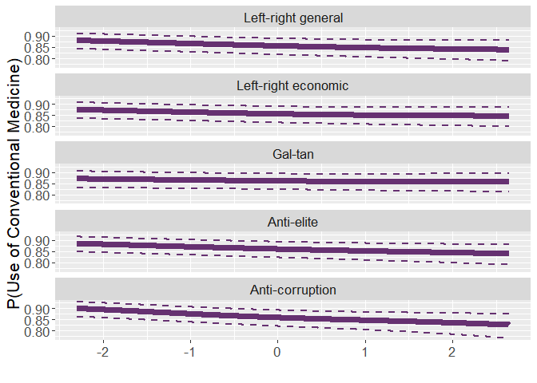
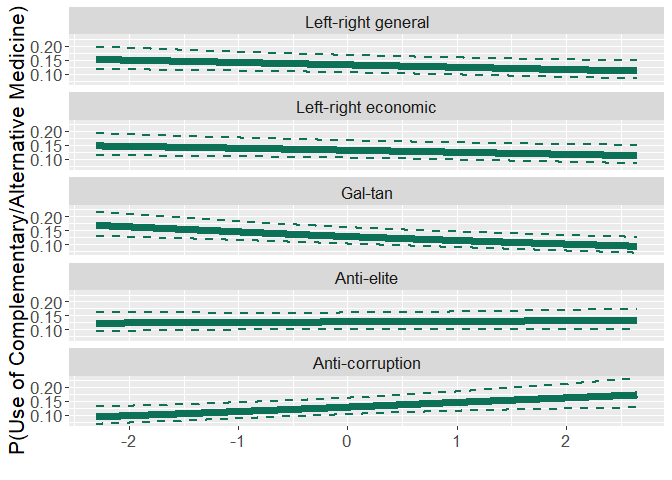
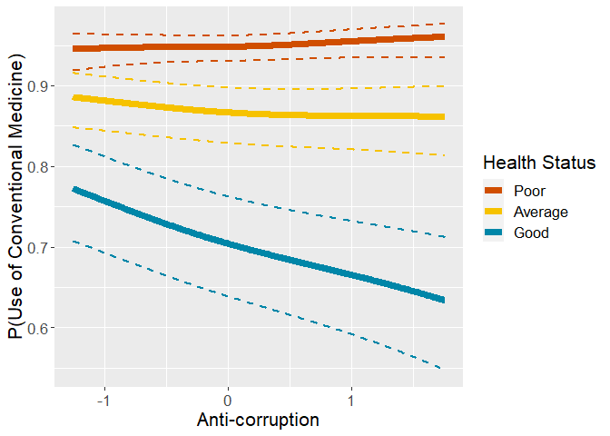
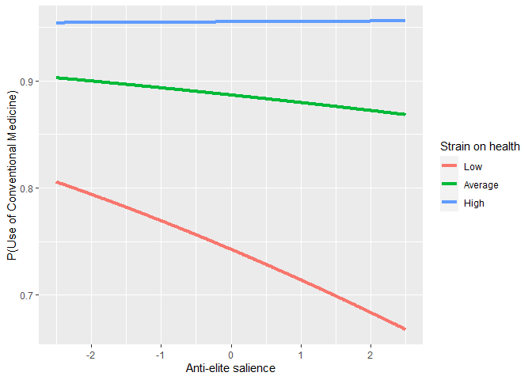

# Preparations

## Packages


```r
library(mclogit)
library(emmeans)
library(dplyr)
library(rio)
library(memisc)
library(psych)
library(ggplot2)
library(ggpubr)
library(lme4)
library(MetBrewer)
source("../custom_functions.R")
```
## Dataset


```r
fdat<-import("../../data/processed/fdat.xlsx")
```

## Data transformations

The reference levels for factorial variables need to be redefined, .xlsx format does not understand factor formats.

### Income


```r
fdat$income.f<-case_when(
  is.na(fdat$income) ~ "missing",
  TRUE ~ fdat$income
)

#define reference level (top quintile)
table(fdat$income.f,useNA="always")
```

```
## 
## missing quint.1 quint.2 quint.3 quint.4 quint.5    <NA> 
##    8296    6427    6999    6793    6408    5262       0
```

```r
fdat$income.fr = relevel(as.factor(fdat$income.f), ref="quint.5")
table(fdat$income.fr,useNA="always")
```

```
## 
## quint.5 missing quint.1 quint.2 quint.3 quint.4    <NA> 
##    5262    8296    6427    6999    6793    6408       0
```

### Education


```r
table(fdat$edu,useNA="always")
```

```
## 
## 1. <LS  2. LS 3. LUS 4. UUS  5. AV  6. BA  7. MA   <NA> 
##   4085   6760   7213   7094   5671   4366   4730    266
```

```r
fdat$edu.f<-relevel(as.factor(fdat$edu),ref="7. MA")
table(fdat$edu.f,useNA="always")
```

```
## 
##  7. MA 1. <LS  2. LS 3. LUS 4. UUS  5. AV  6. BA   <NA> 
##   4730   4085   6760   7213   7094   5671   4366    266
```

### DV


```r
table(fdat$DV,useNA="always")
```

```
## 
##                NN     Used_CAM_ONLY Used_conv_and_CAM    Used_conv_ONLY 
##              6877               503              5100             27705 
##              <NA> 
##                 0
```

```r
fdat$DV.f<-relevel(as.factor(fdat$DV),ref="NN")
table(fdat$DV.f,useNA="always")
```

```
## 
##                NN     Used_CAM_ONLY Used_conv_and_CAM    Used_conv_ONLY 
##              6877               503              5100             27705 
##              <NA> 
##                 0
```

### Strain on health and political orientation

Calculate country means for centering


```r
# Calculate country means for centering

cntry.means<-fdat %>%
  group_by(cntry) %>%
  summarise(strain.on.health.cntry.mean=
              mean(strain.on.health,na.rm=T),
            lrgen.cntry.mean=
              mean(lrgen,na.rm=T),
            lrecon.cntry.mean=
              mean(lrecon,na.rm=T),
            galtan.cntry.mean=
              mean(galtan,na.rm=T),
            antielite_salience.cntry.mean=
              mean(antielite_salience,na.rm=T),
            corrupt_salience.cntry.mean=
              mean(corrupt_salience,na.rm=T))

#combine data frames

fdat<-left_join(
  x=fdat,
  y=cntry.means,
  by="cntry"
)

#country-mean center strain on health

fdat$strain.on.health.c<-
  fdat$strain.on.health-fdat$strain.on.health.cntry.mean

#country-mean center political orientation

fdat$lrgen.c<-
  fdat$lrgen-fdat$lrgen.cntry.mean
fdat$lrecon.c<-
  fdat$lrecon-fdat$lrecon.cntry.mean
fdat$galtan.c<-
  fdat$galtan-fdat$galtan.cntry.mean
fdat$antielite_salience.c<-
  fdat$antielite_salience-fdat$antielite_salience.cntry.mean
fdat$corrupt_salience.c<-
  fdat$corrupt_salience-fdat$corrupt_salience.cntry.mean

#scale with CHES grand SD
fdat$lrgen.z<-
  fdat$lrgen.c/fdat$lrgen.scaling
fdat$lrecon.z<-
  fdat$lrecon.c/fdat$lrecon.scaling
fdat$galtan.z<-
  fdat$galtan.c/fdat$galtan.scaling
fdat$antielite_salience.z<-
  fdat$antielite_salience.c/fdat$antielite_salience.scaling
fdat$corrupt_salience.z<-
  fdat$corrupt_salience.c/fdat$corrupt_salience.scaling
```

## Exclude missing variable


```r
fdat<-fdat %>%
  filter(cntry!="IL" & cntry!="EE") %>%
  filter(!is.na(cntry) & 
         !is.na(gndr.c) &
         !is.na(age10.c) &
         !is.na(income.fr) &
           !is.na(edu.f) &
           !is.na(strain.on.health.c) &
           !is.na(DV) &
           !is.na(lrgen.z) &
           !is.na(lrecon.z) &
           !is.na(galtan.z) &
           !is.na(antielite_salience.z) &
           !is.na(corrupt_salience.z))
```

## Construct anweight variable for weighting


```r
fdat$anweight=fdat$pspwght*fdat$pweight
```

# Descriptive analysis

## Check the presence of all DV-groups across countries


```r
table(fdat$cntry,fdat$DV.f)
```

```
##     
##        NN Used_CAM_ONLY Used_conv_and_CAM Used_conv_ONLY
##   AT  115            18               206            718
##   BE  134             5               143            962
##   CH   89            25               131            397
##   CZ  145             4               160            755
##   DE  155            10               370           1507
##   DK  174             8               150            818
##   ES  106             7               111            807
##   FI  175            12               117           1016
##   FR   66             8               212            651
##   GB  201            10               138            951
##   HU  255             9                55            524
##   IE  255            13               103            903
##   LT  223            34               276            472
##   NL  238            17               111            968
##   NO  163             9               107            772
##   PL  122             6                49            593
##   PT   30             1                46            485
##   SE  312            17               135            947
##   SI   59             8                89            399
```

```r
round(100*prop.table(table(fdat$cntry,fdat$DV.f),
                     margin = 1),1)
```

```
##     
##        NN Used_CAM_ONLY Used_conv_and_CAM Used_conv_ONLY
##   AT 10.9           1.7              19.5           67.9
##   BE 10.8           0.4              11.5           77.3
##   CH 13.9           3.9              20.4           61.8
##   CZ 13.6           0.4              15.0           71.0
##   DE  7.6           0.5              18.1           73.8
##   DK 15.1           0.7              13.0           71.1
##   ES 10.3           0.7              10.8           78.3
##   FI 13.3           0.9               8.9           77.0
##   FR  7.0           0.9              22.6           69.5
##   GB 15.5           0.8              10.6           73.2
##   HU 30.2           1.1               6.5           62.2
##   IE 20.0           1.0               8.1           70.9
##   LT 22.2           3.4              27.5           47.0
##   NL 17.8           1.3               8.3           72.6
##   NO 15.5           0.9              10.2           73.5
##   PL 15.8           0.8               6.4           77.0
##   PT  5.3           0.2               8.2           86.3
##   SE 22.1           1.2               9.6           67.1
##   SI 10.6           1.4              16.0           71.9
```


# Analysis

## Empty model


```r
mod0<-mblogit(DV.f~1,
              random= ~1|cntry,
              estimator="ML",
              data=fdat,weights=anweight)
```

```
## 
## Iteration 1 - deviance = 30927.53 - criterion = 0.7408656
## Iteration 2 - deviance = 29867.42 - criterion = 0.2229412
## Iteration 3 - deviance = 29750.33 - criterion = 0.02726584
## Iteration 4 - deviance = 29734.34 - criterion = 0.004885409
## Iteration 5 - deviance = 29732.04 - criterion = 0.0001791504
## Iteration 6 - deviance = 29731.82 - criterion = 2.609763e-06
## Iteration 7 - deviance = 29731.84 - criterion = 6.826304e-08
## Iteration 8 - deviance = 29731.85 - criterion = 2.929665e-09
## converged
```

```r
mod0
```

```
## mblogit(formula = DV.f ~ 1, data = fdat, random = ~1 | cntry, 
##     weights = anweight, estimator = "ML")
## 
## Coefficients:
##                       Predictors
## Response categories     (Intercept)
##   Used_CAM_ONLY/NN      -2.6875    
##   Used_conv_and_CAM/NN  -0.1656    
##   Used_conv_ONLY/NN      1.5966    
## 
## (Co-)Variances:
## Grouping level: cntry 
##                      Used_CAM_ONLY~1  Used_conv_and_CAM~1  Used_conv_ONLY~1
## Used_CAM_ONLY~1       0.36106                                              
## Used_conv_and_CAM~1   0.20056          0.51447                             
## Used_conv_ONLY~1     -0.03003          0.23201              0.23705        
## 
## Null Deviance:     52210 
## Residual Deviance: 29730
```

```r
summary(mod0)
```

```
## 
## Call:
## mblogit(formula = DV.f ~ 1, data = fdat, random = ~1 | cntry, 
##     weights = anweight, estimator = "ML")
## 
## Equation for Used_CAM_ONLY vs NN:
##             Estimate Std. Error z value Pr(>|z|)    
## (Intercept)  -2.6875     0.1716  -15.66   <2e-16 ***
## 
## Equation for Used_conv_and_CAM vs NN:
##             Estimate Std. Error z value Pr(>|z|)
## (Intercept)  -0.1656     0.1712  -0.967    0.333
## 
## Equation for Used_conv_ONLY vs NN:
##             Estimate Std. Error z value Pr(>|z|)    
## (Intercept)   1.5966     0.1169   13.66   <2e-16 ***
## ---
## Signif. codes:  0 '***' 0.001 '**' 0.01 '*' 0.05 '.' 0.1 ' ' 1
## 
## (Co-)Variances:
## Grouping level: cntry 
##                     Estimate                     Std.Err.               
## Used_CAM_ONLY~1      0.36106                     0.03253                
## Used_conv_and_CAM~1  0.20056  0.51447            0.04895 0.08778        
## Used_conv_ONLY~1    -0.03003  0.23201  0.23705   0.02127 0.04186 0.02168
## 
## Null Deviance:     52210 
## Residual Deviance: 29730 
## Number of Fisher Scoring iterations:  8
## Number of observations
##   Groups by cntry: 19
##   Individual observations:  18832.14
```

```r
mtable(mod0,show.baselevel = T)
```

```
## 
## Calls:
## mod0: mblogit(formula = DV.f ~ 1, data = fdat, random = ~1 | cntry, 
##     weights = anweight, estimator = "ML")
## 
## ================================================================================================
##                                        Used_CAM_ONLY/NN Used_conv_and_CAM/NN Used_conv_ONLY/NN  
## ------------------------------------------------------------------------------------------------
##   (Intercept)                               -2.688***         -0.166              1.597***      
##                                             (0.172)           (0.171)            (0.117)        
## ------------------------------------------------------------------------------------------------
##   Used_CAM_ONLY/NN x  VCov(~1,~1)            0.361             0.201             -0.030         
##                                             (0.033)           (0.049)            (0.021)        
##   Used_conv_and_CAM/NN x  VCov(~1,~1)        0.201             0.514              0.232         
##                                             (0.049)           (0.088)            (0.042)        
##   Used_conv_ONLY/NN x  VCov(~1,~1)          -0.030             0.232              0.237         
##                                             (0.021)           (0.042)            (0.022)        
## ------------------------------------------------------------------------------------------------
##   Groups by cntry                           19                                                  
## ------------------------------------------------------------------------------------------------
##   Deviance                               29731.8                                                
##   N                                      18832                                                  
## ================================================================================================
##   Significance: *** = p < 0.001; ** = p < 0.01; * = p < 0.05
```

## Model with covariates


```r
mod1<-
  mblogit(DV.f~gndr.c+age10.c+income.fr+edu.f+
            strain.on.health.c,
              random= ~1|cntry,
              estimator="ML",
              data=fdat,weights=anweight)
```

```
## 
## Iteration 1 - deviance = 28781.04 - criterion = 0.7767357
## Iteration 2 - deviance = 27499.9 - criterion = 0.1513445
## Iteration 3 - deviance = 27338.32 - criterion = 0.02457903
## Iteration 4 - deviance = 27303.56 - criterion = 0.01365997
## Iteration 5 - deviance = 27297.23 - criterion = 0.004118173
## Iteration 6 - deviance = 27296.02 - criterion = 0.000782071
## Iteration 7 - deviance = 27295.79 - criterion = 3.475584e-05
## Iteration 8 - deviance = 27295.67 - criterion = 1.21444e-06
## Iteration 9 - deviance = 27295.64 - criterion = 1.166773e-08
## Iteration 10 - deviance = 27295.63 - criterion = 4.277055e-10
## converged
```

```r
summary(mod1)
```

```
## 
## Call:
## mblogit(formula = DV.f ~ gndr.c + age10.c + income.fr + edu.f + 
##     strain.on.health.c, data = fdat, random = ~1 | cntry, weights = anweight, 
##     estimator = "ML")
## 
## Equation for Used_CAM_ONLY vs NN:
##                    Estimate Std. Error z value Pr(>|z|)    
## (Intercept)        -1.32575    0.25975  -5.104 3.33e-07 ***
## gndr.c              0.35487    0.16912   2.098 0.035872 *  
## age10.c            -0.03133    0.05711  -0.549 0.583301    
## income.frmissing   -1.09846    0.38668  -2.841 0.004501 ** 
## income.frquint.1   -0.52130    0.38477  -1.355 0.175467    
## income.frquint.2   -0.07627    0.27207  -0.280 0.779233    
## income.frquint.3   -0.07641    0.24757  -0.309 0.757608    
## income.frquint.4   -0.24304    0.23589  -1.030 0.302852    
## edu.f1. <LS        -2.80360    0.86396  -3.245 0.001174 ** 
## edu.f2. LS         -1.19197    0.30864  -3.862 0.000112 ***
## edu.f3. LUS        -1.21584    0.27471  -4.426 9.61e-06 ***
## edu.f4. UUS        -1.36583    0.32235  -4.237 2.26e-05 ***
## edu.f5. AV         -0.61521    0.25478  -2.415 0.015749 *  
## edu.f6. BA         -0.76612    0.27654  -2.770 0.005599 ** 
## strain.on.health.c  0.26686    0.04714   5.661 1.50e-08 ***
## 
## Equation for Used_conv_and_CAM vs NN:
##                    Estimate Std. Error z value Pr(>|z|)    
## (Intercept)         0.54630    0.20252   2.698  0.00699 ** 
## gndr.c              1.17760    0.06321  18.631  < 2e-16 ***
## age10.c             0.09232    0.01978   4.667 3.05e-06 ***
## income.frmissing   -0.23597    0.11671  -2.022  0.04319 *  
## income.frquint.1   -0.09333    0.12151  -0.768  0.44243    
## income.frquint.2   -0.08379    0.10541  -0.795  0.42666    
## income.frquint.3   -0.06572    0.09978  -0.659  0.51011    
## income.frquint.4    0.02411    0.09324   0.259  0.79597    
## edu.f1. <LS        -1.12777    0.15490  -7.281 3.32e-13 ***
## edu.f2. LS         -0.63559    0.11547  -5.504 3.70e-08 ***
## edu.f3. LUS        -0.49391    0.10450  -4.726 2.29e-06 ***
## edu.f4. UUS        -0.46016    0.11641  -3.953 7.72e-05 ***
## edu.f5. AV         -0.30248    0.11070  -2.732  0.00629 ** 
## edu.f6. BA         -0.25620    0.11919  -2.150  0.03159 *  
## strain.on.health.c  0.54400    0.01749  31.110  < 2e-16 ***
## 
## Equation for Used_conv_ONLY vs NN:
##                     Estimate Std. Error z value Pr(>|z|)    
## (Intercept)         2.023116   0.145480  13.907   <2e-16 ***
## gndr.c              0.508383   0.048543  10.473   <2e-16 ***
## age10.c             0.196134   0.015303  12.817   <2e-16 ***
## income.frmissing   -0.148808   0.084150  -1.768   0.0770 .  
## income.frquint.1    0.055207   0.095012   0.581   0.5612    
## income.frquint.2   -0.007551   0.082445  -0.092   0.9270    
## income.frquint.3   -0.012090   0.077046  -0.157   0.8753    
## income.frquint.4   -0.019218   0.072854  -0.264   0.7919    
## edu.f1. <LS        -0.066607   0.114343  -0.583   0.5602    
## edu.f2. LS         -0.108945   0.088466  -1.231   0.2181    
## edu.f3. LUS        -0.139951   0.083434  -1.677   0.0935 .  
## edu.f4. UUS        -0.069058   0.088699  -0.779   0.4362    
## edu.f5. AV         -0.126224   0.089416  -1.412   0.1581    
## edu.f6. BA         -0.050234   0.092290  -0.544   0.5862    
## strain.on.health.c  0.412605   0.015919  25.919   <2e-16 ***
## ---
## Signif. codes:  0 '***' 0.001 '**' 0.01 '*' 0.05 '.' 0.1 ' ' 1
## 
## (Co-)Variances:
## Grouping level: cntry 
##                     Estimate                     Std.Err.               
## Used_CAM_ONLY~1      0.51369                     0.05330                
## Used_conv_and_CAM~1  0.06870  0.59190            0.05570 0.11408        
## Used_conv_ONLY~1    -0.09885  0.29154  0.28343   0.03470 0.06792 0.04320
## 
## Null Deviance:     52210 
## Residual Deviance: 27300 
## Number of Fisher Scoring iterations:  10
## Number of observations
##   Groups by cntry: 19
##   Individual observations:  18832.14
```

```r
mod1
```

```
## mblogit(formula = DV.f ~ gndr.c + age10.c + income.fr + edu.f + 
##     strain.on.health.c, data = fdat, random = ~1 | cntry, weights = anweight, 
##     estimator = "ML")
## 
## Coefficients:
##                       Predictors
## Response categories     (Intercept)  gndr.c     age10.c    income.frmissing
##   Used_CAM_ONLY/NN      -1.325751     0.354873  -0.031329  -1.098465       
##   Used_conv_and_CAM/NN   0.546297     1.177602   0.092317  -0.235970       
##   Used_conv_ONLY/NN      2.023116     0.508383   0.196134  -0.148808       
##                       Predictors
## Response categories     income.frquint.1  income.frquint.2  income.frquint.3
##   Used_CAM_ONLY/NN      -0.521302         -0.076266         -0.076406       
##   Used_conv_and_CAM/NN  -0.093334         -0.083790         -0.065719       
##   Used_conv_ONLY/NN      0.055207         -0.007551         -0.012090       
##                       Predictors
## Response categories     income.frquint.4  edu.f1. <LS  edu.f2. LS  edu.f3. LUS
##   Used_CAM_ONLY/NN      -0.243042         -2.803605    -1.191972   -1.215838  
##   Used_conv_and_CAM/NN   0.024108         -1.127770    -0.635589   -0.493906  
##   Used_conv_ONLY/NN     -0.019218         -0.066607    -0.108945   -0.139951  
##                       Predictors
## Response categories     edu.f4. UUS  edu.f5. AV  edu.f6. BA
##   Used_CAM_ONLY/NN      -1.365832    -0.615212   -0.766124 
##   Used_conv_and_CAM/NN  -0.460161    -0.302483   -0.256202 
##   Used_conv_ONLY/NN     -0.069058    -0.126224   -0.050234 
##                       Predictors
## Response categories     strain.on.health.c
##   Used_CAM_ONLY/NN       0.266865         
##   Used_conv_and_CAM/NN   0.543996         
##   Used_conv_ONLY/NN      0.412605         
## 
## (Co-)Variances:
## Grouping level: cntry 
##                      Used_CAM_ONLY~1  Used_conv_and_CAM~1  Used_conv_ONLY~1
## Used_CAM_ONLY~1       0.51369                                              
## Used_conv_and_CAM~1   0.06870          0.59190                             
## Used_conv_ONLY~1     -0.09885          0.29154              0.28343        
## 
## Null Deviance:     52210 
## Residual Deviance: 27300
```

```r
mtable(mod1,show.baselevel = T)
```

```
## 
## Calls:
## mod1: mblogit(formula = DV.f ~ gndr.c + age10.c + income.fr + edu.f + 
##     strain.on.health.c, data = fdat, random = ~1 | cntry, weights = anweight, 
##     estimator = "ML")
## 
## ================================================================================================
##                                        Used_CAM_ONLY/NN Used_conv_and_CAM/NN Used_conv_ONLY/NN  
## ------------------------------------------------------------------------------------------------
##   (Intercept)                               -1.326***         0.546**             2.023***      
##                                             (0.260)          (0.203)             (0.145)        
##   gndr.c                                     0.355*           1.178***            0.508***      
##                                             (0.169)          (0.063)             (0.049)        
##   age10.c                                   -0.031            0.092***            0.196***      
##                                             (0.057)          (0.020)             (0.015)        
##   income.fr: missing/quint.5                -1.098**         -0.236*             -0.149         
##                                             (0.387)          (0.117)             (0.084)        
##   income.fr: quint.1/quint.5                -0.521           -0.093               0.055         
##                                             (0.385)          (0.122)             (0.095)        
##   income.fr: quint.2/quint.5                -0.076           -0.084              -0.008         
##                                             (0.272)          (0.105)             (0.082)        
##   income.fr: quint.3/quint.5                -0.076           -0.066              -0.012         
##                                             (0.248)          (0.100)             (0.077)        
##   income.fr: quint.4/quint.5                -0.243            0.024              -0.019         
##                                             (0.236)          (0.093)             (0.073)        
##   edu.f: 1. <LS/7. MA                       -2.804**         -1.128***           -0.067         
##                                             (0.864)          (0.155)             (0.114)        
##   edu.f: 2. LS/7. MA                        -1.192***        -0.636***           -0.109         
##                                             (0.309)          (0.115)             (0.088)        
##   edu.f: 3. LUS/7. MA                       -1.216***        -0.494***           -0.140         
##                                             (0.275)          (0.105)             (0.083)        
##   edu.f: 4. UUS/7. MA                       -1.366***        -0.460***           -0.069         
##                                             (0.322)          (0.116)             (0.089)        
##   edu.f: 5. AV/7. MA                        -0.615*          -0.302**            -0.126         
##                                             (0.255)          (0.111)             (0.089)        
##   edu.f: 6. BA/7. MA                        -0.766**         -0.256*             -0.050         
##                                             (0.277)          (0.119)             (0.092)        
##   strain.on.health.c                         0.267***         0.544***            0.413***      
##                                             (0.047)          (0.017)             (0.016)        
## ------------------------------------------------------------------------------------------------
##   Used_CAM_ONLY/NN x  VCov(~1,~1)            0.514            0.069              -0.099         
##                                             (0.053)          (0.056)             (0.035)        
##   Used_conv_and_CAM/NN x  VCov(~1,~1)        0.069            0.592               0.292         
##                                             (0.056)          (0.114)             (0.068)        
##   Used_conv_ONLY/NN x  VCov(~1,~1)          -0.099            0.292               0.283         
##                                             (0.035)          (0.068)             (0.043)        
## ------------------------------------------------------------------------------------------------
##   Groups by cntry                           19                                                  
## ------------------------------------------------------------------------------------------------
##   Deviance                               27295.6                                                
##   N                                      18832                                                  
## ================================================================================================
##   Significance: *** = p < 0.001; ** = p < 0.01; * = p < 0.05
```

### Strain on health main effects


```r
mod1.strain.trends<-
  emtrends(mod1,~1|DV.f,
           var="strain.on.health.c",
           infer=T,mode="latent",
           at=list(gndr.c=0,age10.c=0))

#effects for each DV-category
(mod1.strain.eff<-
  contrast(mod1.strain.trends,simple="DV.f",
         adjust="none","eff",infer=c(T,T)))
```

```
##  contrast                 estimate     SE  df asymp.LCL asymp.UCL z.ratio
##  NN effect                  -0.306 0.0162 Inf   -0.3376   -0.2742 -18.906
##  Used_CAM_ONLY effect       -0.039 0.0338 Inf   -0.1053    0.0273  -1.153
##  Used_conv_and_CAM effect    0.238 0.0133 Inf    0.2121    0.2642  17.923
##  Used_conv_ONLY effect       0.107 0.0123 Inf    0.0825    0.1309   8.646
##  p.value
##   <.0001
##   0.2488
##   <.0001
##   <.0001
## 
## Results are averaged over the levels of: income.fr, edu.f 
## Confidence level used: 0.95
```

```r
#save to file
export(data.frame(mod1.strain.eff),
       "../../results/mod1.strain.eff.MN.xlsx",
       overwrite=T)

#Use of conventional medicine

(mod1.strain.eff.CM<-
  contrast(mod1.strain.trends,
           method = list("Conv - No conv" = contrast.weights.total(effects=mod1.strain.eff,
          signs=c(-2,-2,2,2))),
           simple="DV.f",
           infer=c(T,T)))
```

```
##  contrast       estimate     SE  df asymp.LCL asymp.UCL z.ratio p.value
##  Conv - No conv    0.384 0.0186 Inf     0.348     0.421  20.650  <.0001
## 
## Results are averaged over the levels of: income.fr, edu.f 
## Confidence level used: 0.95
```

```r
(mod1.strain.eff.CAM<-
    contrast(mod1.strain.trends,
         method = list("CAM - No CAM" = contrast.weights.total(effects=mod1.strain.eff,
                 signs=c(-2,2,2,-2))),
         simple="DV.f",
           infer=c(T,T)))
```

```
##  contrast     estimate     SE  df asymp.LCL asymp.UCL z.ratio p.value
##  CAM - No CAM    0.211 0.0127 Inf     0.186     0.236  16.535  <.0001
## 
## Results are averaged over the levels of: income.fr, edu.f 
## Confidence level used: 0.95
```

```r
# save to file
export(data.frame(rbind(mod1.strain.eff.CM,
      mod1.strain.eff.CAM,adjust="none")),
      "../../results/mod1.strain.eff.COMB.xlsx")
```

### gender main effects


```r
mod1.gndr.trends<-
  emtrends(mod1,~1|DV.f,
           var="gndr.c",
           infer=T,mode="latent",
           at=list(strain.on.health.c=0,age10.c=0))

#effects for each DV-category
(mod1.gndr.eff<-
  contrast(mod1.gndr.trends,simple="DV.f",
         adjust="none","eff",infer=c(T,T)))
```

```
##  contrast                 estimate     SE  df asymp.LCL asymp.UCL z.ratio
##  NN effect                -0.51021 0.0542 Inf   -0.6164   -0.4040  -9.415
##  Used_CAM_ONLY effect     -0.15534 0.1236 Inf   -0.3976    0.0869  -1.257
##  Used_conv_and_CAM effect  0.66739 0.0537 Inf    0.5621    0.7727  12.424
##  Used_conv_ONLY effect    -0.00183 0.0459 Inf   -0.0917    0.0881  -0.040
##  p.value
##   <.0001
##   0.2088
##   <.0001
##   0.9682
## 
## Results are averaged over the levels of: gndr.c, income.fr, edu.f 
## Confidence level used: 0.95
```

```r
#save to file
export(data.frame(mod1.gndr.eff),
       "../../results/mod1.gndr.eff.MN.xlsx",
       overwrite=T)

#Use of conventional medicine

(mod1.gndr.eff.CM<-
  contrast(mod1.gndr.trends,
           method = list("Conv - No conv" = contrast.weights.total(effects=mod1.gndr.eff,
          signs=c(-2,-2,2,2))),
           simple="DV.f",
           infer=c(T,T)))
```

```
##  contrast       estimate     SE  df asymp.LCL asymp.UCL z.ratio p.value
##  Conv - No conv    0.675 0.0599 Inf     0.558     0.792  11.264  <.0001
## 
## Results are averaged over the levels of: gndr.c, income.fr, edu.f 
## Confidence level used: 0.95
```

```r
(mod1.gndr.eff.CAM<-
    contrast(mod1.gndr.trends,
         method = list("CAM - No CAM" = contrast.weights.total(effects=mod1.gndr.eff,
                 signs=c(-2,2,2,-2))),
         simple="DV.f",
           infer=c(T,T)))
```

```
##  contrast     estimate     SE  df asymp.LCL asymp.UCL z.ratio p.value
##  CAM - No CAM    0.645 0.0582 Inf     0.531     0.759  11.076  <.0001
## 
## Results are averaged over the levels of: gndr.c, income.fr, edu.f 
## Confidence level used: 0.95
```

```r
# save to file
export(data.frame(rbind(mod1.gndr.eff.CM,
      mod1.gndr.eff.CAM,adjust="none")),
      "../../results/mod1.gndr.eff.COMB.xlsx")
```


### age main effects


```r
mod1.age10.trends<-
  emtrends(mod1,~1|DV.f,
           var="age10.c",
           infer=T,mode="latent",
           at=list(strain.on.health.c=0,gndr.c=0))

#effects for each DV-category
(mod1.age10.eff<-
  contrast(mod1.age10.trends,simple="DV.f",
         adjust="none","eff",infer=c(T,T)))
```

```
##  contrast                 estimate     SE  df asymp.LCL asymp.UCL z.ratio
##  NN effect                 -0.0643 0.0178 Inf  -0.09921   -0.0293  -3.606
##  Used_CAM_ONLY effect      -0.0956 0.0419 Inf  -0.17771   -0.0135  -2.283
##  Used_conv_and_CAM effect   0.0280 0.0176 Inf  -0.00643    0.0625   1.594
##  Used_conv_ONLY effect      0.1319 0.0153 Inf   0.10182    0.1619   8.605
##  p.value
##   0.0003
##   0.0225
##   0.1109
##   <.0001
## 
## Results are averaged over the levels of: income.fr, edu.f 
## Confidence level used: 0.95
```

```r
#save to file
export(data.frame(mod1.age10.eff),
       "../../results/mod1.age10.eff.MN.xlsx",
       overwrite=T)

#Use of conventional medicine

(mod1.age10.eff.CM<-
  contrast(mod1.age10.trends,
           method = list("Conv - No conv" = contrast.weights.total(effects=mod1.age10.eff,
          signs=c(-2,-2,2,2))),
           simple="DV.f",
           infer=c(T,T)))
```

```
##  contrast       estimate     SE  df asymp.LCL asymp.UCL z.ratio p.value
##  Conv - No conv    0.162 0.0196 Inf     0.124     0.201   8.295  <.0001
## 
## Results are averaged over the levels of: income.fr, edu.f 
## Confidence level used: 0.95
```

```r
(mod1.age10.eff.CAM<-
    contrast(mod1.age10.trends,
         method = list("CAM - No CAM" = contrast.weights.total(effects=mod1.age10.eff,
                 signs=c(-2,2,2,-2))),
         simple="DV.f",
           infer=c(T,T)))
```

```
##  contrast     estimate     SE  df asymp.LCL asymp.UCL z.ratio p.value
##  CAM - No CAM  -0.0576 0.0188 Inf   -0.0945   -0.0208  -3.069  0.0021
## 
## Results are averaged over the levels of: income.fr, edu.f 
## Confidence level used: 0.95
```

```r
# save to file
export(data.frame(rbind(mod1.age10.eff.CM,
      mod1.age10.eff.CAM,adjust="none")),
      "../../results/mod1.age10.eff.COMB.xlsx")
```


### education main effects


```r
# first take probabilities for all categories
mod1.edu.f.trends<-emmeans(mod1,by="DV.f",
        specs="edu.f",
        infer=T,mode="prob",
        at=list(strain.on.health.c=0,gndr.c=0,age10.c=0))

mod1.edu.f.trends
```

```
## DV.f = NN:
##  edu.f     prob      SE  df asymp.LCL asymp.UCL z.ratio p.value
##  7. MA  0.09820 0.01253 Inf   0.07364   0.12276   7.835  <.0001
##  1. <LS 0.11848 0.01632 Inf   0.08648   0.15047   7.258  <.0001
##  2. LS  0.11721 0.01451 Inf   0.08877   0.14565   8.078  <.0001
##  3. LUS 0.11825 0.01438 Inf   0.09007   0.14642   8.225  <.0001
##  4. UUS 0.11168 0.01395 Inf   0.08434   0.13903   8.005  <.0001
##  5. AV  0.11364 0.01426 Inf   0.08570   0.14158   7.971  <.0001
##  6. BA  0.10690 0.01381 Inf   0.07984   0.13396   7.742  <.0001
## 
## DV.f = Used_CAM_ONLY:
##  edu.f     prob      SE  df asymp.LCL asymp.UCL z.ratio p.value
##  7. MA  0.01957 0.00533 Inf   0.00911   0.03002   3.668  0.0002
##  1. <LS 0.00143 0.00125 Inf  -0.00101   0.00388   1.151  0.2497
##  2. LS  0.00710 0.00241 Inf   0.00238   0.01183   2.946  0.0032
##  3. LUS 0.00700 0.00219 Inf   0.00270   0.01130   3.191  0.0014
##  4. UUS 0.00569 0.00203 Inf   0.00172   0.00966   2.809  0.0050
##  5. AV  0.01225 0.00364 Inf   0.00512   0.01938   3.368  0.0008
##  6. BA  0.00991 0.00320 Inf   0.00365   0.01618   3.102  0.0019
## 
## DV.f = Used_conv_and_CAM:
##  edu.f     prob      SE  df asymp.LCL asymp.UCL z.ratio p.value
##  7. MA  0.15711 0.01851 Inf   0.12083   0.19339   8.487  <.0001
##  1. <LS 0.06141 0.00935 Inf   0.04308   0.07975   6.566  <.0001
##  2. LS  0.09937 0.01283 Inf   0.07422   0.12451   7.745  <.0001
##  3. LUS 0.11550 0.01418 Inf   0.08771   0.14328   8.148  <.0001
##  4. UUS 0.11283 0.01444 Inf   0.08454   0.14113   7.815  <.0001
##  5. AV  0.13439 0.01638 Inf   0.10229   0.16649   8.206  <.0001
##  6. BA  0.13241 0.01681 Inf   0.09946   0.16536   7.875  <.0001
## 
## DV.f = Used_conv_ONLY:
##  edu.f     prob      SE  df asymp.LCL asymp.UCL z.ratio p.value
##  7. MA  0.72513 0.02122 Inf   0.68353   0.76672  34.170  <.0001
##  1. <LS 0.81867 0.01747 Inf   0.78443   0.85292  46.856  <.0001
##  2. LS  0.77632 0.01783 Inf   0.74137   0.81126  43.538  <.0001
##  3. LUS 0.75926 0.01820 Inf   0.72359   0.79493  41.721  <.0001
##  4. UUS 0.76980 0.01815 Inf   0.73421   0.80538  42.403  <.0001
##  5. AV  0.73972 0.01992 Inf   0.70067   0.77877  37.126  <.0001
##  6. BA  0.75078 0.01994 Inf   0.71169   0.78986  37.649  <.0001
## 
## Results are averaged over the levels of: income.fr 
## Confidence level used: 0.95
```

```r
export(data.frame(mod1.edu.f.trends),
       "../../results/mod1.edu.f.eff.MN.xlsx",
       overwrite=T)


#effects for each DV-category
(mod1.edu.f.eff<-
    contrast(mod1.edu.f.trends,#simple="edu.f",
             adjust="none","eff",infer=c(T,T)))
```

```
## DV.f = NN:
##  contrast       estimate      SE  df asymp.LCL asymp.UCL z.ratio p.value
##  7. MA effect  -0.013851 0.00554 Inf  -0.02470 -3.00e-03  -2.501  0.0124
##  1. <LS effect  0.006426 0.00867 Inf  -0.01056  2.34e-02   0.741  0.4585
##  2. LS effect   0.005161 0.00586 Inf  -0.00632  1.66e-02   0.881  0.3785
##  3. LUS effect  0.006195 0.00543 Inf  -0.00444  1.68e-02   1.141  0.2538
##  4. UUS effect -0.000368 0.00584 Inf  -0.01182  1.11e-02  -0.063  0.9499
##  5. AV effect   0.001588 0.00595 Inf  -0.01006  1.32e-02   0.267  0.7894
##  6. BA effect  -0.005152 0.00615 Inf  -0.01720  6.89e-03  -0.838  0.4019
## 
## DV.f = Used_CAM_ONLY:
##  contrast       estimate      SE  df asymp.LCL asymp.UCL z.ratio p.value
##  7. MA effect   0.010572 0.00352 Inf   0.00366  1.75e-02   3.000  0.0027
##  1. <LS effect -0.007560 0.00216 Inf  -0.01178 -3.34e-03  -3.508  0.0005
##  2. LS effect  -0.001889 0.00178 Inf  -0.00538  1.61e-03  -1.060  0.2894
##  3. LUS effect -0.001996 0.00157 Inf  -0.00507  1.08e-03  -1.274  0.2028
##  4. UUS effect -0.003305 0.00171 Inf  -0.00666  4.81e-05  -1.932  0.0534
##  5. AV effect   0.003259 0.00224 Inf  -0.00114  7.65e-03   1.453  0.1463
##  6. BA effect   0.000919 0.00204 Inf  -0.00308  4.92e-03   0.451  0.6523
## 
## DV.f = Used_conv_and_CAM:
##  contrast       estimate      SE  df asymp.LCL asymp.UCL z.ratio p.value
##  7. MA effect   0.040961 0.00767 Inf   0.02592  5.60e-02   5.339  <.0001
##  1. <LS effect -0.054731 0.00783 Inf  -0.07008 -3.94e-02  -6.987  <.0001
##  2. LS effect  -0.016777 0.00550 Inf  -0.02757 -5.99e-03  -3.048  0.0023
##  3. LUS effect -0.000649 0.00483 Inf  -0.01012  8.83e-03  -0.134  0.8933
##  4. UUS effect -0.003313 0.00626 Inf  -0.01557  8.95e-03  -0.530  0.5964
##  5. AV effect   0.018244 0.00625 Inf   0.00600  3.05e-02   2.921  0.0035
##  6. BA effect   0.016265 0.00747 Inf   0.00162  3.09e-02   2.177  0.0295
## 
## DV.f = Used_conv_ONLY:
##  contrast       estimate      SE  df asymp.LCL asymp.UCL z.ratio p.value
##  7. MA effect  -0.037683 0.00908 Inf  -0.05549 -1.99e-02  -4.148  <.0001
##  1. <LS effect  0.055864 0.01097 Inf   0.03436  7.74e-02   5.091  <.0001
##  2. LS effect   0.013506 0.00754 Inf  -0.00127  2.83e-02   1.791  0.0732
##  3. LUS effect -0.003550 0.00679 Inf  -0.01686  9.76e-03  -0.523  0.6011
##  4. UUS effect  0.006986 0.00810 Inf  -0.00888  2.29e-02   0.863  0.3882
##  5. AV effect  -0.023091 0.00809 Inf  -0.03895 -7.23e-03  -2.853  0.0043
##  6. BA effect  -0.012032 0.00914 Inf  -0.02995  5.88e-03  -1.316  0.1880
## 
## Results are averaged over the levels of: income.fr 
## Confidence level used: 0.95
```

```r
#save to file
export(data.frame(mod1.edu.f.eff),
       "../../results/mod1.edu.f.eff.MN.xlsx",
       overwrite=T)

# No Conv versus Conv

(mod1.edu.f.eff_DV<-
    contrast(mod1.edu.f.trends,simple="DV.f",
             adjust="none","eff",infer=c(T,T)))
```

```
## edu.f = 7. MA:
##  contrast                 estimate      SE  df asymp.LCL asymp.UCL  z.ratio
##  NN effect                 -0.1518 0.01253 Inf    -0.176   -0.1272  -12.112
##  Used_CAM_ONLY effect      -0.2304 0.00533 Inf    -0.241   -0.2200  -43.194
##  Used_conv_and_CAM effect  -0.0929 0.01851 Inf    -0.129   -0.0566   -5.018
##  Used_conv_ONLY effect      0.4751 0.02122 Inf     0.434    0.5167   22.389
##  p.value
##   <.0001
##   <.0001
##   <.0001
##   <.0001
## 
## edu.f = 1. <LS:
##  contrast                 estimate      SE  df asymp.LCL asymp.UCL  z.ratio
##  NN effect                 -0.1315 0.01632 Inf    -0.164   -0.0995   -8.057
##  Used_CAM_ONLY effect      -0.2486 0.00125 Inf    -0.251   -0.2461 -199.478
##  Used_conv_and_CAM effect  -0.1886 0.00935 Inf    -0.207   -0.1703  -20.164
##  Used_conv_ONLY effect      0.5687 0.01747 Inf     0.534    0.6029   32.548
##  p.value
##   <.0001
##   <.0001
##   <.0001
##   <.0001
## 
## edu.f = 2. LS:
##  contrast                 estimate      SE  df asymp.LCL asymp.UCL  z.ratio
##  NN effect                 -0.1328 0.01451 Inf    -0.161   -0.1043   -9.152
##  Used_CAM_ONLY effect      -0.2429 0.00241 Inf    -0.248   -0.2382 -100.710
##  Used_conv_and_CAM effect  -0.1506 0.01283 Inf    -0.176   -0.1255  -11.741
##  Used_conv_ONLY effect      0.5263 0.01783 Inf     0.491    0.5613   29.517
##  p.value
##   <.0001
##   <.0001
##   <.0001
##   <.0001
## 
## edu.f = 3. LUS:
##  contrast                 estimate      SE  df asymp.LCL asymp.UCL  z.ratio
##  NN effect                 -0.1318 0.01438 Inf    -0.160   -0.1036   -9.165
##  Used_CAM_ONLY effect      -0.2430 0.00219 Inf    -0.247   -0.2387 -110.809
##  Used_conv_and_CAM effect  -0.1345 0.01418 Inf    -0.162   -0.1067   -9.488
##  Used_conv_ONLY effect      0.5093 0.01820 Inf     0.474    0.5449   27.984
##  p.value
##   <.0001
##   <.0001
##   <.0001
##   <.0001
## 
## edu.f = 4. UUS:
##  contrast                 estimate      SE  df asymp.LCL asymp.UCL  z.ratio
##  NN effect                 -0.1383 0.01395 Inf    -0.166   -0.1110   -9.914
##  Used_CAM_ONLY effect      -0.2443 0.00203 Inf    -0.248   -0.2403 -120.643
##  Used_conv_and_CAM effect  -0.1372 0.01444 Inf    -0.165   -0.1089   -9.501
##  Used_conv_ONLY effect      0.5198 0.01815 Inf     0.484    0.5554   28.632
##  p.value
##   <.0001
##   <.0001
##   <.0001
##   <.0001
## 
## edu.f = 5. AV:
##  contrast                 estimate      SE  df asymp.LCL asymp.UCL  z.ratio
##  NN effect                 -0.1364 0.01426 Inf    -0.164   -0.1084   -9.565
##  Used_CAM_ONLY effect      -0.2377 0.00364 Inf    -0.245   -0.2306  -65.348
##  Used_conv_and_CAM effect  -0.1156 0.01638 Inf    -0.148   -0.0835   -7.059
##  Used_conv_ONLY effect      0.4897 0.01992 Inf     0.451    0.5288   24.579
##  p.value
##   <.0001
##   <.0001
##   <.0001
##   <.0001
## 
## edu.f = 6. BA:
##  contrast                 estimate      SE  df asymp.LCL asymp.UCL  z.ratio
##  NN effect                 -0.1431 0.01381 Inf    -0.170   -0.1160  -10.363
##  Used_CAM_ONLY effect      -0.2401 0.00320 Inf    -0.246   -0.2338  -75.118
##  Used_conv_and_CAM effect  -0.1176 0.01681 Inf    -0.151   -0.0846   -6.994
##  Used_conv_ONLY effect      0.5008 0.01994 Inf     0.462    0.5399   25.113
##  p.value
##   <.0001
##   <.0001
##   <.0001
##   <.0001
## 
## Results are averaged over the levels of: income.fr 
## Confidence level used: 0.95
```

```r
(mod1.edu.f.eff.CM<-
    contrast(mod1.edu.f.trends,
             method = 
               list("Conv - No conv" = c(0,0,1,1)),
             simple="DV.f",
             infer=c(T,T)))
```

```
## edu.f = 7. MA:
##  contrast       estimate     SE  df asymp.LCL asymp.UCL z.ratio p.value
##  Conv - No conv    0.882 0.0156 Inf     0.852     0.913  56.718  <.0001
## 
## edu.f = 1. <LS:
##  contrast       estimate     SE  df asymp.LCL asymp.UCL z.ratio p.value
##  Conv - No conv    0.880 0.0165 Inf     0.848     0.912  53.244  <.0001
## 
## edu.f = 2. LS:
##  contrast       estimate     SE  df asymp.LCL asymp.UCL z.ratio p.value
##  Conv - No conv    0.876 0.0155 Inf     0.845     0.906  56.330  <.0001
## 
## edu.f = 3. LUS:
##  contrast       estimate     SE  df asymp.LCL asymp.UCL z.ratio p.value
##  Conv - No conv    0.875 0.0154 Inf     0.845     0.905  56.860  <.0001
## 
## edu.f = 4. UUS:
##  contrast       estimate     SE  df asymp.LCL asymp.UCL z.ratio p.value
##  Conv - No conv    0.883 0.0148 Inf     0.854     0.912  59.737  <.0001
## 
## edu.f = 5. AV:
##  contrast       estimate     SE  df asymp.LCL asymp.UCL z.ratio p.value
##  Conv - No conv    0.874 0.0160 Inf     0.843     0.906  54.463  <.0001
## 
## edu.f = 6. BA:
##  contrast       estimate     SE  df asymp.LCL asymp.UCL z.ratio p.value
##  Conv - No conv    0.883 0.0153 Inf     0.853     0.913  57.845  <.0001
## 
## Results are averaged over the levels of: income.fr 
## Confidence level used: 0.95
```

```r
(mod1.edu.f.eff.CM_comp<-
  contrast(mod1.edu.f.eff.CM,
         simple="edu.f",method="eff",
         infer=c(T,T),adjust="none"))
```

```
## contrast = Conv - No conv:
##  contrast1     estimate      SE  df asymp.LCL asymp.UCL z.ratio p.value
##  7. MA effect   0.00328 0.00607 Inf  -0.00862   0.01518   0.540  0.5892
##  1. <LS effect  0.00113 0.00877 Inf  -0.01606   0.01832   0.129  0.8972
##  2. LS effect  -0.00327 0.00607 Inf  -0.01517   0.00862  -0.539  0.5898
##  3. LUS effect -0.00420 0.00560 Inf  -0.01517   0.00678  -0.750  0.4534
##  4. UUS effect  0.00367 0.00608 Inf  -0.00824   0.01559   0.604  0.5458
##  5. AV effect  -0.00485 0.00631 Inf  -0.01722   0.00752  -0.768  0.4426
##  6. BA effect   0.00423 0.00645 Inf  -0.00841   0.01688   0.656  0.5117
## 
## Results are averaged over the levels of: income.fr 
## Confidence level used: 0.95
```

```r
# No CAM versus CAM


(mod1.edu.f.eff.CAM<-
    contrast(mod1.edu.f.trends,
             method = 
               list("CAM - No CAM" = c(0,1,1,0)),
             simple="DV.f",
             infer=c(T,T)))
```

```
## edu.f = 7. MA:
##  contrast     estimate      SE  df asymp.LCL asymp.UCL z.ratio p.value
##  CAM - No CAM   0.1767 0.01953 Inf    0.1384    0.2149   9.047  <.0001
## 
## edu.f = 1. <LS:
##  contrast     estimate      SE  df asymp.LCL asymp.UCL z.ratio p.value
##  CAM - No CAM   0.0628 0.00947 Inf    0.0443    0.0814   6.635  <.0001
## 
## edu.f = 2. LS:
##  contrast     estimate      SE  df asymp.LCL asymp.UCL z.ratio p.value
##  CAM - No CAM   0.1065 0.01323 Inf    0.0805    0.1324   8.048  <.0001
## 
## edu.f = 3. LUS:
##  contrast     estimate      SE  df asymp.LCL asymp.UCL z.ratio p.value
##  CAM - No CAM   0.1225 0.01452 Inf    0.0940    0.1509   8.437  <.0001
## 
## edu.f = 4. UUS:
##  contrast     estimate      SE  df asymp.LCL asymp.UCL z.ratio p.value
##  CAM - No CAM   0.1185 0.01472 Inf    0.0897    0.1474   8.053  <.0001
## 
## edu.f = 5. AV:
##  contrast     estimate      SE  df asymp.LCL asymp.UCL z.ratio p.value
##  CAM - No CAM   0.1466 0.01700 Inf    0.1133    0.1800   8.625  <.0001
## 
## edu.f = 6. BA:
##  contrast     estimate      SE  df asymp.LCL asymp.UCL z.ratio p.value
##  CAM - No CAM   0.1423 0.01730 Inf    0.1084    0.1762   8.225  <.0001
## 
## Results are averaged over the levels of: income.fr 
## Confidence level used: 0.95
```

```r
(mod1.edu.f.eff.CAM_comp<-
    contrast(mod1.edu.f.eff.CAM,
             simple="edu.f",method="eff",
             infer=c(T,T),adjust="none"))
```

```
## contrast = CAM - No CAM:
##  contrast1     estimate      SE  df asymp.LCL asymp.UCL z.ratio p.value
##  7. MA effect   0.05153 0.00834 Inf   0.03519   0.06788   6.180  <.0001
##  1. <LS effect -0.06229 0.00821 Inf  -0.07838  -0.04620  -7.588  <.0001
##  2. LS effect  -0.01867 0.00573 Inf  -0.02989  -0.00744  -3.259  0.0011
##  3. LUS effect -0.00264 0.00503 Inf  -0.01250   0.00721  -0.526  0.5990
##  4. UUS effect -0.00662 0.00643 Inf  -0.01923   0.00599  -1.029  0.3036
##  5. AV effect   0.02150 0.00656 Inf   0.00865   0.03436   3.278  0.0010
##  6. BA effect   0.01718 0.00768 Inf   0.00214   0.03223   2.238  0.0252
## 
## Results are averaged over the levels of: income.fr 
## Confidence level used: 0.95
```

```r
# save to file
export(data.frame(rbind(mod1.edu.f.eff.CM_comp,
                        mod1.edu.f.eff.CAM_comp,adjust="none")),
       "../../results/mod1.edu.f.eff.COMB_comp.xlsx",overwrite=T)

# save to file
export(data.frame(rbind(mod1.edu.f.eff.CM,
                        mod1.edu.f.eff.CAM,adjust="none")),
       "../../results/mod1.edu.f.eff.COMB.xlsx",overwrite=T)
```


### income main effects


```r
# first take probabilities for all categories
mod1.income.fr.trends<-emmeans(mod1,by="DV.f",
        specs="income.fr",
        infer=T,mode="prob",
        at=list(strain.on.health.c=0,gndr.c=0,age10.c=0))

mod1.income.fr.trends
```

```
## DV.f = NN:
##  income.fr    prob      SE  df asymp.LCL asymp.UCL z.ratio p.value
##  quint.5   0.10877 0.01334 Inf  0.082617   0.13491   8.152  <.0001
##  missing   0.12615 0.01577 Inf  0.095235   0.15706   7.999  <.0001
##  quint.1   0.10582 0.01389 Inf  0.078597   0.13305   7.618  <.0001
##  quint.2   0.11056 0.01371 Inf  0.083684   0.13743   8.064  <.0001
##  quint.3   0.11071 0.01354 Inf  0.084171   0.13725   8.175  <.0001
##  quint.4   0.11030 0.01346 Inf  0.083917   0.13669   8.193  <.0001
## 
## DV.f = Used_CAM_ONLY:
##  income.fr    prob      SE  df asymp.LCL asymp.UCL z.ratio p.value
##  quint.5   0.01160 0.00315 Inf  0.005422   0.01778   3.680  0.0002
##  missing   0.00451 0.00188 Inf  0.000825   0.00819   2.399  0.0165
##  quint.1   0.00673 0.00273 Inf  0.001375   0.01209   2.463  0.0138
##  quint.2   0.01094 0.00335 Inf  0.004375   0.01751   3.265  0.0011
##  quint.3   0.01095 0.00317 Inf  0.004738   0.01717   3.454  0.0006
##  quint.4   0.00923 0.00264 Inf  0.004050   0.01441   3.493  0.0005
## 
## DV.f = Used_conv_and_CAM:
##  income.fr    prob      SE  df asymp.LCL asymp.UCL z.ratio p.value
##  quint.5   0.12153 0.01464 Inf  0.092840   0.15022   8.302  <.0001
##  missing   0.11156 0.01469 Inf  0.082777   0.14035   7.596  <.0001
##  quint.1   0.10792 0.01389 Inf  0.080686   0.13515   7.767  <.0001
##  quint.2   0.11369 0.01400 Inf  0.086256   0.14112   8.122  <.0001
##  quint.3   0.11591 0.01412 Inf  0.088230   0.14358   8.208  <.0001
##  quint.4   0.12626 0.01503 Inf  0.096800   0.15572   8.400  <.0001
## 
## DV.f = Used_conv_ONLY:
##  income.fr    prob      SE  df asymp.LCL asymp.UCL z.ratio p.value
##  quint.5   0.75810 0.01845 Inf  0.721943   0.79426  41.091  <.0001
##  missing   0.75778 0.01918 Inf  0.720190   0.79538  39.507  <.0001
##  quint.1   0.77953 0.01807 Inf  0.744116   0.81494  43.142  <.0001
##  quint.2   0.76481 0.01831 Inf  0.728929   0.80069  41.776  <.0001
##  quint.3   0.76243 0.01823 Inf  0.726699   0.79815  41.826  <.0001
##  quint.4   0.75421 0.01838 Inf  0.718180   0.79023  41.033  <.0001
## 
## Results are averaged over the levels of: edu.f 
## Confidence level used: 0.95
```

```r
export(data.frame(mod1.income.fr.trends),
       "../../results/mod1.income.fr.eff.MN.xlsx",
       overwrite=T)


#effects for each DV-category
(mod1.income.fr.eff<-
    contrast(mod1.income.fr.trends,#simple="income.fr",
             adjust="none","eff",infer=c(T,T)))
```

```
## DV.f = NN:
##  contrast        estimate      SE  df asymp.LCL asymp.UCL z.ratio p.value
##  quint.5 effect -0.003286 0.00493 Inf -0.012951  0.006380  -0.666  0.5052
##  missing effect  0.014094 0.00643 Inf  0.001500  0.026689   2.193  0.0283
##  quint.1 effect -0.006228 0.00641 Inf -0.018790  0.006333  -0.972  0.3312
##  quint.2 effect -0.001496 0.00544 Inf -0.012155  0.009164  -0.275  0.7833
##  quint.3 effect -0.001338 0.00501 Inf -0.011156  0.008480  -0.267  0.7894
##  quint.4 effect -0.001747 0.00481 Inf -0.011171  0.007677  -0.363  0.7164
## 
## DV.f = Used_CAM_ONLY:
##  contrast        estimate      SE  df asymp.LCL asymp.UCL z.ratio p.value
##  quint.5 effect  0.002607 0.00174 Inf -0.000810  0.006024   1.495  0.1349
##  missing effect -0.004487 0.00180 Inf -0.008021 -0.000953  -2.488  0.0128
##  quint.1 effect -0.002264 0.00208 Inf -0.006335  0.001807  -1.090  0.2758
##  quint.2 effect  0.001950 0.00206 Inf -0.002082  0.005981   0.948  0.3432
##  quint.3 effect  0.001960 0.00185 Inf -0.001663  0.005583   1.060  0.2891
##  quint.4 effect  0.000235 0.00153 Inf -0.002769  0.003238   0.153  0.8784
## 
## DV.f = Used_conv_and_CAM:
##  contrast        estimate      SE  df asymp.LCL asymp.UCL z.ratio p.value
##  quint.5 effect  0.005386 0.00508 Inf -0.004574  0.015346   1.060  0.2892
##  missing effect -0.004582 0.00651 Inf -0.017340  0.008176  -0.704  0.4815
##  quint.1 effect -0.008228 0.00579 Inf -0.019577  0.003121  -1.421  0.1553
##  quint.2 effect -0.002455 0.00498 Inf -0.012222  0.007311  -0.493  0.6222
##  quint.3 effect -0.000238 0.00491 Inf -0.009867  0.009390  -0.049  0.9613
##  quint.4 effect  0.010117 0.00497 Inf  0.000385  0.019850   2.037  0.0416
## 
## DV.f = Used_conv_ONLY:
##  contrast        estimate      SE  df asymp.LCL asymp.UCL z.ratio p.value
##  quint.5 effect -0.004707 0.00673 Inf -0.017896  0.008482  -0.700  0.4842
##  missing effect -0.005026 0.00850 Inf -0.021677  0.011626  -0.592  0.5542
##  quint.1 effect  0.016720 0.00812 Inf  0.000796  0.032644   2.058  0.0396
##  quint.2 effect  0.002001 0.00697 Inf -0.011662  0.015664   0.287  0.7741
##  quint.3 effect -0.000383 0.00664 Inf -0.013406  0.012639  -0.058  0.9540
##  quint.4 effect -0.008605 0.00650 Inf -0.021350  0.004140  -1.323  0.1857
## 
## Results are averaged over the levels of: edu.f 
## Confidence level used: 0.95
```

```r
#save to file
export(data.frame(mod1.income.fr.eff),
       "../../results/mod1.income.fr.eff.MN.xlsx",
       overwrite=T)

# No Conv versus Conv

(mod1.income.fr.eff_DV<-
    contrast(mod1.income.fr.trends,simple="DV.f",
             adjust="none","eff",infer=c(T,T)))
```

```
## income.fr = quint.5:
##  contrast                 estimate      SE  df asymp.LCL asymp.UCL  z.ratio
##  NN effect                  -0.141 0.01334 Inf    -0.167   -0.1151  -10.586
##  Used_CAM_ONLY effect       -0.238 0.00315 Inf    -0.245   -0.2322  -75.616
##  Used_conv_and_CAM effect   -0.128 0.01464 Inf    -0.157   -0.0998   -8.776
##  Used_conv_ONLY effect       0.508 0.01845 Inf     0.472    0.5443   27.541
##  p.value
##   <.0001
##   <.0001
##   <.0001
##   <.0001
## 
## income.fr = missing:
##  contrast                 estimate      SE  df asymp.LCL asymp.UCL  z.ratio
##  NN effect                  -0.124 0.01577 Inf    -0.155   -0.0929   -7.853
##  Used_CAM_ONLY effect       -0.245 0.00188 Inf    -0.249   -0.2418 -130.655
##  Used_conv_and_CAM effect   -0.138 0.01469 Inf    -0.167   -0.1097   -9.426
##  Used_conv_ONLY effect       0.508 0.01918 Inf     0.470    0.5454   26.473
##  p.value
##   <.0001
##   <.0001
##   <.0001
##   <.0001
## 
## income.fr = quint.1:
##  contrast                 estimate      SE  df asymp.LCL asymp.UCL  z.ratio
##  NN effect                  -0.144 0.01389 Inf    -0.171   -0.1170  -10.379
##  Used_CAM_ONLY effect       -0.243 0.00273 Inf    -0.249   -0.2379  -89.038
##  Used_conv_and_CAM effect   -0.142 0.01389 Inf    -0.169   -0.1149  -10.226
##  Used_conv_ONLY effect       0.530 0.01807 Inf     0.494    0.5649   29.306
##  p.value
##   <.0001
##   <.0001
##   <.0001
##   <.0001
## 
## income.fr = quint.2:
##  contrast                 estimate      SE  df asymp.LCL asymp.UCL  z.ratio
##  NN effect                  -0.139 0.01371 Inf    -0.166   -0.1126  -10.171
##  Used_CAM_ONLY effect       -0.239 0.00335 Inf    -0.246   -0.2325  -71.328
##  Used_conv_and_CAM effect   -0.136 0.01400 Inf    -0.164   -0.1089   -9.739
##  Used_conv_ONLY effect       0.515 0.01831 Inf     0.479    0.5507   28.120
##  p.value
##   <.0001
##   <.0001
##   <.0001
##   <.0001
## 
## income.fr = quint.3:
##  contrast                 estimate      SE  df asymp.LCL asymp.UCL  z.ratio
##  NN effect                  -0.139 0.01354 Inf    -0.166   -0.1127  -10.285
##  Used_CAM_ONLY effect       -0.239 0.00317 Inf    -0.245   -0.2328  -75.384
##  Used_conv_and_CAM effect   -0.134 0.01412 Inf    -0.162   -0.1064   -9.496
##  Used_conv_ONLY effect       0.512 0.01823 Inf     0.477    0.5482   28.111
##  p.value
##   <.0001
##   <.0001
##   <.0001
##   <.0001
## 
## income.fr = quint.4:
##  contrast                 estimate      SE  df asymp.LCL asymp.UCL  z.ratio
##  NN effect                  -0.140 0.01346 Inf    -0.166   -0.1133  -10.376
##  Used_CAM_ONLY effect       -0.241 0.00264 Inf    -0.246   -0.2356  -91.121
##  Used_conv_and_CAM effect   -0.124 0.01503 Inf    -0.153   -0.0943   -8.232
##  Used_conv_ONLY effect       0.504 0.01838 Inf     0.468    0.5402   27.432
##  p.value
##   <.0001
##   <.0001
##   <.0001
##   <.0001
## 
## Results are averaged over the levels of: edu.f 
## Confidence level used: 0.95
```

```r
(mod1.income.fr.eff.CM<-
    contrast(mod1.income.fr.trends,
             method = 
               list("Conv - No conv" = c(0,0,1,1)),
             simple="DV.f",
             infer=c(T,T)))
```

```
## income.fr = quint.5:
##  contrast       estimate     SE  df asymp.LCL asymp.UCL z.ratio p.value
##  Conv - No conv    0.880 0.0150 Inf     0.850     0.909  58.464  <.0001
## 
## income.fr = missing:
##  contrast       estimate     SE  df asymp.LCL asymp.UCL z.ratio p.value
##  Conv - No conv    0.869 0.0164 Inf     0.837     0.902  52.953  <.0001
## 
## income.fr = quint.1:
##  contrast       estimate     SE  df asymp.LCL asymp.UCL z.ratio p.value
##  Conv - No conv    0.887 0.0149 Inf     0.858     0.917  59.531  <.0001
## 
## income.fr = quint.2:
##  contrast       estimate     SE  df asymp.LCL asymp.UCL z.ratio p.value
##  Conv - No conv    0.879 0.0153 Inf     0.848     0.909  57.251  <.0001
## 
## income.fr = quint.3:
##  contrast       estimate     SE  df asymp.LCL asymp.UCL z.ratio p.value
##  Conv - No conv    0.878 0.0152 Inf     0.849     0.908  57.913  <.0001
## 
## income.fr = quint.4:
##  contrast       estimate     SE  df asymp.LCL asymp.UCL z.ratio p.value
##  Conv - No conv    0.880 0.0148 Inf     0.851     0.909  59.452  <.0001
## 
## Results are averaged over the levels of: edu.f 
## Confidence level used: 0.95
```

```r
(mod1.income.fr.eff.CM_comp<-
  contrast(mod1.income.fr.eff.CM,
         simple="income.fr",method="eff",
         infer=c(T,T),adjust="none"))
```

```
## contrast = Conv - No conv:
##  contrast1       estimate      SE  df asymp.LCL asymp.UCL z.ratio p.value
##  quint.5 effect  0.000679 0.00519 Inf  -0.00949   0.01085   0.131  0.8959
##  missing effect -0.009608 0.00652 Inf  -0.02238   0.00317  -1.474  0.1405
##  quint.1 effect  0.008492 0.00672 Inf  -0.00468   0.02167   1.263  0.2065
##  quint.2 effect -0.000454 0.00576 Inf  -0.01174   0.01084  -0.079  0.9372
##  quint.3 effect -0.000622 0.00530 Inf  -0.01101   0.00976  -0.117  0.9066
##  quint.4 effect  0.001512 0.00503 Inf  -0.00834   0.01136   0.301  0.7635
## 
## Results are averaged over the levels of: edu.f 
## Confidence level used: 0.95
```

```r
# No CAM versus CAM


(mod1.income.fr.eff.CAM<-
    contrast(mod1.income.fr.trends,
             method = 
               list("CAM - No CAM" = c(0,1,1,0)),
             simple="DV.f",
             infer=c(T,T)))
```

```
## income.fr = quint.5:
##  contrast     estimate     SE  df asymp.LCL asymp.UCL z.ratio p.value
##  CAM - No CAM    0.133 0.0152 Inf    0.1033     0.163   8.753  <.0001
## 
## income.fr = missing:
##  contrast     estimate     SE  df asymp.LCL asymp.UCL z.ratio p.value
##  CAM - No CAM    0.116 0.0149 Inf    0.0869     0.145   7.794  <.0001
## 
## income.fr = quint.1:
##  contrast     estimate     SE  df asymp.LCL asymp.UCL z.ratio p.value
##  CAM - No CAM    0.115 0.0143 Inf    0.0866     0.143   8.021  <.0001
## 
## income.fr = quint.2:
##  contrast     estimate     SE  df asymp.LCL asymp.UCL z.ratio p.value
##  CAM - No CAM    0.125 0.0146 Inf    0.0960     0.153   8.534  <.0001
## 
## income.fr = quint.3:
##  contrast     estimate     SE  df asymp.LCL asymp.UCL z.ratio p.value
##  CAM - No CAM    0.127 0.0147 Inf    0.0981     0.156   8.634  <.0001
## 
## income.fr = quint.4:
##  contrast     estimate     SE  df asymp.LCL asymp.UCL z.ratio p.value
##  CAM - No CAM    0.135 0.0155 Inf    0.1052     0.166   8.767  <.0001
## 
## Results are averaged over the levels of: edu.f 
## Confidence level used: 0.95
```

```r
(mod1.income.fr.eff.CAM_comp<-
    contrast(mod1.income.fr.eff.CAM,
             simple="income.fr",method="eff",
             infer=c(T,T),adjust="none"))
```

```
## contrast = CAM - No CAM:
##  contrast1       estimate      SE  df asymp.LCL asymp.UCL z.ratio p.value
##  quint.5 effect  0.007993 0.00530 Inf -0.002404   0.01839   1.507  0.1319
##  missing effect -0.009069 0.00671 Inf -0.022227   0.00409  -1.351  0.1768
##  quint.1 effect -0.010492 0.00606 Inf -0.022379   0.00140  -1.730  0.0836
##  quint.2 effect -0.000506 0.00529 Inf -0.010867   0.00986  -0.096  0.9238
##  quint.3 effect  0.001721 0.00516 Inf -0.008395   0.01184   0.333  0.7388
##  quint.4 effect  0.010352 0.00513 Inf  0.000292   0.02041   2.017  0.0437
## 
## Results are averaged over the levels of: edu.f 
## Confidence level used: 0.95
```

```r
# save to file
export(data.frame(rbind(mod1.income.fr.eff.CM_comp,
                        mod1.income.fr.eff.CAM_comp,adjust="none")),
       "../../results/mod1.income.fr.eff.COMB_comp.xlsx",overwrite=T)

# save to file
export(data.frame(rbind(mod1.income.fr.eff.CM,
                        mod1.income.fr.eff.CAM,adjust="none")),
       "../../results/mod1.income.fr.eff.COMB.xlsx",overwrite=T)
```

## Model for lrgen


```r
mod2.lrgen<-
  mblogit(DV.f~gndr.c+age10.c+income.fr+edu.f+
            strain.on.health.c+
            lrgen.z,
                    random= ~1|cntry,
                    estimator="ML",
                    control = mmclogit.control(maxit = 250, trace=TRUE),
                    data=fdat,weights=anweight)
```

```
## 
## Iteration 1 - deviance = 28771.27 - criterion = 0.7769109
## Iteration 2 - deviance = 27488.23 - criterion = 0.1512433
## Iteration 3 - deviance = 27326.57 - criterion = 0.02447861
## Iteration 4 - deviance = 27291.83 - criterion = 0.01361769
## Iteration 5 - deviance = 27285.51 - criterion = 0.004108959
## Iteration 6 - deviance = 27284.31 - criterion = 0.0007522168
## Iteration 7 - deviance = 27284.04 - criterion = 3.427687e-05
## Iteration 8 - deviance = 27283.93 - criterion = 1.134227e-06
## Iteration 9 - deviance = 27283.91 - criterion = 7.535598e-09
## converged
```

```r
# general model comparison

anova(mod1,mod2.lrgen,test="Chisq")
```

```
## Warning in anova.mclogitlist(c(list(object), dotargs), dispersion =
## dispersion, : Results are unreliable, since deviances from quasi-likelihoods
## are not comparable.
```

```
## Analysis of Deviance Table
## 
## Model 1: DV.f ~ gndr.c + age10.c + income.fr + edu.f + strain.on.health.c
## Model 2: DV.f ~ gndr.c + age10.c + income.fr + edu.f + strain.on.health.c + 
##     lrgen.z
##   Resid. Df Resid. Dev Df Deviance Pr(>Chi)   
## 1     61725      27296                        
## 2     61722      27284  3   11.728 0.008375 **
## ---
## Signif. codes:  0 '***' 0.001 '**' 0.01 '*' 0.05 '.' 0.1 ' ' 1
```

```r
# Is lrgen associated with using conventional medicine?
ref_grid(mod2.lrgen)
```

```
## 'emmGrid' object with variables:
##     gndr.c = -0.5,  0.5
##     age10.c = 0.39152
##     income.fr = quint.5, missing, quint.1, quint.2, quint.3, quint.4
##     edu.f = 7. MA, 1. <LS, 2. LS, 3. LUS, 4. UUS, 5. AV, 6. BA
##     strain.on.health.c = 0.065329
##     lrgen.z = -0.00060242
##     DV.f = multivariate response levels: NN, Used_CAM_ONLY, Used_conv_and_CAM, Used_conv_ONLY
```

```r
mod2.lrgen.trends<-
  emtrends(mod2.lrgen,~1|DV.f,
           var="lrgen.z",infer=c(T,T),mode="latent",
           at=list(gndr.c=0,age10.c=0,
                   strain.on.health.c=0))

#effects for each DV-category
(mod2.lrgen.eff<-
  contrast(mod2.lrgen.trends,simple="DV.f",
         adjust="none","eff", infer=c(T,T)))
```

```
##  contrast                 estimate     SE  df asymp.LCL asymp.UCL z.ratio
##  NN effect                 0.07074 0.0306 Inf    0.0107    0.1308   2.310
##  Used_CAM_ONLY effect     -0.01982 0.0705 Inf   -0.1580    0.1184  -0.281
##  Used_conv_and_CAM effect -0.04844 0.0303 Inf   -0.1078    0.0109  -1.600
##  Used_conv_ONLY effect    -0.00248 0.0261 Inf   -0.0536    0.0486  -0.095
##  p.value
##   0.0209
##   0.7786
##   0.1097
##   0.9242
## 
## Results are averaged over the levels of: income.fr, edu.f 
## Confidence level used: 0.95
```

```r
#save to file
export(data.frame(mod2.lrgen.eff),
       "../../results/mod2.lrgen.eff.MN.xlsx",
       overwrite=T)

#Use of conventional medicine

(mod2.lrgen.eff.CM<-
    contrast(mod2.lrgen.trends,
         method = list("Conv - No conv" = contrast.weights.total(effects=mod2.lrgen.eff,
                 signs=c(-2,-2,2,2))),
         simple="DV.f", infer=c(T,T)))
```

```
##  contrast       estimate     SE  df asymp.LCL asymp.UCL z.ratio p.value
##  Conv - No conv  -0.0668 0.0339 Inf    -0.133 -0.000434  -1.973  0.0485
## 
## Results are averaged over the levels of: income.fr, edu.f 
## Confidence level used: 0.95
```

```r
#Use of CAM

(mod2.lrgen.eff.CAM<-
    contrast(mod2.lrgen.trends,
         method = list("CAM - No CAM" = contrast.weights.total(effects=mod2.lrgen.eff,
                 signs=c(-2,2,2,-2))),
         simple="DV.f", infer=c(T,T)))
```

```
##  contrast     estimate     SE  df asymp.LCL asymp.UCL z.ratio p.value
##  CAM - No CAM  -0.0672 0.0326 Inf    -0.131  -0.00327  -2.060  0.0394
## 
## Results are averaged over the levels of: income.fr, edu.f 
## Confidence level used: 0.95
```

```r
# save to file
export(data.frame(rbind(
  mod2.lrgen.eff.CM,
  mod2.lrgen.eff.CAM,adjust="none")),
  "../../results/mod2.lrgen.eff.COMB.xlsx")
```

## Model for lrecon


```r
mod2.lrecon<-
  mblogit(DV.f~gndr.c+age10.c+income.fr+edu.f+
            strain.on.health.c+
            lrecon.z,
                    random= ~1|cntry,
                    estimator="ML",
                    control = mmclogit.control(maxit = 250, trace=TRUE),
                    data=fdat,weights=anweight)
```

```
## 
## Iteration 1 - deviance = 28775.59 - criterion = 0.7768955
## Iteration 2 - deviance = 27493.03 - criterion = 0.1513435
## Iteration 3 - deviance = 27331.31 - criterion = 0.02449687
## Iteration 4 - deviance = 27296.55 - criterion = 0.01362277
## Iteration 5 - deviance = 27290.23 - criterion = 0.004110395
## Iteration 6 - deviance = 27289.04 - criterion = 0.0007528731
## Iteration 7 - deviance = 27288.77 - criterion = 3.41476e-05
## Iteration 8 - deviance = 27288.66 - criterion = 1.117146e-06
## Iteration 9 - deviance = 27288.64 - criterion = 7.279338e-09
## converged
```

```r
# general model comparison

anova(mod1,mod2.lrecon,test="Chisq")
```

```
## Warning in anova.mclogitlist(c(list(object), dotargs), dispersion =
## dispersion, : Results are unreliable, since deviances from quasi-likelihoods
## are not comparable.
```

```
## Analysis of Deviance Table
## 
## Model 1: DV.f ~ gndr.c + age10.c + income.fr + edu.f + strain.on.health.c
## Model 2: DV.f ~ gndr.c + age10.c + income.fr + edu.f + strain.on.health.c + 
##     lrecon.z
##   Resid. Df Resid. Dev Df Deviance Pr(>Chi)  
## 1     61725      27296                       
## 2     61722      27289  3   6.9961  0.07202 .
## ---
## Signif. codes:  0 '***' 0.001 '**' 0.01 '*' 0.05 '.' 0.1 ' ' 1
```

```r
# Is lrecon associated with using conventional medicine?
ref_grid(mod2.lrecon)
```

```
## 'emmGrid' object with variables:
##     gndr.c = -0.5,  0.5
##     age10.c = 0.39152
##     income.fr = quint.5, missing, quint.1, quint.2, quint.3, quint.4
##     edu.f = 7. MA, 1. <LS, 2. LS, 3. LUS, 4. UUS, 5. AV, 6. BA
##     strain.on.health.c = 0.065329
##     lrecon.z = -0.00052762
##     DV.f = multivariate response levels: NN, Used_CAM_ONLY, Used_conv_and_CAM, Used_conv_ONLY
```

```r
mod2.lrecon.trends<-
  emtrends(mod2.lrecon,~1|DV.f,
           var="lrecon.z",infer=c(T,T),mode="latent",
           at=list(gndr.c=0,age10.c=0,
                   strain.on.health.c=0))

#effects for each DV-category
(mod2.lrecon.eff<-
  contrast(mod2.lrecon.trends,simple="DV.f",
         adjust="none","eff", infer=c(T,T)))
```

```
##  contrast                 estimate     SE  df asymp.LCL asymp.UCL z.ratio
##  NN effect                 0.05991 0.0298 Inf   0.00158    0.1182   2.013
##  Used_CAM_ONLY effect     -0.03380 0.0679 Inf  -0.16695    0.0993  -0.498
##  Used_conv_and_CAM effect -0.02917 0.0297 Inf  -0.08737    0.0290  -0.982
##  Used_conv_ONLY effect     0.00306 0.0253 Inf  -0.04650    0.0526   0.121
##  p.value
##   0.0441
##   0.6188
##   0.3260
##   0.9036
## 
## Results are averaged over the levels of: income.fr, edu.f 
## Confidence level used: 0.95
```

```r
#save to file
export(data.frame(mod2.lrecon.eff),
       "../../results/mod2.lrecon.eff.MN.xlsx",
       overwrite=T)

#Use of conventional medicine

(mod2.lrecon.eff.CM<-
    contrast(mod2.lrecon.trends,
         method = list("Conv - No conv" = contrast.weights.total(effects=mod2.lrecon.eff,
                 signs=c(-2,-2,2,2))),
         simple="DV.f", infer=c(T,T)))
```

```
##  contrast       estimate     SE  df asymp.LCL asymp.UCL z.ratio p.value
##  Conv - No conv  -0.0438 0.0329 Inf    -0.108    0.0207  -1.331  0.1833
## 
## Results are averaged over the levels of: income.fr, edu.f 
## Confidence level used: 0.95
```

```r
#Use of CAM

(mod2.lrecon.eff.CAM<-
    contrast(mod2.lrecon.trends,
         method = list("CAM - No CAM" = contrast.weights.total(effects=mod2.lrecon.eff,
                 signs=c(-2,2,2,-2))),
         simple="DV.f", infer=c(T,T)))
```

```
##  contrast     estimate     SE  df asymp.LCL asymp.UCL z.ratio p.value
##  CAM - No CAM  -0.0558 0.0323 Inf    -0.119   0.00746  -1.729  0.0838
## 
## Results are averaged over the levels of: income.fr, edu.f 
## Confidence level used: 0.95
```

```r
# save to file
export(data.frame(rbind(
  mod2.lrecon.eff.CM,
  mod2.lrecon.eff.CAM,adjust="none")),
  "../../results/mod2.lrecon.eff.COMB.xlsx")
```

## Model for galtan


```r
mod2.galtan<-
  mblogit(DV.f~gndr.c+age10.c+income.fr+edu.f+
            strain.on.health.c+
            galtan.z,
                    random= ~1|cntry,
                    estimator="ML",
                    control = mmclogit.control(maxit = 250, trace=TRUE),
                    data=fdat,weights=anweight)
```

```
## 
## Iteration 1 - deviance = 28768.89 - criterion = 0.7767681
## Iteration 2 - deviance = 27485.74 - criterion = 0.1514665
## Iteration 3 - deviance = 27322.8 - criterion = 0.02490931
## Iteration 4 - deviance = 27287.46 - criterion = 0.01399411
## Iteration 5 - deviance = 27281.1 - criterion = 0.004198179
## Iteration 6 - deviance = 27279.97 - criterion = 0.0007485954
## Iteration 7 - deviance = 27279.94 - criterion = 9.916998e-05
## Iteration 8 - deviance = 27279.78 - criterion = 2.060268e-06
## Iteration 9 - deviance = 27279.74 - criterion = 3.152161e-08
## Iteration 10 - deviance = 27279.74 - criterion = 9.11764e-10
## converged
```

```r
# general model comparison

anova(mod1,mod2.galtan,test="Chisq")
```

```
## Warning in anova.mclogitlist(c(list(object), dotargs), dispersion =
## dispersion, : Results are unreliable, since deviances from quasi-likelihoods
## are not comparable.
```

```
## Analysis of Deviance Table
## 
## Model 1: DV.f ~ gndr.c + age10.c + income.fr + edu.f + strain.on.health.c
## Model 2: DV.f ~ gndr.c + age10.c + income.fr + edu.f + strain.on.health.c + 
##     galtan.z
##   Resid. Df Resid. Dev Df Deviance Pr(>Chi)   
## 1     61725      27296                        
## 2     61722      27280  3   15.894 0.001192 **
## ---
## Signif. codes:  0 '***' 0.001 '**' 0.01 '*' 0.05 '.' 0.1 ' ' 1
```

```r
# Is galtan associated with using conventional medicine?
ref_grid(mod2.galtan)
```

```
## 'emmGrid' object with variables:
##     gndr.c = -0.5,  0.5
##     age10.c = 0.39152
##     income.fr = quint.5, missing, quint.1, quint.2, quint.3, quint.4
##     edu.f = 7. MA, 1. <LS, 2. LS, 3. LUS, 4. UUS, 5. AV, 6. BA
##     strain.on.health.c = 0.065329
##     galtan.z = -0.00084763
##     DV.f = multivariate response levels: NN, Used_CAM_ONLY, Used_conv_and_CAM, Used_conv_ONLY
```

```r
mod2.galtan.trends<-
  emtrends(mod2.galtan,~1|DV.f,
           var="galtan.z",infer=c(T,T),mode="latent",
           at=list(gndr.c=0,age10.c=0,
                   strain.on.health.c=0))

#effects for each DV-category
(mod2.galtan.eff<-
  contrast(mod2.galtan.trends,simple="DV.f",
         adjust="none","eff", infer=c(T,T)))
```

```
##  contrast                 estimate     SE  df asymp.LCL asymp.UCL z.ratio
##  NN effect                  0.0997 0.0324 Inf   0.03615    0.1632   3.076
##  Used_CAM_ONLY effect      -0.1341 0.0747 Inf  -0.28055    0.0123  -1.795
##  Used_conv_and_CAM effect  -0.0246 0.0322 Inf  -0.08772    0.0386  -0.763
##  Used_conv_ONLY effect      0.0590 0.0276 Inf   0.00484    0.1132   2.135
##  p.value
##   0.0021
##   0.0727
##   0.4457
##   0.0328
## 
## Results are averaged over the levels of: income.fr, edu.f 
## Confidence level used: 0.95
```

```r
#save to file
export(data.frame(mod2.galtan.eff),
       "../../results/mod2.galtan.eff.MN.xlsx",
       overwrite=T)

#Use of conventional medicine

(mod2.galtan.eff.CM<-
    contrast(mod2.galtan.trends,
         method = list("Conv - No conv" = contrast.weights.total(effects=mod2.galtan.eff,
                 signs=c(-2,-2,2,2))),
         simple="DV.f", infer=c(T,T)))
```

```
##  contrast       estimate     SE  df asymp.LCL asymp.UCL z.ratio p.value
##  Conv - No conv  -0.0102 0.0357 Inf   -0.0802    0.0598  -0.286  0.7752
## 
## Results are averaged over the levels of: income.fr, edu.f 
## Confidence level used: 0.95
```

```r
#Use of CAM

(mod2.galtan.eff.CAM<-
    contrast(mod2.galtan.trends,
         method = list("CAM - No CAM" = contrast.weights.total(effects=mod2.galtan.eff,
                 signs=c(-2,2,2,-2))),
         simple="DV.f", infer=c(T,T)))
```

```
##  contrast     estimate     SE  df asymp.LCL asymp.UCL z.ratio p.value
##  CAM - No CAM   -0.129 0.0349 Inf    -0.198   -0.0609  -3.707  0.0002
## 
## Results are averaged over the levels of: income.fr, edu.f 
## Confidence level used: 0.95
```

```r
# save to file
export(data.frame(rbind(
  mod2.galtan.eff.CM,
  mod2.galtan.eff.CAM,adjust="none")),
  "../../results/mod2.galtan.eff.COMB.xlsx")
```

### Contrast between CAM-only and CAM-and-conv against no-CAM


```r
pairs(mod2.galtan.eff,adjust="none",infer=c(T,T))
```

```
##  contrast                                         estimate     SE  df
##  NN effect - Used_CAM_ONLY effect                   0.2338 0.1021 Inf
##  NN effect - Used_conv_and_CAM effect               0.1242 0.0374 Inf
##  NN effect - Used_conv_ONLY effect                  0.0406 0.0286 Inf
##  Used_CAM_ONLY effect - Used_conv_and_CAM effect   -0.1095 0.1021 Inf
##  Used_CAM_ONLY effect - Used_conv_ONLY effect      -0.1931 0.0996 Inf
##  Used_conv_and_CAM effect - Used_conv_ONLY effect  -0.0836 0.0275 Inf
##  asymp.LCL asymp.UCL z.ratio p.value
##     0.0337   0.43379   2.291  0.0220
##     0.0509   0.19751   3.322  0.0009
##    -0.0155   0.09672   1.419  0.1559
##    -0.3097   0.09064  -1.072  0.2835
##    -0.3883   0.00202  -1.940  0.0524
##    -0.1375  -0.02967  -3.038  0.0024
## 
## Results are averaged over the levels of: income.fr, edu.f 
## Confidence level used: 0.95
```

```r
#save to file

export(data.frame(pairs(mod2.galtan.eff,
                        adjust="none",
                        infer=c(T,T))),
  "../../results/mod2.galtan.eff.CAM.contrast.xlsx")
```

## Model for antielite_salience


```r
mod2.antielite_salience<-
  mblogit(DV.f~gndr.c+age10.c+income.fr+edu.f+
            strain.on.health.c+
            antielite_salience.z,
                    random= ~1|cntry,
                    estimator="ML",
                    control = mmclogit.control(maxit = 250, trace=TRUE),
                    data=fdat,weights=anweight)
```

```
## 
## Iteration 1 - deviance = 28778.85 - criterion = 0.7767439
## Iteration 2 - deviance = 27495.16 - criterion = 0.1515218
## Iteration 3 - deviance = 27332.66 - criterion = 0.02478087
## Iteration 4 - deviance = 27297.46 - criterion = 0.01394531
## Iteration 5 - deviance = 27291.17 - criterion = 0.004213731
## Iteration 6 - deviance = 27290.03 - criterion = 0.0007107783
## Iteration 7 - deviance = 27289.86 - criterion = 6.007504e-05
## Iteration 8 - deviance = 27289.73 - criterion = 1.532556e-06
## Iteration 9 - deviance = 27289.7 - criterion = 2.152378e-08
## Iteration 10 - deviance = 27289.7 - criterion = 6.369746e-10
## converged
```

```r
# general model comparison

anova(mod1,mod2.antielite_salience,test="Chisq")
```

```
## Warning in anova.mclogitlist(c(list(object), dotargs), dispersion =
## dispersion, : Results are unreliable, since deviances from quasi-likelihoods
## are not comparable.
```

```
## Analysis of Deviance Table
## 
## Model 1: DV.f ~ gndr.c + age10.c + income.fr + edu.f + strain.on.health.c
## Model 2: DV.f ~ gndr.c + age10.c + income.fr + edu.f + strain.on.health.c + 
##     antielite_salience.z
##   Resid. Df Resid. Dev Df Deviance Pr(>Chi)
## 1     61725      27296                     
## 2     61722      27290  3    5.937   0.1147
```

```r
# Is antielite_salience associated with using conventional medicine?
ref_grid(mod2.antielite_salience)
```

```
## 'emmGrid' object with variables:
##     gndr.c = -0.5,  0.5
##     age10.c = 0.39152
##     income.fr = quint.5, missing, quint.1, quint.2, quint.3, quint.4
##     edu.f = 7. MA, 1. <LS, 2. LS, 3. LUS, 4. UUS, 5. AV, 6. BA
##     strain.on.health.c = 0.065329
##     antielite_salience.z = -0.0002272
##     DV.f = multivariate response levels: NN, Used_CAM_ONLY, Used_conv_and_CAM, Used_conv_ONLY
```

```r
mod2.antielite_salience.trends<-
  emtrends(mod2.antielite_salience,~1|DV.f,
           var="antielite_salience.z",infer=c(T,T),mode="latent",
           at=list(gndr.c=0,age10.c=0,
                   strain.on.health.c=0))

#effects for each DV-category
(mod2.antielite_salience.eff<-
  contrast(mod2.antielite_salience.trends,simple="DV.f",
         adjust="none","eff", infer=c(T,T)))
```

```
##  contrast                  estimate     SE  df asymp.LCL asymp.UCL z.ratio
##  NN effect                 0.000627 0.0313 Inf   -0.0607   0.06191   0.020
##  Used_CAM_ONLY effect      0.113603 0.0716 Inf   -0.0266   0.25384   1.588
##  Used_conv_and_CAM effect -0.064716 0.0322 Inf   -0.1277  -0.00169  -2.013
##  Used_conv_ONLY effect    -0.049514 0.0268 Inf   -0.1020   0.00298  -1.849
##  p.value
##   0.9840
##   0.1124
##   0.0442
##   0.0645
## 
## Results are averaged over the levels of: income.fr, edu.f 
## Confidence level used: 0.95
```

```r
#save to file
export(data.frame(mod2.antielite_salience.eff),
       "../../results/mod2.antielite_salience.eff.MN.xlsx",
       overwrite=T)

#Use of conventional medicine

(mod2.antielite_salience.eff.CM<-
    contrast(mod2.antielite_salience.trends,
         method = list("Conv - No conv" = contrast.weights.total(effects=mod2.antielite_salience.eff,
                 signs=c(-2,-2,2,2))),
         simple="DV.f", infer=c(T,T)))
```

```
##  contrast       estimate     SE  df asymp.LCL asymp.UCL z.ratio p.value
##  Conv - No conv  -0.0863 0.0344 Inf    -0.154   -0.0188  -2.507  0.0122
## 
## Results are averaged over the levels of: income.fr, edu.f 
## Confidence level used: 0.95
```

```r
#Use of CAM

(mod2.antielite_salience.eff.CAM<-
    contrast(mod2.antielite_salience.trends,
         method = list("CAM - No CAM" = contrast.weights.total(effects=mod2.antielite_salience.eff,
                 signs=c(-2,2,2,-2))),
         simple="DV.f", infer=c(T,T)))
```

```
##  contrast     estimate     SE  df asymp.LCL asymp.UCL z.ratio p.value
##  CAM - No CAM   0.0156 0.0354 Inf   -0.0537     0.085   0.442  0.6586
## 
## Results are averaged over the levels of: income.fr, edu.f 
## Confidence level used: 0.95
```

```r
# save to file
export(data.frame(rbind(
  mod2.antielite_salience.eff.CM,
  mod2.antielite_salience.eff.CAM,adjust="none")),
  "../../results/mod2.antielite_salience.eff.COMB.xlsx")
```

## Model for corrupt_salience


```r
mod2.corrupt_salience<-
  mblogit(DV.f~gndr.c+age10.c+income.fr+edu.f+
            strain.on.health.c+
            corrupt_salience.z,
                    random= ~1|cntry,
                    estimator="ML",
                    control = mmclogit.control(maxit = 250, trace=TRUE),
                    data=fdat,weights=anweight)
```

```
## 
## Iteration 1 - deviance = 28777.78 - criterion = 0.7767419
## Iteration 2 - deviance = 27492.73 - criterion = 0.1516261
## Iteration 3 - deviance = 27326.92 - criterion = 0.02561744
## Iteration 4 - deviance = 27290.47 - criterion = 0.01476049
## Iteration 5 - deviance = 27284.23 - criterion = 0.004359126
## Iteration 6 - deviance = 27283.22 - criterion = 0.0007088378
## Iteration 7 - deviance = 27282.76 - criterion = 4.253301e-05
## Iteration 8 - deviance = 27282.66 - criterion = 7.368421e-07
## Iteration 9 - deviance = 27282.65 - criterion = 1.484754e-09
## converged
```

```r
# general model comparison

anova(mod1,mod2.corrupt_salience,test="Chisq")
```

```
## Warning in anova.mclogitlist(c(list(object), dotargs), dispersion =
## dispersion, : Results are unreliable, since deviances from quasi-likelihoods
## are not comparable.
```

```
## Analysis of Deviance Table
## 
## Model 1: DV.f ~ gndr.c + age10.c + income.fr + edu.f + strain.on.health.c
## Model 2: DV.f ~ gndr.c + age10.c + income.fr + edu.f + strain.on.health.c + 
##     corrupt_salience.z
##   Resid. Df Resid. Dev Df Deviance Pr(>Chi)   
## 1     61725      27296                        
## 2     61722      27283  3   12.982 0.004675 **
## ---
## Signif. codes:  0 '***' 0.001 '**' 0.01 '*' 0.05 '.' 0.1 ' ' 1
```

```r
# Is corrupt_salience associated with using conventional medicine?
ref_grid(mod2.corrupt_salience)
```

```
## 'emmGrid' object with variables:
##     gndr.c = -0.5,  0.5
##     age10.c = 0.39152
##     income.fr = quint.5, missing, quint.1, quint.2, quint.3, quint.4
##     edu.f = 7. MA, 1. <LS, 2. LS, 3. LUS, 4. UUS, 5. AV, 6. BA
##     strain.on.health.c = 0.065329
##     corrupt_salience.z = -0.00015779
##     DV.f = multivariate response levels: NN, Used_CAM_ONLY, Used_conv_and_CAM, Used_conv_ONLY
```

```r
mod2.corrupt_salience.trends<-
  emtrends(mod2.corrupt_salience,~1|DV.f,
           var="corrupt_salience.z",infer=c(T,T),mode="latent",
           at=list(gndr.c=0,age10.c=0,
                   strain.on.health.c=0))

#effects for each DV-category
(mod2.corrupt_salience.eff<-
  contrast(mod2.corrupt_salience.trends,simple="DV.f",
         adjust="none","eff", infer=c(T,T)))
```

```
##  contrast                 estimate     SE  df asymp.LCL asymp.UCL z.ratio
##  NN effect                 -0.0853 0.0440 Inf    -0.172  0.000992  -1.937
##  Used_CAM_ONLY effect       0.3259 0.0995 Inf     0.131  0.520814   3.277
##  Used_conv_and_CAM effect  -0.1029 0.0450 Inf    -0.191 -0.014667  -2.286
##  Used_conv_ONLY effect     -0.1377 0.0374 Inf    -0.211 -0.064299  -3.678
##  p.value
##   0.0527
##   0.0010
##   0.0223
##   0.0002
## 
## Results are averaged over the levels of: income.fr, edu.f 
## Confidence level used: 0.95
```

```r
#save to file
export(data.frame(mod2.corrupt_salience.eff),
       "../../results/mod2.corrupt_salience.eff.MN.xlsx",
       overwrite=T)

#Use of conventional medicine

(mod2.corrupt_salience.eff.CM<-
    contrast(mod2.corrupt_salience.trends,
         method = list("Conv - No conv" = contrast.weights.total(effects=mod2.corrupt_salience.eff,
                 signs=c(-2,-2,2,2))),
         simple="DV.f", infer=c(T,T)))
```

```
##  contrast       estimate     SE  df asymp.LCL asymp.UCL z.ratio p.value
##  Conv - No conv   -0.151 0.0486 Inf    -0.247    -0.056  -3.112  0.0019
## 
## Results are averaged over the levels of: income.fr, edu.f 
## Confidence level used: 0.95
```

```r
#Use of CAM

(mod2.corrupt_salience.eff.CAM<-
    contrast(mod2.corrupt_salience.trends,
         method = list("CAM - No CAM" = contrast.weights.total(effects=mod2.corrupt_salience.eff,
                 signs=c(-2,2,2,-2))),
         simple="DV.f", infer=c(T,T)))
```

```
##  contrast     estimate     SE  df asymp.LCL asymp.UCL z.ratio p.value
##  CAM - No CAM    0.136 0.0497 Inf     0.039     0.234   2.746  0.0060
## 
## Results are averaged over the levels of: income.fr, edu.f 
## Confidence level used: 0.95
```

```r
# save to file
export(data.frame(rbind(
  mod2.corrupt_salience.eff.CM,
  mod2.corrupt_salience.eff.CAM,adjust="none")),
  "../../results/mod2.corrupt_salience.eff.COMB.xlsx")
```


### Contrast between CAM-only and CAM-and-conv against no-CAM


```r
pairs(mod2.corrupt_salience.eff,
      adjust="none",infer=c(T,T))
```

```
##  contrast                                         estimate     SE  df
##  NN effect - Used_CAM_ONLY effect                  -0.4112 0.1360 Inf
##  NN effect - Used_conv_and_CAM effect               0.0176 0.0540 Inf
##  NN effect - Used_conv_ONLY effect                  0.0523 0.0399 Inf
##  Used_CAM_ONLY effect - Used_conv_and_CAM effect    0.4288 0.1369 Inf
##  Used_CAM_ONLY effect - Used_conv_ONLY effect       0.4636 0.1325 Inf
##  Used_conv_and_CAM effect - Used_conv_ONLY effect   0.0347 0.0413 Inf
##  asymp.LCL asymp.UCL z.ratio p.value
##    -0.6778    -0.145  -3.023  0.0025
##    -0.0883     0.123   0.326  0.7446
##    -0.0258     0.131   1.312  0.1894
##     0.1605     0.697   3.132  0.0017
##     0.2038     0.723   3.497  0.0005
##    -0.0462     0.116   0.842  0.3999
## 
## Results are averaged over the levels of: income.fr, edu.f 
## Confidence level used: 0.95
```

```r
#save to file

export(data.frame(pairs(mod2.corrupt_salience.eff,
                        adjust="none",
                        infer=c(T,T))),
  "../../results/mod2.corrupt_salience.eff.CAM.contrast.xlsx")
```
## Figure for the main effects


```r
# vectors where the predicted values are saved

preds.CM.lrgen<-list()
preds.CAM.lrgen<-list()

preds.CM.lrecon<-list()
preds.CAM.lrecon<-list()

preds.CM.galtan<-list()
preds.CAM.galtan<-list()

preds.CM.antielite_salience<-list()
preds.CAM.antielite_salience<-list()

preds.CM.corrupt_salience<-list()
preds.CAM.corrupt_salience<-list()

# Loop through each possible point and obtain prediction

range(c(fdat$lrgen.z,
        fdat$lrecon.z,
        fdat$galtan.z,
        fdat$antielite_salience.z,
        fdat$corrupt_salience.z))
```

```
## [1] -2.349310  2.696473
```

```r
focal.points.combined<-seq(from=-2.30,to=2.65,by=0.01)

for (i in 1:length(focal.points.combined)){
  
  # lrgen
  # estimates at certain focal points
  temp.point.lrgen<-
    emmeans(mod2.lrgen,~lrgen.z|DV.f,
            at=list(lrgen.z=
                      focal.points.combined[i],
                    strain.on.health.c=0,
                    gndr.c=0,
                    age.10.c=0),
            infer=c(T,T),
            mode="latent")
  
  # in contrast format
  temp.point.lrgen.eff<-
    contrast(temp.point.lrgen,
             simple="DV.f",
             adjust="none","eff",
             infer=c(T,T))
  
  # pooled for CM
  
  preds.CM.lrgen[[i]]<-
    data.frame(contrast(temp.point.lrgen,
                        method = list("Conv - No conv" = 
                                        contrast.weights.total(
                                          effects=
                                            temp.point.lrgen.eff,
                                          signs=c(-2,-2,2,2))),
                        simple="DV.f", infer=c(T,T)))
  
  # pooled for CAM
  
  preds.CAM.lrgen[[i]]<-
    data.frame(contrast(temp.point.lrgen,
                        method = list("CAM - No CAM" = 
                                        contrast.weights.total(
                                          effects=
                                            temp.point.lrgen.eff,
                                          signs=c(-2,2,2,-2))),
                        simple="DV.f", infer=c(T,T)))
  
  # lrecon
  # estimates at certain focal points
  temp.point.lrecon<-
    emmeans(mod2.lrecon,~lrecon.z|DV.f,
            at=list(lrecon.z=
                      focal.points.combined[i],
                    strain.on.health.c=0,
                    gndr.c=0,
                    age.10.c=0),
            infer=c(T,T),
            mode="latent")
  
  # in contrast format
  temp.point.lrecon.eff<-
    contrast(temp.point.lrecon,
             simple="DV.f",
             adjust="none","eff",
             infer=c(T,T))
  
  # pooled for CM
  
  preds.CM.lrecon[[i]]<-
    data.frame(contrast(temp.point.lrecon,
                        method = list("Conv - No conv" = 
                                        contrast.weights.total(
                                          effects=
                                            temp.point.lrecon.eff,
                                          signs=c(-2,-2,2,2))),
                        simple="DV.f", infer=c(T,T)))
  
  # pooled for CAM
  
  preds.CAM.lrecon[[i]]<-
    data.frame(contrast(temp.point.lrecon,
                        method = list("CAM - No CAM" = 
                                        contrast.weights.total(
                                          effects=
                                            temp.point.lrecon.eff,
                                          signs=c(-2,2,2,-2))),
                        simple="DV.f", infer=c(T,T)))
  
  # galtan
  # estimates at certain focal points
  temp.point.galtan<-
    emmeans(mod2.galtan,~galtan.z|DV.f,
            at=list(galtan.z=
                      focal.points.combined[i],
                    strain.on.health.c=0,
                    gndr.c=0,
                    age.10.c=0),
            infer=c(T,T),
            mode="latent")
  
  # in contrast format
  temp.point.galtan.eff<-
    contrast(temp.point.galtan,
             simple="DV.f",
             adjust="none","eff",
             infer=c(T,T))
  
  # pooled for CM
  
  preds.CM.galtan[[i]]<-
    data.frame(contrast(temp.point.galtan,
                        method = list("Conv - No conv" = 
                                        contrast.weights.total(
                                          effects=
                                            temp.point.galtan.eff,
                                          signs=c(-2,-2,2,2))),
                        simple="DV.f", infer=c(T,T)))
  
  # pooled for CAM
  
  preds.CAM.galtan[[i]]<-
    data.frame(contrast(temp.point.galtan,
                        method = list("CAM - No CAM" = 
                                        contrast.weights.total(
                                          effects=
                                            temp.point.galtan.eff,
                                          signs=c(-2,2,2,-2))),
                        simple="DV.f", infer=c(T,T)))
  
  # antielite_salience
  # estimates at certain focal points
  temp.point.antielite_salience<-
    emmeans(mod2.antielite_salience,~antielite_salience.z|DV.f,
            at=list(antielite_salience.z=
                      focal.points.combined[i],
                    strain.on.health.c=0,
                    gndr.c=0,
                    age.10.c=0),
            infer=c(T,T),
            mode="latent")
  
  # in contrast format
  temp.point.antielite_salience.eff<-
    contrast(temp.point.antielite_salience,
             simple="DV.f",
             adjust="none","eff",
             infer=c(T,T))
  
  # pooled for CM
  
  preds.CM.antielite_salience[[i]]<-
    data.frame(contrast(temp.point.antielite_salience,
                        method = list("Conv - No conv" = 
                                        contrast.weights.total(
                                          effects=
                                            temp.point.antielite_salience.eff,
                                          signs=c(-2,-2,2,2))),
                        simple="DV.f", infer=c(T,T)))
  
  # pooled for CAM
  
  preds.CAM.antielite_salience[[i]]<-
    data.frame(contrast(temp.point.antielite_salience,
                        method = list("CAM - No CAM" = 
                                        contrast.weights.total(
                                          effects=
                                            temp.point.antielite_salience.eff,
                                          signs=c(-2,2,2,-2))),
                        simple="DV.f", infer=c(T,T)))
  
  # corrupt_salience
  # estimates at certain focal points
  temp.point.corrupt_salience<-
    emmeans(mod2.corrupt_salience,~corrupt_salience.z|DV.f,
            at=list(corrupt_salience.z=
                      focal.points.combined[i],
                    strain.on.health.c=0,
                    gndr.c=0,
                    age.10.c=0),
            infer=c(T,T),
            mode="latent")
  
  # in contrast format
  temp.point.corrupt_salience.eff<-
    contrast(temp.point.corrupt_salience,
             simple="DV.f",
             adjust="none","eff",
             infer=c(T,T))
  
  # pooled for CM
  
  preds.CM.corrupt_salience[[i]]<-
    data.frame(contrast(temp.point.corrupt_salience,
                        method = list("Conv - No conv" = 
                                        contrast.weights.total(
                                          effects=
                                            temp.point.corrupt_salience.eff,
                                          signs=c(-2,-2,2,2))),
                        simple="DV.f", infer=c(T,T)))
  
  # pooled for CAM
  
  preds.CAM.corrupt_salience[[i]]<-
    data.frame(contrast(temp.point.corrupt_salience,
                        method = list("CAM - No CAM" = 
                                        contrast.weights.total(
                                          effects=
                                            temp.point.corrupt_salience.eff,
                                          signs=c(-2,2,2,-2))),
                        simple="DV.f", infer=c(T,T)))
  
  
  
}

# save predictions to data frames
preds.CM.lrgen.df<-do.call(rbind,preds.CM.lrgen)
preds.CM.lrgen.df$'Use of Medicine'<-"Conventional"
preds.CM.lrgen.df$PO<-"Left-right general"

preds.CAM.lrgen.df<-do.call(rbind,preds.CAM.lrgen)
preds.CAM.lrgen.df$'Use of Medicine'<-"Complementary/Alternative"
preds.CAM.lrgen.df$PO<-"Left-right general"


preds.CM.lrecon.df<-do.call(rbind,preds.CM.lrecon)
preds.CM.lrecon.df$'Use of Medicine'<-"Conventional"
preds.CM.lrecon.df$PO<-"Left-right economic"

preds.CAM.lrecon.df<-do.call(rbind,preds.CAM.lrecon)
preds.CAM.lrecon.df$'Use of Medicine'<-"Complementary/Alternative"
preds.CAM.lrecon.df$PO<-"Left-right economic"


preds.CM.galtan.df<-do.call(rbind,preds.CM.galtan)
preds.CM.galtan.df$'Use of Medicine'<-"Conventional"
preds.CM.galtan.df$PO<-"Gal-tan"

preds.CAM.galtan.df<-do.call(rbind,preds.CAM.galtan)
preds.CAM.galtan.df$'Use of Medicine'<-"Complementary/Alternative"
preds.CAM.galtan.df$PO<-"Gal-tan"


preds.CM.antielite_salience.df<-do.call(rbind,preds.CM.antielite_salience)
preds.CM.antielite_salience.df$'Use of Medicine'<-"Conventional"
preds.CM.antielite_salience.df$PO<-"Anti-elite"

preds.CAM.antielite_salience.df<-do.call(rbind,preds.CAM.antielite_salience)
preds.CAM.antielite_salience.df$'Use of Medicine'<-"Complementary/Alternative"
preds.CAM.antielite_salience.df$PO<-"Anti-elite"

preds.CM.corrupt_salience.df<-do.call(rbind,preds.CM.corrupt_salience)
preds.CM.corrupt_salience.df$'Use of Medicine'<-"Conventional"
preds.CM.corrupt_salience.df$PO<-"Anti-corruption"

preds.CAM.corrupt_salience.df<-do.call(rbind,preds.CAM.corrupt_salience)
preds.CAM.corrupt_salience.df$'Use of Medicine'<-"Complementary/Alternative"
preds.CAM.corrupt_salience.df$PO<-"Anti-corruption"

# combine the data
names(preds.CM.lrgen.df)[2]<-"point"
names(preds.CAM.lrgen.df)[2]<-"point"
names(preds.CM.lrecon.df)[2]<-"point"
names(preds.CAM.lrecon.df)[2]<-"point"
names(preds.CM.galtan.df)[2]<-"point"
names(preds.CAM.galtan.df)[2]<-"point"
names(preds.CM.antielite_salience.df)[2]<-"point"
names(preds.CAM.antielite_salience.df)[2]<-"point"
names(preds.CM.corrupt_salience.df)[2]<-"point"
names(preds.CAM.corrupt_salience.df)[2]<-"point"

preds.all<-rbind(preds.CM.lrgen.df,
                 preds.CAM.lrgen.df,
                 preds.CM.lrecon.df,
                 preds.CAM.lrecon.df,
                 preds.CM.galtan.df,
                 preds.CAM.galtan.df,
                 preds.CM.antielite_salience.df,
                 preds.CAM.antielite_salience.df,
                 preds.CM.corrupt_salience.df,
                 preds.CAM.corrupt_salience.df)

# transform to probabilities

preds.all$P.USE<-
  exp(preds.all$estimate)/(1+exp(preds.all$estimate))

preds.all$P.USE.LL<-
  exp(preds.all$asymp.LCL)/(1+exp(preds.all$asymp.LCL))

preds.all$P.USE.UL<-
  exp(preds.all$asymp.UCL)/(1+exp(preds.all$asymp.UCL))


# export Figure data

export(preds.all,
       "../../results/figures/Fig_main.xlsx",
       overwrite=T)

# produce the figure

# relevel 

preds.all$PO<-
  factor(preds.all$PO,
         levels=c("Left-right general","Left-right economic",
                  "Gal-tan","Anti-elite","Anti-corruption"))

# first separately for CM
Fig_CM<-
  ggplot(data=preds.all[preds.all$`Use of Medicine`=="Conventional",],
         aes(y=P.USE,x=point))+
  geom_line(size=2.75,color=met.brewer("Java")[1])+
  geom_line(size=1,color=met.brewer("Java")[1],
            linetype=2,
            aes(x=point,y=P.USE.LL))+
  geom_line(size=1,color=met.brewer("Java")[1],
            linetype=2,
            aes(x=point,y=P.USE.UL))+
  xlab("")+
  ylab("P(Use of Conventional Medicine)")+
  theme(text=element_text(size=16,  family="sans"))+
  facet_wrap(PO~.,ncol=1)
```

```
## Warning: Using `size` aesthetic for lines was deprecated in ggplot2 3.4.0.
## ℹ Please use `linewidth` instead.
```

```r
Fig_CM
```

<!-- -->

```r
Fig_CAM<-
  ggplot(data=preds.all[preds.all$`Use of Medicine`=="Complementary/Alternative",],
         aes(y=P.USE,x=point))+
  geom_line(size=2.75,color=met.brewer("Java")[5])+
  geom_line(size=1,color=met.brewer("Java")[5],
            linetype=2,
            aes(x=point,y=P.USE.LL))+
  geom_line(size=1,color=met.brewer("Java")[5],
            linetype=2,
            aes(x=point,y=P.USE.UL))+
  xlab("")+
  ylab("P(Use of Complementary/Alternative Medicine)")+
  theme(text=element_text(size=16,  family="sans"))+
  facet_wrap(PO~.,ncol=1)

Fig_CAM
```

<!-- -->

```r
Fig_main<-ggarrange(Fig_CM,Fig_CAM,ncol = 2)


jpeg(filename = 
       "../../results/figures/Fig_main.jpg",
     units = "cm",
     width = 21.0,height=29.7*(3/4),res = 600)
Fig_main
dev.off()
```

```
## png 
##   2
```

# Interactions by strain on health

## Model for lrgen


```r
mod3.lrgen<-
  mblogit(DV.f~gndr.c+age10.c+income.fr+
            edu.f+strain.on.health.c+lrgen.z+
            strain.on.health.c:lrgen.z,
          random= ~1|cntry,
          estimator="ML",
          control = 
            mmclogit.control(maxit = 250,
                             trace=TRUE),
          data=fdat,weights=anweight)
```

```
## 
## Iteration 1 - deviance = 28771.32 - criterion = 0.7769007
## Iteration 2 - deviance = 27487.09 - criterion = 0.1515518
## Iteration 3 - deviance = 27324.52 - criterion = 0.02450619
## Iteration 4 - deviance = 27289.8 - criterion = 0.01352963
## Iteration 5 - deviance = 27283.5 - criterion = 0.004084215
## Iteration 6 - deviance = 27282.29 - criterion = 0.000777282
## Iteration 7 - deviance = 27282.05 - criterion = 3.464429e-05
## Iteration 8 - deviance = 27281.93 - criterion = 1.139932e-06
## Iteration 9 - deviance = 27281.9 - criterion = 1.18286e-08
## Iteration 10 - deviance = 27281.89 - criterion = 4.429833e-10
## converged
```

```r
anova(mod2.lrgen,mod3.lrgen,test="Chisq")
```

```
## Warning in anova.mclogitlist(c(list(object), dotargs), dispersion =
## dispersion, : Results are unreliable, since deviances from quasi-likelihoods
## are not comparable.
```

```
## Analysis of Deviance Table
## 
## Model 1: DV.f ~ gndr.c + age10.c + income.fr + edu.f + strain.on.health.c + 
##     lrgen.z
## Model 2: DV.f ~ gndr.c + age10.c + income.fr + edu.f + strain.on.health.c + 
##     lrgen.z + strain.on.health.c:lrgen.z
##   Resid. Df Resid. Dev Df Deviance Pr(>Chi)
## 1     61722      27284                     
## 2     61719      27282  3   2.0122   0.5699
```

```r
#Alternative model with manually defined interaction
fdat$lrgen.zXstrain.on.health.c<-fdat$lrgen.z*fdat$strain.on.health.c

mod3.lrgen.alt<-
  mblogit(DV.f~gndr.c+age10.c+income.fr+
            edu.f+strain.on.health.c+lrgen.z+
            lrgen.zXstrain.on.health.c,
          random= ~1|cntry,
          estimator="ML",
          control = 
            mmclogit.control(maxit = 250,
                             trace=TRUE),
          data=fdat,weights=anweight)
```

```
## 
## Iteration 1 - deviance = 28771.32 - criterion = 0.7769007
## Iteration 2 - deviance = 27487.09 - criterion = 0.1515518
## Iteration 3 - deviance = 27324.52 - criterion = 0.02450619
## Iteration 4 - deviance = 27289.8 - criterion = 0.01352963
## Iteration 5 - deviance = 27283.5 - criterion = 0.004084215
## Iteration 6 - deviance = 27282.29 - criterion = 0.000777282
## Iteration 7 - deviance = 27282.05 - criterion = 3.464429e-05
## Iteration 8 - deviance = 27281.93 - criterion = 1.139932e-06
## Iteration 9 - deviance = 27281.9 - criterion = 1.18286e-08
## Iteration 10 - deviance = 27281.89 - criterion = 4.429833e-10
## converged
```

```r
mod3.lrgen.alt.trends<-
  emtrends(mod3.lrgen.alt,~1|DV.f,
           var="lrgen.zXstrain.on.health.c",
           infer=c(T,T),mode="latent",
           at=list(gndr.c=0,age10.c=0))

#effects for each DV-category
(mod3.lrgen.alt.eff<-
  contrast(mod3.lrgen.alt.trends,simple="DV.f",
         adjust="none","eff",infer=c(T,T)))
```

```
##  contrast                 estimate     SE  df asymp.LCL asymp.UCL z.ratio
##  NN effect                 0.00849 0.0182 Inf   -0.0272    0.0442   0.466
##  Used_CAM_ONLY effect      0.01800 0.0381 Inf   -0.0567    0.0927   0.472
##  Used_conv_and_CAM effect -0.01198 0.0150 Inf   -0.0413    0.0173  -0.801
##  Used_conv_ONLY effect    -0.01451 0.0139 Inf   -0.0418    0.0127  -1.044
##  p.value
##   0.6413
##   0.6366
##   0.4230
##   0.2966
## 
## Results are averaged over the levels of: income.fr, edu.f 
## Confidence level used: 0.95
```

```r
#save to file
export(data.frame(mod3.lrgen.alt.eff),
       "../../results/mod3.lrgenBYhealth.eff.MN.xlsx",
       overwrite=T)

#Use of conventional medicine

(mod3.lrgen.eff.CM<-contrast(mod3.lrgen.alt.trends,
         method = list("Conv - No conv" = contrast.weights.total(effects=mod3.lrgen.alt.eff,
                 signs=c(-2,-2,2,2))),
         simple="DV.f", infer=c(T,T)))
```

```
##  contrast       estimate    SE  df asymp.LCL asymp.UCL z.ratio p.value
##  Conv - No conv   -0.025 0.021 Inf   -0.0661    0.0161  -1.191  0.2336
## 
## Results are averaged over the levels of: income.fr, edu.f 
## Confidence level used: 0.95
```

```r
#Use of CAM

#weighted across all effects

(mod3.lrgen.eff.CAM<-contrast(mod3.lrgen.alt.trends,
         method = list("CAM - No CAM" = contrast.weights.total(effects=mod3.lrgen.alt.eff,
                 signs=c(-2,2,2,-2))),
         simple="DV.f", infer=c(T,T)))
```

```
##  contrast     estimate     SE  df asymp.LCL asymp.UCL z.ratio p.value
##  CAM - No CAM  0.00125 0.0143 Inf   -0.0268    0.0293   0.087  0.9304
## 
## Results are averaged over the levels of: income.fr, edu.f 
## Confidence level used: 0.95
```

```r
# save to file
export(data.frame(rbind(
  mod3.lrgen.eff.CM,
  mod3.lrgen.eff.CAM,adjust="none")),
  "../../results/mod3.lrgenBYhealth.eff.COMB.xlsx")
```


## Model for lrecon


```r
mod3.lrecon<-
  mblogit(DV.f~gndr.c+age10.c+income.fr+
            edu.f+strain.on.health.c+lrecon.z+
            strain.on.health.c:lrecon.z,
          random= ~1|cntry,
          estimator="ML",
          control = 
            mmclogit.control(maxit = 250,
                             trace=TRUE),
          data=fdat,weights=anweight)
```

```
## 
## Iteration 1 - deviance = 28775.45 - criterion = 0.7768814
## Iteration 2 - deviance = 27491.99 - criterion = 0.1515408
## Iteration 3 - deviance = 27328.94 - criterion = 0.02463858
## Iteration 4 - deviance = 27293.87 - criterion = 0.01379637
## Iteration 5 - deviance = 27287.52 - criterion = 0.004178672
## Iteration 6 - deviance = 27286.3 - criterion = 0.0007812557
## Iteration 7 - deviance = 27286.07 - criterion = 3.43262e-05
## Iteration 8 - deviance = 27285.94 - criterion = 1.059708e-06
## Iteration 9 - deviance = 27285.92 - criterion = 1.011758e-08
## Iteration 10 - deviance = 27285.91 - criterion = 3.829985e-10
## converged
```

```r
anova(mod2.lrecon,mod3.lrecon,test="Chisq")
```

```
## Warning in anova.mclogitlist(c(list(object), dotargs), dispersion =
## dispersion, : Results are unreliable, since deviances from quasi-likelihoods
## are not comparable.
```

```
## Analysis of Deviance Table
## 
## Model 1: DV.f ~ gndr.c + age10.c + income.fr + edu.f + strain.on.health.c + 
##     lrecon.z
## Model 2: DV.f ~ gndr.c + age10.c + income.fr + edu.f + strain.on.health.c + 
##     lrecon.z + strain.on.health.c:lrecon.z
##   Resid. Df Resid. Dev Df Deviance Pr(>Chi)
## 1     61722      27289                     
## 2     61719      27286  3   2.7243   0.4361
```

```r
#Alternative model with manually defined interaction
fdat$lrecon.zXstrain.on.health.c<-fdat$lrecon.z*fdat$strain.on.health.c

mod3.lrecon.alt<-
  mblogit(DV.f~gndr.c+age10.c+income.fr+
            edu.f+strain.on.health.c+lrecon.z+
            lrecon.zXstrain.on.health.c,
          random= ~1|cntry,
          estimator="ML",
          control = 
            mmclogit.control(maxit = 250,
                             trace=TRUE),
          data=fdat,weights=anweight)
```

```
## 
## Iteration 1 - deviance = 28775.45 - criterion = 0.7768814
## Iteration 2 - deviance = 27491.99 - criterion = 0.1515408
## Iteration 3 - deviance = 27328.94 - criterion = 0.02463858
## Iteration 4 - deviance = 27293.87 - criterion = 0.01379637
## Iteration 5 - deviance = 27287.52 - criterion = 0.004178672
## Iteration 6 - deviance = 27286.3 - criterion = 0.0007812557
## Iteration 7 - deviance = 27286.07 - criterion = 3.43262e-05
## Iteration 8 - deviance = 27285.94 - criterion = 1.059708e-06
## Iteration 9 - deviance = 27285.92 - criterion = 1.011758e-08
## Iteration 10 - deviance = 27285.91 - criterion = 3.829985e-10
## converged
```

```r
mod3.lrecon.alt.trends<-
  emtrends(mod3.lrecon.alt,~1|DV.f,
           var="lrecon.zXstrain.on.health.c",
           infer=c(T,T),mode="latent",
           at=list(gndr.c=0,age10.c=0))

#effects for each DV-category
(mod3.lrecon.alt.eff<-
  contrast(mod3.lrecon.alt.trends,simple="DV.f",
         adjust="none","eff",infer=c(T,T)))
```

```
##  contrast                 estimate     SE  df asymp.LCL asymp.UCL z.ratio
##  NN effect                -0.00273 0.0179 Inf   -0.0378   0.03238  -0.152
##  Used_CAM_ONLY effect      0.04512 0.0374 Inf   -0.0282   0.11841   1.207
##  Used_conv_and_CAM effect -0.02145 0.0148 Inf   -0.0505   0.00758  -1.448
##  Used_conv_ONLY effect    -0.02095 0.0137 Inf   -0.0478   0.00586  -1.532
##  p.value
##   0.8790
##   0.2275
##   0.1475
##   0.1256
## 
## Results are averaged over the levels of: income.fr, edu.f 
## Confidence level used: 0.95
```

```r
#save to file
export(data.frame(mod3.lrecon.alt.eff),
       "../../results/mod3.lreconBYhealth.eff.MN.xlsx",
       overwrite=T)

#Use of conventional medicine

(mod3.lrecon.eff.CM<-contrast(mod3.lrecon.alt.trends,
         method = list("Conv - No conv" = contrast.weights.total(effects=mod3.lrecon.alt.eff,
                 signs=c(-2,-2,2,2))),
         simple="DV.f", infer=c(T,T)))
```

```
##  contrast       estimate     SE  df asymp.LCL asymp.UCL z.ratio p.value
##  Conv - No conv   -0.034 0.0206 Inf   -0.0744    0.0064  -1.650  0.0990
## 
## Results are averaged over the levels of: income.fr, edu.f 
## Confidence level used: 0.95
```

```r
#Use of CAM

#weighted across all effects

(mod3.lrecon.eff.CAM<-contrast(mod3.lrecon.alt.trends,
         method = list("CAM - No CAM" = contrast.weights.total(effects=mod3.lrecon.alt.eff,
                 signs=c(-2,2,2,-2))),
         simple="DV.f", infer=c(T,T)))
```

```
##  contrast     estimate     SE  df asymp.LCL asymp.UCL z.ratio p.value
##  CAM - No CAM    0.008 0.0143 Inf   -0.0201    0.0361   0.558  0.5766
## 
## Results are averaged over the levels of: income.fr, edu.f 
## Confidence level used: 0.95
```

```r
# save to file
export(data.frame(rbind(
  mod3.lrecon.eff.CM,
  mod3.lrecon.eff.CAM,adjust="none")),
  "../../results/mod3.lreconBYhealth.eff.COMB.xlsx")
```


## Model for galtan

(Here it was necessary to change the epsilon convergence criterion 1e-04 instead of 1e-08)


```r
mod3.galtan<-
  mblogit(DV.f~gndr.c+age10.c+income.fr+
            edu.f+strain.on.health.c+galtan.z+
            strain.on.health.c:galtan.z,
          random= ~1|cntry,
          estimator="ML",
          control = 
            mmclogit.control(maxit = 250,
                             epsilon=0.0001,
                             trace=TRUE),
          data=fdat,weights=anweight)
```

```
## 
## Iteration 1 - deviance = 28768.77 - criterion = 0.7767627
## Iteration 2 - deviance = 27484.68 - criterion = 0.1516458
## Iteration 3 - deviance = 27321.65 - criterion = 0.02486218
## Iteration 4 - deviance = 27286.61 - criterion = 0.01374767
## Iteration 5 - deviance = 27280.27 - criterion = 0.004183524
## Iteration 6 - deviance = 27279.14 - criterion = 0.0007525634
## Iteration 7 - deviance = 27279.13 - criterion = 0.0001008003
## Iteration 8 - deviance = 27278.72 - criterion = 6.798577e-05
## converged
```

```r
anova(mod2.galtan,mod3.galtan,test="Chisq")
```

```
## Warning in anova.mclogitlist(c(list(object), dotargs), dispersion =
## dispersion, : Results are unreliable, since deviances from quasi-likelihoods
## are not comparable.
```

```
## Analysis of Deviance Table
## 
## Model 1: DV.f ~ gndr.c + age10.c + income.fr + edu.f + strain.on.health.c + 
##     galtan.z
## Model 2: DV.f ~ gndr.c + age10.c + income.fr + edu.f + strain.on.health.c + 
##     galtan.z + strain.on.health.c:galtan.z
##   Resid. Df Resid. Dev Df Deviance Pr(>Chi)
## 1     61722      27280                     
## 2     61719      27279  3    1.021   0.7962
```

```r
#Alternative model with manually defined interaction
fdat$galtan.zXstrain.on.health.c<-fdat$galtan.z*fdat$strain.on.health.c

mod3.galtan.alt<-
  mblogit(DV.f~gndr.c+age10.c+income.fr+
            edu.f+strain.on.health.c+galtan.z+
            galtan.zXstrain.on.health.c,
          random= ~1|cntry,
          estimator="ML",
          control = 
            mmclogit.control(maxit = 250,
                             trace=TRUE,
                             epsilon=0.0001),
          data=fdat,weights=anweight)
```

```
## 
## Iteration 1 - deviance = 28768.77 - criterion = 0.7767627
## Iteration 2 - deviance = 27484.68 - criterion = 0.1516458
## Iteration 3 - deviance = 27321.65 - criterion = 0.02486218
## Iteration 4 - deviance = 27286.61 - criterion = 0.01374767
## Iteration 5 - deviance = 27280.27 - criterion = 0.004183524
## Iteration 6 - deviance = 27279.14 - criterion = 0.0007525634
## Iteration 7 - deviance = 27279.13 - criterion = 0.0001008003
## Iteration 8 - deviance = 27278.72 - criterion = 6.798577e-05
## converged
```

```r
mod3.galtan.alt.trends<-
  emtrends(mod3.galtan.alt,~1|DV.f,
           var="galtan.zXstrain.on.health.c",
           infer=c(T,T),mode="latent",
           at=list(gndr.c=0,age10.c=0))

#effects for each DV-category
(mod3.galtan.alt.eff<-
  contrast(mod3.galtan.alt.trends,simple="DV.f",
         adjust="none","eff",infer=c(T,T)))
```

```
##  contrast                  estimate     SE  df asymp.LCL asymp.UCL z.ratio
##  NN effect                 5.33e-05 0.0190 Inf   -0.0372    0.0373   0.003
##  Used_CAM_ONLY effect      1.21e-02 0.0398 Inf   -0.0660    0.0901   0.303
##  Used_conv_and_CAM effect -2.57e-03 0.0157 Inf   -0.0333    0.0282  -0.164
##  Used_conv_ONLY effect    -9.57e-03 0.0145 Inf   -0.0380    0.0189  -0.658
##  p.value
##   0.9978
##   0.7616
##   0.8700
##   0.5103
## 
## Results are averaged over the levels of: income.fr, edu.f 
## Confidence level used: 0.95
```

```r
#save to file
export(data.frame(mod3.galtan.alt.eff),
       "../../results/mod3.galtanBYhealth.eff.MN.xlsx",
       overwrite=T)

#Use of conventional medicine

(mod3.galtan.eff.CM<-contrast(mod3.galtan.alt.trends,
         method = list("Conv - No conv" = contrast.weights.total(effects=mod3.galtan.alt.eff,
                 signs=c(-2,-2,2,2))),
         simple="DV.f", infer=c(T,T)))
```

```
##  contrast       estimate     SE  df asymp.LCL asymp.UCL z.ratio p.value
##  Conv - No conv  -0.0104 0.0218 Inf   -0.0532    0.0323  -0.477  0.6332
## 
## Results are averaged over the levels of: income.fr, edu.f 
## Confidence level used: 0.95
```

```r
#Use of CAM

#weighted across all effects

(mod3.galtan.eff.CAM<-contrast(mod3.galtan.alt.trends,
         method = list("CAM - No CAM" = contrast.weights.total(effects=mod3.galtan.alt.eff,
                 signs=c(-2,2,2,-2))),
         simple="DV.f", infer=c(T,T)))
```

```
##  contrast     estimate     SE  df asymp.LCL asymp.UCL z.ratio p.value
##  CAM - No CAM  0.00694 0.0151 Inf   -0.0227    0.0366   0.458  0.6467
## 
## Results are averaged over the levels of: income.fr, edu.f 
## Confidence level used: 0.95
```

```r
# save to file
export(data.frame(rbind(
  mod3.galtan.eff.CM,
  mod3.galtan.eff.CAM,adjust="none")),
  "../../results/mod3.galtanBYhealth.eff.COMB.xlsx")
```


## Model for antielite_salience


```r
mod3.antielite_salience<-
  mblogit(DV.f~gndr.c+age10.c+income.fr+
            edu.f+strain.on.health.c+antielite_salience.z+
            strain.on.health.c:antielite_salience.z,
          random= ~1|cntry,
          estimator="ML",
          control = 
            mmclogit.control(maxit = 250,
                             trace=TRUE),
          data=fdat,weights=anweight)
```

```
## 
## Iteration 1 - deviance = 28771.27 - criterion = 0.7768863
## Iteration 2 - deviance = 27486.07 - criterion = 0.1514825
## Iteration 3 - deviance = 27320.4 - criterion = 0.02572951
## Iteration 4 - deviance = 27283.34 - criterion = 0.01517396
## Iteration 5 - deviance = 27276.42 - criterion = 0.004681825
## Iteration 6 - deviance = 27275.13 - criterion = 0.0007371068
## Iteration 7 - deviance = 27275.03 - criterion = 6.178767e-05
## Iteration 8 - deviance = 27274.93 - criterion = 1.422581e-06
## Iteration 9 - deviance = 27274.9 - criterion = 1.386684e-08
## Iteration 10 - deviance = 27274.9 - criterion = 3.961627e-10
## converged
```

```r
anova(mod2.antielite_salience,
      mod3.antielite_salience,test="Chisq")
```

```
## Warning in anova.mclogitlist(c(list(object), dotargs), dispersion =
## dispersion, : Results are unreliable, since deviances from quasi-likelihoods
## are not comparable.
```

```
## Analysis of Deviance Table
## 
## Model 1: DV.f ~ gndr.c + age10.c + income.fr + edu.f + strain.on.health.c + 
##     antielite_salience.z
## Model 2: DV.f ~ gndr.c + age10.c + income.fr + edu.f + strain.on.health.c + 
##     antielite_salience.z + strain.on.health.c:antielite_salience.z
##   Resid. Df Resid. Dev Df Deviance Pr(>Chi)   
## 1     61722      27290                        
## 2     61719      27275  3   14.801 0.001995 **
## ---
## Signif. codes:  0 '***' 0.001 '**' 0.01 '*' 0.05 '.' 0.1 ' ' 1
```

```r
#Alternative model with manually defined interaction
fdat$antielite_salience.zXstrain.on.health.c<-fdat$antielite_salience.z*fdat$strain.on.health.c

mod3.antielite_salience.alt<-
  mblogit(DV.f~gndr.c+age10.c+income.fr+
            edu.f+strain.on.health.c+antielite_salience.z+
            antielite_salience.zXstrain.on.health.c,
          random= ~1|cntry,
          estimator="ML",
          control = 
            mmclogit.control(maxit = 250,
                             trace=TRUE),
          data=fdat,weights=anweight)
```

```
## 
## Iteration 1 - deviance = 28771.27 - criterion = 0.7768863
## Iteration 2 - deviance = 27486.07 - criterion = 0.1514825
## Iteration 3 - deviance = 27320.4 - criterion = 0.02572951
## Iteration 4 - deviance = 27283.34 - criterion = 0.01517396
## Iteration 5 - deviance = 27276.42 - criterion = 0.004681825
## Iteration 6 - deviance = 27275.13 - criterion = 0.0007371068
## Iteration 7 - deviance = 27275.03 - criterion = 6.178767e-05
## Iteration 8 - deviance = 27274.93 - criterion = 1.422581e-06
## Iteration 9 - deviance = 27274.9 - criterion = 1.386684e-08
## Iteration 10 - deviance = 27274.9 - criterion = 3.961627e-10
## converged
```

```r
mod3.antielite_salience.alt.trends<-
  emtrends(mod3.antielite_salience.alt,~1|DV.f,
           var="antielite_salience.zXstrain.on.health.c",
           infer=c(T,T),mode="latent",
           at=list(gndr.c=0,age10.c=0))

#effects for each DV-category
(mod3.antielite_salience.alt.eff<-
  contrast(mod3.antielite_salience.alt.trends,simple="DV.f",
         adjust="none","eff",infer=c(T,T)))
```

```
##  contrast                 estimate     SE  df asymp.LCL asymp.UCL z.ratio
##  NN effect                  0.0163 0.0197 Inf   -0.0222    0.0548   0.831
##  Used_CAM_ONLY effect      -0.1220 0.0432 Inf   -0.2067   -0.0373  -2.822
##  Used_conv_and_CAM effect   0.0610 0.0169 Inf    0.0279    0.0942   3.606
##  Used_conv_ONLY effect      0.0446 0.0156 Inf    0.0140    0.0753   2.853
##  p.value
##   0.4060
##   0.0048
##   0.0003
##   0.0043
## 
## Results are averaged over the levels of: income.fr, edu.f 
## Confidence level used: 0.95
```

```r
#save to file
export(data.frame(mod3.antielite_salience.alt.eff),
       "../../results/mod3.antielite_salienceBYhealth.eff.MN.xlsx",
       overwrite=T)

#Use of conventional medicine

(mod3.antielite_salience.eff.CM<-
    contrast(mod3.antielite_salience.alt.trends,
         method = list("Conv - No conv" = contrast.weights.total(effects=mod3.antielite_salience.alt.eff,
                 signs=c(-2,-2,2,2))),
         simple="DV.f", infer=c(T,T)))
```

```
##  contrast       estimate     SE  df asymp.LCL asymp.UCL z.ratio p.value
##  Conv - No conv   0.0782 0.0226 Inf    0.0339     0.122   3.462  0.0005
## 
## Results are averaged over the levels of: income.fr, edu.f 
## Confidence level used: 0.95
```

```r
#Use of CAM

#weighted across all effects

(mod3.antielite_salience.eff.CAM<-
    contrast(mod3.antielite_salience.alt.trends,
         method = list("CAM - No CAM" = contrast.weights.total(effects=mod3.antielite_salience.alt.eff,
                 signs=c(-2,2,2,-2))),
         simple="DV.f", infer=c(T,T)))
```

```
##  contrast     estimate     SE  df asymp.LCL asymp.UCL z.ratio p.value
##  CAM - No CAM  -0.0144 0.0163 Inf   -0.0464    0.0177  -0.878  0.3797
## 
## Results are averaged over the levels of: income.fr, edu.f 
## Confidence level used: 0.95
```

```r
# save to file
export(data.frame(rbind(
  mod3.antielite_salience.eff.CM,
  mod3.antielite_salience.eff.CAM,adjust="none")),
  "../../results/mod3.antielite_salienceBYhealth.eff.COMB.xlsx")
```

### Probing simple slopes


```r
ref_grid(mod3.antielite_salience)
```

```
## 'emmGrid' object with variables:
##     gndr.c = -0.5,  0.5
##     age10.c = 0.39152
##     income.fr = quint.5, missing, quint.1, quint.2, quint.3, quint.4
##     edu.f = 7. MA, 1. <LS, 2. LS, 3. LUS, 4. UUS, 5. AV, 6. BA
##     strain.on.health.c = 0.065329
##     antielite_salience.z = -0.0002272
##     DV.f = multivariate response levels: NN, Used_CAM_ONLY, Used_conv_and_CAM, Used_conv_ONLY
```

```r
#pick points for inference

strain.on.health.c.points<-
  c(mean(fdat$strain.on.health.c)-
      sd(fdat$strain.on.health.c),
    mean(fdat$strain.on.health.c)-
      0*sd(fdat$strain.on.health.c),
    mean(fdat$strain.on.health.c)+
      sd(fdat$strain.on.health.c))

#conv

#low

mod3.antielite_salience.slopes.low<-
  emtrends(mod3.antielite_salience,~1|DV.f,
           var="antielite_salience.z",
           by="strain.on.health.c",
           at=list(strain.on.health.c=
                     strain.on.health.c.points[1],
                   gndr.c=0,
                   age.10.c=0),
           infer=c(T,T),
           mode="latent")

(mod3.antielite_salience.slopes.low.eff<-
  contrast(mod3.antielite_salience.slopes.low,
                                         simple="DV.f",
                                         adjust="none","eff",
           infer=c(T,T)))
```

```
## strain.on.health.c = -2.38:
##  contrast                 estimate     SE  df asymp.LCL asymp.UCL z.ratio
##  NN effect                 -0.0255 0.0398 Inf    -0.104    0.0526  -0.640
##  Used_CAM_ONLY effect       0.3125 0.0916 Inf     0.133    0.4920   3.414
##  Used_conv_and_CAM effect  -0.1786 0.0452 Inf    -0.267   -0.0900  -3.949
##  Used_conv_ONLY effect     -0.1084 0.0352 Inf    -0.177   -0.0394  -3.081
##  p.value
##   0.5219
##   0.0006
##   0.0001
##   0.0021
## 
## Results are averaged over the levels of: income.fr, edu.f 
## Confidence level used: 0.95
```

```r
#mid


mod3.antielite_salience.slopes.mid<-
  emtrends(mod3.antielite_salience,~1|DV.f,
           var="antielite_salience.z",
           by="strain.on.health.c",
           at=list(strain.on.health.c=
                     strain.on.health.c.points[2],
                   gndr.c=0,
                   age.10.c=0),
           infer=c(T,T),
           mode="latent")

(mod3.antielite_salience.slopes.mid.eff<-
  contrast(mod3.antielite_salience.slopes.mid,
                                         simple="DV.f",
                                         adjust="none","eff",
           infer=c(T,T)))
```

```
## strain.on.health.c = 0.0653:
##  contrast                  estimate     SE  df asymp.LCL asymp.UCL z.ratio
##  NN effect                 0.014360 0.0398 Inf   -0.0636    0.0924   0.361
##  Used_CAM_ONLY effect      0.014735 0.0880 Inf   -0.1577    0.1872   0.167
##  Used_conv_and_CAM effect -0.029677 0.0373 Inf   -0.1028    0.0435  -0.795
##  Used_conv_ONLY effect     0.000582 0.0324 Inf   -0.0629    0.0640   0.018
##  p.value
##   0.7183
##   0.8670
##   0.4264
##   0.9856
## 
## Results are averaged over the levels of: income.fr, edu.f 
## Confidence level used: 0.95
```

```r
#high


mod3.antielite_salience.slopes.high<-
  emtrends(mod3.antielite_salience,~1|DV.f,
           var="antielite_salience.z",
           by="strain.on.health.c",
           at=list(strain.on.health.c=
                     strain.on.health.c.points[3],
                   gndr.c=0,
                   age.10.c=0),
           infer=c(T,T),
           mode="latent")

(mod3.antielite_salience.slopes.high.eff<-
  contrast(mod3.antielite_salience.slopes.high,
                                         simple="DV.f",
                                         adjust="none","eff",
           infer=c(T,T)))
```

```
## strain.on.health.c = 2.51:
##  contrast                 estimate     SE  df asymp.LCL asymp.UCL z.ratio
##  NN effect                  0.0542 0.0786 Inf  -0.09992    0.2084   0.690
##  Used_CAM_ONLY effect      -0.2831 0.1714 Inf  -0.61895    0.0528  -1.652
##  Used_conv_and_CAM effect   0.1193 0.0644 Inf  -0.00698    0.2456   1.852
##  Used_conv_ONLY effect      0.1095 0.0614 Inf  -0.01087    0.2300   1.783
##  p.value
##   0.4905
##   0.0986
##   0.0641
##   0.0746
## 
## Results are averaged over the levels of: income.fr, edu.f 
## Confidence level used: 0.95
```

```r
# save to file

export(rbind(data.frame(mod3.antielite_salience.slopes.low.eff),
             data.frame(mod3.antielite_salience.slopes.mid.eff),
             data.frame(mod3.antielite_salience.slopes.high.eff)),
       "../../results/mod3.antielite_salience.slopes.eff.MN.xlsx")


# combined CM for low

(mod3.antielite_salience.slopes.low.CM<-
  contrast(mod3.antielite_salience.slopes.low,
         method = list("Conv - No conv" = 
                         contrast.weights.total(
                           effects=
                           mod3.antielite_salience.slopes.low.eff,
                           signs=c(-2,-2,2,2))),
         simple="DV.f", infer=c(T,T)))
```

```
## strain.on.health.c = -2.38:
##  contrast       estimate     SE  df asymp.LCL asymp.UCL z.ratio p.value
##  Conv - No conv   -0.192 0.0434 Inf    -0.277    -0.107  -4.414  <.0001
## 
## Results are averaged over the levels of: income.fr, edu.f 
## Confidence level used: 0.95
```

```r
# combined CM for mid

(mod3.antielite_salience.slopes.mid.CM<-
  contrast(mod3.antielite_salience.slopes.mid,
         method = list("Conv - No conv" = 
                         contrast.weights.total(
                           effects=
                           mod3.antielite_salience.slopes.mid.eff,
                           signs=c(-2,-2,2,2))),
         simple="DV.f", infer=c(T,T)))
```

```
## strain.on.health.c = 0.0653:
##  contrast       estimate     SE  df asymp.LCL asymp.UCL z.ratio p.value
##  Conv - No conv  -0.0261 0.0444 Inf    -0.113     0.061  -0.587  0.5570
## 
## Results are averaged over the levels of: income.fr, edu.f 
## Confidence level used: 0.95
```

```r
# combined CM for high

(mod3.antielite_salience.slopes.high.CM<-
  contrast(mod3.antielite_salience.slopes.high,
         method = list("Conv - No conv" = 
                         contrast.weights.total(
                           effects=
                           mod3.antielite_salience.slopes.high.eff,
                           signs=c(-2,-2,2,2))),
         simple="DV.f", infer=c(T,T)))
```

```
## strain.on.health.c = 2.51:
##  contrast       estimate     SE  df asymp.LCL asymp.UCL z.ratio p.value
##  Conv - No conv    0.167 0.0901 Inf  -0.00954     0.344   1.854  0.0637
## 
## Results are averaged over the levels of: income.fr, edu.f 
## Confidence level used: 0.95
```

```r
#Combined CAM for low


(mod3.antielite_salience.slopes.low.CAM<-
    contrast(mod3.antielite_salience.slopes.low,
         method = list("CAM - No CAM" = 
                         contrast.weights.total(
                           effects=
                           mod3.antielite_salience.slopes.low.eff,
                           signs=c(-2,2,2,-2))),
         simple="DV.f", infer=c(T,T)))
```

```
## strain.on.health.c = -2.38:
##  contrast     estimate     SE  df asymp.LCL asymp.UCL z.ratio p.value
##  CAM - No CAM   0.0525 0.0508 Inf   -0.0471     0.152   1.032  0.3019
## 
## Results are averaged over the levels of: income.fr, edu.f 
## Confidence level used: 0.95
```

```r
#Combined CAM for mid


(mod3.antielite_salience.slopes.mid.CAM<-
    contrast(mod3.antielite_salience.slopes.mid,
         method = list("CAM - No CAM" = 
                         contrast.weights.total(
                           effects=
                           mod3.antielite_salience.slopes.mid.eff,
                           signs=c(-2,2,2,-2))),
         simple="DV.f", infer=c(T,T)))
```

```
## strain.on.health.c = 0.0653:
##  contrast     estimate     SE  df asymp.LCL asymp.UCL z.ratio p.value
##  CAM - No CAM  -0.0239 0.0396 Inf    -0.101    0.0537  -0.603  0.5465
## 
## Results are averaged over the levels of: income.fr, edu.f 
## Confidence level used: 0.95
```

```r
#Combined CAM for high


(mod3.antielite_salience.slopes.high.CAM<-
    contrast(mod3.antielite_salience.slopes.high,
         method = list("CAM - No CAM" = 
                         contrast.weights.total(
                           effects=
                           mod3.antielite_salience.slopes.high.eff,
                           signs=c(-2,2,2,-2))),
         simple="DV.f", infer=c(T,T)))
```

```
## strain.on.health.c = 2.51:
##  contrast     estimate    SE  df asymp.LCL asymp.UCL z.ratio p.value
##  CAM - No CAM  -0.0533 0.059 Inf    -0.169    0.0624  -0.902  0.3669
## 
## Results are averaged over the levels of: income.fr, edu.f 
## Confidence level used: 0.95
```

```r
export(data.frame(rbind(
  mod3.antielite_salience.slopes.low.CM,
  mod3.antielite_salience.slopes.mid.CM,
  mod3.antielite_salience.slopes.high.CM,
  mod3.antielite_salience.slopes.low.CAM,
  mod3.antielite_salience.slopes.mid.CAM,
  mod3.antielite_salience.slopes.high.CAM,adjust="none")),
  "../../results/mod3.antielite_salience.slopes.eff.COMB.xlsx")
```

## Model for corrupt_salience


```r
mod3.corrupt_salience<-
  mblogit(DV.f~gndr.c+age10.c+income.fr+
            edu.f+strain.on.health.c+corrupt_salience.z+
            strain.on.health.c:corrupt_salience.z,
          random= ~1|cntry,
          estimator="ML",
          control = 
            mmclogit.control(maxit = 250,
                             trace=TRUE),
          data=fdat,weights=anweight)
```

```
## 
## Iteration 1 - deviance = 28773.45 - criterion = 0.7767709
## Iteration 2 - deviance = 27484.99 - criterion = 0.1519964
## Iteration 3 - deviance = 27314.62 - criterion = 0.02675749
## Iteration 4 - deviance = 27276.82 - criterion = 0.01528621
## Iteration 5 - deviance = 27270.01 - criterion = 0.004441293
## Iteration 6 - deviance = 27268.96 - criterion = 0.0007149838
## Iteration 7 - deviance = 27268.6 - criterion = 4.378044e-05
## Iteration 8 - deviance = 27268.53 - criterion = 6.888108e-07
## Iteration 9 - deviance = 27268.52 - criterion = 7.934053e-10
## converged
```

```r
anova(mod2.corrupt_salience,
      mod3.corrupt_salience,test="Chisq")
```

```
## Warning in anova.mclogitlist(c(list(object), dotargs), dispersion =
## dispersion, : Results are unreliable, since deviances from quasi-likelihoods
## are not comparable.
```

```
## Analysis of Deviance Table
## 
## Model 1: DV.f ~ gndr.c + age10.c + income.fr + edu.f + strain.on.health.c + 
##     corrupt_salience.z
## Model 2: DV.f ~ gndr.c + age10.c + income.fr + edu.f + strain.on.health.c + 
##     corrupt_salience.z + strain.on.health.c:corrupt_salience.z
##   Resid. Df Resid. Dev Df Deviance Pr(>Chi)   
## 1     61722      27283                        
## 2     61719      27269  3   14.128 0.002736 **
## ---
## Signif. codes:  0 '***' 0.001 '**' 0.01 '*' 0.05 '.' 0.1 ' ' 1
```

```r
#Alternative model with manually defined interaction
fdat$corrupt_salience.zXstrain.on.health.c<-
  fdat$corrupt_salience.z*fdat$strain.on.health.c

mod3.corrupt_salience.alt<-
  mblogit(DV.f~gndr.c+age10.c+income.fr+
            edu.f+strain.on.health.c+corrupt_salience.z+
            corrupt_salience.zXstrain.on.health.c,
          random= ~1|cntry,
          estimator="ML",
          control = 
            mmclogit.control(maxit = 250,
                             trace=TRUE),
          data=fdat,weights=anweight)
```

```
## 
## Iteration 1 - deviance = 28773.45 - criterion = 0.7767709
## Iteration 2 - deviance = 27484.99 - criterion = 0.1519964
## Iteration 3 - deviance = 27314.62 - criterion = 0.02675749
## Iteration 4 - deviance = 27276.82 - criterion = 0.01528621
## Iteration 5 - deviance = 27270.01 - criterion = 0.004441293
## Iteration 6 - deviance = 27268.96 - criterion = 0.0007149838
## Iteration 7 - deviance = 27268.6 - criterion = 4.378044e-05
## Iteration 8 - deviance = 27268.53 - criterion = 6.888108e-07
## Iteration 9 - deviance = 27268.52 - criterion = 7.934053e-10
## converged
```

```r
mod3.corrupt_salience.alt.trends<-
  emtrends(mod3.corrupt_salience.alt,~1|DV.f,
           var="corrupt_salience.zXstrain.on.health.c",
           infer=c(T,T),mode="latent",
           at=list(gndr.c=0,age10.c=0))

#effects for each DV-category
(mod3.corrupt_salience.alt.eff<-
  contrast(mod3.corrupt_salience.alt.trends,simple="DV.f",
         adjust="none","eff",infer=c(T,T)))
```

```
##  contrast                 estimate     SE  df asymp.LCL asymp.UCL z.ratio
##  NN effect                  0.0564 0.0274 Inf   0.00267    0.1102   2.057
##  Used_CAM_ONLY effect      -0.1991 0.0576 Inf  -0.31198   -0.0861  -3.455
##  Used_conv_and_CAM effect   0.0789 0.0229 Inf   0.03392    0.1239   3.438
##  Used_conv_ONLY effect      0.0637 0.0211 Inf   0.02243    0.1050   3.024
##  p.value
##   0.0397
##   0.0005
##   0.0006
##   0.0025
## 
## Results are averaged over the levels of: income.fr, edu.f 
## Confidence level used: 0.95
```

```r
#save to file
export(data.frame(mod3.corrupt_salience.alt.eff),
       "../../results/mod3.corrupt_salienceBYhealth.eff.MN.xlsx",
       overwrite=T)

#Use of conventional medicine

(mod3.corrupt_salience.eff.CM<-
    contrast(mod3.corrupt_salience.alt.trends,
         method = list("Conv - No conv" = contrast.weights.total(effects=mod3.corrupt_salience.alt.eff,
                 signs=c(-2,-2,2,2))),
         simple="DV.f", infer=c(T,T)))
```

```
##  contrast       estimate     SE  df asymp.LCL asymp.UCL z.ratio p.value
##  Conv - No conv   0.0963 0.0316 Inf    0.0344     0.158   3.048  0.0023
## 
## Results are averaged over the levels of: income.fr, edu.f 
## Confidence level used: 0.95
```

```r
#Use of CAM

#weighted across all effects

(mod3.corrupt_salience.eff.CAM<-
    contrast(mod3.corrupt_salience.alt.trends,
         method = list("CAM - No CAM" = contrast.weights.total(effects=mod3.corrupt_salience.alt.eff,
                 signs=c(-2,2,2,-2))),
         simple="DV.f", infer=c(T,T)))
```

```
##  contrast     estimate     SE  df asymp.LCL asymp.UCL z.ratio p.value
##  CAM - No CAM  -0.0445 0.0223 Inf   -0.0883 -0.000722  -1.992  0.0463
## 
## Results are averaged over the levels of: income.fr, edu.f 
## Confidence level used: 0.95
```

```r
# save to file
export(data.frame(rbind(
  mod3.corrupt_salience.eff.CM,
  mod3.corrupt_salience.eff.CAM,adjust="none")),
  "../../results/mod3.corrupt_salienceBYhealth.eff.COMB.xlsx")
```

### Probing simple slopes


```r
ref_grid(mod3.corrupt_salience)
```

```
## 'emmGrid' object with variables:
##     gndr.c = -0.5,  0.5
##     age10.c = 0.39152
##     income.fr = quint.5, missing, quint.1, quint.2, quint.3, quint.4
##     edu.f = 7. MA, 1. <LS, 2. LS, 3. LUS, 4. UUS, 5. AV, 6. BA
##     strain.on.health.c = 0.065329
##     corrupt_salience.z = -0.00015779
##     DV.f = multivariate response levels: NN, Used_CAM_ONLY, Used_conv_and_CAM, Used_conv_ONLY
```

```r
#pick points for inference

strain.on.health.c.points<-
  c(mean(fdat$strain.on.health.c)-
      sd(fdat$strain.on.health.c),
    mean(fdat$strain.on.health.c)-
      0*sd(fdat$strain.on.health.c),
    mean(fdat$strain.on.health.c)+
      sd(fdat$strain.on.health.c))

#conv

#low

mod3.corrupt_salience.slopes.low<-
  emtrends(mod3.corrupt_salience,~1|DV.f,
           var="corrupt_salience.z",
           by="strain.on.health.c",
           at=list(strain.on.health.c=
                     strain.on.health.c.points[1],
                   gndr.c=0,
                   age.10.c=0),
           infer=c(T,T),
           mode="latent")

(mod3.corrupt_salience.slopes.low.eff<-
  contrast(mod3.corrupt_salience.slopes.low,
                                         simple="DV.f",
                                         adjust="none","eff",
           infer=c(T,T)))
```

```
## strain.on.health.c = -2.38:
##  contrast                 estimate     SE  df asymp.LCL asymp.UCL z.ratio
##  NN effect                  -0.171 0.0573 Inf    -0.283   -0.0584  -2.979
##  Used_CAM_ONLY effect        0.649 0.1310 Inf     0.392    0.9061   4.955
##  Used_conv_and_CAM effect   -0.246 0.0634 Inf    -0.371   -0.1220  -3.884
##  Used_conv_ONLY effect      -0.232 0.0501 Inf    -0.331   -0.1341  -4.635
##  p.value
##   0.0029
##   <.0001
##   0.0001
##   <.0001
## 
## Results are averaged over the levels of: income.fr, edu.f 
## Confidence level used: 0.95
```

```r
#mid


mod3.corrupt_salience.slopes.mid<-
  emtrends(mod3.corrupt_salience,~1|DV.f,
           var="corrupt_salience.z",
           by="strain.on.health.c",
           at=list(strain.on.health.c=
                     strain.on.health.c.points[2],
                   gndr.c=0,
                   age.10.c=0),
           infer=c(T,T),
           mode="latent")

(mod3.corrupt_salience.slopes.mid.eff<-
  contrast(mod3.corrupt_salience.slopes.mid,
                                         simple="DV.f",
                                         adjust="none","eff",
           infer=c(T,T)))
```

```
## strain.on.health.c = 0.0653:
##  contrast                 estimate     SE  df asymp.LCL asymp.UCL z.ratio
##  NN effect                 -0.0329 0.0549 Inf   -0.1404   0.07468  -0.599
##  Used_CAM_ONLY effect       0.1632 0.1168 Inf   -0.0658   0.39216   1.397
##  Used_conv_and_CAM effect  -0.0536 0.0505 Inf   -0.1525   0.04533  -1.062
##  Used_conv_ONLY effect     -0.0767 0.0435 Inf   -0.1620   0.00856  -1.763
##  p.value
##   0.5492
##   0.1624
##   0.2882
##   0.0779
## 
## Results are averaged over the levels of: income.fr, edu.f 
## Confidence level used: 0.95
```

```r
#high


mod3.corrupt_salience.slopes.high<-
  emtrends(mod3.corrupt_salience,~1|DV.f,
           var="corrupt_salience.z",
           by="strain.on.health.c",
           at=list(strain.on.health.c=
                     strain.on.health.c.points[3],
                   gndr.c=0,
                   age.10.c=0),
           infer=c(T,T),
           mode="latent")

(mod3.corrupt_salience.slopes.high.eff<-
  contrast(mod3.corrupt_salience.slopes.high,
                                         simple="DV.f",
                                         adjust="none","eff",
           infer=c(T,T)))
```

```
## strain.on.health.c = 2.51:
##  contrast                 estimate     SE  df asymp.LCL asymp.UCL z.ratio
##  NN effect                  0.1050 0.1082 Inf   -0.1072     0.317   0.970
##  Used_CAM_ONLY effect      -0.3229 0.2229 Inf   -0.7599     0.114  -1.448
##  Used_conv_and_CAM effect   0.1390 0.0858 Inf   -0.0291     0.307   1.621
##  Used_conv_ONLY effect      0.0789 0.0810 Inf   -0.0800     0.238   0.973
##  p.value
##   0.3322
##   0.1475
##   0.1050
##   0.3304
## 
## Results are averaged over the levels of: income.fr, edu.f 
## Confidence level used: 0.95
```

```r
# save to file

export(rbind(data.frame(mod3.corrupt_salience.slopes.low.eff),
             data.frame(mod3.corrupt_salience.slopes.mid.eff),
             data.frame(mod3.corrupt_salience.slopes.high.eff)),
       "../../results/mod3.corrupt_salience.slopes.eff.MN.xlsx")


# combined CM for low

(mod3.corrupt_salience.slopes.low.CM<-
  contrast(mod3.corrupt_salience.slopes.low,
         method = list("Conv - No conv" = 
                         contrast.weights.total(
                           effects=
                           mod3.corrupt_salience.slopes.low.eff,
                           signs=c(-2,-2,2,2))),
         simple="DV.f", infer=c(T,T)))
```

```
## strain.on.health.c = -2.38:
##  contrast       estimate     SE  df asymp.LCL asymp.UCL z.ratio p.value
##  Conv - No conv   -0.277 0.0624 Inf    -0.399    -0.154  -4.428  <.0001
## 
## Results are averaged over the levels of: income.fr, edu.f 
## Confidence level used: 0.95
```

```r
# combined CM for mid

(mod3.corrupt_salience.slopes.mid.CM<-
  contrast(mod3.corrupt_salience.slopes.mid,
         method = list("Conv - No conv" = 
                         contrast.weights.total(
                           effects=
                           mod3.corrupt_salience.slopes.mid.eff,
                           signs=c(-2,-2,2,2))),
         simple="DV.f", infer=c(T,T)))
```

```
## strain.on.health.c = 0.0653:
##  contrast       estimate     SE  df asymp.LCL asymp.UCL z.ratio p.value
##  Conv - No conv  -0.0944 0.0616 Inf    -0.215    0.0263  -1.533  0.1254
## 
## Results are averaged over the levels of: income.fr, edu.f 
## Confidence level used: 0.95
```

```r
# combined CM for high

(mod3.corrupt_salience.slopes.high.CM<-
  contrast(mod3.corrupt_salience.slopes.high,
         method = list("Conv - No conv" = 
                         contrast.weights.total(
                           effects=
                           mod3.corrupt_salience.slopes.high.eff,
                           signs=c(-2,-2,2,2))),
         simple="DV.f", infer=c(T,T)))
```

```
## strain.on.health.c = 2.51:
##  contrast       estimate    SE  df asymp.LCL asymp.UCL z.ratio p.value
##  Conv - No conv    0.145 0.124 Inf   -0.0992     0.388   1.162  0.2452
## 
## Results are averaged over the levels of: income.fr, edu.f 
## Confidence level used: 0.95
```

```r
#Combined CAM for low


(mod3.corrupt_salience.slopes.low.CAM<-
    contrast(mod3.corrupt_salience.slopes.low,
         method = list("CAM - No CAM" = 
                         contrast.weights.total(
                           effects=
                           mod3.corrupt_salience.slopes.low.eff,
                           signs=c(-2,2,2,-2))),
         simple="DV.f", infer=c(T,T)))
```

```
## strain.on.health.c = -2.38:
##  contrast     estimate     SE  df asymp.LCL asymp.UCL z.ratio p.value
##  CAM - No CAM     0.24 0.0713 Inf       0.1     0.379   3.364  0.0008
## 
## Results are averaged over the levels of: income.fr, edu.f 
## Confidence level used: 0.95
```

```r
#Combined CAM for mid


(mod3.corrupt_salience.slopes.mid.CAM<-
    contrast(mod3.corrupt_salience.slopes.mid,
         method = list("CAM - No CAM" = 
                         contrast.weights.total(
                           effects=
                           mod3.corrupt_salience.slopes.mid.eff,
                           signs=c(-2,2,2,-2))),
         simple="DV.f", infer=c(T,T)))
```

```
## strain.on.health.c = 0.0653:
##  contrast     estimate     SE  df asymp.LCL asymp.UCL z.ratio p.value
##  CAM - No CAM   0.0639 0.0538 Inf   -0.0416     0.169   1.187  0.2352
## 
## Results are averaged over the levels of: income.fr, edu.f 
## Confidence level used: 0.95
```

```r
#Combined CAM for high


(mod3.corrupt_salience.slopes.high.CAM<-
    contrast(mod3.corrupt_salience.slopes.high,
         method = list("CAM - No CAM" = 
                         contrast.weights.total(
                           effects=
                           mod3.corrupt_salience.slopes.high.eff,
                           signs=c(-2,2,2,-2))),
         simple="DV.f", infer=c(T,T)))
```

```
## strain.on.health.c = 2.51:
##  contrast     estimate     SE  df asymp.LCL asymp.UCL z.ratio p.value
##  CAM - No CAM  -0.0435 0.0795 Inf    -0.199     0.112  -0.547  0.5844
## 
## Results are averaged over the levels of: income.fr, edu.f 
## Confidence level used: 0.95
```

```r
export(data.frame(rbind(
  mod3.corrupt_salience.slopes.low.CM,
  mod3.corrupt_salience.slopes.mid.CM,
  mod3.corrupt_salience.slopes.high.CM,
  mod3.corrupt_salience.slopes.low.CAM,
  mod3.corrupt_salience.slopes.mid.CAM,
  mod3.corrupt_salience.slopes.high.CAM,adjust="none")),
  "../../results/mod3.corrupt_salience.slopes.eff.COMB.xlsx")
```

### Plot association by strain on health


```r
# obtain range of predictor values
range(fdat$corrupt_salience.z)
```

```
## [1] -1.279089  1.753014
```

```r
focal.points<-seq(from=-1.25,to=1.75,by=0.01)

# obtain moderator points
strain.on.health.c.points<-
  c(mean(fdat$strain.on.health.c)-
      sd(fdat$strain.on.health.c),
    mean(fdat$strain.on.health.c)-
      0*sd(fdat$strain.on.health.c),
    mean(fdat$strain.on.health.c)+
      sd(fdat$strain.on.health.c))

preds.low<-list()
preds.mid<-list()
preds.high<-list()

# Loop through each point and obtain prediction

for (i in 1:length(focal.points)){
  
  # low
  
  temp.point.low<-
      emmeans(mod3.corrupt_salience,~corrupt_salience.z|DV.f,
            at=list(corrupt_salience.z=
                      focal.points[i],
                    strain.on.health.c=
                      strain.on.health.c.points[1],
                    gndr.c=0,
                    age.10.c=0),
            infer=c(T,T),
            mode="latent")
  
  temp.point.low.eff<-
      contrast(temp.point.low,
               simple="DV.f",
               adjust="none","eff",
               infer=c(T,T))

  # combined CM for low
  
  preds.low[[i]]<-
      data.frame(contrast(temp.point.low,
               method = list("Conv - No conv" = 
                               contrast.weights.total(
                                 effects=
                                   temp.point.low.eff,
                                 signs=c(-2,-2,2,2))),
               simple="DV.f", infer=c(T,T)))
  
  # mid
  
  temp.point.mid<-
    emmeans(mod3.corrupt_salience,~corrupt_salience.z|DV.f,
            at=list(corrupt_salience.z=
                      focal.points[i],
                    strain.on.health.c=
                      strain.on.health.c.points[2],
                    gndr.c=0,
                    age.10.c=0),
            infer=c(T,T),
            mode="latent")
  
  temp.point.mid.eff<-
    contrast(temp.point.mid,
             simple="DV.f",
             adjust="none","eff",
             infer=c(T,T))
  
  # combined CM for mid
  
  preds.mid[[i]]<-
    data.frame(contrast(temp.point.mid,
                        method = list("Conv - No conv" = 
                                        contrast.weights.total(
                                          effects=
                                            temp.point.mid.eff,
                                          signs=c(-2,-2,2,2))),
                        simple="DV.f", infer=c(T,T)))
  
  
  # high
  
  temp.point.high<-
    emmeans(mod3.corrupt_salience,~corrupt_salience.z|DV.f,
            at=list(corrupt_salience.z=
                      focal.points[i],
                    strain.on.health.c=
                      strain.on.health.c.points[3],
                    gndr.c=0,
                    age.10.c=0),
            infer=c(T,T),
            mode="latent")
  
  temp.point.high.eff<-
    contrast(temp.point.high,
             simple="DV.f",
             adjust="none","eff",
             infer=c(T,T))
  
  # combined CM for high
  
  preds.high[[i]]<-
    data.frame(contrast(temp.point.high,
                        method = list("Conv - No conv" = 
                                        contrast.weights.total(
                                          effects=
                                            temp.point.high.eff,
                                          signs=c(-2,-2,2,2))),
                        simple="DV.f", infer=c(T,T)))
  
  
  
}

preds.low.df<-do.call(rbind,preds.low)
preds.low.df$'Health Status'<-"Good"

preds.mid.df<-do.call(rbind,preds.mid)
preds.mid.df$'Health Status'<-"Average"

preds.high.df<-do.call(rbind,preds.high)
preds.high.df$'Health Status'<-"Poor"

preds.all<-rbind(preds.low.df,
                 preds.mid.df,
                 preds.high.df)

# transform to probabilities

preds.all$P.CONV.USE<-
  exp(preds.all$estimate)/(1+exp(preds.all$estimate))

preds.all$P.CONV.USE.LL<-
  exp(preds.all$asymp.LCL)/(1+exp(preds.all$asymp.LCL))

preds.all$P.CONV.USE.UL<-
  exp(preds.all$asymp.UCL)/(1+exp(preds.all$asymp.UCL))

# relevel 

preds.all$'Health Status'<-
  factor(preds.all$'Health Status',
         levels=c("Poor","Average","Good"))

# export Figure 1 data

export(preds.all,
  "../../results/figures/Fig1data.xlsx")

# produce the figure

Fig1<-ggplot(data=preds.all,
       aes(y=P.CONV.USE,x=corrupt_salience.z,
           color=`Health Status`))+
  geom_line(size=2.75)+
  geom_line(size=1,
            linetype=2,
            aes(x=corrupt_salience.z,y=P.CONV.USE.LL))+
  geom_line(size=1,
            linetype=2,
            aes(x=corrupt_salience.z,y=P.CONV.USE.UL))+
  scale_color_manual(values=
                       met.brewer("Johnson",
                                  type = "continuous")
                     [c(2,3,4)])+
  xlab("Anti-corruption")+
  ylab("P(Use of Conventional Medicine)")+
  theme(text=element_text(size=16,  family="sans"))

Fig1
```

<!-- -->

```r
jpeg(filename = 
      "../../results/figures/Figure 2 corrupt health status.jpg",
    units = "cm",
    width = 21.0,height=29.7/2,res = 600)
Fig1
dev.off()
```

```
## png 
##   2
```

# Exploratory analysis

## Nonlinearity

### lrgen


```r
fdat$lrgen.z.1<-fdat$lrgen.z
fdat$lrgen.z.2<-fdat$lrgen.z^2
fdat$lrgen.z.3<-fdat$lrgen.z^3

mod4.lrgen<-mblogit(DV.f~gndr.c+age10.c+income.fr+edu.f+strain.on.health.c+
                       lrgen.z+I(lrgen.z^2)+I(lrgen.z^3),
                     random= ~1|cntry,
                     estimator="ML",
                     data=fdat,weights=anweight)
```

```
## 
## Iteration 1 - deviance = 28766.38 - criterion = 0.7769338
## Iteration 2 - deviance = 27477.98 - criterion = 0.1514966
## Iteration 3 - deviance = 27315.07 - criterion = 0.02479253
## Iteration 4 - deviance = 27279.47 - criterion = 0.0141218
## Iteration 5 - deviance = 27273.08 - criterion = 0.004225059
## Iteration 6 - deviance = 27271.88 - criterion = 0.0007049711
## Iteration 7 - deviance = 27271.69 - criterion = 5.937976e-05
## Iteration 8 - deviance = 27271.54 - criterion = 1.463896e-06
## Iteration 9 - deviance = 27271.52 - criterion = 1.510433e-08
## Iteration 10 - deviance = 27271.51 - criterion = 3.823628e-10
## converged
```

```r
anova(mod2.lrgen,mod4.lrgen,test="Chisq")
```

```
## Warning in anova.mclogitlist(c(list(object), dotargs), dispersion =
## dispersion, : Results are unreliable, since deviances from quasi-likelihoods
## are not comparable.
```

```
## Analysis of Deviance Table
## 
## Model 1: DV.f ~ gndr.c + age10.c + income.fr + edu.f + strain.on.health.c + 
##     lrgen.z
## Model 2: DV.f ~ gndr.c + age10.c + income.fr + edu.f + strain.on.health.c + 
##     lrgen.z + I(lrgen.z^2) + I(lrgen.z^3)
##   Resid. Df Resid. Dev Df Deviance Pr(>Chi)  
## 1     61722      27284                       
## 2     61716      27272  6   12.393  0.05376 .
## ---
## Signif. codes:  0 '***' 0.001 '**' 0.01 '*' 0.05 '.' 0.1 ' ' 1
```


### lrecon


```r
fdat$lrecon.z.1<-fdat$lrecon.z
fdat$lrecon.z.2<-fdat$lrecon.z^2
fdat$lrecon.z.3<-fdat$lrecon.z^3

mod4.lrecon<-mblogit(DV.f~gndr.c+age10.c+income.fr+edu.f+strain.on.health.c+
                       lrecon.z+I(lrecon.z^2)+I(lrecon.z^3),
                     random= ~1|cntry,
                     estimator="ML",
                     data=fdat,weights=anweight)
```

```
## 
## Iteration 1 - deviance = 28772.95 - criterion = 0.7769211
## Iteration 2 - deviance = 27490.31 - criterion = 0.1514786
## Iteration 3 - deviance = 27327.44 - criterion = 0.02478114
## Iteration 4 - deviance = 27291.93 - criterion = 0.01400889
## Iteration 5 - deviance = 27285.43 - criterion = 0.004061761
## Iteration 6 - deviance = 27283.96 - criterion = 0.0007688141
## Iteration 7 - deviance = 27283.71 - criterion = 4.411224e-05
## Iteration 8 - deviance = 27283.65 - criterion = 1.301225e-06
## Iteration 9 - deviance = 27283.62 - criterion = 1.740994e-08
## Iteration 10 - deviance = 27283.61 - criterion = 8.106412e-10
## converged
```

```r
anova(mod2.lrecon,mod4.lrecon,test="Chisq")
```

```
## Warning in anova.mclogitlist(c(list(object), dotargs), dispersion =
## dispersion, : Results are unreliable, since deviances from quasi-likelihoods
## are not comparable.
```

```
## Analysis of Deviance Table
## 
## Model 1: DV.f ~ gndr.c + age10.c + income.fr + edu.f + strain.on.health.c + 
##     lrecon.z
## Model 2: DV.f ~ gndr.c + age10.c + income.fr + edu.f + strain.on.health.c + 
##     lrecon.z + I(lrecon.z^2) + I(lrecon.z^3)
##   Resid. Df Resid. Dev Df Deviance Pr(>Chi)
## 1     61722      27289                     
## 2     61716      27284  6   5.0279   0.5402
```


### galtan


```r
fdat$galtan.z.1<-fdat$galtan.z
fdat$galtan.z.2<-fdat$galtan.z^2
fdat$galtan.z.3<-fdat$galtan.z^3

mod4.galtan<-mblogit(DV.f~gndr.c+age10.c+income.fr+edu.f+
                       strain.on.health.c+
                       galtan.z+I(galtan.z^2)+I(galtan.z^3),
                     random= ~1|cntry,
                     estimator="ML",
                     data=fdat,weights=anweight)
```

```
## 
## Iteration 1 - deviance = 28751.68 - criterion = 0.7769365
## Iteration 2 - deviance = 27464.4 - criterion = 0.1519962
## Iteration 3 - deviance = 27298.75 - criterion = 0.02582705
## Iteration 4 - deviance = 27262.8 - criterion = 0.01453847
## Iteration 5 - deviance = 27256.63 - criterion = 0.004240319
## Iteration 6 - deviance = 27255.72 - criterion = 0.0007174592
## Iteration 7 - deviance = 27255.2 - criterion = 4.159405e-05
## Iteration 8 - deviance = 27255.11 - criterion = 6.658853e-07
## Iteration 9 - deviance = 27255.1 - criterion = 9.680891e-10
## converged
```

```r
anova(mod2.galtan,mod4.galtan,test="Chisq")
```

```
## Warning in anova.mclogitlist(c(list(object), dotargs), dispersion =
## dispersion, : Results are unreliable, since deviances from quasi-likelihoods
## are not comparable.
```

```
## Analysis of Deviance Table
## 
## Model 1: DV.f ~ gndr.c + age10.c + income.fr + edu.f + strain.on.health.c + 
##     galtan.z
## Model 2: DV.f ~ gndr.c + age10.c + income.fr + edu.f + strain.on.health.c + 
##     galtan.z + I(galtan.z^2) + I(galtan.z^3)
##   Resid. Df Resid. Dev Df Deviance  Pr(>Chi)    
## 1     61722      27280                          
## 2     61716      27255  6   24.637 0.0003986 ***
## ---
## Signif. codes:  0 '***' 0.001 '**' 0.01 '*' 0.05 '.' 0.1 ' ' 1
```

```r
mod5.galtan<-mblogit(DV.f~gndr.c+age10.c+income.fr+edu.f+
                       strain.on.health.c+
                       galtan.z+I(galtan.z^2),
                     random= ~1|cntry,
                     estimator="ML",
                     data=fdat,weights=anweight)
```

```
## 
## Iteration 1 - deviance = 28755.85 - criterion = 0.7767838
## Iteration 2 - deviance = 27469.42 - criterion = 0.1520203
## Iteration 3 - deviance = 27303.66 - criterion = 0.02593404
## Iteration 4 - deviance = 27267.78 - criterion = 0.01450915
## Iteration 5 - deviance = 27261.63 - criterion = 0.00421073
## Iteration 6 - deviance = 27260.72 - criterion = 0.0007172807
## Iteration 7 - deviance = 27260.2 - criterion = 4.156068e-05
## Iteration 8 - deviance = 27260.11 - criterion = 6.552596e-07
## Iteration 9 - deviance = 27260.1 - criterion = 8.357881e-10
## converged
```

```r
anova(mod5.galtan,mod4.galtan,test="Chisq")
```

```
## Warning in anova.mclogitlist(c(list(object), dotargs), dispersion =
## dispersion, : Results are unreliable, since deviances from quasi-likelihoods
## are not comparable.
```

```
## Analysis of Deviance Table
## 
## Model 1: DV.f ~ gndr.c + age10.c + income.fr + edu.f + strain.on.health.c + 
##     galtan.z + I(galtan.z^2)
## Model 2: DV.f ~ gndr.c + age10.c + income.fr + edu.f + strain.on.health.c + 
##     galtan.z + I(galtan.z^2) + I(galtan.z^3)
##   Resid. Df Resid. Dev Df Deviance Pr(>Chi)
## 1     61719      27260                     
## 2     61716      27255  3   4.9989   0.1719
```


#### Simple slopes


```r
#low
mod4.galtan.slopes.low<-
  emtrends(mod4.galtan,~1|DV.f,
           var="galtan.z",
           by="galtan.z",
           at=list(strain.on.health.c=0,
                   gndr.c=0,
                   age10.c=0,
                   galtan.z=c(-1)),
           infer=c(T,T),
           mode="latent")


(mod4.galtan.slopes.low.eff<-
  contrast(mod4.galtan.slopes.low,
         simple="DV.f",
         infer=c(T,T),
         adjust="none","eff"))
```

```
## galtan.z = -1:
##  contrast                 estimate     SE  df asymp.LCL asymp.UCL z.ratio
##  NN effect                  0.2630 0.0991 Inf    0.0687     0.457   2.654
##  Used_CAM_ONLY effect      -0.5350 0.1976 Inf   -0.9223    -0.148  -2.708
##  Used_conv_and_CAM effect  -0.0386 0.0984 Inf   -0.2314     0.154  -0.393
##  Used_conv_ONLY effect      0.3106 0.0802 Inf    0.1535     0.468   3.875
##  p.value
##   0.0080
##   0.0068
##   0.6947
##   0.0001
## 
## Results are averaged over the levels of: income.fr, edu.f 
## Confidence level used: 0.95
```

```r
#mid
mod4.galtan.slopes.mid<-
  emtrends(mod4.galtan,~1|DV.f,
           var="galtan.z",
           by="galtan.z",
           at=list(strain.on.health.c=0,
                   gndr.c=0,
                   age10.c=0,
                   galtan.z=c(0)),
           infer=c(T,T),
           mode="latent")


(mod4.galtan.slopes.mid.eff<-
  contrast(mod4.galtan.slopes.mid,
         simple="DV.f",
         infer=c(T,T),
         adjust="none","eff"))
```

```
## galtan.z = 0:
##  contrast                 estimate     SE  df asymp.LCL asymp.UCL z.ratio
##  NN effect                  0.0269 0.0602 Inf   -0.0912     0.145   0.446
##  Used_CAM_ONLY effect      -0.1283 0.1392 Inf   -0.4012     0.145  -0.922
##  Used_conv_and_CAM effect   0.0396 0.0605 Inf   -0.0790     0.158   0.654
##  Used_conv_ONLY effect      0.0618 0.0517 Inf   -0.0395     0.163   1.196
##  p.value
##   0.6553
##   0.3567
##   0.5129
##   0.2318
## 
## Results are averaged over the levels of: income.fr, edu.f 
## Confidence level used: 0.95
```

```r
#high
mod4.galtan.slopes.high<-
  emtrends(mod4.galtan,~1|DV.f,
           var="galtan.z",
           by="galtan.z",
           at=list(strain.on.health.c=0,
                   gndr.c=0,
                   age10.c=0,
                   galtan.z=c(1)),
           infer=c(T,T),
           mode="latent")


(mod4.galtan.slopes.high.eff<-
  contrast(mod4.galtan.slopes.high,
         simple="DV.f",
         infer=c(T,T),
         adjust="none","eff"))
```

```
## galtan.z = 1:
##  contrast                 estimate     SE  df asymp.LCL asymp.UCL z.ratio
##  NN effect                  0.0499 0.0839 Inf   -0.1145    0.2142   0.595
##  Used_CAM_ONLY effect       0.3515 0.1880 Inf   -0.0171    0.7200   1.869
##  Used_conv_and_CAM effect  -0.1919 0.0916 Inf   -0.3714   -0.0123  -2.095
##  Used_conv_ONLY effect     -0.2094 0.0727 Inf   -0.3519   -0.0670  -2.882
##  p.value
##   0.5520
##   0.0616
##   0.0362
##   0.0040
## 
## Results are averaged over the levels of: income.fr, edu.f 
## Confidence level used: 0.95
```

```r
#save to file

export(
  data.frame(
  rbind(
    mod4.galtan.slopes.low.eff,
    mod4.galtan.slopes.mid.eff,
    mod4.galtan.slopes.high.eff,adjust="none")),
  "../../results/mod4.galtan.nonlinear.slopes.MN.xlsx")

# CM low

(mod4.galtan.slopes.low.eff.CM<-
    contrast(mod4.galtan.slopes.low,
         method = list("Conv - No conv" = 
                         contrast.weights.total(
                           effects=
                           mod4.galtan.slopes.low.eff,
                           signs=c(-2,-2,2,2))),
         simple="DV.f",infer=c(T,T)))
```

```
## galtan.z = -1:
##  contrast       estimate    SE  df asymp.LCL asymp.UCL z.ratio p.value
##  Conv - No conv    0.162 0.114 Inf   -0.0621     0.386   1.417  0.1566
## 
## Results are averaged over the levels of: income.fr, edu.f 
## Confidence level used: 0.95
```

```r
# CM mid

(mod4.galtan.slopes.mid.eff.CM<-
    contrast(mod4.galtan.slopes.mid,
         method = list("Conv - No conv" = 
                         contrast.weights.total(
                           effects=
                           mod4.galtan.slopes.mid.eff,
                           signs=c(-2,-2,2,2))),
         simple="DV.f",infer=c(T,T)))
```

```
## galtan.z = 0:
##  contrast       estimate     SE  df asymp.LCL asymp.UCL z.ratio p.value
##  Conv - No conv   0.0681 0.0667 Inf   -0.0626     0.199   1.021  0.3074
## 
## Results are averaged over the levels of: income.fr, edu.f 
## Confidence level used: 0.95
```

```r
# CM high

(mod4.galtan.slopes.high.eff.CM<-
    contrast(mod4.galtan.slopes.high,
         method = list("Conv - No conv" = 
                         contrast.weights.total(
                           effects=
                           mod4.galtan.slopes.high.eff,
                           signs=c(-2,-2,2,2))),
         simple="DV.f",infer=c(T,T)))
```

```
## galtan.z = 1:
##  contrast       estimate    SE  df asymp.LCL asymp.UCL z.ratio p.value
##  Conv - No conv   -0.332 0.093 Inf    -0.514     -0.15  -3.571  0.0004
## 
## Results are averaged over the levels of: income.fr, edu.f 
## Confidence level used: 0.95
```

```r
#CAM low

(mod4.galtan.slopes.low.eff.CAM<-
    contrast(mod4.galtan.slopes.low,
         method = list("CAM - No CAM" = 
                         contrast.weights.total(
                           effects=
                           mod4.galtan.slopes.low.eff,
                           signs=c(-2,2,2,-2))),
         simple="DV.f",infer=c(T,T)))
```

```
## galtan.z = -1:
##  contrast     estimate   SE  df asymp.LCL asymp.UCL z.ratio p.value
##  CAM - No CAM    -0.48 0.11 Inf    -0.696    -0.265  -4.376  <.0001
## 
## Results are averaged over the levels of: income.fr, edu.f 
## Confidence level used: 0.95
```

```r
#CAM mid

(mod4.galtan.slopes.mid.eff.CAM<-
    contrast(mod4.galtan.slopes.mid,
         method = list("CAM - No CAM" = 
                         contrast.weights.total(
                           effects=
                           mod4.galtan.slopes.mid.eff,
                           signs=c(-2,2,2,-2))),
         simple="DV.f",infer=c(T,T)))
```

```
## galtan.z = 0:
##  contrast     estimate     SE  df asymp.LCL asymp.UCL z.ratio p.value
##  CAM - No CAM  -0.0541 0.0656 Inf    -0.183    0.0745  -0.825  0.4096
## 
## Results are averaged over the levels of: income.fr, edu.f 
## Confidence level used: 0.95
```

```r
#CAM high

(mod4.galtan.slopes.high.eff.CAM<-
    contrast(mod4.galtan.slopes.high,
         method = list("CAM - No CAM" = 
                         contrast.weights.total(
                           effects=
                           mod4.galtan.slopes.high.eff,
                           signs=c(-2,2,2,-2))),
         simple="DV.f",infer=c(T,T)))
```

```
## galtan.z = 1:
##  contrast     estimate    SE  df asymp.LCL asymp.UCL z.ratio p.value
##  CAM - No CAM    0.082 0.103 Inf    -0.119     0.283   0.799  0.4241
## 
## Results are averaged over the levels of: income.fr, edu.f 
## Confidence level used: 0.95
```

```r
export(data.frame(rbind(mod4.galtan.slopes.low.eff.CM,
      mod4.galtan.slopes.mid.eff.CM,
      mod4.galtan.slopes.high.eff.CM,
      mod4.galtan.slopes.low.eff.CAM,
      mod4.galtan.slopes.mid.eff.CAM,
      mod4.galtan.slopes.high.eff.CAM,adjust="none")),
      "../../results/mod4.galtan.nonlinear.slopes.COMB.xlsx")
```

#### Plot predicted probabilities


```r
Fig2<-
  ggplot(data=fdat,aes(x=galtan.z,y=used.CAM))+
  geom_smooth(method = "glm", formula=y~poly(x,1),
              method.args = list(family = "binomial"), 
              se = TRUE,color=met.brewer("Johnson")[2],size=2.75)+
  geom_smooth(method = "glm", formula=y~poly(x,2),
              method.args = list(family = "binomial"), 
              se = TRUE,color=met.brewer("Johnson")[4],size=2.75)+
  xlab("GAL-TAN")+
  ylab("P(Use of Complementary/Alternative Medicine)")+
  theme(text=element_text(size=16,  family="sans"))
Fig2
```

<!-- -->

```r
jpeg(filename = 
      "../../results/figures/Figure 3 GALTAN CAM.jpg",
    units = "cm",
    width = 21.0,height=29.7/2,res = 600)
Fig2
dev.off()
```

```
## png 
##   2
```

### antielite_salience


```r
fdat$antielite_salience.z.1<-fdat$antielite_salience.z
fdat$antielite_salience.z.2<-fdat$antielite_salience.z^2
fdat$antielite_salience.z.3<-fdat$antielite_salience.z^3

mod4.antielite_salience<-
  mblogit(DV.f~gndr.c+age10.c+
            income.fr+edu.f+
            strain.on.health.c+
            antielite_salience.z+
            I(antielite_salience.z^2)+
            I(antielite_salience.z^3),
                     random= ~1|cntry,
                     estimator="ML",
                     data=fdat,weights=anweight)
```

```
## 
## Iteration 1 - deviance = 28774.8 - criterion = 0.7768219
## Iteration 2 - deviance = 27487.82 - criterion = 0.1520096
## Iteration 3 - deviance = 27325.49 - criterion = 0.02480423
## Iteration 4 - deviance = 27290.08 - criterion = 0.01403432
## Iteration 5 - deviance = 27283.8 - criterion = 0.004267211
## Iteration 6 - deviance = 27282.64 - criterion = 0.0007076311
## Iteration 7 - deviance = 27282.42 - criterion = 6.20945e-05
## Iteration 8 - deviance = 27282.29 - criterion = 1.489239e-06
## Iteration 9 - deviance = 27282.26 - criterion = 2.131905e-08
## Iteration 10 - deviance = 27282.26 - criterion = 5.948986e-10
## converged
```

```r
anova(mod2.antielite_salience,
      mod4.antielite_salience,test="Chisq")
```

```
## Warning in anova.mclogitlist(c(list(object), dotargs), dispersion =
## dispersion, : Results are unreliable, since deviances from quasi-likelihoods
## are not comparable.
```

```
## Analysis of Deviance Table
## 
## Model 1: DV.f ~ gndr.c + age10.c + income.fr + edu.f + strain.on.health.c + 
##     antielite_salience.z
## Model 2: DV.f ~ gndr.c + age10.c + income.fr + edu.f + strain.on.health.c + 
##     antielite_salience.z + I(antielite_salience.z^2) + I(antielite_salience.z^3)
##   Resid. Df Resid. Dev Df Deviance Pr(>Chi)
## 1     61722      27290                     
## 2     61716      27282  6   7.4382   0.2822
```


### corrupt_salience


```r
fdat$corrupt_salience.z.1<-fdat$corrupt_salience.z
fdat$corrupt_salience.z.2<-fdat$corrupt_salience.z^2
fdat$corrupt_salience.z.3<-fdat$corrupt_salience.z^3

mod4.corrupt_salience<-
  mblogit(DV.f~gndr.c+age10.c+
            income.fr+edu.f+
            strain.on.health.c+
            corrupt_salience.z+
            I(corrupt_salience.z^2)+
            I(corrupt_salience.z^3),
                     random= ~1|cntry,
                     estimator="ML",
                     data=fdat,weights=anweight)
```

```
## 
## Iteration 1 - deviance = 28769.1 - criterion = 0.7767011
## Iteration 2 - deviance = 27481.93 - criterion = 0.1519928
## Iteration 3 - deviance = 27316.58 - criterion = 0.02589716
## Iteration 4 - deviance = 27280.49 - criterion = 0.01475607
## Iteration 5 - deviance = 27274.23 - criterion = 0.004006847
## Iteration 6 - deviance = 27272.48 - criterion = 0.0007535166
## Iteration 7 - deviance = 27272.15 - criterion = 4.538322e-05
## Iteration 8 - deviance = 27273 - criterion = 0.0002624021
## Iteration 9 - deviance = 27271.97 - criterion = 0.0002541737
## Iteration 10 - deviance = 27273.01 - criterion = 0.0002620946
## Iteration 11 - deviance = 27271.97 - criterion = 0.0002602522
## Iteration 12 - deviance = 27273.01 - criterion = 0.0002616896
## Iteration 13 - deviance = 27271.97 - criterion = 0.0002603924
## Iteration 14 - deviance = 27273.01 - criterion = 0.0002616851
## Iteration 15 - deviance = 27271.97 - criterion = 0.0002603955
## Iteration 16 - deviance = 27273.01 - criterion = 0.0002616849
## Iteration 17 - deviance = 27271.97 - criterion = 0.0002603956
## Iteration 18 - deviance = 27273.01 - criterion = 0.0002616849
## Iteration 19 - deviance = 27271.97 - criterion = 0.0002603956
## Iteration 20 - deviance = 27273.01 - criterion = 0.0002616849
## Iteration 21 - deviance = 27271.97 - criterion = 0.0002603956
## Iteration 22 - deviance = 27273.01 - criterion = 0.0002616849
## Iteration 23 - deviance = 27271.97 - criterion = 0.0002603956
## Iteration 24 - deviance = 27273.01 - criterion = 0.0002616849
## Iteration 25 - deviance = 27271.97 - criterion = 0.0002603956
```

```
## Warning: Algorithm did not converge
```

```r
anova(mod2.corrupt_salience,
      mod4.corrupt_salience,test="Chisq")
```

```
## Warning in anova.mclogitlist(c(list(object), dotargs), dispersion =
## dispersion, : Results are unreliable, since deviances from quasi-likelihoods
## are not comparable.
```

```
## Analysis of Deviance Table
## 
## Model 1: DV.f ~ gndr.c + age10.c + income.fr + edu.f + strain.on.health.c + 
##     corrupt_salience.z
## Model 2: DV.f ~ gndr.c + age10.c + income.fr + edu.f + strain.on.health.c + 
##     corrupt_salience.z + I(corrupt_salience.z^2) + I(corrupt_salience.z^3)
##   Resid. Df Resid. Dev Df Deviance Pr(>Chi)  
## 1     61722      27283                       
## 2     61716      27272  6   10.681  0.09877 .
## ---
## Signif. codes:  0 '***' 0.001 '**' 0.01 '*' 0.05 '.' 0.1 ' ' 1
```

# Print out custom functions


```r
# for obtaining variables labels from ESS .sav files
get.ESS.label<-function(var){
  attr(var,which = "label")
}


contrast.weights.total<-function(effects,signs){
  
  d.eff<-data.frame(effects)
  d.eff$inv.var<-1/(d.eff$SE^2)
  
  weights<-d.eff$inv.var/sum(d.eff$inv.var)
  
  output<-weights*signs
  return(output)
  
}

# variance inflation factor of predictors in multilevel models
vif.mer <- function (fit) {
  ## adapted from rms::vif
  
  v <- vcov(fit)
  nam <- names(fixef(fit))
  
  ## exclude intercepts
  ns <- sum(1 * (nam == "Intercept" | nam == "(Intercept)"))
  if (ns > 0) {
    v <- v[-(1:ns), -(1:ns), drop = FALSE]
    nam <- nam[-(1:ns)]
  }
  
  d <- diag(v)^0.5
  v <- diag(solve(v/(d %o% d)))
  names(v) <- nam
  v
}
```

# Session information


```r
s<-sessionInfo()
print(s,locale=F)
```

```
## R version 4.2.2 (2022-10-31 ucrt)
## Platform: x86_64-w64-mingw32/x64 (64-bit)
## Running under: Windows 10 x64 (build 19045)
## 
## Matrix products: default
## 
## attached base packages:
## [1] stats     graphics  grDevices utils     datasets  methods   base     
## 
## other attached packages:
##  [1] MetBrewer_0.2.0  lme4_1.1-31      ggpubr_0.4.0     ggplot2_3.4.0   
##  [5] psych_2.2.3      memisc_0.99.30.7 MASS_7.3-58.1    lattice_0.20-45 
##  [9] emmeans_1.8.4-1  mclogit_0.9.4.2  Matrix_1.5-0     dplyr_1.1.0     
## [13] sjlabelled_1.2.0 rio_0.5.29       knitr_1.39       rmarkdown_2.15  
## 
## loaded via a namespace (and not attached):
##  [1] sass_0.4.1         tidyr_1.2.1        jsonlite_1.8.4    
##  [4] splines_4.2.2      carData_3.0-5      bslib_0.3.1       
##  [7] highr_0.9          cellranger_1.1.0   yaml_2.3.5        
## [10] backports_1.4.1    pillar_1.8.1       glue_1.6.2        
## [13] digest_0.6.31      ggsignif_0.6.3     minqa_1.2.5       
## [16] colorspace_2.0-3   sandwich_3.0-1     cowplot_1.1.1     
## [19] htmltools_0.5.2    pkgconfig_2.0.3    broom_1.0.2       
## [22] haven_2.5.0        purrr_1.0.1        xtable_1.8-4      
## [25] mvtnorm_1.1-3      scales_1.2.1       openxlsx_4.2.5    
## [28] tzdb_0.3.0         tibble_3.1.8       mgcv_1.8-41       
## [31] farver_2.1.1       generics_0.1.3     car_3.0-12        
## [34] ellipsis_0.3.2     TH.data_1.1-1      withr_2.5.0       
## [37] repr_1.1.4         cli_3.6.0          mnormt_2.1.1      
## [40] survival_3.4-0     magrittr_2.0.3     readxl_1.4.0      
## [43] estimability_1.4.1 evaluate_0.20      fansi_1.0.4       
## [46] nlme_3.1-160       rstatix_0.7.0      forcats_0.5.1     
## [49] foreign_0.8-83     tools_4.2.2        data.table_1.14.2 
## [52] hms_1.1.1          lifecycle_1.0.3    multcomp_1.4-20   
## [55] stringr_1.5.0      munsell_0.5.0      zip_2.2.0         
## [58] compiler_4.2.2     jquerylib_0.1.4    rlang_1.0.6       
## [61] nloptr_2.0.3       grid_4.2.2         rstudioapi_0.13   
## [64] labeling_0.4.2     base64enc_0.1-3    boot_1.3-28       
## [67] gtable_0.3.1       codetools_0.2-18   abind_1.4-5       
## [70] curl_4.3.2         R6_2.5.1           zoo_1.8-10        
## [73] fastmap_1.1.0      utf8_1.2.3         insight_0.18.8    
## [76] readr_2.1.2        stringi_1.7.12     parallel_4.2.2    
## [79] Rcpp_1.0.10        vctrs_0.5.2        tidyselect_1.2.0  
## [82] xfun_0.30          coda_0.19-4
```
