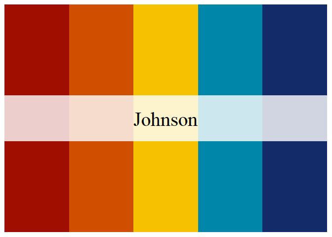
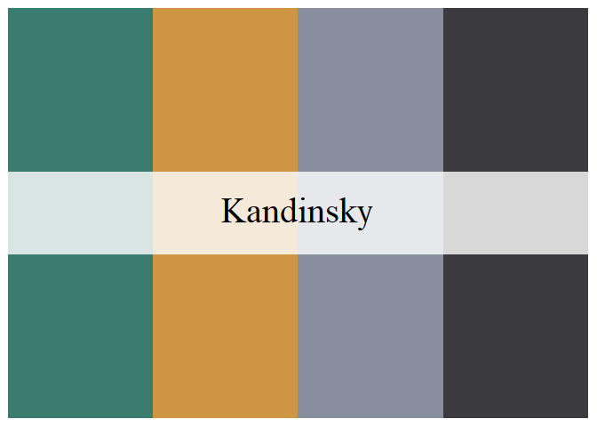
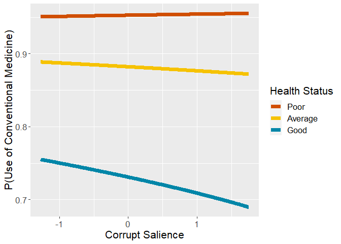

# Preparations

## Packages


```r
library(mclogit)
```

```
## Loading required package: Matrix
```

```r
library(emmeans)
library(dplyr)
```

```
## 
## Attaching package: 'dplyr'
```

```
## The following objects are masked from 'package:stats':
## 
##     filter, lag
```

```
## The following objects are masked from 'package:base':
## 
##     intersect, setdiff, setequal, union
```

```r
library(rio)
library(memisc)
```

```
## Loading required package: lattice
```

```
## Loading required package: MASS
```

```
## 
## Attaching package: 'MASS'
```

```
## The following object is masked from 'package:dplyr':
## 
##     select
```

```
## 
## Attaching package: 'memisc'
```

```
## The following objects are masked from 'package:dplyr':
## 
##     collect, recode, rename, syms
```

```
## The following object is masked from 'package:Matrix':
## 
##     as.array
```

```
## The following objects are masked from 'package:stats':
## 
##     contr.sum, contr.treatment, contrasts
```

```
## The following object is masked from 'package:base':
## 
##     as.array
```

```r
library(psych)
library(ggplot2)
```

```
## 
## Attaching package: 'ggplot2'
```

```
## The following objects are masked from 'package:psych':
## 
##     %+%, alpha
```

```
## The following object is masked from 'package:memisc':
## 
##     syms
```

```r
library(lme4)
```

```
## 
## Attaching package: 'lme4'
```

```
## The following object is masked from 'package:rio':
## 
##     factorize
```

```r
library(MetBrewer)
source("../custom_functions.R")
```
## Dataset


```r
dat<-import("../../data/processed/fdat.xlsx")

str(dat)
```

```
## 'data.frame':	40185 obs. of  32 variables:
##  $ idno                      : num  1 2 3 4 5 6 7 13 14 21 ...
##  $ cntry                     : chr  "AT" "AT" "AT" "AT" ...
##  $ dweight                   : num  0.938 0.938 0.938 0.938 0.938 ...
##  $ pspwght                   : num  0.871 0.864 1.419 1.026 0.739 ...
##  $ pweight                   : num  0.406 0.406 0.406 0.406 0.406 ...
##  $ pt.nmbr                   : num  NA 6 2 3 NA 1 1 1 7 2 ...
##  $ pt.name                   : chr  NA NA "ÖVP" "FPÖ" ...
##  $ gndr.f                    : chr  "Male" "Male" "Female" "Male" ...
##  $ gndr.c                    : num  -0.5 -0.5 0.5 -0.5 0.5 0.5 -0.5 0.5 0.5 0.5 ...
##  $ agea                      : num  51 67 89 32 56 67 66 67 34 66 ...
##  $ age10.c                   : num  0.172 1.772 3.972 -1.728 0.672 ...
##  $ income                    : chr  "quint.2" "quint.2" "quint.1" "quint.2" ...
##  $ income.f                  : chr  "quint.2" "quint.2" "quint.1" "quint.2" ...
##  $ income.fr                 : chr  "quint.2" "quint.2" "quint.1" "quint.2" ...
##  $ edu                       : chr  "3. LUS" "1. <LS" "1. <LS" "3. LUS" ...
##  $ edu.f                     : chr  "3. LUS" "1. <LS" "1. <LS" "3. LUS" ...
##  $ strain.on.health          : num  1 7 2 4 2 2 5 6 6 3 ...
##  $ used.conv                 : num  0 1 1 1 1 1 1 1 1 1 ...
##  $ used.CAM                  : num  0 0 0 0 0 0 0 1 0 1 ...
##  $ DV                        : chr  "NN" "Used_conv_ONLY" "Used_conv_ONLY" "Used_conv_ONLY" ...
##  $ used.CAM.no.home          : num  0 0 0 0 0 0 0 1 0 1 ...
##  $ DV.no.home                : chr  "NN" "Used_conv_ONLY" "Used_conv_ONLY" "Used_conv_ONLY" ...
##  $ lrgen                     : num  NA NA 6.1 8.7 NA ...
##  $ lrecon                    : num  NA NA 6.4 5.5 NA ...
##  $ galtan                    : num  NA NA 7.2 8.8 NA ...
##  $ antielite_salience        : num  NA NA 1.6 8 NA ...
##  $ corrupt_salience          : num  NA NA 2.4 5.1 NA ...
##  $ lrgen.scaling             : num  2.3 2.3 2.3 2.3 2.3 ...
##  $ lrecon.scaling            : num  2.21 2.21 2.21 2.21 2.21 ...
##  $ galtan.scaling            : num  2.63 2.63 2.63 2.63 2.63 ...
##  $ antielite_salience.scaling: num  2.59 2.59 2.59 2.59 2.59 ...
##  $ corrupt_salience.scaling  : num  2.32 2.32 2.32 2.32 2.32 ...
```

## Data transformations

The reference levels for factorial variables need to be redefined, .xlsx format does not understand factor formats.

### Income


```r
dat$income.f<-case_when(
  is.na(dat$income) ~ "missing",
  TRUE ~ dat$income
)

#define reference level (top quintile)
table(dat$income.f,useNA="always")
```

```
## 
## missing quint.1 quint.2 quint.3 quint.4 quint.5    <NA> 
##    8296    6427    6999    6793    6408    5262       0
```

```r
dat$income.fr = relevel(as.factor(dat$income.f), ref="quint.5")
table(dat$income.fr,useNA="always")
```

```
## 
## quint.5 missing quint.1 quint.2 quint.3 quint.4    <NA> 
##    5262    8296    6427    6999    6793    6408       0
```

### Education


```r
table(dat$edu,useNA="always")
```

```
## 
## 1. <LS  2. LS 3. LUS 4. UUS  5. AV  6. BA  7. MA   <NA> 
##   4085   6760   7213   7094   5671   4366   4730    266
```

```r
dat$edu.f<-relevel(as.factor(dat$edu),ref="7. MA")
table(dat$edu.f,useNA="always")
```

```
## 
##  7. MA 1. <LS  2. LS 3. LUS 4. UUS  5. AV  6. BA   <NA> 
##   4730   4085   6760   7213   7094   5671   4366    266
```

### DV


```r
table(dat$DV,useNA="always")
```

```
## 
##                NN     Used_CAM_ONLY Used_conv_and_CAM    Used_conv_ONLY 
##              6877               503              5100             27705 
##              <NA> 
##                 0
```

```r
dat$DV.f<-relevel(as.factor(dat$DV),ref="NN")
table(dat$DV.f,useNA="always")
```

```
## 
##                NN     Used_CAM_ONLY Used_conv_and_CAM    Used_conv_ONLY 
##              6877               503              5100             27705 
##              <NA> 
##                 0
```

```r
table(dat$DV.no.home,useNA="always")
```

```
## 
##                NN     Used_CAM_ONLY Used_conv_and_CAM    Used_conv_ONLY 
##              6957               423              4155             28650 
##              <NA> 
##                 0
```

```r
dat$DV.no.home.f<-relevel(as.factor(dat$DV.no.home),ref="NN")
table(dat$DV.no.home.f,useNA="always")
```

```
## 
##                NN     Used_CAM_ONLY Used_conv_and_CAM    Used_conv_ONLY 
##              6957               423              4155             28650 
##              <NA> 
##                 0
```

### Strain on health and political orientation

Calculate country means for centering


```r
# Calculate country means for centering

cntry.means<-dat %>%
  group_by(cntry) %>%
  summarise(strain.on.health.cntry.mean=
              mean(strain.on.health,na.rm=T),
            lrgen.cntry.mean=
              mean(lrgen,na.rm=T),
            lrecon.cntry.mean=
              mean(lrecon,na.rm=T),
            galtan.cntry.mean=
              mean(galtan,na.rm=T),
            antielite_salience.cntry.mean=
              mean(antielite_salience,na.rm=T),
            corrupt_salience.cntry.mean=
              mean(corrupt_salience,na.rm=T))

#combine data frames

dat<-left_join(
  x=dat,
  y=cntry.means,
  by="cntry"
)

#country-mean center strain on health

dat$strain.on.health.c<-
  dat$strain.on.health-dat$strain.on.health.cntry.mean

#country-mean center political orientation

dat$lrgen.c<-
  dat$lrgen-dat$lrgen.cntry.mean
dat$lrecon.c<-
  dat$lrecon-dat$lrecon.cntry.mean
dat$galtan.c<-
  dat$galtan-dat$galtan.cntry.mean
dat$antielite_salience.c<-
  dat$antielite_salience-dat$antielite_salience.cntry.mean
dat$corrupt_salience.c<-
  dat$corrupt_salience-dat$corrupt_salience.cntry.mean

#scale with CHES grand SD
dat$lrgen.z<-
  dat$lrgen.c/dat$lrgen.scaling
dat$lrecon.z<-
  dat$lrecon.c/dat$lrecon.scaling
dat$galtan.z<-
  dat$galtan.c/dat$galtan.scaling
dat$antielite_salience.z<-
  dat$antielite_salience.c/dat$antielite_salience.scaling
dat$corrupt_salience.z<-
  dat$corrupt_salience.c/dat$corrupt_salience.scaling
```

## Exclude missing variable


```r
fdat<-dat %>%
  filter(cntry!="IL" & cntry!="EE") %>%
  filter(!is.na(cntry) & 
         !is.na(gndr.c) &
         !is.na(age10.c) &
         !is.na(income.fr) &
           !is.na(edu.f) &
           !is.na(strain.on.health.c) &
           !is.na(DV) &
           !is.na(lrgen.z) &
           !is.na(lrecon.z) &
           !is.na(galtan.z) &
           !is.na(antielite_salience.z) &
           !is.na(corrupt_salience.z))
```

## Construct anweight variable for weighting


```r
fdat$anweight=fdat$pspwght*fdat$pweight
```

# Descriptive analysis

## Check the presence of all DV-groups across countries


```r
table(fdat$cntry,fdat$DV.no.home.f)
```

```
##     
##        NN Used_CAM_ONLY Used_conv_and_CAM Used_conv_ONLY
##   AT  123            10               120            804
##   BE  136             3                87           1018
##   CH   95            19                90            438
##   CZ  145             4               144            771
##   DE  159             6               217           1660
##   DK  175             7               147            821
##   ES  108             5                90            828
##   FI  176            11               105           1028
##   FR   70             4               120            743
##   GB  203             8               126            963
##   HU  257             7                43            536
##   IE  255            13                93            913
##   LT  229            28               254            494
##   NL  245            10                72           1007
##   NO  164             8               104            775
##   PL  122             6                46            596
##   PT   30             1                40            491
##   SE  313            16               127            955
##   SI   59             8                83            405
```

```r
round(100*prop.table(table(fdat$cntry,fdat$DV.no.home.f),
                     margin = 1),1)
```

```
##     
##        NN Used_CAM_ONLY Used_conv_and_CAM Used_conv_ONLY
##   AT 11.6           0.9              11.4           76.1
##   BE 10.9           0.2               7.0           81.8
##   CH 14.8           3.0              14.0           68.2
##   CZ 13.6           0.4              13.5           72.5
##   DE  7.8           0.3              10.6           81.3
##   DK 15.2           0.6              12.8           71.4
##   ES 10.5           0.5               8.7           80.3
##   FI 13.3           0.8               8.0           77.9
##   FR  7.5           0.4              12.8           79.3
##   GB 15.6           0.6               9.7           74.1
##   HU 30.5           0.8               5.1           63.6
##   IE 20.0           1.0               7.3           71.7
##   LT 22.8           2.8              25.3           49.2
##   NL 18.4           0.7               5.4           75.5
##   NO 15.6           0.8               9.9           73.7
##   PL 15.8           0.8               6.0           77.4
##   PT  5.3           0.2               7.1           87.4
##   SE 22.2           1.1               9.0           67.7
##   SI 10.6           1.4              15.0           73.0
```


# Analysis

## Empty model


```r
mod0<-mblogit(DV.no.home.f~1,
              random= ~1|cntry,
              estimator="ML",
              data=fdat,weights=anweight)
```

```
## 
## Iteration 1 - deviance = 28012.1 - criterion = 0.7052356
## Iteration 2 - deviance = 26960.57 - criterion = 0.2406493
## Iteration 3 - deviance = 26811.37 - criterion = 0.0332981
## Iteration 4 - deviance = 26785.78 - criterion = 0.008176936
## Iteration 5 - deviance = 26781.53 - criterion = 0.000544191
## Iteration 6 - deviance = 26780.88 - criterion = 3.442563e-06
## Iteration 7 - deviance = 26780.84 - criterion = 7.633508e-09
## converged
```

```r
mod0
```

```
## mblogit(formula = DV.no.home.f ~ 1, data = fdat, random = ~1 | 
##     cntry, weights = anweight, estimator = "ML")
## 
## Coefficients:
##                       Predictors
## Response categories     (Intercept)
##   Used_CAM_ONLY/NN      -2.9809    
##   Used_conv_and_CAM/NN  -0.4121    
##   Used_conv_ONLY/NN      1.6138    
## 
## (Co-)Variances:
## Grouping level: cntry 
##                      Used_CAM_ONLY~1  Used_conv_and_CAM~1  Used_conv_ONLY~1
## Used_CAM_ONLY~1       0.32091                                              
## Used_conv_and_CAM~1   0.11634          0.36189                             
## Used_conv_ONLY~1     -0.06221          0.19618              0.25645        
## 
## Null Deviance:     52210 
## Residual Deviance: 26780
```

```r
summary(mod0)
```

```
## 
## Call:
## mblogit(formula = DV.no.home.f ~ 1, data = fdat, random = ~1 | 
##     cntry, weights = anweight, estimator = "ML")
## 
## Equation for Used_CAM_ONLY vs NN:
##             Estimate Std. Error z value Pr(>|z|)    
## (Intercept)   -2.981      0.173  -17.23   <2e-16 ***
## 
## Equation for Used_conv_and_CAM vs NN:
##             Estimate Std. Error z value Pr(>|z|)   
## (Intercept)  -0.4121     0.1463  -2.817  0.00485 **
## 
## Equation for Used_conv_ONLY vs NN:
##             Estimate Std. Error z value Pr(>|z|)    
## (Intercept)   1.6138     0.1212   13.32   <2e-16 ***
## ---
## Signif. codes:  0 '***' 0.001 '**' 0.01 '*' 0.05 '.' 0.1 ' ' 1
## 
## (Co-)Variances:
## Grouping level: cntry 
##                     Estimate                     Std.Err.               
## Used_CAM_ONLY~1      0.32091                     0.01602                
## Used_conv_and_CAM~1  0.11634  0.36189            0.01828 0.03236        
## Used_conv_ONLY~1    -0.06221  0.19618  0.25645   0.01165 0.02191 0.01690
## 
## Null Deviance:     52210 
## Residual Deviance: 26780 
## Number of Fisher Scoring iterations:  7
## Number of observations
##   Groups by cntry: 19
##   Individual observations:  18832.14
```

```r
mtable(mod0,show.baselevel = T)
```

```
## 
## Calls:
## mod0: mblogit(formula = DV.no.home.f ~ 1, data = fdat, random = ~1 | 
##     cntry, weights = anweight, estimator = "ML")
## 
## ================================================================================================
##                                        Used_CAM_ONLY/NN Used_conv_and_CAM/NN Used_conv_ONLY/NN  
## ------------------------------------------------------------------------------------------------
##   (Intercept)                               -2.981***         -0.412**            1.614***      
##                                             (0.173)           (0.146)            (0.121)        
## ------------------------------------------------------------------------------------------------
##   Used_CAM_ONLY/NN x  VCov(~1,~1)            0.321             0.116             -0.062         
##                                             (0.016)           (0.018)            (0.012)        
##   Used_conv_and_CAM/NN x  VCov(~1,~1)        0.116             0.362              0.196         
##                                             (0.018)           (0.032)            (0.022)        
##   Used_conv_ONLY/NN x  VCov(~1,~1)          -0.062             0.196              0.256         
##                                             (0.012)           (0.022)            (0.017)        
## ------------------------------------------------------------------------------------------------
##   Groups by cntry                           19                                                  
## ------------------------------------------------------------------------------------------------
##   Deviance                               26780.8                                                
##   N                                      18832                                                  
## ================================================================================================
##   Significance: *** = p < 0.001; ** = p < 0.01; * = p < 0.05
```

## Model with covariates


```r
mod1<-
  mblogit(DV.no.home.f~gndr.c+age10.c+income.fr+edu.f+
            strain.on.health.c,
              random= ~1|cntry,
              estimator="ML",
              data=fdat,weights=anweight)
```

```
## 
## Iteration 1 - deviance = 26069.22 - criterion = 0.7479693
## Iteration 2 - deviance = 24759.59 - criterion = 0.1651167
## Iteration 3 - deviance = 24572.58 - criterion = 0.02773851
## Iteration 4 - deviance = 24525.66 - criterion = 0.01829904
## Iteration 5 - deviance = 24514.6 - criterion = 0.008383566
## Iteration 6 - deviance = 24512.13 - criterion = 0.002210141
## Iteration 7 - deviance = 24512.53 - criterion = 0.0003918968
## Iteration 8 - deviance = 24512.34 - criterion = 6.662191e-06
## Iteration 9 - deviance = 24512.31 - criterion = 6.184026e-08
## Iteration 10 - deviance = 24512.31 - criterion = 1.55187e-11
## converged
```

```r
summary(mod1)
```

```
## 
## Call:
## mblogit(formula = DV.no.home.f ~ gndr.c + age10.c + income.fr + 
##     edu.f + strain.on.health.c, data = fdat, random = ~1 | cntry, 
##     weights = anweight, estimator = "ML")
## 
## Equation for Used_CAM_ONLY vs NN:
##                    Estimate Std. Error z value Pr(>|z|)    
## (Intercept)        -1.89443    0.27904  -6.789 1.13e-11 ***
## gndr.c              0.11408    0.19890   0.574 0.566279    
## age10.c            -0.02689    0.06596  -0.408 0.683529    
## income.frmissing   -1.19221    0.47005  -2.536 0.011201 *  
## income.frquint.1   -1.53643    0.67410  -2.279 0.022654 *  
## income.frquint.2    0.16995    0.29855   0.569 0.569183    
## income.frquint.3   -0.03706    0.28957  -0.128 0.898161    
## income.frquint.4   -0.05288    0.26861  -0.197 0.843938    
## edu.f1. <LS        -2.51132    1.01866  -2.465 0.013689 *  
## edu.f2. LS         -0.73769    0.33330  -2.213 0.026878 *  
## edu.f3. LUS        -0.71261    0.30506  -2.336 0.019491 *  
## edu.f4. UUS        -1.35661    0.39755  -3.412 0.000644 ***
## edu.f5. AV         -0.36957    0.29675  -1.245 0.212981    
## edu.f6. BA         -0.71585    0.33640  -2.128 0.033338 *  
## strain.on.health.c  0.28666    0.05295   5.413 6.18e-08 ***
## 
## Equation for Used_conv_and_CAM vs NN:
##                    Estimate Std. Error z value Pr(>|z|)    
## (Intercept)         0.23136    0.18735   1.235 0.216871    
## gndr.c              1.13543    0.06866  16.537  < 2e-16 ***
## age10.c             0.10302    0.02147   4.799 1.59e-06 ***
## income.frmissing   -0.16247    0.12619  -1.288 0.197919    
## income.frquint.1   -0.03823    0.12984  -0.294 0.768444    
## income.frquint.2    0.01399    0.11329   0.123 0.901732    
## income.frquint.3   -0.03941    0.10837  -0.364 0.716097    
## income.frquint.4   -0.03029    0.10239  -0.296 0.767399    
## edu.f1. <LS        -1.14085    0.16706  -6.829 8.56e-12 ***
## edu.f2. LS         -0.56375    0.12338  -4.569 4.89e-06 ***
## edu.f3. LUS        -0.41420    0.11273  -3.674 0.000239 ***
## edu.f4. UUS        -0.59095    0.12802  -4.616 3.91e-06 ***
## edu.f5. AV         -0.22681    0.11782  -1.925 0.054219 .  
## edu.f6. BA         -0.28022    0.12815  -2.187 0.028769 *  
## strain.on.health.c  0.56032    0.01781  31.463  < 2e-16 ***
## 
## Equation for Used_conv_ONLY vs NN:
##                     Estimate Std. Error z value Pr(>|z|)    
## (Intercept)         1.999027   0.152880  13.076   <2e-16 ***
## gndr.c              0.520602   0.047952  10.857   <2e-16 ***
## age10.c             0.192068   0.015162  12.668   <2e-16 ***
## income.frmissing   -0.144284   0.083396  -1.730   0.0836 .  
## income.frquint.1    0.036069   0.093777   0.385   0.7005    
## income.frquint.2   -0.001352   0.081724  -0.017   0.9868    
## income.frquint.3   -0.011602   0.076095  -0.152   0.8788    
## income.frquint.4    0.004928   0.071946   0.069   0.9454    
## edu.f1. <LS        -0.031005   0.113303  -0.274   0.7844    
## edu.f2. LS         -0.074531   0.087295  -0.854   0.3932    
## edu.f3. LUS        -0.100148   0.082031  -1.221   0.2221    
## edu.f4. UUS        -0.026489   0.087264  -0.304   0.7615    
## edu.f5. AV         -0.098131   0.087817  -1.117   0.2638    
## edu.f6. BA         -0.022089   0.090657  -0.244   0.8075    
## strain.on.health.c  0.412321   0.015732  26.209   <2e-16 ***
## ---
## Signif. codes:  0 '***' 0.001 '**' 0.01 '*' 0.05 '.' 0.1 ' ' 1
## 
## (Co-)Variances:
## Grouping level: cntry 
##                     Estimate                     Std.Err.               
## Used_CAM_ONLY~1      0.39201                     0.02650                
## Used_conv_and_CAM~1 -0.05105  0.45804            0.03327 0.06571        
## Used_conv_ONLY~1    -0.09727  0.27249  0.33005   0.02869 0.05364 0.04452
## 
## Null Deviance:     52210 
## Residual Deviance: 24510 
## Number of Fisher Scoring iterations:  10
## Number of observations
##   Groups by cntry: 19
##   Individual observations:  18832.14
```

```r
mod1
```

```
## mblogit(formula = DV.no.home.f ~ gndr.c + age10.c + income.fr + 
##     edu.f + strain.on.health.c, data = fdat, random = ~1 | cntry, 
##     weights = anweight, estimator = "ML")
## 
## Coefficients:
##                       Predictors
## Response categories     (Intercept)  gndr.c     age10.c    income.frmissing
##   Used_CAM_ONLY/NN      -1.894432     0.114076  -0.026887  -1.192211       
##   Used_conv_and_CAM/NN   0.231358     1.135433   0.103018  -0.162474       
##   Used_conv_ONLY/NN      1.999027     0.520602   0.192068  -0.144284       
##                       Predictors
## Response categories     income.frquint.1  income.frquint.2  income.frquint.3
##   Used_CAM_ONLY/NN      -1.536430          0.169949         -0.037060       
##   Used_conv_and_CAM/NN  -0.038225          0.013988         -0.039412       
##   Used_conv_ONLY/NN      0.036069         -0.001352         -0.011602       
##                       Predictors
## Response categories     income.frquint.4  edu.f1. <LS  edu.f2. LS  edu.f3. LUS
##   Used_CAM_ONLY/NN      -0.052879         -2.511316    -0.737688   -0.712609  
##   Used_conv_and_CAM/NN  -0.030286         -1.140854    -0.563752   -0.414199  
##   Used_conv_ONLY/NN      0.004928         -0.031005    -0.074531   -0.100148  
##                       Predictors
## Response categories     edu.f4. UUS  edu.f5. AV  edu.f6. BA  strain.on.health.c
##   Used_CAM_ONLY/NN      -1.356606    -0.369573   -0.715853    0.286665         
##   Used_conv_and_CAM/NN  -0.590946    -0.226811   -0.280217    0.560319         
##   Used_conv_ONLY/NN     -0.026489    -0.098131   -0.022089    0.412321         
## 
## (Co-)Variances:
## Grouping level: cntry 
##                      Used_CAM_ONLY~1  Used_conv_and_CAM~1  Used_conv_ONLY~1
## Used_CAM_ONLY~1       0.39201                                              
## Used_conv_and_CAM~1  -0.05105          0.45804                             
## Used_conv_ONLY~1     -0.09727          0.27249              0.33005        
## 
## Null Deviance:     52210 
## Residual Deviance: 24510
```

```r
mtable(mod1,show.baselevel = T)
```

```
## 
## Calls:
## mod1: mblogit(formula = DV.no.home.f ~ gndr.c + age10.c + income.fr + 
##     edu.f + strain.on.health.c, data = fdat, random = ~1 | cntry, 
##     weights = anweight, estimator = "ML")
## 
## ================================================================================================
##                                        Used_CAM_ONLY/NN Used_conv_and_CAM/NN Used_conv_ONLY/NN  
## ------------------------------------------------------------------------------------------------
##   (Intercept)                               -1.894***         0.231               1.999***      
##                                             (0.279)          (0.187)             (0.153)        
##   gndr.c                                     0.114            1.135***            0.521***      
##                                             (0.199)          (0.069)             (0.048)        
##   age10.c                                   -0.027            0.103***            0.192***      
##                                             (0.066)          (0.021)             (0.015)        
##   income.fr: missing/quint.5                -1.192*          -0.162              -0.144         
##                                             (0.470)          (0.126)             (0.083)        
##   income.fr: quint.1/quint.5                -1.536*          -0.038               0.036         
##                                             (0.674)          (0.130)             (0.094)        
##   income.fr: quint.2/quint.5                 0.170            0.014              -0.001         
##                                             (0.299)          (0.113)             (0.082)        
##   income.fr: quint.3/quint.5                -0.037           -0.039              -0.012         
##                                             (0.290)          (0.108)             (0.076)        
##   income.fr: quint.4/quint.5                -0.053           -0.030               0.005         
##                                             (0.269)          (0.102)             (0.072)        
##   edu.f: 1. <LS/7. MA                       -2.511*          -1.141***           -0.031         
##                                             (1.019)          (0.167)             (0.113)        
##   edu.f: 2. LS/7. MA                        -0.738*          -0.564***           -0.075         
##                                             (0.333)          (0.123)             (0.087)        
##   edu.f: 3. LUS/7. MA                       -0.713*          -0.414***           -0.100         
##                                             (0.305)          (0.113)             (0.082)        
##   edu.f: 4. UUS/7. MA                       -1.357***        -0.591***           -0.026         
##                                             (0.398)          (0.128)             (0.087)        
##   edu.f: 5. AV/7. MA                        -0.370           -0.227              -0.098         
##                                             (0.297)          (0.118)             (0.088)        
##   edu.f: 6. BA/7. MA                        -0.716*          -0.280*             -0.022         
##                                             (0.336)          (0.128)             (0.091)        
##   strain.on.health.c                         0.287***         0.560***            0.412***      
##                                             (0.053)          (0.018)             (0.016)        
## ------------------------------------------------------------------------------------------------
##   Used_CAM_ONLY/NN x  VCov(~1,~1)            0.392           -0.051              -0.097         
##                                             (0.026)          (0.033)             (0.029)        
##   Used_conv_and_CAM/NN x  VCov(~1,~1)       -0.051            0.458               0.272         
##                                             (0.033)          (0.066)             (0.054)        
##   Used_conv_ONLY/NN x  VCov(~1,~1)          -0.097            0.272               0.330         
##                                             (0.029)          (0.054)             (0.045)        
## ------------------------------------------------------------------------------------------------
##   Groups by cntry                           19                                                  
## ------------------------------------------------------------------------------------------------
##   Deviance                               24512.3                                                
##   N                                      18832                                                  
## ================================================================================================
##   Significance: *** = p < 0.001; ** = p < 0.01; * = p < 0.05
```

### Strain on health main effects


```r
mod1.strain.trends<-
  emtrends(mod1,~1|DV.no.home.f,
           var="strain.on.health.c",
           infer=T,mode="latent",
           at=list(gndr.c=0,age10.c=0))

#effects for each DV.no.home-category
(mod1.strain.eff<-
  contrast(mod1.strain.trends,simple="DV.no.home.f",
         adjust="none","eff",infer=c(T,T)))
```

```
##  contrast                 estimate     SE  df asymp.LCL asymp.UCL z.ratio
##  NN effect                 -0.3148 0.0172 Inf   -0.3486   -0.2811 -18.289
##  Used_CAM_ONLY effect      -0.0282 0.0384 Inf   -0.1034    0.0471  -0.733
##  Used_conv_and_CAM effect   0.2455 0.0149 Inf    0.2163    0.2747  16.462
##  Used_conv_ONLY effect      0.0975 0.0138 Inf    0.0705    0.1245   7.084
##  p.value
##   <.0001
##   0.4635
##   <.0001
##   <.0001
## 
## Results are averaged over the levels of: income.fr, edu.f 
## Confidence level used: 0.95
```

```r
#save to file
export(data.frame(mod1.strain.eff),
       "../../results/Homeopathy_excluded/mod1.strain.eff.MN.xlsx",
       overwrite=T)

#Use of conventional medicine

(mod1.strain.eff.CM<-
  contrast(mod1.strain.trends,
           method = list("Conv - No conv" = contrast.weights.total(effects=mod1.strain.eff,
          signs=c(-2,-2,2,2))),
           simple="DV.no.home.f",
           infer=c(T,T)))
```

```
##  contrast       estimate     SE  df asymp.LCL asymp.UCL z.ratio p.value
##  Conv - No conv    0.391 0.0196 Inf     0.352     0.429  19.967  <.0001
## 
## Results are averaged over the levels of: income.fr, edu.f 
## Confidence level used: 0.95
```

```r
(mod1.strain.eff.CAM<-
    contrast(mod1.strain.trends,
         method = list("CAM - No CAM" = contrast.weights.total(effects=mod1.strain.eff,
                 signs=c(-2,2,2,-2))),
         simple="DV.no.home.f",
           infer=c(T,T)))
```

```
##  contrast     estimate     SE  df asymp.LCL asymp.UCL z.ratio p.value
##  CAM - No CAM    0.236 0.0145 Inf     0.208     0.264  16.313  <.0001
## 
## Results are averaged over the levels of: income.fr, edu.f 
## Confidence level used: 0.95
```

```r
# save to file
export(data.frame(rbind(mod1.strain.eff.CM,
      mod1.strain.eff.CAM,adjust="none")),
      "../../results/Homeopathy_excluded/mod1.strain.eff.COMB.xlsx")
```

### gender main effects


```r
mod1.gndr.trends<-
  emtrends(mod1,~1|DV.no.home.f,
           var="gndr.c",
           infer=T,mode="latent",
           at=list(strain.on.health.c=0,age10.c=0))

#effects for each DV.no.home-category
(mod1.gndr.eff<-
  contrast(mod1.gndr.trends,simple="DV.no.home.f",
         adjust="none","eff",infer=c(T,T)))
```

```
##  contrast                 estimate     SE  df asymp.LCL asymp.UCL z.ratio
##  NN effect                 -0.4425 0.0604 Inf   -0.5608   -0.3242  -7.332
##  Used_CAM_ONLY effect      -0.3285 0.1467 Inf   -0.6160   -0.0409  -2.239
##  Used_conv_and_CAM effect   0.6929 0.0633 Inf    0.5688    0.8170  10.947
##  Used_conv_ONLY effect      0.0781 0.0532 Inf   -0.0262    0.1824   1.467
##  p.value
##   <.0001
##   0.0252
##   <.0001
##   0.1423
## 
## Results are averaged over the levels of: gndr.c, income.fr, edu.f 
## Confidence level used: 0.95
```

```r
#save to file
export(data.frame(mod1.gndr.eff),
       "../../results/Homeopathy_excluded/mod1.gndr.eff.MN.xlsx",
       overwrite=T)

#Use of conventional medicine

(mod1.gndr.eff.CM<-
  contrast(mod1.gndr.trends,
           method = list("Conv - No conv" = contrast.weights.total(effects=mod1.gndr.eff,
          signs=c(-2,-2,2,2))),
           simple="DV.no.home.f",
           infer=c(T,T)))
```

```
##  contrast       estimate     SE  df asymp.LCL asymp.UCL z.ratio p.value
##  Conv - No conv     0.73 0.0642 Inf     0.604     0.856  11.374  <.0001
## 
## Results are averaged over the levels of: gndr.c, income.fr, edu.f 
## Confidence level used: 0.95
```

```r
(mod1.gndr.eff.CAM<-
    contrast(mod1.gndr.trends,
         method = list("CAM - No CAM" = contrast.weights.total(effects=mod1.gndr.eff,
                 signs=c(-2,2,2,-2))),
         simple="DV.no.home.f",
           infer=c(T,T)))
```

```
##  contrast     estimate     SE  df asymp.LCL asymp.UCL z.ratio p.value
##  CAM - No CAM    0.545 0.0691 Inf     0.409      0.68   7.885  <.0001
## 
## Results are averaged over the levels of: gndr.c, income.fr, edu.f 
## Confidence level used: 0.95
```

```r
# save to file
export(data.frame(rbind(mod1.gndr.eff.CM,
      mod1.gndr.eff.CAM,adjust="none")),
      "../../results/Homeopathy_excluded/mod1.gndr.eff.COMB.xlsx")
```


### age main effects


```r
mod1.age10.trends<-
  emtrends(mod1,~1|DV.no.home.f,
           var="age10.c",
           infer=T,mode="latent",
           at=list(strain.on.health.c=0,gndr.c=0))

#effects for each DV.no.home-category
(mod1.age10.eff<-
  contrast(mod1.age10.trends,simple="DV.no.home.f",
         adjust="none","eff",infer=c(T,T)))
```

```
##  contrast                 estimate     SE  df asymp.LCL asymp.UCL z.ratio
##  NN effect                 -0.0670 0.0197 Inf  -0.10564  -0.02846  -3.405
##  Used_CAM_ONLY effect      -0.0939 0.0487 Inf  -0.18947   0.00159  -1.927
##  Used_conv_and_CAM effect   0.0360 0.0205 Inf  -0.00417   0.07611   1.756
##  Used_conv_ONLY effect      0.1250 0.0175 Inf   0.09067   0.15937   7.133
##  p.value
##   0.0007
##   0.0539
##   0.0791
##   <.0001
## 
## Results are averaged over the levels of: income.fr, edu.f 
## Confidence level used: 0.95
```

```r
#save to file
export(data.frame(mod1.age10.eff),
       "../../results/Homeopathy_excluded/mod1.age10.eff.MN.xlsx",
       overwrite=T)

#Use of conventional medicine

(mod1.age10.eff.CM<-
  contrast(mod1.age10.trends,
           method = list("Conv - No conv" = contrast.weights.total(effects=mod1.age10.eff,
          signs=c(-2,-2,2,2))),
           simple="DV.no.home.f",
           infer=c(T,T)))
```

```
##  contrast       estimate     SE  df asymp.LCL asymp.UCL z.ratio p.value
##  Conv - No conv    0.163 0.0208 Inf     0.122     0.204   7.831  <.0001
## 
## Results are averaged over the levels of: income.fr, edu.f 
## Confidence level used: 0.95
```

```r
(mod1.age10.eff.CAM<-
    contrast(mod1.age10.trends,
         method = list("CAM - No CAM" = contrast.weights.total(effects=mod1.age10.eff,
                 signs=c(-2,2,2,-2))),
         simple="DV.no.home.f",
           infer=c(T,T)))
```

```
##  contrast     estimate     SE  df asymp.LCL asymp.UCL z.ratio p.value
##  CAM - No CAM  -0.0435 0.0221 Inf   -0.0868 -0.000199  -1.969  0.0490
## 
## Results are averaged over the levels of: income.fr, edu.f 
## Confidence level used: 0.95
```

```r
# save to file
export(data.frame(rbind(mod1.age10.eff.CM,
      mod1.age10.eff.CAM,adjust="none")),
      "../../results/Homeopathy_excluded/mod1.age10.eff.COMB.xlsx")
```


### education main effects


```r
# first take probabilities for all categories
mod1.edu.f.trends<-emmeans(mod1,by="DV.no.home.f",
        specs="edu.f",
        infer=T,mode="prob",
        at=list(strain.on.health.c=0,gndr.c=0,age10.c=0))

mod1.edu.f.trends
```

```
## DV.no.home.f = NN:
##  edu.f     prob      SE  df asymp.LCL asymp.UCL z.ratio p.value
##  7. MA  0.10471 0.01368 Inf  0.077895   0.13152   7.654  <.0001
##  1. <LS 0.11898 0.01705 Inf  0.085567   0.15239   6.980  <.0001
##  2. LS  0.11831 0.01524 Inf  0.088440   0.14818   7.763  <.0001
##  3. LUS 0.11912 0.01503 Inf  0.089651   0.14859   7.923  <.0001
##  4. UUS 0.11443 0.01484 Inf  0.085332   0.14352   7.709  <.0001
##  5. AV  0.11634 0.01505 Inf  0.086848   0.14584   7.731  <.0001
##  6. BA  0.11062 0.01472 Inf  0.081767   0.13947   7.514  <.0001
## 
## DV.no.home.f = Used_CAM_ONLY:
##  edu.f     prob      SE  df asymp.LCL asymp.UCL z.ratio p.value
##  7. MA  0.01195 0.00347 Inf  0.005160   0.01875   3.448  0.0006
##  1. <LS 0.00111 0.00112 Inf -0.001092   0.00330   0.986  0.3239
##  2. LS  0.00647 0.00221 Inf  0.002145   0.01080   2.932  0.0034
##  3. LUS 0.00668 0.00211 Inf  0.002554   0.01081   3.173  0.0015
##  4. UUS 0.00337 0.00138 Inf  0.000671   0.00608   2.446  0.0144
##  5. AV  0.00919 0.00285 Inf  0.003599   0.01478   3.222  0.0013
##  6. BA  0.00618 0.00221 Inf  0.001845   0.01052   2.794  0.0052
## 
## DV.no.home.f = Used_conv_and_CAM:
##  edu.f     prob      SE  df asymp.LCL asymp.UCL z.ratio p.value
##  7. MA  0.12629 0.01457 Inf  0.097723   0.15485   8.666  <.0001
##  1. <LS 0.04587 0.00705 Inf  0.032038   0.05969   6.501  <.0001
##  2. LS  0.08121 0.01009 Inf  0.061442   0.10098   8.051  <.0001
##  3. LUS 0.09496 0.01116 Inf  0.073093   0.11683   8.512  <.0001
##  4. UUS 0.07644 0.00987 Inf  0.057105   0.09578   7.747  <.0001
##  5. AV  0.11186 0.01314 Inf  0.086110   0.13760   8.515  <.0001
##  6. BA  0.10082 0.01277 Inf  0.075801   0.12585   7.897  <.0001
## 
## DV.no.home.f = Used_conv_ONLY:
##  edu.f     prob      SE  df asymp.LCL asymp.UCL z.ratio p.value
##  7. MA  0.75705 0.02036 Inf  0.717150   0.79696  37.185  <.0001
##  1. <LS 0.83405 0.01836 Inf  0.798067   0.87004  45.428  <.0001
##  2. LS  0.79401 0.01862 Inf  0.757505   0.83051  42.632  <.0001
##  3. LUS 0.77924 0.01893 Inf  0.742146   0.81634  41.171  <.0001
##  4. UUS 0.80576 0.01790 Inf  0.770673   0.84084  45.012  <.0001
##  5. AV  0.76261 0.02015 Inf  0.723121   0.80210  37.849  <.0001
##  6. BA  0.78237 0.01954 Inf  0.744074   0.82067  40.038  <.0001
## 
## Results are averaged over the levels of: income.fr 
## Confidence level used: 0.95
```

```r
export(data.frame(mod1.edu.f.trends),
       "../../results/Homeopathy_excluded/mod1.edu.f.eff.MN.xlsx",
       overwrite=T)


#effects for each DV.no.home-category
(mod1.edu.f.eff<-
    contrast(mod1.edu.f.trends,#simple="edu.f",
             adjust="none","eff",infer=c(T,T)))
```

```
## DV.no.home.f = NN:
##  contrast       estimate      SE  df asymp.LCL asymp.UCL z.ratio p.value
##  7. MA effect  -9.94e-03 0.00562 Inf -0.020950  1.08e-03  -1.768  0.0771
##  1. <LS effect  4.33e-03 0.00868 Inf -0.012672  2.13e-02   0.499  0.6174
##  2. LS effect   3.66e-03 0.00589 Inf -0.007889  1.52e-02   0.622  0.5342
##  3. LUS effect  4.48e-03 0.00544 Inf -0.006177  1.51e-02   0.823  0.4102
##  4. UUS effect -2.18e-04 0.00594 Inf -0.011851  1.14e-02  -0.037  0.9708
##  5. AV effect   1.70e-03 0.00602 Inf -0.010089  1.35e-02   0.283  0.7772
##  6. BA effect  -4.02e-03 0.00626 Inf -0.016285  8.24e-03  -0.643  0.5202
## 
## DV.no.home.f = Used_CAM_ONLY:
##  contrast       estimate      SE  df asymp.LCL asymp.UCL z.ratio p.value
##  7. MA effect   5.53e-03 0.00233 Inf  0.000970  1.01e-02   2.377  0.0175
##  1. <LS effect -5.32e-03 0.00164 Inf -0.008523 -2.11e-03  -3.249  0.0012
##  2. LS effect   4.91e-05 0.00158 Inf -0.003043  3.14e-03   0.031  0.9752
##  3. LUS effect  2.58e-04 0.00144 Inf -0.002570  3.09e-03   0.179  0.8582
##  4. UUS effect -3.05e-03 0.00135 Inf -0.005698 -4.01e-04  -2.256  0.0240
##  5. AV effect   2.77e-03 0.00191 Inf -0.000974  6.50e-03   1.449  0.1472
##  6. BA effect  -2.39e-04 0.00158 Inf -0.003331  2.85e-03  -0.152  0.8795
## 
## DV.no.home.f = Used_conv_and_CAM:
##  contrast       estimate      SE  df asymp.LCL asymp.UCL z.ratio p.value
##  7. MA effect   3.52e-02 0.00711 Inf  0.021294  4.91e-02   4.957  <.0001
##  1. <LS effect -4.52e-02 0.00649 Inf -0.057923 -3.25e-02  -6.961  <.0001
##  2. LS effect  -9.85e-03 0.00501 Inf -0.019670 -3.32e-05  -1.967  0.0492
##  3. LUS effect  3.90e-03 0.00477 Inf -0.005452  1.32e-02   0.817  0.4140
##  4. UUS effect -1.46e-02 0.00558 Inf -0.025564 -3.68e-03  -2.618  0.0088
##  5. AV effect   2.08e-02 0.00607 Inf  0.008887  3.27e-02   3.423  0.0006
##  6. BA effect   9.76e-03 0.00670 Inf -0.003362  2.29e-02   1.458  0.1449
## 
## DV.no.home.f = Used_conv_ONLY:
##  contrast       estimate      SE  df asymp.LCL asymp.UCL z.ratio p.value
##  7. MA effect  -3.08e-02 0.00844 Inf -0.047359 -1.43e-02  -3.652  0.0003
##  1. <LS effect  4.62e-02 0.01020 Inf  0.026194  6.62e-02   4.529  <.0001
##  2. LS effect   6.14e-03 0.00730 Inf -0.008174  2.04e-02   0.841  0.4006
##  3. LUS effect -8.63e-03 0.00680 Inf -0.021956  4.70e-03  -1.269  0.2044
##  4. UUS effect  1.79e-02 0.00774 Inf  0.002710  3.31e-02   2.310  0.0209
##  5. AV effect  -2.53e-02 0.00801 Inf -0.040957 -9.56e-03  -3.154  0.0016
##  6. BA effect  -5.50e-03 0.00867 Inf -0.022491  1.15e-02  -0.634  0.5259
## 
## Results are averaged over the levels of: income.fr 
## Confidence level used: 0.95
```

```r
#save to file
export(data.frame(mod1.edu.f.eff),
       "../../results/Homeopathy_excluded/mod1.edu.f.eff.MN.xlsx",
       overwrite=T)

# No Conv versus Conv

(mod1.edu.f.eff_DV.no.home<-
    contrast(mod1.edu.f.trends,simple="DV.no.home.f",
             adjust="none","eff",infer=c(T,T)))
```

```
## edu.f = 7. MA:
##  contrast                 estimate      SE  df asymp.LCL asymp.UCL  z.ratio
##  NN effect                  -0.145 0.01368 Inf    -0.172   -0.1185  -10.621
##  Used_CAM_ONLY effect       -0.238 0.00347 Inf    -0.245   -0.2313  -68.665
##  Used_conv_and_CAM effect   -0.124 0.01457 Inf    -0.152   -0.0952   -8.489
##  Used_conv_ONLY effect       0.507 0.02036 Inf     0.467    0.5470   24.906
##  p.value
##   <.0001
##   <.0001
##   <.0001
##   <.0001
## 
## edu.f = 1. <LS:
##  contrast                 estimate      SE  df asymp.LCL asymp.UCL  z.ratio
##  NN effect                  -0.131 0.01705 Inf    -0.164   -0.0976   -7.687
##  Used_CAM_ONLY effect       -0.249 0.00112 Inf    -0.251   -0.2467 -221.933
##  Used_conv_and_CAM effect   -0.204 0.00705 Inf    -0.218   -0.1903  -28.935
##  Used_conv_ONLY effect       0.584 0.01836 Inf     0.548    0.6200   31.811
##  p.value
##   <.0001
##   <.0001
##   <.0001
##   <.0001
## 
## edu.f = 2. LS:
##  contrast                 estimate      SE  df asymp.LCL asymp.UCL  z.ratio
##  NN effect                  -0.132 0.01524 Inf    -0.162   -0.1018   -8.642
##  Used_CAM_ONLY effect       -0.244 0.00221 Inf    -0.248   -0.2392 -110.329
##  Used_conv_and_CAM effect   -0.169 0.01009 Inf    -0.189   -0.1490  -16.734
##  Used_conv_ONLY effect       0.544 0.01862 Inf     0.508    0.5805   29.209
##  p.value
##   <.0001
##   <.0001
##   <.0001
##   <.0001
## 
## edu.f = 3. LUS:
##  contrast                 estimate      SE  df asymp.LCL asymp.UCL  z.ratio
##  NN effect                  -0.131 0.01503 Inf    -0.160   -0.1014   -8.705
##  Used_CAM_ONLY effect       -0.243 0.00211 Inf    -0.247   -0.2392 -115.567
##  Used_conv_and_CAM effect   -0.155 0.01116 Inf    -0.177   -0.1332  -13.897
##  Used_conv_ONLY effect       0.529 0.01893 Inf     0.492    0.5663   27.963
##  p.value
##   <.0001
##   <.0001
##   <.0001
##   <.0001
## 
## edu.f = 4. UUS:
##  contrast                 estimate      SE  df asymp.LCL asymp.UCL  z.ratio
##  NN effect                  -0.136 0.01484 Inf    -0.165   -0.1065   -9.133
##  Used_CAM_ONLY effect       -0.247 0.00138 Inf    -0.249   -0.2439 -178.864
##  Used_conv_and_CAM effect   -0.174 0.00987 Inf    -0.193   -0.1542  -17.589
##  Used_conv_ONLY effect       0.556 0.01790 Inf     0.521    0.5908   31.047
##  p.value
##   <.0001
##   <.0001
##   <.0001
##   <.0001
## 
## edu.f = 5. AV:
##  contrast                 estimate      SE  df asymp.LCL asymp.UCL  z.ratio
##  NN effect                  -0.134 0.01505 Inf    -0.163   -0.1042   -8.881
##  Used_CAM_ONLY effect       -0.241 0.00285 Inf    -0.246   -0.2352  -84.461
##  Used_conv_and_CAM effect   -0.138 0.01314 Inf    -0.164   -0.1124  -10.517
##  Used_conv_ONLY effect       0.513 0.02015 Inf     0.473    0.5521   25.442
##  p.value
##   <.0001
##   <.0001
##   <.0001
##   <.0001
## 
## edu.f = 6. BA:
##  contrast                 estimate      SE  df asymp.LCL asymp.UCL  z.ratio
##  NN effect                  -0.139 0.01472 Inf    -0.168   -0.1105   -9.468
##  Used_CAM_ONLY effect       -0.244 0.00221 Inf    -0.248   -0.2395 -110.165
##  Used_conv_and_CAM effect   -0.149 0.01277 Inf    -0.174   -0.1242  -11.684
##  Used_conv_ONLY effect       0.532 0.01954 Inf     0.494    0.5707   27.245
##  p.value
##   <.0001
##   <.0001
##   <.0001
##   <.0001
## 
## Results are averaged over the levels of: income.fr 
## Confidence level used: 0.95
```

```r
(mod1.edu.f.eff.CM<-
    contrast(mod1.edu.f.trends,
             method = 
               list("Conv - No conv" = c(0,0,1,1)),
             simple="DV.no.home.f",
             infer=c(T,T)))
```

```
## edu.f = 7. MA:
##  contrast       estimate     SE  df asymp.LCL asymp.UCL z.ratio p.value
##  Conv - No conv    0.883 0.0156 Inf     0.853     0.914  56.793  <.0001
## 
## edu.f = 1. <LS:
##  contrast       estimate     SE  df asymp.LCL asymp.UCL z.ratio p.value
##  Conv - No conv    0.880 0.0172 Inf     0.846     0.914  51.113  <.0001
## 
## edu.f = 2. LS:
##  contrast       estimate     SE  df asymp.LCL asymp.UCL z.ratio p.value
##  Conv - No conv    0.875 0.0162 Inf     0.843     0.907  53.920  <.0001
## 
## edu.f = 3. LUS:
##  contrast       estimate     SE  df asymp.LCL asymp.UCL z.ratio p.value
##  Conv - No conv    0.874 0.0161 Inf     0.843     0.906  54.442  <.0001
## 
## edu.f = 4. UUS:
##  contrast       estimate     SE  df asymp.LCL asymp.UCL z.ratio p.value
##  Conv - No conv    0.882 0.0154 Inf     0.852     0.912  57.448  <.0001
## 
## edu.f = 5. AV:
##  contrast       estimate     SE  df asymp.LCL asymp.UCL z.ratio p.value
##  Conv - No conv    0.874 0.0165 Inf     0.842     0.907  53.148  <.0001
## 
## edu.f = 6. BA:
##  contrast       estimate     SE  df asymp.LCL asymp.UCL z.ratio p.value
##  Conv - No conv    0.883 0.0157 Inf     0.852     0.914  56.372  <.0001
## 
## Results are averaged over the levels of: income.fr 
## Confidence level used: 0.95
```

```r
(mod1.edu.f.eff.CM_comp<-
  contrast(mod1.edu.f.eff.CM,
         simple="edu.f",method="eff",
         infer=c(T,T),adjust="none"))
```

```
## contrast = Conv - No conv:
##  contrast1      estimate      SE  df asymp.LCL asymp.UCL z.ratio p.value
##  7. MA effect   0.004403 0.00588 Inf  -0.00713   0.01593   0.748  0.4542
##  1. <LS effect  0.000982 0.00875 Inf  -0.01616   0.01813   0.112  0.9106
##  2. LS effect  -0.003714 0.00608 Inf  -0.01564   0.00821  -0.610  0.5417
##  3. LUS effect -0.004734 0.00562 Inf  -0.01574   0.00628  -0.843  0.3994
##  4. UUS effect  0.003267 0.00608 Inf  -0.00865   0.01519   0.537  0.5911
##  5. AV effect  -0.004467 0.00629 Inf  -0.01680   0.00786  -0.710  0.4776
##  6. BA effect   0.004262 0.00645 Inf  -0.00838   0.01691   0.661  0.5088
## 
## Results are averaged over the levels of: income.fr 
## Confidence level used: 0.95
```

```r
# No CAM versus CAM


(mod1.edu.f.eff.CAM<-
    contrast(mod1.edu.f.trends,
             method = 
               list("CAM - No CAM" = c(0,1,1,0)),
             simple="DV.no.home.f",
             infer=c(T,T)))
```

```
## edu.f = 7. MA:
##  contrast     estimate      SE  df asymp.LCL asymp.UCL z.ratio p.value
##  CAM - No CAM   0.1382 0.01496 Inf    0.1089    0.1676   9.241  <.0001
## 
## edu.f = 1. <LS:
##  contrast     estimate      SE  df asymp.LCL asymp.UCL z.ratio p.value
##  CAM - No CAM   0.0470 0.00715 Inf    0.0330    0.0610   6.570  <.0001
## 
## edu.f = 2. LS:
##  contrast     estimate      SE  df asymp.LCL asymp.UCL z.ratio p.value
##  CAM - No CAM   0.0877 0.01035 Inf    0.0674    0.1080   8.471  <.0001
## 
## edu.f = 3. LUS:
##  contrast     estimate      SE  df asymp.LCL asymp.UCL z.ratio p.value
##  CAM - No CAM   0.1016 0.01137 Inf    0.0793    0.1239   8.936  <.0001
## 
## edu.f = 4. UUS:
##  contrast     estimate      SE  df asymp.LCL asymp.UCL z.ratio p.value
##  CAM - No CAM   0.0798 0.00999 Inf    0.0602    0.0994   7.993  <.0001
## 
## edu.f = 5. AV:
##  contrast     estimate      SE  df asymp.LCL asymp.UCL z.ratio p.value
##  CAM - No CAM   0.1210 0.01344 Inf    0.0947    0.1474   9.009  <.0001
## 
## edu.f = 6. BA:
##  contrast     estimate      SE  df asymp.LCL asymp.UCL z.ratio p.value
##  CAM - No CAM   0.1070 0.01297 Inf    0.0816    0.1324   8.249  <.0001
## 
## Results are averaged over the levels of: income.fr 
## Confidence level used: 0.95
```

```r
(mod1.edu.f.eff.CAM_comp<-
    contrast(mod1.edu.f.eff.CAM,
             simple="edu.f",method="eff",
             infer=c(T,T),adjust="none"))
```

```
## contrast = CAM - No CAM:
##  contrast1     estimate      SE  df asymp.LCL asymp.UCL z.ratio p.value
##  7. MA effect   0.04075 0.00739 Inf   0.02627  0.055235   5.516  <.0001
##  1. <LS effect -0.05051 0.00669 Inf  -0.06362 -0.037404  -7.552  <.0001
##  2. LS effect  -0.00980 0.00520 Inf  -0.02000  0.000392  -1.885  0.0595
##  3. LUS effect  0.00415 0.00494 Inf  -0.00552  0.013828   0.841  0.4001
##  4. UUS effect -0.01767 0.00572 Inf  -0.02887 -0.006468  -3.092  0.0020
##  5. AV effect   0.02356 0.00630 Inf   0.01122  0.035899   3.741  0.0002
##  6. BA effect   0.00952 0.00684 Inf  -0.00388  0.022921   1.393  0.1637
## 
## Results are averaged over the levels of: income.fr 
## Confidence level used: 0.95
```

```r
# save to file
export(data.frame(rbind(mod1.edu.f.eff.CM_comp,
                        mod1.edu.f.eff.CAM_comp,adjust="none")),
       "../../results/Homeopathy_excluded/mod1.edu.f.eff.COMB_comp.xlsx",overwrite=T)

# save to file
export(data.frame(rbind(mod1.edu.f.eff.CM,
                        mod1.edu.f.eff.CAM,adjust="none")),
       "../../results/Homeopathy_excluded/mod1.edu.f.eff.COMB.xlsx",overwrite=T)
```


### income main effects


```r
# first take probabilities for all categories
mod1.income.fr.trends<-emmeans(mod1,by="DV.no.home.f",
        specs="income.fr",
        infer=T,mode="prob",
        at=list(strain.on.health.c=0,gndr.c=0,age10.c=0))

mod1.income.fr.trends
```

```
## DV.no.home.f = NN:
##  income.fr    prob      SE  df asymp.LCL asymp.UCL z.ratio p.value
##  quint.5   0.11212 0.01425 Inf  0.084181   0.14005   7.866  <.0001
##  missing   0.12818 0.01661 Inf  0.095619   0.16073   7.717  <.0001
##  quint.1   0.11002 0.01494 Inf  0.080739   0.13930   7.364  <.0001
##  quint.2   0.11192 0.01440 Inf  0.083689   0.14015   7.770  <.0001
##  quint.3   0.11359 0.01443 Inf  0.085311   0.14186   7.874  <.0001
##  quint.4   0.11204 0.01418 Inf  0.084238   0.13983   7.899  <.0001
## 
## DV.no.home.f = Used_CAM_ONLY:
##  income.fr    prob      SE  df asymp.LCL asymp.UCL z.ratio p.value
##  quint.5   0.00826 0.00238 Inf  0.003600   0.01291   3.475  0.0005
##  missing   0.00287 0.00139 Inf  0.000155   0.00559   2.072  0.0383
##  quint.1   0.00175 0.00118 Inf -0.000567   0.00406   1.480  0.1389
##  quint.2   0.00976 0.00300 Inf  0.003888   0.01564   3.257  0.0011
##  quint.3   0.00806 0.00246 Inf  0.003250   0.01288   3.283  0.0010
##  quint.4   0.00783 0.00230 Inf  0.003321   0.01234   3.404  0.0007
## 
## DV.no.home.f = Used_conv_and_CAM:
##  income.fr    prob      SE  df asymp.LCL asymp.UCL z.ratio p.value
##  quint.5   0.09301 0.01086 Inf  0.071731   0.11428   8.568  <.0001
##  missing   0.09048 0.01165 Inf  0.067645   0.11331   7.766  <.0001
##  quint.1   0.08797 0.01104 Inf  0.066338   0.10961   7.970  <.0001
##  quint.2   0.09412 0.01110 Inf  0.072374   0.11587   8.483  <.0001
##  quint.3   0.09061 0.01066 Inf  0.069709   0.11150   8.498  <.0001
##  quint.4   0.09020 0.01051 Inf  0.069602   0.11079   8.584  <.0001
## 
## DV.no.home.f = Used_conv_ONLY:
##  income.fr    prob      SE  df asymp.LCL asymp.UCL z.ratio p.value
##  quint.5   0.78662 0.01844 Inf  0.750479   0.82276  42.659  <.0001
##  missing   0.77847 0.01989 Inf  0.739481   0.81747  39.130  <.0001
##  quint.1   0.80026 0.01828 Inf  0.764426   0.83609  43.773  <.0001
##  quint.2   0.78419 0.01882 Inf  0.747312   0.82108  41.673  <.0001
##  quint.3   0.78774 0.01844 Inf  0.751595   0.82389  42.712  <.0001
##  quint.4   0.78994 0.01817 Inf  0.754320   0.82556  43.468  <.0001
## 
## Results are averaged over the levels of: edu.f 
## Confidence level used: 0.95
```

```r
export(data.frame(mod1.income.fr.trends),
       "../../results/Homeopathy_excluded/mod1.income.fr.eff.MN.xlsx",
       overwrite=T)


#effects for each DV.no.home-category
(mod1.income.fr.eff<-
    contrast(mod1.income.fr.trends,#simple="income.fr",
             adjust="none","eff",infer=c(T,T)))
```

```
## DV.no.home.f = NN:
##  contrast        estimate      SE  df asymp.LCL asymp.UCL z.ratio p.value
##  quint.5 effect -0.002526 0.00500 Inf -0.012325  0.007272  -0.505  0.6133
##  missing effect  0.013533 0.00649 Inf  0.000805  0.026260   2.084  0.0372
##  quint.1 effect -0.004622 0.00653 Inf -0.017424  0.008181  -0.708  0.4792
##  quint.2 effect -0.002721 0.00550 Inf -0.013499  0.008056  -0.495  0.6207
##  quint.3 effect -0.001056 0.00508 Inf -0.011019  0.008907  -0.208  0.8354
##  quint.4 effect -0.002607 0.00486 Inf -0.012127  0.006914  -0.537  0.5915
## 
## DV.no.home.f = Used_CAM_ONLY:
##  contrast        estimate      SE  df asymp.LCL asymp.UCL z.ratio p.value
##  quint.5 effect  0.001835 0.00146 Inf -0.001019  0.004688   1.260  0.2076
##  missing effect -0.003551 0.00141 Inf -0.006319 -0.000784  -2.515  0.0119
##  quint.1 effect -0.004674 0.00152 Inf -0.007651 -0.001698  -3.078  0.0021
##  quint.2 effect  0.003341 0.00198 Inf -0.000532  0.007214   1.691  0.0909
##  quint.3 effect  0.001642 0.00157 Inf -0.001429  0.004713   1.048  0.2947
##  quint.4 effect  0.001408 0.00142 Inf -0.001376  0.004192   0.991  0.3216
## 
## DV.no.home.f = Used_conv_and_CAM:
##  contrast        estimate      SE  df asymp.LCL asymp.UCL z.ratio p.value
##  quint.5 effect  0.001943 0.00469 Inf -0.007259  0.011144   0.414  0.6790
##  missing effect -0.000584 0.00603 Inf -0.012393  0.011225  -0.097  0.9228
##  quint.1 effect -0.003091 0.00538 Inf -0.013627  0.007446  -0.575  0.5653
##  quint.2 effect  0.003057 0.00473 Inf -0.006215  0.012329   0.646  0.5181
##  quint.3 effect -0.000457 0.00459 Inf -0.009454  0.008539  -0.100  0.9207
##  quint.4 effect -0.000868 0.00441 Inf -0.009513  0.007777  -0.197  0.8440
## 
## DV.no.home.f = Used_conv_ONLY:
##  contrast        estimate      SE  df asymp.LCL asymp.UCL z.ratio p.value
##  quint.5 effect -0.001251 0.00653 Inf -0.014044  0.011543  -0.192  0.8481
##  missing effect -0.009397 0.00823 Inf -0.025521  0.006727  -1.142  0.2533
##  quint.1 effect  0.012387 0.00797 Inf -0.003239  0.028012   1.554  0.1203
##  quint.2 effect -0.003677 0.00689 Inf -0.017181  0.009827  -0.534  0.5936
##  quint.3 effect -0.000129 0.00650 Inf -0.012870  0.012613  -0.020  0.9842
##  quint.4 effect  0.002067 0.00623 Inf -0.010141  0.014275   0.332  0.7400
## 
## Results are averaged over the levels of: edu.f 
## Confidence level used: 0.95
```

```r
#save to file
export(data.frame(mod1.income.fr.eff),
       "../../results/Homeopathy_excluded/mod1.income.fr.eff.MN.xlsx",
       overwrite=T)

# No Conv versus Conv

(mod1.income.fr.eff_DV.no.home<-
    contrast(mod1.income.fr.trends,simple="DV.no.home.f",
             adjust="none","eff",infer=c(T,T)))
```

```
## income.fr = quint.5:
##  contrast                 estimate      SE  df asymp.LCL asymp.UCL  z.ratio
##  NN effect                  -0.138 0.01425 Inf    -0.166   -0.1099   -9.674
##  Used_CAM_ONLY effect       -0.242 0.00238 Inf    -0.246   -0.2371 -101.741
##  Used_conv_and_CAM effect   -0.157 0.01086 Inf    -0.178   -0.1357  -14.463
##  Used_conv_ONLY effect       0.537 0.01844 Inf     0.500    0.5728   29.101
##  p.value
##   <.0001
##   <.0001
##   <.0001
##   <.0001
## 
## income.fr = missing:
##  contrast                 estimate      SE  df asymp.LCL asymp.UCL  z.ratio
##  NN effect                  -0.122 0.01661 Inf    -0.154   -0.0893   -7.334
##  Used_CAM_ONLY effect       -0.247 0.00139 Inf    -0.250   -0.2444 -178.320
##  Used_conv_and_CAM effect   -0.160 0.01165 Inf    -0.182   -0.1367  -13.692
##  Used_conv_ONLY effect       0.528 0.01989 Inf     0.489    0.5675   26.564
##  p.value
##   <.0001
##   <.0001
##   <.0001
##   <.0001
## 
## income.fr = quint.1:
##  contrast                 estimate      SE  df asymp.LCL asymp.UCL  z.ratio
##  NN effect                  -0.140 0.01494 Inf    -0.169   -0.1107   -9.369
##  Used_CAM_ONLY effect       -0.248 0.00118 Inf    -0.251   -0.2459 -210.192
##  Used_conv_and_CAM effect   -0.162 0.01104 Inf    -0.184   -0.1404  -14.678
##  Used_conv_ONLY effect       0.550 0.01828 Inf     0.514    0.5861   30.098
##  p.value
##   <.0001
##   <.0001
##   <.0001
##   <.0001
## 
## income.fr = quint.2:
##  contrast                 estimate      SE  df asymp.LCL asymp.UCL  z.ratio
##  NN effect                  -0.138 0.01440 Inf    -0.166   -0.1098   -9.586
##  Used_CAM_ONLY effect       -0.240 0.00300 Inf    -0.246   -0.2344  -80.145
##  Used_conv_and_CAM effect   -0.156 0.01110 Inf    -0.178   -0.1341  -14.049
##  Used_conv_ONLY effect       0.534 0.01882 Inf     0.497    0.5711   28.388
##  p.value
##   <.0001
##   <.0001
##   <.0001
##   <.0001
## 
## income.fr = quint.3:
##  contrast                 estimate      SE  df asymp.LCL asymp.UCL  z.ratio
##  NN effect                  -0.136 0.01443 Inf    -0.165   -0.1081   -9.456
##  Used_CAM_ONLY effect       -0.242 0.00246 Inf    -0.247   -0.2371  -98.488
##  Used_conv_and_CAM effect   -0.159 0.01066 Inf    -0.180   -0.1385  -14.949
##  Used_conv_ONLY effect       0.538 0.01844 Inf     0.502    0.5739   29.157
##  p.value
##   <.0001
##   <.0001
##   <.0001
##   <.0001
## 
## income.fr = quint.4:
##  contrast                 estimate      SE  df asymp.LCL asymp.UCL  z.ratio
##  NN effect                  -0.138 0.01418 Inf    -0.166   -0.1102   -9.727
##  Used_CAM_ONLY effect       -0.242 0.00230 Inf    -0.247   -0.2377 -105.264
##  Used_conv_and_CAM effect   -0.160 0.01051 Inf    -0.180   -0.1392  -15.209
##  Used_conv_ONLY effect       0.540 0.01817 Inf     0.504    0.5756   29.711
##  p.value
##   <.0001
##   <.0001
##   <.0001
##   <.0001
## 
## Results are averaged over the levels of: edu.f 
## Confidence level used: 0.95
```

```r
(mod1.income.fr.eff.CM<-
    contrast(mod1.income.fr.trends,
             method = 
               list("Conv - No conv" = c(0,0,1,1)),
             simple="DV.no.home.f",
             infer=c(T,T)))
```

```
## income.fr = quint.5:
##  contrast       estimate     SE  df asymp.LCL asymp.UCL z.ratio p.value
##  Conv - No conv    0.880 0.0155 Inf     0.849     0.910  56.672  <.0001
## 
## income.fr = missing:
##  contrast       estimate     SE  df asymp.LCL asymp.UCL z.ratio p.value
##  Conv - No conv    0.869 0.0170 Inf     0.836     0.902  50.985  <.0001
## 
## income.fr = quint.1:
##  contrast       estimate     SE  df asymp.LCL asymp.UCL z.ratio p.value
##  Conv - No conv    0.888 0.0152 Inf     0.858     0.918  58.397  <.0001
## 
## income.fr = quint.2:
##  contrast       estimate     SE  df asymp.LCL asymp.UCL z.ratio p.value
##  Conv - No conv    0.878 0.0159 Inf     0.847     0.910  55.156  <.0001
## 
## income.fr = quint.3:
##  contrast       estimate     SE  df asymp.LCL asymp.UCL z.ratio p.value
##  Conv - No conv    0.878 0.0157 Inf     0.848     0.909  56.049  <.0001
## 
## income.fr = quint.4:
##  contrast       estimate     SE  df asymp.LCL asymp.UCL z.ratio p.value
##  Conv - No conv    0.880 0.0154 Inf     0.850     0.910  57.192  <.0001
## 
## Results are averaged over the levels of: edu.f 
## Confidence level used: 0.95
```

```r
(mod1.income.fr.eff.CM_comp<-
  contrast(mod1.income.fr.eff.CM,
         simple="income.fr",method="eff",
         infer=c(T,T),adjust="none"))
```

```
## contrast = Conv - No conv:
##  contrast1       estimate      SE  df asymp.LCL asymp.UCL z.ratio p.value
##  quint.5 effect  0.000692 0.00518 Inf  -0.00947   0.01085   0.133  0.8938
##  missing effect -0.009981 0.00652 Inf  -0.02276   0.00280  -1.530  0.1259
##  quint.1 effect  0.009296 0.00672 Inf  -0.00388   0.02247   1.383  0.1668
##  quint.2 effect -0.000620 0.00577 Inf  -0.01194   0.01070  -0.107  0.9145
##  quint.3 effect -0.000586 0.00529 Inf  -0.01095   0.00978  -0.111  0.9119
##  quint.4 effect  0.001199 0.00503 Inf  -0.00867   0.01106   0.238  0.8118
## 
## Results are averaged over the levels of: edu.f 
## Confidence level used: 0.95
```

```r
# No CAM versus CAM


(mod1.income.fr.eff.CAM<-
    contrast(mod1.income.fr.trends,
             method = 
               list("CAM - No CAM" = c(0,1,1,0)),
             simple="DV.no.home.f",
             infer=c(T,T)))
```

```
## income.fr = quint.5:
##  contrast     estimate     SE  df asymp.LCL asymp.UCL z.ratio p.value
##  CAM - No CAM   0.1013 0.0111 Inf    0.0794     0.123   9.095  <.0001
## 
## income.fr = missing:
##  contrast     estimate     SE  df asymp.LCL asymp.UCL z.ratio p.value
##  CAM - No CAM   0.0934 0.0117 Inf    0.0704     0.116   7.957  <.0001
## 
## income.fr = quint.1:
##  contrast     estimate     SE  df asymp.LCL asymp.UCL z.ratio p.value
##  CAM - No CAM   0.0897 0.0111 Inf    0.0680     0.111   8.079  <.0001
## 
## income.fr = quint.2:
##  contrast     estimate     SE  df asymp.LCL asymp.UCL z.ratio p.value
##  CAM - No CAM   0.1039 0.0115 Inf    0.0814     0.126   9.039  <.0001
## 
## income.fr = quint.3:
##  contrast     estimate     SE  df asymp.LCL asymp.UCL z.ratio p.value
##  CAM - No CAM   0.0987 0.0110 Inf    0.0772     0.120   9.005  <.0001
## 
## income.fr = quint.4:
##  contrast     estimate     SE  df asymp.LCL asymp.UCL z.ratio p.value
##  CAM - No CAM   0.0980 0.0108 Inf    0.0769     0.119   9.093  <.0001
## 
## Results are averaged over the levels of: edu.f 
## Confidence level used: 0.95
```

```r
(mod1.income.fr.eff.CAM_comp<-
    contrast(mod1.income.fr.eff.CAM,
             simple="income.fr",method="eff",
             infer=c(T,T),adjust="none"))
```

```
## contrast = CAM - No CAM:
##  contrast1      estimate      SE  df asymp.LCL asymp.UCL z.ratio p.value
##  quint.5 effect  0.00378 0.00487 Inf  -0.00576   0.01332   0.776  0.4377
##  missing effect -0.00414 0.00616 Inf  -0.01622   0.00795  -0.671  0.5023
##  quint.1 effect -0.00776 0.00554 Inf  -0.01862   0.00309  -1.403  0.1608
##  quint.2 effect  0.00640 0.00504 Inf  -0.00348   0.01628   1.269  0.2044
##  quint.3 effect  0.00118 0.00479 Inf  -0.00821   0.01058   0.247  0.8047
##  quint.4 effect  0.00054 0.00458 Inf  -0.00845   0.00953   0.118  0.9063
## 
## Results are averaged over the levels of: edu.f 
## Confidence level used: 0.95
```

```r
# save to file
export(data.frame(rbind(mod1.income.fr.eff.CM_comp,
                        mod1.income.fr.eff.CAM_comp,adjust="none")),
       "../../results/Homeopathy_excluded/mod1.income.fr.eff.COMB_comp.xlsx",overwrite=T)

# save to file
export(data.frame(rbind(mod1.income.fr.eff.CM,
                        mod1.income.fr.eff.CAM,adjust="none")),
       "../../results/Homeopathy_excluded/mod1.income.fr.eff.COMB.xlsx",overwrite=T)
```

## Model for lrgen


```r
mod2.lrgen<-
  mblogit(DV.no.home.f~gndr.c+age10.c+income.fr+edu.f+
            strain.on.health.c+
            lrgen.z,
                    random= ~1|cntry,
                    estimator="ML",
                    control = mmclogit.control(maxit = 250, trace=TRUE),
                    data=fdat,weights=anweight)
```

```
## 
## Iteration 1 - deviance = 26061.93 - criterion = 0.7481358
## Iteration 2 - deviance = 24750.71 - criterion = 0.1649982
## Iteration 3 - deviance = 24563.54 - criterion = 0.02768128
## Iteration 4 - deviance = 24516.59 - criterion = 0.01828099
## Iteration 5 - deviance = 24505.5 - criterion = 0.008365019
## Iteration 6 - deviance = 24503.03 - criterion = 0.002208293
## Iteration 7 - deviance = 24503.46 - criterion = 0.0003885782
## Iteration 8 - deviance = 24503.29 - criterion = 6.568104e-06
## Iteration 9 - deviance = 24503.26 - criterion = 6.198114e-08
## Iteration 10 - deviance = 24503.25 - criterion = 1.784165e-11
## converged
```

```r
# general model comparison

anova(mod1,mod2.lrgen,test="Chisq")
```

```
## Warning in anova.mclogitlist(c(list(object), dotargs), dispersion =
## dispersion, : Results are unreliable, since deviances from quasi-likelihoods are
## not comparable.
```

```
## Analysis of Deviance Table
## 
## Model 1: DV.no.home.f ~ gndr.c + age10.c + income.fr + edu.f + strain.on.health.c
## Model 2: DV.no.home.f ~ gndr.c + age10.c + income.fr + edu.f + strain.on.health.c + 
##     lrgen.z
##   Resid. Df Resid. Dev Df Deviance Pr(>Chi)  
## 1     61725      24512                       
## 2     61722      24503  3   9.0532  0.02859 *
## ---
## Signif. codes:  0 '***' 0.001 '**' 0.01 '*' 0.05 '.' 0.1 ' ' 1
```

```r
# Is lrgen associated with using conventional medicine?
ref_grid(mod2.lrgen)
```

```
## 'emmGrid' object with variables:
##     gndr.c = -0.5,  0.5
##     age10.c = 0.39152
##     income.fr = quint.5, missing, quint.1, quint.2, quint.3, quint.4
##     edu.f = 7. MA, 1. <LS, 2. LS, 3. LUS, 4. UUS, 5. AV, 6. BA
##     strain.on.health.c = 0.065329
##     lrgen.z = -0.00060242
##     DV.no.home.f = multivariate response levels: NN, Used_CAM_ONLY, Used_conv_and_CAM, Used_conv_ONLY
```

```r
mod2.lrgen.trends<-
  emtrends(mod2.lrgen,~1|DV.no.home.f,
           var="lrgen.z",infer=c(T,T),mode="latent",
           at=list(gndr.c=0,age10.c=0,
                   strain.on.health.c=0))

#effects for each DV.no.home-category
(mod2.lrgen.eff<-
  contrast(mod2.lrgen.trends,simple="DV.no.home.f",
         adjust="none","eff", infer=c(T,T)))
```

```
##  contrast                 estimate     SE  df asymp.LCL asymp.UCL z.ratio
##  NN effect                  0.0508 0.0339 Inf   -0.0157    0.1173   1.498
##  Used_CAM_ONLY effect       0.0243 0.0828 Inf   -0.1379    0.1866   0.294
##  Used_conv_and_CAM effect  -0.0552 0.0354 Inf   -0.1246    0.0142  -1.558
##  Used_conv_ONLY effect     -0.0200 0.0300 Inf   -0.0788    0.0388  -0.666
##  p.value
##   0.1341
##   0.7689
##   0.1193
##   0.5052
## 
## Results are averaged over the levels of: income.fr, edu.f 
## Confidence level used: 0.95
```

```r
#save to file
export(data.frame(mod2.lrgen.eff),
       "../../results/Homeopathy_excluded/mod2.lrgen.eff.MN.xlsx",
       overwrite=T)

#Use of conventional medicine

(mod2.lrgen.eff.CM<-
    contrast(mod2.lrgen.trends,
         method = list("Conv - No conv" = contrast.weights.total(effects=mod2.lrgen.eff,
                 signs=c(-2,-2,2,2))),
         simple="DV.no.home.f", infer=c(T,T)))
```

```
##  contrast       estimate     SE  df asymp.LCL asymp.UCL z.ratio p.value
##  Conv - No conv  -0.0779 0.0362 Inf    -0.149    -0.007  -2.153  0.0313
## 
## Results are averaged over the levels of: income.fr, edu.f 
## Confidence level used: 0.95
```

```r
#Use of CAM

(mod2.lrgen.eff.CAM<-
    contrast(mod2.lrgen.trends,
         method = list("CAM - No CAM" = contrast.weights.total(effects=mod2.lrgen.eff,
                 signs=c(-2,2,2,-2))),
         simple="DV.no.home.f", infer=c(T,T)))
```

```
##  contrast     estimate     SE  df asymp.LCL asymp.UCL z.ratio p.value
##  CAM - No CAM  -0.0427 0.0384 Inf    -0.118    0.0327  -1.110  0.2669
## 
## Results are averaged over the levels of: income.fr, edu.f 
## Confidence level used: 0.95
```

```r
# save to file
export(data.frame(rbind(
  mod2.lrgen.eff.CM,
  mod2.lrgen.eff.CAM,adjust="none")),
  "../../results/Homeopathy_excluded/mod2.lrgen.eff.COMB.xlsx")
```

## Model for lrecon


```r
mod2.lrecon<-
  mblogit(DV.no.home.f~gndr.c+age10.c+income.fr+edu.f+
            strain.on.health.c+
            lrecon.z,
                    random= ~1|cntry,
                    estimator="ML",
                    control = mmclogit.control(maxit = 250, trace=TRUE),
                    data=fdat,weights=anweight)
```

```
## 
## Iteration 1 - deviance = 26065.22 - criterion = 0.7481103
## Iteration 2 - deviance = 24754.34 - criterion = 0.1650892
## Iteration 3 - deviance = 24567.18 - criterion = 0.02771163
## Iteration 4 - deviance = 24520.24 - criterion = 0.01829332
## Iteration 5 - deviance = 24509.13 - criterion = 0.008365237
## Iteration 6 - deviance = 24506.67 - criterion = 0.002210948
## Iteration 7 - deviance = 24507.11 - criterion = 0.0003892365
## Iteration 8 - deviance = 24506.94 - criterion = 6.556621e-06
## Iteration 9 - deviance = 24506.91 - criterion = 6.167751e-08
## Iteration 10 - deviance = 24506.91 - criterion = 1.917553e-11
## converged
```

```r
# general model comparison

anova(mod1,mod2.lrecon,test="Chisq")
```

```
## Warning in anova.mclogitlist(c(list(object), dotargs), dispersion =
## dispersion, : Results are unreliable, since deviances from quasi-likelihoods are
## not comparable.
```

```
## Analysis of Deviance Table
## 
## Model 1: DV.no.home.f ~ gndr.c + age10.c + income.fr + edu.f + strain.on.health.c
## Model 2: DV.no.home.f ~ gndr.c + age10.c + income.fr + edu.f + strain.on.health.c + 
##     lrecon.z
##   Resid. Df Resid. Dev Df Deviance Pr(>Chi)
## 1     61725      24512                     
## 2     61722      24507  3   5.4015   0.1446
```

```r
# Is lrecon associated with using conventional medicine?
ref_grid(mod2.lrecon)
```

```
## 'emmGrid' object with variables:
##     gndr.c = -0.5,  0.5
##     age10.c = 0.39152
##     income.fr = quint.5, missing, quint.1, quint.2, quint.3, quint.4
##     edu.f = 7. MA, 1. <LS, 2. LS, 3. LUS, 4. UUS, 5. AV, 6. BA
##     strain.on.health.c = 0.065329
##     lrecon.z = -0.00052762
##     DV.no.home.f = multivariate response levels: NN, Used_CAM_ONLY, Used_conv_and_CAM, Used_conv_ONLY
```

```r
mod2.lrecon.trends<-
  emtrends(mod2.lrecon,~1|DV.no.home.f,
           var="lrecon.z",infer=c(T,T),mode="latent",
           at=list(gndr.c=0,age10.c=0,
                   strain.on.health.c=0))

#effects for each DV.no.home-category
(mod2.lrecon.eff<-
  contrast(mod2.lrecon.trends,simple="DV.no.home.f",
         adjust="none","eff", infer=c(T,T)))
```

```
##  contrast                 estimate     SE  df asymp.LCL asymp.UCL z.ratio
##  NN effect                  0.0344 0.0328 Inf   -0.0300    0.0987   1.047
##  Used_CAM_ONLY effect       0.0299 0.0795 Inf   -0.1259    0.1857   0.376
##  Used_conv_and_CAM effect  -0.0469 0.0345 Inf   -0.1144    0.0207  -1.360
##  Used_conv_ONLY effect     -0.0174 0.0289 Inf   -0.0741    0.0393  -0.601
##  p.value
##   0.2953
##   0.7068
##   0.1738
##   0.5479
## 
## Results are averaged over the levels of: income.fr, edu.f 
## Confidence level used: 0.95
```

```r
#save to file
export(data.frame(mod2.lrecon.eff),
       "../../results/Homeopathy_excluded/mod2.lrecon.eff.MN.xlsx",
       overwrite=T)

#Use of conventional medicine

(mod2.lrecon.eff.CM<-
    contrast(mod2.lrecon.trends,
         method = list("Conv - No conv" = contrast.weights.total(effects=mod2.lrecon.eff,
                 signs=c(-2,-2,2,2))),
         simple="DV.no.home.f", infer=c(T,T)))
```

```
##  contrast       estimate     SE  df asymp.LCL asymp.UCL z.ratio p.value
##  Conv - No conv   -0.062 0.0351 Inf    -0.131   0.00674  -1.768  0.0771
## 
## Results are averaged over the levels of: income.fr, edu.f 
## Confidence level used: 0.95
```

```r
#Use of CAM

(mod2.lrecon.eff.CAM<-
    contrast(mod2.lrecon.trends,
         method = list("CAM - No CAM" = contrast.weights.total(effects=mod2.lrecon.eff,
                 signs=c(-2,2,2,-2))),
         simple="DV.no.home.f", infer=c(T,T)))
```

```
##  contrast     estimate     SE  df asymp.LCL asymp.UCL z.ratio p.value
##  CAM - No CAM  -0.0294 0.0376 Inf    -0.103    0.0444  -0.781  0.4349
## 
## Results are averaged over the levels of: income.fr, edu.f 
## Confidence level used: 0.95
```

```r
# save to file
export(data.frame(rbind(
  mod2.lrecon.eff.CM,
  mod2.lrecon.eff.CAM,adjust="none")),
  "../../results/Homeopathy_excluded/mod2.lrecon.eff.COMB.xlsx")
```

## Model for galtan


```r
mod2.galtan<-
  mblogit(DV.no.home.f~gndr.c+age10.c+income.fr+edu.f+
            strain.on.health.c+
            galtan.z,
                    random= ~1|cntry,
                    estimator="ML",
                    control = mmclogit.control(maxit = 250, trace=TRUE),
                    data=fdat,weights=anweight)
```

```
## 
## Iteration 1 - deviance = 26064.07 - criterion = 0.748011
## Iteration 2 - deviance = 24752.7 - criterion = 0.1651923
## Iteration 3 - deviance = 24564.84 - criterion = 0.02790218
## Iteration 4 - deviance = 24517.47 - criterion = 0.01858374
## Iteration 5 - deviance = 24506.57 - criterion = 0.008486637
## Iteration 6 - deviance = 24504.03 - criterion = 0.002209927
## Iteration 7 - deviance = 24504.26 - criterion = 0.0003992272
## Iteration 8 - deviance = 24504.07 - criterion = 6.803587e-06
## Iteration 9 - deviance = 24504.04 - criterion = 6.355786e-08
## Iteration 10 - deviance = 24504.04 - criterion = 1.3988e-11
## converged
```

```r
# general model comparison

anova(mod1,mod2.galtan,test="Chisq")
```

```
## Warning in anova.mclogitlist(c(list(object), dotargs), dispersion =
## dispersion, : Results are unreliable, since deviances from quasi-likelihoods are
## not comparable.
```

```
## Analysis of Deviance Table
## 
## Model 1: DV.no.home.f ~ gndr.c + age10.c + income.fr + edu.f + strain.on.health.c
## Model 2: DV.no.home.f ~ gndr.c + age10.c + income.fr + edu.f + strain.on.health.c + 
##     galtan.z
##   Resid. Df Resid. Dev Df Deviance Pr(>Chi)  
## 1     61725      24512                       
## 2     61722      24504  3   8.2723  0.04071 *
## ---
## Signif. codes:  0 '***' 0.001 '**' 0.01 '*' 0.05 '.' 0.1 ' ' 1
```

```r
# Is galtan associated with using conventional medicine?
ref_grid(mod2.galtan)
```

```
## 'emmGrid' object with variables:
##     gndr.c = -0.5,  0.5
##     age10.c = 0.39152
##     income.fr = quint.5, missing, quint.1, quint.2, quint.3, quint.4
##     edu.f = 7. MA, 1. <LS, 2. LS, 3. LUS, 4. UUS, 5. AV, 6. BA
##     strain.on.health.c = 0.065329
##     galtan.z = -0.00084763
##     DV.no.home.f = multivariate response levels: NN, Used_CAM_ONLY, Used_conv_and_CAM, Used_conv_ONLY
```

```r
mod2.galtan.trends<-
  emtrends(mod2.galtan,~1|DV.no.home.f,
           var="galtan.z",infer=c(T,T),mode="latent",
           at=list(gndr.c=0,age10.c=0,
                   strain.on.health.c=0))

#effects for each DV.no.home-category
(mod2.galtan.eff<-
  contrast(mod2.galtan.trends,simple="DV.no.home.f",
         adjust="none","eff", infer=c(T,T)))
```

```
##  contrast                 estimate     SE  df asymp.LCL asymp.UCL z.ratio
##  NN effect                  0.0838 0.0357 Inf    0.0139    0.1538   2.349
##  Used_CAM_ONLY effect      -0.1112 0.0870 Inf   -0.2817    0.0593  -1.278
##  Used_conv_and_CAM effect  -0.0176 0.0374 Inf   -0.0909    0.0558  -0.469
##  Used_conv_ONLY effect      0.0449 0.0316 Inf   -0.0169    0.1068   1.424
##  p.value
##   0.0188
##   0.2013
##   0.6388
##   0.1543
## 
## Results are averaged over the levels of: income.fr, edu.f 
## Confidence level used: 0.95
```

```r
#save to file
export(data.frame(mod2.galtan.eff),
       "../../results/Homeopathy_excluded/mod2.galtan.eff.MN.xlsx",
       overwrite=T)

#Use of conventional medicine

(mod2.galtan.eff.CM<-
    contrast(mod2.galtan.trends,
         method = list("Conv - No conv" = contrast.weights.total(effects=mod2.galtan.eff,
                 signs=c(-2,-2,2,2))),
         simple="DV.no.home.f", infer=c(T,T)))
```

```
##  contrast       estimate    SE  df asymp.LCL asymp.UCL z.ratio p.value
##  Conv - No conv  -0.0141 0.038 Inf   -0.0886    0.0605  -0.370  0.7116
## 
## Results are averaged over the levels of: income.fr, edu.f 
## Confidence level used: 0.95
```

```r
#Use of CAM

(mod2.galtan.eff.CAM<-
    contrast(mod2.galtan.trends,
         method = list("CAM - No CAM" = contrast.weights.total(effects=mod2.galtan.eff,
                 signs=c(-2,2,2,-2))),
         simple="DV.no.home.f", infer=c(T,T)))
```

```
##  contrast     estimate     SE  df asymp.LCL asymp.UCL z.ratio p.value
##  CAM - No CAM   -0.105 0.0408 Inf    -0.185    -0.025  -2.573  0.0101
## 
## Results are averaged over the levels of: income.fr, edu.f 
## Confidence level used: 0.95
```

```r
# save to file
export(data.frame(rbind(
  mod2.galtan.eff.CM,
  mod2.galtan.eff.CAM,adjust="none")),
  "../../results/Homeopathy_excluded/mod2.galtan.eff.COMB.xlsx")
```

### Contrast between CAM-only and CAM-and-conv against no-CAM


```r
pairs(mod2.galtan.eff,adjust="none",infer=c(T,T))
```

```
##  contrast                                         estimate     SE  df asymp.LCL
##  NN effect - Used_CAM_ONLY effect                   0.1950 0.1179 Inf   -0.0360
##  NN effect - Used_conv_and_CAM effect               0.1014 0.0405 Inf    0.0221
##  NN effect - Used_conv_ONLY effect                  0.0389 0.0283 Inf   -0.0166
##  Used_CAM_ONLY effect - Used_conv_and_CAM effect   -0.0936 0.1192 Inf   -0.3273
##  Used_CAM_ONLY effect - Used_conv_ONLY effect      -0.1561 0.1159 Inf   -0.3832
##  Used_conv_and_CAM effect - Used_conv_ONLY effect  -0.0625 0.0317 Inf   -0.1246
##  asymp.UCL z.ratio p.value
##   0.426086   1.654  0.0981
##   0.180686   2.506  0.0122
##   0.094382   1.373  0.1699
##   0.140005  -0.785  0.4322
##   0.070915  -1.348  0.1777
##  -0.000477  -1.975  0.0483
## 
## Results are averaged over the levels of: income.fr, edu.f 
## Confidence level used: 0.95
```

```r
#save to file

export(data.frame(pairs(mod2.galtan.eff,
                        adjust="none",
                        infer=c(T,T))),
  "../../results/Homeopathy_excluded/mod2.galtan.eff.CAM.contrast.xlsx")
```

## Model for antielite_salience


```r
mod2.antielite_salience<-
  mblogit(DV.no.home.f~gndr.c+age10.c+income.fr+edu.f+
            strain.on.health.c+
            antielite_salience.z,
                    random= ~1|cntry,
                    estimator="ML",
                    control = mmclogit.control(maxit = 250, trace=TRUE),
                    data=fdat,weights=anweight)
```

```
## 
## Iteration 1 - deviance = 26066.22 - criterion = 0.7479732
## Iteration 2 - deviance = 24754.85 - criterion = 0.165236
## Iteration 3 - deviance = 24567.13 - criterion = 0.02786187
## Iteration 4 - deviance = 24519.66 - criterion = 0.0185854
## Iteration 5 - deviance = 24508.53 - criterion = 0.008573166
## Iteration 6 - deviance = 24507.28 - criterion = 0.002572513
## Iteration 7 - deviance = 24506.45 - criterion = 0.0002404905
## Iteration 8 - deviance = 24506.43 - criterion = 8.606968e-06
## Iteration 9 - deviance = 24506.41 - criterion = 4.312613e-08
## Iteration 10 - deviance = 24506.41 - criterion = 2.176074e-11
## converged
```

```r
# general model comparison

anova(mod1,mod2.antielite_salience,test="Chisq")
```

```
## Warning in anova.mclogitlist(c(list(object), dotargs), dispersion =
## dispersion, : Results are unreliable, since deviances from quasi-likelihoods are
## not comparable.
```

```
## Analysis of Deviance Table
## 
## Model 1: DV.no.home.f ~ gndr.c + age10.c + income.fr + edu.f + strain.on.health.c
## Model 2: DV.no.home.f ~ gndr.c + age10.c + income.fr + edu.f + strain.on.health.c + 
##     antielite_salience.z
##   Resid. Df Resid. Dev Df Deviance Pr(>Chi)
## 1     61725      24512                     
## 2     61722      24506  3   5.8977   0.1167
```

```r
# Is antielite_salience associated with using conventional medicine?
ref_grid(mod2.antielite_salience)
```

```
## 'emmGrid' object with variables:
##     gndr.c = -0.5,  0.5
##     age10.c = 0.39152
##     income.fr = quint.5, missing, quint.1, quint.2, quint.3, quint.4
##     edu.f = 7. MA, 1. <LS, 2. LS, 3. LUS, 4. UUS, 5. AV, 6. BA
##     strain.on.health.c = 0.065329
##     antielite_salience.z = -0.0002272
##     DV.no.home.f = multivariate response levels: NN, Used_CAM_ONLY, Used_conv_and_CAM, Used_conv_ONLY
```

```r
mod2.antielite_salience.trends<-
  emtrends(mod2.antielite_salience,~1|DV.no.home.f,
           var="antielite_salience.z",infer=c(T,T),mode="latent",
           at=list(gndr.c=0,age10.c=0,
                   strain.on.health.c=0))

#effects for each DV.no.home-category
(mod2.antielite_salience.eff<-
  contrast(mod2.antielite_salience.trends,simple="DV.no.home.f",
         adjust="none","eff", infer=c(T,T)))
```

```
##  contrast                 estimate     SE  df asymp.LCL asymp.UCL z.ratio
##  NN effect                -0.00406 0.0338 Inf   -0.0703   0.06220  -0.120
##  Used_CAM_ONLY effect      0.10258 0.0810 Inf   -0.0562   0.26141   1.266
##  Used_conv_and_CAM effect -0.03890 0.0364 Inf   -0.1102   0.03242  -1.069
##  Used_conv_ONLY effect    -0.05961 0.0298 Inf   -0.1180  -0.00121  -2.001
##  p.value
##   0.9043
##   0.2055
##   0.2850
##   0.0454
## 
## Results are averaged over the levels of: income.fr, edu.f 
## Confidence level used: 0.95
```

```r
#save to file
export(data.frame(mod2.antielite_salience.eff),
       "../../results/Homeopathy_excluded/mod2.antielite_salience.eff.MN.xlsx",
       overwrite=T)

#Use of conventional medicine

(mod2.antielite_salience.eff.CM<-
    contrast(mod2.antielite_salience.trends,
         method = list("Conv - No conv" = contrast.weights.total(effects=mod2.antielite_salience.eff,
                 signs=c(-2,-2,2,2))),
         simple="DV.no.home.f", infer=c(T,T)))
```

```
##  contrast       estimate     SE  df asymp.LCL asymp.UCL z.ratio p.value
##  Conv - No conv  -0.0747 0.0361 Inf    -0.146  -0.00381  -2.065  0.0389
## 
## Results are averaged over the levels of: income.fr, edu.f 
## Confidence level used: 0.95
```

```r
#Use of CAM

(mod2.antielite_salience.eff.CAM<-
    contrast(mod2.antielite_salience.trends,
         method = list("CAM - No CAM" = contrast.weights.total(effects=mod2.antielite_salience.eff,
                 signs=c(-2,2,2,-2))),
         simple="DV.no.home.f", infer=c(T,T)))
```

```
##  contrast     estimate     SE  df asymp.LCL asymp.UCL z.ratio p.value
##  CAM - No CAM   0.0392 0.0402 Inf   -0.0397     0.118   0.973  0.3304
## 
## Results are averaged over the levels of: income.fr, edu.f 
## Confidence level used: 0.95
```

```r
# save to file
export(data.frame(rbind(
  mod2.antielite_salience.eff.CM,
  mod2.antielite_salience.eff.CAM,adjust="none")),
  "../../results/Homeopathy_excluded/mod2.antielite_salience.eff.COMB.xlsx")
```

## Model for corrupt_salience


```r
mod2.corrupt_salience<-
  mblogit(DV.no.home.f~gndr.c+age10.c+income.fr+edu.f+
            strain.on.health.c+
            corrupt_salience.z,
                    random= ~1|cntry,
                    estimator="ML",
                    control = mmclogit.control(maxit = 250, trace=TRUE),
                    data=fdat,weights=anweight)
```

```
## 
## Iteration 1 - deviance = 26066.6 - criterion = 0.7479733
## Iteration 2 - deviance = 24754.29 - criterion = 0.1652762
## Iteration 3 - deviance = 24564.91 - criterion = 0.02825102
## Iteration 4 - deviance = 24516.43 - criterion = 0.0191641
## Iteration 5 - deviance = 24505.42 - criterion = 0.008673528
## Iteration 6 - deviance = 24503.86 - criterion = 0.002465888
## Iteration 7 - deviance = 24503.01 - criterion = 0.0002377384
## Iteration 8 - deviance = 24503 - criterion = 8.248667e-06
## Iteration 9 - deviance = 24502.98 - criterion = 3.911704e-08
## Iteration 10 - deviance = 24502.98 - criterion = 1.4359e-11
## converged
```

```r
# general model comparison

anova(mod1,mod2.corrupt_salience,test="Chisq")
```

```
## Warning in anova.mclogitlist(c(list(object), dotargs), dispersion =
## dispersion, : Results are unreliable, since deviances from quasi-likelihoods are
## not comparable.
```

```
## Analysis of Deviance Table
## 
## Model 1: DV.no.home.f ~ gndr.c + age10.c + income.fr + edu.f + strain.on.health.c
## Model 2: DV.no.home.f ~ gndr.c + age10.c + income.fr + edu.f + strain.on.health.c + 
##     corrupt_salience.z
##   Resid. Df Resid. Dev Df Deviance Pr(>Chi)  
## 1     61725      24512                       
## 2     61722      24503  3    9.331   0.0252 *
## ---
## Signif. codes:  0 '***' 0.001 '**' 0.01 '*' 0.05 '.' 0.1 ' ' 1
```

```r
# Is corrupt_salience associated with using conventional medicine?
ref_grid(mod2.corrupt_salience)
```

```
## 'emmGrid' object with variables:
##     gndr.c = -0.5,  0.5
##     age10.c = 0.39152
##     income.fr = quint.5, missing, quint.1, quint.2, quint.3, quint.4
##     edu.f = 7. MA, 1. <LS, 2. LS, 3. LUS, 4. UUS, 5. AV, 6. BA
##     strain.on.health.c = 0.065329
##     corrupt_salience.z = -0.00015779
##     DV.no.home.f = multivariate response levels: NN, Used_CAM_ONLY, Used_conv_and_CAM, Used_conv_ONLY
```

```r
mod2.corrupt_salience.trends<-
  emtrends(mod2.corrupt_salience,~1|DV.no.home.f,
           var="corrupt_salience.z",infer=c(T,T),mode="latent",
           at=list(gndr.c=0,age10.c=0,
                   strain.on.health.c=0))

#effects for each DV.no.home-category
(mod2.corrupt_salience.eff<-
  contrast(mod2.corrupt_salience.trends,simple="DV.no.home.f",
         adjust="none","eff", infer=c(T,T)))
```

```
##  contrast                 estimate     SE  df asymp.LCL asymp.UCL z.ratio
##  NN effect                 -0.0643 0.0483 Inf   -0.1590    0.0303  -1.332
##  Used_CAM_ONLY effect       0.2702 0.1158 Inf    0.0432    0.4971   2.333
##  Used_conv_and_CAM effect  -0.0782 0.0521 Inf   -0.1802    0.0239  -1.501
##  Used_conv_ONLY effect     -0.1277 0.0425 Inf   -0.2111   -0.0443  -3.001
##  p.value
##   0.1830
##   0.0196
##   0.1332
##   0.0027
## 
## Results are averaged over the levels of: income.fr, edu.f 
## Confidence level used: 0.95
```

```r
#save to file
export(data.frame(mod2.corrupt_salience.eff),
       "../../results/Homeopathy_excluded/mod2.corrupt_salience.eff.MN.xlsx",
       overwrite=T)

#Use of conventional medicine

(mod2.corrupt_salience.eff.CM<-
    contrast(mod2.corrupt_salience.trends,
         method = list("Conv - No conv" = contrast.weights.total(effects=mod2.corrupt_salience.eff,
                 signs=c(-2,-2,2,2))),
         simple="DV.no.home.f", infer=c(T,T)))
```

```
##  contrast       estimate     SE  df asymp.LCL asymp.UCL z.ratio p.value
##  Conv - No conv   -0.129 0.0516 Inf     -0.23    -0.028  -2.502  0.0124
## 
## Results are averaged over the levels of: income.fr, edu.f 
## Confidence level used: 0.95
```

```r
#Use of CAM

(mod2.corrupt_salience.eff.CAM<-
    contrast(mod2.corrupt_salience.trends,
         method = list("CAM - No CAM" = contrast.weights.total(effects=mod2.corrupt_salience.eff,
                 signs=c(-2,2,2,-2))),
         simple="DV.no.home.f", infer=c(T,T)))
```

```
##  contrast     estimate     SE  df asymp.LCL asymp.UCL z.ratio p.value
##  CAM - No CAM    0.126 0.0576 Inf    0.0127     0.238   2.180  0.0293
## 
## Results are averaged over the levels of: income.fr, edu.f 
## Confidence level used: 0.95
```

```r
# save to file
export(data.frame(rbind(
  mod2.corrupt_salience.eff.CM,
  mod2.corrupt_salience.eff.CAM,adjust="none")),
  "../../results/Homeopathy_excluded/mod2.corrupt_salience.eff.COMB.xlsx")
```


### Contrast between CAM-only and CAM-and-conv against no-CAM


```r
pairs(mod2.corrupt_salience.eff,
      adjust="none",infer=c(T,T))
```

```
##  contrast                                         estimate     SE  df asymp.LCL
##  NN effect - Used_CAM_ONLY effect                  -0.3345 0.1569 Inf   -0.6421
##  NN effect - Used_conv_and_CAM effect               0.0139 0.0583 Inf   -0.1005
##  NN effect - Used_conv_ONLY effect                  0.0634 0.0394 Inf   -0.0139
##  Used_CAM_ONLY effect - Used_conv_and_CAM effect    0.3483 0.1597 Inf    0.0354
##  Used_CAM_ONLY effect - Used_conv_ONLY effect       0.3978 0.1541 Inf    0.0958
##  Used_conv_and_CAM effect - Used_conv_ONLY effect   0.0495 0.0469 Inf   -0.0424
##  asymp.UCL z.ratio p.value
##    -0.0269  -2.131  0.0331
##     0.1282   0.238  0.8123
##     0.1407   1.606  0.1082
##     0.6613   2.181  0.0292
##     0.6999   2.582  0.0098
##     0.1414   1.056  0.2912
## 
## Results are averaged over the levels of: income.fr, edu.f 
## Confidence level used: 0.95
```

```r
#save to file

export(data.frame(pairs(mod2.corrupt_salience.eff,
                        adjust="none",
                        infer=c(T,T))),
  "../../results/Homeopathy_excluded/mod2.corrupt_salience.eff.CAM.contrast.xlsx")
```


## galtan and corrupt_salience


```r
mod2.galtan_corrupt<-
  mblogit(DV.no.home.f~gndr.c+age10.c+income.fr+edu.f+strain.on.health.c+
            galtan.z+
            corrupt_salience.z,
          random= ~1|cntry,
          estimator="ML",
          control = mmclogit.control(maxit = 250, trace=TRUE),
          data=fdat,weights=anweight)
```

```
## 
## Iteration 1 - deviance = 26061.64 - criterion = 0.7480142
## Iteration 2 - deviance = 24747.89 - criterion = 0.1653277
## Iteration 3 - deviance = 24557.8 - criterion = 0.02839458
## Iteration 4 - deviance = 24508.84 - criterion = 0.01945744
## Iteration 5 - deviance = 24497.85 - criterion = 0.008815108
## Iteration 6 - deviance = 24496.11 - criterion = 0.002465735
## Iteration 7 - deviance = 24495.21 - criterion = 0.0002377254
## Iteration 8 - deviance = 24495.19 - criterion = 8.225115e-06
## Iteration 9 - deviance = 24495.16 - criterion = 3.863671e-08
## Iteration 10 - deviance = 24495.16 - criterion = 1.191679e-11
## converged
```

```r
# general model comparison

anova(mod1,mod2.galtan_corrupt,test="Chisq")
```

```
## Warning in anova.mclogitlist(c(list(object), dotargs), dispersion =
## dispersion, : Results are unreliable, since deviances from quasi-likelihoods are
## not comparable.
```

```
## Analysis of Deviance Table
## 
## Model 1: DV.no.home.f ~ gndr.c + age10.c + income.fr + edu.f + strain.on.health.c
## Model 2: DV.no.home.f ~ gndr.c + age10.c + income.fr + edu.f + strain.on.health.c + 
##     galtan.z + corrupt_salience.z
##   Resid. Df Resid. Dev Df Deviance Pr(>Chi)   
## 1     61725      24512                        
## 2     61719      24495  6   17.146 0.008762 **
## ---
## Signif. codes:  0 '***' 0.001 '**' 0.01 '*' 0.05 '.' 0.1 ' ' 1
```

```r
anova(mod2.galtan,mod2.galtan_corrupt,test="Chisq")
```

```
## Warning in anova.mclogitlist(c(list(object), dotargs), dispersion =
## dispersion, : Results are unreliable, since deviances from quasi-likelihoods are
## not comparable.
```

```
## Analysis of Deviance Table
## 
## Model 1: DV.no.home.f ~ gndr.c + age10.c + income.fr + edu.f + strain.on.health.c + 
##     galtan.z
## Model 2: DV.no.home.f ~ gndr.c + age10.c + income.fr + edu.f + strain.on.health.c + 
##     galtan.z + corrupt_salience.z
##   Resid. Df Resid. Dev Df Deviance Pr(>Chi)  
## 1     61722      24504                       
## 2     61719      24495  3   8.8736  0.03102 *
## ---
## Signif. codes:  0 '***' 0.001 '**' 0.01 '*' 0.05 '.' 0.1 ' ' 1
```

```r
anova(mod2.corrupt_salience,mod2.galtan_corrupt,test="Chisq")
```

```
## Warning in anova.mclogitlist(c(list(object), dotargs), dispersion =
## dispersion, : Results are unreliable, since deviances from quasi-likelihoods are
## not comparable.
```

```
## Analysis of Deviance Table
## 
## Model 1: DV.no.home.f ~ gndr.c + age10.c + income.fr + edu.f + strain.on.health.c + 
##     corrupt_salience.z
## Model 2: DV.no.home.f ~ gndr.c + age10.c + income.fr + edu.f + strain.on.health.c + 
##     galtan.z + corrupt_salience.z
##   Resid. Df Resid. Dev Df Deviance Pr(>Chi)  
## 1     61722      24503                       
## 2     61719      24495  3   7.8148     0.05 *
## ---
## Signif. codes:  0 '***' 0.001 '**' 0.01 '*' 0.05 '.' 0.1 ' ' 1
```

### galtan trends


```r
# Is galtan_corrupt associated with using conventional medicine?
ref_grid(mod2.galtan_corrupt)
```

```
## 'emmGrid' object with variables:
##     gndr.c = -0.5,  0.5
##     age10.c = 0.39152
##     income.fr = quint.5, missing, quint.1, quint.2, quint.3, quint.4
##     edu.f = 7. MA, 1. <LS, 2. LS, 3. LUS, 4. UUS, 5. AV, 6. BA
##     strain.on.health.c = 0.065329
##     galtan.z = -0.00084763
##     corrupt_salience.z = -0.00015779
##     DV.no.home.f = multivariate response levels: NN, Used_CAM_ONLY, Used_conv_and_CAM, Used_conv_ONLY
```

```r
mod2.galtan_corrupt.galtan.trends<-
  emtrends(mod2.galtan_corrupt,~1|DV.no.home.f,
           var="galtan.z",infer=c(T,T),mode="latent",
           at=list(gndr.c=0,age10.c=0,
                   strain.on.health.c=0))

#effects for each DV.no.home-category
(mod2.galtan_corrupt.galtan.eff<-
  contrast(mod2.galtan_corrupt.galtan.trends,simple="DV.no.home.f",
         adjust="none","eff", infer=c(T,T)))
```

```
##  contrast                 estimate     SE  df asymp.LCL asymp.UCL z.ratio
##  NN effect                  0.0809 0.0348 Inf    0.0126    0.1492   2.322
##  Used_CAM_ONLY effect      -0.1044 0.0841 Inf   -0.2692    0.0604  -1.242
##  Used_conv_and_CAM effect  -0.0181 0.0368 Inf   -0.0902    0.0540  -0.491
##  Used_conv_ONLY effect      0.0416 0.0307 Inf   -0.0185    0.1017   1.355
##  p.value
##   0.0202
##   0.2142
##   0.6231
##   0.1753
## 
## Results are averaged over the levels of: income.fr, edu.f 
## Confidence level used: 0.95
```

```r
#save to file
export(data.frame(mod2.galtan_corrupt.galtan.eff),
       "../../results/Homeopathy_excluded/mod2.galtan_corrupt.galtan.eff.MN.xlsx",
       overwrite=T)

#Use of conventional medicine

(mod2.galtan_corrupt.galtan.eff.CM<-
    contrast(mod2.galtan_corrupt.galtan.trends,
         method = list("Conv - No conv" = contrast.weights.total(effects=mod2.galtan_corrupt.galtan.eff,
                 signs=c(-2,-2,2,2))),
         simple="DV.no.home.f", infer=c(T,T)))
```

```
##  contrast       estimate     SE  df asymp.LCL asymp.UCL z.ratio p.value
##  Conv - No conv  -0.0152 0.0373 Inf   -0.0883    0.0579  -0.408  0.6833
## 
## Results are averaged over the levels of: income.fr, edu.f 
## Confidence level used: 0.95
```

```r
#Use of CAM

(mod2.galtan_corrupt.galtan.eff.CAM<-
    contrast(mod2.galtan_corrupt.galtan.trends,
         method = list("CAM - No CAM" = contrast.weights.total(effects=mod2.galtan_corrupt.galtan.eff,
                 signs=c(-2,2,2,-2))),
         simple="DV.no.home.f", infer=c(T,T)))
```

```
##  contrast     estimate     SE  df asymp.LCL asymp.UCL z.ratio p.value
##  CAM - No CAM     -0.1 0.0403 Inf    -0.179   -0.0215  -2.494  0.0126
## 
## Results are averaged over the levels of: income.fr, edu.f 
## Confidence level used: 0.95
```

```r
# save to file
export(data.frame(rbind(
  mod2.galtan_corrupt.galtan.eff.CM,
  mod2.galtan_corrupt.galtan.eff.CAM,adjust="none")),
  "../../results/Homeopathy_excluded/mod2.galtan_corrupt.galtan.eff.COMB.xlsx")
```

### corrupt_salience trends


```r
# Is galtan_corrupt associated with using conventional medicine?
ref_grid(mod2.galtan_corrupt)
```

```
## 'emmGrid' object with variables:
##     gndr.c = -0.5,  0.5
##     age10.c = 0.39152
##     income.fr = quint.5, missing, quint.1, quint.2, quint.3, quint.4
##     edu.f = 7. MA, 1. <LS, 2. LS, 3. LUS, 4. UUS, 5. AV, 6. BA
##     strain.on.health.c = 0.065329
##     galtan.z = -0.00084763
##     corrupt_salience.z = -0.00015779
##     DV.no.home.f = multivariate response levels: NN, Used_CAM_ONLY, Used_conv_and_CAM, Used_conv_ONLY
```

```r
mod2.galtan_corrupt.corrupt.trends<-
  emtrends(mod2.galtan_corrupt,~1|DV.no.home.f,
           var="corrupt_salience.z",infer=c(T,T),mode="latent",
           at=list(gndr.c=0,age10.c=0,
                   strain.on.health.c=0))

#effects for each DV.no.home-category
(mod2.galtan_corrupt.corrupt.eff<-
  contrast(mod2.galtan_corrupt.corrupt.trends,simple="DV.no.home.f",
         adjust="none","eff", infer=c(T,T)))
```

```
##  contrast                 estimate     SE  df asymp.LCL asymp.UCL z.ratio
##  NN effect                 -0.0630 0.0490 Inf   -0.1591    0.0331  -1.285
##  Used_CAM_ONLY effect       0.2780 0.1185 Inf    0.0457    0.5103   2.345
##  Used_conv_and_CAM effect  -0.0887 0.0532 Inf   -0.1929    0.0156  -1.667
##  Used_conv_ONLY effect     -0.1264 0.0434 Inf   -0.2115   -0.0412  -2.909
##  p.value
##   0.1989
##   0.0190
##   0.0954
##   0.0036
## 
## Results are averaged over the levels of: income.fr, edu.f 
## Confidence level used: 0.95
```

```r
#save to file
export(data.frame(mod2.galtan_corrupt.corrupt.eff),
       "../../results/Homeopathy_excluded/mod2.galtan_corrupt.corrupt.eff.MN.xlsx",
       overwrite=T)

#Use of conventional medicine

(mod2.galtan_corrupt.corrupt.eff.CM<-
    contrast(mod2.galtan_corrupt.corrupt.trends,
         method = list("Conv - No conv" = contrast.weights.total(effects=mod2.galtan_corrupt.corrupt.eff,
                 signs=c(-2,-2,2,2))),
         simple="DV.no.home.f", infer=c(T,T)))
```

```
##  contrast       estimate    SE  df asymp.LCL asymp.UCL z.ratio p.value
##  Conv - No conv   -0.134 0.052 Inf    -0.236   -0.0321  -2.577  0.0100
## 
## Results are averaged over the levels of: income.fr, edu.f 
## Confidence level used: 0.95
```

```r
#Use of CAM

(mod2.galtan_corrupt.corrupt.eff.CAM<-
    contrast(mod2.galtan_corrupt.corrupt.trends,
         method = list("CAM - No CAM" = contrast.weights.total(effects=mod2.galtan_corrupt.corrupt.eff,
                 signs=c(-2,2,2,-2))),
         simple="DV.no.home.f", infer=c(T,T)))
```

```
##  contrast     estimate     SE  df asymp.LCL asymp.UCL z.ratio p.value
##  CAM - No CAM    0.119 0.0589 Inf    0.0037     0.234   2.023  0.0431
## 
## Results are averaged over the levels of: income.fr, edu.f 
## Confidence level used: 0.95
```

```r
# save to file
export(data.frame(rbind(
  mod2.galtan_corrupt.corrupt.eff.CM,
  mod2.galtan_corrupt.corrupt.eff.CAM,adjust="none")),
  "../../results/Homeopathy_excluded/mod2.galtan_corrupt.corrupt.eff.COMB.xlsx")
```


# Interactions by strain on health

## Model for lrgen


```r
mod3.lrgen<-
  mblogit(DV.no.home.f~gndr.c+age10.c+income.fr+
            edu.f+strain.on.health.c+lrgen.z+
            strain.on.health.c:lrgen.z,
          random= ~1|cntry,
          estimator="ML",
          control = 
            mmclogit.control(maxit = 250,
                             trace=TRUE),
          data=fdat,weights=anweight)
```

```
## 
## Iteration 1 - deviance = 26061.27 - criterion = 0.7481137
## Iteration 2 - deviance = 24749.44 - criterion = 0.16523
## Iteration 3 - deviance = 24561.69 - criterion = 0.02762426
## Iteration 4 - deviance = 24514.68 - criterion = 0.01826646
## Iteration 5 - deviance = 24503.58 - criterion = 0.00837644
## Iteration 6 - deviance = 24501.08 - criterion = 0.002200192
## Iteration 7 - deviance = 24501.45 - criterion = 0.0003896659
## Iteration 8 - deviance = 24501.26 - criterion = 6.585621e-06
## Iteration 9 - deviance = 24501.23 - criterion = 6.246838e-08
## Iteration 10 - deviance = 24501.22 - criterion = 1.912255e-11
## converged
```

```r
anova(mod2.lrgen,mod3.lrgen,test="Chisq")
```

```
## Warning in anova.mclogitlist(c(list(object), dotargs), dispersion =
## dispersion, : Results are unreliable, since deviances from quasi-likelihoods are
## not comparable.
```

```
## Analysis of Deviance Table
## 
## Model 1: DV.no.home.f ~ gndr.c + age10.c + income.fr + edu.f + strain.on.health.c + 
##     lrgen.z
## Model 2: DV.no.home.f ~ gndr.c + age10.c + income.fr + edu.f + strain.on.health.c + 
##     lrgen.z + strain.on.health.c:lrgen.z
##   Resid. Df Resid. Dev Df Deviance Pr(>Chi)
## 1     61722      24503                     
## 2     61719      24501  3   2.0299   0.5662
```

```r
#Alternative model with manually defined interaction
fdat$lrgen.zXstrain.on.health.c<-fdat$lrgen.z*fdat$strain.on.health.c

mod3.lrgen.alt<-
  mblogit(DV.no.home.f~gndr.c+age10.c+income.fr+
            edu.f+strain.on.health.c+lrgen.z+
            lrgen.zXstrain.on.health.c,
          random= ~1|cntry,
          estimator="ML",
          control = 
            mmclogit.control(maxit = 250,
                             trace=TRUE),
          data=fdat,weights=anweight)
```

```
## 
## Iteration 1 - deviance = 26061.27 - criterion = 0.7481137
## Iteration 2 - deviance = 24749.44 - criterion = 0.16523
## Iteration 3 - deviance = 24561.69 - criterion = 0.02762426
## Iteration 4 - deviance = 24514.68 - criterion = 0.01826646
## Iteration 5 - deviance = 24503.58 - criterion = 0.00837644
## Iteration 6 - deviance = 24501.08 - criterion = 0.002200192
## Iteration 7 - deviance = 24501.45 - criterion = 0.0003896659
## Iteration 8 - deviance = 24501.26 - criterion = 6.585621e-06
## Iteration 9 - deviance = 24501.23 - criterion = 6.246838e-08
## Iteration 10 - deviance = 24501.22 - criterion = 1.912255e-11
## converged
```

```r
mod3.lrgen.alt.trends<-
  emtrends(mod3.lrgen.alt,~1|DV.no.home.f,
           var="lrgen.zXstrain.on.health.c",
           infer=c(T,T),mode="latent",
           at=list(gndr.c=0,age10.c=0))

#effects for each DV.no.home-category
(mod3.lrgen.alt.eff<-
  contrast(mod3.lrgen.alt.trends,simple="DV.no.home.f",
         adjust="none","eff",infer=c(T,T)))
```

```
##  contrast                 estimate     SE  df asymp.LCL asymp.UCL z.ratio
##  NN effect                 0.00853 0.0195 Inf   -0.0297    0.0468   0.438
##  Used_CAM_ONLY effect      0.02061 0.0437 Inf   -0.0651    0.1063   0.471
##  Used_conv_and_CAM effect -0.01708 0.0169 Inf   -0.0503    0.0161  -1.008
##  Used_conv_ONLY effect    -0.01206 0.0156 Inf   -0.0427    0.0186  -0.771
##  p.value
##   0.6617
##   0.6375
##   0.3133
##   0.4407
## 
## Results are averaged over the levels of: income.fr, edu.f 
## Confidence level used: 0.95
```

```r
#save to file
export(data.frame(mod3.lrgen.alt.eff),
       "../../results/Homeopathy_excluded/mod3.lrgenBYhealth.eff.MN.xlsx",
       overwrite=T)

#Use of conventional medicine

(mod3.lrgen.eff.CM<-contrast(mod3.lrgen.alt.trends,
         method = list("Conv - No conv" = contrast.weights.total(effects=mod3.lrgen.alt.eff,
                 signs=c(-2,-2,2,2))),
         simple="DV.no.home.f", infer=c(T,T)))
```

```
##  contrast       estimate     SE  df asymp.LCL asymp.UCL z.ratio p.value
##  Conv - No conv  -0.0265 0.0221 Inf   -0.0699    0.0169  -1.197  0.2313
## 
## Results are averaged over the levels of: income.fr, edu.f 
## Confidence level used: 0.95
```

```r
#Use of CAM

#weighted across all effects

(mod3.lrgen.eff.CAM<-contrast(mod3.lrgen.alt.trends,
         method = list("CAM - No CAM" = contrast.weights.total(effects=mod3.lrgen.alt.eff,
                 signs=c(-2,2,2,-2))),
         simple="DV.no.home.f", infer=c(T,T)))
```

```
##  contrast     estimate     SE  df asymp.LCL asymp.UCL z.ratio p.value
##  CAM - No CAM -0.00408 0.0164 Inf   -0.0362    0.0281  -0.249  0.8035
## 
## Results are averaged over the levels of: income.fr, edu.f 
## Confidence level used: 0.95
```

```r
# save to file
export(data.frame(rbind(
  mod3.lrgen.eff.CM,
  mod3.lrgen.eff.CAM,adjust="none")),
  "../../results/Homeopathy_excluded/mod3.lrgenBYhealth.eff.COMB.xlsx")
```


## Model for lrecon


```r
mod3.lrecon<-
  mblogit(DV.no.home.f~gndr.c+age10.c+income.fr+
            edu.f+strain.on.health.c+lrecon.z+
            strain.on.health.c:lrecon.z,
          random= ~1|cntry,
          estimator="ML",
          control = 
            mmclogit.control(maxit = 250,
                             trace=TRUE),
          data=fdat,weights=anweight)
```

```
## 
## Iteration 1 - deviance = 26064.22 - criterion = 0.7480822
## Iteration 2 - deviance = 24752.78 - criterion = 0.1652453
## Iteration 3 - deviance = 24564.7 - criterion = 0.02774767
## Iteration 4 - deviance = 24517.33 - criterion = 0.01859604
## Iteration 5 - deviance = 24506.14 - criterion = 0.008582877
## Iteration 6 - deviance = 24503.6 - criterion = 0.002218074
## Iteration 7 - deviance = 24503.91 - criterion = 0.0003947303
## Iteration 8 - deviance = 24503.68 - criterion = 6.66825e-06
## Iteration 9 - deviance = 24503.65 - criterion = 6.117677e-08
## Iteration 10 - deviance = 24503.64 - criterion = 2.055192e-11
## converged
```

```r
anova(mod2.lrecon,mod3.lrecon,test="Chisq")
```

```
## Warning in anova.mclogitlist(c(list(object), dotargs), dispersion =
## dispersion, : Results are unreliable, since deviances from quasi-likelihoods are
## not comparable.
```

```
## Analysis of Deviance Table
## 
## Model 1: DV.no.home.f ~ gndr.c + age10.c + income.fr + edu.f + strain.on.health.c + 
##     lrecon.z
## Model 2: DV.no.home.f ~ gndr.c + age10.c + income.fr + edu.f + strain.on.health.c + 
##     lrecon.z + strain.on.health.c:lrecon.z
##   Resid. Df Resid. Dev Df Deviance Pr(>Chi)
## 1     61722      24507                     
## 2     61719      24504  3   3.2634   0.3528
```

```r
#Alternative model with manually defined interaction
fdat$lrecon.zXstrain.on.health.c<-fdat$lrecon.z*fdat$strain.on.health.c

mod3.lrecon.alt<-
  mblogit(DV.no.home.f~gndr.c+age10.c+income.fr+
            edu.f+strain.on.health.c+lrecon.z+
            lrecon.zXstrain.on.health.c,
          random= ~1|cntry,
          estimator="ML",
          control = 
            mmclogit.control(maxit = 250,
                             trace=TRUE),
          data=fdat,weights=anweight)
```

```
## 
## Iteration 1 - deviance = 26064.22 - criterion = 0.7480822
## Iteration 2 - deviance = 24752.78 - criterion = 0.1652453
## Iteration 3 - deviance = 24564.7 - criterion = 0.02774767
## Iteration 4 - deviance = 24517.33 - criterion = 0.01859604
## Iteration 5 - deviance = 24506.14 - criterion = 0.008582877
## Iteration 6 - deviance = 24503.6 - criterion = 0.002218074
## Iteration 7 - deviance = 24503.91 - criterion = 0.0003947303
## Iteration 8 - deviance = 24503.68 - criterion = 6.66825e-06
## Iteration 9 - deviance = 24503.65 - criterion = 6.117677e-08
## Iteration 10 - deviance = 24503.64 - criterion = 2.055192e-11
## converged
```

```r
mod3.lrecon.alt.trends<-
  emtrends(mod3.lrecon.alt,~1|DV.no.home.f,
           var="lrecon.zXstrain.on.health.c",
           infer=c(T,T),mode="latent",
           at=list(gndr.c=0,age10.c=0))

#effects for each DV.no.home-category
(mod3.lrecon.alt.eff<-
  contrast(mod3.lrecon.alt.trends,simple="DV.no.home.f",
         adjust="none","eff",infer=c(T,T)))
```

```
##  contrast                 estimate     SE  df asymp.LCL asymp.UCL z.ratio
##  NN effect                -0.00234 0.0192 Inf   -0.0399   0.03528  -0.122
##  Used_CAM_ONLY effect      0.04900 0.0430 Inf   -0.0353   0.13326   1.140
##  Used_conv_and_CAM effect -0.02773 0.0167 Inf   -0.0605   0.00509  -1.656
##  Used_conv_ONLY effect    -0.01893 0.0154 Inf   -0.0491   0.01126  -1.229
##  p.value
##   0.9031
##   0.2544
##   0.0978
##   0.2190
## 
## Results are averaged over the levels of: income.fr, edu.f 
## Confidence level used: 0.95
```

```r
#save to file
export(data.frame(mod3.lrecon.alt.eff),
       "../../results/Homeopathy_excluded/mod3.lreconBYhealth.eff.MN.xlsx",
       overwrite=T)

#Use of conventional medicine

(mod3.lrecon.eff.CM<-contrast(mod3.lrecon.alt.trends,
         method = list("Conv - No conv" = contrast.weights.total(effects=mod3.lrecon.alt.eff,
                 signs=c(-2,-2,2,2))),
         simple="DV.no.home.f", infer=c(T,T)))
```

```
##  contrast       estimate     SE  df asymp.LCL asymp.UCL z.ratio p.value
##  Conv - No conv   -0.036 0.0218 Inf   -0.0787   0.00667  -1.654  0.0981
## 
## Results are averaged over the levels of: income.fr, edu.f 
## Confidence level used: 0.95
```

```r
#Use of CAM

#weighted across all effects

(mod3.lrecon.eff.CAM<-contrast(mod3.lrecon.alt.trends,
         method = list("CAM - No CAM" = contrast.weights.total(effects=mod3.lrecon.alt.eff,
                 signs=c(-2,2,2,-2))),
         simple="DV.no.home.f", infer=c(T,T)))
```

```
##  contrast     estimate     SE  df asymp.LCL asymp.UCL z.ratio p.value
##  CAM - No CAM   0.0025 0.0163 Inf   -0.0295    0.0345   0.153  0.8785
## 
## Results are averaged over the levels of: income.fr, edu.f 
## Confidence level used: 0.95
```

```r
# save to file
export(data.frame(rbind(
  mod3.lrecon.eff.CM,
  mod3.lrecon.eff.CAM,adjust="none")),
  "../../results/Homeopathy_excluded/mod3.lreconBYhealth.eff.COMB.xlsx")
```


## Model for galtan

(Here it was necessary to change the epsilon convergence criterion 1e-04 instead of 1e-08)


```r
mod3.galtan<-
  mblogit(DV.no.home.f~gndr.c+age10.c+income.fr+
            edu.f+strain.on.health.c+galtan.z+
            strain.on.health.c:galtan.z,
          random= ~1|cntry,
          estimator="ML",
          control = 
            mmclogit.control(maxit = 250,
                             epsilon=0.0001,
                             trace=TRUE),
          data=fdat,weights=anweight)
```

```
## 
## Iteration 1 - deviance = 26061.95 - criterion = 0.747962
## Iteration 2 - deviance = 24751.46 - criterion = 0.1651477
## Iteration 3 - deviance = 24563.74 - criterion = 0.02790148
## Iteration 4 - deviance = 24516.5 - criterion = 0.01847006
## Iteration 5 - deviance = 24505.62 - criterion = 0.008477373
## Iteration 6 - deviance = 24503.06 - criterion = 0.00221815
## Iteration 7 - deviance = 24503.28 - criterion = 0.0003982689
## Iteration 8 - deviance = 24503.08 - criterion = 6.767177e-06
## converged
```

```r
anova(mod2.galtan,mod3.galtan,test="Chisq")
```

```
## Warning in anova.mclogitlist(c(list(object), dotargs), dispersion =
## dispersion, : Results are unreliable, since deviances from quasi-likelihoods are
## not comparable.
```

```
## Analysis of Deviance Table
## 
## Model 1: DV.no.home.f ~ gndr.c + age10.c + income.fr + edu.f + strain.on.health.c + 
##     galtan.z
## Model 2: DV.no.home.f ~ gndr.c + age10.c + income.fr + edu.f + strain.on.health.c + 
##     galtan.z + strain.on.health.c:galtan.z
##   Resid. Df Resid. Dev Df Deviance Pr(>Chi)
## 1     61722      24504                     
## 2     61719      24503  3  0.95707   0.8116
```

```r
#Alternative model with manually defined interaction
fdat$galtan.zXstrain.on.health.c<-fdat$galtan.z*fdat$strain.on.health.c

mod3.galtan.alt<-
  mblogit(DV.no.home.f~gndr.c+age10.c+income.fr+
            edu.f+strain.on.health.c+galtan.z+
            galtan.zXstrain.on.health.c,
          random= ~1|cntry,
          estimator="ML",
          control = 
            mmclogit.control(maxit = 250,
                             trace=TRUE,
                             epsilon=0.0001),
          data=fdat,weights=anweight)
```

```
## 
## Iteration 1 - deviance = 26061.95 - criterion = 0.747962
## Iteration 2 - deviance = 24751.46 - criterion = 0.1651477
## Iteration 3 - deviance = 24563.74 - criterion = 0.02790148
## Iteration 4 - deviance = 24516.5 - criterion = 0.01847006
## Iteration 5 - deviance = 24505.62 - criterion = 0.008477373
## Iteration 6 - deviance = 24503.06 - criterion = 0.00221815
## Iteration 7 - deviance = 24503.28 - criterion = 0.0003982689
## Iteration 8 - deviance = 24503.08 - criterion = 6.767177e-06
## converged
```

```r
mod3.galtan.alt.trends<-
  emtrends(mod3.galtan.alt,~1|DV.no.home.f,
           var="galtan.zXstrain.on.health.c",
           infer=c(T,T),mode="latent",
           at=list(gndr.c=0,age10.c=0))

#effects for each DV.no.home-category
(mod3.galtan.alt.eff<-
  contrast(mod3.galtan.alt.trends,simple="DV.no.home.f",
         adjust="none","eff",infer=c(T,T)))
```

```
##  contrast                 estimate     SE  df asymp.LCL asymp.UCL z.ratio
##  NN effect                 0.00529 0.0202 Inf   -0.0344    0.0449   0.261
##  Used_CAM_ONLY effect      0.00797 0.0453 Inf   -0.0808    0.0967   0.176
##  Used_conv_and_CAM effect -0.01139 0.0176 Inf   -0.0460    0.0232  -0.645
##  Used_conv_ONLY effect    -0.00187 0.0162 Inf   -0.0337    0.0299  -0.115
##  p.value
##   0.7937
##   0.8603
##   0.5187
##   0.9081
## 
## Results are averaged over the levels of: income.fr, edu.f 
## Confidence level used: 0.95
```

```r
#save to file
export(data.frame(mod3.galtan.alt.eff),
       "../../results/Homeopathy_excluded/mod3.galtanBYhealth.eff.MN.xlsx",
       overwrite=T)

#Use of conventional medicine

(mod3.galtan.eff.CM<-contrast(mod3.galtan.alt.trends,
         method = list("Conv - No conv" = contrast.weights.total(effects=mod3.galtan.alt.eff,
                 signs=c(-2,-2,2,2))),
         simple="DV.no.home.f", infer=c(T,T)))
```

```
##  contrast       estimate     SE  df asymp.LCL asymp.UCL z.ratio p.value
##  Conv - No conv  -0.0122 0.0229 Inf   -0.0571    0.0328  -0.531  0.5958
## 
## Results are averaged over the levels of: income.fr, edu.f 
## Confidence level used: 0.95
```

```r
#Use of CAM

#weighted across all effects

(mod3.galtan.eff.CAM<-contrast(mod3.galtan.alt.trends,
         method = list("CAM - No CAM" = contrast.weights.total(effects=mod3.galtan.alt.eff,
                 signs=c(-2,2,2,-2))),
         simple="DV.no.home.f", infer=c(T,T)))
```

```
##  contrast     estimate     SE  df asymp.LCL asymp.UCL z.ratio p.value
##  CAM - No CAM -0.00774 0.0172 Inf   -0.0415     0.026  -0.450  0.6530
## 
## Results are averaged over the levels of: income.fr, edu.f 
## Confidence level used: 0.95
```

```r
# save to file
export(data.frame(rbind(
  mod3.galtan.eff.CM,
  mod3.galtan.eff.CAM,adjust="none")),
  "../../results/Homeopathy_excluded/mod3.galtanBYhealth.eff.COMB.xlsx")
```


## Model for antielite_salience


```r
mod3.antielite_salience<-
  mblogit(DV.no.home.f~gndr.c+age10.c+income.fr+
            edu.f+strain.on.health.c+antielite_salience.z+
            strain.on.health.c:antielite_salience.z,
          random= ~1|cntry,
          estimator="ML",
          control = 
            mmclogit.control(maxit = 250,
                             trace=TRUE),
          data=fdat,weights=anweight)
```

```
## 
## Iteration 1 - deviance = 26057.02 - criterion = 0.7481879
## Iteration 2 - deviance = 24744.99 - criterion = 0.1651135
## Iteration 3 - deviance = 24555.59 - criterion = 0.02831811
## Iteration 4 - deviance = 24506.89 - criterion = 0.01925718
## Iteration 5 - deviance = 24495.52 - criterion = 0.00876961
## Iteration 6 - deviance = 24494.27 - criterion = 0.002587665
## Iteration 7 - deviance = 24493.71 - criterion = 0.0002444321
## Iteration 8 - deviance = 24493.79 - criterion = 8.550531e-06
## Iteration 9 - deviance = 24493.77 - criterion = 4.029888e-08
## Iteration 10 - deviance = 24493.77 - criterion = 2.262109e-11
## converged
```

```r
anova(mod2.antielite_salience,
      mod3.antielite_salience,test="Chisq")
```

```
## Warning in anova.mclogitlist(c(list(object), dotargs), dispersion =
## dispersion, : Results are unreliable, since deviances from quasi-likelihoods are
## not comparable.
```

```
## Analysis of Deviance Table
## 
## Model 1: DV.no.home.f ~ gndr.c + age10.c + income.fr + edu.f + strain.on.health.c + 
##     antielite_salience.z
## Model 2: DV.no.home.f ~ gndr.c + age10.c + income.fr + edu.f + strain.on.health.c + 
##     antielite_salience.z + strain.on.health.c:antielite_salience.z
##   Resid. Df Resid. Dev Df Deviance Pr(>Chi)   
## 1     61722      24506                        
## 2     61719      24494  3   12.639 0.005487 **
## ---
## Signif. codes:  0 '***' 0.001 '**' 0.01 '*' 0.05 '.' 0.1 ' ' 1
```

```r
#Alternative model with manually defined interaction
fdat$antielite_salience.zXstrain.on.health.c<-fdat$antielite_salience.z*fdat$strain.on.health.c

mod3.antielite_salience.alt<-
  mblogit(DV.no.home.f~gndr.c+age10.c+income.fr+
            edu.f+strain.on.health.c+antielite_salience.z+
            antielite_salience.zXstrain.on.health.c,
          random= ~1|cntry,
          estimator="ML",
          control = 
            mmclogit.control(maxit = 250,
                             trace=TRUE),
          data=fdat,weights=anweight)
```

```
## 
## Iteration 1 - deviance = 26057.02 - criterion = 0.7481879
## Iteration 2 - deviance = 24744.99 - criterion = 0.1651135
## Iteration 3 - deviance = 24555.59 - criterion = 0.02831811
## Iteration 4 - deviance = 24506.89 - criterion = 0.01925718
## Iteration 5 - deviance = 24495.52 - criterion = 0.00876961
## Iteration 6 - deviance = 24494.27 - criterion = 0.002587665
## Iteration 7 - deviance = 24493.71 - criterion = 0.0002444321
## Iteration 8 - deviance = 24493.79 - criterion = 8.550531e-06
## Iteration 9 - deviance = 24493.77 - criterion = 4.029888e-08
## Iteration 10 - deviance = 24493.77 - criterion = 2.262109e-11
## converged
```

```r
mod3.antielite_salience.alt.trends<-
  emtrends(mod3.antielite_salience.alt,~1|DV.no.home.f,
           var="antielite_salience.zXstrain.on.health.c",
           infer=c(T,T),mode="latent",
           at=list(gndr.c=0,age10.c=0))

#effects for each DV.no.home-category
(mod3.antielite_salience.alt.eff<-
  contrast(mod3.antielite_salience.alt.trends,simple="DV.no.home.f",
         adjust="none","eff",infer=c(T,T)))
```

```
##  contrast                 estimate     SE  df asymp.LCL asymp.UCL z.ratio
##  NN effect                 0.00254 0.0205 Inf  -0.03760   0.04268   0.124
##  Used_CAM_ONLY effect     -0.09661 0.0465 Inf  -0.18776  -0.00545  -2.077
##  Used_conv_and_CAM effect  0.05869 0.0182 Inf   0.02311   0.09428   3.233
##  Used_conv_ONLY effect     0.03538 0.0167 Inf   0.00274   0.06801   2.125
##  p.value
##   0.9013
##   0.0378
##   0.0012
##   0.0336
## 
## Results are averaged over the levels of: income.fr, edu.f 
## Confidence level used: 0.95
```

```r
#save to file
export(data.frame(mod3.antielite_salience.alt.eff),
       "../../results/Homeopathy_excluded/mod3.antielite_salienceBYhealth.eff.MN.xlsx",
       overwrite=T)

#Use of conventional medicine

(mod3.antielite_salience.eff.CM<-
    contrast(mod3.antielite_salience.alt.trends,
         method = list("Conv - No conv" = contrast.weights.total(effects=mod3.antielite_salience.alt.eff,
                 signs=c(-2,-2,2,2))),
         simple="DV.no.home.f", infer=c(T,T)))
```

```
##  contrast       estimate     SE  df asymp.LCL asymp.UCL z.ratio p.value
##  Conv - No conv   0.0726 0.0233 Inf    0.0269     0.118   3.118  0.0018
## 
## Results are averaged over the levels of: income.fr, edu.f 
## Confidence level used: 0.95
```

```r
#Use of CAM

#weighted across all effects

(mod3.antielite_salience.eff.CAM<-
    contrast(mod3.antielite_salience.alt.trends,
         method = list("CAM - No CAM" = contrast.weights.total(effects=mod3.antielite_salience.alt.eff,
                 signs=c(-2,2,2,-2))),
         simple="DV.no.home.f", infer=c(T,T)))
```

```
##  contrast      estimate     SE  df asymp.LCL asymp.UCL z.ratio p.value
##  CAM - No CAM -5.84e-05 0.0177 Inf   -0.0348    0.0347  -0.003  0.9974
## 
## Results are averaged over the levels of: income.fr, edu.f 
## Confidence level used: 0.95
```

```r
# save to file
export(data.frame(rbind(
  mod3.antielite_salience.eff.CM,
  mod3.antielite_salience.eff.CAM,adjust="none")),
  "../../results/Homeopathy_excluded/mod3.antielite_salienceBYhealth.eff.COMB.xlsx")
```

### Probing simple slopes


```r
ref_grid(mod3.antielite_salience)
```

```
## 'emmGrid' object with variables:
##     gndr.c = -0.5,  0.5
##     age10.c = 0.39152
##     income.fr = quint.5, missing, quint.1, quint.2, quint.3, quint.4
##     edu.f = 7. MA, 1. <LS, 2. LS, 3. LUS, 4. UUS, 5. AV, 6. BA
##     strain.on.health.c = 0.065329
##     antielite_salience.z = -0.0002272
##     DV.no.home.f = multivariate response levels: NN, Used_CAM_ONLY, Used_conv_and_CAM, Used_conv_ONLY
```

```r
#pick points for inference

strain.on.health.c.points<-
  c(mean(fdat$strain.on.health.c)-
      sd(fdat$strain.on.health.c),
    mean(fdat$strain.on.health.c)-
      0*sd(fdat$strain.on.health.c),
    mean(fdat$strain.on.health.c)+
      sd(fdat$strain.on.health.c))

#conv

#low

mod3.antielite_salience.slopes.low<-
  emtrends(mod3.antielite_salience,~1|DV.no.home.f,
           var="antielite_salience.z",
           by="strain.on.health.c",
           at=list(strain.on.health.c=
                     strain.on.health.c.points[1],
                   gndr.c=0,
                   age.10.c=0),
           infer=c(T,T),
           mode="latent")

(mod3.antielite_salience.slopes.low.eff<-
  contrast(mod3.antielite_salience.slopes.low,
                                         simple="DV.no.home.f",
                                         adjust="none","eff",
           infer=c(T,T)))
```

```
## strain.on.health.c = -2.38:
##  contrast                 estimate     SE  df asymp.LCL asymp.UCL z.ratio
##  NN effect                 -0.0113 0.0443 Inf   -0.0981    0.0754  -0.256
##  Used_CAM_ONLY effect       0.2819 0.1073 Inf    0.0715    0.4922   2.627
##  Used_conv_and_CAM effect  -0.1667 0.0526 Inf   -0.2698   -0.0636  -3.168
##  Used_conv_ONLY effect     -0.1039 0.0402 Inf   -0.1826   -0.0251  -2.585
##  p.value
##   0.7983
##   0.0086
##   0.0015
##   0.0097
## 
## Results are averaged over the levels of: income.fr, edu.f 
## Confidence level used: 0.95
```

```r
#mid


mod3.antielite_salience.slopes.mid<-
  emtrends(mod3.antielite_salience,~1|DV.no.home.f,
           var="antielite_salience.z",
           by="strain.on.health.c",
           at=list(strain.on.health.c=
                     strain.on.health.c.points[2],
                   gndr.c=0,
                   age.10.c=0),
           infer=c(T,T),
           mode="latent")

(mod3.antielite_salience.slopes.mid.eff<-
  contrast(mod3.antielite_salience.slopes.mid,
                                         simple="DV.no.home.f",
                                         adjust="none","eff",
           infer=c(T,T)))
```

```
## strain.on.health.c = 0.0653:
##  contrast                 estimate     SE  df asymp.LCL asymp.UCL z.ratio
##  NN effect                -0.00511 0.0412 Inf   -0.0859    0.0757  -0.124
##  Used_CAM_ONLY effect      0.04595 0.0933 Inf   -0.1370    0.2289   0.492
##  Used_conv_and_CAM effect -0.02336 0.0409 Inf   -0.1035    0.0568  -0.571
##  Used_conv_ONLY effect    -0.01748 0.0342 Inf   -0.0845    0.0496  -0.511
##  p.value
##   0.9014
##   0.6225
##   0.5681
##   0.6093
## 
## Results are averaged over the levels of: income.fr, edu.f 
## Confidence level used: 0.95
```

```r
#high


mod3.antielite_salience.slopes.high<-
  emtrends(mod3.antielite_salience,~1|DV.no.home.f,
           var="antielite_salience.z",
           by="strain.on.health.c",
           at=list(strain.on.health.c=
                     strain.on.health.c.points[3],
                   gndr.c=0,
                   age.10.c=0),
           infer=c(T,T),
           mode="latent")

(mod3.antielite_salience.slopes.high.eff<-
  contrast(mod3.antielite_salience.slopes.high,
                                         simple="DV.no.home.f",
                                         adjust="none","eff",
           infer=c(T,T)))
```

```
## strain.on.health.c = 2.51:
##  contrast                 estimate     SE  df asymp.LCL asymp.UCL z.ratio
##  NN effect                  0.0011 0.0802 Inf   -0.1562     0.158   0.014
##  Used_CAM_ONLY effect      -0.1900 0.1780 Inf   -0.5389     0.159  -1.067
##  Used_conv_and_CAM effect   0.1200 0.0672 Inf   -0.0117     0.252   1.786
##  Used_conv_ONLY effect      0.0689 0.0635 Inf   -0.0556     0.193   1.085
##  p.value
##   0.9891
##   0.2860
##   0.0741
##   0.2779
## 
## Results are averaged over the levels of: income.fr, edu.f 
## Confidence level used: 0.95
```

```r
# save to file

export(rbind(data.frame(mod3.antielite_salience.slopes.low.eff),
             data.frame(mod3.antielite_salience.slopes.mid.eff),
             data.frame(mod3.antielite_salience.slopes.high.eff)),
       "../../results/Homeopathy_excluded/mod3.antielite_salience.slopes.eff.MN.xlsx")


# combined CM for low

(mod3.antielite_salience.slopes.low.CM<-
  contrast(mod3.antielite_salience.slopes.low,
         method = list("Conv - No conv" = 
                         contrast.weights.total(
                           effects=
                           mod3.antielite_salience.slopes.low.eff,
                           signs=c(-2,-2,2,2))),
         simple="DV.no.home.f", infer=c(T,T)))
```

```
## strain.on.health.c = -2.38:
##  contrast       estimate     SE  df asymp.LCL asymp.UCL z.ratio p.value
##  Conv - No conv   -0.182 0.0463 Inf    -0.272   -0.0909  -3.926  0.0001
## 
## Results are averaged over the levels of: income.fr, edu.f 
## Confidence level used: 0.95
```

```r
# combined CM for mid

(mod3.antielite_salience.slopes.mid.CM<-
  contrast(mod3.antielite_salience.slopes.mid,
         method = list("Conv - No conv" = 
                         contrast.weights.total(
                           effects=
                           mod3.antielite_salience.slopes.mid.eff,
                           signs=c(-2,-2,2,2))),
         simple="DV.no.home.f", infer=c(T,T)))
```

```
## strain.on.health.c = 0.0653:
##  contrast       estimate     SE  df asymp.LCL asymp.UCL z.ratio p.value
##  Conv - No conv  -0.0289 0.0453 Inf    -0.118    0.0599  -0.638  0.5233
## 
## Results are averaged over the levels of: income.fr, edu.f 
## Confidence level used: 0.95
```

```r
# combined CM for high

(mod3.antielite_salience.slopes.high.CM<-
  contrast(mod3.antielite_salience.slopes.high,
         method = list("Conv - No conv" = 
                         contrast.weights.total(
                           effects=
                           mod3.antielite_salience.slopes.high.eff,
                           signs=c(-2,-2,2,2))),
         simple="DV.no.home.f", infer=c(T,T)))
```

```
## strain.on.health.c = 2.51:
##  contrast       estimate     SE  df asymp.LCL asymp.UCL z.ratio p.value
##  Conv - No conv    0.151 0.0915 Inf   -0.0285      0.33   1.648  0.0993
## 
## Results are averaged over the levels of: income.fr, edu.f 
## Confidence level used: 0.95
```

```r
#Combined CAM for low


(mod3.antielite_salience.slopes.low.CAM<-
    contrast(mod3.antielite_salience.slopes.low,
         method = list("CAM - No CAM" = 
                         contrast.weights.total(
                           effects=
                           mod3.antielite_salience.slopes.low.eff,
                           signs=c(-2,2,2,-2))),
         simple="DV.no.home.f", infer=c(T,T)))
```

```
## strain.on.health.c = -2.38:
##  contrast     estimate     SE  df asymp.LCL asymp.UCL z.ratio p.value
##  CAM - No CAM   0.0435 0.0592 Inf   -0.0725      0.16   0.736  0.4620
## 
## Results are averaged over the levels of: income.fr, edu.f 
## Confidence level used: 0.95
```

```r
#Combined CAM for mid


(mod3.antielite_salience.slopes.mid.CAM<-
    contrast(mod3.antielite_salience.slopes.mid,
         method = list("CAM - No CAM" = 
                         contrast.weights.total(
                           effects=
                           mod3.antielite_salience.slopes.mid.eff,
                           signs=c(-2,2,2,-2))),
         simple="DV.no.home.f", infer=c(T,T)))
```

```
## strain.on.health.c = 0.0653:
##  contrast     estimate     SE  df asymp.LCL asymp.UCL z.ratio p.value
##  CAM - No CAM   0.0086 0.0443 Inf   -0.0783    0.0955   0.194  0.8463
## 
## Results are averaged over the levels of: income.fr, edu.f 
## Confidence level used: 0.95
```

```r
#Combined CAM for high


(mod3.antielite_salience.slopes.high.CAM<-
    contrast(mod3.antielite_salience.slopes.high,
         method = list("CAM - No CAM" = 
                         contrast.weights.total(
                           effects=
                           mod3.antielite_salience.slopes.high.eff,
                           signs=c(-2,2,2,-2))),
         simple="DV.no.home.f", infer=c(T,T)))
```

```
## strain.on.health.c = 2.51:
##  contrast     estimate     SE  df asymp.LCL asymp.UCL z.ratio p.value
##  CAM - No CAM   0.0102 0.0624 Inf    -0.112     0.133   0.163  0.8705
## 
## Results are averaged over the levels of: income.fr, edu.f 
## Confidence level used: 0.95
```

```r
export(data.frame(rbind(
  mod3.antielite_salience.slopes.low.CM,
  mod3.antielite_salience.slopes.mid.CM,
  mod3.antielite_salience.slopes.high.CM,
  mod3.antielite_salience.slopes.low.CAM,
  mod3.antielite_salience.slopes.mid.CAM,
  mod3.antielite_salience.slopes.high.CAM,adjust="none")),
  "../../results/Homeopathy_excluded/mod3.antielite_salience.slopes.eff.COMB.xlsx")
```

## Model for corrupt_salience


```r
mod3.corrupt_salience<-
  mblogit(DV.no.home.f~gndr.c+age10.c+income.fr+
            edu.f+strain.on.health.c+corrupt_salience.z+
            strain.on.health.c:corrupt_salience.z,
          random= ~1|cntry,
          estimator="ML",
          control = 
            mmclogit.control(maxit = 250,
                             trace=TRUE),
          data=fdat,weights=anweight)
```

```
## 
## Iteration 1 - deviance = 26057.87 - criterion = 0.7480101
## Iteration 2 - deviance = 24744.82 - criterion = 0.1652945
## Iteration 3 - deviance = 24553.41 - criterion = 0.02880286
## Iteration 4 - deviance = 24503.96 - criterion = 0.01945541
## Iteration 5 - deviance = 24492.61 - criterion = 0.008569349
## Iteration 6 - deviance = 24491.14 - criterion = 0.002484793
## Iteration 7 - deviance = 24490.52 - criterion = 0.0002367038
## Iteration 8 - deviance = 24490.59 - criterion = 8.079628e-06
## Iteration 9 - deviance = 24490.57 - criterion = 3.608352e-08
## Iteration 10 - deviance = 24490.57 - criterion = 2.066759e-11
## converged
```

```r
anova(mod2.corrupt_salience,
      mod3.corrupt_salience,test="Chisq")
```

```
## Warning in anova.mclogitlist(c(list(object), dotargs), dispersion =
## dispersion, : Results are unreliable, since deviances from quasi-likelihoods are
## not comparable.
```

```
## Analysis of Deviance Table
## 
## Model 1: DV.no.home.f ~ gndr.c + age10.c + income.fr + edu.f + strain.on.health.c + 
##     corrupt_salience.z
## Model 2: DV.no.home.f ~ gndr.c + age10.c + income.fr + edu.f + strain.on.health.c + 
##     corrupt_salience.z + strain.on.health.c:corrupt_salience.z
##   Resid. Df Resid. Dev Df Deviance Pr(>Chi)   
## 1     61722      24503                        
## 2     61719      24491  3   12.405 0.006116 **
## ---
## Signif. codes:  0 '***' 0.001 '**' 0.01 '*' 0.05 '.' 0.1 ' ' 1
```

```r
#Alternative model with manually defined interaction
fdat$corrupt_salience.zXstrain.on.health.c<-
  fdat$corrupt_salience.z*fdat$strain.on.health.c

mod3.corrupt_salience.alt<-
  mblogit(DV.no.home.f~gndr.c+age10.c+income.fr+
            edu.f+strain.on.health.c+corrupt_salience.z+
            corrupt_salience.zXstrain.on.health.c,
          random= ~1|cntry,
          estimator="ML",
          control = 
            mmclogit.control(maxit = 250,
                             trace=TRUE),
          data=fdat,weights=anweight)
```

```
## 
## Iteration 1 - deviance = 26057.87 - criterion = 0.7480101
## Iteration 2 - deviance = 24744.82 - criterion = 0.1652945
## Iteration 3 - deviance = 24553.41 - criterion = 0.02880286
## Iteration 4 - deviance = 24503.96 - criterion = 0.01945541
## Iteration 5 - deviance = 24492.61 - criterion = 0.008569349
## Iteration 6 - deviance = 24491.14 - criterion = 0.002484793
## Iteration 7 - deviance = 24490.52 - criterion = 0.0002367038
## Iteration 8 - deviance = 24490.59 - criterion = 8.079628e-06
## Iteration 9 - deviance = 24490.57 - criterion = 3.608352e-08
## Iteration 10 - deviance = 24490.57 - criterion = 2.066759e-11
## converged
```

```r
mod3.corrupt_salience.alt.trends<-
  emtrends(mod3.corrupt_salience.alt,~1|DV.no.home.f,
           var="corrupt_salience.zXstrain.on.health.c",
           infer=c(T,T),mode="latent",
           at=list(gndr.c=0,age10.c=0))

#effects for each DV.no.home-category
(mod3.corrupt_salience.alt.eff<-
  contrast(mod3.corrupt_salience.alt.trends,simple="DV.no.home.f",
         adjust="none","eff",infer=c(T,T)))
```

```
##  contrast                 estimate     SE  df asymp.LCL asymp.UCL z.ratio
##  NN effect                  0.0264 0.0289 Inf  -0.03036    0.0831   0.911
##  Used_CAM_ONLY effect      -0.1510 0.0641 Inf  -0.27675   -0.0253  -2.354
##  Used_conv_and_CAM effect   0.0827 0.0253 Inf   0.03316    0.1323   3.271
##  Used_conv_ONLY effect      0.0419 0.0231 Inf  -0.00329    0.0871   1.817
##  p.value
##   0.3622
##   0.0186
##   0.0011
##   0.0692
## 
## Results are averaged over the levels of: income.fr, edu.f 
## Confidence level used: 0.95
```

```r
#save to file
export(data.frame(mod3.corrupt_salience.alt.eff),
       "../../results/Homeopathy_excluded/mod3.corrupt_salienceBYhealth.eff.MN.xlsx",
       overwrite=T)

#Use of conventional medicine

(mod3.corrupt_salience.eff.CM<-
    contrast(mod3.corrupt_salience.alt.trends,
         method = list("Conv - No conv" = contrast.weights.total(effects=mod3.corrupt_salience.alt.eff,
                 signs=c(-2,-2,2,2))),
         simple="DV.no.home.f", infer=c(T,T)))
```

```
##  contrast       estimate    SE  df asymp.LCL asymp.UCL z.ratio p.value
##  Conv - No conv   0.0874 0.033 Inf    0.0228     0.152   2.649  0.0081
## 
## Results are averaged over the levels of: income.fr, edu.f 
## Confidence level used: 0.95
```

```r
#Use of CAM

#weighted across all effects

(mod3.corrupt_salience.eff.CAM<-
    contrast(mod3.corrupt_salience.alt.trends,
         method = list("CAM - No CAM" = contrast.weights.total(effects=mod3.corrupt_salience.alt.eff,
                 signs=c(-2,2,2,-2))),
         simple="DV.no.home.f", infer=c(T,T)))
```

```
##  contrast     estimate     SE  df asymp.LCL asymp.UCL z.ratio p.value
##  CAM - No CAM -0.00723 0.0248 Inf   -0.0558    0.0414  -0.291  0.7708
## 
## Results are averaged over the levels of: income.fr, edu.f 
## Confidence level used: 0.95
```

```r
# save to file
export(data.frame(rbind(
  mod3.corrupt_salience.eff.CM,
  mod3.corrupt_salience.eff.CAM,adjust="none")),
  "../../results/Homeopathy_excluded/mod3.corrupt_salienceBYhealth.eff.COMB.xlsx")
```

### Probing simple slopes


```r
ref_grid(mod3.corrupt_salience)
```

```
## 'emmGrid' object with variables:
##     gndr.c = -0.5,  0.5
##     age10.c = 0.39152
##     income.fr = quint.5, missing, quint.1, quint.2, quint.3, quint.4
##     edu.f = 7. MA, 1. <LS, 2. LS, 3. LUS, 4. UUS, 5. AV, 6. BA
##     strain.on.health.c = 0.065329
##     corrupt_salience.z = -0.00015779
##     DV.no.home.f = multivariate response levels: NN, Used_CAM_ONLY, Used_conv_and_CAM, Used_conv_ONLY
```

```r
#pick points for inference

strain.on.health.c.points<-
  c(mean(fdat$strain.on.health.c)-
      sd(fdat$strain.on.health.c),
    mean(fdat$strain.on.health.c)-
      0*sd(fdat$strain.on.health.c),
    mean(fdat$strain.on.health.c)+
      sd(fdat$strain.on.health.c))

#conv

#low

mod3.corrupt_salience.slopes.low<-
  emtrends(mod3.corrupt_salience,~1|DV.no.home.f,
           var="corrupt_salience.z",
           by="strain.on.health.c",
           at=list(strain.on.health.c=
                     strain.on.health.c.points[1],
                   gndr.c=0,
                   age.10.c=0),
           infer=c(T,T),
           mode="latent")

(mod3.corrupt_salience.slopes.low.eff<-
  contrast(mod3.corrupt_salience.slopes.low,
                                         simple="DV.no.home.f",
                                         adjust="none","eff",
           infer=c(T,T)))
```

```
## strain.on.health.c = -2.38:
##  contrast                 estimate     SE  df asymp.LCL asymp.UCL z.ratio
##  NN effect                  -0.101 0.0641 Inf    -0.226    0.0248  -1.573
##  Used_CAM_ONLY effect        0.548 0.1558 Inf     0.243    0.8534   3.519
##  Used_conv_and_CAM effect   -0.269 0.0750 Inf    -0.416   -0.1217  -3.583
##  Used_conv_ONLY effect      -0.179 0.0579 Inf    -0.292   -0.0651  -3.083
##  p.value
##   0.1158
##   0.0004
##   0.0003
##   0.0020
## 
## Results are averaged over the levels of: income.fr, edu.f 
## Confidence level used: 0.95
```

```r
#mid


mod3.corrupt_salience.slopes.mid<-
  emtrends(mod3.corrupt_salience,~1|DV.no.home.f,
           var="corrupt_salience.z",
           by="strain.on.health.c",
           at=list(strain.on.health.c=
                     strain.on.health.c.points[2],
                   gndr.c=0,
                   age.10.c=0),
           infer=c(T,T),
           mode="latent")

(mod3.corrupt_salience.slopes.mid.eff<-
  contrast(mod3.corrupt_salience.slopes.mid,
                                         simple="DV.no.home.f",
                                         adjust="none","eff",
           infer=c(T,T)))
```

```
## strain.on.health.c = 0.0653:
##  contrast                 estimate     SE  df asymp.LCL asymp.UCL z.ratio
##  NN effect                 -0.0364 0.0580 Inf   -0.1499    0.0772  -0.627
##  Used_CAM_ONLY effect       0.1794 0.1295 Inf   -0.0744    0.4331   1.385
##  Used_conv_and_CAM effect  -0.0667 0.0572 Inf   -0.1788    0.0454  -1.166
##  Used_conv_ONLY effect     -0.0763 0.0476 Inf   -0.1696    0.0170  -1.602
##  p.value
##   0.5303
##   0.1660
##   0.2437
##   0.1091
## 
## Results are averaged over the levels of: income.fr, edu.f 
## Confidence level used: 0.95
```

```r
#high


mod3.corrupt_salience.slopes.high<-
  emtrends(mod3.corrupt_salience,~1|DV.no.home.f,
           var="corrupt_salience.z",
           by="strain.on.health.c",
           at=list(strain.on.health.c=
                     strain.on.health.c.points[3],
                   gndr.c=0,
                   age.10.c=0),
           infer=c(T,T),
           mode="latent")

(mod3.corrupt_salience.slopes.high.eff<-
  contrast(mod3.corrupt_salience.slopes.high,
                                         simple="DV.no.home.f",
                                         adjust="none","eff",
           infer=c(T,T)))
```

```
## strain.on.health.c = 2.51:
##  contrast                 estimate     SE  df asymp.LCL asymp.UCL z.ratio
##  NN effect                  0.0280 0.1123 Inf   -0.1920     0.248   0.250
##  Used_CAM_ONLY effect      -0.1894 0.2415 Inf   -0.6628     0.284  -0.784
##  Used_conv_and_CAM effect   0.1353 0.0925 Inf   -0.0459     0.317   1.463
##  Used_conv_ONLY effect      0.0261 0.0867 Inf   -0.1439     0.196   0.301
##  p.value
##   0.8028
##   0.4329
##   0.1433
##   0.7636
## 
## Results are averaged over the levels of: income.fr, edu.f 
## Confidence level used: 0.95
```

```r
# save to file

export(rbind(data.frame(mod3.corrupt_salience.slopes.low.eff),
             data.frame(mod3.corrupt_salience.slopes.mid.eff),
             data.frame(mod3.corrupt_salience.slopes.high.eff)),
       "../../results/Homeopathy_excluded/mod3.corrupt_salience.slopes.eff.MN.xlsx")


# combined CM for low

(mod3.corrupt_salience.slopes.low.CM<-
  contrast(mod3.corrupt_salience.slopes.low,
         method = list("Conv - No conv" = 
                         contrast.weights.total(
                           effects=
                           mod3.corrupt_salience.slopes.low.eff,
                           signs=c(-2,-2,2,2))),
         simple="DV.no.home.f", infer=c(T,T)))
```

```
## strain.on.health.c = -2.38:
##  contrast       estimate     SE  df asymp.LCL asymp.UCL z.ratio p.value
##  Conv - No conv    -0.26 0.0669 Inf    -0.392    -0.129  -3.894  0.0001
## 
## Results are averaged over the levels of: income.fr, edu.f 
## Confidence level used: 0.95
```

```r
# combined CM for mid

(mod3.corrupt_salience.slopes.mid.CM<-
  contrast(mod3.corrupt_salience.slopes.mid,
         method = list("Conv - No conv" = 
                         contrast.weights.total(
                           effects=
                           mod3.corrupt_salience.slopes.mid.eff,
                           signs=c(-2,-2,2,2))),
         simple="DV.no.home.f", infer=c(T,T)))
```

```
## strain.on.health.c = 0.0653:
##  contrast       estimate     SE  df asymp.LCL asymp.UCL z.ratio p.value
##  Conv - No conv  -0.0976 0.0639 Inf    -0.223    0.0276  -1.528  0.1265
## 
## Results are averaged over the levels of: income.fr, edu.f 
## Confidence level used: 0.95
```

```r
# combined CM for high

(mod3.corrupt_salience.slopes.high.CM<-
  contrast(mod3.corrupt_salience.slopes.high,
         method = list("Conv - No conv" = 
                         contrast.weights.total(
                           effects=
                           mod3.corrupt_salience.slopes.high.eff,
                           signs=c(-2,-2,2,2))),
         simple="DV.no.home.f", infer=c(T,T)))
```

```
## strain.on.health.c = 2.51:
##  contrast       estimate    SE  df asymp.LCL asymp.UCL z.ratio p.value
##  Conv - No conv    0.117 0.128 Inf    -0.134     0.369   0.914  0.3609
## 
## Results are averaged over the levels of: income.fr, edu.f 
## Confidence level used: 0.95
```

```r
#Combined CAM for low


(mod3.corrupt_salience.slopes.low.CAM<-
    contrast(mod3.corrupt_salience.slopes.low,
         method = list("CAM - No CAM" = 
                         contrast.weights.total(
                           effects=
                           mod3.corrupt_salience.slopes.low.eff,
                           signs=c(-2,2,2,-2))),
         simple="DV.no.home.f", infer=c(T,T)))
```

```
## strain.on.health.c = -2.38:
##  contrast     estimate     SE  df asymp.LCL asymp.UCL z.ratio p.value
##  CAM - No CAM    0.138 0.0843 Inf   -0.0269     0.304   1.641  0.1008
## 
## Results are averaged over the levels of: income.fr, edu.f 
## Confidence level used: 0.95
```

```r
#Combined CAM for mid


(mod3.corrupt_salience.slopes.mid.CAM<-
    contrast(mod3.corrupt_salience.slopes.mid,
         method = list("CAM - No CAM" = 
                         contrast.weights.total(
                           effects=
                           mod3.corrupt_salience.slopes.mid.eff,
                           signs=c(-2,2,2,-2))),
         simple="DV.no.home.f", infer=c(T,T)))
```

```
## strain.on.health.c = 0.0653:
##  contrast     estimate     SE  df asymp.LCL asymp.UCL z.ratio p.value
##  CAM - No CAM    0.063 0.0621 Inf   -0.0586     0.185   1.016  0.3098
## 
## Results are averaged over the levels of: income.fr, edu.f 
## Confidence level used: 0.95
```

```r
#Combined CAM for high


(mod3.corrupt_salience.slopes.high.CAM<-
    contrast(mod3.corrupt_salience.slopes.high,
         method = list("CAM - No CAM" = 
                         contrast.weights.total(
                           effects=
                           mod3.corrupt_salience.slopes.high.eff,
                           signs=c(-2,2,2,-2))),
         simple="DV.no.home.f", infer=c(T,T)))
```

```
## strain.on.health.c = 2.51:
##  contrast     estimate     SE  df asymp.LCL asymp.UCL z.ratio p.value
##  CAM - No CAM   0.0398 0.0867 Inf     -0.13      0.21   0.459  0.6464
## 
## Results are averaged over the levels of: income.fr, edu.f 
## Confidence level used: 0.95
```

```r
export(data.frame(rbind(
  mod3.corrupt_salience.slopes.low.CM,
  mod3.corrupt_salience.slopes.mid.CM,
  mod3.corrupt_salience.slopes.high.CM,
  mod3.corrupt_salience.slopes.low.CAM,
  mod3.corrupt_salience.slopes.mid.CAM,
  mod3.corrupt_salience.slopes.high.CAM,adjust="none")),
  "../../results/Homeopathy_excluded/mod3.corrupt_salience.slopes.eff.COMB.xlsx")
```

### Plot association by strain on health


```r
# First fit model without the categorical predictors
mod3.corrupt_salience.red<-
  mblogit(DV.no.home.f~gndr.c+age10.c+strain.on.health.c+
            corrupt_salience.z+
            strain.on.health.c:corrupt_salience.z,
          random= ~1|cntry,
          estimator="ML",
          control = 
            mmclogit.control(maxit = 250,
                             trace=TRUE),
          data=fdat,weights=anweight)
```

```
## 
## Iteration 1 - deviance = 26167.3 - criterion = 0.7475199
## Iteration 2 - deviance = 24879.04 - criterion = 0.1643153
## Iteration 3 - deviance = 24702.62 - criterion = 0.02495644
## Iteration 4 - deviance = 24666.46 - criterion = 0.0113815
## Iteration 5 - deviance = 24660.38 - criterion = 0.001713195
## Iteration 6 - deviance = 24659.03 - criterion = 4.731093e-05
## Iteration 7 - deviance = 24658.87 - criterion = 2.978326e-07
## Iteration 8 - deviance = 24658.86 - criterion = 2.776322e-09
## converged
```

```r
strain.on.health.c.points<-
  c(mean(fdat$strain.on.health.c)-
      sd(fdat$strain.on.health.c),
    mean(fdat$strain.on.health.c)-
      0*sd(fdat$strain.on.health.c),
    mean(fdat$strain.on.health.c)+
      sd(fdat$strain.on.health.c))

range(fdat$corrupt_salience.z)
```

```
## [1] -1.279089  1.753014
```

```r
# Make new data for plotting

nd<-
  data.frame(corrupt_salience.z=
               rep(seq(from=-2.5,to=2.5,by=0.01),3),
             strain.on.health.c=
               rep(strain.on.health.c.points,each=501),
             gndr.c=0,
             age10.c=0,
             #income.fr="quint.3",
             #edu.f="4. UUS",
             cntry="DK")

# remove data-points outside of corrupt-salience range

nd<-nd[nd$corrupt_salience.z>=min(fdat$corrupt_salience.z) &
         nd$corrupt_salience.z<=max(fdat$corrupt_salience.z),]

# obtain data for plot

plot.dat<-
  cbind(nd,
        predict(mod3.corrupt_salience.red,
                newdata=nd,conditional = F,
                type = "response"))

# calculate use of conventional probability

plot.dat$P.CONV.USE<-
  plot.dat$Used_conv_and_CAM+plot.dat$Used_conv_ONLY

# recode Health Status variable

plot.dat$'Health Status'<-
  case_when(plot.dat$strain.on.health.c==
              strain.on.health.c.points[1]~"Good",
            plot.dat$strain.on.health.c==
              strain.on.health.c.points[2]~"Average",
            plot.dat$strain.on.health.c==
              strain.on.health.c.points[3]~"Poor")

# relevel 

plot.dat$'Health Status'<-
  factor(plot.dat$'Health Status',
         levels=c("Poor","Average","Good"))

met.brewer("Johnson")
```

<!-- -->

```r
met.brewer("Kandinsky")
```

<!-- -->

```r
Fig1<-
  ggplot(data=plot.dat,
         aes(y=P.CONV.USE,x=corrupt_salience.z,
             color=`Health Status`))+
  geom_line(size=2.75)+
  scale_color_manual(values=
                       met.brewer("Johnson",
                                  type = "continuous")
                     [c(2,3,4)])+
  xlab("Corrupt Salience")+
  ylab("P(Use of Conventional Medicine)")+
  theme(text=element_text(size=16,  family="sans"))
Fig1
```

<!-- -->

```r
png(filename = 
      "../../results/Homeopathy_excluded/figures/Fig1.png",
    units = "cm",
    width = 21.0,height=29.7/2,res = 600)
Fig1
dev.off()
```

```
## png 
##   2
```

# Exploratory analysis

## Nonlinearity

### lrgen


```r
fdat$lrgen.z.1<-fdat$lrgen.z
fdat$lrgen.z.2<-fdat$lrgen.z^2
fdat$lrgen.z.3<-fdat$lrgen.z^3

mod4.lrgen<-mblogit(DV.no.home.f~gndr.c+age10.c+income.fr+edu.f+strain.on.health.c+
                       lrgen.z+I(lrgen.z^2)+I(lrgen.z^3),
                     random= ~1|cntry,
                     estimator="ML",
                     data=fdat,weights=anweight)
```

```
## 
## Iteration 1 - deviance = 26056.08 - criterion = 0.7481856
## Iteration 2 - deviance = 24739.77 - criterion = 0.1652161
## Iteration 3 - deviance = 24551.57 - criterion = 0.0278973
## Iteration 4 - deviance = 24503.66 - criterion = 0.01882809
## Iteration 5 - deviance = 24492.32 - criterion = 0.008560763
## Iteration 6 - deviance = 24489.71 - criterion = 0.002213423
## Iteration 7 - deviance = 24490.13 - criterion = 0.0003911736
## Iteration 8 - deviance = 24489.92 - criterion = 6.666342e-06
## Iteration 9 - deviance = 24489.89 - criterion = 5.525608e-08
## Iteration 10 - deviance = 24489.89 - criterion = 2.995032e-11
## converged
```

```r
anova(mod2.lrgen,mod4.lrgen,test="Chisq")
```

```
## Warning in anova.mclogitlist(c(list(object), dotargs), dispersion =
## dispersion, : Results are unreliable, since deviances from quasi-likelihoods are
## not comparable.
```

```
## Analysis of Deviance Table
## 
## Model 1: DV.no.home.f ~ gndr.c + age10.c + income.fr + edu.f + strain.on.health.c + 
##     lrgen.z
## Model 2: DV.no.home.f ~ gndr.c + age10.c + income.fr + edu.f + strain.on.health.c + 
##     lrgen.z + I(lrgen.z^2) + I(lrgen.z^3)
##   Resid. Df Resid. Dev Df Deviance Pr(>Chi)  
## 1     61722      24503                       
## 2     61716      24490  6   13.364   0.0376 *
## ---
## Signif. codes:  0 '***' 0.001 '**' 0.01 '*' 0.05 '.' 0.1 ' ' 1
```


### lrecon


```r
fdat$lrecon.z.1<-fdat$lrecon.z
fdat$lrecon.z.2<-fdat$lrecon.z^2
fdat$lrecon.z.3<-fdat$lrecon.z^3

mod4.lrecon<-mblogit(DV.no.home.f~gndr.c+age10.c+income.fr+edu.f+strain.on.health.c+
                       lrecon.z+I(lrecon.z^2)+I(lrecon.z^3),
                     random= ~1|cntry,
                     estimator="ML",
                     data=fdat,weights=anweight)
```

```
## 
## Iteration 1 - deviance = 26061.49 - criterion = 0.7482083
## Iteration 2 - deviance = 24750.76 - criterion = 0.1649988
## Iteration 3 - deviance = 24561.17 - criterion = 0.02832861
## Iteration 4 - deviance = 24512.66 - criterion = 0.01926409
## Iteration 5 - deviance = 24500.73 - criterion = 0.008489651
## Iteration 6 - deviance = 24498.42 - criterion = 0.002190696
## Iteration 7 - deviance = 24499.44 - criterion = 0.0003657529
## Iteration 8 - deviance = 24499.18 - criterion = 6.249647e-06
## Iteration 9 - deviance = 24499.17 - criterion = 6.70269e-08
## Iteration 10 - deviance = 24499.17 - criterion = 2.536248e-10
## converged
```

```r
anova(mod2.lrecon,mod4.lrecon,test="Chisq")
```

```
## Warning in anova.mclogitlist(c(list(object), dotargs), dispersion =
## dispersion, : Results are unreliable, since deviances from quasi-likelihoods are
## not comparable.
```

```
## Analysis of Deviance Table
## 
## Model 1: DV.no.home.f ~ gndr.c + age10.c + income.fr + edu.f + strain.on.health.c + 
##     lrecon.z
## Model 2: DV.no.home.f ~ gndr.c + age10.c + income.fr + edu.f + strain.on.health.c + 
##     lrecon.z + I(lrecon.z^2) + I(lrecon.z^3)
##   Resid. Df Resid. Dev Df Deviance Pr(>Chi)
## 1     61722      24507                     
## 2     61716      24499  6    7.739   0.2579
```


### galtan


```r
fdat$galtan.z.1<-fdat$galtan.z
fdat$galtan.z.2<-fdat$galtan.z^2
fdat$galtan.z.3<-fdat$galtan.z^3

mod4.galtan<-mblogit(DV.no.home.f~gndr.c+age10.c+income.fr+edu.f+
                       strain.on.health.c+
                       galtan.z+I(galtan.z^2)+I(galtan.z^3),
                     random= ~1|cntry,
                     estimator="ML",
                     data=fdat,weights=anweight)
```

```
## 
## Iteration 1 - deviance = 26051.19 - criterion = 0.7480892
## Iteration 2 - deviance = 24736.75 - criterion = 0.1652496
## Iteration 3 - deviance = 24547.88 - criterion = 0.02826258
## Iteration 4 - deviance = 24499.88 - criterion = 0.01905843
## Iteration 5 - deviance = 24488.97 - criterion = 0.008631093
## Iteration 6 - deviance = 24487.26 - criterion = 0.002619154
## Iteration 7 - deviance = 24486.2 - criterion = 0.0002396573
## Iteration 8 - deviance = 24486.14 - criterion = 8.49356e-06
## Iteration 9 - deviance = 24486.12 - criterion = 3.617011e-08
## Iteration 10 - deviance = 24486.11 - criterion = 5.695209e-12
## converged
```

```r
anova(mod2.galtan,mod4.galtan,test="Chisq")
```

```
## Warning in anova.mclogitlist(c(list(object), dotargs), dispersion =
## dispersion, : Results are unreliable, since deviances from quasi-likelihoods are
## not comparable.
```

```
## Analysis of Deviance Table
## 
## Model 1: DV.no.home.f ~ gndr.c + age10.c + income.fr + edu.f + strain.on.health.c + 
##     galtan.z
## Model 2: DV.no.home.f ~ gndr.c + age10.c + income.fr + edu.f + strain.on.health.c + 
##     galtan.z + I(galtan.z^2) + I(galtan.z^3)
##   Resid. Df Resid. Dev Df Deviance Pr(>Chi)   
## 1     61722      24504                        
## 2     61716      24486  6   17.922 0.006429 **
## ---
## Signif. codes:  0 '***' 0.001 '**' 0.01 '*' 0.05 '.' 0.1 ' ' 1
```

```r
mod5.galtan<-mblogit(DV.no.home.f~gndr.c+age10.c+income.fr+edu.f+
                       strain.on.health.c+
                       galtan.z+I(galtan.z^2),
                     random= ~1|cntry,
                     estimator="ML",
                     data=fdat,weights=anweight)
```

```
## 
## Iteration 1 - deviance = 26052.79 - criterion = 0.7480202
## Iteration 2 - deviance = 24738.94 - criterion = 0.1653369
## Iteration 3 - deviance = 24550.42 - criterion = 0.02821257
## Iteration 4 - deviance = 24502.79 - criterion = 0.01883449
## Iteration 5 - deviance = 24491.94 - criterion = 0.008508725
## Iteration 6 - deviance = 24490.27 - criterion = 0.002607751
## Iteration 7 - deviance = 24489.25 - criterion = 0.0002399649
## Iteration 8 - deviance = 24489.21 - criterion = 8.573837e-06
## Iteration 9 - deviance = 24489.18 - criterion = 3.672844e-08
## Iteration 10 - deviance = 24489.18 - criterion = 6.79482e-12
## converged
```

```r
anova(mod5.galtan,mod4.galtan,test="Chisq")
```

```
## Warning in anova.mclogitlist(c(list(object), dotargs), dispersion =
## dispersion, : Results are unreliable, since deviances from quasi-likelihoods are
## not comparable.
```

```
## Analysis of Deviance Table
## 
## Model 1: DV.no.home.f ~ gndr.c + age10.c + income.fr + edu.f + strain.on.health.c + 
##     galtan.z + I(galtan.z^2)
## Model 2: DV.no.home.f ~ gndr.c + age10.c + income.fr + edu.f + strain.on.health.c + 
##     galtan.z + I(galtan.z^2) + I(galtan.z^3)
##   Resid. Df Resid. Dev Df Deviance Pr(>Chi)
## 1     61719      24489                     
## 2     61716      24486  3   3.0688   0.3811
```


#### Simple slopes


```r
#low
mod4.galtan.slopes.low<-
  emtrends(mod4.galtan,~1|DV.no.home.f,
           var="galtan.z",
           by="galtan.z",
           at=list(strain.on.health.c=0,
                   gndr.c=0,
                   age10.c=0,
                   galtan.z=c(-1)),
           infer=c(T,T),
           mode="latent")


(mod4.galtan.slopes.low.eff<-
  contrast(mod4.galtan.slopes.low,
         simple="DV.no.home.f",
         infer=c(T,T),
         adjust="none","eff"))
```

```
## galtan.z = -1:
##  contrast                 estimate     SE  df asymp.LCL asymp.UCL z.ratio
##  NN effect                  0.0971 0.1124 Inf  -0.12326     0.318   0.864
##  Used_CAM_ONLY effect      -0.1808 0.2564 Inf  -0.68338     0.322  -0.705
##  Used_conv_and_CAM effect  -0.0986 0.1208 Inf  -0.33539     0.138  -0.816
##  Used_conv_ONLY effect      0.1823 0.0975 Inf  -0.00877     0.373   1.870
##  p.value
##   0.3877
##   0.4806
##   0.4146
##   0.0615
## 
## Results are averaged over the levels of: income.fr, edu.f 
## Confidence level used: 0.95
```

```r
#mid
mod4.galtan.slopes.mid<-
  emtrends(mod4.galtan,~1|DV.no.home.f,
           var="galtan.z",
           by="galtan.z",
           at=list(strain.on.health.c=0,
                   gndr.c=0,
                   age10.c=0,
                   galtan.z=c(0)),
           infer=c(T,T),
           mode="latent")


(mod4.galtan.slopes.mid.eff<-
  contrast(mod4.galtan.slopes.mid,
         simple="DV.no.home.f",
         infer=c(T,T),
         adjust="none","eff"))
```

```
## galtan.z = 0:
##  contrast                 estimate     SE  df asymp.LCL asymp.UCL z.ratio
##  NN effect                  0.0748 0.0664 Inf   -0.0554    0.2049   1.126
##  Used_CAM_ONLY effect      -0.2354 0.1622 Inf   -0.5532    0.0825  -1.451
##  Used_conv_and_CAM effect   0.0565 0.0702 Inf   -0.0810    0.1941   0.805
##  Used_conv_ONLY effect      0.1040 0.0590 Inf   -0.0116    0.2197   1.763
##  p.value
##   0.2602
##   0.1467
##   0.4205
##   0.0779
## 
## Results are averaged over the levels of: income.fr, edu.f 
## Confidence level used: 0.95
```

```r
#high
mod4.galtan.slopes.high<-
  emtrends(mod4.galtan,~1|DV.no.home.f,
           var="galtan.z",
           by="galtan.z",
           at=list(strain.on.health.c=0,
                   gndr.c=0,
                   age10.c=0,
                   galtan.z=c(1)),
           infer=c(T,T),
           mode="latent")


(mod4.galtan.slopes.high.eff<-
  contrast(mod4.galtan.slopes.high,
         simple="DV.no.home.f",
         infer=c(T,T),
         adjust="none","eff"))
```

```
## galtan.z = 1:
##  contrast                 estimate     SE  df asymp.LCL asymp.UCL z.ratio
##  NN effect                  0.0847 0.0892 Inf   -0.0902    0.2596   0.949
##  Used_CAM_ONLY effect       0.2005 0.2089 Inf   -0.2089    0.6098   0.960
##  Used_conv_and_CAM effect  -0.0924 0.0999 Inf   -0.2882    0.1034  -0.925
##  Used_conv_ONLY effect     -0.1927 0.0791 Inf   -0.3477   -0.0377  -2.436
##  p.value
##   0.3427
##   0.3372
##   0.3550
##   0.0148
## 
## Results are averaged over the levels of: income.fr, edu.f 
## Confidence level used: 0.95
```

```r
#save to file

export(
  data.frame(
  rbind(
    mod4.galtan.slopes.low.eff,
    mod4.galtan.slopes.mid.eff,
    mod4.galtan.slopes.high.eff,adjust="none")),
  "../../results/Homeopathy_excluded/mod4.galtan.nonlinear.slopes.MN.xlsx")

# CM low

(mod4.galtan.slopes.low.eff.CM<-
    contrast(mod4.galtan.slopes.low,
         method = list("Conv - No conv" = 
                         contrast.weights.total(
                           effects=
                           mod4.galtan.slopes.low.eff,
                           signs=c(-2,-2,2,2))),
         simple="DV.no.home.f",infer=c(T,T)))
```

```
## galtan.z = -1:
##  contrast       estimate    SE  df asymp.LCL asymp.UCL z.ratio p.value
##  Conv - No conv    0.056 0.125 Inf    -0.188       0.3   0.449  0.6532
## 
## Results are averaged over the levels of: income.fr, edu.f 
## Confidence level used: 0.95
```

```r
# CM mid

(mod4.galtan.slopes.mid.eff.CM<-
    contrast(mod4.galtan.slopes.mid,
         method = list("Conv - No conv" = 
                         contrast.weights.total(
                           effects=
                           mod4.galtan.slopes.mid.eff,
                           signs=c(-2,-2,2,2))),
         simple="DV.no.home.f",infer=c(T,T)))
```

```
## galtan.z = 0:
##  contrast       estimate     SE  df asymp.LCL asymp.UCL z.ratio p.value
##  Conv - No conv   0.0883 0.0709 Inf   -0.0507     0.227   1.245  0.2130
## 
## Results are averaged over the levels of: income.fr, edu.f 
## Confidence level used: 0.95
```

```r
# CM high

(mod4.galtan.slopes.high.eff.CM<-
    contrast(mod4.galtan.slopes.high,
         method = list("Conv - No conv" = 
                         contrast.weights.total(
                           effects=
                           mod4.galtan.slopes.high.eff,
                           signs=c(-2,-2,2,2))),
         simple="DV.no.home.f",infer=c(T,T)))
```

```
## galtan.z = 1:
##  contrast       estimate     SE  df asymp.LCL asymp.UCL z.ratio p.value
##  Conv - No conv   -0.271 0.0967 Inf     -0.46   -0.0812  -2.800  0.0051
## 
## Results are averaged over the levels of: income.fr, edu.f 
## Confidence level used: 0.95
```

```r
#CAM low

(mod4.galtan.slopes.low.eff.CAM<-
    contrast(mod4.galtan.slopes.low,
         method = list("CAM - No CAM" = 
                         contrast.weights.total(
                           effects=
                           mod4.galtan.slopes.low.eff,
                           signs=c(-2,2,2,-2))),
         simple="DV.no.home.f",infer=c(T,T)))
```

```
## galtan.z = -1:
##  contrast     estimate    SE  df asymp.LCL asymp.UCL z.ratio p.value
##  CAM - No CAM   -0.271 0.134 Inf    -0.534  -0.00838  -2.022  0.0431
## 
## Results are averaged over the levels of: income.fr, edu.f 
## Confidence level used: 0.95
```

```r
#CAM mid

(mod4.galtan.slopes.mid.eff.CAM<-
    contrast(mod4.galtan.slopes.mid,
         method = list("CAM - No CAM" = 
                         contrast.weights.total(
                           effects=
                           mod4.galtan.slopes.mid.eff,
                           signs=c(-2,2,2,-2))),
         simple="DV.no.home.f",infer=c(T,T)))
```

```
## galtan.z = 0:
##  contrast     estimate     SE  df asymp.LCL asymp.UCL z.ratio p.value
##  CAM - No CAM   -0.117 0.0765 Inf    -0.267    0.0326  -1.534  0.1251
## 
## Results are averaged over the levels of: income.fr, edu.f 
## Confidence level used: 0.95
```

```r
#CAM high

(mod4.galtan.slopes.high.eff.CAM<-
    contrast(mod4.galtan.slopes.high,
         method = list("CAM - No CAM" = 
                         contrast.weights.total(
                           effects=
                           mod4.galtan.slopes.high.eff,
                           signs=c(-2,2,2,-2))),
         simple="DV.no.home.f",infer=c(T,T)))
```

```
## galtan.z = 1:
##  contrast     estimate    SE  df asymp.LCL asymp.UCL z.ratio p.value
##  CAM - No CAM   0.0759 0.112 Inf    -0.143     0.295   0.679  0.4972
## 
## Results are averaged over the levels of: income.fr, edu.f 
## Confidence level used: 0.95
```

```r
export(data.frame(rbind(mod4.galtan.slopes.low.eff.CM,
      mod4.galtan.slopes.mid.eff.CM,
      mod4.galtan.slopes.high.eff.CM,
      mod4.galtan.slopes.low.eff.CAM,
      mod4.galtan.slopes.mid.eff.CAM,
      mod4.galtan.slopes.high.eff.CAM,adjust="none")),
      "../../results/Homeopathy_excluded/mod4.galtan.nonlinear.slopes.COMB.xlsx")
```

#### Plot predicted probabilities


```r
Fig2<-
  ggplot(data=fdat,aes(x=galtan.z,y=used.CAM))+
  geom_smooth(method = "glm", formula=y~poly(x,1),
              method.args = list(family = "binomial"), 
              se = TRUE,color=met.brewer("Johnson")[2],size=2.75)+
  geom_smooth(method = "glm", formula=y~poly(x,2),
              method.args = list(family = "binomial"), 
              se = TRUE,color=met.brewer("Johnson")[4],size=2.75)+
  xlab("GAL-TAN")+
  ylab("P(Use of Complementary/Alternative Medicine)")+
  theme(text=element_text(size=16,  family="sans"))
Fig2
```

<!-- -->

```r
png(filename = 
      "../../results/Homeopathy_excluded/figures/Fig2.png",
    units = "cm",
    width = 21.0,height=29.7/2,res = 600)
Fig2
dev.off()
```

```
## png 
##   2
```


### antielite_salience


```r
fdat$antielite_salience.z.1<-fdat$antielite_salience.z
fdat$antielite_salience.z.2<-fdat$antielite_salience.z^2
fdat$antielite_salience.z.3<-fdat$antielite_salience.z^3

mod4.antielite_salience<-
  mblogit(DV.no.home.f~gndr.c+age10.c+
            income.fr+edu.f+
            strain.on.health.c+
            antielite_salience.z+
            I(antielite_salience.z^2)+
            I(antielite_salience.z^3),
                     random= ~1|cntry,
                     estimator="ML",
                     data=fdat,weights=anweight)
```

```
## 
## Iteration 1 - deviance = 26063.1 - criterion = 0.7480488
## Iteration 2 - deviance = 24748.97 - criterion = 0.1655086
## Iteration 3 - deviance = 24560.92 - criterion = 0.0278597
## Iteration 4 - deviance = 24513.1 - criterion = 0.01870773
## Iteration 5 - deviance = 24501.94 - criterion = 0.008622765
## Iteration 6 - deviance = 24500.7 - criterion = 0.002570367
## Iteration 7 - deviance = 24499.89 - criterion = 0.0002385413
## Iteration 8 - deviance = 24499.88 - criterion = 9.236189e-06
## Iteration 9 - deviance = 24499.87 - criterion = 5.580587e-08
## Iteration 10 - deviance = 24499.86 - criterion = 5.913426e-11
## converged
```

```r
anova(mod2.antielite_salience,
      mod4.antielite_salience,test="Chisq")
```

```
## Warning in anova.mclogitlist(c(list(object), dotargs), dispersion =
## dispersion, : Results are unreliable, since deviances from quasi-likelihoods are
## not comparable.
```

```
## Analysis of Deviance Table
## 
## Model 1: DV.no.home.f ~ gndr.c + age10.c + income.fr + edu.f + strain.on.health.c + 
##     antielite_salience.z
## Model 2: DV.no.home.f ~ gndr.c + age10.c + income.fr + edu.f + strain.on.health.c + 
##     antielite_salience.z + I(antielite_salience.z^2) + I(antielite_salience.z^3)
##   Resid. Df Resid. Dev Df Deviance Pr(>Chi)
## 1     61722      24506                     
## 2     61716      24500  6   6.5463   0.3648
```


### corrupt_salience


```r
fdat$corrupt_salience.z.1<-fdat$corrupt_salience.z
fdat$corrupt_salience.z.2<-fdat$corrupt_salience.z^2
fdat$corrupt_salience.z.3<-fdat$corrupt_salience.z^3

mod4.corrupt_salience<-
  mblogit(DV.no.home.f~gndr.c+age10.c+
            income.fr+edu.f+
            strain.on.health.c+
            corrupt_salience.z+
            I(corrupt_salience.z^2)+
            I(corrupt_salience.z^3),
                     random= ~1|cntry,
                     estimator="ML",
                     data=fdat,weights=anweight)
```

```
## 
## Iteration 1 - deviance = 26062.47 - criterion = 0.7479922
## Iteration 2 - deviance = 24748.13 - criterion = 0.1655555
## Iteration 3 - deviance = 24558.32 - criterion = 0.02858942
## Iteration 4 - deviance = 24509.84 - criterion = 0.01931932
## Iteration 5 - deviance = 24498.97 - criterion = 0.00854205
## Iteration 6 - deviance = 24497.05 - criterion = 0.002360869
## Iteration 7 - deviance = 24496.32 - criterion = 0.0002390338
## Iteration 8 - deviance = 24496.38 - criterion = 8.717333e-06
## Iteration 9 - deviance = 24496.37 - criterion = 4.311966e-08
## Iteration 10 - deviance = 24496.36 - criterion = 3.684894e-11
## converged
```

```r
anova(mod2.corrupt_salience,
      mod4.corrupt_salience,test="Chisq")
```

```
## Warning in anova.mclogitlist(c(list(object), dotargs), dispersion =
## dispersion, : Results are unreliable, since deviances from quasi-likelihoods are
## not comparable.
```

```
## Analysis of Deviance Table
## 
## Model 1: DV.no.home.f ~ gndr.c + age10.c + income.fr + edu.f + strain.on.health.c + 
##     corrupt_salience.z
## Model 2: DV.no.home.f ~ gndr.c + age10.c + income.fr + edu.f + strain.on.health.c + 
##     corrupt_salience.z + I(corrupt_salience.z^2) + I(corrupt_salience.z^3)
##   Resid. Df Resid. Dev Df Deviance Pr(>Chi)
## 1     61722      24503                     
## 2     61716      24496  6   6.6121   0.3582
```

# Print out custom functions


```r
get.ESS.label<-function(var){
  attr(var,which = "label")
}

#for combining weights to analogous inference to logistic regression
contrast.weights<-function(effects,group1,group2){
  
  d.eff<-data.frame(effects)
  d.eff$inv.var<-1/(d.eff$SE^2)
  
  group1.weights<-d.eff[group1,"inv.var"]
  group1.weights<-group1.weights/sum(group1.weights)
  group1.weights
  
  group2.weights<-d.eff[group2,"inv.var"]
  group2.weights<-group2.weights/sum(group2.weights)
  group2.weights
  
  ordering<-c(group1,group2)
  output<-c(group1.weights,-1*group2.weights)[ordering]
  return(output)
  
}

contrast.weights.total<-function(effects,signs){
  
  d.eff<-data.frame(effects)
  d.eff$inv.var<-1/(d.eff$SE^2)
  
  weights<-d.eff$inv.var/sum(d.eff$inv.var)
  
  output<-weights*signs
  return(output)
  
}


vif.mer <- function (fit) {
  ## adapted from rms::vif
  
  v <- vcov(fit)
  nam <- names(fixef(fit))
  
  ## exclude intercepts
  ns <- sum(1 * (nam == "Intercept" | nam == "(Intercept)"))
  if (ns > 0) {
    v <- v[-(1:ns), -(1:ns), drop = FALSE]
    nam <- nam[-(1:ns)]
  }
  
  d <- diag(v)^0.5
  v <- diag(solve(v/(d %o% d)))
  names(v) <- nam
  v
}
```

# Session information


```r
s<-sessionInfo()
print(s,locale=F)
```

```
## R version 4.2.0 (2022-04-22 ucrt)
## Platform: x86_64-w64-mingw32/x64 (64-bit)
## Running under: Windows 10 x64 (build 19043)
## 
## Matrix products: default
## 
## attached base packages:
## [1] stats     graphics  grDevices utils     datasets  methods   base     
## 
## other attached packages:
##  [1] MetBrewer_0.2.0  lme4_1.1-29      ggplot2_3.3.5    psych_2.2.3     
##  [5] memisc_0.99.30.7 MASS_7.3-56      lattice_0.20-45  rio_0.5.29      
##  [9] dplyr_1.0.9      emmeans_1.7.3    mclogit_0.9.4.2  Matrix_1.4-1    
## 
## loaded via a namespace (and not attached):
##  [1] sass_0.4.1        jsonlite_1.8.0    splines_4.2.0     carData_3.0-5    
##  [5] tmvnsim_1.0-2     bslib_0.3.1       highr_0.9         cellranger_1.1.0 
##  [9] yaml_2.3.5        pillar_1.7.0      glue_1.6.2        digest_0.6.29    
## [13] minqa_1.2.4       colorspace_2.0-3  htmltools_0.5.2   pkgconfig_2.0.3  
## [17] haven_2.5.0       purrr_0.3.4       xtable_1.8-4      mvtnorm_1.1-3    
## [21] scales_1.2.0      openxlsx_4.2.5    tibble_3.1.6      mgcv_1.8-40      
## [25] generics_0.1.2    farver_2.1.0      car_3.0-12        ellipsis_0.3.2   
## [29] withr_2.5.0       repr_1.1.4        cli_3.3.0         mnormt_2.0.2     
## [33] magrittr_2.0.3    crayon_1.5.1      readxl_1.4.0      estimability_1.3 
## [37] evaluate_0.15     fansi_1.0.3       nlme_3.1-157      forcats_0.5.1    
## [41] foreign_0.8-82    tools_4.2.0       data.table_1.14.2 hms_1.1.1        
## [45] lifecycle_1.0.1   stringr_1.4.0     munsell_0.5.0     zip_2.2.0        
## [49] compiler_4.2.0    jquerylib_0.1.4   rlang_1.0.2       grid_4.2.0       
## [53] nloptr_2.0.0      rstudioapi_0.13   base64enc_0.1-3   labeling_0.4.2   
## [57] rmarkdown_2.14    boot_1.3-28       gtable_0.3.0      abind_1.4-5      
## [61] curl_4.3.2        R6_2.5.1          knitr_1.39        fastmap_1.1.0    
## [65] utf8_1.2.2        stringi_1.7.6     parallel_4.2.0    Rcpp_1.0.8.3     
## [69] vctrs_0.4.1       tidyselect_1.1.2  xfun_0.30         coda_0.19-4
```
