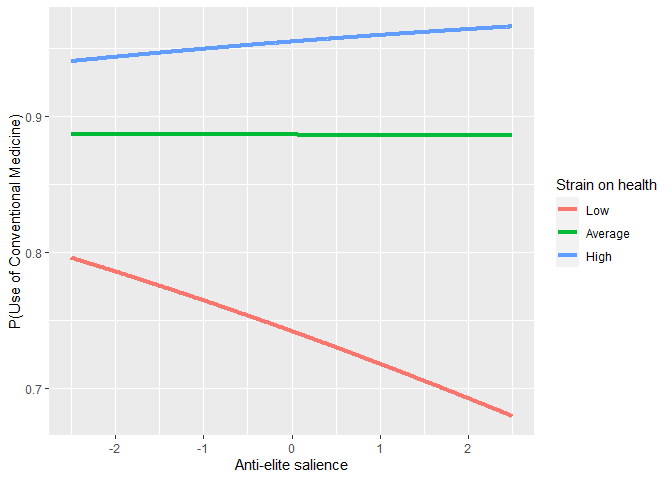
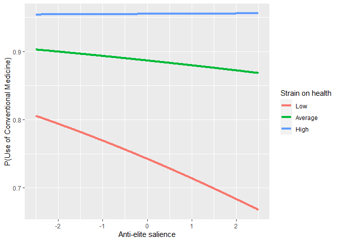
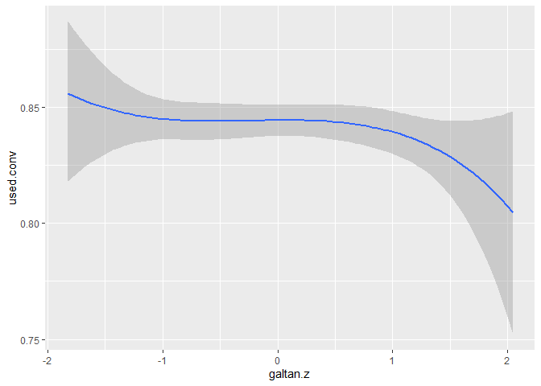
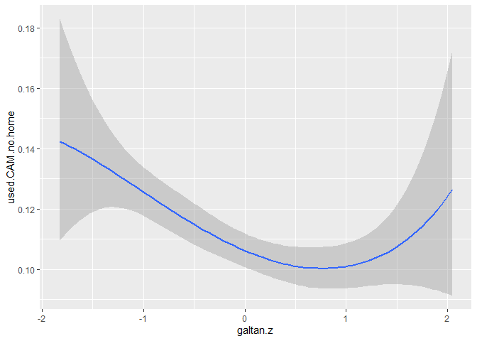

# Preparations

## Packages


```r
library(mclogit)
```

```
## Loading required package: Matrix
```

```r
library(emmeans)
```

```
## 
## Attaching package: 'emmeans'
```

```
## The following object is masked from 'package:devtools':
## 
##     test
```

```r
library(dplyr)
```

```
## 
## Attaching package: 'dplyr'
```

```
## The following objects are masked from 'package:stats':
## 
##     filter, lag
```

```
## The following objects are masked from 'package:base':
## 
##     intersect, setdiff, setequal, union
```

```r
library(rio)
```

```
## The following rio suggested packages are not installed: 'arrow', 'feather', 'fst', 'hexView', 'pzfx', 'readODS', 'rmatio'
## Use 'install_formats()' to install them
```

```r
library(memisc)
```

```
## Loading required package: lattice
```

```
## Loading required package: MASS
```

```
## 
## Attaching package: 'MASS'
```

```
## The following object is masked from 'package:dplyr':
## 
##     select
```

```
## 
## Attaching package: 'memisc'
```

```
## The following objects are masked from 'package:dplyr':
## 
##     collect, recode, rename, syms
```

```
## The following object is masked from 'package:Matrix':
## 
##     as.array
```

```
## The following objects are masked from 'package:stats':
## 
##     contr.sum, contr.treatment, contrasts
```

```
## The following object is masked from 'package:base':
## 
##     as.array
```

```r
library(psych)
library(ggplot2)
```

```
## 
## Attaching package: 'ggplot2'
```

```
## The following objects are masked from 'package:psych':
## 
##     %+%, alpha
```

```
## The following object is masked from 'package:memisc':
## 
##     syms
```

```r
source("../custom_functions.R")
```
## Dataset


```r
dat<-import("../../data/processed/fdat.xlsx")

str(dat)
```

```
## 'data.frame':	40185 obs. of  32 variables:
##  $ idno                      : num  1 2 3 4 5 6 7 13 14 21 ...
##  $ cntry                     : chr  "AT" "AT" "AT" "AT" ...
##  $ dweight                   : num  0.938 0.938 0.938 0.938 0.938 ...
##  $ pspwght                   : num  0.871 0.864 1.419 1.026 0.739 ...
##  $ pweight                   : num  0.406 0.406 0.406 0.406 0.406 ...
##  $ pt.nmbr                   : num  NA 6 2 3 NA 1 1 1 7 2 ...
##  $ pt.name                   : chr  NA NA "ÖVP" "FPÖ" ...
##  $ gndr.f                    : chr  "Male" "Male" "Female" "Male" ...
##  $ gndr.c                    : num  -0.5 -0.5 0.5 -0.5 0.5 0.5 -0.5 0.5 0.5 0.5 ...
##  $ agea                      : num  51 67 89 32 56 67 66 67 34 66 ...
##  $ age10.c                   : num  0.172 1.772 3.972 -1.728 0.672 ...
##  $ income                    : chr  "quint.2" "quint.2" "quint.1" "quint.2" ...
##  $ income.f                  : chr  "quint.2" "quint.2" "quint.1" "quint.2" ...
##  $ income.fr                 : chr  "quint.2" "quint.2" "quint.1" "quint.2" ...
##  $ edu                       : chr  "3. LUS" "1. <LS" "1. <LS" "3. LUS" ...
##  $ edu.f                     : chr  "3. LUS" "1. <LS" "1. <LS" "3. LUS" ...
##  $ strain.on.health          : num  1 7 2 4 2 2 5 6 6 3 ...
##  $ used.conv                 : num  0 1 1 1 1 1 1 1 1 1 ...
##  $ used.CAM                  : num  0 0 0 0 0 0 0 1 0 1 ...
##  $ DV                        : chr  "NN" "Used_conv_ONLY" "Used_conv_ONLY" "Used_conv_ONLY" ...
##  $ used.CAM.no.home          : num  0 0 0 0 0 0 0 1 0 1 ...
##  $ DV.no.home                : chr  "NN" "Used_conv_ONLY" "Used_conv_ONLY" "Used_conv_ONLY" ...
##  $ lrgen                     : num  NA NA 6.1 8.7 NA ...
##  $ lrecon                    : num  NA NA 6.4 5.5 NA ...
##  $ galtan                    : num  NA NA 7.2 8.8 NA ...
##  $ antielite_salience        : num  NA NA 1.6 8 NA ...
##  $ corrupt_salience          : num  NA NA 2.4 5.1 NA ...
##  $ lrgen.scaling             : num  2.3 2.3 2.3 2.3 2.3 ...
##  $ lrecon.scaling            : num  2.21 2.21 2.21 2.21 2.21 ...
##  $ galtan.scaling            : num  2.63 2.63 2.63 2.63 2.63 ...
##  $ antielite_salience.scaling: num  2.59 2.59 2.59 2.59 2.59 ...
##  $ corrupt_salience.scaling  : num  2.32 2.32 2.32 2.32 2.32 ...
```

## Data transformations

The reference levels for factorial variables need to be redefined, .xlsx format does not understand factor formats.

### Income


```r
dat$income.f<-case_when(
  is.na(dat$income) ~ "missing",
  TRUE ~ dat$income
)

#define reference level (top quintile)
table(dat$income.f,useNA="always")
```

```
## 
## missing quint.1 quint.2 quint.3 quint.4 quint.5    <NA> 
##    8296    6427    6999    6793    6408    5262       0
```

```r
dat$income.fr = relevel(as.factor(dat$income.f), ref="quint.5")
table(dat$income.fr,useNA="always")
```

```
## 
## quint.5 missing quint.1 quint.2 quint.3 quint.4    <NA> 
##    5262    8296    6427    6999    6793    6408       0
```

### Education


```r
table(dat$edu,useNA="always")
```

```
## 
## 1. <LS  2. LS 3. LUS 4. UUS  5. AV  6. BA  7. MA   <NA> 
##   4085   6760   7213   7094   5671   4366   4730    266
```

```r
dat$edu.f<-relevel(as.factor(dat$edu),ref="7. MA")
table(dat$edu.f,useNA="always")
```

```
## 
##  7. MA 1. <LS  2. LS 3. LUS 4. UUS  5. AV  6. BA   <NA> 
##   4730   4085   6760   7213   7094   5671   4366    266
```

### DV


```r
table(dat$DV,useNA="always")
```

```
## 
##                NN     Used_CAM_ONLY Used_conv_and_CAM    Used_conv_ONLY 
##              6877               503              5100             27705 
##              <NA> 
##                 0
```

```r
dat$DV.f<-relevel(as.factor(dat$DV),ref="NN")
table(dat$DV.f,useNA="always")
```

```
## 
##                NN     Used_CAM_ONLY Used_conv_and_CAM    Used_conv_ONLY 
##              6877               503              5100             27705 
##              <NA> 
##                 0
```

```r
table(dat$DV.no.home,useNA="always")
```

```
## 
##                NN     Used_CAM_ONLY Used_conv_and_CAM    Used_conv_ONLY 
##              6957               423              4155             28650 
##              <NA> 
##                 0
```

```r
dat$DV.no.home.f<-relevel(as.factor(dat$DV.no.home),ref="NN")
table(dat$DV.no.home.f,useNA="always")
```

```
## 
##                NN     Used_CAM_ONLY Used_conv_and_CAM    Used_conv_ONLY 
##              6957               423              4155             28650 
##              <NA> 
##                 0
```

### Strain on health and political orientation

Calculate country means for centering


```r
# Calculate country means for centering

cntry.means<-dat %>%
  group_by(cntry) %>%
  summarise(strain.on.health.cntry.mean=
              mean(strain.on.health,na.rm=T),
            lrgen.cntry.mean=
              mean(lrgen,na.rm=T),
            lrecon.cntry.mean=
              mean(lrecon,na.rm=T),
            galtan.cntry.mean=
              mean(galtan,na.rm=T),
            antielite_salience.cntry.mean=
              mean(antielite_salience,na.rm=T),
            corrupt_salience.cntry.mean=
              mean(corrupt_salience,na.rm=T))

#combine data frames

dat<-left_join(
  x=dat,
  y=cntry.means,
  by="cntry"
)

#country-mean center strain on health

dat$strain.on.health.c<-
  dat$strain.on.health-dat$strain.on.health.cntry.mean

#country-mean center political orientation

dat$lrgen.c<-
  dat$lrgen-dat$lrgen.cntry.mean
dat$lrecon.c<-
  dat$lrecon-dat$lrecon.cntry.mean
dat$galtan.c<-
  dat$galtan-dat$galtan.cntry.mean
dat$antielite_salience.c<-
  dat$antielite_salience-dat$antielite_salience.cntry.mean
dat$corrupt_salience.c<-
  dat$corrupt_salience-dat$corrupt_salience.cntry.mean

#scale with CHES grand SD
dat$lrgen.z<-
  dat$lrgen.c/dat$lrgen.scaling
dat$lrecon.z<-
  dat$lrecon.c/dat$lrecon.scaling
dat$galtan.z<-
  dat$galtan.c/dat$galtan.scaling
dat$antielite_salience.z<-
  dat$antielite_salience.c/dat$antielite_salience.scaling
dat$corrupt_salience.z<-
  dat$corrupt_salience.c/dat$corrupt_salience.scaling
```

## Exclude missing variable


```r
fdat<-dat %>%
  filter(cntry!="IL" & cntry!="EE") %>%
  filter(!is.na(cntry) & 
         !is.na(gndr.c) &
         !is.na(age10.c) &
         !is.na(income.fr) &
           !is.na(edu.f) &
           !is.na(strain.on.health.c) &
           !is.na(DV) &
           !is.na(lrgen.z) &
           !is.na(lrecon.z) &
           !is.na(galtan.z) &
           !is.na(antielite_salience.z) &
           !is.na(corrupt_salience.z))
```

## Construct anweight variable for weighting


```r
fdat$anweight=fdat$pspwght*fdat$pweight
```

# Descriptive analysis

## Check the presence of all DV-groups across countries


```r
table(fdat$cntry,fdat$DV.no.home.f)
```

```
##     
##        NN Used_CAM_ONLY Used_conv_and_CAM Used_conv_ONLY
##   AT  123            10               120            804
##   BE  136             3                87           1018
##   CH   95            19                90            438
##   CZ  145             4               144            771
##   DE  159             6               217           1660
##   DK  175             7               147            821
##   ES  108             5                90            828
##   FI  176            11               105           1028
##   FR   70             4               120            743
##   GB  203             8               126            963
##   HU  257             7                43            536
##   IE  255            13                93            913
##   LT  229            28               254            494
##   NL  245            10                72           1007
##   NO  164             8               104            775
##   PL  122             6                46            596
##   PT   30             1                40            491
##   SE  313            16               127            955
##   SI   59             8                83            405
```

```r
round(100*prop.table(table(fdat$cntry,fdat$DV.no.home.f),
                     margin = 1),1)
```

```
##     
##        NN Used_CAM_ONLY Used_conv_and_CAM Used_conv_ONLY
##   AT 11.6           0.9              11.4           76.1
##   BE 10.9           0.2               7.0           81.8
##   CH 14.8           3.0              14.0           68.2
##   CZ 13.6           0.4              13.5           72.5
##   DE  7.8           0.3              10.6           81.3
##   DK 15.2           0.6              12.8           71.4
##   ES 10.5           0.5               8.7           80.3
##   FI 13.3           0.8               8.0           77.9
##   FR  7.5           0.4              12.8           79.3
##   GB 15.6           0.6               9.7           74.1
##   HU 30.5           0.8               5.1           63.6
##   IE 20.0           1.0               7.3           71.7
##   LT 22.8           2.8              25.3           49.2
##   NL 18.4           0.7               5.4           75.5
##   NO 15.6           0.8               9.9           73.7
##   PL 15.8           0.8               6.0           77.4
##   PT  5.3           0.2               7.1           87.4
##   SE 22.2           1.1               9.0           67.7
##   SI 10.6           1.4              15.0           73.0
```


# Analysis

## Empty model


```r
mod0<-mblogit(DV.no.home.f~1,
              random= ~1|cntry,
              estimator="ML",
              data=fdat,weights=anweight)
```

```
## Iteration 1 - deviance = 28012.1 - criterion = 0.7052281
## Iteration 2 - deviance = 26960.55 - criterion = 0.2406145
## Iteration 3 - deviance = 26811.32 - criterion = 0.03329685
## Iteration 4 - deviance = 26785.73 - criterion = 0.008179275
## Iteration 5 - deviance = 26781.48 - criterion = 0.0005445876
## Iteration 6 - deviance = 26780.83 - criterion = 3.449517e-06
## Iteration 7 - deviance = 26780.79 - criterion = 7.6008e-09
## converged
```

```r
mod0
```

```
## mblogit(formula = DV.no.home.f ~ 1, data = fdat, random = ~1 | 
##     cntry, weights = anweight, estimator = "ML")
## 
## Coefficients:
##                       Predictors
## Response categories     (Intercept)
##   Used_CAM_ONLY/NN      -2.9809    
##   Used_conv_and_CAM/NN  -0.4121    
##   Used_conv_ONLY/NN      1.6139    
## 
## (Co-)Variances:
## Grouping level: 1 
##                      Used_CAM_ONLY~1  Used_conv_and_CAM~1
## Used_CAM_ONLY~1       0.32173                            
## Used_conv_and_CAM~1   0.11666          0.36270           
## Used_conv_ONLY~1     -0.06233          0.19666           
##                      Used_conv_ONLY~1
## Used_CAM_ONLY~1                      
## Used_conv_and_CAM~1                  
## Used_conv_ONLY~1      0.25709        
## 
## Null Deviance:     52210 
## Residual Deviance: 26780
```

```r
summary(mod0)
```

```
## 
## Call:
## mblogit(formula = DV.no.home.f ~ 1, data = fdat, random = ~1 | 
##     cntry, weights = anweight, estimator = "ML")
## 
## Equation for Used_CAM_ONLY vs NN:
##             Estimate Std. Error z value Pr(>|z|)    
## (Intercept)  -2.9809     0.1732  -17.21   <2e-16 ***
## 
## Equation for Used_conv_and_CAM vs NN:
##             Estimate Std. Error z value Pr(>|z|)   
## (Intercept)  -0.4121     0.1465  -2.814   0.0049 **
## 
## Equation for Used_conv_ONLY vs NN:
##             Estimate Std. Error z value Pr(>|z|)    
## (Intercept)   1.6139     0.1213    13.3   <2e-16 ***
## ---
## Signif. codes:  0 '***' 0.001 '**' 0.01 '*' 0.05 '.' 0.1 ' ' 1
## 
## (Co-)Variances:
## Grouping level: cntry 
##                     Estimate                     Std.Err.               
## Used_CAM_ONLY~1      0.32173                     0.01614                
## Used_conv_and_CAM~1  0.11666  0.36270            0.01842 0.03260        
## Used_conv_ONLY~1    -0.06233  0.19666  0.25709   0.01174 0.02207 0.01702
## 
## Null Deviance:     52210 
## Residual Deviance: 26780 
## Number of Fisher Scoring iterations:  7
## Number of observations
##   Groups by cntry: 19
##   Individual observations:  18832.14
```

```r
mtable(mod0,show.baselevel = T)
```

```
## 
## Calls:
## mod0: mblogit(formula = DV.no.home.f ~ 1, data = fdat, random = ~1 | 
##     cntry, weights = anweight, estimator = "ML")
## 
## ================================================================================================
##                                        Used_CAM_ONLY/NN Used_conv_and_CAM/NN Used_conv_ONLY/NN  
## ------------------------------------------------------------------------------------------------
##   (Intercept)                               -2.981***         -0.412**            1.614***      
##                                             (0.173)           (0.146)            (0.121)        
## ------------------------------------------------------------------------------------------------
##   Used_CAM_ONLY/NN x  VCov(~1,~1)            0.322             0.117             -0.062         
##                                             (0.016)           (0.018)            (0.012)        
##   Used_conv_and_CAM/NN x  VCov(~1,~1)        0.117             0.363              0.197         
##                                             (0.018)           (0.033)            (0.022)        
##   Used_conv_ONLY/NN x  VCov(~1,~1)          -0.062             0.197              0.257         
##                                             (0.012)           (0.022)            (0.017)        
## ------------------------------------------------------------------------------------------------
##   Groups by cntry                           19                                                  
## ------------------------------------------------------------------------------------------------
##   Deviance                               26780.8                                                
##   N                                      18832                                                  
## ================================================================================================
##   Significance: *** = p < 0.001; ** = p < 0.01; * = p < 0.05
```

## Model with covariates


```r
mod1<-
  mblogit(DV.no.home.f~gndr.c+age10.c+income.fr+edu.f+
            strain.on.health.c,
              random= ~1|cntry,
              estimator="ML",
              data=fdat,weights=anweight)
```

```
## Iteration 1 - deviance = 26069.17 - criterion = 0.747968
## Iteration 2 - deviance = 24759.61 - criterion = 0.1651126
## Iteration 3 - deviance = 24572.54 - criterion = 0.02773797
## Iteration 4 - deviance = 24525.61 - criterion = 0.0183009
## Iteration 5 - deviance = 24514.55 - criterion = 0.008383645
## Iteration 6 - deviance = 24512.1 - criterion = 0.002209934
## Iteration 7 - deviance = 24512.5 - criterion = 0.0003922343
## Iteration 8 - deviance = 24512.32 - criterion = 6.65449e-06
## Iteration 9 - deviance = 24512.29 - criterion = 6.177509e-08
## Iteration 10 - deviance = 24512.29 - criterion = 1.52337e-11
## converged
```

```r
summary(mod1)
```

```
## 
## Call:
## mblogit(formula = DV.no.home.f ~ gndr.c + age10.c + income.fr + 
##     edu.f + strain.on.health.c, data = fdat, random = ~1 | cntry, 
##     weights = anweight, estimator = "ML")
## 
## Equation for Used_CAM_ONLY vs NN:
##                    Estimate Std. Error z value Pr(>|z|)    
## (Intercept)        -1.89441    0.27906  -6.788 1.13e-11 ***
## gndr.c              0.11408    0.19890   0.574 0.566253    
## age10.c            -0.02689    0.06596  -0.408 0.683511    
## income.frmissing   -1.19222    0.47005  -2.536 0.011201 *  
## income.frquint.1   -1.53646    0.67410  -2.279 0.022651 *  
## income.frquint.2    0.16992    0.29855   0.569 0.569242    
## income.frquint.3   -0.03708    0.28957  -0.128 0.898108    
## income.frquint.4   -0.05289    0.26861  -0.197 0.843910    
## edu.f1. <LS        -2.51131    1.01866  -2.465 0.013689 *  
## edu.f2. LS         -0.73767    0.33330  -2.213 0.026882 *  
## edu.f3. LUS        -0.71259    0.30506  -2.336 0.019495 *  
## edu.f4. UUS        -1.35658    0.39755  -3.412 0.000644 ***
## edu.f5. AV         -0.36957    0.29675  -1.245 0.212990    
## edu.f6. BA         -0.71584    0.33640  -2.128 0.033342 *  
## strain.on.health.c  0.28667    0.05295   5.413 6.18e-08 ***
## 
## Equation for Used_conv_and_CAM vs NN:
##                    Estimate Std. Error z value Pr(>|z|)    
## (Intercept)         0.23138    0.18743   1.234 0.217024    
## gndr.c              1.13544    0.06866  16.537  < 2e-16 ***
## age10.c             0.10302    0.02147   4.799 1.59e-06 ***
## income.frmissing   -0.16248    0.12619  -1.288 0.197917    
## income.frquint.1   -0.03824    0.12984  -0.294 0.768386    
## income.frquint.2    0.01398    0.11329   0.123 0.901796    
## income.frquint.3   -0.03942    0.10837  -0.364 0.716052    
## income.frquint.4   -0.03029    0.10239  -0.296 0.767376    
## edu.f1. <LS        -1.14086    0.16706  -6.829 8.56e-12 ***
## edu.f2. LS         -0.56375    0.12338  -4.569 4.90e-06 ***
## edu.f3. LUS        -0.41420    0.11273  -3.674 0.000239 ***
## edu.f4. UUS        -0.59095    0.12802  -4.616 3.91e-06 ***
## edu.f5. AV         -0.22681    0.11782  -1.925 0.054219 .  
## edu.f6. BA         -0.28021    0.12815  -2.187 0.028771 *  
## strain.on.health.c  0.56032    0.01781  31.463  < 2e-16 ***
## 
## Equation for Used_conv_ONLY vs NN:
##                     Estimate Std. Error z value Pr(>|z|)    
## (Intercept)         1.999026   0.152958  13.069   <2e-16 ***
## gndr.c              0.520604   0.047953  10.857   <2e-16 ***
## age10.c             0.192069   0.015162  12.668   <2e-16 ***
## income.frmissing   -0.144283   0.083396  -1.730   0.0836 .  
## income.frquint.1    0.036065   0.093777   0.385   0.7005    
## income.frquint.2   -0.001358   0.081724  -0.017   0.9867    
## income.frquint.3   -0.011606   0.076096  -0.153   0.8788    
## income.frquint.4    0.004925   0.071946   0.068   0.9454    
## edu.f1. <LS        -0.031013   0.113303  -0.274   0.7843    
## edu.f2. LS         -0.074529   0.087295  -0.854   0.3932    
## edu.f3. LUS        -0.100145   0.082031  -1.221   0.2222    
## edu.f4. UUS        -0.026480   0.087264  -0.303   0.7616    
## edu.f5. AV         -0.098127   0.087817  -1.117   0.2638    
## edu.f6. BA         -0.022082   0.090657  -0.244   0.8076    
## strain.on.health.c  0.412323   0.015732  26.209   <2e-16 ***
## ---
## Signif. codes:  0 '***' 0.001 '**' 0.01 '*' 0.05 '.' 0.1 ' ' 1
## 
## (Co-)Variances:
## Grouping level: cntry 
##                     Estimate                     Std.Err.               
## Used_CAM_ONLY~1      0.39224                     0.02654                
## Used_conv_and_CAM~1 -0.05099  0.45862            0.03335 0.06595        
## Used_conv_ONLY~1    -0.09732  0.27280  0.33050   0.02876 0.05383 0.04468
## 
## Null Deviance:     52210 
## Residual Deviance: 24510 
## Number of Fisher Scoring iterations:  10
## Number of observations
##   Groups by cntry: 19
##   Individual observations:  18832.14
```

```r
mod1
```

```
## mblogit(formula = DV.no.home.f ~ gndr.c + age10.c + income.fr + 
##     edu.f + strain.on.health.c, data = fdat, random = ~1 | cntry, 
##     weights = anweight, estimator = "ML")
## 
## Coefficients:
##                       Predictors
## Response categories     (Intercept)  gndr.c     age10.c  
##   Used_CAM_ONLY/NN      -1.894410     0.114084  -0.026889
##   Used_conv_and_CAM/NN   0.231381     1.135437   0.103017
##   Used_conv_ONLY/NN      1.999026     0.520604   0.192069
##                       Predictors
## Response categories     income.frmissing  income.frquint.1
##   Used_CAM_ONLY/NN      -1.192220         -1.536456       
##   Used_conv_and_CAM/NN  -0.162475         -0.038235       
##   Used_conv_ONLY/NN     -0.144283          0.036065       
##                       Predictors
## Response categories     income.frquint.2  income.frquint.3
##   Used_CAM_ONLY/NN       0.169923         -0.037080       
##   Used_conv_and_CAM/NN   0.013979         -0.039418       
##   Used_conv_ONLY/NN     -0.001358         -0.011606       
##                       Predictors
## Response categories     income.frquint.4  edu.f1. <LS  edu.f2. LS
##   Used_CAM_ONLY/NN      -0.052889         -2.511313    -0.737667 
##   Used_conv_and_CAM/NN  -0.030289         -1.140858    -0.563745 
##   Used_conv_ONLY/NN      0.004925         -0.031013    -0.074529 
##                       Predictors
## Response categories     edu.f3. LUS  edu.f4. UUS  edu.f5. AV  edu.f6. BA
##   Used_CAM_ONLY/NN      -0.712595    -1.356582    -0.369567   -0.715838 
##   Used_conv_and_CAM/NN  -0.414198    -0.590948    -0.226811   -0.280213 
##   Used_conv_ONLY/NN     -0.100145    -0.026480    -0.098127   -0.022082 
##                       Predictors
## Response categories     strain.on.health.c
##   Used_CAM_ONLY/NN       0.286666         
##   Used_conv_and_CAM/NN   0.560321         
##   Used_conv_ONLY/NN      0.412323         
## 
## (Co-)Variances:
## Grouping level: 1 
##                      Used_CAM_ONLY~1  Used_conv_and_CAM~1
## Used_CAM_ONLY~1       0.39224                            
## Used_conv_and_CAM~1  -0.05099          0.45862           
## Used_conv_ONLY~1     -0.09732          0.27280           
##                      Used_conv_ONLY~1
## Used_CAM_ONLY~1                      
## Used_conv_and_CAM~1                  
## Used_conv_ONLY~1      0.33050        
## 
## Null Deviance:     52210 
## Residual Deviance: 24510
```

```r
mtable(mod1,show.baselevel = T)
```

```
## 
## Calls:
## mod1: mblogit(formula = DV.no.home.f ~ gndr.c + age10.c + income.fr + 
##     edu.f + strain.on.health.c, data = fdat, random = ~1 | cntry, 
##     weights = anweight, estimator = "ML")
## 
## ================================================================================================
##                                        Used_CAM_ONLY/NN Used_conv_and_CAM/NN Used_conv_ONLY/NN  
## ------------------------------------------------------------------------------------------------
##   (Intercept)                               -1.894***         0.231               1.999***      
##                                             (0.279)          (0.187)             (0.153)        
##   gndr.c                                     0.114            1.135***            0.521***      
##                                             (0.199)          (0.069)             (0.048)        
##   age10.c                                   -0.027            0.103***            0.192***      
##                                             (0.066)          (0.021)             (0.015)        
##   income.fr: missing/quint.5                -1.192*          -0.162              -0.144         
##                                             (0.470)          (0.126)             (0.083)        
##   income.fr: quint.1/quint.5                -1.536*          -0.038               0.036         
##                                             (0.674)          (0.130)             (0.094)        
##   income.fr: quint.2/quint.5                 0.170            0.014              -0.001         
##                                             (0.299)          (0.113)             (0.082)        
##   income.fr: quint.3/quint.5                -0.037           -0.039              -0.012         
##                                             (0.290)          (0.108)             (0.076)        
##   income.fr: quint.4/quint.5                -0.053           -0.030               0.005         
##                                             (0.269)          (0.102)             (0.072)        
##   edu.f: 1. <LS/7. MA                       -2.511*          -1.141***           -0.031         
##                                             (1.019)          (0.167)             (0.113)        
##   edu.f: 2. LS/7. MA                        -0.738*          -0.564***           -0.075         
##                                             (0.333)          (0.123)             (0.087)        
##   edu.f: 3. LUS/7. MA                       -0.713*          -0.414***           -0.100         
##                                             (0.305)          (0.113)             (0.082)        
##   edu.f: 4. UUS/7. MA                       -1.357***        -0.591***           -0.026         
##                                             (0.398)          (0.128)             (0.087)        
##   edu.f: 5. AV/7. MA                        -0.370           -0.227              -0.098         
##                                             (0.297)          (0.118)             (0.088)        
##   edu.f: 6. BA/7. MA                        -0.716*          -0.280*             -0.022         
##                                             (0.336)          (0.128)             (0.091)        
##   strain.on.health.c                         0.287***         0.560***            0.412***      
##                                             (0.053)          (0.018)             (0.016)        
## ------------------------------------------------------------------------------------------------
##   Used_CAM_ONLY/NN x  VCov(~1,~1)            0.392           -0.051              -0.097         
##                                             (0.027)          (0.033)             (0.029)        
##   Used_conv_and_CAM/NN x  VCov(~1,~1)       -0.051            0.459               0.273         
##                                             (0.033)          (0.066)             (0.054)        
##   Used_conv_ONLY/NN x  VCov(~1,~1)          -0.097            0.273               0.331         
##                                             (0.029)          (0.054)             (0.045)        
## ------------------------------------------------------------------------------------------------
##   Groups by cntry                           19                                                  
## ------------------------------------------------------------------------------------------------
##   Deviance                               24512.3                                                
##   N                                      18832                                                  
## ================================================================================================
##   Significance: *** = p < 0.001; ** = p < 0.01; * = p < 0.05
```

### Strain on health main effects


```r
ref_grid(mod1)
```

```
## 'emmGrid' object with variables:
##     gndr.c = -0.5,  0.5
##     age10.c = 0.39152
##     income.fr = quint.5, missing, quint.1, quint.2, quint.3, quint.4
##     edu.f = 7. MA, 1. <LS, 2. LS, 3. LUS, 4. UUS, 5. AV, 6. BA
##     strain.on.health.c = 0.065329
##     DV.no.home.f = multivariate response levels: NN, Used_CAM_ONLY, Used_conv_and_CAM, Used_conv_ONLY
```

```r
mod1.strain.trends<-
  emtrends(mod1,~1|DV.no.home.f,
           var="strain.on.health.c",infer=T,mode="latent",
           at=list(gndr.c=0,age10.c=0))

#effects for each DV-category
(mod1.strain.eff<-
  contrast(mod1.strain.trends,simple="DV.no.home.f",
         adjust="none","eff",infer=c(T,T)))
```

```
##  contrast                 estimate     SE  df asymp.LCL asymp.UCL
##  NN effect                 -0.3148 0.0172 Inf   -0.3486   -0.2811
##  Used_CAM_ONLY effect      -0.0282 0.0384 Inf   -0.1034    0.0471
##  Used_conv_and_CAM effect   0.2455 0.0149 Inf    0.2163    0.2747
##  Used_conv_ONLY effect      0.0975 0.0138 Inf    0.0705    0.1245
##  z.ratio p.value
##  -18.289  <.0001
##   -0.733  0.4635
##   16.462  <.0001
##    7.084  <.0001
## 
## Results are averaged over the levels of: income.fr, edu.f 
## Confidence level used: 0.95
```

```r
#save to file
export(data.frame(mod1.strain.eff),
       "../../results/Homeopathy_excluded/mod1.strain.eff.MN.xlsx",
       overwrite=T)

#Use of conventional medicine

(mod1.strain.eff.CM<-
  contrast(mod1.strain.trends,
           method = list("Conv - No conv" = contrast.weights.total(effects=mod1.strain.eff,
          signs=c(-2,-2,2,2))),
           simple="DV.no.home.f",
           infer=c(T,T)))
```

```
##  contrast       estimate     SE  df asymp.LCL asymp.UCL z.ratio p.value
##  Conv - No conv    0.391 0.0196 Inf     0.352     0.429  19.967  <.0001
## 
## Results are averaged over the levels of: income.fr, edu.f 
## Confidence level used: 0.95
```

```r
(mod1.strain.eff.CAM<-
    contrast(mod1.strain.trends,
         method = list("CAM - No CAM" = contrast.weights.total(effects=mod1.strain.eff,
                 signs=c(-2,2,2,-2))),
         simple="DV.no.home.f",
           infer=c(T,T)))
```

```
##  contrast     estimate     SE  df asymp.LCL asymp.UCL z.ratio p.value
##  CAM - No CAM    0.236 0.0145 Inf     0.208     0.264  16.313  <.0001
## 
## Results are averaged over the levels of: income.fr, edu.f 
## Confidence level used: 0.95
```

```r
# save to file
export(data.frame(rbind(mod1.strain.eff.CM,
      mod1.strain.eff.CAM,adjust="none")),
      "../../results/Homeopathy_excluded/mod1.strain.eff.COMB.xlsx")
```


## Model for lrgen


```r
mod2.lrgen<-
  mblogit(DV.no.home.f~gndr.c+age10.c+income.fr+edu.f+
            strain.on.health.c+
            lrgen.z,
                    random= ~1|cntry,
                    estimator="ML",
                    control = mmclogit.control(maxit = 250, trace=TRUE),
                    data=fdat,weights=anweight)
```

```
## Iteration 1 - deviance = 26061.88 - criterion = 0.7481345
## Iteration 2 - deviance = 24750.72 - criterion = 0.1649942
## Iteration 3 - deviance = 24563.5 - criterion = 0.0276807
## Iteration 4 - deviance = 24516.55 - criterion = 0.01828287
## Iteration 5 - deviance = 24505.45 - criterion = 0.008365111
## Iteration 6 - deviance = 24503 - criterion = 0.002208081
## Iteration 7 - deviance = 24503.44 - criterion = 0.0003889114
## Iteration 8 - deviance = 24503.26 - criterion = 6.560689e-06
## Iteration 9 - deviance = 24503.24 - criterion = 6.191528e-08
## Iteration 10 - deviance = 24503.23 - criterion = 1.753871e-11
## converged
```

```r
# general model comparison

anova(mod1,mod2.lrgen,test="Chisq")
```

```
## Analysis of Deviance Table
## 
## Model 1: DV.no.home.f ~ gndr.c + age10.c + income.fr + edu.f + strain.on.health.c
## Model 2: DV.no.home.f ~ gndr.c + age10.c + income.fr + edu.f + strain.on.health.c + 
##     lrgen.z
##   Resid. Df Resid. Dev Df Deviance Pr(>Chi)  
## 1     82323      24512                       
## 2     82320      24503  3   9.0535  0.02859 *
## ---
## Signif. codes:  0 '***' 0.001 '**' 0.01 '*' 0.05 '.' 0.1 ' ' 1
```

```r
# Is lrgen associated with using conventional medicine?
ref_grid(mod2.lrgen)
```

```
## 'emmGrid' object with variables:
##     gndr.c = -0.5,  0.5
##     age10.c = 0.39152
##     income.fr = quint.5, missing, quint.1, quint.2, quint.3, quint.4
##     edu.f = 7. MA, 1. <LS, 2. LS, 3. LUS, 4. UUS, 5. AV, 6. BA
##     strain.on.health.c = 0.065329
##     lrgen.z = -0.00060242
##     DV.no.home.f = multivariate response levels: NN, Used_CAM_ONLY, Used_conv_and_CAM, Used_conv_ONLY
```

```r
mod2.lrgen.trends<-
  emtrends(mod2.lrgen,~1|DV.no.home.f,
           var="lrgen.z",infer=c(T,T),mode="latent",
           at=list(gndr.c=0,age10.c=0,
                   strain.on.health.c=0))

#effects for each DV-category
(mod2.lrgen.eff<-
  contrast(mod2.lrgen.trends,simple="DV.no.home.f",
         adjust="none","eff", infer=c(T,T)))
```

```
##  contrast                 estimate     SE  df asymp.LCL asymp.UCL
##  NN effect                  0.0508 0.0339 Inf   -0.0157    0.1173
##  Used_CAM_ONLY effect       0.0243 0.0828 Inf   -0.1379    0.1866
##  Used_conv_and_CAM effect  -0.0552 0.0354 Inf   -0.1246    0.0142
##  Used_conv_ONLY effect     -0.0200 0.0300 Inf   -0.0788    0.0388
##  z.ratio p.value
##    1.498  0.1341
##    0.294  0.7689
##   -1.558  0.1193
##   -0.666  0.5052
## 
## Results are averaged over the levels of: income.fr, edu.f 
## Confidence level used: 0.95
```

```r
#save to file
export(data.frame(mod2.lrgen.eff),
       "../../results/Homeopathy_excluded/mod2.lrgen.eff.MN.xlsx",
       overwrite=T)

#Use of conventional medicine

(mod2.lrgen.eff.CM<-
    contrast(mod2.lrgen.trends,
         method = list("Conv - No conv" = contrast.weights.total(effects=mod2.lrgen.eff,
                 signs=c(-2,-2,2,2))),
         simple="DV.no.home.f", infer=c(T,T)))
```

```
##  contrast       estimate     SE  df asymp.LCL asymp.UCL z.ratio p.value
##  Conv - No conv  -0.0779 0.0362 Inf    -0.149    -0.007  -2.153  0.0313
## 
## Results are averaged over the levels of: income.fr, edu.f 
## Confidence level used: 0.95
```

```r
#Use of CAM

(mod2.lrgen.eff.CAM<-
    contrast(mod2.lrgen.trends,
         method = list("CAM - No CAM" = contrast.weights.total(effects=mod2.lrgen.eff,
                 signs=c(-2,2,2,-2))),
         simple="DV.no.home.f", infer=c(T,T)))
```

```
##  contrast     estimate     SE  df asymp.LCL asymp.UCL z.ratio p.value
##  CAM - No CAM  -0.0427 0.0384 Inf    -0.118    0.0327  -1.110  0.2669
## 
## Results are averaged over the levels of: income.fr, edu.f 
## Confidence level used: 0.95
```

```r
# save to file
export(data.frame(rbind(
  mod2.lrgen.eff.CM,
  mod2.lrgen.eff.CAM,adjust="none")),
  "../../results/Homeopathy_excluded/mod2.lrgen.eff.COMB.xlsx")
```

## Model for lrecon


```r
mod2.lrecon<-
  mblogit(DV.no.home.f~gndr.c+age10.c+income.fr+edu.f+
            strain.on.health.c+
            lrecon.z,
                    random= ~1|cntry,
                    estimator="ML",
                    control = mmclogit.control(maxit = 250, trace=TRUE),
                    data=fdat,weights=anweight)
```

```
## Iteration 1 - deviance = 26065.17 - criterion = 0.748109
## Iteration 2 - deviance = 24754.35 - criterion = 0.1650852
## Iteration 3 - deviance = 24567.14 - criterion = 0.02771106
## Iteration 4 - deviance = 24520.19 - criterion = 0.0182952
## Iteration 5 - deviance = 24509.09 - criterion = 0.008365327
## Iteration 6 - deviance = 24506.64 - criterion = 0.002210735
## Iteration 7 - deviance = 24507.09 - criterion = 0.000389569
## Iteration 8 - deviance = 24506.92 - criterion = 6.549313e-06
## Iteration 9 - deviance = 24506.89 - criterion = 6.16114e-08
## Iteration 10 - deviance = 24506.88 - criterion = 1.886284e-11
## converged
```

```r
# general model comparison

anova(mod1,mod2.lrecon,test="Chisq")
```

```
## Analysis of Deviance Table
## 
## Model 1: DV.no.home.f ~ gndr.c + age10.c + income.fr + edu.f + strain.on.health.c
## Model 2: DV.no.home.f ~ gndr.c + age10.c + income.fr + edu.f + strain.on.health.c + 
##     lrecon.z
##   Resid. Df Resid. Dev Df Deviance Pr(>Chi)
## 1     82323      24512                     
## 2     82320      24507  3   5.4018   0.1446
```

```r
# Is lrecon associated with using conventional medicine?
ref_grid(mod2.lrecon)
```

```
## 'emmGrid' object with variables:
##     gndr.c = -0.5,  0.5
##     age10.c = 0.39152
##     income.fr = quint.5, missing, quint.1, quint.2, quint.3, quint.4
##     edu.f = 7. MA, 1. <LS, 2. LS, 3. LUS, 4. UUS, 5. AV, 6. BA
##     strain.on.health.c = 0.065329
##     lrecon.z = -0.00052762
##     DV.no.home.f = multivariate response levels: NN, Used_CAM_ONLY, Used_conv_and_CAM, Used_conv_ONLY
```

```r
mod2.lrecon.trends<-
  emtrends(mod2.lrecon,~1|DV.no.home.f,
           var="lrecon.z",infer=c(T,T),mode="latent",
           at=list(gndr.c=0,age10.c=0,
                   strain.on.health.c=0))

#effects for each DV-category
(mod2.lrecon.eff<-
  contrast(mod2.lrecon.trends,simple="DV.no.home.f",
         adjust="none","eff", infer=c(T,T)))
```

```
##  contrast                 estimate     SE  df asymp.LCL asymp.UCL
##  NN effect                  0.0344 0.0328 Inf   -0.0300    0.0987
##  Used_CAM_ONLY effect       0.0299 0.0795 Inf   -0.1259    0.1857
##  Used_conv_and_CAM effect  -0.0469 0.0345 Inf   -0.1144    0.0207
##  Used_conv_ONLY effect     -0.0174 0.0289 Inf   -0.0741    0.0393
##  z.ratio p.value
##    1.046  0.2953
##    0.376  0.7068
##   -1.360  0.1738
##   -0.601  0.5478
## 
## Results are averaged over the levels of: income.fr, edu.f 
## Confidence level used: 0.95
```

```r
#save to file
export(data.frame(mod2.lrecon.eff),
       "../../results/Homeopathy_excluded/mod2.lrecon.eff.MN.xlsx",
       overwrite=T)

#Use of conventional medicine

(mod2.lrecon.eff.CM<-
    contrast(mod2.lrecon.trends,
         method = list("Conv - No conv" = contrast.weights.total(effects=mod2.lrecon.eff,
                 signs=c(-2,-2,2,2))),
         simple="DV.no.home.f", infer=c(T,T)))
```

```
##  contrast       estimate     SE  df asymp.LCL asymp.UCL z.ratio p.value
##  Conv - No conv   -0.062 0.0351 Inf    -0.131   0.00674  -1.768  0.0771
## 
## Results are averaged over the levels of: income.fr, edu.f 
## Confidence level used: 0.95
```

```r
#Use of CAM

(mod2.lrecon.eff.CAM<-
    contrast(mod2.lrecon.trends,
         method = list("CAM - No CAM" = contrast.weights.total(effects=mod2.lrecon.eff,
                 signs=c(-2,2,2,-2))),
         simple="DV.no.home.f", infer=c(T,T)))
```

```
##  contrast     estimate     SE  df asymp.LCL asymp.UCL z.ratio p.value
##  CAM - No CAM  -0.0294 0.0376 Inf    -0.103    0.0444  -0.781  0.4349
## 
## Results are averaged over the levels of: income.fr, edu.f 
## Confidence level used: 0.95
```

```r
# save to file
export(data.frame(rbind(
  mod2.lrecon.eff.CM,
  mod2.lrecon.eff.CAM,adjust="none")),
  "../../results/Homeopathy_excluded/mod2.lrecon.eff.COMB.xlsx")
```

## Model for galtan


```r
mod2.galtan<-
  mblogit(DV.no.home.f~gndr.c+age10.c+income.fr+edu.f+
            strain.on.health.c+
            galtan.z,
                    random= ~1|cntry,
                    estimator="ML",
                    control = mmclogit.control(maxit = 250, trace=TRUE),
                    data=fdat,weights=anweight)
```

```
## Iteration 1 - deviance = 26064.02 - criterion = 0.7480098
## Iteration 2 - deviance = 24752.71 - criterion = 0.1651884
## Iteration 3 - deviance = 24564.8 - criterion = 0.02790155
## Iteration 4 - deviance = 24517.42 - criterion = 0.01858548
## Iteration 5 - deviance = 24506.53 - criterion = 0.008486611
## Iteration 6 - deviance = 24504 - criterion = 0.002209728
## Iteration 7 - deviance = 24504.24 - criterion = 0.0003995467
## Iteration 8 - deviance = 24504.05 - criterion = 6.795021e-06
## Iteration 9 - deviance = 24504.02 - criterion = 6.350731e-08
## Iteration 10 - deviance = 24504.01 - criterion = 1.385013e-11
## converged
```

```r
# general model comparison

anova(mod1,mod2.galtan,test="Chisq")
```

```
## Analysis of Deviance Table
## 
## Model 1: DV.no.home.f ~ gndr.c + age10.c + income.fr + edu.f + strain.on.health.c
## Model 2: DV.no.home.f ~ gndr.c + age10.c + income.fr + edu.f + strain.on.health.c + 
##     galtan.z
##   Resid. Df Resid. Dev Df Deviance Pr(>Chi)  
## 1     82323      24512                       
## 2     82320      24504  3   8.2722  0.04071 *
## ---
## Signif. codes:  0 '***' 0.001 '**' 0.01 '*' 0.05 '.' 0.1 ' ' 1
```

```r
# Is galtan associated with using conventional medicine?
ref_grid(mod2.galtan)
```

```
## 'emmGrid' object with variables:
##     gndr.c = -0.5,  0.5
##     age10.c = 0.39152
##     income.fr = quint.5, missing, quint.1, quint.2, quint.3, quint.4
##     edu.f = 7. MA, 1. <LS, 2. LS, 3. LUS, 4. UUS, 5. AV, 6. BA
##     strain.on.health.c = 0.065329
##     galtan.z = -0.00084763
##     DV.no.home.f = multivariate response levels: NN, Used_CAM_ONLY, Used_conv_and_CAM, Used_conv_ONLY
```

```r
mod2.galtan.trends<-
  emtrends(mod2.galtan,~1|DV.no.home.f,
           var="galtan.z",infer=c(T,T),mode="latent",
           at=list(gndr.c=0,age10.c=0,
                   strain.on.health.c=0))

#effects for each DV-category
(mod2.galtan.eff<-
  contrast(mod2.galtan.trends,simple="DV.no.home.f",
         adjust="none","eff", infer=c(T,T)))
```

```
##  contrast                 estimate     SE  df asymp.LCL asymp.UCL
##  NN effect                  0.0838 0.0357 Inf    0.0139    0.1538
##  Used_CAM_ONLY effect      -0.1112 0.0870 Inf   -0.2817    0.0594
##  Used_conv_and_CAM effect  -0.0176 0.0374 Inf   -0.0909    0.0558
##  Used_conv_ONLY effect      0.0449 0.0316 Inf   -0.0169    0.1068
##  z.ratio p.value
##    2.349  0.0188
##   -1.278  0.2013
##   -0.469  0.6388
##    1.424  0.1543
## 
## Results are averaged over the levels of: income.fr, edu.f 
## Confidence level used: 0.95
```

```r
#save to file
export(data.frame(mod2.galtan.eff),
       "../../results/Homeopathy_excluded/mod2.galtan.eff.MN.xlsx",
       overwrite=T)

#Use of conventional medicine

(mod2.galtan.eff.CM<-
    contrast(mod2.galtan.trends,
         method = list("Conv - No conv" = contrast.weights.total(effects=mod2.galtan.eff,
                 signs=c(-2,-2,2,2))),
         simple="DV.no.home.f", infer=c(T,T)))
```

```
##  contrast       estimate    SE  df asymp.LCL asymp.UCL z.ratio p.value
##  Conv - No conv  -0.0141 0.038 Inf   -0.0886    0.0605  -0.370  0.7116
## 
## Results are averaged over the levels of: income.fr, edu.f 
## Confidence level used: 0.95
```

```r
#Use of CAM

(mod2.galtan.eff.CAM<-
    contrast(mod2.galtan.trends,
         method = list("CAM - No CAM" = contrast.weights.total(effects=mod2.galtan.eff,
                 signs=c(-2,2,2,-2))),
         simple="DV.no.home.f", infer=c(T,T)))
```

```
##  contrast     estimate     SE  df asymp.LCL asymp.UCL z.ratio p.value
##  CAM - No CAM   -0.105 0.0408 Inf    -0.185    -0.025  -2.573  0.0101
## 
## Results are averaged over the levels of: income.fr, edu.f 
## Confidence level used: 0.95
```

```r
# save to file
export(data.frame(rbind(
  mod2.galtan.eff.CM,
  mod2.galtan.eff.CAM,adjust="none")),
  "../../results/Homeopathy_excluded/mod2.galtan.eff.COMB.xlsx")
```

### Contrast between CAM-only and CAM-and-conv against no-CAM


```r
pairs(mod2.galtan.eff,adjust="none",infer=c(T,T))
```

```
##  contrast                                         estimate     SE  df
##  NN effect - Used_CAM_ONLY effect                   0.1950 0.1179 Inf
##  NN effect - Used_conv_and_CAM effect               0.1014 0.0405 Inf
##  NN effect - Used_conv_ONLY effect                  0.0389 0.0283 Inf
##  Used_CAM_ONLY effect - Used_conv_and_CAM effect   -0.0936 0.1192 Inf
##  Used_CAM_ONLY effect - Used_conv_ONLY effect      -0.1561 0.1159 Inf
##  Used_conv_and_CAM effect - Used_conv_ONLY effect  -0.0625 0.0317 Inf
##  asymp.LCL asymp.UCL z.ratio p.value
##    -0.0360  0.426081   1.654  0.0981
##     0.0221  0.180687   2.506  0.0122
##    -0.0166  0.094381   1.373  0.1699
##    -0.3273  0.140009  -0.785  0.4322
##    -0.3832  0.070918  -1.348  0.1777
##    -0.1246 -0.000478  -1.975  0.0483
## 
## Results are averaged over the levels of: income.fr, edu.f 
## Confidence level used: 0.95
```

```r
#save to file

export(data.frame(pairs(mod2.galtan.eff,
                        adjust="none",
                        infer=c(T,T))),
  "../../results/Homeopathy_excluded/mod2.galtan.eff.CAM.contrast.xlsx")
```

## Model for antielite_salience


```r
mod2.antielite_salience<-
  mblogit(DV.no.home.f~gndr.c+age10.c+income.fr+edu.f+
            strain.on.health.c+
            antielite_salience.z,
                    random= ~1|cntry,
                    estimator="ML",
                    control = mmclogit.control(maxit = 250, trace=TRUE),
                    data=fdat,weights=anweight)
```

```
## Iteration 1 - deviance = 26066.17 - criterion = 0.7479719
## Iteration 2 - deviance = 24754.87 - criterion = 0.165232
## Iteration 3 - deviance = 24567.09 - criterion = 0.02786134
## Iteration 4 - deviance = 24519.61 - criterion = 0.01858722
## Iteration 5 - deviance = 24508.49 - criterion = 0.008573203
## Iteration 6 - deviance = 24507.26 - criterion = 0.002572936
## Iteration 7 - deviance = 24506.43 - criterion = 0.0002404011
## Iteration 8 - deviance = 24506.41 - criterion = 8.59644e-06
## Iteration 9 - deviance = 24506.39 - criterion = 4.29482e-08
## Iteration 10 - deviance = 24506.39 - criterion = 2.08861e-11
## converged
```

```r
# general model comparison

anova(mod1,mod2.antielite_salience,test="Chisq")
```

```
## Analysis of Deviance Table
## 
## Model 1: DV.no.home.f ~ gndr.c + age10.c + income.fr + edu.f + strain.on.health.c
## Model 2: DV.no.home.f ~ gndr.c + age10.c + income.fr + edu.f + strain.on.health.c + 
##     antielite_salience.z
##   Resid. Df Resid. Dev Df Deviance Pr(>Chi)
## 1     82323      24512                     
## 2     82320      24506  3    5.899   0.1166
```

```r
# Is antielite_salience associated with using conventional medicine?
ref_grid(mod2.antielite_salience)
```

```
## 'emmGrid' object with variables:
##     gndr.c = -0.5,  0.5
##     age10.c = 0.39152
##     income.fr = quint.5, missing, quint.1, quint.2, quint.3, quint.4
##     edu.f = 7. MA, 1. <LS, 2. LS, 3. LUS, 4. UUS, 5. AV, 6. BA
##     strain.on.health.c = 0.065329
##     antielite_salience.z = -0.0002272
##     DV.no.home.f = multivariate response levels: NN, Used_CAM_ONLY, Used_conv_and_CAM, Used_conv_ONLY
```

```r
mod2.antielite_salience.trends<-
  emtrends(mod2.antielite_salience,~1|DV.no.home.f,
           var="antielite_salience.z",infer=c(T,T),mode="latent",
           at=list(gndr.c=0,age10.c=0,
                   strain.on.health.c=0))

#effects for each DV-category
(mod2.antielite_salience.eff<-
  contrast(mod2.antielite_salience.trends,simple="DV.no.home.f",
         adjust="none","eff", infer=c(T,T)))
```

```
##  contrast                 estimate     SE  df asymp.LCL asymp.UCL
##  NN effect                -0.00406 0.0338 Inf   -0.0703   0.06220
##  Used_CAM_ONLY effect      0.10258 0.0810 Inf   -0.0562   0.26141
##  Used_conv_and_CAM effect -0.03890 0.0364 Inf   -0.1102   0.03242
##  Used_conv_ONLY effect    -0.05961 0.0298 Inf   -0.1180  -0.00121
##  z.ratio p.value
##   -0.120  0.9043
##    1.266  0.2055
##   -1.069  0.2850
##   -2.001  0.0454
## 
## Results are averaged over the levels of: income.fr, edu.f 
## Confidence level used: 0.95
```

```r
#save to file
export(data.frame(mod2.antielite_salience.eff),
       "../../results/Homeopathy_excluded/mod2.antielite_salience.eff.MN.xlsx",
       overwrite=T)

#Use of conventional medicine

(mod2.antielite_salience.eff.CM<-
    contrast(mod2.antielite_salience.trends,
         method = list("Conv - No conv" = contrast.weights.total(effects=mod2.antielite_salience.eff,
                 signs=c(-2,-2,2,2))),
         simple="DV.no.home.f", infer=c(T,T)))
```

```
##  contrast       estimate     SE  df asymp.LCL asymp.UCL z.ratio p.value
##  Conv - No conv  -0.0747 0.0361 Inf    -0.146  -0.00381  -2.065  0.0389
## 
## Results are averaged over the levels of: income.fr, edu.f 
## Confidence level used: 0.95
```

```r
#Use of CAM

(mod2.antielite_salience.eff.CAM<-
    contrast(mod2.antielite_salience.trends,
         method = list("CAM - No CAM" = contrast.weights.total(effects=mod2.antielite_salience.eff,
                 signs=c(-2,2,2,-2))),
         simple="DV.no.home.f", infer=c(T,T)))
```

```
##  contrast     estimate     SE  df asymp.LCL asymp.UCL z.ratio p.value
##  CAM - No CAM   0.0392 0.0402 Inf   -0.0397     0.118   0.973  0.3304
## 
## Results are averaged over the levels of: income.fr, edu.f 
## Confidence level used: 0.95
```

```r
# save to file
export(data.frame(rbind(
  mod2.antielite_salience.eff.CM,
  mod2.antielite_salience.eff.CAM,adjust="none")),
  "../../results/Homeopathy_excluded/mod2.antielite_salience.eff.COMB.xlsx")
```

## Model for corrupt_salience


```r
mod2.corrupt_salience<-
  mblogit(DV.no.home.f~gndr.c+age10.c+income.fr+edu.f+
            strain.on.health.c+
            corrupt_salience.z,
                    random= ~1|cntry,
                    estimator="ML",
                    control = mmclogit.control(maxit = 250, trace=TRUE),
                    data=fdat,weights=anweight)
```

```
## Iteration 1 - deviance = 26066.54 - criterion = 0.747972
## Iteration 2 - deviance = 24754.3 - criterion = 0.1652723
## Iteration 3 - deviance = 24564.87 - criterion = 0.02825048
## Iteration 4 - deviance = 24516.38 - criterion = 0.01916587
## Iteration 5 - deviance = 24505.36 - criterion = 0.008745283
## Iteration 6 - deviance = 24503.85 - criterion = 0.002518882
## Iteration 7 - deviance = 24502.99 - criterion = 0.0002384416
## Iteration 8 - deviance = 24502.98 - criterion = 8.269494e-06
## Iteration 9 - deviance = 24502.96 - criterion = 3.953474e-08
## Iteration 10 - deviance = 24502.95 - criterion = 1.420665e-11
## converged
```

```r
# general model comparison

anova(mod1,mod2.corrupt_salience,test="Chisq")
```

```
## Analysis of Deviance Table
## 
## Model 1: DV.no.home.f ~ gndr.c + age10.c + income.fr + edu.f + strain.on.health.c
## Model 2: DV.no.home.f ~ gndr.c + age10.c + income.fr + edu.f + strain.on.health.c + 
##     corrupt_salience.z
##   Resid. Df Resid. Dev Df Deviance Pr(>Chi)  
## 1     82323      24512                       
## 2     82320      24503  3   9.3326  0.02518 *
## ---
## Signif. codes:  0 '***' 0.001 '**' 0.01 '*' 0.05 '.' 0.1 ' ' 1
```

```r
# Is corrupt_salience associated with using conventional medicine?
ref_grid(mod2.corrupt_salience)
```

```
## 'emmGrid' object with variables:
##     gndr.c = -0.5,  0.5
##     age10.c = 0.39152
##     income.fr = quint.5, missing, quint.1, quint.2, quint.3, quint.4
##     edu.f = 7. MA, 1. <LS, 2. LS, 3. LUS, 4. UUS, 5. AV, 6. BA
##     strain.on.health.c = 0.065329
##     corrupt_salience.z = -0.00015779
##     DV.no.home.f = multivariate response levels: NN, Used_CAM_ONLY, Used_conv_and_CAM, Used_conv_ONLY
```

```r
mod2.corrupt_salience.trends<-
  emtrends(mod2.corrupt_salience,~1|DV.no.home.f,
           var="corrupt_salience.z",infer=c(T,T),mode="latent",
           at=list(gndr.c=0,age10.c=0,
                   strain.on.health.c=0))

#effects for each DV-category
(mod2.corrupt_salience.eff<-
  contrast(mod2.corrupt_salience.trends,simple="DV.no.home.f",
         adjust="none","eff", infer=c(T,T)))
```

```
##  contrast                 estimate     SE  df asymp.LCL asymp.UCL
##  NN effect                 -0.0643 0.0483 Inf   -0.1590    0.0303
##  Used_CAM_ONLY effect       0.2702 0.1158 Inf    0.0432    0.4971
##  Used_conv_and_CAM effect  -0.0782 0.0521 Inf   -0.1802    0.0239
##  Used_conv_ONLY effect     -0.1277 0.0425 Inf   -0.2111   -0.0443
##  z.ratio p.value
##   -1.332  0.1830
##    2.333  0.0196
##   -1.501  0.1332
##   -3.001  0.0027
## 
## Results are averaged over the levels of: income.fr, edu.f 
## Confidence level used: 0.95
```

```r
#save to file
export(data.frame(mod2.corrupt_salience.eff),
       "../../results/Homeopathy_excluded/mod2.corrupt_salience.eff.MN.xlsx",
       overwrite=T)

#Use of conventional medicine

(mod2.corrupt_salience.eff.CM<-
    contrast(mod2.corrupt_salience.trends,
         method = list("Conv - No conv" = contrast.weights.total(effects=mod2.corrupt_salience.eff,
                 signs=c(-2,-2,2,2))),
         simple="DV.no.home.f", infer=c(T,T)))
```

```
##  contrast       estimate     SE  df asymp.LCL asymp.UCL z.ratio p.value
##  Conv - No conv   -0.129 0.0516 Inf     -0.23    -0.028  -2.502  0.0124
## 
## Results are averaged over the levels of: income.fr, edu.f 
## Confidence level used: 0.95
```

```r
#Use of CAM

(mod2.corrupt_salience.eff.CAM<-
    contrast(mod2.corrupt_salience.trends,
         method = list("CAM - No CAM" = contrast.weights.total(effects=mod2.corrupt_salience.eff,
                 signs=c(-2,2,2,-2))),
         simple="DV.no.home.f", infer=c(T,T)))
```

```
##  contrast     estimate     SE  df asymp.LCL asymp.UCL z.ratio p.value
##  CAM - No CAM    0.126 0.0576 Inf    0.0127     0.238   2.180  0.0293
## 
## Results are averaged over the levels of: income.fr, edu.f 
## Confidence level used: 0.95
```

```r
# save to file
export(data.frame(rbind(
  mod2.corrupt_salience.eff.CM,
  mod2.corrupt_salience.eff.CAM,adjust="none")),
  "../../results/Homeopathy_excluded/mod2.corrupt_salience.eff.COMB.xlsx")
```


### Contrast between CAM-only and CAM-and-conv against no-CAM


```r
pairs(mod2.corrupt_salience.eff,
      adjust="none",infer=c(T,T))
```

```
##  contrast                                         estimate     SE  df
##  NN effect - Used_CAM_ONLY effect                  -0.3345 0.1569 Inf
##  NN effect - Used_conv_and_CAM effect               0.0139 0.0583 Inf
##  NN effect - Used_conv_ONLY effect                  0.0634 0.0394 Inf
##  Used_CAM_ONLY effect - Used_conv_and_CAM effect    0.3483 0.1597 Inf
##  Used_CAM_ONLY effect - Used_conv_ONLY effect       0.3978 0.1541 Inf
##  Used_conv_and_CAM effect - Used_conv_ONLY effect   0.0495 0.0469 Inf
##  asymp.LCL asymp.UCL z.ratio p.value
##    -0.6421   -0.0269  -2.131  0.0331
##    -0.1005    0.1282   0.238  0.8122
##    -0.0139    0.1407   1.606  0.1082
##     0.0354    0.6613   2.181  0.0292
##     0.0958    0.6999   2.582  0.0098
##    -0.0424    0.1414   1.056  0.2912
## 
## Results are averaged over the levels of: income.fr, edu.f 
## Confidence level used: 0.95
```

```r
#save to file

export(data.frame(pairs(mod2.corrupt_salience.eff,
                        adjust="none",
                        infer=c(T,T))),
  "../../results/Homeopathy_excluded/mod2.corrupt_salience.eff.CAM.contrast.xlsx")
```


## galtan and corrupt_salience


```r
mod2.galtan_corrupt<-
  mblogit(DV.no.home.f~gndr.c+age10.c+income.fr+edu.f+strain.on.health.c+
            galtan.z+
            corrupt_salience.z,
          random= ~1|cntry,
          estimator="ML",
          control = mmclogit.control(maxit = 250, trace=TRUE),
          data=fdat,weights=anweight)
```

```
## Iteration 1 - deviance = 26061.59 - criterion = 0.7480129
## Iteration 2 - deviance = 24747.9 - criterion = 0.1653239
## Iteration 3 - deviance = 24557.75 - criterion = 0.02839397
## Iteration 4 - deviance = 24508.79 - criterion = 0.01945917
## Iteration 5 - deviance = 24497.81 - criterion = 0.008815976
## Iteration 6 - deviance = 24496.1 - criterion = 0.00246661
## Iteration 7 - deviance = 24495.19 - criterion = 0.000237642
## Iteration 8 - deviance = 24495.17 - criterion = 8.215855e-06
## Iteration 9 - deviance = 24495.14 - criterion = 3.848062e-08
## Iteration 10 - deviance = 24495.14 - criterion = 1.136696e-11
## converged
```

```r
# general model comparison

anova(mod1,mod2.galtan_corrupt,test="Chisq")
```

```
## Analysis of Deviance Table
## 
## Model 1: DV.no.home.f ~ gndr.c + age10.c + income.fr + edu.f + strain.on.health.c
## Model 2: DV.no.home.f ~ gndr.c + age10.c + income.fr + edu.f + strain.on.health.c + 
##     galtan.z + corrupt_salience.z
##   Resid. Df Resid. Dev Df Deviance Pr(>Chi)   
## 1     82323      24512                        
## 2     82317      24495  6   17.147 0.008757 **
## ---
## Signif. codes:  0 '***' 0.001 '**' 0.01 '*' 0.05 '.' 0.1 ' ' 1
```

```r
anova(mod2.galtan,mod2.galtan_corrupt,test="Chisq")
```

```
## Analysis of Deviance Table
## 
## Model 1: DV.no.home.f ~ gndr.c + age10.c + income.fr + edu.f + strain.on.health.c + 
##     galtan.z
## Model 2: DV.no.home.f ~ gndr.c + age10.c + income.fr + edu.f + strain.on.health.c + 
##     galtan.z + corrupt_salience.z
##   Resid. Df Resid. Dev Df Deviance Pr(>Chi)  
## 1     82320      24504                       
## 2     82317      24495  3   8.8751    0.031 *
## ---
## Signif. codes:  0 '***' 0.001 '**' 0.01 '*' 0.05 '.' 0.1 ' ' 1
```

```r
anova(mod2.corrupt_salience,mod2.galtan_corrupt,test="Chisq")
```

```
## Analysis of Deviance Table
## 
## Model 1: DV.no.home.f ~ gndr.c + age10.c + income.fr + edu.f + strain.on.health.c + 
##     corrupt_salience.z
## Model 2: DV.no.home.f ~ gndr.c + age10.c + income.fr + edu.f + strain.on.health.c + 
##     galtan.z + corrupt_salience.z
##   Resid. Df Resid. Dev Df Deviance Pr(>Chi)  
## 1     82320      24503                       
## 2     82317      24495  3   7.8148     0.05 *
## ---
## Signif. codes:  0 '***' 0.001 '**' 0.01 '*' 0.05 '.' 0.1 ' ' 1
```

### galtan trends


```r
# Is galtan_corrupt associated with using conventional medicine?
ref_grid(mod2.galtan_corrupt)
```

```
## 'emmGrid' object with variables:
##     gndr.c = -0.5,  0.5
##     age10.c = 0.39152
##     income.fr = quint.5, missing, quint.1, quint.2, quint.3, quint.4
##     edu.f = 7. MA, 1. <LS, 2. LS, 3. LUS, 4. UUS, 5. AV, 6. BA
##     strain.on.health.c = 0.065329
##     galtan.z = -0.00084763
##     corrupt_salience.z = -0.00015779
##     DV.no.home.f = multivariate response levels: NN, Used_CAM_ONLY, Used_conv_and_CAM, Used_conv_ONLY
```

```r
mod2.galtan_corrupt.galtan.trends<-
  emtrends(mod2.galtan_corrupt,~1|DV.no.home.f,
           var="galtan.z",infer=c(T,T),mode="latent",
           at=list(gndr.c=0,age10.c=0,
                   strain.on.health.c=0))

#effects for each DV-category
(mod2.galtan_corrupt.galtan.eff<-
  contrast(mod2.galtan_corrupt.galtan.trends,simple="DV.no.home.f",
         adjust="none","eff", infer=c(T,T)))
```

```
##  contrast                 estimate     SE  df asymp.LCL asymp.UCL
##  NN effect                  0.0809 0.0348 Inf    0.0126    0.1492
##  Used_CAM_ONLY effect      -0.1044 0.0841 Inf   -0.2692    0.0604
##  Used_conv_and_CAM effect  -0.0181 0.0368 Inf   -0.0902    0.0540
##  Used_conv_ONLY effect      0.0416 0.0307 Inf   -0.0185    0.1017
##  z.ratio p.value
##    2.322  0.0202
##   -1.242  0.2143
##   -0.492  0.6230
##    1.355  0.1753
## 
## Results are averaged over the levels of: income.fr, edu.f 
## Confidence level used: 0.95
```

```r
#save to file
export(data.frame(mod2.galtan_corrupt.galtan.eff),
       "../../results/Homeopathy_excluded/mod2.galtan_corrupt.galtan.eff.MN.xlsx",
       overwrite=T)

#Use of conventional medicine

(mod2.galtan_corrupt.galtan.eff.CM<-
    contrast(mod2.galtan_corrupt.galtan.trends,
         method = list("Conv - No conv" = contrast.weights.total(effects=mod2.galtan_corrupt.galtan.eff,
                 signs=c(-2,-2,2,2))),
         simple="DV.no.home.f", infer=c(T,T)))
```

```
##  contrast       estimate     SE  df asymp.LCL asymp.UCL z.ratio p.value
##  Conv - No conv  -0.0152 0.0373 Inf   -0.0883    0.0579  -0.408  0.6833
## 
## Results are averaged over the levels of: income.fr, edu.f 
## Confidence level used: 0.95
```

```r
#Use of CAM

(mod2.galtan_corrupt.galtan.eff.CAM<-
    contrast(mod2.galtan_corrupt.galtan.trends,
         method = list("CAM - No CAM" = contrast.weights.total(effects=mod2.galtan_corrupt.galtan.eff,
                 signs=c(-2,2,2,-2))),
         simple="DV.no.home.f", infer=c(T,T)))
```

```
##  contrast     estimate     SE  df asymp.LCL asymp.UCL z.ratio p.value
##  CAM - No CAM     -0.1 0.0403 Inf    -0.179   -0.0215  -2.494  0.0126
## 
## Results are averaged over the levels of: income.fr, edu.f 
## Confidence level used: 0.95
```

```r
# save to file
export(data.frame(rbind(
  mod2.galtan_corrupt.galtan.eff.CM,
  mod2.galtan_corrupt.galtan.eff.CAM,adjust="none")),
  "../../results/Homeopathy_excluded/mod2.galtan_corrupt.galtan.eff.COMB.xlsx")
```

### corrupt_salience trends


```r
# Is galtan_corrupt associated with using conventional medicine?
ref_grid(mod2.galtan_corrupt)
```

```
## 'emmGrid' object with variables:
##     gndr.c = -0.5,  0.5
##     age10.c = 0.39152
##     income.fr = quint.5, missing, quint.1, quint.2, quint.3, quint.4
##     edu.f = 7. MA, 1. <LS, 2. LS, 3. LUS, 4. UUS, 5. AV, 6. BA
##     strain.on.health.c = 0.065329
##     galtan.z = -0.00084763
##     corrupt_salience.z = -0.00015779
##     DV.no.home.f = multivariate response levels: NN, Used_CAM_ONLY, Used_conv_and_CAM, Used_conv_ONLY
```

```r
mod2.galtan_corrupt.corrupt.trends<-
  emtrends(mod2.galtan_corrupt,~1|DV.no.home.f,
           var="corrupt_salience.z",infer=c(T,T),mode="latent",
           at=list(gndr.c=0,age10.c=0,
                   strain.on.health.c=0))

#effects for each DV-category
(mod2.galtan_corrupt.corrupt.eff<-
  contrast(mod2.galtan_corrupt.corrupt.trends,simple="DV.no.home.f",
         adjust="none","eff", infer=c(T,T)))
```

```
##  contrast                 estimate     SE  df asymp.LCL asymp.UCL
##  NN effect                 -0.0630 0.0490 Inf   -0.1591    0.0331
##  Used_CAM_ONLY effect       0.2780 0.1185 Inf    0.0457    0.5104
##  Used_conv_and_CAM effect  -0.0887 0.0532 Inf   -0.1929    0.0156
##  Used_conv_ONLY effect     -0.1264 0.0434 Inf   -0.2115   -0.0412
##  z.ratio p.value
##   -1.285  0.1990
##    2.345  0.0190
##   -1.667  0.0954
##   -2.909  0.0036
## 
## Results are averaged over the levels of: income.fr, edu.f 
## Confidence level used: 0.95
```

```r
#save to file
export(data.frame(mod2.galtan_corrupt.corrupt.eff),
       "../../results/Homeopathy_excluded/mod2.galtan_corrupt.corrupt.eff.MN.xlsx",
       overwrite=T)

#Use of conventional medicine

(mod2.galtan_corrupt.corrupt.eff.CM<-
    contrast(mod2.galtan_corrupt.corrupt.trends,
         method = list("Conv - No conv" = contrast.weights.total(effects=mod2.galtan_corrupt.corrupt.eff,
                 signs=c(-2,-2,2,2))),
         simple="DV.no.home.f", infer=c(T,T)))
```

```
##  contrast       estimate    SE  df asymp.LCL asymp.UCL z.ratio p.value
##  Conv - No conv   -0.134 0.052 Inf    -0.236   -0.0321  -2.577  0.0100
## 
## Results are averaged over the levels of: income.fr, edu.f 
## Confidence level used: 0.95
```

```r
#Use of CAM

(mod2.galtan_corrupt.corrupt.eff.CAM<-
    contrast(mod2.galtan_corrupt.corrupt.trends,
         method = list("CAM - No CAM" = contrast.weights.total(effects=mod2.galtan_corrupt.corrupt.eff,
                 signs=c(-2,2,2,-2))),
         simple="DV.no.home.f", infer=c(T,T)))
```

```
##  contrast     estimate     SE  df asymp.LCL asymp.UCL z.ratio p.value
##  CAM - No CAM    0.119 0.0589 Inf    0.0037     0.234   2.023  0.0431
## 
## Results are averaged over the levels of: income.fr, edu.f 
## Confidence level used: 0.95
```

```r
# save to file
export(data.frame(rbind(
  mod2.galtan_corrupt.corrupt.eff.CM,
  mod2.galtan_corrupt.corrupt.eff.CAM,adjust="none")),
  "../../results/Homeopathy_excluded/mod2.galtan_corrupt.corrupt.eff.COMB.xlsx")
```


# Interactions by strain on health

## Model for lrgen


```r
mod3.lrgen<-
  mblogit(DV.no.home.f~gndr.c+age10.c+income.fr+
            edu.f+strain.on.health.c+lrgen.z+
            strain.on.health.c:lrgen.z,
          random= ~1|cntry,
          estimator="ML",
          control = 
            mmclogit.control(maxit = 250,
                             trace=TRUE),
          data=fdat,weights=anweight)
```

```
## Iteration 1 - deviance = 26061.22 - criterion = 0.7481124
## Iteration 2 - deviance = 24749.45 - criterion = 0.1652259
## Iteration 3 - deviance = 24561.65 - criterion = 0.02762368
## Iteration 4 - deviance = 24514.63 - criterion = 0.01826833
## Iteration 5 - deviance = 24503.53 - criterion = 0.008376539
## Iteration 6 - deviance = 24501.05 - criterion = 0.002199996
## Iteration 7 - deviance = 24501.43 - criterion = 0.0003900142
## Iteration 8 - deviance = 24501.24 - criterion = 6.578227e-06
## Iteration 9 - deviance = 24501.21 - criterion = 6.240473e-08
## Iteration 10 - deviance = 24501.2 - criterion = 1.880588e-11
## converged
```

```r
anova(mod2.lrgen,mod3.lrgen,test="Chisq")
```

```
## Analysis of Deviance Table
## 
## Model 1: DV.no.home.f ~ gndr.c + age10.c + income.fr + edu.f + strain.on.health.c + 
##     lrgen.z
## Model 2: DV.no.home.f ~ gndr.c + age10.c + income.fr + edu.f + strain.on.health.c + 
##     lrgen.z + strain.on.health.c:lrgen.z
##   Resid. Df Resid. Dev Df Deviance Pr(>Chi)
## 1     82320      24503                     
## 2     82317      24501  3   2.0292   0.5664
```

```r
#Alternative model with manually defined interaction
fdat$lrgen.zXstrain.on.health.c<-fdat$lrgen.z*fdat$strain.on.health.c

mod3.lrgen.alt<-
  mblogit(DV.no.home.f~gndr.c+age10.c+income.fr+
            edu.f+strain.on.health.c+lrgen.z+
            lrgen.zXstrain.on.health.c,
          random= ~1|cntry,
          estimator="ML",
          control = 
            mmclogit.control(maxit = 250,
                             trace=TRUE),
          data=fdat,weights=anweight)
```

```
## Iteration 1 - deviance = 26061.22 - criterion = 0.7481124
## Iteration 2 - deviance = 24749.45 - criterion = 0.1652259
## Iteration 3 - deviance = 24561.65 - criterion = 0.02762368
## Iteration 4 - deviance = 24514.63 - criterion = 0.01826833
## Iteration 5 - deviance = 24503.53 - criterion = 0.008376539
## Iteration 6 - deviance = 24501.05 - criterion = 0.002199996
## Iteration 7 - deviance = 24501.43 - criterion = 0.0003900142
## Iteration 8 - deviance = 24501.24 - criterion = 6.578227e-06
## Iteration 9 - deviance = 24501.21 - criterion = 6.240473e-08
## Iteration 10 - deviance = 24501.2 - criterion = 1.880588e-11
## converged
```

```r
mod3.lrgen.alt.trends<-
  emtrends(mod3.lrgen.alt,~1|DV.no.home.f,
           var="lrgen.zXstrain.on.health.c",
           infer=c(T,T),mode="latent",
           at=list(gndr.c=0,age10.c=0))

#effects for each DV-category
(mod3.lrgen.alt.eff<-
  contrast(mod3.lrgen.alt.trends,simple="DV.no.home.f",
         adjust="none","eff",infer=c(T,T)))
```

```
##  contrast                 estimate     SE  df asymp.LCL asymp.UCL
##  NN effect                 0.00853 0.0195 Inf   -0.0297    0.0468
##  Used_CAM_ONLY effect      0.02061 0.0437 Inf   -0.0651    0.1063
##  Used_conv_and_CAM effect -0.01708 0.0169 Inf   -0.0503    0.0161
##  Used_conv_ONLY effect    -0.01206 0.0156 Inf   -0.0427    0.0186
##  z.ratio p.value
##    0.438  0.6617
##    0.471  0.6375
##   -1.008  0.3133
##   -0.771  0.4407
## 
## Results are averaged over the levels of: income.fr, edu.f 
## Confidence level used: 0.95
```

```r
#save to file
export(data.frame(mod3.lrgen.alt.eff),
       "../../results/Homeopathy_excluded/mod3.lrgenBYhealth.eff.MN.xlsx",
       overwrite=T)

#Use of conventional medicine

(mod3.lrgen.eff.CM<-contrast(mod3.lrgen.alt.trends,
         method = list("Conv - No conv" = contrast.weights.total(effects=mod3.lrgen.alt.eff,
                 signs=c(-2,-2,2,2))),
         simple="DV.no.home.f", infer=c(T,T)))
```

```
##  contrast       estimate     SE  df asymp.LCL asymp.UCL z.ratio p.value
##  Conv - No conv  -0.0265 0.0221 Inf   -0.0699    0.0169  -1.197  0.2313
## 
## Results are averaged over the levels of: income.fr, edu.f 
## Confidence level used: 0.95
```

```r
#Use of CAM

#weighted across all effects

(mod3.lrgen.eff.CAM<-contrast(mod3.lrgen.alt.trends,
         method = list("CAM - No CAM" = contrast.weights.total(effects=mod3.lrgen.alt.eff,
                 signs=c(-2,2,2,-2))),
         simple="DV.no.home.f", infer=c(T,T)))
```

```
##  contrast     estimate     SE  df asymp.LCL asymp.UCL z.ratio p.value
##  CAM - No CAM -0.00408 0.0164 Inf   -0.0363    0.0281  -0.249  0.8035
## 
## Results are averaged over the levels of: income.fr, edu.f 
## Confidence level used: 0.95
```

```r
# save to file
export(data.frame(rbind(
  mod3.lrgen.eff.CM,
  mod3.lrgen.eff.CAM,adjust="none")),
  "../../results/Homeopathy_excluded/mod3.lrgenBYhealth.eff.COMB.xlsx")
```


## Model for lrecon


```r
mod3.lrecon<-
  mblogit(DV.no.home.f~gndr.c+age10.c+income.fr+
            edu.f+strain.on.health.c+lrecon.z+
            strain.on.health.c:lrecon.z,
          random= ~1|cntry,
          estimator="ML",
          control = 
            mmclogit.control(maxit = 250,
                             trace=TRUE),
          data=fdat,weights=anweight)
```

```
## Iteration 1 - deviance = 26064.17 - criterion = 0.7480809
## Iteration 2 - deviance = 24752.8 - criterion = 0.1652413
## Iteration 3 - deviance = 24564.66 - criterion = 0.02774708
## Iteration 4 - deviance = 24517.29 - criterion = 0.01859788
## Iteration 5 - deviance = 24506.09 - criterion = 0.008582988
## Iteration 6 - deviance = 24503.57 - criterion = 0.002217904
## Iteration 7 - deviance = 24503.89 - criterion = 0.0003951105
## Iteration 8 - deviance = 24503.66 - criterion = 6.661285e-06
## Iteration 9 - deviance = 24503.63 - criterion = 6.111533e-08
## Iteration 10 - deviance = 24503.62 - criterion = 2.023893e-11
## converged
```

```r
anova(mod2.lrecon,mod3.lrecon,test="Chisq")
```

```
## Analysis of Deviance Table
## 
## Model 1: DV.no.home.f ~ gndr.c + age10.c + income.fr + edu.f + strain.on.health.c + 
##     lrecon.z
## Model 2: DV.no.home.f ~ gndr.c + age10.c + income.fr + edu.f + strain.on.health.c + 
##     lrecon.z + strain.on.health.c:lrecon.z
##   Resid. Df Resid. Dev Df Deviance Pr(>Chi)
## 1     82320      24507                     
## 2     82317      24504  3   3.2617    0.353
```

```r
#Alternative model with manually defined interaction
fdat$lrecon.zXstrain.on.health.c<-fdat$lrecon.z*fdat$strain.on.health.c

mod3.lrecon.alt<-
  mblogit(DV.no.home.f~gndr.c+age10.c+income.fr+
            edu.f+strain.on.health.c+lrecon.z+
            lrecon.zXstrain.on.health.c,
          random= ~1|cntry,
          estimator="ML",
          control = 
            mmclogit.control(maxit = 250,
                             trace=TRUE),
          data=fdat,weights=anweight)
```

```
## Iteration 1 - deviance = 26064.17 - criterion = 0.7480809
## Iteration 2 - deviance = 24752.8 - criterion = 0.1652413
## Iteration 3 - deviance = 24564.66 - criterion = 0.02774708
## Iteration 4 - deviance = 24517.29 - criterion = 0.01859788
## Iteration 5 - deviance = 24506.09 - criterion = 0.008582988
## Iteration 6 - deviance = 24503.57 - criterion = 0.002217904
## Iteration 7 - deviance = 24503.89 - criterion = 0.0003951105
## Iteration 8 - deviance = 24503.66 - criterion = 6.661285e-06
## Iteration 9 - deviance = 24503.63 - criterion = 6.111533e-08
## Iteration 10 - deviance = 24503.62 - criterion = 2.023893e-11
## converged
```

```r
mod3.lrecon.alt.trends<-
  emtrends(mod3.lrecon.alt,~1|DV.no.home.f,
           var="lrecon.zXstrain.on.health.c",
           infer=c(T,T),mode="latent",
           at=list(gndr.c=0,age10.c=0))

#effects for each DV-category
(mod3.lrecon.alt.eff<-
  contrast(mod3.lrecon.alt.trends,simple="DV.no.home.f",
         adjust="none","eff",infer=c(T,T)))
```

```
##  contrast                 estimate     SE  df asymp.LCL asymp.UCL
##  NN effect                -0.00234 0.0192 Inf   -0.0399   0.03528
##  Used_CAM_ONLY effect      0.04900 0.0430 Inf   -0.0353   0.13326
##  Used_conv_and_CAM effect -0.02773 0.0167 Inf   -0.0605   0.00509
##  Used_conv_ONLY effect    -0.01893 0.0154 Inf   -0.0491   0.01126
##  z.ratio p.value
##   -0.122  0.9031
##    1.140  0.2544
##   -1.656  0.0978
##   -1.229  0.2190
## 
## Results are averaged over the levels of: income.fr, edu.f 
## Confidence level used: 0.95
```

```r
#save to file
export(data.frame(mod3.lrecon.alt.eff),
       "../../results/Homeopathy_excluded/mod3.lreconBYhealth.eff.MN.xlsx",
       overwrite=T)

#Use of conventional medicine

(mod3.lrecon.eff.CM<-contrast(mod3.lrecon.alt.trends,
         method = list("Conv - No conv" = contrast.weights.total(effects=mod3.lrecon.alt.eff,
                 signs=c(-2,-2,2,2))),
         simple="DV.no.home.f", infer=c(T,T)))
```

```
##  contrast       estimate     SE  df asymp.LCL asymp.UCL z.ratio p.value
##  Conv - No conv   -0.036 0.0218 Inf   -0.0787   0.00667  -1.654  0.0981
## 
## Results are averaged over the levels of: income.fr, edu.f 
## Confidence level used: 0.95
```

```r
#Use of CAM

#weighted across all effects

(mod3.lrecon.eff.CAM<-contrast(mod3.lrecon.alt.trends,
         method = list("CAM - No CAM" = contrast.weights.total(effects=mod3.lrecon.alt.eff,
                 signs=c(-2,2,2,-2))),
         simple="DV.no.home.f", infer=c(T,T)))
```

```
##  contrast     estimate     SE  df asymp.LCL asymp.UCL z.ratio p.value
##  CAM - No CAM   0.0025 0.0163 Inf   -0.0295    0.0345   0.153  0.8785
## 
## Results are averaged over the levels of: income.fr, edu.f 
## Confidence level used: 0.95
```

```r
# save to file
export(data.frame(rbind(
  mod3.lrecon.eff.CM,
  mod3.lrecon.eff.CAM,adjust="none")),
  "../../results/Homeopathy_excluded/mod3.lreconBYhealth.eff.COMB.xlsx")
```


## Model for galtan

(Here it was necessary to change the epsilon convergence criterion 1e-04 instead of 1e-08)


```r
mod3.galtan<-
  mblogit(DV.no.home.f~gndr.c+age10.c+income.fr+
            edu.f+strain.on.health.c+galtan.z+
            strain.on.health.c:galtan.z,
          random= ~1|cntry,
          estimator="ML",
          control = 
            mmclogit.control(maxit = 250,
                             epsilon=0.0001,
                             trace=TRUE),
          data=fdat,weights=anweight)
```

```
## Iteration 1 - deviance = 26061.9 - criterion = 0.7479607
## Iteration 2 - deviance = 24751.47 - criterion = 0.1651438
## Iteration 3 - deviance = 24563.7 - criterion = 0.02790084
## Iteration 4 - deviance = 24516.45 - criterion = 0.01847182
## Iteration 5 - deviance = 24505.57 - criterion = 0.008477376
## Iteration 6 - deviance = 24503.03 - criterion = 0.002217953
## Iteration 7 - deviance = 24503.26 - criterion = 0.0003985908
## Iteration 8 - deviance = 24503.06 - criterion = 6.758629e-06
## converged
```

```r
anova(mod2.galtan,mod3.galtan,test="Chisq")
```

```
## Analysis of Deviance Table
## 
## Model 1: DV.no.home.f ~ gndr.c + age10.c + income.fr + edu.f + strain.on.health.c + 
##     galtan.z
## Model 2: DV.no.home.f ~ gndr.c + age10.c + income.fr + edu.f + strain.on.health.c + 
##     galtan.z + strain.on.health.c:galtan.z
##   Resid. Df Resid. Dev Df Deviance Pr(>Chi)
## 1     82320      24504                     
## 2     82317      24503  3  0.95675   0.8117
```

```r
#Alternative model with manually defined interaction
fdat$galtan.zXstrain.on.health.c<-fdat$galtan.z*fdat$strain.on.health.c

mod3.galtan.alt<-
  mblogit(DV.no.home.f~gndr.c+age10.c+income.fr+
            edu.f+strain.on.health.c+galtan.z+
            galtan.zXstrain.on.health.c,
          random= ~1|cntry,
          estimator="ML",
          control = 
            mmclogit.control(maxit = 250,
                             trace=TRUE,
                             epsilon=0.0001),
          data=fdat,weights=anweight)
```

```
## Iteration 1 - deviance = 26061.9 - criterion = 0.7479607
## Iteration 2 - deviance = 24751.47 - criterion = 0.1651438
## Iteration 3 - deviance = 24563.7 - criterion = 0.02790084
## Iteration 4 - deviance = 24516.45 - criterion = 0.01847182
## Iteration 5 - deviance = 24505.57 - criterion = 0.008477376
## Iteration 6 - deviance = 24503.03 - criterion = 0.002217953
## Iteration 7 - deviance = 24503.26 - criterion = 0.0003985908
## Iteration 8 - deviance = 24503.06 - criterion = 6.758629e-06
## converged
```

```r
mod3.galtan.alt.trends<-
  emtrends(mod3.galtan.alt,~1|DV.no.home.f,
           var="galtan.zXstrain.on.health.c",
           infer=c(T,T),mode="latent",
           at=list(gndr.c=0,age10.c=0))

#effects for each DV-category
(mod3.galtan.alt.eff<-
  contrast(mod3.galtan.alt.trends,simple="DV.no.home.f",
         adjust="none","eff",infer=c(T,T)))
```

```
##  contrast                 estimate     SE  df asymp.LCL asymp.UCL
##  NN effect                 0.00529 0.0202 Inf   -0.0344    0.0449
##  Used_CAM_ONLY effect      0.00797 0.0453 Inf   -0.0808    0.0967
##  Used_conv_and_CAM effect -0.01139 0.0176 Inf   -0.0460    0.0232
##  Used_conv_ONLY effect    -0.00187 0.0162 Inf   -0.0337    0.0299
##  z.ratio p.value
##    0.262  0.7937
##    0.176  0.8604
##   -0.645  0.5187
##   -0.115  0.9082
## 
## Results are averaged over the levels of: income.fr, edu.f 
## Confidence level used: 0.95
```

```r
#save to file
export(data.frame(mod3.galtan.alt.eff),
       "../../results/Homeopathy_excluded/mod3.galtanBYhealth.eff.MN.xlsx",
       overwrite=T)

#Use of conventional medicine

(mod3.galtan.eff.CM<-contrast(mod3.galtan.alt.trends,
         method = list("Conv - No conv" = contrast.weights.total(effects=mod3.galtan.alt.eff,
                 signs=c(-2,-2,2,2))),
         simple="DV.no.home.f", infer=c(T,T)))
```

```
##  contrast       estimate     SE  df asymp.LCL asymp.UCL z.ratio p.value
##  Conv - No conv  -0.0122 0.0229 Inf   -0.0571    0.0328  -0.530  0.5958
## 
## Results are averaged over the levels of: income.fr, edu.f 
## Confidence level used: 0.95
```

```r
#Use of CAM

#weighted across all effects

(mod3.galtan.eff.CAM<-contrast(mod3.galtan.alt.trends,
         method = list("CAM - No CAM" = contrast.weights.total(effects=mod3.galtan.alt.eff,
                 signs=c(-2,2,2,-2))),
         simple="DV.no.home.f", infer=c(T,T)))
```

```
##  contrast     estimate     SE  df asymp.LCL asymp.UCL z.ratio p.value
##  CAM - No CAM -0.00774 0.0172 Inf   -0.0415     0.026  -0.450  0.6530
## 
## Results are averaged over the levels of: income.fr, edu.f 
## Confidence level used: 0.95
```

```r
# save to file
export(data.frame(rbind(
  mod3.galtan.eff.CM,
  mod3.galtan.eff.CAM,adjust="none")),
  "../../results/Homeopathy_excluded/mod3.galtanBYhealth.eff.COMB.xlsx")
```


## Model for antielite_salience


```r
mod3.antielite_salience<-
  mblogit(DV.no.home.f~gndr.c+age10.c+income.fr+
            edu.f+strain.on.health.c+antielite_salience.z+
            strain.on.health.c:antielite_salience.z,
          random= ~1|cntry,
          estimator="ML",
          control = 
            mmclogit.control(maxit = 250,
                             trace=TRUE),
          data=fdat,weights=anweight)
```

```
## Iteration 1 - deviance = 26056.97 - criterion = 0.7481866
## Iteration 2 - deviance = 24745.01 - criterion = 0.1651094
## Iteration 3 - deviance = 24555.54 - criterion = 0.02831758
## Iteration 4 - deviance = 24506.85 - criterion = 0.01925898
## Iteration 5 - deviance = 24495.48 - criterion = 0.008770164
## Iteration 6 - deviance = 24494.25 - criterion = 0.002588456
## Iteration 7 - deviance = 24493.69 - criterion = 0.0002443425
## Iteration 8 - deviance = 24493.76 - criterion = 8.539892e-06
## Iteration 9 - deviance = 24493.75 - criterion = 4.013585e-08
## Iteration 10 - deviance = 24493.75 - criterion = 2.181531e-11
## converged
```

```r
anova(mod2.antielite_salience,
      mod3.antielite_salience,test="Chisq")
```

```
## Analysis of Deviance Table
## 
## Model 1: DV.no.home.f ~ gndr.c + age10.c + income.fr + edu.f + strain.on.health.c + 
##     antielite_salience.z
## Model 2: DV.no.home.f ~ gndr.c + age10.c + income.fr + edu.f + strain.on.health.c + 
##     antielite_salience.z + strain.on.health.c:antielite_salience.z
##   Resid. Df Resid. Dev Df Deviance Pr(>Chi)   
## 1     82320      24506                        
## 2     82317      24494  3    12.64 0.005483 **
## ---
## Signif. codes:  0 '***' 0.001 '**' 0.01 '*' 0.05 '.' 0.1 ' ' 1
```

```r
#Alternative model with manually defined interaction
fdat$antielite_salience.zXstrain.on.health.c<-fdat$antielite_salience.z*fdat$strain.on.health.c

mod3.antielite_salience.alt<-
  mblogit(DV.no.home.f~gndr.c+age10.c+income.fr+
            edu.f+strain.on.health.c+antielite_salience.z+
            antielite_salience.zXstrain.on.health.c,
          random= ~1|cntry,
          estimator="ML",
          control = 
            mmclogit.control(maxit = 250,
                             trace=TRUE),
          data=fdat,weights=anweight)
```

```
## Iteration 1 - deviance = 26056.97 - criterion = 0.7481866
## Iteration 2 - deviance = 24745.01 - criterion = 0.1651094
## Iteration 3 - deviance = 24555.54 - criterion = 0.02831758
## Iteration 4 - deviance = 24506.85 - criterion = 0.01925898
## Iteration 5 - deviance = 24495.48 - criterion = 0.008770164
## Iteration 6 - deviance = 24494.25 - criterion = 0.002588456
## Iteration 7 - deviance = 24493.69 - criterion = 0.0002443425
## Iteration 8 - deviance = 24493.76 - criterion = 8.539892e-06
## Iteration 9 - deviance = 24493.75 - criterion = 4.013585e-08
## Iteration 10 - deviance = 24493.75 - criterion = 2.181531e-11
## converged
```

```r
mod3.antielite_salience.alt.trends<-
  emtrends(mod3.antielite_salience.alt,~1|DV.no.home.f,
           var="antielite_salience.zXstrain.on.health.c",
           infer=c(T,T),mode="latent",
           at=list(gndr.c=0,age10.c=0))

#effects for each DV-category
(mod3.antielite_salience.alt.eff<-
  contrast(mod3.antielite_salience.alt.trends,simple="DV.no.home.f",
         adjust="none","eff",infer=c(T,T)))
```

```
##  contrast                 estimate     SE  df asymp.LCL asymp.UCL
##  NN effect                 0.00254 0.0205 Inf  -0.03760   0.04268
##  Used_CAM_ONLY effect     -0.09661 0.0465 Inf  -0.18777  -0.00546
##  Used_conv_and_CAM effect  0.05869 0.0182 Inf   0.02311   0.09428
##  Used_conv_ONLY effect     0.03538 0.0167 Inf   0.00274   0.06801
##  z.ratio p.value
##    0.124  0.9013
##   -2.077  0.0378
##    3.233  0.0012
##    2.125  0.0336
## 
## Results are averaged over the levels of: income.fr, edu.f 
## Confidence level used: 0.95
```

```r
#save to file
export(data.frame(mod3.antielite_salience.alt.eff),
       "../../results/Homeopathy_excluded/mod3.antielite_salienceBYhealth.eff.MN.xlsx",
       overwrite=T)

#Use of conventional medicine

(mod3.antielite_salience.eff.CM<-
    contrast(mod3.antielite_salience.alt.trends,
         method = list("Conv - No conv" = contrast.weights.total(effects=mod3.antielite_salience.alt.eff,
                 signs=c(-2,-2,2,2))),
         simple="DV.no.home.f", infer=c(T,T)))
```

```
##  contrast       estimate     SE  df asymp.LCL asymp.UCL z.ratio p.value
##  Conv - No conv   0.0726 0.0233 Inf    0.0269     0.118   3.118  0.0018
## 
## Results are averaged over the levels of: income.fr, edu.f 
## Confidence level used: 0.95
```

```r
#Use of CAM

#weighted across all effects

(mod3.antielite_salience.eff.CAM<-
    contrast(mod3.antielite_salience.alt.trends,
         method = list("CAM - No CAM" = contrast.weights.total(effects=mod3.antielite_salience.alt.eff,
                 signs=c(-2,2,2,-2))),
         simple="DV.no.home.f", infer=c(T,T)))
```

```
##  contrast      estimate     SE  df asymp.LCL asymp.UCL z.ratio p.value
##  CAM - No CAM -5.88e-05 0.0177 Inf   -0.0348    0.0347  -0.003  0.9974
## 
## Results are averaged over the levels of: income.fr, edu.f 
## Confidence level used: 0.95
```

```r
# save to file
export(data.frame(rbind(
  mod3.antielite_salience.eff.CM,
  mod3.antielite_salience.eff.CAM,adjust="none")),
  "../../results/Homeopathy_excluded/mod3.antielite_salienceBYhealth.eff.COMB.xlsx")
```

### Probing simple slopes


```r
ref_grid(mod3.antielite_salience)
```

```
## 'emmGrid' object with variables:
##     gndr.c = -0.5,  0.5
##     age10.c = 0.39152
##     income.fr = quint.5, missing, quint.1, quint.2, quint.3, quint.4
##     edu.f = 7. MA, 1. <LS, 2. LS, 3. LUS, 4. UUS, 5. AV, 6. BA
##     strain.on.health.c = 0.065329
##     antielite_salience.z = -0.0002272
##     DV.no.home.f = multivariate response levels: NN, Used_CAM_ONLY, Used_conv_and_CAM, Used_conv_ONLY
```

```r
#pick points for inference

strain.on.health.c.points<-
  c(mean(fdat$strain.on.health.c)-
      sd(fdat$strain.on.health.c),
    mean(fdat$strain.on.health.c)-
      0*sd(fdat$strain.on.health.c),
    mean(fdat$strain.on.health.c)+
      sd(fdat$strain.on.health.c))

#conv

#low

mod3.antielite_salience.slopes.low<-
  emtrends(mod3.antielite_salience,~1|DV.no.home.f,
           var="antielite_salience.z",
           by="strain.on.health.c",
           at=list(strain.on.health.c=
                     strain.on.health.c.points[1],
                   gndr.c=0,
                   age.10.c=0),
           infer=c(T,T),
           mode="latent")

(mod3.antielite_salience.slopes.low.eff<-
  contrast(mod3.antielite_salience.slopes.low,
                                         simple="DV.no.home.f",
                                         adjust="none","eff",
           infer=c(T,T)))
```

```
## strain.on.health.c = -2.38:
##  contrast                 estimate     SE  df asymp.LCL asymp.UCL
##  NN effect                 -0.0113 0.0443 Inf   -0.0981    0.0754
##  Used_CAM_ONLY effect       0.2819 0.1073 Inf    0.0715    0.4922
##  Used_conv_and_CAM effect  -0.1667 0.0526 Inf   -0.2698   -0.0636
##  Used_conv_ONLY effect     -0.1039 0.0402 Inf   -0.1826   -0.0251
##  z.ratio p.value
##   -0.256  0.7983
##    2.627  0.0086
##   -3.168  0.0015
##   -2.585  0.0097
## 
## Results are averaged over the levels of: income.fr, edu.f 
## Confidence level used: 0.95
```

```r
#mid


mod3.antielite_salience.slopes.mid<-
  emtrends(mod3.antielite_salience,~1|DV.no.home.f,
           var="antielite_salience.z",
           by="strain.on.health.c",
           at=list(strain.on.health.c=
                     strain.on.health.c.points[2],
                   gndr.c=0,
                   age.10.c=0),
           infer=c(T,T),
           mode="latent")

(mod3.antielite_salience.slopes.mid.eff<-
  contrast(mod3.antielite_salience.slopes.mid,
                                         simple="DV.no.home.f",
                                         adjust="none","eff",
           infer=c(T,T)))
```

```
## strain.on.health.c = 0.0653:
##  contrast                 estimate     SE  df asymp.LCL asymp.UCL
##  NN effect                -0.00511 0.0412 Inf   -0.0859    0.0757
##  Used_CAM_ONLY effect      0.04594 0.0933 Inf   -0.1370    0.2289
##  Used_conv_and_CAM effect -0.02336 0.0409 Inf   -0.1035    0.0568
##  Used_conv_ONLY effect    -0.01748 0.0342 Inf   -0.0845    0.0496
##  z.ratio p.value
##   -0.124  0.9014
##    0.492  0.6225
##   -0.571  0.5681
##   -0.511  0.6094
## 
## Results are averaged over the levels of: income.fr, edu.f 
## Confidence level used: 0.95
```

```r
#high


mod3.antielite_salience.slopes.high<-
  emtrends(mod3.antielite_salience,~1|DV.no.home.f,
           var="antielite_salience.z",
           by="strain.on.health.c",
           at=list(strain.on.health.c=
                     strain.on.health.c.points[3],
                   gndr.c=0,
                   age.10.c=0),
           infer=c(T,T),
           mode="latent")

(mod3.antielite_salience.slopes.high.eff<-
  contrast(mod3.antielite_salience.slopes.high,
                                         simple="DV.no.home.f",
                                         adjust="none","eff",
           infer=c(T,T)))
```

```
## strain.on.health.c = 2.51:
##  contrast                 estimate     SE  df asymp.LCL asymp.UCL
##  NN effect                  0.0011 0.0802 Inf   -0.1562     0.158
##  Used_CAM_ONLY effect      -0.1900 0.1780 Inf   -0.5389     0.159
##  Used_conv_and_CAM effect   0.1200 0.0672 Inf   -0.0117     0.252
##  Used_conv_ONLY effect      0.0689 0.0635 Inf   -0.0556     0.193
##  z.ratio p.value
##    0.014  0.9891
##   -1.067  0.2860
##    1.786  0.0741
##    1.085  0.2779
## 
## Results are averaged over the levels of: income.fr, edu.f 
## Confidence level used: 0.95
```

```r
# save to file

export(rbind(data.frame(mod3.antielite_salience.slopes.low.eff),
             data.frame(mod3.antielite_salience.slopes.mid.eff),
             data.frame(mod3.antielite_salience.slopes.high.eff)),
       "../../results/Homeopathy_excluded/mod3.antielite_salience.slopes.eff.MN.xlsx")


# combined CM for low

(mod3.antielite_salience.slopes.low.CM<-
  contrast(mod3.antielite_salience.slopes.low,
         method = list("Conv - No conv" = 
                         contrast.weights.total(
                           effects=
                           mod3.antielite_salience.slopes.low.eff,
                           signs=c(-2,-2,2,2))),
         simple="DV.no.home.f", infer=c(T,T)))
```

```
## strain.on.health.c = -2.38:
##  contrast       estimate     SE  df asymp.LCL asymp.UCL z.ratio p.value
##  Conv - No conv   -0.182 0.0463 Inf    -0.272   -0.0909  -3.926  0.0001
## 
## Results are averaged over the levels of: income.fr, edu.f 
## Confidence level used: 0.95
```

```r
# combined CM for mid

(mod3.antielite_salience.slopes.mid.CM<-
  contrast(mod3.antielite_salience.slopes.mid,
         method = list("Conv - No conv" = 
                         contrast.weights.total(
                           effects=
                           mod3.antielite_salience.slopes.mid.eff,
                           signs=c(-2,-2,2,2))),
         simple="DV.no.home.f", infer=c(T,T)))
```

```
## strain.on.health.c = 0.0653:
##  contrast       estimate     SE  df asymp.LCL asymp.UCL z.ratio p.value
##  Conv - No conv  -0.0289 0.0453 Inf    -0.118    0.0599  -0.638  0.5233
## 
## Results are averaged over the levels of: income.fr, edu.f 
## Confidence level used: 0.95
```

```r
# combined CM for high

(mod3.antielite_salience.slopes.high.CM<-
  contrast(mod3.antielite_salience.slopes.high,
         method = list("Conv - No conv" = 
                         contrast.weights.total(
                           effects=
                           mod3.antielite_salience.slopes.high.eff,
                           signs=c(-2,-2,2,2))),
         simple="DV.no.home.f", infer=c(T,T)))
```

```
## strain.on.health.c = 2.51:
##  contrast       estimate     SE  df asymp.LCL asymp.UCL z.ratio p.value
##  Conv - No conv    0.151 0.0915 Inf   -0.0285      0.33   1.648  0.0993
## 
## Results are averaged over the levels of: income.fr, edu.f 
## Confidence level used: 0.95
```

```r
#Combined CAM for low


(mod3.antielite_salience.slopes.low.CAM<-
    contrast(mod3.antielite_salience.slopes.low,
         method = list("CAM - No CAM" = 
                         contrast.weights.total(
                           effects=
                           mod3.antielite_salience.slopes.low.eff,
                           signs=c(-2,2,2,-2))),
         simple="DV.no.home.f", infer=c(T,T)))
```

```
## strain.on.health.c = -2.38:
##  contrast     estimate     SE  df asymp.LCL asymp.UCL z.ratio p.value
##  CAM - No CAM   0.0435 0.0592 Inf   -0.0725      0.16   0.736  0.4619
## 
## Results are averaged over the levels of: income.fr, edu.f 
## Confidence level used: 0.95
```

```r
#Combined CAM for mid


(mod3.antielite_salience.slopes.mid.CAM<-
    contrast(mod3.antielite_salience.slopes.mid,
         method = list("CAM - No CAM" = 
                         contrast.weights.total(
                           effects=
                           mod3.antielite_salience.slopes.mid.eff,
                           signs=c(-2,2,2,-2))),
         simple="DV.no.home.f", infer=c(T,T)))
```

```
## strain.on.health.c = 0.0653:
##  contrast     estimate     SE  df asymp.LCL asymp.UCL z.ratio p.value
##  CAM - No CAM   0.0086 0.0443 Inf   -0.0783    0.0955   0.194  0.8463
## 
## Results are averaged over the levels of: income.fr, edu.f 
## Confidence level used: 0.95
```

```r
#Combined CAM for high


(mod3.antielite_salience.slopes.high.CAM<-
    contrast(mod3.antielite_salience.slopes.high,
         method = list("CAM - No CAM" = 
                         contrast.weights.total(
                           effects=
                           mod3.antielite_salience.slopes.high.eff,
                           signs=c(-2,2,2,-2))),
         simple="DV.no.home.f", infer=c(T,T)))
```

```
## strain.on.health.c = 2.51:
##  contrast     estimate     SE  df asymp.LCL asymp.UCL z.ratio p.value
##  CAM - No CAM   0.0102 0.0624 Inf    -0.112     0.133   0.163  0.8705
## 
## Results are averaged over the levels of: income.fr, edu.f 
## Confidence level used: 0.95
```

```r
export(data.frame(rbind(
  mod3.antielite_salience.slopes.low.CM,
  mod3.antielite_salience.slopes.mid.CM,
  mod3.antielite_salience.slopes.high.CM,
  mod3.antielite_salience.slopes.low.CAM,
  mod3.antielite_salience.slopes.mid.CAM,
  mod3.antielite_salience.slopes.high.CAM,adjust="none")),
  "../../results/Homeopathy_excluded/mod3.antielite_salience.slopes.eff.COMB.xlsx")
```

### Plot association by strain on health

#### Run logistic binomial model to confirm the effect


```r
library(lme4)
```

```
## 
## Attaching package: 'lme4'
```

```
## The following object is masked from 'package:rio':
## 
##     factorize
```

```r
mod3.antielite_salience.bin.conv<-
  glmer(used.conv~gndr.c+age10.c+income.fr+
            edu.f+strain.on.health.c+
            antielite_salience.z+
            strain.on.health.c:antielite_salience.z+
          (1|cntry),family=binomial(link="logit"),
        control=
          glmerControl(optimizer="bobyqa",
                       optCtrl=list(maxfun=100000)),
          data=fdat,weights=anweight)
```

```
## Warning in eval(family$initialize, rho): non-integer #successes in a
## binomial glm!
```

```r
summary(mod3.antielite_salience.bin.conv)
```

```
## Generalized linear mixed model fit by maximum likelihood (Laplace
##   Approximation) [glmerMod]
##  Family: binomial  ( logit )
## Formula: 
## used.conv ~ gndr.c + age10.c + income.fr + edu.f + strain.on.health.c +  
##     antielite_salience.z + strain.on.health.c:antielite_salience.z +  
##     (1 | cntry)
##    Data: fdat
## Weights: anweight
## Control: 
## glmerControl(optimizer = "bobyqa", optCtrl = list(maxfun = 1e+05))
## 
##      AIC      BIC   logLik deviance df.resid 
##  10338.4  10481.2  -5151.2  10302.4    20574 
## 
## Scaled residuals: 
##      Min       1Q   Median       3Q      Max 
## -22.9333   0.0909   0.2056   0.3591   2.9943 
## 
## Random effects:
##  Groups Name        Variance Std.Dev.
##  cntry  (Intercept) 0.2772   0.5265  
## Number of obs: 20592, groups:  cntry, 19
## 
## Fixed effects:
##                                           Estimate Std. Error z value
## (Intercept)                              2.0436714  0.1483891  13.772
## gndr.c                                   0.6039560  0.0529580  11.404
## age10.c                                  0.1808704  0.0168835  10.713
## income.frmissing                        -0.1128504  0.0906583  -1.245
## income.frquint.1                         0.1082306  0.1059187   1.022
## income.frquint.2                        -0.0047968  0.0892787  -0.054
## income.frquint.3                         0.0083563  0.0835907   0.100
## income.frquint.4                         0.0156485  0.0782938   0.200
## edu.f1. <LS                             -0.0004202  0.1216615  -0.003
## edu.f2. LS                              -0.0472578  0.0924995  -0.511
## edu.f3. LUS                             -0.0782230  0.0887004  -0.882
## edu.f4. UUS                             -0.0255409  0.0971743  -0.263
## edu.f5. AV                              -0.0913086  0.0954480  -0.957
## edu.f6. BA                              -0.0400850  0.0987859  -0.406
## strain.on.health.c                       0.4083541  0.0168113  24.290
## antielite_salience.z                    -0.0055391  0.0394137  -0.141
## strain.on.health.c:antielite_salience.z  0.0489249  0.0200131   2.445
##                                         Pr(>|z|)    
## (Intercept)                               <2e-16 ***
## gndr.c                                    <2e-16 ***
## age10.c                                   <2e-16 ***
## income.frmissing                          0.2132    
## income.frquint.1                          0.3069    
## income.frquint.2                          0.9572    
## income.frquint.3                          0.9204    
## income.frquint.4                          0.8416    
## edu.f1. <LS                               0.9972    
## edu.f2. LS                                0.6094    
## edu.f3. LUS                               0.3778    
## edu.f4. UUS                               0.7927    
## edu.f5. AV                                0.3388    
## edu.f6. BA                                0.6849    
## strain.on.health.c                        <2e-16 ***
## antielite_salience.z                      0.8882    
## strain.on.health.c:antielite_salience.z   0.0145 *  
## ---
## Signif. codes:  0 '***' 0.001 '**' 0.01 '*' 0.05 '.' 0.1 ' ' 1
```

```
## 
## Correlation matrix not shown by default, as p = 17 > 12.
## Use print(x, correlation=TRUE)  or
##     vcov(x)        if you need it
```

```r
(mod3.antielite_salience.bin.conv.trends<-
  emtrends(mod3.antielite_salience.bin.conv,
         var="antielite_salience.z",
         specs="strain.on.health.c",
         at=list(age10.c=0,
                 gndr.c=0,
                 strain.on.health.c=strain.on.health.c.points),
         infer=c(F,T)))
```

```
##  strain.on.health.c antielite_salience.z.trend     SE  df z.ratio
##             -2.3765                   -0.12181 0.0384 Inf  -3.170
##              0.0653                   -0.00234 0.0402 Inf  -0.058
##              2.5072                    0.11713 0.0809 Inf   1.448
##  p.value
##   0.0015
##   0.9536
##   0.1475
## 
## Results are averaged over the levels of: income.fr, edu.f
```

#### Plot predicted values for the certain points


```r
mod3.antielite_salience.pred.dat<-
  data.frame(antielite_salience.z=
               rep(seq(from=-2.5,to=2.5,by=0.01),3),
             strain.on.health.c=
               rep(strain.on.health.c.points,each=501),
             gndr.c=0,
             age10.c=0,
             income.fr="quint.3",
             edu.f="4. UUS")


mod3.antielite_salience.plot.dat<-
  cbind(mod3.antielite_salience.pred.dat,
        P.CONV.USE=predict(mod3.antielite_salience.bin.conv,
        newdata=
          mod3.antielite_salience.pred.dat,
        type = "response",re.form=NA))

names(mod3.antielite_salience.plot.dat)
```

```
## [1] "antielite_salience.z" "strain.on.health.c"   "gndr.c"              
## [4] "age10.c"              "income.fr"            "edu.f"               
## [7] "P.CONV.USE"
```

```r
ggplot(data=mod3.antielite_salience.plot.dat,
       aes(y=P.CONV.USE,x=antielite_salience.z,
           color=as.factor(strain.on.health.c)))+
  geom_line(size=1.75)+
  xlab("Anti-elite salience")+
  ylab("P(Use of Conventional Medicine)")+
  guides(color=guide_legend(title="Strain on health"))+
  scale_color_discrete(labels = c("Low", "Average", "High"))
```

<!-- -->

## Model for corrupt_salience


```r
mod3.corrupt_salience<-
  mblogit(DV.no.home.f~gndr.c+age10.c+income.fr+
            edu.f+strain.on.health.c+corrupt_salience.z+
            strain.on.health.c:corrupt_salience.z,
          random= ~1|cntry,
          estimator="ML",
          control = 
            mmclogit.control(maxit = 250,
                             trace=TRUE),
          data=fdat,weights=anweight)
```

```
## Iteration 1 - deviance = 26057.82 - criterion = 0.7480088
## Iteration 2 - deviance = 24744.83 - criterion = 0.1652907
## Iteration 3 - deviance = 24553.37 - criterion = 0.02880229
## Iteration 4 - deviance = 24503.92 - criterion = 0.01945711
## Iteration 5 - deviance = 24492.57 - criterion = 0.00857007
## Iteration 6 - deviance = 24491.12 - criterion = 0.002485656
## Iteration 7 - deviance = 24490.5 - criterion = 0.0002366234
## Iteration 8 - deviance = 24490.57 - criterion = 8.069638e-06
## Iteration 9 - deviance = 24490.55 - criterion = 3.591754e-08
## Iteration 10 - deviance = 24490.55 - criterion = 1.990072e-11
## converged
```

```r
anova(mod2.corrupt_salience,
      mod3.corrupt_salience,test="Chisq")
```

```
## Analysis of Deviance Table
## 
## Model 1: DV.no.home.f ~ gndr.c + age10.c + income.fr + edu.f + strain.on.health.c + 
##     corrupt_salience.z
## Model 2: DV.no.home.f ~ gndr.c + age10.c + income.fr + edu.f + strain.on.health.c + 
##     corrupt_salience.z + strain.on.health.c:corrupt_salience.z
##   Resid. Df Resid. Dev Df Deviance Pr(>Chi)   
## 1     82320      24503                        
## 2     82317      24491  3   12.407 0.006112 **
## ---
## Signif. codes:  0 '***' 0.001 '**' 0.01 '*' 0.05 '.' 0.1 ' ' 1
```

```r
#Alternative model with manually defined interaction
fdat$corrupt_salience.zXstrain.on.health.c<-fdat$corrupt_salience.z*fdat$strain.on.health.c

mod3.corrupt_salience.alt<-
  mblogit(DV.no.home.f~gndr.c+age10.c+income.fr+
            edu.f+strain.on.health.c+corrupt_salience.z+
            corrupt_salience.zXstrain.on.health.c,
          random= ~1|cntry,
          estimator="ML",
          control = 
            mmclogit.control(maxit = 250,
                             trace=TRUE),
          data=fdat,weights=anweight)
```

```
## Iteration 1 - deviance = 26057.82 - criterion = 0.7480088
## Iteration 2 - deviance = 24744.83 - criterion = 0.1652907
## Iteration 3 - deviance = 24553.37 - criterion = 0.02880229
## Iteration 4 - deviance = 24503.92 - criterion = 0.01945711
## Iteration 5 - deviance = 24492.57 - criterion = 0.00857007
## Iteration 6 - deviance = 24491.12 - criterion = 0.002485656
## Iteration 7 - deviance = 24490.5 - criterion = 0.0002366234
## Iteration 8 - deviance = 24490.57 - criterion = 8.069638e-06
## Iteration 9 - deviance = 24490.55 - criterion = 3.591754e-08
## Iteration 10 - deviance = 24490.55 - criterion = 1.990072e-11
## converged
```

```r
mod3.corrupt_salience.alt.trends<-
  emtrends(mod3.corrupt_salience.alt,~1|DV.no.home.f,
           var="corrupt_salience.zXstrain.on.health.c",
           infer=c(T,T),mode="latent",
           at=list(gndr.c=0,age10.c=0))

#effects for each DV-category
(mod3.corrupt_salience.alt.eff<-
  contrast(mod3.corrupt_salience.alt.trends,simple="DV.no.home.f",
         adjust="none","eff",infer=c(T,T)))
```

```
##  contrast                 estimate     SE  df asymp.LCL asymp.UCL
##  NN effect                  0.0264 0.0289 Inf  -0.03036    0.0831
##  Used_CAM_ONLY effect      -0.1510 0.0641 Inf  -0.27675   -0.0253
##  Used_conv_and_CAM effect   0.0827 0.0253 Inf   0.03316    0.1323
##  Used_conv_ONLY effect      0.0419 0.0231 Inf  -0.00329    0.0871
##  z.ratio p.value
##    0.911  0.3622
##   -2.354  0.0186
##    3.271  0.0011
##    1.817  0.0692
## 
## Results are averaged over the levels of: income.fr, edu.f 
## Confidence level used: 0.95
```

```r
#save to file
export(data.frame(mod3.corrupt_salience.alt.eff),
       "../../results/Homeopathy_excluded/mod3.corrupt_salienceBYhealth.eff.MN.xlsx",
       overwrite=T)

#Use of conventional medicine

(mod3.corrupt_salience.eff.CM<-
    contrast(mod3.corrupt_salience.alt.trends,
         method = list("Conv - No conv" = contrast.weights.total(effects=mod3.corrupt_salience.alt.eff,
                 signs=c(-2,-2,2,2))),
         simple="DV.no.home.f", infer=c(T,T)))
```

```
##  contrast       estimate    SE  df asymp.LCL asymp.UCL z.ratio p.value
##  Conv - No conv   0.0874 0.033 Inf    0.0228     0.152   2.649  0.0081
## 
## Results are averaged over the levels of: income.fr, edu.f 
## Confidence level used: 0.95
```

```r
#Use of CAM

#weighted across all effects

(mod3.corrupt_salience.eff.CAM<-
    contrast(mod3.corrupt_salience.alt.trends,
         method = list("CAM - No CAM" = contrast.weights.total(effects=mod3.corrupt_salience.alt.eff,
                 signs=c(-2,2,2,-2))),
         simple="DV.no.home.f", infer=c(T,T)))
```

```
##  contrast     estimate     SE  df asymp.LCL asymp.UCL z.ratio p.value
##  CAM - No CAM -0.00723 0.0248 Inf   -0.0558    0.0414  -0.291  0.7708
## 
## Results are averaged over the levels of: income.fr, edu.f 
## Confidence level used: 0.95
```

```r
# save to file
export(data.frame(rbind(
  mod3.corrupt_salience.eff.CM,
  mod3.corrupt_salience.eff.CAM,adjust="none")),
  "../../results/Homeopathy_excluded/mod3.corrupt_salienceBYhealth.eff.COMB.xlsx")
```

### Probing simple slopes


```r
ref_grid(mod3.corrupt_salience)
```

```
## 'emmGrid' object with variables:
##     gndr.c = -0.5,  0.5
##     age10.c = 0.39152
##     income.fr = quint.5, missing, quint.1, quint.2, quint.3, quint.4
##     edu.f = 7. MA, 1. <LS, 2. LS, 3. LUS, 4. UUS, 5. AV, 6. BA
##     strain.on.health.c = 0.065329
##     corrupt_salience.z = -0.00015779
##     DV.no.home.f = multivariate response levels: NN, Used_CAM_ONLY, Used_conv_and_CAM, Used_conv_ONLY
```

```r
#pick points for inference

strain.on.health.c.points<-
  c(mean(fdat$strain.on.health.c)-
      sd(fdat$strain.on.health.c),
    mean(fdat$strain.on.health.c)-
      0*sd(fdat$strain.on.health.c),
    mean(fdat$strain.on.health.c)+
      sd(fdat$strain.on.health.c))

#conv

#low

mod3.corrupt_salience.slopes.low<-
  emtrends(mod3.corrupt_salience,~1|DV.no.home.f,
           var="corrupt_salience.z",
           by="strain.on.health.c",
           at=list(strain.on.health.c=
                     strain.on.health.c.points[1],
                   gndr.c=0,
                   age.10.c=0),
           infer=c(T,T),
           mode="latent")

(mod3.corrupt_salience.slopes.low.eff<-
  contrast(mod3.corrupt_salience.slopes.low,
                                         simple="DV.no.home.f",
                                         adjust="none","eff",
           infer=c(T,T)))
```

```
## strain.on.health.c = -2.38:
##  contrast                 estimate     SE  df asymp.LCL asymp.UCL
##  NN effect                  -0.101 0.0641 Inf    -0.226    0.0248
##  Used_CAM_ONLY effect        0.548 0.1558 Inf     0.243    0.8534
##  Used_conv_and_CAM effect   -0.269 0.0750 Inf    -0.416   -0.1217
##  Used_conv_ONLY effect      -0.179 0.0579 Inf    -0.292   -0.0651
##  z.ratio p.value
##   -1.573  0.1158
##    3.519  0.0004
##   -3.583  0.0003
##   -3.083  0.0020
## 
## Results are averaged over the levels of: income.fr, edu.f 
## Confidence level used: 0.95
```

```r
#mid


mod3.corrupt_salience.slopes.mid<-
  emtrends(mod3.corrupt_salience,~1|DV.no.home.f,
           var="corrupt_salience.z",
           by="strain.on.health.c",
           at=list(strain.on.health.c=
                     strain.on.health.c.points[2],
                   gndr.c=0,
                   age.10.c=0),
           infer=c(T,T),
           mode="latent")

(mod3.corrupt_salience.slopes.mid.eff<-
  contrast(mod3.corrupt_salience.slopes.mid,
                                         simple="DV.no.home.f",
                                         adjust="none","eff",
           infer=c(T,T)))
```

```
## strain.on.health.c = 0.0653:
##  contrast                 estimate     SE  df asymp.LCL asymp.UCL
##  NN effect                 -0.0364 0.0580 Inf   -0.1499    0.0772
##  Used_CAM_ONLY effect       0.1794 0.1295 Inf   -0.0744    0.4331
##  Used_conv_and_CAM effect  -0.0667 0.0572 Inf   -0.1788    0.0454
##  Used_conv_ONLY effect     -0.0763 0.0476 Inf   -0.1696    0.0170
##  z.ratio p.value
##   -0.627  0.5303
##    1.385  0.1660
##   -1.166  0.2437
##   -1.602  0.1091
## 
## Results are averaged over the levels of: income.fr, edu.f 
## Confidence level used: 0.95
```

```r
#high


mod3.corrupt_salience.slopes.high<-
  emtrends(mod3.corrupt_salience,~1|DV.no.home.f,
           var="corrupt_salience.z",
           by="strain.on.health.c",
           at=list(strain.on.health.c=
                     strain.on.health.c.points[3],
                   gndr.c=0,
                   age.10.c=0),
           infer=c(T,T),
           mode="latent")

(mod3.corrupt_salience.slopes.high.eff<-
  contrast(mod3.corrupt_salience.slopes.high,
                                         simple="DV.no.home.f",
                                         adjust="none","eff",
           infer=c(T,T)))
```

```
## strain.on.health.c = 2.51:
##  contrast                 estimate     SE  df asymp.LCL asymp.UCL
##  NN effect                  0.0280 0.1123 Inf   -0.1920     0.248
##  Used_CAM_ONLY effect      -0.1894 0.2415 Inf   -0.6628     0.284
##  Used_conv_and_CAM effect   0.1353 0.0925 Inf   -0.0459     0.317
##  Used_conv_ONLY effect      0.0261 0.0867 Inf   -0.1439     0.196
##  z.ratio p.value
##    0.250  0.8028
##   -0.784  0.4329
##    1.463  0.1433
##    0.301  0.7636
## 
## Results are averaged over the levels of: income.fr, edu.f 
## Confidence level used: 0.95
```

```r
# save to file

export(rbind(data.frame(mod3.corrupt_salience.slopes.low.eff),
             data.frame(mod3.corrupt_salience.slopes.mid.eff),
             data.frame(mod3.corrupt_salience.slopes.high.eff)),
       "../../results/Homeopathy_excluded/mod3.corrupt_salience.slopes.eff.MN.xlsx")


# combined CM for low

(mod3.corrupt_salience.slopes.low.CM<-
  contrast(mod3.corrupt_salience.slopes.low,
         method = list("Conv - No conv" = 
                         contrast.weights.total(
                           effects=
                           mod3.corrupt_salience.slopes.low.eff,
                           signs=c(-2,-2,2,2))),
         simple="DV.no.home.f", infer=c(T,T)))
```

```
## strain.on.health.c = -2.38:
##  contrast       estimate     SE  df asymp.LCL asymp.UCL z.ratio p.value
##  Conv - No conv    -0.26 0.0669 Inf    -0.392    -0.129  -3.894  0.0001
## 
## Results are averaged over the levels of: income.fr, edu.f 
## Confidence level used: 0.95
```

```r
# combined CM for mid

(mod3.corrupt_salience.slopes.mid.CM<-
  contrast(mod3.corrupt_salience.slopes.mid,
         method = list("Conv - No conv" = 
                         contrast.weights.total(
                           effects=
                           mod3.corrupt_salience.slopes.mid.eff,
                           signs=c(-2,-2,2,2))),
         simple="DV.no.home.f", infer=c(T,T)))
```

```
## strain.on.health.c = 0.0653:
##  contrast       estimate     SE  df asymp.LCL asymp.UCL z.ratio p.value
##  Conv - No conv  -0.0976 0.0639 Inf    -0.223    0.0276  -1.528  0.1265
## 
## Results are averaged over the levels of: income.fr, edu.f 
## Confidence level used: 0.95
```

```r
# combined CM for high

(mod3.corrupt_salience.slopes.high.CM<-
  contrast(mod3.corrupt_salience.slopes.high,
         method = list("Conv - No conv" = 
                         contrast.weights.total(
                           effects=
                           mod3.corrupt_salience.slopes.high.eff,
                           signs=c(-2,-2,2,2))),
         simple="DV.no.home.f", infer=c(T,T)))
```

```
## strain.on.health.c = 2.51:
##  contrast       estimate    SE  df asymp.LCL asymp.UCL z.ratio p.value
##  Conv - No conv    0.117 0.128 Inf    -0.134     0.369   0.914  0.3609
## 
## Results are averaged over the levels of: income.fr, edu.f 
## Confidence level used: 0.95
```

```r
#Combined CAM for low


(mod3.corrupt_salience.slopes.low.CAM<-
    contrast(mod3.corrupt_salience.slopes.low,
         method = list("CAM - No CAM" = 
                         contrast.weights.total(
                           effects=
                           mod3.corrupt_salience.slopes.low.eff,
                           signs=c(-2,2,2,-2))),
         simple="DV.no.home.f", infer=c(T,T)))
```

```
## strain.on.health.c = -2.38:
##  contrast     estimate     SE  df asymp.LCL asymp.UCL z.ratio p.value
##  CAM - No CAM    0.138 0.0843 Inf   -0.0269     0.304   1.641  0.1008
## 
## Results are averaged over the levels of: income.fr, edu.f 
## Confidence level used: 0.95
```

```r
#Combined CAM for mid


(mod3.corrupt_salience.slopes.mid.CAM<-
    contrast(mod3.corrupt_salience.slopes.mid,
         method = list("CAM - No CAM" = 
                         contrast.weights.total(
                           effects=
                           mod3.corrupt_salience.slopes.mid.eff,
                           signs=c(-2,2,2,-2))),
         simple="DV.no.home.f", infer=c(T,T)))
```

```
## strain.on.health.c = 0.0653:
##  contrast     estimate     SE  df asymp.LCL asymp.UCL z.ratio p.value
##  CAM - No CAM    0.063 0.0621 Inf   -0.0586     0.185   1.016  0.3098
## 
## Results are averaged over the levels of: income.fr, edu.f 
## Confidence level used: 0.95
```

```r
#Combined CAM for high


(mod3.corrupt_salience.slopes.high.CAM<-
    contrast(mod3.corrupt_salience.slopes.high,
         method = list("CAM - No CAM" = 
                         contrast.weights.total(
                           effects=
                           mod3.corrupt_salience.slopes.high.eff,
                           signs=c(-2,2,2,-2))),
         simple="DV.no.home.f", infer=c(T,T)))
```

```
## strain.on.health.c = 2.51:
##  contrast     estimate     SE  df asymp.LCL asymp.UCL z.ratio p.value
##  CAM - No CAM   0.0398 0.0867 Inf     -0.13      0.21   0.459  0.6464
## 
## Results are averaged over the levels of: income.fr, edu.f 
## Confidence level used: 0.95
```

```r
export(data.frame(rbind(
  mod3.corrupt_salience.slopes.low.CM,
  mod3.corrupt_salience.slopes.mid.CM,
  mod3.corrupt_salience.slopes.high.CM,
  mod3.corrupt_salience.slopes.low.CAM,
  mod3.corrupt_salience.slopes.mid.CAM,
  mod3.corrupt_salience.slopes.high.CAM,adjust="none")),
  "../../results/Homeopathy_excluded/mod3.corrupt_salience.slopes.eff.COMB.xlsx")
```

### Plot association by strain on health

#### Run logistic binomial model to confirm the effect


```r
mod3.corrupt_salience.bin.conv<-
  glmer(used.conv~gndr.c+age10.c+income.fr+
            edu.f+strain.on.health.c+
            corrupt_salience.z+
            strain.on.health.c:corrupt_salience.z+
          (1|cntry),family=binomial(link="logit"),
        control=
          glmerControl(optimizer="bobyqa",
                       optCtrl=list(maxfun=100000)),
          data=fdat,weights=anweight)
```

```
## Warning in eval(family$initialize, rho): non-integer #successes in a
## binomial glm!
```

```r
summary(mod3.corrupt_salience.bin.conv)
```

```
## Generalized linear mixed model fit by maximum likelihood (Laplace
##   Approximation) [glmerMod]
##  Family: binomial  ( logit )
## Formula: 
## used.conv ~ gndr.c + age10.c + income.fr + edu.f + strain.on.health.c +  
##     corrupt_salience.z + strain.on.health.c:corrupt_salience.z +  
##     (1 | cntry)
##    Data: fdat
## Weights: anweight
## Control: 
## glmerControl(optimizer = "bobyqa", optCtrl = list(maxfun = 1e+05))
## 
##      AIC      BIC   logLik deviance df.resid 
##  10341.1  10483.9  -5152.6  10305.1    20574 
## 
## Scaled residuals: 
##      Min       1Q   Median       3Q      Max 
## -23.8529   0.0914   0.2058   0.3594   3.0665 
## 
## Random effects:
##  Groups Name        Variance Std.Dev.
##  cntry  (Intercept) 0.2782   0.5275  
## Number of obs: 20592, groups:  cntry, 19
## 
## Fixed effects:
##                                         Estimate Std. Error z value
## (Intercept)                            2.0417120  0.1485029  13.749
## gndr.c                                 0.6035150  0.0529338  11.401
## age10.c                                0.1801060  0.0168759  10.672
## income.frmissing                      -0.1122512  0.0906639  -1.238
## income.frquint.1                       0.1108318  0.1057660   1.048
## income.frquint.2                      -0.0004359  0.0892796  -0.005
## income.frquint.3                       0.0102890  0.0835597   0.123
## income.frquint.4                       0.0168730  0.0782759   0.216
## edu.f1. <LS                           -0.0006706  0.1216019  -0.006
## edu.f2. LS                            -0.0459006  0.0924537  -0.496
## edu.f3. LUS                           -0.0791012  0.0885858  -0.893
## edu.f4. UUS                           -0.0220444  0.0971867  -0.227
## edu.f5. AV                            -0.0901368  0.0954380  -0.944
## edu.f6. BA                            -0.0379560  0.0988003  -0.384
## strain.on.health.c                     0.4080345  0.0168233  24.254
## corrupt_salience.z                    -0.0703723  0.0534655  -1.316
## strain.on.health.c:corrupt_salience.z  0.0311902  0.0276592   1.128
##                                       Pr(>|z|)    
## (Intercept)                             <2e-16 ***
## gndr.c                                  <2e-16 ***
## age10.c                                 <2e-16 ***
## income.frmissing                         0.216    
## income.frquint.1                         0.295    
## income.frquint.2                         0.996    
## income.frquint.3                         0.902    
## income.frquint.4                         0.829    
## edu.f1. <LS                              0.996    
## edu.f2. LS                               0.620    
## edu.f3. LUS                              0.372    
## edu.f4. UUS                              0.821    
## edu.f5. AV                               0.345    
## edu.f6. BA                               0.701    
## strain.on.health.c                      <2e-16 ***
## corrupt_salience.z                       0.188    
## strain.on.health.c:corrupt_salience.z    0.259    
## ---
## Signif. codes:  0 '***' 0.001 '**' 0.01 '*' 0.05 '.' 0.1 ' ' 1
```

```
## 
## Correlation matrix not shown by default, as p = 17 > 12.
## Use print(x, correlation=TRUE)  or
##     vcov(x)        if you need it
```

```r
(mod3.corrupt_salience.bin.conv.trends<-
  emtrends(mod3.corrupt_salience.bin.conv,
         var="corrupt_salience.z",
         specs="strain.on.health.c",
         at=list(age10.c=0,
                 gndr.c=0,
                 strain.on.health.c=strain.on.health.c.points),
         infer=c(F,T)))
```

```
##  strain.on.health.c corrupt_salience.z.trend     SE  df z.ratio p.value
##             -2.3765                 -0.14450 0.0536 Inf  -2.698  0.0070
##              0.0653                 -0.06833 0.0546 Inf  -1.252  0.2107
##              2.5072                  0.00783 0.1105 Inf   0.071  0.9435
## 
## Results are averaged over the levels of: income.fr, edu.f
```

#### Plot predicted values for the certain points


```r
mod3.corrupt_salience.pred.dat<-
  data.frame(corrupt_salience.z=
               rep(seq(from=-2.5,to=2.5,by=0.01),3),
             strain.on.health.c=
               rep(strain.on.health.c.points,each=501),
             gndr.c=0,
             age10.c=0,
             income.fr="quint.3",
             edu.f="4. UUS")


mod3.corrupt_salience.plot.dat<-
  cbind(mod3.corrupt_salience.pred.dat,
        P.CONV.USE=predict(mod3.corrupt_salience.bin.conv,
        newdata=
          mod3.corrupt_salience.pred.dat,
        type = "response",re.form=NA))

names(mod3.corrupt_salience.plot.dat)
```

```
## [1] "corrupt_salience.z" "strain.on.health.c" "gndr.c"            
## [4] "age10.c"            "income.fr"          "edu.f"             
## [7] "P.CONV.USE"
```

```r
ggplot(data=mod3.corrupt_salience.plot.dat,
       aes(y=P.CONV.USE,x=corrupt_salience.z,
           color=as.factor(strain.on.health.c)))+
  geom_line(size=1.75)+
  xlab("Anti-elite salience")+
  ylab("P(Use of Conventional Medicine)")+
  guides(color=guide_legend(title="Strain on health"))+
  scale_color_discrete(labels = c("Low", "Average", "High"))
```

<!-- -->

# Exploratory analysis

## Nonlinearity

### lrgen


```r
fdat$lrgen.z.1<-fdat$lrgen.z
fdat$lrgen.z.2<-fdat$lrgen.z^2
fdat$lrgen.z.3<-fdat$lrgen.z^3

mod4.lrgen<-mblogit(DV.no.home.f~gndr.c+age10.c+income.fr+edu.f+strain.on.health.c+
                       lrgen.z+I(lrgen.z^2)+I(lrgen.z^3),
                     random= ~1|cntry,
                     estimator="ML",
                     data=fdat,weights=anweight)
```

```
## Iteration 1 - deviance = 26056.03 - criterion = 0.7481843
## Iteration 2 - deviance = 24739.78 - criterion = 0.165213
## Iteration 3 - deviance = 24551.53 - criterion = 0.0278964
## Iteration 4 - deviance = 24503.61 - criterion = 0.01882984
## Iteration 5 - deviance = 24492.27 - criterion = 0.008560825
## Iteration 6 - deviance = 24489.68 - criterion = 0.002213213
## Iteration 7 - deviance = 24490.11 - criterion = 0.0003915198
## Iteration 8 - deviance = 24489.9 - criterion = 6.6591e-06
## Iteration 9 - deviance = 24489.87 - criterion = 5.520701e-08
## Iteration 10 - deviance = 24489.87 - criterion = 2.978931e-11
## converged
```

```r
anova(mod2.lrgen,mod4.lrgen,test="Chisq")
```

```
## Analysis of Deviance Table
## 
## Model 1: DV.no.home.f ~ gndr.c + age10.c + income.fr + edu.f + strain.on.health.c + 
##     lrgen.z
## Model 2: DV.no.home.f ~ gndr.c + age10.c + income.fr + edu.f + strain.on.health.c + 
##     lrgen.z + I(lrgen.z^2) + I(lrgen.z^3)
##   Resid. Df Resid. Dev Df Deviance Pr(>Chi)  
## 1     82320      24503                       
## 2     82314      24490  6   13.364  0.03761 *
## ---
## Signif. codes:  0 '***' 0.001 '**' 0.01 '*' 0.05 '.' 0.1 ' ' 1
```


### lrecon


```r
fdat$lrecon.z.1<-fdat$lrecon.z
fdat$lrecon.z.2<-fdat$lrecon.z^2
fdat$lrecon.z.3<-fdat$lrecon.z^3

mod4.lrecon<-mblogit(DV.no.home.f~gndr.c+age10.c+income.fr+edu.f+strain.on.health.c+
                       lrecon.z+I(lrecon.z^2)+I(lrecon.z^3),
                     random= ~1|cntry,
                     estimator="ML",
                     data=fdat,weights=anweight)
```

```
## Iteration 1 - deviance = 26061.43 - criterion = 0.748207
## Iteration 2 - deviance = 24750.77 - criterion = 0.1649945
## Iteration 3 - deviance = 24561.13 - criterion = 0.02832805
## Iteration 4 - deviance = 24512.61 - criterion = 0.01926608
## Iteration 5 - deviance = 24500.68 - criterion = 0.008489907
## Iteration 6 - deviance = 24498.39 - criterion = 0.002190443
## Iteration 7 - deviance = 24499.42 - criterion = 0.0003661977
## Iteration 8 - deviance = 24499.16 - criterion = 6.24841e-06
## Iteration 9 - deviance = 24499.15 - criterion = 6.719056e-08
## Iteration 10 - deviance = 24499.15 - criterion = 2.534592e-10
## converged
```

```r
anova(mod2.lrecon,mod4.lrecon,test="Chisq")
```

```
## Analysis of Deviance Table
## 
## Model 1: DV.no.home.f ~ gndr.c + age10.c + income.fr + edu.f + strain.on.health.c + 
##     lrecon.z
## Model 2: DV.no.home.f ~ gndr.c + age10.c + income.fr + edu.f + strain.on.health.c + 
##     lrecon.z + I(lrecon.z^2) + I(lrecon.z^3)
##   Resid. Df Resid. Dev Df Deviance Pr(>Chi)
## 1     82320      24507                     
## 2     82314      24499  6   7.7374    0.258
```


### galtan


```r
fdat$galtan.z.1<-fdat$galtan.z
fdat$galtan.z.2<-fdat$galtan.z^2
fdat$galtan.z.3<-fdat$galtan.z^3

mod4.galtan<-mblogit(DV.no.home.f~gndr.c+age10.c+income.fr+edu.f+
                       strain.on.health.c+
                       galtan.z+I(galtan.z^2)+I(galtan.z^3),
                     random= ~1|cntry,
                     estimator="ML",
                     data=fdat,weights=anweight)
```

```
## Iteration 1 - deviance = 26051.13 - criterion = 0.7480879
## Iteration 2 - deviance = 24736.77 - criterion = 0.1652453
## Iteration 3 - deviance = 24547.84 - criterion = 0.02826161
## Iteration 4 - deviance = 24499.83 - criterion = 0.01905993
## Iteration 5 - deviance = 24488.93 - criterion = 0.008632766
## Iteration 6 - deviance = 24487.24 - criterion = 0.002621303
## Iteration 7 - deviance = 24486.18 - criterion = 0.0002395749
## Iteration 8 - deviance = 24486.12 - criterion = 8.484321e-06
## Iteration 9 - deviance = 24486.09 - criterion = 3.605136e-08
## Iteration 10 - deviance = 24486.09 - criterion = 5.50027e-12
## converged
```

```r
anova(mod2.galtan,mod4.galtan,test="Chisq")
```

```
## Analysis of Deviance Table
## 
## Model 1: DV.no.home.f ~ gndr.c + age10.c + income.fr + edu.f + strain.on.health.c + 
##     galtan.z
## Model 2: DV.no.home.f ~ gndr.c + age10.c + income.fr + edu.f + strain.on.health.c + 
##     galtan.z + I(galtan.z^2) + I(galtan.z^3)
##   Resid. Df Resid. Dev Df Deviance Pr(>Chi)   
## 1     82320      24504                        
## 2     82314      24486  6   17.923 0.006428 **
## ---
## Signif. codes:  0 '***' 0.001 '**' 0.01 '*' 0.05 '.' 0.1 ' ' 1
```


#### Simple slopes


```r
#low
mod4.galtan.slopes.low<-
  emtrends(mod4.galtan,~1|DV.no.home.f,
           var="galtan.z",
           by="galtan.z",
           at=list(strain.on.health.c=0,
                   gndr.c=0,
                   age10.c=0,
                   galtan.z=c(-1)),
           infer=c(T,T),
           mode="latent")


(mod4.galtan.slopes.low.eff<-
  contrast(mod4.galtan.slopes.low,
         simple="DV.no.home.f",
         infer=c(T,T),
         adjust="none","eff"))
```

```
## galtan.z = -1:
##  contrast                 estimate     SE  df asymp.LCL asymp.UCL
##  NN effect                  0.0971 0.1124 Inf  -0.12326     0.318
##  Used_CAM_ONLY effect      -0.1808 0.2564 Inf  -0.68338     0.322
##  Used_conv_and_CAM effect  -0.0986 0.1208 Inf  -0.33541     0.138
##  Used_conv_ONLY effect      0.1823 0.0975 Inf  -0.00877     0.373
##  z.ratio p.value
##    0.864  0.3877
##   -0.705  0.4807
##   -0.816  0.4146
##    1.870  0.0615
## 
## Results are averaged over the levels of: income.fr, edu.f 
## Confidence level used: 0.95
```

```r
#mid
mod4.galtan.slopes.mid<-
  emtrends(mod4.galtan,~1|DV.no.home.f,
           var="galtan.z",
           by="galtan.z",
           at=list(strain.on.health.c=0,
                   gndr.c=0,
                   age10.c=0,
                   galtan.z=c(0)),
           infer=c(T,T),
           mode="latent")


(mod4.galtan.slopes.mid.eff<-
  contrast(mod4.galtan.slopes.mid,
         simple="DV.no.home.f",
         infer=c(T,T),
         adjust="none","eff"))
```

```
## galtan.z = 0:
##  contrast                 estimate     SE  df asymp.LCL asymp.UCL
##  NN effect                  0.0748 0.0664 Inf   -0.0554    0.2049
##  Used_CAM_ONLY effect      -0.2353 0.1622 Inf   -0.5532    0.0825
##  Used_conv_and_CAM effect   0.0565 0.0702 Inf   -0.0810    0.1941
##  Used_conv_ONLY effect      0.1040 0.0590 Inf   -0.0116    0.2197
##  z.ratio p.value
##    1.126  0.2602
##   -1.451  0.1467
##    0.805  0.4205
##    1.763  0.0779
## 
## Results are averaged over the levels of: income.fr, edu.f 
## Confidence level used: 0.95
```

```r
#high
mod4.galtan.slopes.high<-
  emtrends(mod4.galtan,~1|DV.no.home.f,
           var="galtan.z",
           by="galtan.z",
           at=list(strain.on.health.c=0,
                   gndr.c=0,
                   age10.c=0,
                   galtan.z=c(1)),
           infer=c(T,T),
           mode="latent")


(mod4.galtan.slopes.high.eff<-
  contrast(mod4.galtan.slopes.high,
         simple="DV.no.home.f",
         infer=c(T,T),
         adjust="none","eff"))
```

```
## galtan.z = 1:
##  contrast                 estimate     SE  df asymp.LCL asymp.UCL
##  NN effect                  0.0847 0.0892 Inf   -0.0902    0.2596
##  Used_CAM_ONLY effect       0.2004 0.2089 Inf   -0.2089    0.6098
##  Used_conv_and_CAM effect  -0.0924 0.0999 Inf   -0.2882    0.1034
##  Used_conv_ONLY effect     -0.1927 0.0791 Inf   -0.3477   -0.0377
##  z.ratio p.value
##    0.949  0.3427
##    0.960  0.3372
##   -0.925  0.3550
##   -2.436  0.0148
## 
## Results are averaged over the levels of: income.fr, edu.f 
## Confidence level used: 0.95
```

```r
#save to file

export(
  data.frame(
  rbind(
    mod4.galtan.slopes.low.eff,
    mod4.galtan.slopes.mid.eff,
    mod4.galtan.slopes.high.eff,adjust="none")),
  "../../results/Homeopathy_excluded/mod4.galtan.nonlinear.slopes.MN.xlsx")

# CM low

(mod4.galtan.slopes.low.eff.CM<-
    contrast(mod4.galtan.slopes.low,
         method = list("Conv - No conv" = 
                         contrast.weights.total(
                           effects=
                           mod4.galtan.slopes.low.eff,
                           signs=c(-2,-2,2,2))),
         simple="DV.no.home.f",infer=c(T,T)))
```

```
## galtan.z = -1:
##  contrast       estimate    SE  df asymp.LCL asymp.UCL z.ratio p.value
##  Conv - No conv    0.056 0.125 Inf    -0.188       0.3   0.449  0.6532
## 
## Results are averaged over the levels of: income.fr, edu.f 
## Confidence level used: 0.95
```

```r
# CM mid

(mod4.galtan.slopes.mid.eff.CM<-
    contrast(mod4.galtan.slopes.mid,
         method = list("Conv - No conv" = 
                         contrast.weights.total(
                           effects=
                           mod4.galtan.slopes.mid.eff,
                           signs=c(-2,-2,2,2))),
         simple="DV.no.home.f",infer=c(T,T)))
```

```
## galtan.z = 0:
##  contrast       estimate     SE  df asymp.LCL asymp.UCL z.ratio p.value
##  Conv - No conv   0.0883 0.0709 Inf   -0.0507     0.227   1.245  0.2130
## 
## Results are averaged over the levels of: income.fr, edu.f 
## Confidence level used: 0.95
```

```r
# CM high

(mod4.galtan.slopes.high.eff.CM<-
    contrast(mod4.galtan.slopes.high,
         method = list("Conv - No conv" = 
                         contrast.weights.total(
                           effects=
                           mod4.galtan.slopes.high.eff,
                           signs=c(-2,-2,2,2))),
         simple="DV.no.home.f",infer=c(T,T)))
```

```
## galtan.z = 1:
##  contrast       estimate     SE  df asymp.LCL asymp.UCL z.ratio p.value
##  Conv - No conv   -0.271 0.0967 Inf     -0.46   -0.0812  -2.800  0.0051
## 
## Results are averaged over the levels of: income.fr, edu.f 
## Confidence level used: 0.95
```

```r
#CAM low

(mod4.galtan.slopes.low.eff.CAM<-
    contrast(mod4.galtan.slopes.low,
         method = list("CAM - No CAM" = 
                         contrast.weights.total(
                           effects=
                           mod4.galtan.slopes.low.eff,
                           signs=c(-2,2,2,-2))),
         simple="DV.no.home.f",infer=c(T,T)))
```

```
## galtan.z = -1:
##  contrast     estimate    SE  df asymp.LCL asymp.UCL z.ratio p.value
##  CAM - No CAM   -0.271 0.134 Inf    -0.534  -0.00838  -2.022  0.0431
## 
## Results are averaged over the levels of: income.fr, edu.f 
## Confidence level used: 0.95
```

```r
#CAM mid

(mod4.galtan.slopes.mid.eff.CAM<-
    contrast(mod4.galtan.slopes.mid,
         method = list("CAM - No CAM" = 
                         contrast.weights.total(
                           effects=
                           mod4.galtan.slopes.mid.eff,
                           signs=c(-2,2,2,-2))),
         simple="DV.no.home.f",infer=c(T,T)))
```

```
## galtan.z = 0:
##  contrast     estimate     SE  df asymp.LCL asymp.UCL z.ratio p.value
##  CAM - No CAM   -0.117 0.0765 Inf    -0.267    0.0326  -1.534  0.1251
## 
## Results are averaged over the levels of: income.fr, edu.f 
## Confidence level used: 0.95
```

```r
#CAM high

(mod4.galtan.slopes.high.eff.CAM<-
    contrast(mod4.galtan.slopes.high,
         method = list("CAM - No CAM" = 
                         contrast.weights.total(
                           effects=
                           mod4.galtan.slopes.high.eff,
                           signs=c(-2,2,2,-2))),
         simple="DV.no.home.f",infer=c(T,T)))
```

```
## galtan.z = 1:
##  contrast     estimate    SE  df asymp.LCL asymp.UCL z.ratio p.value
##  CAM - No CAM   0.0759 0.112 Inf    -0.143     0.295   0.679  0.4972
## 
## Results are averaged over the levels of: income.fr, edu.f 
## Confidence level used: 0.95
```

```r
export(data.frame(rbind(mod4.galtan.slopes.low.eff.CM,
      mod4.galtan.slopes.mid.eff.CM,
      mod4.galtan.slopes.high.eff.CM,
      mod4.galtan.slopes.low.eff.CAM,
      mod4.galtan.slopes.mid.eff.CAM,
      mod4.galtan.slopes.high.eff.CAM,adjust="none")),
      "../../results/Homeopathy_excluded/mod4.galtan.nonlinear.slopes.COMB.xlsx")
```

#### Plot predicted probabilities

First fit binary logistic models


```r
#conv
#first without any polynomials
mod2.galtan.bin.conv<-
  glmer(used.conv~gndr.c+age10.c+income.fr+
            edu.f+strain.on.health.c+
            galtan.z+
          (1|cntry),family=binomial(link="logit"),
        control=
          glmerControl(optimizer="bobyqa",
                       optCtrl=list(maxfun=100000)),
          data=fdat,weights=anweight)
```

```
## Warning in eval(family$initialize, rho): non-integer #successes in a
## binomial glm!
```

```r
#include polynomials
mod4.galtan.bin.conv<-
  glmer(used.conv~gndr.c+age10.c+income.fr+
            edu.f+strain.on.health.c+
            galtan.z+I(galtan.z^2)+I(galtan.z^3)+
          (1|cntry),family=binomial(link="logit"),
        control=
          glmerControl(optimizer="bobyqa",
                       optCtrl=list(maxfun=100000)),
          data=fdat,weights=anweight)
```

```
## Warning in eval(family$initialize, rho): non-integer #successes in a
## binomial glm!
```

```r
anova(mod2.galtan.bin.conv,mod4.galtan.bin.conv)
```

```
## Data: fdat
## Models:
## mod2.galtan.bin.conv: used.conv ~ gndr.c + age10.c + income.fr + edu.f + strain.on.health.c + galtan.z + (1 | cntry)
## mod4.galtan.bin.conv: used.conv ~ gndr.c + age10.c + income.fr + edu.f + strain.on.health.c + galtan.z + I(galtan.z^2) + I(galtan.z^3) + (1 | cntry)
##                      npar   AIC   BIC  logLik deviance Chisq Df
## mod2.galtan.bin.conv   17 10346 10481 -5156.2    10312         
## mod4.galtan.bin.conv   19 10339 10490 -5150.6    10301 11.06  2
##                      Pr(>Chisq)   
## mod2.galtan.bin.conv              
## mod4.galtan.bin.conv   0.003965 **
## ---
## Signif. codes:  0 '***' 0.001 '**' 0.01 '*' 0.05 '.' 0.1 ' ' 1
```

```r
summary(mod4.galtan.bin.conv)
```

```
## Generalized linear mixed model fit by maximum likelihood (Laplace
##   Approximation) [glmerMod]
##  Family: binomial  ( logit )
## Formula: 
## used.conv ~ gndr.c + age10.c + income.fr + edu.f + strain.on.health.c +  
##     galtan.z + I(galtan.z^2) + I(galtan.z^3) + (1 | cntry)
##    Data: fdat
## Weights: anweight
## Control: 
## glmerControl(optimizer = "bobyqa", optCtrl = list(maxfun = 1e+05))
## 
##      AIC      BIC   logLik deviance df.resid 
##  10339.2  10490.0  -5150.6  10301.2    20573 
## 
## Scaled residuals: 
##      Min       1Q   Median       3Q      Max 
## -24.6874   0.0910   0.2053   0.3589   3.0560 
## 
## Random effects:
##  Groups Name        Variance Std.Dev.
##  cntry  (Intercept) 0.2766   0.526   
## Number of obs: 20592, groups:  cntry, 19
## 
## Fixed effects:
##                     Estimate Std. Error z value Pr(>|z|)    
## (Intercept)         2.125194   0.150434  14.127  < 2e-16 ***
## gndr.c              0.601036   0.052972  11.346  < 2e-16 ***
## age10.c             0.181437   0.016865  10.758  < 2e-16 ***
## income.frmissing   -0.107064   0.090652  -1.181  0.23759    
## income.frquint.1    0.108123   0.105760   1.022  0.30662    
## income.frquint.2   -0.001743   0.089220  -0.020  0.98441    
## income.frquint.3    0.013567   0.083564   0.162  0.87102    
## income.frquint.4    0.016954   0.078306   0.217  0.82859    
## edu.f1. <LS         0.002191   0.121802   0.018  0.98565    
## edu.f2. LS         -0.048392   0.092814  -0.521  0.60210    
## edu.f3. LUS        -0.081764   0.088921  -0.920  0.35783    
## edu.f4. UUS        -0.022768   0.097401  -0.234  0.81517    
## edu.f5. AV         -0.090337   0.095644  -0.945  0.34491    
## edu.f6. BA         -0.042971   0.098839  -0.435  0.66374    
## strain.on.health.c  0.410167   0.016820  24.386  < 2e-16 ***
## galtan.z            0.021281   0.056714   0.375  0.70749    
## I(galtan.z^2)      -0.119968   0.038849  -3.088  0.00201 ** 
## I(galtan.z^3)      -0.023841   0.033966  -0.702  0.48274    
## ---
## Signif. codes:  0 '***' 0.001 '**' 0.01 '*' 0.05 '.' 0.1 ' ' 1
```

```
## 
## Correlation matrix not shown by default, as p = 18 > 12.
## Use print(x, correlation=TRUE)  or
##     vcov(x)        if you need it
```

```r
#CAM
#first without any polynomials
mod2.galtan.bin.CAM<-
  glmer(used.CAM.no.home~gndr.c+age10.c+income.fr+
            edu.f+strain.on.health.c+
            galtan.z+
          (1|cntry),family=binomial(link="logit"),
        control=
          glmerControl(optimizer="bobyqa",
                       optCtrl=list(maxfun=100000)),
          data=fdat,weights=anweight)
```

```
## Warning in eval(family$initialize, rho): non-integer #successes in a
## binomial glm!
```

```r
#include polynomials
mod4.galtan.bin.CAM<-
  glmer(used.CAM.no.home~gndr.c+age10.c+income.fr+
            edu.f+strain.on.health.c+
            galtan.z+I(galtan.z^2)+I(galtan.z^3)+
          (1|cntry),family=binomial(link="logit"),
        control=
          glmerControl(optimizer="bobyqa",
                       optCtrl=list(maxfun=100000)),
          data=fdat,weights=anweight)
```

```
## Warning in eval(family$initialize, rho): non-integer #successes in a
## binomial glm!
```

```r
anova(mod2.galtan.bin.CAM,mod4.galtan.bin.CAM)
```

```
## Data: fdat
## Models:
## mod2.galtan.bin.CAM: used.CAM.no.home ~ gndr.c + age10.c + income.fr + edu.f + strain.on.health.c + galtan.z + (1 | cntry)
## mod4.galtan.bin.CAM: used.CAM.no.home ~ gndr.c + age10.c + income.fr + edu.f + strain.on.health.c + galtan.z + I(galtan.z^2) + I(galtan.z^3) + (1 | cntry)
##                     npar    AIC    BIC  logLik deviance  Chisq Df
## mod2.galtan.bin.CAM   17 9576.3 9711.1 -4771.1   9542.3          
## mod4.galtan.bin.CAM   19 9575.4 9726.1 -4768.7   9537.4 4.8793  2
##                     Pr(>Chisq)  
## mod2.galtan.bin.CAM             
## mod4.galtan.bin.CAM    0.08719 .
## ---
## Signif. codes:  0 '***' 0.001 '**' 0.01 '*' 0.05 '.' 0.1 ' ' 1
```

```r
summary(mod4.galtan.bin.CAM)
```

```
## Generalized linear mixed model fit by maximum likelihood (Laplace
##   Approximation) [glmerMod]
##  Family: binomial  ( logit )
## Formula: 
## used.CAM.no.home ~ gndr.c + age10.c + income.fr + edu.f + strain.on.health.c +  
##     galtan.z + I(galtan.z^2) + I(galtan.z^3) + (1 | cntry)
##    Data: fdat
## Weights: anweight
## Control: 
## glmerControl(optimizer = "bobyqa", optCtrl = list(maxfun = 1e+05))
## 
##      AIC      BIC   logLik deviance df.resid 
##   9575.4   9726.1  -4768.7   9537.4    20573 
## 
## Scaled residuals: 
##     Min      1Q  Median      3Q     Max 
## -2.3775 -0.3107 -0.1924 -0.1227 12.1473 
## 
## Random effects:
##  Groups Name        Variance Std.Dev.
##  cntry  (Intercept) 0.02865  0.1693  
## Number of obs: 20592, groups:  cntry, 19
## 
## Fixed effects:
##                      Estimate Std. Error z value Pr(>|z|)    
## (Intercept)        -1.9330645  0.0995222 -19.423  < 2e-16 ***
## gndr.c              0.6035809  0.0570851  10.573  < 2e-16 ***
## age10.c            -0.0713598  0.0180527  -3.953 7.72e-05 ***
## income.frmissing   -0.1221198  0.1104459  -1.106 0.268857    
## income.frquint.1   -0.0970183  0.1060373  -0.915 0.360220    
## income.frquint.2    0.0158017  0.0912016   0.173 0.862446    
## income.frquint.3   -0.0851398  0.0908837  -0.937 0.348861    
## income.frquint.4   -0.0523534  0.0844901  -0.620 0.535495    
## edu.f1. <LS        -1.2149717  0.1391830  -8.729  < 2e-16 ***
## edu.f2. LS         -0.5103060  0.0993994  -5.134 2.84e-07 ***
## edu.f3. LUS        -0.3446670  0.0908343  -3.794 0.000148 ***
## edu.f4. UUS        -0.6512070  0.1147290  -5.676 1.38e-08 ***
## edu.f5. AV         -0.1370012  0.0935687  -1.464 0.143146    
## edu.f6. BA         -0.3654334  0.1105032  -3.307 0.000943 ***
## strain.on.health.c  0.1614596  0.0097621  16.540  < 2e-16 ***
## galtan.z           -0.0744895  0.0620841  -1.200 0.230211    
## I(galtan.z^2)       0.0953708  0.0429885   2.219 0.026519 *  
## I(galtan.z^3)      -0.0001356  0.0386260  -0.004 0.997198    
## ---
## Signif. codes:  0 '***' 0.001 '**' 0.01 '*' 0.05 '.' 0.1 ' ' 1
```

```
## 
## Correlation matrix not shown by default, as p = 18 > 12.
## Use print(x, correlation=TRUE)  or
##     vcov(x)        if you need it
```

#### Plot predicted probabilities


```r
ggplot(data=fdat,aes(x=galtan.z,y=used.conv))+
  geom_smooth(method = "glm", formula=y~poly(x,3),
    method.args = list(family = "binomial"), 
    se = TRUE)
```

<!-- -->

```r
ggplot(data=fdat,aes(x=galtan.z,y=used.CAM.no.home))+
  geom_smooth(method = "glm", formula=y~poly(x,3),
    method.args = list(family = "binomial"), 
    se = TRUE)
```

<!-- -->


### antielite_salience


```r
fdat$antielite_salience.z.1<-fdat$antielite_salience.z
fdat$antielite_salience.z.2<-fdat$antielite_salience.z^2
fdat$antielite_salience.z.3<-fdat$antielite_salience.z^3

mod4.antielite_salience<-
  mblogit(DV.no.home.f~gndr.c+age10.c+
            income.fr+edu.f+
            strain.on.health.c+
            antielite_salience.z+
            I(antielite_salience.z^2)+
            I(antielite_salience.z^3),
                     random= ~1|cntry,
                     estimator="ML",
                     data=fdat,weights=anweight)
```

```
## Iteration 1 - deviance = 26063.05 - criterion = 0.7480475
## Iteration 2 - deviance = 24748.99 - criterion = 0.1655052
## Iteration 3 - deviance = 24560.88 - criterion = 0.02785909
## Iteration 4 - deviance = 24513.06 - criterion = 0.01870961
## Iteration 5 - deviance = 24501.89 - criterion = 0.008623224
## Iteration 6 - deviance = 24500.68 - criterion = 0.002571113
## Iteration 7 - deviance = 24499.87 - criterion = 0.0002384666
## Iteration 8 - deviance = 24499.86 - criterion = 9.22478e-06
## Iteration 9 - deviance = 24499.84 - criterion = 5.558011e-08
## Iteration 10 - deviance = 24499.84 - criterion = 5.757778e-11
## converged
```

```r
anova(mod2.antielite_salience,
      mod4.antielite_salience,test="Chisq")
```

```
## Analysis of Deviance Table
## 
## Model 1: DV.no.home.f ~ gndr.c + age10.c + income.fr + edu.f + strain.on.health.c + 
##     antielite_salience.z
## Model 2: DV.no.home.f ~ gndr.c + age10.c + income.fr + edu.f + strain.on.health.c + 
##     antielite_salience.z + I(antielite_salience.z^2) + I(antielite_salience.z^3)
##   Resid. Df Resid. Dev Df Deviance Pr(>Chi)
## 1     82320      24506                     
## 2     82314      24500  6   6.5464   0.3648
```


### corrupt_salience


```r
fdat$corrupt_salience.z.1<-fdat$corrupt_salience.z
fdat$corrupt_salience.z.2<-fdat$corrupt_salience.z^2
fdat$corrupt_salience.z.3<-fdat$corrupt_salience.z^3

mod4.corrupt_salience<-
  mblogit(DV.no.home.f~gndr.c+age10.c+
            income.fr+edu.f+
            strain.on.health.c+
            corrupt_salience.z+
            I(corrupt_salience.z^2)+
            I(corrupt_salience.z^3),
                     random= ~1|cntry,
                     estimator="ML",
                     data=fdat,weights=anweight)
```

```
## Iteration 1 - deviance = 26062.42 - criterion = 0.747991
## Iteration 2 - deviance = 24748.13 - criterion = 0.1655549
## Iteration 3 - deviance = 24558.27 - criterion = 0.02858916
## Iteration 4 - deviance = 24509.79 - criterion = 0.01932128
## Iteration 5 - deviance = 24498.93 - criterion = 0.008543488
## Iteration 6 - deviance = 24497.03 - criterion = 0.002361795
## Iteration 7 - deviance = 24496.3 - criterion = 0.0002389505
## Iteration 8 - deviance = 24496.36 - criterion = 8.706634e-06
## Iteration 9 - deviance = 24496.34 - criterion = 4.289666e-08
## Iteration 10 - deviance = 24496.34 - criterion = 3.552583e-11
## converged
```

```r
anova(mod2.corrupt_salience,
      mod4.corrupt_salience,test="Chisq")
```

```
## Analysis of Deviance Table
## 
## Model 1: DV.no.home.f ~ gndr.c + age10.c + income.fr + edu.f + strain.on.health.c + 
##     corrupt_salience.z
## Model 2: DV.no.home.f ~ gndr.c + age10.c + income.fr + edu.f + strain.on.health.c + 
##     corrupt_salience.z + I(corrupt_salience.z^2) + I(corrupt_salience.z^3)
##   Resid. Df Resid. Dev Df Deviance Pr(>Chi)
## 1     82320      24503                     
## 2     82314      24496  6   6.6121   0.3582
```

# Print out custom functions


```r
get.ESS.label<-function(var){
  attr(var,which = "label")
}

#for combining weights to analogous inference to logistic regression
contrast.weights<-function(effects,group1,group2){
  
  d.eff<-data.frame(effects)
  d.eff$inv.var<-1/(d.eff$SE^2)
  
  group1.weights<-d.eff[group1,"inv.var"]
  group1.weights<-group1.weights/sum(group1.weights)
  group1.weights
  
  group2.weights<-d.eff[group2,"inv.var"]
  group2.weights<-group2.weights/sum(group2.weights)
  group2.weights
  
  ordering<-c(group1,group2)
  output<-c(group1.weights,-1*group2.weights)[ordering]
  return(output)
  
}

contrast.weights.total<-function(effects,signs){
  
  d.eff<-data.frame(effects)
  d.eff$inv.var<-1/(d.eff$SE^2)
  
  weights<-d.eff$inv.var/sum(d.eff$inv.var)
  
  output<-weights*signs
  return(output)
  
}


vif.mer <- function (fit) {
  ## adapted from rms::vif
  
  v <- vcov(fit)
  nam <- names(fixef(fit))
  
  ## exclude intercepts
  ns <- sum(1 * (nam == "Intercept" | nam == "(Intercept)"))
  if (ns > 0) {
    v <- v[-(1:ns), -(1:ns), drop = FALSE]
    nam <- nam[-(1:ns)]
  }
  
  d <- diag(v)^0.5
  v <- diag(solve(v/(d %o% d)))
  names(v) <- nam
  v
}
```

# Session information


```r
s<-sessionInfo()
print(s,locale=F)
```

```
## R version 4.1.2 (2021-11-01)
## Platform: x86_64-w64-mingw32/x64 (64-bit)
## Running under: Windows 10 x64 (build 19043)
## 
## Matrix products: default
## 
## attached base packages:
## [1] stats     graphics  grDevices utils     datasets  methods   base     
## 
## other attached packages:
##  [1] lme4_1.1-27.1    ggplot2_3.3.5    psych_2.1.9      memisc_0.99.30.7
##  [5] MASS_7.3-54      lattice_0.20-45  rio_0.5.29       dplyr_1.0.7     
##  [9] emmeans_1.7.2    mclogit_0.8.7.3  Matrix_1.3-4     knitr_1.37      
## [13] rmarkdown_2.11   devtools_2.4.3   usethis_2.0.1   
## 
## loaded via a namespace (and not attached):
##  [1] nlme_3.1-153      fs_1.5.0          rprojroot_2.0.2  
##  [4] repr_1.1.3        tools_4.1.2       bslib_0.3.1      
##  [7] utf8_1.2.2        R6_2.5.1          mgcv_1.8-38      
## [10] DBI_1.1.2         colorspace_2.0-2  withr_2.4.3      
## [13] tidyselect_1.1.1  prettyunits_1.1.1 mnormt_2.0.2     
## [16] processx_3.5.2    curl_4.3.2        compiler_4.1.2   
## [19] cli_3.1.0         desc_1.4.0        sandwich_3.0-1   
## [22] labeling_0.4.2    sass_0.4.0        scales_1.1.1     
## [25] mvtnorm_1.1-3     callr_3.7.0       stringr_1.4.0    
## [28] digest_0.6.29     minqa_1.2.4       foreign_0.8-81   
## [31] base64enc_0.1-3   pkgconfig_2.0.3   htmltools_0.5.2  
## [34] sessioninfo_1.2.2 highr_0.9         fastmap_1.1.0    
## [37] rlang_0.4.12      readxl_1.3.1      farver_2.1.0     
## [40] jquerylib_0.1.4   generics_0.1.1    zoo_1.8-9        
## [43] jsonlite_1.7.2    zip_2.2.0         car_3.0-12       
## [46] magrittr_2.0.1    Rcpp_1.0.7        munsell_0.5.0    
## [49] fansi_0.5.0       abind_1.4-5       lifecycle_1.0.1  
## [52] stringi_1.7.6     multcomp_1.4-17   yaml_2.2.1       
## [55] carData_3.0-4     pkgbuild_1.3.1    grid_4.1.2       
## [58] parallel_4.1.2    forcats_0.5.1     crayon_1.4.2     
## [61] haven_2.4.3       splines_4.1.2     hms_1.1.1        
## [64] tmvnsim_1.0-2     ps_1.6.0          pillar_1.6.4     
## [67] boot_1.3-28       estimability_1.3  codetools_0.2-18 
## [70] pkgload_1.2.4     glue_1.6.0        evaluate_0.14    
## [73] data.table_1.14.2 remotes_2.4.2     nloptr_1.2.2.3   
## [76] vctrs_0.3.8       testthat_3.0.4    cellranger_1.1.0 
## [79] gtable_0.3.0      purrr_0.3.4       assertthat_0.2.1 
## [82] cachem_1.0.6      xfun_0.29         openxlsx_4.2.5   
## [85] xtable_1.8-4      coda_0.19-4       survival_3.2-13  
## [88] tibble_3.1.6      memoise_2.0.1     TH.data_1.1-0    
## [91] ellipsis_0.3.2
```
