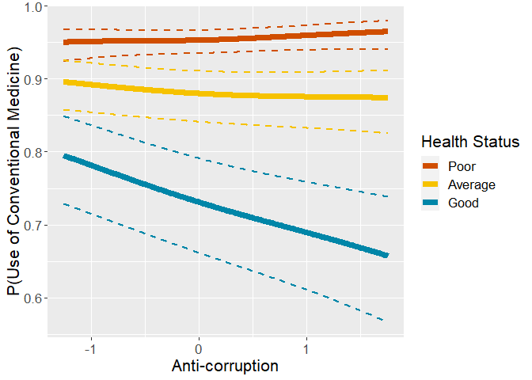
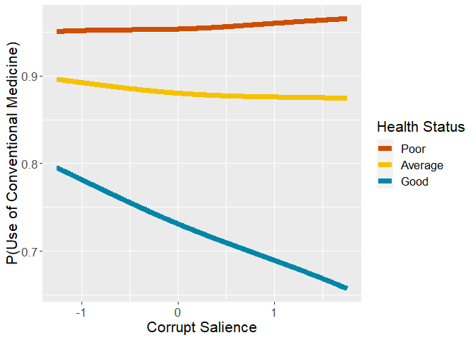
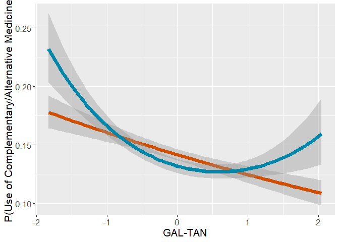
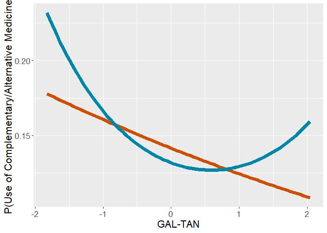

# Preparations

## Packages


```r
library(mclogit)
library(emmeans)
library(dplyr)
library(rio)
library(memisc)
library(psych)
library(ggplot2)
library(lme4)
library(MetBrewer)
source("../custom_functions.R")
```
## Dataset


```r
dat<-import("../../data/processed/fdat.xlsx")

str(dat)
```

```
## 'data.frame':	40185 obs. of  36 variables:
##  $ idno                      : num  1 2 3 4 5 6 7 13 14 21 ...
##  $ cntry                     : chr  "AT" "AT" "AT" "AT" ...
##  $ dweight                   : num  0.938 0.938 0.938 0.938 0.938 ...
##  $ pspwght                   : num  0.871 0.864 1.419 1.026 0.739 ...
##  $ pweight                   : num  0.406 0.406 0.406 0.406 0.406 ...
##  $ pt.nmbr                   : num  NA 6 2 3 NA 1 1 1 7 2 ...
##  $ pt.name                   : chr  NA NA "ÖVP" "FPÖ" ...
##  $ vote                      : num  1 1 1 1 1 1 1 1 1 1 ...
##  $ gndr.f                    : chr  "Male" "Male" "Female" "Male" ...
##  $ gndr.c                    : num  -0.5 -0.5 0.5 -0.5 0.5 0.5 -0.5 0.5 0.5 0.5 ...
##  $ agea                      : num  51 67 89 32 56 67 66 67 34 66 ...
##  $ age10.c                   : num  0.172 1.772 3.972 -1.728 0.672 ...
##  $ income                    : chr  "quint.2" "quint.2" "quint.1" "quint.2" ...
##  $ income.f                  : chr  "quint.2" "quint.2" "quint.1" "quint.2" ...
##  $ income.fr                 : chr  "quint.2" "quint.2" "quint.1" "quint.2" ...
##  $ edu                       : chr  "3. LUS" "1. <LS" "1. <LS" "3. LUS" ...
##  $ edu.f                     : chr  "3. LUS" "1. <LS" "1. <LS" "3. LUS" ...
##  $ strain.on.health          : num  1 7 2 4 2 2 5 6 6 3 ...
##  $ used.conv                 : num  0 1 1 1 1 1 1 1 1 1 ...
##  $ used.CAM                  : num  0 0 0 0 0 0 0 1 0 1 ...
##  $ DV                        : chr  "NN" "Used_conv_ONLY" "Used_conv_ONLY" "Used_conv_ONLY" ...
##  $ used.CAM.no.home          : num  0 0 0 0 0 0 0 1 0 1 ...
##  $ DV.no.home                : chr  "NN" "Used_conv_ONLY" "Used_conv_ONLY" "Used_conv_ONLY" ...
##  $ blgetmg                   : num  2 2 2 2 2 2 2 1 2 2 ...
##  $ blgetmg.f                 : chr  "No" "No" "No" "No" ...
##  $ blgetmg.c                 : num  -0.5 -0.5 -0.5 -0.5 -0.5 -0.5 -0.5 0.5 -0.5 -0.5 ...
##  $ lrgen                     : num  NA NA 6.1 8.7 NA ...
##  $ lrecon                    : num  NA NA 6.4 5.5 NA ...
##  $ galtan                    : num  NA NA 7.2 8.8 NA ...
##  $ antielite_salience        : num  NA NA 1.6 8 NA ...
##  $ corrupt_salience          : num  NA NA 2.4 5.1 NA ...
##  $ lrgen.scaling             : num  2.3 2.3 2.3 2.3 2.3 ...
##  $ lrecon.scaling            : num  2.21 2.21 2.21 2.21 2.21 ...
##  $ galtan.scaling            : num  2.63 2.63 2.63 2.63 2.63 ...
##  $ antielite_salience.scaling: num  2.59 2.59 2.59 2.59 2.59 ...
##  $ corrupt_salience.scaling  : num  2.32 2.32 2.32 2.32 2.32 ...
```

## Data transformations

The reference levels for factorial variables need to be redefined, .xlsx format does not understand factor formats.

### Income


```r
dat$income.f<-case_when(
  is.na(dat$income) ~ "missing",
  TRUE ~ dat$income
)

#define reference level (top quintile)
table(dat$income.f,useNA="always")
```

```
## 
## missing quint.1 quint.2 quint.3 quint.4 quint.5    <NA> 
##    8296    6427    6999    6793    6408    5262       0
```

```r
dat$income.fr = relevel(as.factor(dat$income.f), ref="quint.5")
table(dat$income.fr,useNA="always")
```

```
## 
## quint.5 missing quint.1 quint.2 quint.3 quint.4    <NA> 
##    5262    8296    6427    6999    6793    6408       0
```

### Education


```r
table(dat$edu,useNA="always")
```

```
## 
## 1. <LS  2. LS 3. LUS 4. UUS  5. AV  6. BA  7. MA   <NA> 
##   4085   6760   7213   7094   5671   4366   4730    266
```

```r
dat$edu.f<-relevel(as.factor(dat$edu),ref="7. MA")
table(dat$edu.f,useNA="always")
```

```
## 
##  7. MA 1. <LS  2. LS 3. LUS 4. UUS  5. AV  6. BA   <NA> 
##   4730   4085   6760   7213   7094   5671   4366    266
```

### DV


```r
table(dat$DV,useNA="always")
```

```
## 
##                NN     Used_CAM_ONLY Used_conv_and_CAM    Used_conv_ONLY 
##              6877               503              5100             27705 
##              <NA> 
##                 0
```

```r
dat$DV.f<-relevel(as.factor(dat$DV),ref="NN")
table(dat$DV.f,useNA="always")
```

```
## 
##                NN     Used_CAM_ONLY Used_conv_and_CAM    Used_conv_ONLY 
##              6877               503              5100             27705 
##              <NA> 
##                 0
```

```r
table(dat$DV.no.home,useNA="always")
```

```
## 
##                NN     Used_CAM_ONLY Used_conv_and_CAM    Used_conv_ONLY 
##              6957               423              4155             28650 
##              <NA> 
##                 0
```

```r
dat$DV.no.home.f<-relevel(as.factor(dat$DV.no.home),ref="NN")
table(dat$DV.no.home.f,useNA="always")
```

```
## 
##                NN     Used_CAM_ONLY Used_conv_and_CAM    Used_conv_ONLY 
##              6957               423              4155             28650 
##              <NA> 
##                 0
```

### Strain on health and political orientation

Calculate country means for centering


```r
# Calculate country means for centering

cntry.means<-dat %>%
  group_by(cntry) %>%
  summarise(strain.on.health.cntry.mean=
              mean(strain.on.health,na.rm=T),
            lrgen.cntry.mean=
              mean(lrgen,na.rm=T),
            lrecon.cntry.mean=
              mean(lrecon,na.rm=T),
            galtan.cntry.mean=
              mean(galtan,na.rm=T),
            antielite_salience.cntry.mean=
              mean(antielite_salience,na.rm=T),
            corrupt_salience.cntry.mean=
              mean(corrupt_salience,na.rm=T))

#combine data frames

dat<-left_join(
  x=dat,
  y=cntry.means,
  by="cntry"
)

#country-mean center strain on health

dat$strain.on.health.c<-
  dat$strain.on.health-dat$strain.on.health.cntry.mean

#country-mean center political orientation

dat$lrgen.c<-
  dat$lrgen-dat$lrgen.cntry.mean
dat$lrecon.c<-
  dat$lrecon-dat$lrecon.cntry.mean
dat$galtan.c<-
  dat$galtan-dat$galtan.cntry.mean
dat$antielite_salience.c<-
  dat$antielite_salience-dat$antielite_salience.cntry.mean
dat$corrupt_salience.c<-
  dat$corrupt_salience-dat$corrupt_salience.cntry.mean

#scale with CHES grand SD
dat$lrgen.z<-
  dat$lrgen.c/dat$lrgen.scaling
dat$lrecon.z<-
  dat$lrecon.c/dat$lrecon.scaling
dat$galtan.z<-
  dat$galtan.c/dat$galtan.scaling
dat$antielite_salience.z<-
  dat$antielite_salience.c/dat$antielite_salience.scaling
dat$corrupt_salience.z<-
  dat$corrupt_salience.c/dat$corrupt_salience.scaling
```

## Exclude missing variable


```r
fdat<-dat %>%
  filter(cntry!="IL" & cntry!="EE") %>%
  filter(!is.na(cntry) & 
         !is.na(gndr.c) &
         !is.na(age10.c) &
         !is.na(income.fr) &
           !is.na(edu.f) &
           !is.na(strain.on.health.c) &
           !is.na(DV) &
           !is.na(lrgen.z) &
           !is.na(lrecon.z) &
           !is.na(galtan.z) &
           !is.na(antielite_salience.z) &
           !is.na(corrupt_salience.z))
```

## Construct anweight variable for weighting


```r
fdat$anweight=fdat$pspwght*fdat$pweight
```

# Descriptive analysis

## Check the presence of all DV-groups across countries


```r
table(fdat$cntry,fdat$DV.f)
```

```
##     
##        NN Used_CAM_ONLY Used_conv_and_CAM Used_conv_ONLY
##   AT  115            18               206            718
##   BE  134             5               143            962
##   CH   89            25               131            397
##   CZ  145             4               160            755
##   DE  155            10               370           1507
##   DK  174             8               150            818
##   ES  106             7               111            807
##   FI  175            12               117           1016
##   FR   66             8               212            651
##   GB  201            10               138            951
##   HU  255             9                55            524
##   IE  255            13               103            903
##   LT  223            34               276            472
##   NL  238            17               111            968
##   NO  163             9               107            772
##   PL  122             6                49            593
##   PT   30             1                46            485
##   SE  312            17               135            947
##   SI   59             8                89            399
```

```r
round(100*prop.table(table(fdat$cntry,fdat$DV.f),
                     margin = 1),1)
```

```
##     
##        NN Used_CAM_ONLY Used_conv_and_CAM Used_conv_ONLY
##   AT 10.9           1.7              19.5           67.9
##   BE 10.8           0.4              11.5           77.3
##   CH 13.9           3.9              20.4           61.8
##   CZ 13.6           0.4              15.0           71.0
##   DE  7.6           0.5              18.1           73.8
##   DK 15.1           0.7              13.0           71.1
##   ES 10.3           0.7              10.8           78.3
##   FI 13.3           0.9               8.9           77.0
##   FR  7.0           0.9              22.6           69.5
##   GB 15.5           0.8              10.6           73.2
##   HU 30.2           1.1               6.5           62.2
##   IE 20.0           1.0               8.1           70.9
##   LT 22.2           3.4              27.5           47.0
##   NL 17.8           1.3               8.3           72.6
##   NO 15.5           0.9              10.2           73.5
##   PL 15.8           0.8               6.4           77.0
##   PT  5.3           0.2               8.2           86.3
##   SE 22.1           1.2               9.6           67.1
##   SI 10.6           1.4              16.0           71.9
```


# Analysis 

## Empty model


```r
mod0<-mblogit(DV.f~1,
              random= ~1|cntry,
              estimator="ML",
              data=fdat,weights=anweight)
```

```
## 
## Iteration 1 - deviance = 30927.53 - criterion = 0.7408656
## Iteration 2 - deviance = 29867.42 - criterion = 0.2229412
## Iteration 3 - deviance = 29750.33 - criterion = 0.02726584
## Iteration 4 - deviance = 29734.34 - criterion = 0.004885409
## Iteration 5 - deviance = 29732.04 - criterion = 0.0001791504
## Iteration 6 - deviance = 29731.82 - criterion = 2.609763e-06
## Iteration 7 - deviance = 29731.84 - criterion = 6.826304e-08
## Iteration 8 - deviance = 29731.85 - criterion = 2.929665e-09
## converged
```

```r
mod0
```

```
## mblogit(formula = DV.f ~ 1, data = fdat, random = ~1 | cntry, 
##     weights = anweight, estimator = "ML")
## 
## Coefficients:
##                       Predictors
## Response categories     (Intercept)
##   Used_CAM_ONLY/NN      -2.6875    
##   Used_conv_and_CAM/NN  -0.1656    
##   Used_conv_ONLY/NN      1.5966    
## 
## (Co-)Variances:
## Grouping level: cntry 
##                      Used_CAM_ONLY~1  Used_conv_and_CAM~1  Used_conv_ONLY~1
## Used_CAM_ONLY~1       0.36106                                              
## Used_conv_and_CAM~1   0.20056          0.51447                             
## Used_conv_ONLY~1     -0.03003          0.23201              0.23705        
## 
## Null Deviance:     52210 
## Residual Deviance: 29730
```

```r
summary(mod0)
```

```
## 
## Call:
## mblogit(formula = DV.f ~ 1, data = fdat, random = ~1 | cntry, 
##     weights = anweight, estimator = "ML")
## 
## Equation for Used_CAM_ONLY vs NN:
##             Estimate Std. Error z value Pr(>|z|)    
## (Intercept)  -2.6875     0.1716  -15.66   <2e-16 ***
## 
## Equation for Used_conv_and_CAM vs NN:
##             Estimate Std. Error z value Pr(>|z|)
## (Intercept)  -0.1656     0.1712  -0.967    0.333
## 
## Equation for Used_conv_ONLY vs NN:
##             Estimate Std. Error z value Pr(>|z|)    
## (Intercept)   1.5966     0.1169   13.66   <2e-16 ***
## ---
## Signif. codes:  0 '***' 0.001 '**' 0.01 '*' 0.05 '.' 0.1 ' ' 1
## 
## (Co-)Variances:
## Grouping level: cntry 
##                     Estimate                     Std.Err.               
## Used_CAM_ONLY~1      0.36106                     0.03253                
## Used_conv_and_CAM~1  0.20056  0.51447            0.04895 0.08778        
## Used_conv_ONLY~1    -0.03003  0.23201  0.23705   0.02127 0.04186 0.02168
## 
## Null Deviance:     52210 
## Residual Deviance: 29730 
## Number of Fisher Scoring iterations:  8
## Number of observations
##   Groups by cntry: 19
##   Individual observations:  18832.14
```

```r
mtable(mod0,show.baselevel = T)
```

```
## 
## Calls:
## mod0: mblogit(formula = DV.f ~ 1, data = fdat, random = ~1 | cntry, 
##     weights = anweight, estimator = "ML")
## 
## ================================================================================================
##                                        Used_CAM_ONLY/NN Used_conv_and_CAM/NN Used_conv_ONLY/NN  
## ------------------------------------------------------------------------------------------------
##   (Intercept)                               -2.688***         -0.166              1.597***      
##                                             (0.172)           (0.171)            (0.117)        
## ------------------------------------------------------------------------------------------------
##   Used_CAM_ONLY/NN x  VCov(~1,~1)            0.361             0.201             -0.030         
##                                             (0.033)           (0.049)            (0.021)        
##   Used_conv_and_CAM/NN x  VCov(~1,~1)        0.201             0.514              0.232         
##                                             (0.049)           (0.088)            (0.042)        
##   Used_conv_ONLY/NN x  VCov(~1,~1)          -0.030             0.232              0.237         
##                                             (0.021)           (0.042)            (0.022)        
## ------------------------------------------------------------------------------------------------
##   Groups by cntry                           19                                                  
## ------------------------------------------------------------------------------------------------
##   Deviance                               29731.8                                                
##   N                                      18832                                                  
## ================================================================================================
##   Significance: *** = p < 0.001; ** = p < 0.01; * = p < 0.05
```

## Model with covariates


```r
mod1<-
  mblogit(DV.f~gndr.c+age10.c+income.fr+edu.f+blgetmg.c+
            strain.on.health.c,
              random= ~1|cntry,
              estimator="ML",
              data=fdat,weights=anweight)
```

```
## 
## Iteration 1 - deviance = 28779.65 - criterion = 0.7767245
## Iteration 2 - deviance = 27497.69 - criterion = 0.1512997
## Iteration 3 - deviance = 27335.78 - criterion = 0.02464354
## Iteration 4 - deviance = 27300.91 - criterion = 0.01372932
## Iteration 5 - deviance = 27294.57 - criterion = 0.004125504
## Iteration 6 - deviance = 27293.41 - criterion = 0.0007460794
## Iteration 7 - deviance = 27293.16 - criterion = 3.308723e-05
## Iteration 8 - deviance = 27293.3 - criterion = 6.43478e-05
## Iteration 9 - deviance = 27292.97 - criterion = 6.115757e-05
## Iteration 10 - deviance = 27293 - criterion = 4.208487e-07
## Iteration 11 - deviance = 27293.02 - criterion = 9.54525e-09
## converged
```

```r
summary(mod1)
```

```
## 
## Call:
## mblogit(formula = DV.f ~ gndr.c + age10.c + income.fr + edu.f + 
##     blgetmg.c + strain.on.health.c, data = fdat, random = ~1 | 
##     cntry, weights = anweight, estimator = "ML")
## 
## Equation for Used_CAM_ONLY vs NN:
##                    Estimate Std. Error z value Pr(>|z|)    
## (Intercept)        -1.52042    0.34874  -4.360 1.30e-05 ***
## gndr.c              0.35185    0.16909   2.081 0.037444 *  
## age10.c            -0.03449    0.05724  -0.603 0.546796    
## income.frmissing   -1.09536    0.38661  -2.833 0.004608 ** 
## income.frquint.1   -0.50321    0.38531  -1.306 0.191564    
## income.frquint.2   -0.06894    0.27227  -0.253 0.800113    
## income.frquint.3   -0.07163    0.24761  -0.289 0.772358    
## income.frquint.4   -0.23434    0.23622  -0.992 0.321179    
## edu.f1. <LS        -2.80269    0.86419  -3.243 0.001182 ** 
## edu.f2. LS         -1.19847    0.30871  -3.882 0.000104 ***
## edu.f3. LUS        -1.22212    0.27480  -4.447 8.69e-06 ***
## edu.f4. UUS        -1.38188    0.32285  -4.280 1.87e-05 ***
## edu.f5. AV         -0.62334    0.25501  -2.444 0.014510 *  
## edu.f6. BA         -0.77222    0.27680  -2.790 0.005274 ** 
## blgetmg.c          -0.40978    0.48703  -0.841 0.400123    
## strain.on.health.c  0.26688    0.04713   5.663 1.49e-08 ***
## 
## Equation for Used_conv_and_CAM vs NN:
##                    Estimate Std. Error z value Pr(>|z|)    
## (Intercept)         0.63384    0.21596   2.935 0.003335 ** 
## gndr.c              1.17843    0.06321  18.643  < 2e-16 ***
## age10.c             0.09453    0.01987   4.758 1.96e-06 ***
## income.frmissing   -0.23993    0.11678  -2.055 0.039915 *  
## income.frquint.1   -0.09994    0.12167  -0.821 0.411442    
## income.frquint.2   -0.08920    0.10551  -0.845 0.397889    
## income.frquint.3   -0.06947    0.09983  -0.696 0.486485    
## income.frquint.4    0.02089    0.09328   0.224 0.822825    
## edu.f1. <LS        -1.12842    0.15490  -7.285 3.22e-13 ***
## edu.f2. LS         -0.63270    0.11550  -5.478 4.30e-08 ***
## edu.f3. LUS        -0.48869    0.10460  -4.672 2.98e-06 ***
## edu.f4. UUS        -0.45186    0.11663  -3.874 0.000107 ***
## edu.f5. AV         -0.29881    0.11075  -2.698 0.006977 ** 
## edu.f6. BA         -0.25349    0.11921  -2.126 0.033469 *  
## blgetmg.c           0.18724    0.16067   1.165 0.243883    
## strain.on.health.c  0.54410    0.01749  31.114  < 2e-16 ***
## 
## Equation for Used_conv_ONLY vs NN:
##                    Estimate Std. Error z value Pr(>|z|)    
## (Intercept)         2.07554    0.15651  13.262   <2e-16 ***
## gndr.c              0.50882    0.04854  10.482   <2e-16 ***
## age10.c             0.19765    0.01539  12.844   <2e-16 ***
## income.frmissing   -0.15101    0.08419  -1.794   0.0729 .  
## income.frquint.1    0.05162    0.09511   0.543   0.5873    
## income.frquint.2   -0.01120    0.08253  -0.136   0.8921    
## income.frquint.3   -0.01487    0.07710  -0.193   0.8470    
## income.frquint.4   -0.02147    0.07290  -0.295   0.7684    
## edu.f1. <LS        -0.06810    0.11436  -0.595   0.5515    
## edu.f2. LS         -0.10712    0.08849  -1.211   0.2260    
## edu.f3. LUS        -0.13715    0.08349  -1.643   0.1004    
## edu.f4. UUS        -0.06380    0.08888  -0.718   0.4729    
## edu.f5. AV         -0.12403    0.08945  -1.386   0.1656    
## edu.f6. BA         -0.04847    0.09232  -0.525   0.5995    
## blgetmg.c           0.11106    0.12152   0.914   0.3608    
## strain.on.health.c  0.41268    0.01592  25.922   <2e-16 ***
## ---
## Signif. codes:  0 '***' 0.001 '**' 0.01 '*' 0.05 '.' 0.1 ' ' 1
## 
## (Co-)Variances:
## Grouping level: cntry 
##                     Estimate                     Std.Err.               
## Used_CAM_ONLY~1      0.50803                     0.05133                
## Used_conv_and_CAM~1  0.06194  0.59128            0.05428 0.11343        
## Used_conv_ONLY~1    -0.09987  0.29177  0.28381   0.03434 0.06805 0.04347
## 
## Null Deviance:     52210 
## Residual Deviance: 27290 
## Number of Fisher Scoring iterations:  11
## Number of observations
##   Groups by cntry: 19
##   Individual observations:  18832.14
```

```r
mod1
```

```
## mblogit(formula = DV.f ~ gndr.c + age10.c + income.fr + edu.f + 
##     blgetmg.c + strain.on.health.c, data = fdat, random = ~1 | 
##     cntry, weights = anweight, estimator = "ML")
## 
## Coefficients:
##                       Predictors
## Response categories     (Intercept)  gndr.c    age10.c   income.frmissing
##   Used_CAM_ONLY/NN      -1.52042      0.35185  -0.03449  -1.09536        
##   Used_conv_and_CAM/NN   0.63384      1.17843   0.09453  -0.23993        
##   Used_conv_ONLY/NN      2.07554      0.50882   0.19765  -0.15101        
##                       Predictors
## Response categories     income.frquint.1  income.frquint.2  income.frquint.3
##   Used_CAM_ONLY/NN      -0.50321          -0.06894          -0.07163        
##   Used_conv_and_CAM/NN  -0.09994          -0.08920          -0.06947        
##   Used_conv_ONLY/NN      0.05162          -0.01120          -0.01487        
##                       Predictors
## Response categories     income.frquint.4  edu.f1. <LS  edu.f2. LS
##   Used_CAM_ONLY/NN      -0.23434          -2.80269     -1.19847  
##   Used_conv_and_CAM/NN   0.02089          -1.12842     -0.63270  
##   Used_conv_ONLY/NN     -0.02147          -0.06810     -0.10712  
##                       Predictors
## Response categories     edu.f3. LUS  edu.f4. UUS  edu.f5. AV  edu.f6. BA
##   Used_CAM_ONLY/NN      -1.22212     -1.38188     -0.62334    -0.77222  
##   Used_conv_and_CAM/NN  -0.48869     -0.45186     -0.29881    -0.25349  
##   Used_conv_ONLY/NN     -0.13715     -0.06380     -0.12403    -0.04847  
##                       Predictors
## Response categories     blgetmg.c  strain.on.health.c
##   Used_CAM_ONLY/NN      -0.40978    0.26688          
##   Used_conv_and_CAM/NN   0.18724    0.54410          
##   Used_conv_ONLY/NN      0.11106    0.41268          
## 
## (Co-)Variances:
## Grouping level: cntry 
##                      Used_CAM_ONLY~1  Used_conv_and_CAM~1  Used_conv_ONLY~1
## Used_CAM_ONLY~1       0.50803                                              
## Used_conv_and_CAM~1   0.06194          0.59128                             
## Used_conv_ONLY~1     -0.09987          0.29177              0.28381        
## 
## Null Deviance:     52210 
## Residual Deviance: 27290
```

```r
mtable(mod1,show.baselevel = T)
```

```
## 
## Calls:
## mod1: mblogit(formula = DV.f ~ gndr.c + age10.c + income.fr + edu.f + 
##     blgetmg.c + strain.on.health.c, data = fdat, random = ~1 | 
##     cntry, weights = anweight, estimator = "ML")
## 
## ================================================================================================
##                                        Used_CAM_ONLY/NN Used_conv_and_CAM/NN Used_conv_ONLY/NN  
## ------------------------------------------------------------------------------------------------
##   (Intercept)                               -1.520***         0.634**             2.076***      
##                                             (0.349)          (0.216)             (0.157)        
##   gndr.c                                     0.352*           1.178***            0.509***      
##                                             (0.169)          (0.063)             (0.049)        
##   age10.c                                   -0.034            0.095***            0.198***      
##                                             (0.057)          (0.020)             (0.015)        
##   income.fr: missing/quint.5                -1.095**         -0.240*             -0.151         
##                                             (0.387)          (0.117)             (0.084)        
##   income.fr: quint.1/quint.5                -0.503           -0.100               0.052         
##                                             (0.385)          (0.122)             (0.095)        
##   income.fr: quint.2/quint.5                -0.069           -0.089              -0.011         
##                                             (0.272)          (0.106)             (0.083)        
##   income.fr: quint.3/quint.5                -0.072           -0.069              -0.015         
##                                             (0.248)          (0.100)             (0.077)        
##   income.fr: quint.4/quint.5                -0.234            0.021              -0.021         
##                                             (0.236)          (0.093)             (0.073)        
##   edu.f: 1. <LS/7. MA                       -2.803**         -1.128***           -0.068         
##                                             (0.864)          (0.155)             (0.114)        
##   edu.f: 2. LS/7. MA                        -1.198***        -0.633***           -0.107         
##                                             (0.309)          (0.115)             (0.088)        
##   edu.f: 3. LUS/7. MA                       -1.222***        -0.489***           -0.137         
##                                             (0.275)          (0.105)             (0.083)        
##   edu.f: 4. UUS/7. MA                       -1.382***        -0.452***           -0.064         
##                                             (0.323)          (0.117)             (0.089)        
##   edu.f: 5. AV/7. MA                        -0.623*          -0.299**            -0.124         
##                                             (0.255)          (0.111)             (0.089)        
##   edu.f: 6. BA/7. MA                        -0.772**         -0.253*             -0.048         
##                                             (0.277)          (0.119)             (0.092)        
##   blgetmg.c                                 -0.410            0.187               0.111         
##                                             (0.487)          (0.161)             (0.122)        
##   strain.on.health.c                         0.267***         0.544***            0.413***      
##                                             (0.047)          (0.017)             (0.016)        
## ------------------------------------------------------------------------------------------------
##   Used_CAM_ONLY/NN x  VCov(~1,~1)            0.508            0.062              -0.100         
##                                             (0.051)          (0.054)             (0.034)        
##   Used_conv_and_CAM/NN x  VCov(~1,~1)        0.062            0.591               0.292         
##                                             (0.054)          (0.113)             (0.068)        
##   Used_conv_ONLY/NN x  VCov(~1,~1)          -0.100            0.292               0.284         
##                                             (0.034)          (0.068)             (0.043)        
## ------------------------------------------------------------------------------------------------
##   Groups by cntry                           19                                                  
## ------------------------------------------------------------------------------------------------
##   Deviance                               27293.0                                                
##   N                                      18832                                                  
## ================================================================================================
##   Significance: *** = p < 0.001; ** = p < 0.01; * = p < 0.05
```

### Strain on health main effects


```r
mod1.strain.trends<-
  emtrends(mod1,~1|DV.f,
           var="strain.on.health.c",
           infer=T,mode="latent",
           at=list(gndr.c=0,age10.c=0))

#effects for each DV-category
(mod1.strain.eff<-
  contrast(mod1.strain.trends,simple="DV.f",
         adjust="none","eff",infer=c(T,T)))
```

```
##  contrast                 estimate     SE  df asymp.LCL asymp.UCL z.ratio
##  NN effect                  -0.306 0.0162 Inf   -0.3376   -0.2742 -18.911
##  Used_CAM_ONLY effect       -0.039 0.0338 Inf   -0.1053    0.0272  -1.155
##  Used_conv_and_CAM effect    0.238 0.0133 Inf    0.2121    0.2642  17.929
##  Used_conv_ONLY effect       0.107 0.0123 Inf    0.0826    0.1310   8.650
##  p.value
##   <.0001
##   0.2482
##   <.0001
##   <.0001
## 
## Results are averaged over the levels of: income.fr, edu.f, blgetmg.c 
## Confidence level used: 0.95
```

```r
#save to file
export(data.frame(mod1.strain.eff),
       "../../results/Minority_covariate/mod1.strain.eff.MN.xlsx",
       overwrite=T)

#Use of conventional medicine

(mod1.strain.eff.CM<-
  contrast(mod1.strain.trends,
           method = list("Conv - No conv" = contrast.weights.total(effects=mod1.strain.eff,
          signs=c(-2,-2,2,2))),
           simple="DV.f",
           infer=c(T,T)))
```

```
##  contrast       estimate     SE  df asymp.LCL asymp.UCL z.ratio p.value
##  Conv - No conv    0.384 0.0186 Inf     0.348     0.421  20.655  <.0001
## 
## Results are averaged over the levels of: income.fr, edu.f, blgetmg.c 
## Confidence level used: 0.95
```

```r
(mod1.strain.eff.CAM<-
    contrast(mod1.strain.trends,
         method = list("CAM - No CAM" = contrast.weights.total(effects=mod1.strain.eff,
                 signs=c(-2,2,2,-2))),
         simple="DV.f",
           infer=c(T,T)))
```

```
##  contrast     estimate     SE  df asymp.LCL asymp.UCL z.ratio p.value
##  CAM - No CAM    0.211 0.0127 Inf     0.186     0.236  16.537  <.0001
## 
## Results are averaged over the levels of: income.fr, edu.f, blgetmg.c 
## Confidence level used: 0.95
```

```r
# save to file
export(data.frame(rbind(mod1.strain.eff.CM,
      mod1.strain.eff.CAM,adjust="none")),
      "../../results/Minority_covariate/mod1.strain.eff.COMB.xlsx")
```

### gender main effects


```r
mod1.gndr.trends<-
  emtrends(mod1,~1|DV.f,
           var="gndr.c",
           infer=T,mode="latent",
           at=list(strain.on.health.c=0,age10.c=0))

#effects for each DV-category
(mod1.gndr.eff<-
  contrast(mod1.gndr.trends,simple="DV.f",
         adjust="none","eff",infer=c(T,T)))
```

```
##  contrast                  estimate     SE  df asymp.LCL asymp.UCL z.ratio
##  NN effect                -0.509775 0.0542 Inf   -0.6160   -0.4036  -9.408
##  Used_CAM_ONLY effect     -0.157922 0.1236 Inf   -0.4001    0.0843  -1.278
##  Used_conv_and_CAM effect  0.668651 0.0537 Inf    0.5634    0.7739  12.447
##  Used_conv_ONLY effect    -0.000954 0.0459 Inf   -0.0909    0.0890  -0.021
##  p.value
##   <.0001
##   0.2013
##   <.0001
##   0.9834
## 
## Results are averaged over the levels of: gndr.c, income.fr, edu.f, blgetmg.c 
## Confidence level used: 0.95
```

```r
#save to file
export(data.frame(mod1.gndr.eff),
       "../../results/Minority_covariate/mod1.gndr.eff.MN.xlsx",
       overwrite=T)

#Use of conventional medicine

(mod1.gndr.eff.CM<-
  contrast(mod1.gndr.trends,
           method = list("Conv - No conv" = contrast.weights.total(effects=mod1.gndr.eff,
          signs=c(-2,-2,2,2))),
           simple="DV.f",
           infer=c(T,T)))
```

```
##  contrast       estimate     SE  df asymp.LCL asymp.UCL z.ratio p.value
##  Conv - No conv    0.676 0.0599 Inf     0.559     0.794  11.288  <.0001
## 
## Results are averaged over the levels of: gndr.c, income.fr, edu.f, blgetmg.c 
## Confidence level used: 0.95
```

```r
(mod1.gndr.eff.CAM<-
    contrast(mod1.gndr.trends,
         method = list("CAM - No CAM" = contrast.weights.total(effects=mod1.gndr.eff,
                 signs=c(-2,2,2,-2))),
         simple="DV.f",
           infer=c(T,T)))
```

```
##  contrast     estimate     SE  df asymp.LCL asymp.UCL z.ratio p.value
##  CAM - No CAM    0.644 0.0582 Inf      0.53     0.758  11.067  <.0001
## 
## Results are averaged over the levels of: gndr.c, income.fr, edu.f, blgetmg.c 
## Confidence level used: 0.95
```

```r
# save to file
export(data.frame(rbind(mod1.gndr.eff.CM,
      mod1.gndr.eff.CAM,adjust="none")),
      "../../results/Minority_covariate/mod1.gndr.eff.COMB.xlsx")
```


### age main effects


```r
mod1.age10.trends<-
  emtrends(mod1,~1|DV.f,
           var="age10.c",
           infer=T,mode="latent",
           at=list(strain.on.health.c=0,gndr.c=0))

#effects for each DV-category
(mod1.age10.eff<-
  contrast(mod1.age10.trends,simple="DV.f",
         adjust="none","eff",infer=c(T,T)))
```

```
##  contrast                 estimate     SE  df asymp.LCL asymp.UCL z.ratio
##  NN effect                 -0.0644 0.0179 Inf  -0.09947   -0.0294  -3.602
##  Used_CAM_ONLY effect      -0.0989 0.0420 Inf  -0.18120   -0.0166  -2.356
##  Used_conv_and_CAM effect   0.0301 0.0176 Inf  -0.00446    0.0647   1.707
##  Used_conv_ONLY effect      0.1332 0.0154 Inf   0.10311    0.1633   8.671
##  p.value
##   0.0003
##   0.0185
##   0.0878
##   <.0001
## 
## Results are averaged over the levels of: income.fr, edu.f, blgetmg.c 
## Confidence level used: 0.95
```

```r
#save to file
export(data.frame(mod1.age10.eff),
       "../../results/Minority_covariate/mod1.age10.eff.MN.xlsx",
       overwrite=T)

#Use of conventional medicine

(mod1.age10.eff.CM<-
  contrast(mod1.age10.trends,
           method = list("Conv - No conv" = contrast.weights.total(effects=mod1.age10.eff,
          signs=c(-2,-2,2,2))),
           simple="DV.f",
           infer=c(T,T)))
```

```
##  contrast       estimate     SE  df asymp.LCL asymp.UCL z.ratio p.value
##  Conv - No conv    0.165 0.0196 Inf     0.126     0.203   8.397  <.0001
## 
## Results are averaged over the levels of: income.fr, edu.f, blgetmg.c 
## Confidence level used: 0.95
```

```r
(mod1.age10.eff.CAM<-
    contrast(mod1.age10.trends,
         method = list("CAM - No CAM" = contrast.weights.total(effects=mod1.age10.eff,
                 signs=c(-2,2,2,-2))),
         simple="DV.f",
           infer=c(T,T)))
```

```
##  contrast     estimate     SE  df asymp.LCL asymp.UCL z.ratio p.value
##  CAM - No CAM  -0.0578 0.0188 Inf   -0.0947   -0.0209  -3.070  0.0021
## 
## Results are averaged over the levels of: income.fr, edu.f, blgetmg.c 
## Confidence level used: 0.95
```

```r
# save to file
export(data.frame(rbind(mod1.age10.eff.CM,
      mod1.age10.eff.CAM,adjust="none")),
      "../../results/Minority_covariate/mod1.age10.eff.COMB.xlsx")
```


### education main effects


```r
# first take probabilities for all categories
mod1.edu.f.trends<-emmeans(mod1,by="DV.f",
        specs="edu.f",
        infer=T,mode="prob",
        at=list(strain.on.health.c=0,gndr.c=0,age10.c=0))

mod1.edu.f.trends
```

```
## DV.f = NN:
##  edu.f     prob      SE  df asymp.LCL asymp.UCL z.ratio p.value
##  7. MA  0.09380 0.01286 Inf  0.068595   0.11900   7.295  <.0001
##  1. <LS 0.11341 0.01652 Inf  0.081034   0.14579   6.865  <.0001
##  2. LS  0.11183 0.01495 Inf  0.082543   0.14113   7.483  <.0001
##  3. LUS 0.11265 0.01485 Inf  0.083531   0.14176   7.583  <.0001
##  4. UUS 0.10611 0.01442 Inf  0.077839   0.13438   7.356  <.0001
##  5. AV  0.10834 0.01468 Inf  0.079571   0.13710   7.381  <.0001
##  6. BA  0.10189 0.01414 Inf  0.074168   0.12961   7.204  <.0001
## 
## DV.f = Used_CAM_ONLY:
##  edu.f     prob      SE  df asymp.LCL asymp.UCL z.ratio p.value
##  7. MA  0.01598 0.00507 Inf  0.006047   0.02591   3.154  0.0016
##  1. <LS 0.00117 0.00104 Inf -0.000860   0.00321   1.132  0.2578
##  2. LS  0.00576 0.00218 Inf  0.001479   0.01003   2.638  0.0083
##  3. LUS 0.00566 0.00202 Inf  0.001709   0.00962   2.807  0.0050
##  4. UUS 0.00455 0.00181 Inf  0.000998   0.00810   2.511  0.0120
##  5. AV  0.00990 0.00339 Inf  0.003258   0.01655   2.921  0.0035
##  6. BA  0.00803 0.00292 Inf  0.002304   0.01375   2.749  0.0060
## 
## DV.f = Used_conv_and_CAM:
##  edu.f     prob      SE  df asymp.LCL asymp.UCL z.ratio p.value
##  7. MA  0.16309 0.02051 Inf  0.122891   0.20328   7.952  <.0001
##  1. <LS 0.06386 0.01027 Inf  0.043735   0.08398   6.220  <.0001
##  2. LS  0.10334 0.01429 Inf  0.075336   0.13135   7.232  <.0001
##  3. LUS 0.12020 0.01594 Inf  0.088961   0.15144   7.541  <.0001
##  4. UUS 0.11747 0.01619 Inf  0.085738   0.14920   7.255  <.0001
##  5. AV  0.13975 0.01828 Inf  0.103924   0.17559   7.645  <.0001
##  6. BA  0.13752 0.01860 Inf  0.101061   0.17398   7.392  <.0001
## 
## DV.f = Used_conv_ONLY:
##  edu.f     prob      SE  df asymp.LCL asymp.UCL z.ratio p.value
##  7. MA  0.72714 0.02261 Inf  0.682816   0.77146  32.153  <.0001
##  1. <LS 0.82156 0.01809 Inf  0.786109   0.85701  45.423  <.0001
##  2. LS  0.77907 0.01895 Inf  0.741929   0.81621  41.114  <.0001
##  3. LUS 0.76149 0.01961 Inf  0.723053   0.79993  38.830  <.0001
##  4. UUS 0.77187 0.01961 Inf  0.733433   0.81031  39.357  <.0001
##  5. AV  0.74200 0.02133 Inf  0.700195   0.78381  34.785  <.0001
##  6. BA  0.75256 0.02130 Inf  0.710807   0.79432  35.325  <.0001
## 
## Results are averaged over the levels of: income.fr, blgetmg.c 
## Confidence level used: 0.95
```

```r
export(data.frame(mod1.edu.f.trends),
       "../../results/Minority_covariate/mod1.edu.f.eff.MN.xlsx",
       overwrite=T)


#effects for each DV-category
(mod1.edu.f.eff<-
    contrast(mod1.edu.f.trends,#simple="edu.f",
             adjust="none","eff",infer=c(T,T)))
```

```
## DV.f = NN:
##  contrast       estimate      SE  df asymp.LCL asymp.UCL z.ratio p.value
##  7. MA effect  -0.013065 0.00536 Inf -0.023574 -2.56e-03  -2.437  0.0148
##  1. <LS effect  0.006552 0.00835 Inf -0.009814  2.29e-02   0.785  0.4327
##  2. LS effect   0.004974 0.00563 Inf -0.006062  1.60e-02   0.883  0.3771
##  3. LUS effect  0.005785 0.00522 Inf -0.004437  1.60e-02   1.109  0.2673
##  4. UUS effect -0.000750 0.00560 Inf -0.011730  1.02e-02  -0.134  0.8935
##  5. AV effect   0.001477 0.00571 Inf -0.009705  1.27e-02   0.259  0.7957
##  6. BA effect  -0.004972 0.00590 Inf -0.016534  6.59e-03  -0.843  0.3993
## 
## DV.f = Used_CAM_ONLY:
##  contrast       estimate      SE  df asymp.LCL asymp.UCL z.ratio p.value
##  7. MA effect   0.008685 0.00319 Inf  0.002424  1.49e-02   2.719  0.0066
##  1. <LS effect -0.006118 0.00203 Inf -0.010100 -2.14e-03  -3.012  0.0026
##  2. LS effect  -0.001537 0.00147 Inf -0.004415  1.34e-03  -1.046  0.2954
##  3. LUS effect -0.001630 0.00130 Inf -0.004175  9.14e-04  -1.256  0.2092
##  4. UUS effect -0.002746 0.00144 Inf -0.005574  8.23e-05  -1.903  0.0571
##  5. AV effect   0.002611 0.00187 Inf -0.001061  6.28e-03   1.394  0.1634
##  6. BA effect   0.000735 0.00166 Inf -0.002518  3.99e-03   0.443  0.6577
## 
## DV.f = Used_conv_and_CAM:
##  contrast       estimate      SE  df asymp.LCL asymp.UCL z.ratio p.value
##  7. MA effect   0.042340 0.00803 Inf  0.026601  5.81e-02   5.273  <.0001
##  1. <LS effect -0.056892 0.00851 Inf -0.073581 -4.02e-02  -6.681  <.0001
##  2. LS effect  -0.017405 0.00574 Inf -0.028656 -6.15e-03  -3.032  0.0024
##  3. LUS effect -0.000546 0.00500 Inf -0.010355  9.26e-03  -0.109  0.9131
##  4. UUS effect -0.003277 0.00648 Inf -0.015974  9.42e-03  -0.506  0.6130
##  5. AV effect   0.019007 0.00651 Inf  0.006246  3.18e-02   2.919  0.0035
##  6. BA effect   0.016774 0.00774 Inf  0.001609  3.19e-02   2.168  0.0302
## 
## DV.f = Used_conv_ONLY:
##  contrast       estimate      SE  df asymp.LCL asymp.UCL z.ratio p.value
##  7. MA effect  -0.037959 0.00921 Inf -0.056013 -1.99e-02  -4.121  <.0001
##  1. <LS effect  0.056459 0.01114 Inf  0.034622  7.83e-02   5.067  <.0001
##  2. LS effect   0.013969 0.00750 Inf -0.000735  2.87e-02   1.862  0.0626
##  3. LUS effect -0.003609 0.00673 Inf -0.016792  9.57e-03  -0.537  0.5916
##  4. UUS effect  0.006773 0.00807 Inf -0.009054  2.26e-02   0.839  0.4016
##  5. AV effect  -0.023096 0.00807 Inf -0.038914 -7.28e-03  -2.862  0.0042
##  6. BA effect  -0.012537 0.00916 Inf -0.030484  5.41e-03  -1.369  0.1709
## 
## Results are averaged over the levels of: income.fr, blgetmg.c 
## Confidence level used: 0.95
```

```r
#save to file
export(data.frame(mod1.edu.f.eff),
       "../../results/Minority_covariate/mod1.edu.f.eff.MN.xlsx",
       overwrite=T)

# No Conv versus Conv

(mod1.edu.f.eff_DV<-
    contrast(mod1.edu.f.trends,simple="DV.f",
             adjust="none","eff",infer=c(T,T)))
```

```
## edu.f = 7. MA:
##  contrast                 estimate      SE  df asymp.LCL asymp.UCL  z.ratio
##  NN effect                 -0.1562 0.01286 Inf    -0.181   -0.1310  -12.149
##  Used_CAM_ONLY effect      -0.2340 0.00507 Inf    -0.244   -0.2241  -46.190
##  Used_conv_and_CAM effect  -0.0869 0.02051 Inf    -0.127   -0.0467   -4.238
##  Used_conv_ONLY effect      0.4771 0.02261 Inf     0.433    0.5215   21.099
##  p.value
##   <.0001
##   <.0001
##   <.0001
##   <.0001
## 
## edu.f = 1. <LS:
##  contrast                 estimate      SE  df asymp.LCL asymp.UCL  z.ratio
##  NN effect                 -0.1366 0.01652 Inf    -0.169   -0.1042   -8.268
##  Used_CAM_ONLY effect      -0.2488 0.00104 Inf    -0.251   -0.2468 -239.738
##  Used_conv_and_CAM effect  -0.1861 0.01027 Inf    -0.206   -0.1660  -18.133
##  Used_conv_ONLY effect      0.5716 0.01809 Inf     0.536    0.6070   31.601
##  p.value
##   <.0001
##   <.0001
##   <.0001
##   <.0001
## 
## edu.f = 2. LS:
##  contrast                 estimate      SE  df asymp.LCL asymp.UCL  z.ratio
##  NN effect                 -0.1382 0.01495 Inf    -0.167   -0.1089   -9.245
##  Used_CAM_ONLY effect      -0.2442 0.00218 Inf    -0.249   -0.2400 -111.924
##  Used_conv_and_CAM effect  -0.1467 0.01429 Inf    -0.175   -0.1187  -10.264
##  Used_conv_ONLY effect      0.5291 0.01895 Inf     0.492    0.5662   27.921
##  p.value
##   <.0001
##   <.0001
##   <.0001
##   <.0001
## 
## edu.f = 3. LUS:
##  contrast                 estimate      SE  df asymp.LCL asymp.UCL  z.ratio
##  NN effect                 -0.1374 0.01485 Inf    -0.166   -0.1082   -9.247
##  Used_CAM_ONLY effect      -0.2443 0.00202 Inf    -0.248   -0.2404 -121.120
##  Used_conv_and_CAM effect  -0.1298 0.01594 Inf    -0.161   -0.0986   -8.143
##  Used_conv_ONLY effect      0.5115 0.01961 Inf     0.473    0.5499   26.082
##  p.value
##   <.0001
##   <.0001
##   <.0001
##   <.0001
## 
## edu.f = 4. UUS:
##  contrast                 estimate      SE  df asymp.LCL asymp.UCL  z.ratio
##  NN effect                 -0.1439 0.01442 Inf    -0.172   -0.1156   -9.975
##  Used_CAM_ONLY effect      -0.2455 0.00181 Inf    -0.249   -0.2419 -135.536
##  Used_conv_and_CAM effect  -0.1325 0.01619 Inf    -0.164   -0.1008   -8.186
##  Used_conv_ONLY effect      0.5219 0.01961 Inf     0.483    0.5603   26.610
##  p.value
##   <.0001
##   <.0001
##   <.0001
##   <.0001
## 
## edu.f = 5. AV:
##  contrast                 estimate      SE  df asymp.LCL asymp.UCL  z.ratio
##  NN effect                 -0.1417 0.01468 Inf    -0.170   -0.1129   -9.652
##  Used_CAM_ONLY effect      -0.2401 0.00339 Inf    -0.247   -0.2334  -70.801
##  Used_conv_and_CAM effect  -0.1102 0.01828 Inf    -0.146   -0.0744   -6.030
##  Used_conv_ONLY effect      0.4920 0.02133 Inf     0.450    0.5338   23.065
##  p.value
##   <.0001
##   <.0001
##   <.0001
##   <.0001
## 
## edu.f = 6. BA:
##  contrast                 estimate      SE  df asymp.LCL asymp.UCL  z.ratio
##  NN effect                 -0.1481 0.01414 Inf    -0.176   -0.1204  -10.472
##  Used_CAM_ONLY effect      -0.2420 0.00292 Inf    -0.248   -0.2362  -82.847
##  Used_conv_and_CAM effect  -0.1125 0.01860 Inf    -0.149   -0.0760   -6.046
##  Used_conv_ONLY effect      0.5026 0.02130 Inf     0.461    0.5443   23.590
##  p.value
##   <.0001
##   <.0001
##   <.0001
##   <.0001
## 
## Results are averaged over the levels of: income.fr, blgetmg.c 
## Confidence level used: 0.95
```

```r
(mod1.edu.f.eff.CM<-
    contrast(mod1.edu.f.trends,
             method = 
               list("Conv - No conv" = c(0,0,1,1)),
             simple="DV.f",
             infer=c(T,T)))
```

```
## edu.f = 7. MA:
##  contrast       estimate     SE  df asymp.LCL asymp.UCL z.ratio p.value
##  Conv - No conv    0.890 0.0154 Inf     0.860     0.920  57.933  <.0001
## 
## edu.f = 1. <LS:
##  contrast       estimate     SE  df asymp.LCL asymp.UCL z.ratio p.value
##  Conv - No conv    0.885 0.0167 Inf     0.853     0.918  53.084  <.0001
## 
## edu.f = 2. LS:
##  contrast       estimate     SE  df asymp.LCL asymp.UCL z.ratio p.value
##  Conv - No conv    0.882 0.0158 Inf     0.852     0.913  56.001  <.0001
## 
## edu.f = 3. LUS:
##  contrast       estimate     SE  df asymp.LCL asymp.UCL z.ratio p.value
##  Conv - No conv    0.882 0.0156 Inf     0.851     0.912  56.359  <.0001
## 
## edu.f = 4. UUS:
##  contrast       estimate     SE  df asymp.LCL asymp.UCL z.ratio p.value
##  Conv - No conv    0.889 0.0151 Inf     0.860     0.919  59.066  <.0001
## 
## edu.f = 5. AV:
##  contrast       estimate     SE  df asymp.LCL asymp.UCL z.ratio p.value
##  Conv - No conv    0.882 0.0161 Inf     0.850     0.913  54.733  <.0001
## 
## edu.f = 6. BA:
##  contrast       estimate     SE  df asymp.LCL asymp.UCL z.ratio p.value
##  Conv - No conv    0.890 0.0153 Inf     0.860     0.920  58.157  <.0001
## 
## Results are averaged over the levels of: income.fr, blgetmg.c 
## Confidence level used: 0.95
```

```r
(mod1.edu.f.eff.CM_comp<-
  contrast(mod1.edu.f.eff.CM,
         simple="edu.f",method="eff",
         infer=c(T,T),adjust="none"))
```

```
## contrast = Conv - No conv:
##  contrast1      estimate      SE  df asymp.LCL asymp.UCL z.ratio p.value
##  7. MA effect   0.004381 0.00583 Inf  -0.00705   0.01581   0.751  0.4527
##  1. <LS effect -0.000433 0.00846 Inf  -0.01701   0.01614  -0.051  0.9592
##  2. LS effect  -0.003437 0.00578 Inf  -0.01477   0.00790  -0.594  0.5522
##  3. LUS effect -0.004155 0.00534 Inf  -0.01462   0.00631  -0.778  0.4366
##  4. UUS effect  0.003496 0.00579 Inf  -0.00784   0.01484   0.604  0.5457
##  5. AV effect  -0.004088 0.00598 Inf  -0.01581   0.00764  -0.683  0.4944
##  6. BA effect   0.004237 0.00612 Inf  -0.00776   0.01623   0.692  0.4888
## 
## Results are averaged over the levels of: income.fr, blgetmg.c 
## Confidence level used: 0.95
```

```r
# No CAM versus CAM


(mod1.edu.f.eff.CAM<-
    contrast(mod1.edu.f.trends,
             method = 
               list("CAM - No CAM" = c(0,1,1,0)),
             simple="DV.f",
             infer=c(T,T)))
```

```
## edu.f = 7. MA:
##  contrast     estimate     SE  df asymp.LCL asymp.UCL z.ratio p.value
##  CAM - No CAM    0.179 0.0213 Inf    0.1374    0.2208   8.417  <.0001
## 
## edu.f = 1. <LS:
##  contrast     estimate     SE  df asymp.LCL asymp.UCL z.ratio p.value
##  CAM - No CAM    0.065 0.0103 Inf    0.0447    0.0853   6.284  <.0001
## 
## edu.f = 2. LS:
##  contrast     estimate     SE  df asymp.LCL asymp.UCL z.ratio p.value
##  CAM - No CAM    0.109 0.0146 Inf    0.0805    0.1377   7.482  <.0001
## 
## edu.f = 3. LUS:
##  contrast     estimate     SE  df asymp.LCL asymp.UCL z.ratio p.value
##  CAM - No CAM    0.126 0.0162 Inf    0.0941    0.1576   7.775  <.0001
## 
## edu.f = 4. UUS:
##  contrast     estimate     SE  df asymp.LCL asymp.UCL z.ratio p.value
##  CAM - No CAM    0.122 0.0164 Inf    0.0899    0.1541   7.445  <.0001
## 
## edu.f = 5. AV:
##  contrast     estimate     SE  df asymp.LCL asymp.UCL z.ratio p.value
##  CAM - No CAM    0.150 0.0187 Inf    0.1129    0.1864   7.986  <.0001
## 
## edu.f = 6. BA:
##  contrast     estimate     SE  df asymp.LCL asymp.UCL z.ratio p.value
##  CAM - No CAM    0.146 0.0190 Inf    0.1084    0.1827   7.677  <.0001
## 
## Results are averaged over the levels of: income.fr, blgetmg.c 
## Confidence level used: 0.95
```

```r
(mod1.edu.f.eff.CAM_comp<-
    contrast(mod1.edu.f.eff.CAM,
             simple="edu.f",method="eff",
             infer=c(T,T),adjust="none"))
```

```
## contrast = CAM - No CAM:
##  contrast1     estimate      SE  df asymp.LCL asymp.UCL z.ratio p.value
##  7. MA effect   0.05102 0.00854 Inf   0.03429   0.06776   5.977  <.0001
##  1. <LS effect -0.06301 0.00880 Inf  -0.08026  -0.04576  -7.159  <.0001
##  2. LS effect  -0.01894 0.00588 Inf  -0.03047  -0.00741  -3.220  0.0013
##  3. LUS effect -0.00218 0.00513 Inf  -0.01224   0.00788  -0.424  0.6716
##  4. UUS effect -0.00602 0.00660 Inf  -0.01895   0.00691  -0.913  0.3613
##  5. AV effect   0.02162 0.00672 Inf   0.00845   0.03479   3.217  0.0013
##  6. BA effect   0.01751 0.00787 Inf   0.00209   0.03293   2.225  0.0260
## 
## Results are averaged over the levels of: income.fr, blgetmg.c 
## Confidence level used: 0.95
```

```r
# save to file
export(data.frame(rbind(mod1.edu.f.eff.CM_comp,
                        mod1.edu.f.eff.CAM_comp,adjust="none")),
       "../../results/Minority_covariate/mod1.edu.f.eff.COMB_comp.xlsx",overwrite=T)

# save to file
export(data.frame(rbind(mod1.edu.f.eff.CM,
                        mod1.edu.f.eff.CAM,adjust="none")),
       "../../results/Minority_covariate/mod1.edu.f.eff.COMB.xlsx",overwrite=T)
```


### income main effects


```r
# first take probabilities for all categories
mod1.income.fr.trends<-emmeans(mod1,by="DV.f",
        specs="income.fr",
        infer=T,mode="prob",
        at=list(strain.on.health.c=0,gndr.c=0,age10.c=0))

mod1.income.fr.trends
```

```
## DV.f = NN:
##  income.fr    prob      SE  df asymp.LCL asymp.UCL z.ratio p.value
##  quint.5   0.10351 0.01383 Inf  0.076401   0.13061   7.484  <.0001
##  missing   0.12029 0.01620 Inf  0.088538   0.15204   7.425  <.0001
##  quint.1   0.10100 0.01417 Inf  0.073219   0.12878   7.126  <.0001
##  quint.2   0.10559 0.01410 Inf  0.077962   0.13322   7.490  <.0001
##  quint.3   0.10565 0.01397 Inf  0.078263   0.13303   7.562  <.0001
##  quint.4   0.10513 0.01389 Inf  0.077905   0.13236   7.568  <.0001
## 
## DV.f = Used_CAM_ONLY:
##  income.fr    prob      SE  df asymp.LCL asymp.UCL z.ratio p.value
##  quint.5   0.00933 0.00301 Inf  0.003429   0.01523   3.100  0.0019
##  missing   0.00364 0.00164 Inf  0.000426   0.00686   2.220  0.0265
##  quint.1   0.00553 0.00241 Inf  0.000804   0.01025   2.294  0.0218
##  quint.2   0.00890 0.00310 Inf  0.002820   0.01497   2.870  0.0041
##  quint.3   0.00887 0.00297 Inf  0.003046   0.01470   2.985  0.0028
##  quint.4   0.00750 0.00248 Inf  0.002639   0.01235   3.025  0.0025
## 
## DV.f = Used_conv_and_CAM:
##  income.fr    prob      SE  df asymp.LCL asymp.UCL z.ratio p.value
##  quint.5   0.12657 0.01650 Inf  0.094222   0.15891   7.670  <.0001
##  missing   0.11594 0.01623 Inf  0.084119   0.14775   7.142  <.0001
##  quint.1   0.11195 0.01532 Inf  0.081920   0.14199   7.306  <.0001
##  quint.2   0.11819 0.01561 Inf  0.087593   0.14879   7.570  <.0001
##  quint.3   0.12059 0.01583 Inf  0.089565   0.15161   7.619  <.0001
##  quint.4   0.13125 0.01685 Inf  0.098219   0.16429   7.788  <.0001
## 
## DV.f = Used_conv_ONLY:
##  income.fr    prob      SE  df asymp.LCL asymp.UCL z.ratio p.value
##  quint.5   0.76060 0.01986 Inf  0.721674   0.79953  38.297  <.0001
##  missing   0.76013 0.02044 Inf  0.720062   0.80020  37.180  <.0001
##  quint.1   0.78152 0.01914 Inf  0.744007   0.81904  40.828  <.0001
##  quint.2   0.76732 0.01946 Inf  0.729182   0.80546  39.433  <.0001
##  quint.3   0.76490 0.01948 Inf  0.726708   0.80308  39.259  <.0001
##  quint.4   0.75612 0.01981 Inf  0.717283   0.79496  38.159  <.0001
## 
## Results are averaged over the levels of: edu.f, blgetmg.c 
## Confidence level used: 0.95
```

```r
export(data.frame(mod1.income.fr.trends),
       "../../results/Minority_covariate/mod1.income.fr.eff.MN.xlsx",
       overwrite=T)


#effects for each DV-category
(mod1.income.fr.eff<-
    contrast(mod1.income.fr.trends,#simple="income.fr",
             adjust="none","eff",infer=c(T,T)))
```

```
## DV.f = NN:
##  contrast        estimate      SE  df asymp.LCL asymp.UCL z.ratio p.value
##  quint.5 effect -0.003354 0.00473 Inf -0.012616  0.005908  -0.710  0.4779
##  missing effect  0.013429 0.00620 Inf  0.001284  0.025574   2.167  0.0302
##  quint.1 effect -0.005863 0.00616 Inf -0.017940  0.006213  -0.952  0.3413
##  quint.2 effect -0.001269 0.00522 Inf -0.011506  0.008968  -0.243  0.8080
##  quint.3 effect -0.001214 0.00481 Inf -0.010635  0.008207  -0.253  0.8006
##  quint.4 effect -0.001728 0.00461 Inf -0.010766  0.007309  -0.375  0.7078
## 
## DV.f = Used_CAM_ONLY:
##  contrast        estimate      SE  df asymp.LCL asymp.UCL z.ratio p.value
##  quint.5 effect  0.002034 0.00146 Inf -0.000826  0.004895   1.394  0.1633
##  missing effect -0.003652 0.00158 Inf -0.006749 -0.000554  -2.310  0.0209
##  quint.1 effect -0.001767 0.00174 Inf -0.005169  0.001634  -1.019  0.3084
##  quint.2 effect  0.001602 0.00170 Inf -0.001720  0.004925   0.945  0.3446
##  quint.3 effect  0.001580 0.00153 Inf -0.001410  0.004569   1.036  0.3003
##  quint.4 effect  0.000203 0.00125 Inf -0.002241  0.002647   0.163  0.8708
## 
## DV.f = Used_conv_and_CAM:
##  contrast        estimate      SE  df asymp.LCL asymp.UCL z.ratio p.value
##  quint.5 effect  0.005818 0.00528 Inf -0.004535  0.016172   1.101  0.2707
##  missing effect -0.004812 0.00673 Inf -0.018011  0.008388  -0.714  0.4750
##  quint.1 effect -0.008794 0.00601 Inf -0.020577  0.002988  -1.463  0.1435
##  quint.2 effect -0.002555 0.00515 Inf -0.012653  0.007543  -0.496  0.6199
##  quint.3 effect -0.000162 0.00508 Inf -0.010117  0.009793  -0.032  0.9745
##  quint.4 effect  0.010505 0.00515 Inf  0.000403  0.020607   2.038  0.0415
## 
## DV.f = Used_conv_ONLY:
##  contrast        estimate      SE  df asymp.LCL asymp.UCL z.ratio p.value
##  quint.5 effect -0.004499 0.00670 Inf -0.017637  0.008640  -0.671  0.5021
##  missing effect -0.004966 0.00849 Inf -0.021615  0.011683  -0.585  0.5588
##  quint.1 effect  0.016425 0.00805 Inf  0.000652  0.032198   2.041  0.0413
##  quint.2 effect  0.002222 0.00689 Inf -0.011276  0.015720   0.323  0.7469
##  quint.3 effect -0.000203 0.00658 Inf -0.013106  0.012699  -0.031  0.9753
##  quint.4 effect -0.008979 0.00648 Inf -0.021676  0.003717  -1.386  0.1657
## 
## Results are averaged over the levels of: edu.f, blgetmg.c 
## Confidence level used: 0.95
```

```r
#save to file
export(data.frame(mod1.income.fr.eff),
       "../../results/Minority_covariate/mod1.income.fr.eff.MN.xlsx",
       overwrite=T)

# No Conv versus Conv

(mod1.income.fr.eff_DV<-
    contrast(mod1.income.fr.trends,simple="DV.f",
             adjust="none","eff",infer=c(T,T)))
```

```
## income.fr = quint.5:
##  contrast                 estimate      SE  df asymp.LCL asymp.UCL  z.ratio
##  NN effect                  -0.146 0.01383 Inf    -0.174   -0.1194  -10.593
##  Used_CAM_ONLY effect       -0.241 0.00301 Inf    -0.247   -0.2348  -79.979
##  Used_conv_and_CAM effect   -0.123 0.01650 Inf    -0.156   -0.0911   -7.480
##  Used_conv_ONLY effect       0.511 0.01986 Inf     0.472    0.5495   25.709
##  p.value
##   <.0001
##   <.0001
##   <.0001
##   <.0001
## 
## income.fr = missing:
##  contrast                 estimate      SE  df asymp.LCL asymp.UCL  z.ratio
##  NN effect                  -0.130 0.01620 Inf    -0.161   -0.0980   -8.007
##  Used_CAM_ONLY effect       -0.246 0.00164 Inf    -0.250   -0.2431 -150.161
##  Used_conv_and_CAM effect   -0.134 0.01623 Inf    -0.166   -0.1022   -8.259
##  Used_conv_ONLY effect       0.510 0.02044 Inf     0.470    0.5502   24.952
##  p.value
##   <.0001
##   <.0001
##   <.0001
##   <.0001
## 
## income.fr = quint.1:
##  contrast                 estimate      SE  df asymp.LCL asymp.UCL  z.ratio
##  NN effect                  -0.149 0.01417 Inf    -0.177   -0.1212  -10.513
##  Used_CAM_ONLY effect       -0.244 0.00241 Inf    -0.249   -0.2398 -101.490
##  Used_conv_and_CAM effect   -0.138 0.01532 Inf    -0.168   -0.1080   -9.009
##  Used_conv_ONLY effect       0.532 0.01914 Inf     0.494    0.5690   27.767
##  p.value
##   <.0001
##   <.0001
##   <.0001
##   <.0001
## 
## income.fr = quint.2:
##  contrast                 estimate      SE  df asymp.LCL asymp.UCL  z.ratio
##  NN effect                  -0.144 0.01410 Inf    -0.172   -0.1168  -10.244
##  Used_CAM_ONLY effect       -0.241 0.00310 Inf    -0.247   -0.2350  -77.784
##  Used_conv_and_CAM effect   -0.132 0.01561 Inf    -0.162   -0.1012   -8.443
##  Used_conv_ONLY effect       0.517 0.01946 Inf     0.479    0.5555   26.585
##  p.value
##   <.0001
##   <.0001
##   <.0001
##   <.0001
## 
## income.fr = quint.3:
##  contrast                 estimate      SE  df asymp.LCL asymp.UCL  z.ratio
##  NN effect                  -0.144 0.01397 Inf    -0.172   -0.1170  -10.332
##  Used_CAM_ONLY effect       -0.241 0.00297 Inf    -0.247   -0.2353  -81.116
##  Used_conv_and_CAM effect   -0.129 0.01583 Inf    -0.160   -0.0984   -8.177
##  Used_conv_ONLY effect       0.515 0.01948 Inf     0.477    0.5531   26.427
##  p.value
##   <.0001
##   <.0001
##   <.0001
##   <.0001
## 
## income.fr = quint.4:
##  contrast                 estimate      SE  df asymp.LCL asymp.UCL  z.ratio
##  NN effect                  -0.145 0.01389 Inf    -0.172   -0.1176  -10.428
##  Used_CAM_ONLY effect       -0.243 0.00248 Inf    -0.247   -0.2376  -97.856
##  Used_conv_and_CAM effect   -0.119 0.01685 Inf    -0.152   -0.0857   -7.046
##  Used_conv_ONLY effect       0.506 0.01981 Inf     0.467    0.5450   25.543
##  p.value
##   <.0001
##   <.0001
##   <.0001
##   <.0001
## 
## Results are averaged over the levels of: edu.f, blgetmg.c 
## Confidence level used: 0.95
```

```r
(mod1.income.fr.eff.CM<-
    contrast(mod1.income.fr.trends,
             method = 
               list("Conv - No conv" = c(0,0,1,1)),
             simple="DV.f",
             infer=c(T,T)))
```

```
## income.fr = quint.5:
##  contrast       estimate     SE  df asymp.LCL asymp.UCL z.ratio p.value
##  Conv - No conv    0.887 0.0152 Inf     0.857     0.917  58.424  <.0001
## 
## income.fr = missing:
##  contrast       estimate     SE  df asymp.LCL asymp.UCL z.ratio p.value
##  Conv - No conv    0.876 0.0167 Inf     0.843     0.909  52.459  <.0001
## 
## income.fr = quint.1:
##  contrast       estimate     SE  df asymp.LCL asymp.UCL z.ratio p.value
##  Conv - No conv    0.893 0.0150 Inf     0.864     0.923  59.650  <.0001
## 
## income.fr = quint.2:
##  contrast       estimate     SE  df asymp.LCL asymp.UCL z.ratio p.value
##  Conv - No conv    0.886 0.0154 Inf     0.855     0.916  57.483  <.0001
## 
## income.fr = quint.3:
##  contrast       estimate     SE  df asymp.LCL asymp.UCL z.ratio p.value
##  Conv - No conv    0.885 0.0153 Inf     0.856     0.915  57.997  <.0001
## 
## income.fr = quint.4:
##  contrast       estimate     SE  df asymp.LCL asymp.UCL z.ratio p.value
##  Conv - No conv    0.887 0.0150 Inf     0.858     0.917  59.301  <.0001
## 
## Results are averaged over the levels of: edu.f, blgetmg.c 
## Confidence level used: 0.95
```

```r
(mod1.income.fr.eff.CM_comp<-
  contrast(mod1.income.fr.eff.CM,
         simple="income.fr",method="eff",
         infer=c(T,T),adjust="none"))
```

```
## contrast = Conv - No conv:
##  contrast1       estimate      SE  df asymp.LCL asymp.UCL z.ratio p.value
##  quint.5 effect  0.001320 0.00492 Inf  -0.00832   0.01096   0.268  0.7885
##  missing effect -0.009777 0.00627 Inf  -0.02207   0.00251  -1.559  0.1189
##  quint.1 effect  0.007631 0.00640 Inf  -0.00491   0.02017   1.192  0.2331
##  quint.2 effect -0.000333 0.00546 Inf  -0.01103   0.01037  -0.061  0.9513
##  quint.3 effect -0.000366 0.00502 Inf  -0.01020   0.00947  -0.073  0.9419
##  quint.4 effect  0.001526 0.00477 Inf  -0.00782   0.01087   0.320  0.7490
## 
## Results are averaged over the levels of: edu.f, blgetmg.c 
## Confidence level used: 0.95
```

```r
# No CAM versus CAM


(mod1.income.fr.eff.CAM<-
    contrast(mod1.income.fr.trends,
             method = 
               list("CAM - No CAM" = c(0,1,1,0)),
             simple="DV.f",
             infer=c(T,T)))
```

```
## income.fr = quint.5:
##  contrast     estimate     SE  df asymp.LCL asymp.UCL z.ratio p.value
##  CAM - No CAM    0.136 0.0169 Inf    0.1027     0.169   8.029  <.0001
## 
## income.fr = missing:
##  contrast     estimate     SE  df asymp.LCL asymp.UCL z.ratio p.value
##  CAM - No CAM    0.120 0.0164 Inf    0.0875     0.152   7.302  <.0001
## 
## income.fr = quint.1:
##  contrast     estimate     SE  df asymp.LCL asymp.UCL z.ratio p.value
##  CAM - No CAM    0.117 0.0156 Inf    0.0869     0.148   7.526  <.0001
## 
## income.fr = quint.2:
##  contrast     estimate     SE  df asymp.LCL asymp.UCL z.ratio p.value
##  CAM - No CAM    0.127 0.0161 Inf    0.0956     0.159   7.913  <.0001
## 
## income.fr = quint.3:
##  contrast     estimate     SE  df asymp.LCL asymp.UCL z.ratio p.value
##  CAM - No CAM    0.129 0.0162 Inf    0.0976     0.161   7.967  <.0001
## 
## income.fr = quint.4:
##  contrast     estimate     SE  df asymp.LCL asymp.UCL z.ratio p.value
##  CAM - No CAM    0.139 0.0172 Inf    0.1051     0.172   8.085  <.0001
## 
## Results are averaged over the levels of: edu.f, blgetmg.c 
## Confidence level used: 0.95
```

```r
(mod1.income.fr.eff.CAM_comp<-
    contrast(mod1.income.fr.eff.CAM,
             simple="income.fr",method="eff",
             infer=c(T,T),adjust="none"))
```

```
## contrast = CAM - No CAM:
##  contrast1       estimate      SE  df asymp.LCL asymp.UCL z.ratio p.value
##  quint.5 effect  0.007853 0.00543 Inf -0.002793   0.01850   1.446  0.1482
##  missing effect -0.008463 0.00689 Inf -0.021958   0.00503  -1.229  0.2190
##  quint.1 effect -0.010562 0.00619 Inf -0.022701   0.00158  -1.705  0.0881
##  quint.2 effect -0.000953 0.00535 Inf -0.011439   0.00953  -0.178  0.8586
##  quint.3 effect  0.001418 0.00524 Inf -0.008856   0.01169   0.270  0.7868
##  quint.4 effect  0.010708 0.00526 Inf  0.000401   0.02101   2.036  0.0417
## 
## Results are averaged over the levels of: edu.f, blgetmg.c 
## Confidence level used: 0.95
```

```r
# save to file
export(data.frame(rbind(mod1.income.fr.eff.CM_comp,
                        mod1.income.fr.eff.CAM_comp,adjust="none")),
       "../../results/Minority_covariate/mod1.income.fr.eff.COMB_comp.xlsx",overwrite=T)

# save to file
export(data.frame(rbind(mod1.income.fr.eff.CM,
                        mod1.income.fr.eff.CAM,adjust="none")),
       "../../results/Minority_covariate/mod1.income.fr.eff.COMB.xlsx",overwrite=T)
```

## Model for lrgen


```r
mod2.lrgen<-
  mblogit(DV.f~gndr.c+age10.c+income.fr+edu.f+blgetmg.c+
            strain.on.health.c+
            lrgen.z,
                    random= ~1|cntry,
                    estimator="ML",
                    control = mmclogit.control(maxit = 250, trace=TRUE),
                    data=fdat,weights=anweight)
```

```
## 
## Iteration 1 - deviance = 28770.17 - criterion = 0.7768864
## Iteration 2 - deviance = 27486.49 - criterion = 0.151191
## Iteration 3 - deviance = 27324.49 - criterion = 0.02454508
## Iteration 4 - deviance = 27289.64 - criterion = 0.013688
## Iteration 5 - deviance = 27283.32 - criterion = 0.004116557
## Iteration 6 - deviance = 27282.16 - criterion = 0.0007440666
## Iteration 7 - deviance = 27281.89 - criterion = 3.311596e-05
## Iteration 8 - deviance = 27282.01 - criterion = 6.232224e-05
## Iteration 9 - deviance = 27281.69 - criterion = 6.054518e-05
## Iteration 10 - deviance = 27281.98 - criterion = 6.277693e-05
## Iteration 11 - deviance = 27281.69 - criterion = 6.2189e-05
## Iteration 12 - deviance = 27281.98 - criterion = 6.247727e-05
## Iteration 13 - deviance = 27281.69 - criterion = 6.225537e-05
## Iteration 14 - deviance = 27281.98 - criterion = 6.246795e-05
## Iteration 15 - deviance = 27281.69 - criterion = 6.225767e-05
## Iteration 16 - deviance = 27281.98 - criterion = 6.246763e-05
## Iteration 17 - deviance = 27281.69 - criterion = 6.225775e-05
## Iteration 18 - deviance = 27281.98 - criterion = 6.246761e-05
## Iteration 19 - deviance = 27281.69 - criterion = 6.225775e-05
## Iteration 20 - deviance = 27281.98 - criterion = 6.246761e-05
## Iteration 21 - deviance = 27281.69 - criterion = 6.225775e-05
## Iteration 22 - deviance = 27281.98 - criterion = 6.246761e-05
## Iteration 23 - deviance = 27281.69 - criterion = 6.225775e-05
## Iteration 24 - deviance = 27281.98 - criterion = 6.246761e-05
## Iteration 25 - deviance = 27281.69 - criterion = 6.225775e-05
## Iteration 26 - deviance = 27281.98 - criterion = 6.246761e-05
## Iteration 27 - deviance = 27281.69 - criterion = 6.225775e-05
## Iteration 28 - deviance = 27281.98 - criterion = 6.246761e-05
## Iteration 29 - deviance = 27281.69 - criterion = 6.225775e-05
## Iteration 30 - deviance = 27281.98 - criterion = 6.246761e-05
## Iteration 31 - deviance = 27281.69 - criterion = 6.225775e-05
## Iteration 32 - deviance = 27281.98 - criterion = 6.246761e-05
## Iteration 33 - deviance = 27281.69 - criterion = 6.225775e-05
## Iteration 34 - deviance = 27281.98 - criterion = 6.246761e-05
## Iteration 35 - deviance = 27281.69 - criterion = 6.225775e-05
## Iteration 36 - deviance = 27281.98 - criterion = 6.246761e-05
## Iteration 37 - deviance = 27281.69 - criterion = 6.225775e-05
## Iteration 38 - deviance = 27281.98 - criterion = 6.246761e-05
## Iteration 39 - deviance = 27281.69 - criterion = 6.225775e-05
## Iteration 40 - deviance = 27281.98 - criterion = 6.246761e-05
## Iteration 41 - deviance = 27281.69 - criterion = 6.225775e-05
## Iteration 42 - deviance = 27281.98 - criterion = 6.246761e-05
## Iteration 43 - deviance = 27281.69 - criterion = 6.225775e-05
## Iteration 44 - deviance = 27281.98 - criterion = 6.246761e-05
## Iteration 45 - deviance = 27281.69 - criterion = 6.225775e-05
## Iteration 46 - deviance = 27281.98 - criterion = 6.246761e-05
## Iteration 47 - deviance = 27281.69 - criterion = 6.225775e-05
## Iteration 48 - deviance = 27281.98 - criterion = 6.246761e-05
## Iteration 49 - deviance = 27281.69 - criterion = 6.225775e-05
## Iteration 50 - deviance = 27281.98 - criterion = 6.246761e-05
## Iteration 51 - deviance = 27281.69 - criterion = 6.225775e-05
## Iteration 52 - deviance = 27281.98 - criterion = 6.246761e-05
## Iteration 53 - deviance = 27281.69 - criterion = 6.225775e-05
## Iteration 54 - deviance = 27281.98 - criterion = 6.246761e-05
## Iteration 55 - deviance = 27281.69 - criterion = 6.225775e-05
## Iteration 56 - deviance = 27281.98 - criterion = 6.246761e-05
## Iteration 57 - deviance = 27281.69 - criterion = 6.225775e-05
## Iteration 58 - deviance = 27281.98 - criterion = 6.246761e-05
## Iteration 59 - deviance = 27281.69 - criterion = 6.225775e-05
## Iteration 60 - deviance = 27281.98 - criterion = 6.246761e-05
## Iteration 61 - deviance = 27281.69 - criterion = 6.225775e-05
## Iteration 62 - deviance = 27281.98 - criterion = 6.246761e-05
## Iteration 63 - deviance = 27281.69 - criterion = 6.225775e-05
## Iteration 64 - deviance = 27281.98 - criterion = 6.246761e-05
## Iteration 65 - deviance = 27281.69 - criterion = 6.225775e-05
## Iteration 66 - deviance = 27281.98 - criterion = 6.246761e-05
## Iteration 67 - deviance = 27281.69 - criterion = 6.225775e-05
## Iteration 68 - deviance = 27281.98 - criterion = 6.246761e-05
## Iteration 69 - deviance = 27281.69 - criterion = 6.225775e-05
## Iteration 70 - deviance = 27281.98 - criterion = 6.246761e-05
## Iteration 71 - deviance = 27281.69 - criterion = 6.225775e-05
## Iteration 72 - deviance = 27281.98 - criterion = 6.246761e-05
## Iteration 73 - deviance = 27281.69 - criterion = 6.225775e-05
## Iteration 74 - deviance = 27281.98 - criterion = 6.246761e-05
## Iteration 75 - deviance = 27281.69 - criterion = 6.225775e-05
## Iteration 76 - deviance = 27281.98 - criterion = 6.246761e-05
## Iteration 77 - deviance = 27281.69 - criterion = 6.225775e-05
## Iteration 78 - deviance = 27281.98 - criterion = 6.246761e-05
## Iteration 79 - deviance = 27281.69 - criterion = 6.225775e-05
## Iteration 80 - deviance = 27281.98 - criterion = 6.246761e-05
## Iteration 81 - deviance = 27281.69 - criterion = 6.225775e-05
## Iteration 82 - deviance = 27281.98 - criterion = 6.246761e-05
## Iteration 83 - deviance = 27281.69 - criterion = 6.225775e-05
## Iteration 84 - deviance = 27281.98 - criterion = 6.246761e-05
## Iteration 85 - deviance = 27281.69 - criterion = 6.225775e-05
## Iteration 86 - deviance = 27281.98 - criterion = 6.246761e-05
## Iteration 87 - deviance = 27281.69 - criterion = 6.225775e-05
## Iteration 88 - deviance = 27281.98 - criterion = 6.246761e-05
## Iteration 89 - deviance = 27281.69 - criterion = 6.225775e-05
## Iteration 90 - deviance = 27281.98 - criterion = 6.246761e-05
## Iteration 91 - deviance = 27281.69 - criterion = 6.225775e-05
## Iteration 92 - deviance = 27281.98 - criterion = 6.246761e-05
## Iteration 93 - deviance = 27281.69 - criterion = 6.225775e-05
## Iteration 94 - deviance = 27281.98 - criterion = 6.246761e-05
## Iteration 95 - deviance = 27281.69 - criterion = 6.225775e-05
## Iteration 96 - deviance = 27281.98 - criterion = 6.246761e-05
## Iteration 97 - deviance = 27281.69 - criterion = 6.225775e-05
## Iteration 98 - deviance = 27281.98 - criterion = 6.246761e-05
## Iteration 99 - deviance = 27281.69 - criterion = 6.225775e-05
## Iteration 100 - deviance = 27281.98 - criterion = 6.246761e-05
## Iteration 101 - deviance = 27281.69 - criterion = 6.225775e-05
## Iteration 102 - deviance = 27281.98 - criterion = 6.246761e-05
## Iteration 103 - deviance = 27281.69 - criterion = 6.225775e-05
## Iteration 104 - deviance = 27281.98 - criterion = 6.246761e-05
## Iteration 105 - deviance = 27281.69 - criterion = 6.225775e-05
## Iteration 106 - deviance = 27281.98 - criterion = 6.246761e-05
## Iteration 107 - deviance = 27281.69 - criterion = 6.225775e-05
## Iteration 108 - deviance = 27281.98 - criterion = 6.246761e-05
## Iteration 109 - deviance = 27281.69 - criterion = 6.225775e-05
## Iteration 110 - deviance = 27281.98 - criterion = 6.246761e-05
## Iteration 111 - deviance = 27281.69 - criterion = 6.225775e-05
## Iteration 112 - deviance = 27281.98 - criterion = 6.246761e-05
## Iteration 113 - deviance = 27281.69 - criterion = 6.225775e-05
## Iteration 114 - deviance = 27281.98 - criterion = 6.246761e-05
## Iteration 115 - deviance = 27281.69 - criterion = 6.225775e-05
## Iteration 116 - deviance = 27281.98 - criterion = 6.246761e-05
## Iteration 117 - deviance = 27281.69 - criterion = 6.225775e-05
## Iteration 118 - deviance = 27281.98 - criterion = 6.246761e-05
## Iteration 119 - deviance = 27281.69 - criterion = 6.225775e-05
## Iteration 120 - deviance = 27281.98 - criterion = 6.246761e-05
## Iteration 121 - deviance = 27281.69 - criterion = 6.225775e-05
## Iteration 122 - deviance = 27281.98 - criterion = 6.246761e-05
## Iteration 123 - deviance = 27281.69 - criterion = 6.225775e-05
## Iteration 124 - deviance = 27281.98 - criterion = 6.246761e-05
## Iteration 125 - deviance = 27281.69 - criterion = 6.225775e-05
## Iteration 126 - deviance = 27281.98 - criterion = 6.246761e-05
## Iteration 127 - deviance = 27281.69 - criterion = 6.225775e-05
## Iteration 128 - deviance = 27281.98 - criterion = 6.246761e-05
## Iteration 129 - deviance = 27281.69 - criterion = 6.225775e-05
## Iteration 130 - deviance = 27281.98 - criterion = 6.246761e-05
## Iteration 131 - deviance = 27281.69 - criterion = 6.225775e-05
## Iteration 132 - deviance = 27281.98 - criterion = 6.246761e-05
## Iteration 133 - deviance = 27281.69 - criterion = 6.225775e-05
## Iteration 134 - deviance = 27281.98 - criterion = 6.246761e-05
## Iteration 135 - deviance = 27281.69 - criterion = 6.225775e-05
## Iteration 136 - deviance = 27281.98 - criterion = 6.246761e-05
## Iteration 137 - deviance = 27281.69 - criterion = 6.225775e-05
## Iteration 138 - deviance = 27281.98 - criterion = 6.246761e-05
## Iteration 139 - deviance = 27281.69 - criterion = 6.225775e-05
## Iteration 140 - deviance = 27281.98 - criterion = 6.246761e-05
## Iteration 141 - deviance = 27281.69 - criterion = 6.225775e-05
## Iteration 142 - deviance = 27281.98 - criterion = 6.246761e-05
## Iteration 143 - deviance = 27281.69 - criterion = 6.225775e-05
## Iteration 144 - deviance = 27281.98 - criterion = 6.246761e-05
## Iteration 145 - deviance = 27281.69 - criterion = 6.225775e-05
## Iteration 146 - deviance = 27281.98 - criterion = 6.246761e-05
## Iteration 147 - deviance = 27281.69 - criterion = 6.225775e-05
## Iteration 148 - deviance = 27281.98 - criterion = 6.246761e-05
## Iteration 149 - deviance = 27281.69 - criterion = 6.225775e-05
## Iteration 150 - deviance = 27281.98 - criterion = 6.246761e-05
## Iteration 151 - deviance = 27281.69 - criterion = 6.225775e-05
## Iteration 152 - deviance = 27281.98 - criterion = 6.246761e-05
## Iteration 153 - deviance = 27281.69 - criterion = 6.225775e-05
## Iteration 154 - deviance = 27281.98 - criterion = 6.246761e-05
## Iteration 155 - deviance = 27281.69 - criterion = 6.225775e-05
## Iteration 156 - deviance = 27281.98 - criterion = 6.246761e-05
## Iteration 157 - deviance = 27281.69 - criterion = 6.225775e-05
## Iteration 158 - deviance = 27281.98 - criterion = 6.246761e-05
## Iteration 159 - deviance = 27281.69 - criterion = 6.225775e-05
## Iteration 160 - deviance = 27281.98 - criterion = 6.246761e-05
## Iteration 161 - deviance = 27281.69 - criterion = 6.225775e-05
## Iteration 162 - deviance = 27281.98 - criterion = 6.246761e-05
## Iteration 163 - deviance = 27281.69 - criterion = 6.225775e-05
## Iteration 164 - deviance = 27281.98 - criterion = 6.246761e-05
## Iteration 165 - deviance = 27281.69 - criterion = 6.225775e-05
## Iteration 166 - deviance = 27281.98 - criterion = 6.246761e-05
## Iteration 167 - deviance = 27281.69 - criterion = 6.225775e-05
## Iteration 168 - deviance = 27281.98 - criterion = 6.246761e-05
## Iteration 169 - deviance = 27281.69 - criterion = 6.225775e-05
## Iteration 170 - deviance = 27281.98 - criterion = 6.246761e-05
## Iteration 171 - deviance = 27281.69 - criterion = 6.225775e-05
## Iteration 172 - deviance = 27281.98 - criterion = 6.246761e-05
## Iteration 173 - deviance = 27281.69 - criterion = 6.225775e-05
## Iteration 174 - deviance = 27281.98 - criterion = 6.246761e-05
## Iteration 175 - deviance = 27281.69 - criterion = 6.225775e-05
## Iteration 176 - deviance = 27281.98 - criterion = 6.246761e-05
## Iteration 177 - deviance = 27281.69 - criterion = 6.225775e-05
## Iteration 178 - deviance = 27281.98 - criterion = 6.246761e-05
## Iteration 179 - deviance = 27281.69 - criterion = 6.225775e-05
## Iteration 180 - deviance = 27281.98 - criterion = 6.246761e-05
## Iteration 181 - deviance = 27281.69 - criterion = 6.225775e-05
## Iteration 182 - deviance = 27281.98 - criterion = 6.246761e-05
## Iteration 183 - deviance = 27281.69 - criterion = 6.225775e-05
## Iteration 184 - deviance = 27281.98 - criterion = 6.246761e-05
## Iteration 185 - deviance = 27281.69 - criterion = 6.225775e-05
## Iteration 186 - deviance = 27281.98 - criterion = 6.246761e-05
## Iteration 187 - deviance = 27281.69 - criterion = 6.225775e-05
## Iteration 188 - deviance = 27281.98 - criterion = 6.246761e-05
## Iteration 189 - deviance = 27281.69 - criterion = 6.225775e-05
## Iteration 190 - deviance = 27281.98 - criterion = 6.246761e-05
## Iteration 191 - deviance = 27281.69 - criterion = 6.225775e-05
## Iteration 192 - deviance = 27281.98 - criterion = 6.246761e-05
## Iteration 193 - deviance = 27281.69 - criterion = 6.225775e-05
## Iteration 194 - deviance = 27281.98 - criterion = 6.246761e-05
## Iteration 195 - deviance = 27281.69 - criterion = 6.225775e-05
## Iteration 196 - deviance = 27281.98 - criterion = 6.246761e-05
## Iteration 197 - deviance = 27281.69 - criterion = 6.225775e-05
## Iteration 198 - deviance = 27281.98 - criterion = 6.246761e-05
## Iteration 199 - deviance = 27281.69 - criterion = 6.225775e-05
## Iteration 200 - deviance = 27281.98 - criterion = 6.246761e-05
## Iteration 201 - deviance = 27281.69 - criterion = 6.225775e-05
## Iteration 202 - deviance = 27281.98 - criterion = 6.246761e-05
## Iteration 203 - deviance = 27281.69 - criterion = 6.225775e-05
## Iteration 204 - deviance = 27281.98 - criterion = 6.246761e-05
## Iteration 205 - deviance = 27281.69 - criterion = 6.225775e-05
## Iteration 206 - deviance = 27281.98 - criterion = 6.246761e-05
## Iteration 207 - deviance = 27281.69 - criterion = 6.225775e-05
## Iteration 208 - deviance = 27281.98 - criterion = 6.246761e-05
## Iteration 209 - deviance = 27281.69 - criterion = 6.225775e-05
## Iteration 210 - deviance = 27281.98 - criterion = 6.246761e-05
## Iteration 211 - deviance = 27281.69 - criterion = 6.225775e-05
## Iteration 212 - deviance = 27281.98 - criterion = 6.246761e-05
## Iteration 213 - deviance = 27281.69 - criterion = 6.225775e-05
## Iteration 214 - deviance = 27281.98 - criterion = 6.246761e-05
## Iteration 215 - deviance = 27281.69 - criterion = 6.225775e-05
## Iteration 216 - deviance = 27281.98 - criterion = 6.246761e-05
## Iteration 217 - deviance = 27281.69 - criterion = 6.225775e-05
## Iteration 218 - deviance = 27281.98 - criterion = 6.246761e-05
## Iteration 219 - deviance = 27281.69 - criterion = 6.225775e-05
## Iteration 220 - deviance = 27281.98 - criterion = 6.246761e-05
## Iteration 221 - deviance = 27281.69 - criterion = 6.225775e-05
## Iteration 222 - deviance = 27281.98 - criterion = 6.246761e-05
## Iteration 223 - deviance = 27281.69 - criterion = 6.225775e-05
## Iteration 224 - deviance = 27281.98 - criterion = 6.246761e-05
## Iteration 225 - deviance = 27281.69 - criterion = 6.225775e-05
## Iteration 226 - deviance = 27281.98 - criterion = 6.246761e-05
## Iteration 227 - deviance = 27281.69 - criterion = 6.225775e-05
## Iteration 228 - deviance = 27281.98 - criterion = 6.246761e-05
## Iteration 229 - deviance = 27281.69 - criterion = 6.225775e-05
## Iteration 230 - deviance = 27281.98 - criterion = 6.246761e-05
## Iteration 231 - deviance = 27281.69 - criterion = 6.225775e-05
## Iteration 232 - deviance = 27281.98 - criterion = 6.246761e-05
## Iteration 233 - deviance = 27281.69 - criterion = 6.225775e-05
## Iteration 234 - deviance = 27281.98 - criterion = 6.246761e-05
## Iteration 235 - deviance = 27281.69 - criterion = 6.225775e-05
## Iteration 236 - deviance = 27281.98 - criterion = 6.246761e-05
## Iteration 237 - deviance = 27281.69 - criterion = 6.225775e-05
## Iteration 238 - deviance = 27281.98 - criterion = 6.246761e-05
## Iteration 239 - deviance = 27281.69 - criterion = 6.225775e-05
## Iteration 240 - deviance = 27281.98 - criterion = 6.246761e-05
## Iteration 241 - deviance = 27281.69 - criterion = 6.225775e-05
## Iteration 242 - deviance = 27281.98 - criterion = 6.246761e-05
## Iteration 243 - deviance = 27281.69 - criterion = 6.225775e-05
## Iteration 244 - deviance = 27281.98 - criterion = 6.246761e-05
## Iteration 245 - deviance = 27281.69 - criterion = 6.225775e-05
## Iteration 246 - deviance = 27281.98 - criterion = 6.246761e-05
## Iteration 247 - deviance = 27281.69 - criterion = 6.225775e-05
## Iteration 248 - deviance = 27281.98 - criterion = 6.246761e-05
## Iteration 249 - deviance = 27281.69 - criterion = 6.225775e-05
## Iteration 250 - deviance = 27281.98 - criterion = 6.246761e-05
```

```
## Warning: Algorithm did not converge
```

```r
# general model comparison

anova(mod1,mod2.lrgen,test="Chisq")
```

```
## Warning in anova.mclogitlist(c(list(object), dotargs), dispersion =
## dispersion, : Results are unreliable, since deviances from quasi-likelihoods
## are not comparable.
```

```
## Analysis of Deviance Table
## 
## Model 1: DV.f ~ gndr.c + age10.c + income.fr + edu.f + blgetmg.c + strain.on.health.c
## Model 2: DV.f ~ gndr.c + age10.c + income.fr + edu.f + blgetmg.c + strain.on.health.c + 
##     lrgen.z
##   Resid. Df Resid. Dev Df Deviance Pr(>Chi)  
## 1     61722      27293                       
## 2     61719      27282  3   11.046  0.01148 *
## ---
## Signif. codes:  0 '***' 0.001 '**' 0.01 '*' 0.05 '.' 0.1 ' ' 1
```

```r
# Is lrgen associated with using conventional medicine?
ref_grid(mod2.lrgen)
```

```
## 'emmGrid' object with variables:
##     gndr.c = -0.5,  0.5
##     age10.c = 0.39152
##     income.fr = quint.5, missing, quint.1, quint.2, quint.3, quint.4
##     edu.f = 7. MA, 1. <LS, 2. LS, 3. LUS, 4. UUS, 5. AV, 6. BA
##     blgetmg.c = -0.5,  0.5
##     strain.on.health.c = 0.065329
##     lrgen.z = -0.00060242
##     DV.f = multivariate response levels: NN, Used_CAM_ONLY, Used_conv_and_CAM, Used_conv_ONLY
```

```r
mod2.lrgen.trends<-
  emtrends(mod2.lrgen,~1|DV.f,
           var="lrgen.z",infer=c(T,T),mode="latent",
           at=list(gndr.c=0,age10.c=0,
                   strain.on.health.c=0))

#effects for each DV-category
(mod2.lrgen.eff<-
  contrast(mod2.lrgen.trends,simple="DV.f",
         adjust="none","eff", infer=c(T,T)))
```

```
##  contrast                  estimate     SE  df asymp.LCL asymp.UCL z.ratio
##  NN effect                 0.071068 0.0307 Inf    0.0110    0.1312   2.318
##  Used_CAM_ONLY effect     -0.024470 0.0705 Inf   -0.1627    0.1137  -0.347
##  Used_conv_and_CAM effect -0.045943 0.0303 Inf   -0.1053    0.0134  -1.517
##  Used_conv_ONLY effect    -0.000655 0.0261 Inf   -0.0518    0.0505  -0.025
##  p.value
##   0.0204
##   0.7285
##   0.1294
##   0.9800
## 
## Results are averaged over the levels of: income.fr, edu.f, blgetmg.c 
## Confidence level used: 0.95
```

```r
#save to file
export(data.frame(mod2.lrgen.eff),
       "../../results/Minority_covariate/mod2.lrgen.eff.MN.xlsx",
       overwrite=T)

#Use of conventional medicine

(mod2.lrgen.eff.CM<-
    contrast(mod2.lrgen.trends,
         method = list("Conv - No conv" = contrast.weights.total(effects=mod2.lrgen.eff,
                 signs=c(-2,-2,2,2))),
         simple="DV.f", infer=c(T,T)))
```

```
##  contrast       estimate     SE  df asymp.LCL asymp.UCL z.ratio p.value
##  Conv - No conv  -0.0637 0.0339 Inf     -0.13   0.00284  -1.876  0.0606
## 
## Results are averaged over the levels of: income.fr, edu.f, blgetmg.c 
## Confidence level used: 0.95
```

```r
#Use of CAM

(mod2.lrgen.eff.CAM<-
    contrast(mod2.lrgen.trends,
         method = list("CAM - No CAM" = contrast.weights.total(effects=mod2.lrgen.eff,
                 signs=c(-2,2,2,-2))),
         simple="DV.f", infer=c(T,T)))
```

```
##  contrast     estimate     SE  df asymp.LCL asymp.UCL z.ratio p.value
##  CAM - No CAM  -0.0678 0.0326 Inf    -0.132  -0.00385  -2.078  0.0377
## 
## Results are averaged over the levels of: income.fr, edu.f, blgetmg.c 
## Confidence level used: 0.95
```

```r
# save to file
export(data.frame(rbind(
  mod2.lrgen.eff.CM,
  mod2.lrgen.eff.CAM,adjust="none")),
  "../../results/Minority_covariate/mod2.lrgen.eff.COMB.xlsx")
```

## Model for lrecon


```r
mod2.lrecon<-
  mblogit(DV.f~gndr.c+age10.c+income.fr+edu.f+blgetmg.c+
            strain.on.health.c+
            lrecon.z,
                    random= ~1|cntry,
                    estimator="ML",
                    control = mmclogit.control(maxit = 250, trace=TRUE),
                    data=fdat,weights=anweight)
```

```
## 
## Iteration 1 - deviance = 28774.4 - criterion = 0.7768735
## Iteration 2 - deviance = 27491.16 - criterion = 0.1512893
## Iteration 3 - deviance = 27329.1 - criterion = 0.02456645
## Iteration 4 - deviance = 27294.22 - criterion = 0.01369567
## Iteration 5 - deviance = 27287.91 - criterion = 0.004117915
## Iteration 6 - deviance = 27286.75 - criterion = 0.0007425242
## Iteration 7 - deviance = 27286.49 - criterion = 3.295533e-05
## Iteration 8 - deviance = 27286.61 - criterion = 6.054349e-05
## Iteration 9 - deviance = 27286.29 - criterion = 6.063714e-05
## Iteration 10 - deviance = 27286.58 - criterion = 6.274302e-05
## Iteration 11 - deviance = 27286.29 - criterion = 6.216884e-05
## Iteration 12 - deviance = 27286.58 - criterion = 6.245337e-05
## Iteration 13 - deviance = 27286.29 - criterion = 6.223201e-05
## Iteration 14 - deviance = 27286.58 - criterion = 6.244445e-05
## Iteration 15 - deviance = 27286.29 - criterion = 6.223421e-05
## Iteration 16 - deviance = 27286.58 - criterion = 6.244414e-05
## Iteration 17 - deviance = 27286.29 - criterion = 6.223428e-05
## Iteration 18 - deviance = 27286.58 - criterion = 6.244413e-05
## Iteration 19 - deviance = 27286.29 - criterion = 6.223429e-05
## Iteration 20 - deviance = 27286.58 - criterion = 6.244413e-05
## Iteration 21 - deviance = 27286.29 - criterion = 6.223429e-05
## Iteration 22 - deviance = 27286.58 - criterion = 6.244413e-05
## Iteration 23 - deviance = 27286.29 - criterion = 6.223429e-05
## Iteration 24 - deviance = 27286.58 - criterion = 6.244413e-05
## Iteration 25 - deviance = 27286.29 - criterion = 6.223429e-05
## Iteration 26 - deviance = 27286.58 - criterion = 6.244413e-05
## Iteration 27 - deviance = 27286.29 - criterion = 6.223429e-05
## Iteration 28 - deviance = 27286.58 - criterion = 6.244413e-05
## Iteration 29 - deviance = 27286.29 - criterion = 6.223429e-05
## Iteration 30 - deviance = 27286.58 - criterion = 6.244413e-05
## Iteration 31 - deviance = 27286.29 - criterion = 6.223429e-05
## Iteration 32 - deviance = 27286.58 - criterion = 6.244413e-05
## Iteration 33 - deviance = 27286.29 - criterion = 6.223429e-05
## Iteration 34 - deviance = 27286.58 - criterion = 6.244413e-05
## Iteration 35 - deviance = 27286.29 - criterion = 6.223429e-05
## Iteration 36 - deviance = 27286.58 - criterion = 6.244413e-05
## Iteration 37 - deviance = 27286.29 - criterion = 6.223429e-05
## Iteration 38 - deviance = 27286.58 - criterion = 6.244413e-05
## Iteration 39 - deviance = 27286.29 - criterion = 6.223429e-05
## Iteration 40 - deviance = 27286.58 - criterion = 6.244413e-05
## Iteration 41 - deviance = 27286.29 - criterion = 6.223429e-05
## Iteration 42 - deviance = 27286.58 - criterion = 6.244413e-05
## Iteration 43 - deviance = 27286.29 - criterion = 6.223429e-05
## Iteration 44 - deviance = 27286.58 - criterion = 6.244413e-05
## Iteration 45 - deviance = 27286.29 - criterion = 6.223429e-05
## Iteration 46 - deviance = 27286.58 - criterion = 6.244413e-05
## Iteration 47 - deviance = 27286.29 - criterion = 6.223429e-05
## Iteration 48 - deviance = 27286.58 - criterion = 6.244413e-05
## Iteration 49 - deviance = 27286.29 - criterion = 6.223429e-05
## Iteration 50 - deviance = 27286.58 - criterion = 6.244413e-05
## Iteration 51 - deviance = 27286.29 - criterion = 6.223429e-05
## Iteration 52 - deviance = 27286.58 - criterion = 6.244413e-05
## Iteration 53 - deviance = 27286.29 - criterion = 6.223429e-05
## Iteration 54 - deviance = 27286.58 - criterion = 6.244413e-05
## Iteration 55 - deviance = 27286.29 - criterion = 6.223429e-05
## Iteration 56 - deviance = 27286.58 - criterion = 6.244413e-05
## Iteration 57 - deviance = 27286.29 - criterion = 6.223429e-05
## Iteration 58 - deviance = 27286.58 - criterion = 6.244413e-05
## Iteration 59 - deviance = 27286.29 - criterion = 6.223429e-05
## Iteration 60 - deviance = 27286.58 - criterion = 6.244413e-05
## Iteration 61 - deviance = 27286.29 - criterion = 6.223429e-05
## Iteration 62 - deviance = 27286.58 - criterion = 6.244413e-05
## Iteration 63 - deviance = 27286.29 - criterion = 6.223429e-05
## Iteration 64 - deviance = 27286.58 - criterion = 6.244413e-05
## Iteration 65 - deviance = 27286.29 - criterion = 6.223429e-05
## Iteration 66 - deviance = 27286.58 - criterion = 6.244413e-05
## Iteration 67 - deviance = 27286.29 - criterion = 6.223429e-05
## Iteration 68 - deviance = 27286.58 - criterion = 6.244413e-05
## Iteration 69 - deviance = 27286.29 - criterion = 6.223429e-05
## Iteration 70 - deviance = 27286.58 - criterion = 6.244413e-05
## Iteration 71 - deviance = 27286.29 - criterion = 6.223429e-05
## Iteration 72 - deviance = 27286.58 - criterion = 6.244413e-05
## Iteration 73 - deviance = 27286.29 - criterion = 6.223429e-05
## Iteration 74 - deviance = 27286.58 - criterion = 6.244413e-05
## Iteration 75 - deviance = 27286.29 - criterion = 6.223429e-05
## Iteration 76 - deviance = 27286.58 - criterion = 6.244413e-05
## Iteration 77 - deviance = 27286.29 - criterion = 6.223429e-05
## Iteration 78 - deviance = 27286.58 - criterion = 6.244413e-05
## Iteration 79 - deviance = 27286.29 - criterion = 6.223429e-05
## Iteration 80 - deviance = 27286.58 - criterion = 6.244413e-05
## Iteration 81 - deviance = 27286.29 - criterion = 6.223429e-05
## Iteration 82 - deviance = 27286.58 - criterion = 6.244413e-05
## Iteration 83 - deviance = 27286.29 - criterion = 6.223429e-05
## Iteration 84 - deviance = 27286.58 - criterion = 6.244413e-05
## Iteration 85 - deviance = 27286.29 - criterion = 6.223429e-05
## Iteration 86 - deviance = 27286.58 - criterion = 6.244413e-05
## Iteration 87 - deviance = 27286.29 - criterion = 6.223429e-05
## Iteration 88 - deviance = 27286.58 - criterion = 6.244413e-05
## Iteration 89 - deviance = 27286.29 - criterion = 6.223429e-05
## Iteration 90 - deviance = 27286.58 - criterion = 6.244413e-05
## Iteration 91 - deviance = 27286.29 - criterion = 6.223429e-05
## Iteration 92 - deviance = 27286.58 - criterion = 6.244413e-05
## Iteration 93 - deviance = 27286.29 - criterion = 6.223429e-05
## Iteration 94 - deviance = 27286.58 - criterion = 6.244413e-05
## Iteration 95 - deviance = 27286.29 - criterion = 6.223429e-05
## Iteration 96 - deviance = 27286.58 - criterion = 6.244413e-05
## Iteration 97 - deviance = 27286.29 - criterion = 6.223429e-05
## Iteration 98 - deviance = 27286.58 - criterion = 6.244413e-05
## Iteration 99 - deviance = 27286.29 - criterion = 6.223429e-05
## Iteration 100 - deviance = 27286.58 - criterion = 6.244413e-05
## Iteration 101 - deviance = 27286.29 - criterion = 6.223429e-05
## Iteration 102 - deviance = 27286.58 - criterion = 6.244413e-05
## Iteration 103 - deviance = 27286.29 - criterion = 6.223429e-05
## Iteration 104 - deviance = 27286.58 - criterion = 6.244413e-05
## Iteration 105 - deviance = 27286.29 - criterion = 6.223429e-05
## Iteration 106 - deviance = 27286.58 - criterion = 6.244413e-05
## Iteration 107 - deviance = 27286.29 - criterion = 6.223429e-05
## Iteration 108 - deviance = 27286.58 - criterion = 6.244413e-05
## Iteration 109 - deviance = 27286.29 - criterion = 6.223429e-05
## Iteration 110 - deviance = 27286.58 - criterion = 6.244413e-05
## Iteration 111 - deviance = 27286.29 - criterion = 6.223429e-05
## Iteration 112 - deviance = 27286.58 - criterion = 6.244413e-05
## Iteration 113 - deviance = 27286.29 - criterion = 6.223429e-05
## Iteration 114 - deviance = 27286.58 - criterion = 6.244413e-05
## Iteration 115 - deviance = 27286.29 - criterion = 6.223429e-05
## Iteration 116 - deviance = 27286.58 - criterion = 6.244413e-05
## Iteration 117 - deviance = 27286.29 - criterion = 6.223429e-05
## Iteration 118 - deviance = 27286.58 - criterion = 6.244413e-05
## Iteration 119 - deviance = 27286.29 - criterion = 6.223429e-05
## Iteration 120 - deviance = 27286.58 - criterion = 6.244413e-05
## Iteration 121 - deviance = 27286.29 - criterion = 6.223429e-05
## Iteration 122 - deviance = 27286.58 - criterion = 6.244413e-05
## Iteration 123 - deviance = 27286.29 - criterion = 6.223429e-05
## Iteration 124 - deviance = 27286.58 - criterion = 6.244413e-05
## Iteration 125 - deviance = 27286.29 - criterion = 6.223429e-05
## Iteration 126 - deviance = 27286.58 - criterion = 6.244413e-05
## Iteration 127 - deviance = 27286.29 - criterion = 6.223429e-05
## Iteration 128 - deviance = 27286.58 - criterion = 6.244413e-05
## Iteration 129 - deviance = 27286.29 - criterion = 6.223429e-05
## Iteration 130 - deviance = 27286.58 - criterion = 6.244413e-05
## Iteration 131 - deviance = 27286.29 - criterion = 6.223429e-05
## Iteration 132 - deviance = 27286.58 - criterion = 6.244413e-05
## Iteration 133 - deviance = 27286.29 - criterion = 6.223429e-05
## Iteration 134 - deviance = 27286.58 - criterion = 6.244413e-05
## Iteration 135 - deviance = 27286.29 - criterion = 6.223429e-05
## Iteration 136 - deviance = 27286.58 - criterion = 6.244413e-05
## Iteration 137 - deviance = 27286.29 - criterion = 6.223429e-05
## Iteration 138 - deviance = 27286.58 - criterion = 6.244413e-05
## Iteration 139 - deviance = 27286.29 - criterion = 6.223429e-05
## Iteration 140 - deviance = 27286.58 - criterion = 6.244413e-05
## Iteration 141 - deviance = 27286.29 - criterion = 6.223429e-05
## Iteration 142 - deviance = 27286.58 - criterion = 6.244413e-05
## Iteration 143 - deviance = 27286.29 - criterion = 6.223429e-05
## Iteration 144 - deviance = 27286.58 - criterion = 6.244413e-05
## Iteration 145 - deviance = 27286.29 - criterion = 6.223429e-05
## Iteration 146 - deviance = 27286.58 - criterion = 6.244413e-05
## Iteration 147 - deviance = 27286.29 - criterion = 6.223429e-05
## Iteration 148 - deviance = 27286.58 - criterion = 6.244413e-05
## Iteration 149 - deviance = 27286.29 - criterion = 6.223429e-05
## Iteration 150 - deviance = 27286.58 - criterion = 6.244413e-05
## Iteration 151 - deviance = 27286.29 - criterion = 6.223429e-05
## Iteration 152 - deviance = 27286.58 - criterion = 6.244413e-05
## Iteration 153 - deviance = 27286.29 - criterion = 6.223429e-05
## Iteration 154 - deviance = 27286.58 - criterion = 6.244413e-05
## Iteration 155 - deviance = 27286.29 - criterion = 6.223429e-05
## Iteration 156 - deviance = 27286.58 - criterion = 6.244413e-05
## Iteration 157 - deviance = 27286.29 - criterion = 6.223429e-05
## Iteration 158 - deviance = 27286.58 - criterion = 6.244413e-05
## Iteration 159 - deviance = 27286.29 - criterion = 6.223429e-05
## Iteration 160 - deviance = 27286.58 - criterion = 6.244413e-05
## Iteration 161 - deviance = 27286.29 - criterion = 6.223429e-05
## Iteration 162 - deviance = 27286.58 - criterion = 6.244413e-05
## Iteration 163 - deviance = 27286.29 - criterion = 6.223429e-05
## Iteration 164 - deviance = 27286.58 - criterion = 6.244413e-05
## Iteration 165 - deviance = 27286.29 - criterion = 6.223429e-05
## Iteration 166 - deviance = 27286.58 - criterion = 6.244413e-05
## Iteration 167 - deviance = 27286.29 - criterion = 6.223429e-05
## Iteration 168 - deviance = 27286.58 - criterion = 6.244413e-05
## Iteration 169 - deviance = 27286.29 - criterion = 6.223429e-05
## Iteration 170 - deviance = 27286.58 - criterion = 6.244413e-05
## Iteration 171 - deviance = 27286.29 - criterion = 6.223429e-05
## Iteration 172 - deviance = 27286.58 - criterion = 6.244413e-05
## Iteration 173 - deviance = 27286.29 - criterion = 6.223429e-05
## Iteration 174 - deviance = 27286.58 - criterion = 6.244413e-05
## Iteration 175 - deviance = 27286.29 - criterion = 6.223429e-05
## Iteration 176 - deviance = 27286.58 - criterion = 6.244413e-05
## Iteration 177 - deviance = 27286.29 - criterion = 6.223429e-05
## Iteration 178 - deviance = 27286.58 - criterion = 6.244413e-05
## Iteration 179 - deviance = 27286.29 - criterion = 6.223429e-05
## Iteration 180 - deviance = 27286.58 - criterion = 6.244413e-05
## Iteration 181 - deviance = 27286.29 - criterion = 6.223429e-05
## Iteration 182 - deviance = 27286.58 - criterion = 6.244413e-05
## Iteration 183 - deviance = 27286.29 - criterion = 6.223429e-05
## Iteration 184 - deviance = 27286.58 - criterion = 6.244413e-05
## Iteration 185 - deviance = 27286.29 - criterion = 6.223429e-05
## Iteration 186 - deviance = 27286.58 - criterion = 6.244413e-05
## Iteration 187 - deviance = 27286.29 - criterion = 6.223429e-05
## Iteration 188 - deviance = 27286.58 - criterion = 6.244413e-05
## Iteration 189 - deviance = 27286.29 - criterion = 6.223429e-05
## Iteration 190 - deviance = 27286.58 - criterion = 6.244413e-05
## Iteration 191 - deviance = 27286.29 - criterion = 6.223429e-05
## Iteration 192 - deviance = 27286.58 - criterion = 6.244413e-05
## Iteration 193 - deviance = 27286.29 - criterion = 6.223429e-05
## Iteration 194 - deviance = 27286.58 - criterion = 6.244413e-05
## Iteration 195 - deviance = 27286.29 - criterion = 6.223429e-05
## Iteration 196 - deviance = 27286.58 - criterion = 6.244413e-05
## Iteration 197 - deviance = 27286.29 - criterion = 6.223429e-05
## Iteration 198 - deviance = 27286.58 - criterion = 6.244413e-05
## Iteration 199 - deviance = 27286.29 - criterion = 6.223429e-05
## Iteration 200 - deviance = 27286.58 - criterion = 6.244413e-05
## Iteration 201 - deviance = 27286.29 - criterion = 6.223429e-05
## Iteration 202 - deviance = 27286.58 - criterion = 6.244413e-05
## Iteration 203 - deviance = 27286.29 - criterion = 6.223429e-05
## Iteration 204 - deviance = 27286.58 - criterion = 6.244413e-05
## Iteration 205 - deviance = 27286.29 - criterion = 6.223429e-05
## Iteration 206 - deviance = 27286.58 - criterion = 6.244413e-05
## Iteration 207 - deviance = 27286.29 - criterion = 6.223429e-05
## Iteration 208 - deviance = 27286.58 - criterion = 6.244413e-05
## Iteration 209 - deviance = 27286.29 - criterion = 6.223429e-05
## Iteration 210 - deviance = 27286.58 - criterion = 6.244413e-05
## Iteration 211 - deviance = 27286.29 - criterion = 6.223429e-05
## Iteration 212 - deviance = 27286.58 - criterion = 6.244413e-05
## Iteration 213 - deviance = 27286.29 - criterion = 6.223429e-05
## Iteration 214 - deviance = 27286.58 - criterion = 6.244413e-05
## Iteration 215 - deviance = 27286.29 - criterion = 6.223429e-05
## Iteration 216 - deviance = 27286.58 - criterion = 6.244413e-05
## Iteration 217 - deviance = 27286.29 - criterion = 6.223429e-05
## Iteration 218 - deviance = 27286.58 - criterion = 6.244413e-05
## Iteration 219 - deviance = 27286.29 - criterion = 6.223429e-05
## Iteration 220 - deviance = 27286.58 - criterion = 6.244413e-05
## Iteration 221 - deviance = 27286.29 - criterion = 6.223429e-05
## Iteration 222 - deviance = 27286.58 - criterion = 6.244413e-05
## Iteration 223 - deviance = 27286.29 - criterion = 6.223429e-05
## Iteration 224 - deviance = 27286.58 - criterion = 6.244413e-05
## Iteration 225 - deviance = 27286.29 - criterion = 6.223429e-05
## Iteration 226 - deviance = 27286.58 - criterion = 6.244413e-05
## Iteration 227 - deviance = 27286.29 - criterion = 6.223429e-05
## Iteration 228 - deviance = 27286.58 - criterion = 6.244413e-05
## Iteration 229 - deviance = 27286.29 - criterion = 6.223429e-05
## Iteration 230 - deviance = 27286.58 - criterion = 6.244413e-05
## Iteration 231 - deviance = 27286.29 - criterion = 6.223429e-05
## Iteration 232 - deviance = 27286.58 - criterion = 6.244413e-05
## Iteration 233 - deviance = 27286.29 - criterion = 6.223429e-05
## Iteration 234 - deviance = 27286.58 - criterion = 6.244413e-05
## Iteration 235 - deviance = 27286.29 - criterion = 6.223429e-05
## Iteration 236 - deviance = 27286.58 - criterion = 6.244413e-05
## Iteration 237 - deviance = 27286.29 - criterion = 6.223429e-05
## Iteration 238 - deviance = 27286.58 - criterion = 6.244413e-05
## Iteration 239 - deviance = 27286.29 - criterion = 6.223429e-05
## Iteration 240 - deviance = 27286.58 - criterion = 6.244413e-05
## Iteration 241 - deviance = 27286.29 - criterion = 6.223429e-05
## Iteration 242 - deviance = 27286.58 - criterion = 6.244413e-05
## Iteration 243 - deviance = 27286.29 - criterion = 6.223429e-05
## Iteration 244 - deviance = 27286.58 - criterion = 6.244413e-05
## Iteration 245 - deviance = 27286.29 - criterion = 6.223429e-05
## Iteration 246 - deviance = 27286.58 - criterion = 6.244413e-05
## Iteration 247 - deviance = 27286.29 - criterion = 6.223429e-05
## Iteration 248 - deviance = 27286.58 - criterion = 6.244413e-05
## Iteration 249 - deviance = 27286.29 - criterion = 6.223429e-05
## Iteration 250 - deviance = 27286.58 - criterion = 6.244413e-05
```

```
## Warning: Algorithm did not converge
```

```r
# general model comparison

anova(mod1,mod2.lrecon,test="Chisq")
```

```
## Warning in anova.mclogitlist(c(list(object), dotargs), dispersion =
## dispersion, : Results are unreliable, since deviances from quasi-likelihoods
## are not comparable.
```

```
## Analysis of Deviance Table
## 
## Model 1: DV.f ~ gndr.c + age10.c + income.fr + edu.f + blgetmg.c + strain.on.health.c
## Model 2: DV.f ~ gndr.c + age10.c + income.fr + edu.f + blgetmg.c + strain.on.health.c + 
##     lrecon.z
##   Resid. Df Resid. Dev Df Deviance Pr(>Chi)  
## 1     61722      27293                       
## 2     61719      27287  3   6.4438  0.09191 .
## ---
## Signif. codes:  0 '***' 0.001 '**' 0.01 '*' 0.05 '.' 0.1 ' ' 1
```

```r
# Is lrecon associated with using conventional medicine?
ref_grid(mod2.lrecon)
```

```
## 'emmGrid' object with variables:
##     gndr.c = -0.5,  0.5
##     age10.c = 0.39152
##     income.fr = quint.5, missing, quint.1, quint.2, quint.3, quint.4
##     edu.f = 7. MA, 1. <LS, 2. LS, 3. LUS, 4. UUS, 5. AV, 6. BA
##     blgetmg.c = -0.5,  0.5
##     strain.on.health.c = 0.065329
##     lrecon.z = -0.00052762
##     DV.f = multivariate response levels: NN, Used_CAM_ONLY, Used_conv_and_CAM, Used_conv_ONLY
```

```r
mod2.lrecon.trends<-
  emtrends(mod2.lrecon,~1|DV.f,
           var="lrecon.z",infer=c(T,T),mode="latent",
           at=list(gndr.c=0,age10.c=0,
                   strain.on.health.c=0))

#effects for each DV-category
(mod2.lrecon.eff<-
  contrast(mod2.lrecon.trends,simple="DV.f",
         adjust="none","eff", infer=c(T,T)))
```

```
##  contrast                 estimate     SE  df asymp.LCL asymp.UCL z.ratio
##  NN effect                 0.06009 0.0298 Inf    0.0017    0.1185   2.017
##  Used_CAM_ONLY effect     -0.03812 0.0679 Inf   -0.1712    0.0950  -0.561
##  Used_conv_and_CAM effect -0.02677 0.0297 Inf   -0.0850    0.0315  -0.901
##  Used_conv_ONLY effect     0.00481 0.0253 Inf   -0.0448    0.0544   0.190
##  p.value
##   0.0437
##   0.5745
##   0.3676
##   0.8493
## 
## Results are averaged over the levels of: income.fr, edu.f, blgetmg.c 
## Confidence level used: 0.95
```

```r
#save to file
export(data.frame(mod2.lrecon.eff),
       "../../results/Minority_covariate/mod2.lrecon.eff.MN.xlsx",
       overwrite=T)

#Use of conventional medicine

(mod2.lrecon.eff.CM<-
    contrast(mod2.lrecon.trends,
         method = list("Conv - No conv" = contrast.weights.total(effects=mod2.lrecon.eff,
                 signs=c(-2,-2,2,2))),
         simple="DV.f", infer=c(T,T)))
```

```
##  contrast       estimate    SE  df asymp.LCL asymp.UCL z.ratio p.value
##  Conv - No conv  -0.0407 0.033 Inf    -0.105    0.0239  -1.235  0.2170
## 
## Results are averaged over the levels of: income.fr, edu.f, blgetmg.c 
## Confidence level used: 0.95
```

```r
#Use of CAM

(mod2.lrecon.eff.CAM<-
    contrast(mod2.lrecon.trends,
         method = list("CAM - No CAM" = contrast.weights.total(effects=mod2.lrecon.eff,
                 signs=c(-2,2,2,-2))),
         simple="DV.f", infer=c(T,T)))
```

```
##  contrast     estimate     SE  df asymp.LCL asymp.UCL z.ratio p.value
##  CAM - No CAM  -0.0563 0.0323 Inf     -0.12   0.00695  -1.745  0.0810
## 
## Results are averaged over the levels of: income.fr, edu.f, blgetmg.c 
## Confidence level used: 0.95
```

```r
# save to file
export(data.frame(rbind(
  mod2.lrecon.eff.CM,
  mod2.lrecon.eff.CAM,adjust="none")),
  "../../results/Minority_covariate/mod2.lrecon.eff.COMB.xlsx")
```

## Model for galtan


```r
mod2.galtan<-
  mblogit(DV.f~gndr.c+age10.c+income.fr+edu.f+blgetmg.c+
            strain.on.health.c+
            galtan.z,
                    random= ~1|cntry,
                    estimator="ML",
                    control = mmclogit.control(maxit = 250, trace=TRUE),
                    data=fdat,weights=anweight)
```

```
## 
## Iteration 1 - deviance = 28767.62 - criterion = 0.7767475
## Iteration 2 - deviance = 27483.68 - criterion = 0.1514209
## Iteration 3 - deviance = 27320.39 - criterion = 0.02498297
## Iteration 4 - deviance = 27284.95 - criterion = 0.01405821
## Iteration 5 - deviance = 27278.59 - criterion = 0.004200517
## Iteration 6 - deviance = 27277.51 - criterion = 0.0006986465
## Iteration 7 - deviance = 27277.41 - criterion = 5.941516e-05
## Iteration 8 - deviance = 27277.27 - criterion = 1.265841e-06
## Iteration 9 - deviance = 27277.25 - criterion = 1.493422e-08
## Iteration 10 - deviance = 27277.24 - criterion = 4.245821e-10
## converged
```

```r
# general model comparison

anova(mod1,mod2.galtan,test="Chisq")
```

```
## Warning in anova.mclogitlist(c(list(object), dotargs), dispersion =
## dispersion, : Results are unreliable, since deviances from quasi-likelihoods
## are not comparable.
```

```
## Analysis of Deviance Table
## 
## Model 1: DV.f ~ gndr.c + age10.c + income.fr + edu.f + blgetmg.c + strain.on.health.c
## Model 2: DV.f ~ gndr.c + age10.c + income.fr + edu.f + blgetmg.c + strain.on.health.c + 
##     galtan.z
##   Resid. Df Resid. Dev Df Deviance Pr(>Chi)   
## 1     61722      27293                        
## 2     61719      27277  3   15.777  0.00126 **
## ---
## Signif. codes:  0 '***' 0.001 '**' 0.01 '*' 0.05 '.' 0.1 ' ' 1
```

```r
# Is galtan associated with using conventional medicine?
ref_grid(mod2.galtan)
```

```
## 'emmGrid' object with variables:
##     gndr.c = -0.5,  0.5
##     age10.c = 0.39152
##     income.fr = quint.5, missing, quint.1, quint.2, quint.3, quint.4
##     edu.f = 7. MA, 1. <LS, 2. LS, 3. LUS, 4. UUS, 5. AV, 6. BA
##     blgetmg.c = -0.5,  0.5
##     strain.on.health.c = 0.065329
##     galtan.z = -0.00084763
##     DV.f = multivariate response levels: NN, Used_CAM_ONLY, Used_conv_and_CAM, Used_conv_ONLY
```

```r
mod2.galtan.trends<-
  emtrends(mod2.galtan,~1|DV.f,
           var="galtan.z",infer=c(T,T),mode="latent",
           at=list(gndr.c=0,age10.c=0,
                   strain.on.health.c=0))

#effects for each DV-category
(mod2.galtan.eff<-
  contrast(mod2.galtan.trends,simple="DV.f",
         adjust="none","eff", infer=c(T,T)))
```

```
##  contrast                 estimate     SE  df asymp.LCL asymp.UCL z.ratio
##  NN effect                  0.0992 0.0324 Inf   0.03570    0.1627   3.062
##  Used_CAM_ONLY effect      -0.1355 0.0746 Inf  -0.28177    0.0107  -1.816
##  Used_conv_and_CAM effect  -0.0235 0.0322 Inf  -0.08661    0.0396  -0.729
##  Used_conv_ONLY effect      0.0598 0.0276 Inf   0.00567    0.1140   2.165
##  p.value
##   0.0022
##   0.0694
##   0.4659
##   0.0304
## 
## Results are averaged over the levels of: income.fr, edu.f, blgetmg.c 
## Confidence level used: 0.95
```

```r
#save to file
export(data.frame(mod2.galtan.eff),
       "../../results/Minority_covariate/mod2.galtan.eff.MN.xlsx",
       overwrite=T)

#Use of conventional medicine

(mod2.galtan.eff.CM<-
    contrast(mod2.galtan.trends,
         method = list("Conv - No conv" = contrast.weights.total(effects=mod2.galtan.eff,
                 signs=c(-2,-2,2,2))),
         simple="DV.f", infer=c(T,T)))
```

```
##  contrast       estimate     SE  df asymp.LCL asymp.UCL z.ratio p.value
##  Conv - No conv  -0.0085 0.0357 Inf   -0.0785    0.0615  -0.238  0.8119
## 
## Results are averaged over the levels of: income.fr, edu.f, blgetmg.c 
## Confidence level used: 0.95
```

```r
#Use of CAM

(mod2.galtan.eff.CAM<-
    contrast(mod2.galtan.trends,
         method = list("CAM - No CAM" = contrast.weights.total(effects=mod2.galtan.eff,
                 signs=c(-2,2,2,-2))),
         simple="DV.f", infer=c(T,T)))
```

```
##  contrast     estimate     SE  df asymp.LCL asymp.UCL z.ratio p.value
##  CAM - No CAM   -0.129 0.0348 Inf    -0.197   -0.0608  -3.705  0.0002
## 
## Results are averaged over the levels of: income.fr, edu.f, blgetmg.c 
## Confidence level used: 0.95
```

```r
# save to file
export(data.frame(rbind(
  mod2.galtan.eff.CM,
  mod2.galtan.eff.CAM,adjust="none")),
  "../../results/Minority_covariate/mod2.galtan.eff.COMB.xlsx")
```

### Contrast between CAM-only and CAM-and-conv against no-CAM


```r
pairs(mod2.galtan.eff,adjust="none",infer=c(T,T))
```

```
##  contrast                                         estimate     SE  df
##  NN effect - Used_CAM_ONLY effect                   0.2347 0.1019 Inf
##  NN effect - Used_conv_and_CAM effect               0.1227 0.0374 Inf
##  NN effect - Used_conv_ONLY effect                  0.0394 0.0287 Inf
##  Used_CAM_ONLY effect - Used_conv_and_CAM effect   -0.1120 0.1020 Inf
##  Used_CAM_ONLY effect - Used_conv_ONLY effect      -0.1953 0.0995 Inf
##  Used_conv_and_CAM effect - Used_conv_ONLY effect  -0.0833 0.0275 Inf
##  asymp.LCL asymp.UCL z.ratio p.value
##     0.0349  0.434491   2.302  0.0213
##     0.0493  0.196012   3.278  0.0010
##    -0.0168  0.095541   1.374  0.1696
##    -0.3120  0.087925  -1.098  0.2722
##    -0.3903 -0.000402  -1.964  0.0495
##    -0.1373 -0.029334  -3.025  0.0025
## 
## Results are averaged over the levels of: income.fr, edu.f, blgetmg.c 
## Confidence level used: 0.95
```

```r
#save to file

export(data.frame(pairs(mod2.galtan.eff,
                        adjust="none",
                        infer=c(T,T))),
  "../../results/Minority_covariate/mod2.galtan.eff.CAM.contrast.xlsx")
```

## Model for antielite_salience


```r
mod2.antielite_salience<-
  mblogit(DV.f~gndr.c+age10.c+income.fr+edu.f+blgetmg.c+
            strain.on.health.c+
            antielite_salience.z,
                    random= ~1|cntry,
                    estimator="ML",
                    control = mmclogit.control(maxit = 250, trace=TRUE),
                    data=fdat,weights=anweight)
```

```
## 
## Iteration 1 - deviance = 28777.49 - criterion = 0.7767326
## Iteration 2 - deviance = 27492.97 - criterion = 0.151482
## Iteration 3 - deviance = 27330.15 - criterion = 0.02484319
## Iteration 4 - deviance = 27294.84 - criterion = 0.01401583
## Iteration 5 - deviance = 27288.57 - criterion = 0.004221022
## Iteration 6 - deviance = 27287.43 - criterion = 0.0007036116
## Iteration 7 - deviance = 27287.26 - criterion = 6.065354e-05
## Iteration 8 - deviance = 27287.14 - criterion = 1.366216e-06
## Iteration 9 - deviance = 27287.11 - criterion = 1.825208e-08
## Iteration 10 - deviance = 27287.11 - criterion = 5.310684e-10
## converged
```

```r
# general model comparison

anova(mod1,mod2.antielite_salience,test="Chisq")
```

```
## Warning in anova.mclogitlist(c(list(object), dotargs), dispersion =
## dispersion, : Results are unreliable, since deviances from quasi-likelihoods
## are not comparable.
```

```
## Analysis of Deviance Table
## 
## Model 1: DV.f ~ gndr.c + age10.c + income.fr + edu.f + blgetmg.c + strain.on.health.c
## Model 2: DV.f ~ gndr.c + age10.c + income.fr + edu.f + blgetmg.c + strain.on.health.c + 
##     antielite_salience.z
##   Resid. Df Resid. Dev Df Deviance Pr(>Chi)
## 1     61722      27293                     
## 2     61719      27287  3   5.9127   0.1159
```

```r
# Is antielite_salience associated with using conventional medicine?
ref_grid(mod2.antielite_salience)
```

```
## 'emmGrid' object with variables:
##     gndr.c = -0.5,  0.5
##     age10.c = 0.39152
##     income.fr = quint.5, missing, quint.1, quint.2, quint.3, quint.4
##     edu.f = 7. MA, 1. <LS, 2. LS, 3. LUS, 4. UUS, 5. AV, 6. BA
##     blgetmg.c = -0.5,  0.5
##     strain.on.health.c = 0.065329
##     antielite_salience.z = -0.0002272
##     DV.f = multivariate response levels: NN, Used_CAM_ONLY, Used_conv_and_CAM, Used_conv_ONLY
```

```r
mod2.antielite_salience.trends<-
  emtrends(mod2.antielite_salience,~1|DV.f,
           var="antielite_salience.z",infer=c(T,T),mode="latent",
           at=list(gndr.c=0,age10.c=0,
                   strain.on.health.c=0))

#effects for each DV-category
(mod2.antielite_salience.eff<-
  contrast(mod2.antielite_salience.trends,simple="DV.f",
         adjust="none","eff", infer=c(T,T)))
```

```
##  contrast                  estimate     SE  df asymp.LCL asymp.UCL z.ratio
##  NN effect                 0.000947 0.0312 Inf   -0.0603   0.06215   0.030
##  Used_CAM_ONLY effect      0.112673 0.0714 Inf   -0.0273   0.25262   1.578
##  Used_conv_and_CAM effect -0.064326 0.0321 Inf   -0.1273  -0.00137  -2.002
##  Used_conv_ONLY effect    -0.049293 0.0267 Inf   -0.1017   0.00312  -1.843
##  p.value
##   0.9758
##   0.1146
##   0.0452
##   0.0653
## 
## Results are averaged over the levels of: income.fr, edu.f, blgetmg.c 
## Confidence level used: 0.95
```

```r
#save to file
export(data.frame(mod2.antielite_salience.eff),
       "../../results/Minority_covariate/mod2.antielite_salience.eff.MN.xlsx",
       overwrite=T)

#Use of conventional medicine

(mod2.antielite_salience.eff.CM<-
    contrast(mod2.antielite_salience.trends,
         method = list("Conv - No conv" = contrast.weights.total(effects=mod2.antielite_salience.eff,
                 signs=c(-2,-2,2,2))),
         simple="DV.f", infer=c(T,T)))
```

```
##  contrast       estimate     SE  df asymp.LCL asymp.UCL z.ratio p.value
##  Conv - No conv   -0.086 0.0344 Inf    -0.153   -0.0186  -2.501  0.0124
## 
## Results are averaged over the levels of: income.fr, edu.f, blgetmg.c 
## Confidence level used: 0.95
```

```r
#Use of CAM

(mod2.antielite_salience.eff.CAM<-
    contrast(mod2.antielite_salience.trends,
         method = list("CAM - No CAM" = contrast.weights.total(effects=mod2.antielite_salience.eff,
                 signs=c(-2,2,2,-2))),
         simple="DV.f", infer=c(T,T)))
```

```
##  contrast     estimate     SE  df asymp.LCL asymp.UCL z.ratio p.value
##  CAM - No CAM   0.0155 0.0354 Inf   -0.0538    0.0847   0.437  0.6620
## 
## Results are averaged over the levels of: income.fr, edu.f, blgetmg.c 
## Confidence level used: 0.95
```

```r
# save to file
export(data.frame(rbind(
  mod2.antielite_salience.eff.CM,
  mod2.antielite_salience.eff.CAM,adjust="none")),
  "../../results/Minority_covariate/mod2.antielite_salience.eff.COMB.xlsx")
```

## Model for corrupt_salience


```r
mod2.corrupt_salience<-
  mblogit(DV.f~gndr.c+age10.c+income.fr+edu.f+blgetmg.c+
            strain.on.health.c+
            corrupt_salience.z,
                    random= ~1|cntry,
                    estimator="ML",
                    control = mmclogit.control(maxit = 250, trace=TRUE),
                    data=fdat,weights=anweight)
```

```
## 
## Iteration 1 - deviance = 28776.45 - criterion = 0.7767326
## Iteration 2 - deviance = 27490.62 - criterion = 0.1515691
## Iteration 3 - deviance = 27324.56 - criterion = 0.02567058
## Iteration 4 - deviance = 27288.03 - criterion = 0.01482514
## Iteration 5 - deviance = 27281.8 - criterion = 0.004295999
## Iteration 6 - deviance = 27280.73 - criterion = 0.0006999443
## Iteration 7 - deviance = 27280.32 - criterion = 4.093197e-05
## Iteration 8 - deviance = 27280.24 - criterion = 6.651109e-07
## Iteration 9 - deviance = 27280.23 - criterion = 1.161309e-09
## converged
```

```r
# general model comparison

anova(mod1,mod2.corrupt_salience,test="Chisq")
```

```
## Warning in anova.mclogitlist(c(list(object), dotargs), dispersion =
## dispersion, : Results are unreliable, since deviances from quasi-likelihoods
## are not comparable.
```

```
## Analysis of Deviance Table
## 
## Model 1: DV.f ~ gndr.c + age10.c + income.fr + edu.f + blgetmg.c + strain.on.health.c
## Model 2: DV.f ~ gndr.c + age10.c + income.fr + edu.f + blgetmg.c + strain.on.health.c + 
##     corrupt_salience.z
##   Resid. Df Resid. Dev Df Deviance Pr(>Chi)   
## 1     61722      27293                        
## 2     61719      27280  3   12.796   0.0051 **
## ---
## Signif. codes:  0 '***' 0.001 '**' 0.01 '*' 0.05 '.' 0.1 ' ' 1
```

```r
# Is corrupt_salience associated with using conventional medicine?
ref_grid(mod2.corrupt_salience)
```

```
## 'emmGrid' object with variables:
##     gndr.c = -0.5,  0.5
##     age10.c = 0.39152
##     income.fr = quint.5, missing, quint.1, quint.2, quint.3, quint.4
##     edu.f = 7. MA, 1. <LS, 2. LS, 3. LUS, 4. UUS, 5. AV, 6. BA
##     blgetmg.c = -0.5,  0.5
##     strain.on.health.c = 0.065329
##     corrupt_salience.z = -0.00015779
##     DV.f = multivariate response levels: NN, Used_CAM_ONLY, Used_conv_and_CAM, Used_conv_ONLY
```

```r
mod2.corrupt_salience.trends<-
  emtrends(mod2.corrupt_salience,~1|DV.f,
           var="corrupt_salience.z",infer=c(T,T),mode="latent",
           at=list(gndr.c=0,age10.c=0,
                   strain.on.health.c=0))

#effects for each DV-category
(mod2.corrupt_salience.eff<-
  contrast(mod2.corrupt_salience.trends,simple="DV.f",
         adjust="none","eff", infer=c(T,T)))
```

```
##  contrast                 estimate     SE  df asymp.LCL asymp.UCL z.ratio
##  NN effect                 -0.0847 0.0440 Inf    -0.171   0.00165  -1.922
##  Used_CAM_ONLY effect       0.3227 0.0995 Inf     0.128   0.51762   3.245
##  Used_conv_and_CAM effect  -0.1013 0.0450 Inf    -0.190  -0.01302  -2.249
##  Used_conv_ONLY effect     -0.1368 0.0374 Inf    -0.210  -0.06339  -3.653
##  p.value
##   0.0545
##   0.0012
##   0.0245
##   0.0003
## 
## Results are averaged over the levels of: income.fr, edu.f, blgetmg.c 
## Confidence level used: 0.95
```

```r
#save to file
export(data.frame(mod2.corrupt_salience.eff),
       "../../results/Minority_covariate/mod2.corrupt_salience.eff.MN.xlsx",
       overwrite=T)

#Use of conventional medicine

(mod2.corrupt_salience.eff.CM<-
    contrast(mod2.corrupt_salience.trends,
         method = list("Conv - No conv" = contrast.weights.total(effects=mod2.corrupt_salience.eff,
                 signs=c(-2,-2,2,2))),
         simple="DV.f", infer=c(T,T)))
```

```
##  contrast       estimate     SE  df asymp.LCL asymp.UCL z.ratio p.value
##  Conv - No conv    -0.15 0.0486 Inf    -0.245   -0.0544  -3.080  0.0021
## 
## Results are averaged over the levels of: income.fr, edu.f, blgetmg.c 
## Confidence level used: 0.95
```

```r
#Use of CAM

(mod2.corrupt_salience.eff.CAM<-
    contrast(mod2.corrupt_salience.trends,
         method = list("CAM - No CAM" = contrast.weights.total(effects=mod2.corrupt_salience.eff,
                 signs=c(-2,2,2,-2))),
         simple="DV.f", infer=c(T,T)))
```

```
##  contrast     estimate     SE  df asymp.LCL asymp.UCL z.ratio p.value
##  CAM - No CAM    0.136 0.0497 Inf    0.0385     0.233   2.735  0.0062
## 
## Results are averaged over the levels of: income.fr, edu.f, blgetmg.c 
## Confidence level used: 0.95
```

```r
# save to file
export(data.frame(rbind(
  mod2.corrupt_salience.eff.CM,
  mod2.corrupt_salience.eff.CAM,adjust="none")),
  "../../results/Minority_covariate/mod2.corrupt_salience.eff.COMB.xlsx")
```


### Contrast between CAM-only and CAM-and-conv against no-CAM


```r
pairs(mod2.corrupt_salience.eff,
      adjust="none",infer=c(T,T))
```

```
##  contrast                                         estimate     SE  df
##  NN effect - Used_CAM_ONLY effect                  -0.4074 0.1360 Inf
##  NN effect - Used_conv_and_CAM effect               0.0166 0.0540 Inf
##  NN effect - Used_conv_ONLY effect                  0.0521 0.0399 Inf
##  Used_CAM_ONLY effect - Used_conv_and_CAM effect    0.4240 0.1369 Inf
##  Used_CAM_ONLY effect - Used_conv_ONLY effect       0.4595 0.1325 Inf
##  Used_conv_and_CAM effect - Used_conv_ONLY effect   0.0355 0.0413 Inf
##  asymp.LCL asymp.UCL z.ratio p.value
##    -0.6740    -0.141  -2.994  0.0027
##    -0.0892     0.123   0.308  0.7582
##    -0.0261     0.130   1.306  0.1915
##     0.1556     0.692   3.097  0.0020
##     0.1997     0.719   3.467  0.0005
##    -0.0455     0.116   0.859  0.3903
## 
## Results are averaged over the levels of: income.fr, edu.f, blgetmg.c 
## Confidence level used: 0.95
```

```r
#save to file

export(data.frame(pairs(mod2.corrupt_salience.eff,
                        adjust="none",
                        infer=c(T,T))),
  "../../results/Minority_covariate/mod2.corrupt_salience.eff.CAM.contrast.xlsx")
```


## galtan and corrupt_salience


```r
mod2.galtan_corrupt<-
  mblogit(DV.f~gndr.c+age10.c+income.fr+edu.f+blgetmg.c+strain.on.health.c+
            galtan.z+
            corrupt_salience.z,
          random= ~1|cntry,
          estimator="ML",
          control = mmclogit.control(maxit = 250, trace=TRUE),
          data=fdat,weights=anweight)
```

```
## 
## Iteration 1 - deviance = 28765.01 - criterion = 0.7767563
## Iteration 2 - deviance = 27477.42 - criterion = 0.1516809
## Iteration 3 - deviance = 27310.43 - criterion = 0.02590658
## Iteration 4 - deviance = 27273.55 - criterion = 0.01503508
## Iteration 5 - deviance = 27267.28 - criterion = 0.004328649
## Iteration 6 - deviance = 27266.19 - criterion = 0.0006975466
## Iteration 7 - deviance = 27265.8 - criterion = 4.119846e-05
## Iteration 8 - deviance = 27265.72 - criterion = 6.51202e-07
## Iteration 9 - deviance = 27265.71 - criterion = 9.851793e-10
## converged
```

```r
# general model comparison

anova(mod1,mod2.galtan_corrupt,test="Chisq")
```

```
## Warning in anova.mclogitlist(c(list(object), dotargs), dispersion =
## dispersion, : Results are unreliable, since deviances from quasi-likelihoods
## are not comparable.
```

```
## Analysis of Deviance Table
## 
## Model 1: DV.f ~ gndr.c + age10.c + income.fr + edu.f + blgetmg.c + strain.on.health.c
## Model 2: DV.f ~ gndr.c + age10.c + income.fr + edu.f + blgetmg.c + strain.on.health.c + 
##     galtan.z + corrupt_salience.z
##   Resid. Df Resid. Dev Df Deviance  Pr(>Chi)    
## 1     61722      27293                          
## 2     61716      27266  6   27.311 0.0001266 ***
## ---
## Signif. codes:  0 '***' 0.001 '**' 0.01 '*' 0.05 '.' 0.1 ' ' 1
```

```r
anova(mod2.galtan,mod2.galtan_corrupt,test="Chisq")
```

```
## Warning in anova.mclogitlist(c(list(object), dotargs), dispersion =
## dispersion, : Results are unreliable, since deviances from quasi-likelihoods
## are not comparable.
```

```
## Analysis of Deviance Table
## 
## Model 1: DV.f ~ gndr.c + age10.c + income.fr + edu.f + blgetmg.c + strain.on.health.c + 
##     galtan.z
## Model 2: DV.f ~ gndr.c + age10.c + income.fr + edu.f + blgetmg.c + strain.on.health.c + 
##     galtan.z + corrupt_salience.z
##   Resid. Df Resid. Dev Df Deviance Pr(>Chi)   
## 1     61719      27277                        
## 2     61716      27266  3   11.534 0.009161 **
## ---
## Signif. codes:  0 '***' 0.001 '**' 0.01 '*' 0.05 '.' 0.1 ' ' 1
```

```r
anova(mod2.corrupt_salience,mod2.galtan_corrupt,test="Chisq")
```

```
## Warning in anova.mclogitlist(c(list(object), dotargs), dispersion =
## dispersion, : Results are unreliable, since deviances from quasi-likelihoods
## are not comparable.
```

```
## Analysis of Deviance Table
## 
## Model 1: DV.f ~ gndr.c + age10.c + income.fr + edu.f + blgetmg.c + strain.on.health.c + 
##     corrupt_salience.z
## Model 2: DV.f ~ gndr.c + age10.c + income.fr + edu.f + blgetmg.c + strain.on.health.c + 
##     galtan.z + corrupt_salience.z
##   Resid. Df Resid. Dev Df Deviance Pr(>Chi)   
## 1     61719      27280                        
## 2     61716      27266  3   14.516 0.002281 **
## ---
## Signif. codes:  0 '***' 0.001 '**' 0.01 '*' 0.05 '.' 0.1 ' ' 1
```

### galtan trends


```r
# Is galtan_corrupt associated with using conventional medicine?
ref_grid(mod2.galtan_corrupt)
```

```
## 'emmGrid' object with variables:
##     gndr.c = -0.5,  0.5
##     age10.c = 0.39152
##     income.fr = quint.5, missing, quint.1, quint.2, quint.3, quint.4
##     edu.f = 7. MA, 1. <LS, 2. LS, 3. LUS, 4. UUS, 5. AV, 6. BA
##     blgetmg.c = -0.5,  0.5
##     strain.on.health.c = 0.065329
##     galtan.z = -0.00084763
##     corrupt_salience.z = -0.00015779
##     DV.f = multivariate response levels: NN, Used_CAM_ONLY, Used_conv_and_CAM, Used_conv_ONLY
```

```r
mod2.galtan_corrupt.galtan.trends<-
  emtrends(mod2.galtan_corrupt,~1|DV.f,
           var="galtan.z",infer=c(T,T),mode="latent",
           at=list(gndr.c=0,age10.c=0,
                   strain.on.health.c=0))

#effects for each DV-category
(mod2.galtan_corrupt.galtan.eff<-
  contrast(mod2.galtan_corrupt.galtan.trends,simple="DV.f",
         adjust="none","eff", infer=c(T,T)))
```

```
##  contrast                 estimate     SE  df asymp.LCL asymp.UCL z.ratio
##  NN effect                  0.0899 0.0317 Inf   0.02775    0.1520   2.836
##  Used_CAM_ONLY effect      -0.1079 0.0721 Inf  -0.24912    0.0333  -1.497
##  Used_conv_and_CAM effect  -0.0322 0.0317 Inf  -0.09439    0.0299  -1.016
##  Used_conv_ONLY effect      0.0503 0.0269 Inf  -0.00244    0.1030   1.869
##  p.value
##   0.0046
##   0.1343
##   0.3097
##   0.0616
## 
## Results are averaged over the levels of: income.fr, edu.f, blgetmg.c 
## Confidence level used: 0.95
```

```r
#save to file
export(data.frame(mod2.galtan_corrupt.galtan.eff),
       "../../results/mod2.galtan_corrupt.galtan.eff.MN.xlsx",
       overwrite=T)

#Use of conventional medicine

(mod2.galtan_corrupt.galtan.eff.CM<-
    contrast(mod2.galtan_corrupt.galtan.trends,
         method = list("Conv - No conv" = contrast.weights.total(effects=mod2.galtan_corrupt.galtan.eff,
                 signs=c(-2,-2,2,2))),
         simple="DV.f", infer=c(T,T)))
```

```
##  contrast       estimate     SE  df asymp.LCL asymp.UCL z.ratio p.value
##  Conv - No conv  -0.0175 0.0351 Inf   -0.0863    0.0513  -0.498  0.6182
## 
## Results are averaged over the levels of: income.fr, edu.f, blgetmg.c 
## Confidence level used: 0.95
```

```r
#Use of CAM

(mod2.galtan_corrupt.galtan.eff.CAM<-
    contrast(mod2.galtan_corrupt.galtan.trends,
         method = list("CAM - No CAM" = contrast.weights.total(effects=mod2.galtan_corrupt.galtan.eff,
                 signs=c(-2,2,2,-2))),
         simple="DV.f", infer=c(T,T)))
```

```
##  contrast     estimate     SE  df asymp.LCL asymp.UCL z.ratio p.value
##  CAM - No CAM   -0.119 0.0345 Inf    -0.186   -0.0511  -3.440  0.0006
## 
## Results are averaged over the levels of: income.fr, edu.f, blgetmg.c 
## Confidence level used: 0.95
```

```r
# save to file
export(data.frame(rbind(
  mod2.galtan_corrupt.galtan.eff.CM,
  mod2.galtan_corrupt.galtan.eff.CAM,adjust="none")),
  "../../results/Minority_covariate/mod2.galtan_corrupt.galtan.eff.COMB.xlsx")
```

### corrupt_salience trends


```r
# Is galtan_corrupt associated with using conventional medicine?
ref_grid(mod2.galtan_corrupt)
```

```
## 'emmGrid' object with variables:
##     gndr.c = -0.5,  0.5
##     age10.c = 0.39152
##     income.fr = quint.5, missing, quint.1, quint.2, quint.3, quint.4
##     edu.f = 7. MA, 1. <LS, 2. LS, 3. LUS, 4. UUS, 5. AV, 6. BA
##     blgetmg.c = -0.5,  0.5
##     strain.on.health.c = 0.065329
##     galtan.z = -0.00084763
##     corrupt_salience.z = -0.00015779
##     DV.f = multivariate response levels: NN, Used_CAM_ONLY, Used_conv_and_CAM, Used_conv_ONLY
```

```r
mod2.galtan_corrupt.corrupt.trends<-
  emtrends(mod2.galtan_corrupt,~1|DV.f,
           var="corrupt_salience.z",infer=c(T,T),mode="latent",
           at=list(gndr.c=0,age10.c=0,
                   strain.on.health.c=0))

#effects for each DV-category
(mod2.galtan_corrupt.corrupt.eff<-
  contrast(mod2.galtan_corrupt.corrupt.trends,simple="DV.f",
         adjust="none","eff", infer=c(T,T)))
```

```
##  contrast                 estimate     SE  df asymp.LCL asymp.UCL z.ratio
##  NN effect                 -0.0781 0.0448 Inf    -0.166   0.00958  -1.746
##  Used_CAM_ONLY effect       0.3206 0.1024 Inf     0.120   0.52127   3.131
##  Used_conv_and_CAM effect  -0.1127 0.0462 Inf    -0.203  -0.02202  -2.436
##  Used_conv_ONLY effect     -0.1298 0.0384 Inf    -0.205  -0.05460  -3.383
##  p.value
##   0.0808
##   0.0017
##   0.0148
##   0.0007
## 
## Results are averaged over the levels of: income.fr, edu.f, blgetmg.c 
## Confidence level used: 0.95
```

```r
#save to file
export(data.frame(mod2.galtan_corrupt.corrupt.eff),
       "../../results/Minority_covariate/mod2.galtan_corrupt.corrupt.eff.MN.xlsx",
       overwrite=T)

#Use of conventional medicine

(mod2.galtan_corrupt.corrupt.eff.CM<-
    contrast(mod2.galtan_corrupt.corrupt.trends,
         method = list("Conv - No conv" = contrast.weights.total(effects=mod2.galtan_corrupt.corrupt.eff,
                 signs=c(-2,-2,2,2))),
         simple="DV.f", infer=c(T,T)))
```

```
##  contrast       estimate     SE  df asymp.LCL asymp.UCL z.ratio p.value
##  Conv - No conv   -0.152 0.0491 Inf    -0.248   -0.0559  -3.099  0.0019
## 
## Results are averaged over the levels of: income.fr, edu.f, blgetmg.c 
## Confidence level used: 0.95
```

```r
#Use of CAM

(mod2.galtan_corrupt.corrupt.eff.CAM<-
    contrast(mod2.galtan_corrupt.corrupt.trends,
         method = list("CAM - No CAM" = contrast.weights.total(effects=mod2.galtan_corrupt.corrupt.eff,
                 signs=c(-2,2,2,-2))),
         simple="DV.f", infer=c(T,T)))
```

```
##  contrast     estimate     SE  df asymp.LCL asymp.UCL z.ratio p.value
##  CAM - No CAM    0.121 0.0511 Inf    0.0205     0.221   2.361  0.0182
## 
## Results are averaged over the levels of: income.fr, edu.f, blgetmg.c 
## Confidence level used: 0.95
```

```r
# save to file
export(data.frame(rbind(
  mod2.galtan_corrupt.corrupt.eff.CM,
  mod2.galtan_corrupt.corrupt.eff.CAM,adjust="none")),
  "../../results/Minority_covariate/mod2.galtan_corrupt.corrupt.eff.COMB.xlsx")
```


# Interactions by strain on health

## Model for lrgen


```r
mod3.lrgen<-
  mblogit(DV.f~gndr.c+age10.c+income.fr+
            edu.f+blgetmg.c+strain.on.health.c+lrgen.z+
            strain.on.health.c:lrgen.z,
          random= ~1|cntry,
          estimator="ML",
          control = 
            mmclogit.control(maxit = 250,
                             trace=TRUE),
          data=fdat,weights=anweight)
```

```
## 
## Iteration 1 - deviance = 28770.23 - criterion = 0.7768763
## Iteration 2 - deviance = 27485.33 - criterion = 0.1515062
## Iteration 3 - deviance = 27322.43 - criterion = 0.02457147
## Iteration 4 - deviance = 27287.58 - criterion = 0.01359936
## Iteration 5 - deviance = 27281.28 - criterion = 0.004091796
## Iteration 6 - deviance = 27280.12 - criterion = 0.0007384151
## Iteration 7 - deviance = 27279.86 - criterion = 3.248646e-05
## Iteration 8 - deviance = 27279.76 - criterion = 9.221049e-07
## Iteration 9 - deviance = 27279.74 - criterion = 5.753716e-09
## converged
```

```r
anova(mod2.lrgen,mod3.lrgen,test="Chisq")
```

```
## Warning in anova.mclogitlist(c(list(object), dotargs), dispersion =
## dispersion, : Results are unreliable, since deviances from quasi-likelihoods
## are not comparable.
```

```
## Analysis of Deviance Table
## 
## Model 1: DV.f ~ gndr.c + age10.c + income.fr + edu.f + blgetmg.c + strain.on.health.c + 
##     lrgen.z
## Model 2: DV.f ~ gndr.c + age10.c + income.fr + edu.f + blgetmg.c + strain.on.health.c + 
##     lrgen.z + strain.on.health.c:lrgen.z
##   Resid. Df Resid. Dev Df Deviance Pr(>Chi)
## 1     61719      27282                     
## 2     61716      27280  3   2.2387   0.5244
```

```r
#Alternative model with manually defined interaction
fdat$lrgen.zXstrain.on.health.c<-fdat$lrgen.z*fdat$strain.on.health.c

mod3.lrgen.alt<-
  mblogit(DV.f~gndr.c+age10.c+income.fr+
            edu.f+blgetmg.c+strain.on.health.c+lrgen.z+
            lrgen.zXstrain.on.health.c,
          random= ~1|cntry,
          estimator="ML",
          control = 
            mmclogit.control(maxit = 250,
                             trace=TRUE),
          data=fdat,weights=anweight)
```

```
## 
## Iteration 1 - deviance = 28770.23 - criterion = 0.7768763
## Iteration 2 - deviance = 27485.33 - criterion = 0.1515062
## Iteration 3 - deviance = 27322.43 - criterion = 0.02457147
## Iteration 4 - deviance = 27287.58 - criterion = 0.01359936
## Iteration 5 - deviance = 27281.28 - criterion = 0.004091796
## Iteration 6 - deviance = 27280.12 - criterion = 0.0007384151
## Iteration 7 - deviance = 27279.86 - criterion = 3.248646e-05
## Iteration 8 - deviance = 27279.76 - criterion = 9.221049e-07
## Iteration 9 - deviance = 27279.74 - criterion = 5.753716e-09
## converged
```

```r
mod3.lrgen.alt.trends<-
  emtrends(mod3.lrgen.alt,~1|DV.f,
           var="lrgen.zXstrain.on.health.c",
           infer=c(T,T),mode="latent",
           at=list(gndr.c=0,age10.c=0))

#effects for each DV-category
(mod3.lrgen.alt.eff<-
  contrast(mod3.lrgen.alt.trends,simple="DV.f",
         adjust="none","eff",infer=c(T,T)))
```

```
##  contrast                 estimate     SE  df asymp.LCL asymp.UCL z.ratio
##  NN effect                 0.00854 0.0182 Inf   -0.0271    0.0442   0.469
##  Used_CAM_ONLY effect      0.01784 0.0380 Inf   -0.0567    0.0924   0.469
##  Used_conv_and_CAM effect -0.01187 0.0149 Inf   -0.0412    0.0174  -0.795
##  Used_conv_ONLY effect    -0.01451 0.0139 Inf   -0.0417    0.0127  -1.045
##  p.value
##   0.6390
##   0.6391
##   0.4269
##   0.2960
## 
## Results are averaged over the levels of: income.fr, edu.f, blgetmg.c 
## Confidence level used: 0.95
```

```r
#save to file
export(data.frame(mod3.lrgen.alt.eff),
       "../../results/Minority_covariate/mod3.lrgenBYhealth.eff.MN.xlsx",
       overwrite=T)

#Use of conventional medicine

(mod3.lrgen.eff.CM<-contrast(mod3.lrgen.alt.trends,
         method = list("Conv - No conv" = contrast.weights.total(effects=mod3.lrgen.alt.eff,
                 signs=c(-2,-2,2,2))),
         simple="DV.f", infer=c(T,T)))
```

```
##  contrast       estimate     SE  df asymp.LCL asymp.UCL z.ratio p.value
##  Conv - No conv  -0.0249 0.0209 Inf    -0.066    0.0162  -1.189  0.2345
## 
## Results are averaged over the levels of: income.fr, edu.f, blgetmg.c 
## Confidence level used: 0.95
```

```r
#Use of CAM

#weighted across all effects

(mod3.lrgen.eff.CAM<-contrast(mod3.lrgen.alt.trends,
         method = list("CAM - No CAM" = contrast.weights.total(effects=mod3.lrgen.alt.eff,
                 signs=c(-2,2,2,-2))),
         simple="DV.f", infer=c(T,T)))
```

```
##  contrast     estimate     SE  df asymp.LCL asymp.UCL z.ratio p.value
##  CAM - No CAM  0.00129 0.0143 Inf   -0.0268    0.0293   0.090  0.9280
## 
## Results are averaged over the levels of: income.fr, edu.f, blgetmg.c 
## Confidence level used: 0.95
```

```r
# save to file
export(data.frame(rbind(
  mod3.lrgen.eff.CM,
  mod3.lrgen.eff.CAM,adjust="none")),
  "../../results/Minority_covariate/mod3.lrgenBYhealth.eff.COMB.xlsx")
```


## Model for lrecon


```r
mod3.lrecon<-
  mblogit(DV.f~gndr.c+age10.c+income.fr+
            edu.f+blgetmg.c+strain.on.health.c+lrecon.z+
            strain.on.health.c:lrecon.z,
          random= ~1|cntry,
          estimator="ML",
          control = 
            mmclogit.control(maxit = 250,
                             trace=TRUE),
          data=fdat,weights=anweight)
```

```
## 
## Iteration 1 - deviance = 28774.27 - criterion = 0.7768593
## Iteration 2 - deviance = 27490.09 - criterion = 0.1514993
## Iteration 3 - deviance = 27326.69 - criterion = 0.02471075
## Iteration 4 - deviance = 27291.48 - criterion = 0.01387017
## Iteration 5 - deviance = 27285.13 - criterion = 0.004183847
## Iteration 6 - deviance = 27283.97 - criterion = 0.0007429359
## Iteration 7 - deviance = 27283.71 - criterion = 3.220749e-05
## Iteration 8 - deviance = 27283.61 - criterion = 8.431979e-07
## Iteration 9 - deviance = 27283.58 - criterion = 4.511201e-09
## converged
```

```r
anova(mod2.lrecon,mod3.lrecon,test="Chisq")
```

```
## Warning in anova.mclogitlist(c(list(object), dotargs), dispersion =
## dispersion, : Results are unreliable, since deviances from quasi-likelihoods
## are not comparable.
```

```
## Analysis of Deviance Table
## 
## Model 1: DV.f ~ gndr.c + age10.c + income.fr + edu.f + blgetmg.c + strain.on.health.c + 
##     lrecon.z
## Model 2: DV.f ~ gndr.c + age10.c + income.fr + edu.f + blgetmg.c + strain.on.health.c + 
##     lrecon.z + strain.on.health.c:lrecon.z
##   Resid. Df Resid. Dev Df Deviance Pr(>Chi)
## 1     61719      27287                     
## 2     61716      27284  3   2.9934   0.3926
```

```r
#Alternative model with manually defined interaction
fdat$lrecon.zXstrain.on.health.c<-fdat$lrecon.z*fdat$strain.on.health.c

mod3.lrecon.alt<-
  mblogit(DV.f~gndr.c+age10.c+income.fr+
            edu.f+blgetmg.c+strain.on.health.c+lrecon.z+
            lrecon.zXstrain.on.health.c,
          random= ~1|cntry,
          estimator="ML",
          control = 
            mmclogit.control(maxit = 250,
                             trace=TRUE),
          data=fdat,weights=anweight)
```

```
## 
## Iteration 1 - deviance = 28774.27 - criterion = 0.7768593
## Iteration 2 - deviance = 27490.09 - criterion = 0.1514993
## Iteration 3 - deviance = 27326.69 - criterion = 0.02471075
## Iteration 4 - deviance = 27291.48 - criterion = 0.01387017
## Iteration 5 - deviance = 27285.13 - criterion = 0.004183847
## Iteration 6 - deviance = 27283.97 - criterion = 0.0007429359
## Iteration 7 - deviance = 27283.71 - criterion = 3.220749e-05
## Iteration 8 - deviance = 27283.61 - criterion = 8.431979e-07
## Iteration 9 - deviance = 27283.58 - criterion = 4.511201e-09
## converged
```

```r
mod3.lrecon.alt.trends<-
  emtrends(mod3.lrecon.alt,~1|DV.f,
           var="lrecon.zXstrain.on.health.c",
           infer=c(T,T),mode="latent",
           at=list(gndr.c=0,age10.c=0))

#effects for each DV-category
(mod3.lrecon.alt.eff<-
  contrast(mod3.lrecon.alt.trends,simple="DV.f",
         adjust="none","eff",infer=c(T,T)))
```

```
##  contrast                 estimate     SE  df asymp.LCL asymp.UCL z.ratio
##  NN effect                -0.00267 0.0179 Inf   -0.0378   0.03241  -0.149
##  Used_CAM_ONLY effect      0.04530 0.0373 Inf   -0.0279   0.11847   1.213
##  Used_conv_and_CAM effect -0.02153 0.0148 Inf   -0.0505   0.00746  -1.455
##  Used_conv_ONLY effect    -0.02110 0.0137 Inf   -0.0479   0.00568  -1.544
##  p.value
##   0.8814
##   0.2250
##   0.1456
##   0.1225
## 
## Results are averaged over the levels of: income.fr, edu.f, blgetmg.c 
## Confidence level used: 0.95
```

```r
#save to file
export(data.frame(mod3.lrecon.alt.eff),
       "../../results/Minority_covariate/mod3.lreconBYhealth.eff.MN.xlsx",
       overwrite=T)

#Use of conventional medicine

(mod3.lrecon.eff.CM<-contrast(mod3.lrecon.alt.trends,
         method = list("Conv - No conv" = contrast.weights.total(effects=mod3.lrecon.alt.eff,
                 signs=c(-2,-2,2,2))),
         simple="DV.f", infer=c(T,T)))
```

```
##  contrast       estimate     SE  df asymp.LCL asymp.UCL z.ratio p.value
##  Conv - No conv  -0.0342 0.0206 Inf   -0.0746   0.00615  -1.662  0.0966
## 
## Results are averaged over the levels of: income.fr, edu.f, blgetmg.c 
## Confidence level used: 0.95
```

```r
#Use of CAM

#weighted across all effects

(mod3.lrecon.eff.CAM<-contrast(mod3.lrecon.alt.trends,
         method = list("CAM - No CAM" = contrast.weights.total(effects=mod3.lrecon.alt.eff,
                 signs=c(-2,2,2,-2))),
         simple="DV.f", infer=c(T,T)))
```

```
##  contrast     estimate     SE  df asymp.LCL asymp.UCL z.ratio p.value
##  CAM - No CAM  0.00806 0.0143 Inf     -0.02    0.0361   0.563  0.5732
## 
## Results are averaged over the levels of: income.fr, edu.f, blgetmg.c 
## Confidence level used: 0.95
```

```r
# save to file
export(data.frame(rbind(
  mod3.lrecon.eff.CM,
  mod3.lrecon.eff.CAM,adjust="none")),
  "../../results/Minority_covariate/mod3.lreconBYhealth.eff.COMB.xlsx")
```


## Model for galtan

(Here it was necessary to change the epsilon convergence criterion 1e-04 instead of 1e-08)


```r
mod3.galtan<-
  mblogit(DV.f~gndr.c+age10.c+income.fr+
            edu.f+blgetmg.c+strain.on.health.c+galtan.z+
            strain.on.health.c:galtan.z,
          random= ~1|cntry,
          estimator="ML",
          control = 
            mmclogit.control(maxit = 250,
                             epsilon=0.0001,
                             trace=TRUE),
          data=fdat,weights=anweight)
```

```
## 
## Iteration 1 - deviance = 28767.51 - criterion = 0.7767423
## Iteration 2 - deviance = 27482.6 - criterion = 0.1515999
## Iteration 3 - deviance = 27319.22 - criterion = 0.02493496
## Iteration 4 - deviance = 27284.07 - criterion = 0.01381514
## Iteration 5 - deviance = 27277.73 - criterion = 0.004189212
## Iteration 6 - deviance = 27276.67 - criterion = 0.000699662
## Iteration 7 - deviance = 27276.59 - criterion = 5.858532e-05
## converged
```

```r
anova(mod2.galtan,mod3.galtan,test="Chisq")
```

```
## Warning in anova.mclogitlist(c(list(object), dotargs), dispersion =
## dispersion, : Results are unreliable, since deviances from quasi-likelihoods
## are not comparable.
```

```
## Analysis of Deviance Table
## 
## Model 1: DV.f ~ gndr.c + age10.c + income.fr + edu.f + blgetmg.c + strain.on.health.c + 
##     galtan.z
## Model 2: DV.f ~ gndr.c + age10.c + income.fr + edu.f + blgetmg.c + strain.on.health.c + 
##     galtan.z + strain.on.health.c:galtan.z
##   Resid. Df Resid. Dev Df Deviance Pr(>Chi)
## 1     61719      27277                     
## 2     61716      27277  3   0.6598   0.8826
```

```r
#Alternative model with manually defined interaction
fdat$galtan.zXstrain.on.health.c<-fdat$galtan.z*fdat$strain.on.health.c

mod3.galtan.alt<-
  mblogit(DV.f~gndr.c+age10.c+income.fr+
            edu.f+blgetmg.c+strain.on.health.c+galtan.z+
            galtan.zXstrain.on.health.c,
          random= ~1|cntry,
          estimator="ML",
          control = 
            mmclogit.control(maxit = 250,
                             trace=TRUE,
                             epsilon=0.0001),
          data=fdat,weights=anweight)
```

```
## 
## Iteration 1 - deviance = 28767.51 - criterion = 0.7767423
## Iteration 2 - deviance = 27482.6 - criterion = 0.1515999
## Iteration 3 - deviance = 27319.22 - criterion = 0.02493496
## Iteration 4 - deviance = 27284.07 - criterion = 0.01381514
## Iteration 5 - deviance = 27277.73 - criterion = 0.004189212
## Iteration 6 - deviance = 27276.67 - criterion = 0.000699662
## Iteration 7 - deviance = 27276.59 - criterion = 5.858532e-05
## converged
```

```r
mod3.galtan.alt.trends<-
  emtrends(mod3.galtan.alt,~1|DV.f,
           var="galtan.zXstrain.on.health.c",
           infer=c(T,T),mode="latent",
           at=list(gndr.c=0,age10.c=0))

#effects for each DV-category
(mod3.galtan.alt.eff<-
  contrast(mod3.galtan.alt.trends,simple="DV.f",
         adjust="none","eff",infer=c(T,T)))
```

```
##  contrast                  estimate     SE  df asymp.LCL asymp.UCL z.ratio
##  NN effect                 9.63e-05 0.0190 Inf   -0.0371    0.0373   0.005
##  Used_CAM_ONLY effect      1.19e-02 0.0398 Inf   -0.0660    0.0899   0.300
##  Used_conv_and_CAM effect -2.47e-03 0.0157 Inf   -0.0332    0.0282  -0.158
##  Used_conv_ONLY effect    -9.56e-03 0.0145 Inf   -0.0380    0.0189  -0.659
##  p.value
##   0.9960
##   0.7640
##   0.8747
##   0.5098
## 
## Results are averaged over the levels of: income.fr, edu.f, blgetmg.c 
## Confidence level used: 0.95
```

```r
#save to file
export(data.frame(mod3.galtan.alt.eff),
       "../../results/Minority_covariate/mod3.galtanBYhealth.eff.MN.xlsx",
       overwrite=T)

#Use of conventional medicine

(mod3.galtan.eff.CM<-contrast(mod3.galtan.alt.trends,
         method = list("Conv - No conv" = contrast.weights.total(effects=mod3.galtan.alt.eff,
                 signs=c(-2,-2,2,2))),
         simple="DV.f", infer=c(T,T)))
```

```
##  contrast       estimate     SE  df asymp.LCL asymp.UCL z.ratio p.value
##  Conv - No conv  -0.0104 0.0218 Inf   -0.0531    0.0324  -0.475  0.6348
## 
## Results are averaged over the levels of: income.fr, edu.f, blgetmg.c 
## Confidence level used: 0.95
```

```r
#Use of CAM

#weighted across all effects

(mod3.galtan.eff.CAM<-contrast(mod3.galtan.alt.trends,
         method = list("CAM - No CAM" = contrast.weights.total(effects=mod3.galtan.alt.eff,
                 signs=c(-2,2,2,-2))),
         simple="DV.f", infer=c(T,T)))
```

```
##  contrast     estimate     SE  df asymp.LCL asymp.UCL z.ratio p.value
##  CAM - No CAM  0.00697 0.0151 Inf   -0.0227    0.0366   0.461  0.6449
## 
## Results are averaged over the levels of: income.fr, edu.f, blgetmg.c 
## Confidence level used: 0.95
```

```r
# save to file
export(data.frame(rbind(
  mod3.galtan.eff.CM,
  mod3.galtan.eff.CAM,adjust="none")),
  "../../results/Minority_covariate/mod3.galtanBYhealth.eff.COMB.xlsx")
```


## Model for antielite_salience


```r
mod3.antielite_salience<-
  mblogit(DV.f~gndr.c+age10.c+income.fr+
            edu.f+blgetmg.c+strain.on.health.c+antielite_salience.z+
            strain.on.health.c:antielite_salience.z,
          random= ~1|cntry,
          estimator="ML",
          control = 
            mmclogit.control(maxit = 250,
                             trace=TRUE),
          data=fdat,weights=anweight)
```

```
## 
## Iteration 1 - deviance = 28769.82 - criterion = 0.7768789
## Iteration 2 - deviance = 27483.71 - criterion = 0.151439
## Iteration 3 - deviance = 27317.69 - criterion = 0.02581096
## Iteration 4 - deviance = 27280.53 - criterion = 0.01525385
## Iteration 5 - deviance = 27273.64 - criterion = 0.004685657
## Iteration 6 - deviance = 27272.34 - criterion = 0.000730838
## Iteration 7 - deviance = 27272.23 - criterion = 6.210167e-05
## Iteration 8 - deviance = 27272.12 - criterion = 1.310524e-06
## Iteration 9 - deviance = 27272.1 - criterion = 1.226234e-08
## Iteration 10 - deviance = 27272.1 - criterion = 3.483302e-10
## converged
```

```r
anova(mod2.antielite_salience,
      mod3.antielite_salience,test="Chisq")
```

```
## Warning in anova.mclogitlist(c(list(object), dotargs), dispersion =
## dispersion, : Results are unreliable, since deviances from quasi-likelihoods
## are not comparable.
```

```
## Analysis of Deviance Table
## 
## Model 1: DV.f ~ gndr.c + age10.c + income.fr + edu.f + blgetmg.c + strain.on.health.c + 
##     antielite_salience.z
## Model 2: DV.f ~ gndr.c + age10.c + income.fr + edu.f + blgetmg.c + strain.on.health.c + 
##     antielite_salience.z + strain.on.health.c:antielite_salience.z
##   Resid. Df Resid. Dev Df Deviance Pr(>Chi)   
## 1     61719      27287                        
## 2     61716      27272  3   15.014 0.001805 **
## ---
## Signif. codes:  0 '***' 0.001 '**' 0.01 '*' 0.05 '.' 0.1 ' ' 1
```

```r
#Alternative model with manually defined interaction
fdat$antielite_salience.zXstrain.on.health.c<-fdat$antielite_salience.z*fdat$strain.on.health.c

mod3.antielite_salience.alt<-
  mblogit(DV.f~gndr.c+age10.c+income.fr+
            edu.f+blgetmg.c+strain.on.health.c+antielite_salience.z+
            antielite_salience.zXstrain.on.health.c,
          random= ~1|cntry,
          estimator="ML",
          control = 
            mmclogit.control(maxit = 250,
                             trace=TRUE),
          data=fdat,weights=anweight)
```

```
## 
## Iteration 1 - deviance = 28769.82 - criterion = 0.7768789
## Iteration 2 - deviance = 27483.71 - criterion = 0.151439
## Iteration 3 - deviance = 27317.69 - criterion = 0.02581096
## Iteration 4 - deviance = 27280.53 - criterion = 0.01525385
## Iteration 5 - deviance = 27273.64 - criterion = 0.004685657
## Iteration 6 - deviance = 27272.34 - criterion = 0.000730838
## Iteration 7 - deviance = 27272.23 - criterion = 6.210167e-05
## Iteration 8 - deviance = 27272.12 - criterion = 1.310524e-06
## Iteration 9 - deviance = 27272.1 - criterion = 1.226234e-08
## Iteration 10 - deviance = 27272.1 - criterion = 3.483302e-10
## converged
```

```r
mod3.antielite_salience.alt.trends<-
  emtrends(mod3.antielite_salience.alt,~1|DV.f,
           var="antielite_salience.zXstrain.on.health.c",
           infer=c(T,T),mode="latent",
           at=list(gndr.c=0,age10.c=0))

#effects for each DV-category
(mod3.antielite_salience.alt.eff<-
  contrast(mod3.antielite_salience.alt.trends,simple="DV.f",
         adjust="none","eff",infer=c(T,T)))
```

```
##  contrast                 estimate     SE  df asymp.LCL asymp.UCL z.ratio
##  NN effect                  0.0161 0.0196 Inf   -0.0223    0.0546   0.822
##  Used_CAM_ONLY effect      -0.1224 0.0431 Inf   -0.2069   -0.0379  -2.837
##  Used_conv_and_CAM effect   0.0614 0.0169 Inf    0.0283    0.0945   3.632
##  Used_conv_ONLY effect      0.0449 0.0156 Inf    0.0143    0.0755   2.875
##  p.value
##   0.4112
##   0.0045
##   0.0003
##   0.0040
## 
## Results are averaged over the levels of: income.fr, edu.f, blgetmg.c 
## Confidence level used: 0.95
```

```r
#save to file
export(data.frame(mod3.antielite_salience.alt.eff),
       "../../results/Minority_covariate/mod3.antielite_salienceBYhealth.eff.MN.xlsx",
       overwrite=T)

#Use of conventional medicine

(mod3.antielite_salience.eff.CM<-
    contrast(mod3.antielite_salience.alt.trends,
         method = list("Conv - No conv" = contrast.weights.total(effects=mod3.antielite_salience.alt.eff,
                 signs=c(-2,-2,2,2))),
         simple="DV.f", infer=c(T,T)))
```

```
##  contrast       estimate     SE  df asymp.LCL asymp.UCL z.ratio p.value
##  Conv - No conv   0.0788 0.0226 Inf    0.0346     0.123   3.492  0.0005
## 
## Results are averaged over the levels of: income.fr, edu.f, blgetmg.c 
## Confidence level used: 0.95
```

```r
#Use of CAM

#weighted across all effects

(mod3.antielite_salience.eff.CAM<-
    contrast(mod3.antielite_salience.alt.trends,
         method = list("CAM - No CAM" = contrast.weights.total(effects=mod3.antielite_salience.alt.eff,
                 signs=c(-2,2,2,-2))),
         simple="DV.f", infer=c(T,T)))
```

```
##  contrast     estimate     SE  df asymp.LCL asymp.UCL z.ratio p.value
##  CAM - No CAM  -0.0143 0.0163 Inf   -0.0463    0.0177  -0.876  0.3808
## 
## Results are averaged over the levels of: income.fr, edu.f, blgetmg.c 
## Confidence level used: 0.95
```

```r
# save to file
export(data.frame(rbind(
  mod3.antielite_salience.eff.CM,
  mod3.antielite_salience.eff.CAM,adjust="none")),
  "../../results/Minority_covariate/mod3.antielite_salienceBYhealth.eff.COMB.xlsx")
```

### Probing simple slopes


```r
ref_grid(mod3.antielite_salience)
```

```
## 'emmGrid' object with variables:
##     gndr.c = -0.5,  0.5
##     age10.c = 0.39152
##     income.fr = quint.5, missing, quint.1, quint.2, quint.3, quint.4
##     edu.f = 7. MA, 1. <LS, 2. LS, 3. LUS, 4. UUS, 5. AV, 6. BA
##     blgetmg.c = -0.5,  0.5
##     strain.on.health.c = 0.065329
##     antielite_salience.z = -0.0002272
##     DV.f = multivariate response levels: NN, Used_CAM_ONLY, Used_conv_and_CAM, Used_conv_ONLY
```

```r
#pick points for inference

strain.on.health.c.points<-
  c(mean(fdat$strain.on.health.c)-
      sd(fdat$strain.on.health.c),
    mean(fdat$strain.on.health.c)-
      0*sd(fdat$strain.on.health.c),
    mean(fdat$strain.on.health.c)+
      sd(fdat$strain.on.health.c))

#conv

#low

mod3.antielite_salience.slopes.low<-
  emtrends(mod3.antielite_salience,~1|DV.f,
           var="antielite_salience.z",
           by="strain.on.health.c",
           at=list(strain.on.health.c=
                     strain.on.health.c.points[1],
                   gndr.c=0,
                   age.10.c=0),
           infer=c(T,T),
           mode="latent")

(mod3.antielite_salience.slopes.low.eff<-
  contrast(mod3.antielite_salience.slopes.low,
                                         simple="DV.f",
                                         adjust="none","eff",
           infer=c(T,T)))
```

```
## strain.on.health.c = -2.38:
##  contrast                 estimate     SE  df asymp.LCL asymp.UCL z.ratio
##  NN effect                  -0.025 0.0398 Inf    -0.103    0.0530  -0.629
##  Used_CAM_ONLY effect        0.313 0.0914 Inf     0.133    0.4915   3.421
##  Used_conv_and_CAM effect   -0.179 0.0452 Inf    -0.268   -0.0904  -3.959
##  Used_conv_ONLY effect      -0.109 0.0351 Inf    -0.177   -0.0397  -3.091
##  p.value
##   0.5296
##   0.0006
##   0.0001
##   0.0020
## 
## Results are averaged over the levels of: income.fr, edu.f, blgetmg.c 
## Confidence level used: 0.95
```

```r
#mid


mod3.antielite_salience.slopes.mid<-
  emtrends(mod3.antielite_salience,~1|DV.f,
           var="antielite_salience.z",
           by="strain.on.health.c",
           at=list(strain.on.health.c=
                     strain.on.health.c.points[2],
                   gndr.c=0,
                   age.10.c=0),
           infer=c(T,T),
           mode="latent")

(mod3.antielite_salience.slopes.mid.eff<-
  contrast(mod3.antielite_salience.slopes.mid,
                                         simple="DV.f",
                                         adjust="none","eff",
           infer=c(T,T)))
```

```
## strain.on.health.c = 0.0653:
##  contrast                 estimate     SE  df asymp.LCL asymp.UCL z.ratio
##  NN effect                 0.01439 0.0398 Inf   -0.0635    0.0923   0.362
##  Used_CAM_ONLY effect      0.01363 0.0878 Inf   -0.1585    0.1857   0.155
##  Used_conv_and_CAM effect -0.02909 0.0373 Inf   -0.1021    0.0440  -0.781
##  Used_conv_ONLY effect     0.00108 0.0323 Inf   -0.0623    0.0644   0.033
##  p.value
##   0.7174
##   0.8767
##   0.4351
##   0.9733
## 
## Results are averaged over the levels of: income.fr, edu.f, blgetmg.c 
## Confidence level used: 0.95
```

```r
#high


mod3.antielite_salience.slopes.high<-
  emtrends(mod3.antielite_salience,~1|DV.f,
           var="antielite_salience.z",
           by="strain.on.health.c",
           at=list(strain.on.health.c=
                     strain.on.health.c.points[3],
                   gndr.c=0,
                   age.10.c=0),
           infer=c(T,T),
           mode="latent")

(mod3.antielite_salience.slopes.high.eff<-
  contrast(mod3.antielite_salience.slopes.high,
                                         simple="DV.f",
                                         adjust="none","eff",
           infer=c(T,T)))
```

```
## strain.on.health.c = 2.51:
##  contrast                 estimate     SE  df asymp.LCL asymp.UCL z.ratio
##  NN effect                  0.0538 0.0786 Inf  -0.10022     0.208   0.684
##  Used_CAM_ONLY effect      -0.2853 0.1711 Inf  -0.62054     0.050  -1.667
##  Used_conv_and_CAM effect   0.1208 0.0643 Inf  -0.00534     0.247   1.877
##  Used_conv_ONLY effect      0.1107 0.0613 Inf  -0.00952     0.231   1.805
##  p.value
##   0.4937
##   0.0954
##   0.0605
##   0.0711
## 
## Results are averaged over the levels of: income.fr, edu.f, blgetmg.c 
## Confidence level used: 0.95
```

```r
# save to file

export(rbind(data.frame(mod3.antielite_salience.slopes.low.eff),
             data.frame(mod3.antielite_salience.slopes.mid.eff),
             data.frame(mod3.antielite_salience.slopes.high.eff)),
       "../../results/Minority_covariate/mod3.antielite_salience.slopes.eff.MN.xlsx")


# combined CM for low

(mod3.antielite_salience.slopes.low.CM<-
  contrast(mod3.antielite_salience.slopes.low,
         method = list("Conv - No conv" = 
                         contrast.weights.total(
                           effects=
                           mod3.antielite_salience.slopes.low.eff,
                           signs=c(-2,-2,2,2))),
         simple="DV.f", infer=c(T,T)))
```

```
## strain.on.health.c = -2.38:
##  contrast       estimate     SE  df asymp.LCL asymp.UCL z.ratio p.value
##  Conv - No conv   -0.192 0.0434 Inf    -0.277    -0.107  -4.432  <.0001
## 
## Results are averaged over the levels of: income.fr, edu.f, blgetmg.c 
## Confidence level used: 0.95
```

```r
# combined CM for mid

(mod3.antielite_salience.slopes.mid.CM<-
  contrast(mod3.antielite_salience.slopes.mid,
         method = list("Conv - No conv" = 
                         contrast.weights.total(
                           effects=
                           mod3.antielite_salience.slopes.mid.eff,
                           signs=c(-2,-2,2,2))),
         simple="DV.f", infer=c(T,T)))
```

```
## strain.on.health.c = 0.0653:
##  contrast       estimate     SE  df asymp.LCL asymp.UCL z.ratio p.value
##  Conv - No conv  -0.0252 0.0444 Inf    -0.112    0.0617  -0.569  0.5696
## 
## Results are averaged over the levels of: income.fr, edu.f, blgetmg.c 
## Confidence level used: 0.95
```

```r
# combined CM for high

(mod3.antielite_salience.slopes.high.CM<-
  contrast(mod3.antielite_salience.slopes.high,
         method = list("Conv - No conv" = 
                         contrast.weights.total(
                           effects=
                           mod3.antielite_salience.slopes.high.eff,
                           signs=c(-2,-2,2,2))),
         simple="DV.f", infer=c(T,T)))
```

```
## strain.on.health.c = 2.51:
##  contrast       estimate     SE  df asymp.LCL asymp.UCL z.ratio p.value
##  Conv - No conv     0.17 0.0901 Inf  -0.00703     0.346   1.882  0.0598
## 
## Results are averaged over the levels of: income.fr, edu.f, blgetmg.c 
## Confidence level used: 0.95
```

```r
#Combined CAM for low


(mod3.antielite_salience.slopes.low.CAM<-
    contrast(mod3.antielite_salience.slopes.low,
         method = list("CAM - No CAM" = 
                         contrast.weights.total(
                           effects=
                           mod3.antielite_salience.slopes.low.eff,
                           signs=c(-2,2,2,-2))),
         simple="DV.f", infer=c(T,T)))
```

```
## strain.on.health.c = -2.38:
##  contrast     estimate     SE  df asymp.LCL asymp.UCL z.ratio p.value
##  CAM - No CAM   0.0523 0.0508 Inf   -0.0472     0.152   1.031  0.3027
## 
## Results are averaged over the levels of: income.fr, edu.f, blgetmg.c 
## Confidence level used: 0.95
```

```r
#Combined CAM for mid


(mod3.antielite_salience.slopes.mid.CAM<-
    contrast(mod3.antielite_salience.slopes.mid,
         method = list("CAM - No CAM" = 
                         contrast.weights.total(
                           effects=
                           mod3.antielite_salience.slopes.mid.eff,
                           signs=c(-2,2,2,-2))),
         simple="DV.f", infer=c(T,T)))
```

```
## strain.on.health.c = 0.0653:
##  contrast     estimate     SE  df asymp.LCL asymp.UCL z.ratio p.value
##  CAM - No CAM   -0.024 0.0396 Inf    -0.102    0.0535  -0.608  0.5435
## 
## Results are averaged over the levels of: income.fr, edu.f, blgetmg.c 
## Confidence level used: 0.95
```

```r
#Combined CAM for high


(mod3.antielite_salience.slopes.high.CAM<-
    contrast(mod3.antielite_salience.slopes.high,
         method = list("CAM - No CAM" = 
                         contrast.weights.total(
                           effects=
                           mod3.antielite_salience.slopes.high.eff,
                           signs=c(-2,2,2,-2))),
         simple="DV.f", infer=c(T,T)))
```

```
## strain.on.health.c = 2.51:
##  contrast     estimate    SE  df asymp.LCL asymp.UCL z.ratio p.value
##  CAM - No CAM  -0.0532 0.059 Inf    -0.169    0.0624  -0.902  0.3670
## 
## Results are averaged over the levels of: income.fr, edu.f, blgetmg.c 
## Confidence level used: 0.95
```

```r
export(data.frame(rbind(
  mod3.antielite_salience.slopes.low.CM,
  mod3.antielite_salience.slopes.mid.CM,
  mod3.antielite_salience.slopes.high.CM,
  mod3.antielite_salience.slopes.low.CAM,
  mod3.antielite_salience.slopes.mid.CAM,
  mod3.antielite_salience.slopes.high.CAM,adjust="none")),
  "../../results/Minority_covariate/mod3.antielite_salience.slopes.eff.COMB.xlsx")
```

## Model for corrupt_salience


```r
mod3.corrupt_salience<-
  mblogit(DV.f~gndr.c+age10.c+income.fr+
            edu.f+blgetmg.c+strain.on.health.c+corrupt_salience.z+
            strain.on.health.c:corrupt_salience.z,
          random= ~1|cntry,
          estimator="ML",
          control = 
            mmclogit.control(maxit = 250,
                             trace=TRUE),
          data=fdat,weights=anweight)
```

```
## 
## Iteration 1 - deviance = 28772.01 - criterion = 0.776763
## Iteration 2 - deviance = 27482.73 - criterion = 0.1519422
## Iteration 3 - deviance = 27312.05 - criterion = 0.02683183
## Iteration 4 - deviance = 27274.16 - criterion = 0.01536769
## Iteration 5 - deviance = 27267.37 - criterion = 0.004371312
## Iteration 6 - deviance = 27266.26 - criterion = 0.0007046983
## Iteration 7 - deviance = 27265.94 - criterion = 4.222945e-05
## Iteration 8 - deviance = 27265.88 - criterion = 6.291652e-07
## Iteration 9 - deviance = 27265.87 - criterion = 7.234474e-10
## converged
```

```r
anova(mod2.corrupt_salience,
      mod3.corrupt_salience,test="Chisq")
```

```
## Warning in anova.mclogitlist(c(list(object), dotargs), dispersion =
## dispersion, : Results are unreliable, since deviances from quasi-likelihoods
## are not comparable.
```

```
## Analysis of Deviance Table
## 
## Model 1: DV.f ~ gndr.c + age10.c + income.fr + edu.f + blgetmg.c + strain.on.health.c + 
##     corrupt_salience.z
## Model 2: DV.f ~ gndr.c + age10.c + income.fr + edu.f + blgetmg.c + strain.on.health.c + 
##     corrupt_salience.z + strain.on.health.c:corrupt_salience.z
##   Resid. Df Resid. Dev Df Deviance Pr(>Chi)   
## 1     61719      27280                        
## 2     61716      27266  3   14.352 0.002463 **
## ---
## Signif. codes:  0 '***' 0.001 '**' 0.01 '*' 0.05 '.' 0.1 ' ' 1
```

```r
#Alternative model with manually defined interaction
fdat$corrupt_salience.zXstrain.on.health.c<-
  fdat$corrupt_salience.z*fdat$strain.on.health.c

mod3.corrupt_salience.alt<-
  mblogit(DV.f~gndr.c+age10.c+income.fr+
            edu.f+blgetmg.c+strain.on.health.c+corrupt_salience.z+
            corrupt_salience.zXstrain.on.health.c,
          random= ~1|cntry,
          estimator="ML",
          control = 
            mmclogit.control(maxit = 250,
                             trace=TRUE),
          data=fdat,weights=anweight)
```

```
## 
## Iteration 1 - deviance = 28772.01 - criterion = 0.776763
## Iteration 2 - deviance = 27482.73 - criterion = 0.1519422
## Iteration 3 - deviance = 27312.05 - criterion = 0.02683183
## Iteration 4 - deviance = 27274.16 - criterion = 0.01536769
## Iteration 5 - deviance = 27267.37 - criterion = 0.004371312
## Iteration 6 - deviance = 27266.26 - criterion = 0.0007046983
## Iteration 7 - deviance = 27265.94 - criterion = 4.222945e-05
## Iteration 8 - deviance = 27265.88 - criterion = 6.291652e-07
## Iteration 9 - deviance = 27265.87 - criterion = 7.234474e-10
## converged
```

```r
mod3.corrupt_salience.alt.trends<-
  emtrends(mod3.corrupt_salience.alt,~1|DV.f,
           var="corrupt_salience.zXstrain.on.health.c",
           infer=c(T,T),mode="latent",
           at=list(gndr.c=0,age10.c=0))

#effects for each DV-category
(mod3.corrupt_salience.alt.eff<-
  contrast(mod3.corrupt_salience.alt.trends,simple="DV.f",
         adjust="none","eff",infer=c(T,T)))
```

```
##  contrast                 estimate     SE  df asymp.LCL asymp.UCL z.ratio
##  NN effect                  0.0564 0.0275 Inf   0.00261    0.1103   2.055
##  Used_CAM_ONLY effect      -0.2007 0.0577 Inf  -0.31372   -0.0876  -3.479
##  Used_conv_and_CAM effect   0.0798 0.0230 Inf   0.03476    0.1248   3.473
##  Used_conv_ONLY effect      0.0645 0.0211 Inf   0.02311    0.1058   3.056
##  p.value
##   0.0399
##   0.0005
##   0.0005
##   0.0022
## 
## Results are averaged over the levels of: income.fr, edu.f, blgetmg.c 
## Confidence level used: 0.95
```

```r
#save to file
export(data.frame(mod3.corrupt_salience.alt.eff),
       "../../results/Minority_covariate/mod3.corrupt_salienceBYhealth.eff.MN.xlsx",
       overwrite=T)

#Use of conventional medicine

(mod3.corrupt_salience.eff.CM<-
    contrast(mod3.corrupt_salience.alt.trends,
         method = list("Conv - No conv" = contrast.weights.total(effects=mod3.corrupt_salience.alt.eff,
                 signs=c(-2,-2,2,2))),
         simple="DV.f", infer=c(T,T)))
```

```
##  contrast       estimate     SE  df asymp.LCL asymp.UCL z.ratio p.value
##  Conv - No conv   0.0976 0.0316 Inf    0.0356      0.16   3.086  0.0020
## 
## Results are averaged over the levels of: income.fr, edu.f, blgetmg.c 
## Confidence level used: 0.95
```

```r
#Use of CAM

#weighted across all effects

(mod3.corrupt_salience.eff.CAM<-
    contrast(mod3.corrupt_salience.alt.trends,
         method = list("CAM - No CAM" = contrast.weights.total(effects=mod3.corrupt_salience.alt.eff,
                 signs=c(-2,2,2,-2))),
         simple="DV.f", infer=c(T,T)))
```

```
##  contrast     estimate     SE  df asymp.LCL asymp.UCL z.ratio p.value
##  CAM - No CAM  -0.0447 0.0224 Inf   -0.0885  -0.00083  -1.997  0.0458
## 
## Results are averaged over the levels of: income.fr, edu.f, blgetmg.c 
## Confidence level used: 0.95
```

```r
# save to file
export(data.frame(rbind(
  mod3.corrupt_salience.eff.CM,
  mod3.corrupt_salience.eff.CAM,adjust="none")),
  "../../results/Minority_covariate/mod3.corrupt_salienceBYhealth.eff.COMB.xlsx")
```

### Probing simple slopes


```r
ref_grid(mod3.corrupt_salience)
```

```
## 'emmGrid' object with variables:
##     gndr.c = -0.5,  0.5
##     age10.c = 0.39152
##     income.fr = quint.5, missing, quint.1, quint.2, quint.3, quint.4
##     edu.f = 7. MA, 1. <LS, 2. LS, 3. LUS, 4. UUS, 5. AV, 6. BA
##     blgetmg.c = -0.5,  0.5
##     strain.on.health.c = 0.065329
##     corrupt_salience.z = -0.00015779
##     DV.f = multivariate response levels: NN, Used_CAM_ONLY, Used_conv_and_CAM, Used_conv_ONLY
```

```r
#pick points for inference

strain.on.health.c.points<-
  c(mean(fdat$strain.on.health.c)-
      sd(fdat$strain.on.health.c),
    mean(fdat$strain.on.health.c)-
      0*sd(fdat$strain.on.health.c),
    mean(fdat$strain.on.health.c)+
      sd(fdat$strain.on.health.c))

#conv

#low

mod3.corrupt_salience.slopes.low<-
  emtrends(mod3.corrupt_salience,~1|DV.f,
           var="corrupt_salience.z",
           by="strain.on.health.c",
           at=list(strain.on.health.c=
                     strain.on.health.c.points[1],
                   gndr.c=0,
                   age.10.c=0),
           infer=c(T,T),
           mode="latent")

(mod3.corrupt_salience.slopes.low.eff<-
  contrast(mod3.corrupt_salience.slopes.low,
                                         simple="DV.f",
                                         adjust="none","eff",
           infer=c(T,T)))
```

```
## strain.on.health.c = -2.38:
##  contrast                 estimate     SE  df asymp.LCL asymp.UCL z.ratio
##  NN effect                  -0.170 0.0573 Inf    -0.282   -0.0578  -2.969
##  Used_CAM_ONLY effect        0.649 0.1310 Inf     0.392    0.9055   4.951
##  Used_conv_and_CAM effect   -0.246 0.0634 Inf    -0.370   -0.1218  -3.881
##  Used_conv_ONLY effect      -0.232 0.0501 Inf    -0.331   -0.1342  -4.637
##  p.value
##   0.0030
##   <.0001
##   0.0001
##   <.0001
## 
## Results are averaged over the levels of: income.fr, edu.f, blgetmg.c 
## Confidence level used: 0.95
```

```r
#mid


mod3.corrupt_salience.slopes.mid<-
  emtrends(mod3.corrupt_salience,~1|DV.f,
           var="corrupt_salience.z",
           by="strain.on.health.c",
           at=list(strain.on.health.c=
                     strain.on.health.c.points[2],
                   gndr.c=0,
                   age.10.c=0),
           infer=c(T,T),
           mode="latent")

(mod3.corrupt_salience.slopes.mid.eff<-
  contrast(mod3.corrupt_salience.slopes.mid,
                                         simple="DV.f",
                                         adjust="none","eff",
           infer=c(T,T)))
```

```
## strain.on.health.c = 0.0653:
##  contrast                 estimate     SE  df asymp.LCL asymp.UCL z.ratio
##  NN effect                 -0.0324 0.0549 Inf   -0.1400    0.0753  -0.589
##  Used_CAM_ONLY effect       0.1587 0.1169 Inf   -0.0705    0.3879   1.357
##  Used_conv_and_CAM effect  -0.0513 0.0505 Inf   -0.1503    0.0477  -1.016
##  Used_conv_ONLY effect     -0.0750 0.0435 Inf   -0.1604    0.0103  -1.723
##  p.value
##   0.5557
##   0.1747
##   0.3098
##   0.0849
## 
## Results are averaged over the levels of: income.fr, edu.f, blgetmg.c 
## Confidence level used: 0.95
```

```r
#high


mod3.corrupt_salience.slopes.high<-
  emtrends(mod3.corrupt_salience,~1|DV.f,
           var="corrupt_salience.z",
           by="strain.on.health.c",
           at=list(strain.on.health.c=
                     strain.on.health.c.points[3],
                   gndr.c=0,
                   age.10.c=0),
           infer=c(T,T),
           mode="latent")

(mod3.corrupt_salience.slopes.high.eff<-
  contrast(mod3.corrupt_salience.slopes.high,
                                         simple="DV.f",
                                         adjust="none","eff",
           infer=c(T,T)))
```

```
## strain.on.health.c = 2.51:
##  contrast                 estimate     SE  df asymp.LCL asymp.UCL z.ratio
##  NN effect                  0.1055 0.1084 Inf   -0.1069     0.318   0.973
##  Used_CAM_ONLY effect      -0.3313 0.2233 Inf   -0.7689     0.106  -1.484
##  Used_conv_and_CAM effect   0.1435 0.0859 Inf   -0.0248     0.312   1.671
##  Used_conv_ONLY effect      0.0824 0.0812 Inf   -0.0767     0.241   1.015
##  p.value
##   0.3304
##   0.1378
##   0.0947
##   0.3102
## 
## Results are averaged over the levels of: income.fr, edu.f, blgetmg.c 
## Confidence level used: 0.95
```

```r
# save to file

export(rbind(data.frame(mod3.corrupt_salience.slopes.low.eff),
             data.frame(mod3.corrupt_salience.slopes.mid.eff),
             data.frame(mod3.corrupt_salience.slopes.high.eff)),
       "../../results/Minority_covariate/mod3.corrupt_salience.slopes.eff.MN.xlsx")


# combined CM for low

(mod3.corrupt_salience.slopes.low.CM<-
  contrast(mod3.corrupt_salience.slopes.low,
         method = list("Conv - No conv" = 
                         contrast.weights.total(
                           effects=
                           mod3.corrupt_salience.slopes.low.eff,
                           signs=c(-2,-2,2,2))),
         simple="DV.f", infer=c(T,T)))
```

```
## strain.on.health.c = -2.38:
##  contrast       estimate     SE  df asymp.LCL asymp.UCL z.ratio p.value
##  Conv - No conv   -0.277 0.0625 Inf    -0.399    -0.154  -4.431  <.0001
## 
## Results are averaged over the levels of: income.fr, edu.f, blgetmg.c 
## Confidence level used: 0.95
```

```r
# combined CM for mid

(mod3.corrupt_salience.slopes.mid.CM<-
  contrast(mod3.corrupt_salience.slopes.mid,
         method = list("Conv - No conv" = 
                         contrast.weights.total(
                           effects=
                           mod3.corrupt_salience.slopes.mid.eff,
                           signs=c(-2,-2,2,2))),
         simple="DV.f", infer=c(T,T)))
```

```
## strain.on.health.c = 0.0653:
##  contrast       estimate     SE  df asymp.LCL asymp.UCL z.ratio p.value
##  Conv - No conv  -0.0915 0.0617 Inf    -0.212    0.0294  -1.483  0.1380
## 
## Results are averaged over the levels of: income.fr, edu.f, blgetmg.c 
## Confidence level used: 0.95
```

```r
# combined CM for high

(mod3.corrupt_salience.slopes.high.CM<-
  contrast(mod3.corrupt_salience.slopes.high,
         method = list("Conv - No conv" = 
                         contrast.weights.total(
                           effects=
                           mod3.corrupt_salience.slopes.high.eff,
                           signs=c(-2,-2,2,2))),
         simple="DV.f", infer=c(T,T)))
```

```
## strain.on.health.c = 2.51:
##  contrast       estimate    SE  df asymp.LCL asymp.UCL z.ratio p.value
##  Conv - No conv    0.151 0.125 Inf   -0.0931     0.395   1.212  0.2255
## 
## Results are averaged over the levels of: income.fr, edu.f, blgetmg.c 
## Confidence level used: 0.95
```

```r
#Combined CAM for low


(mod3.corrupt_salience.slopes.low.CAM<-
    contrast(mod3.corrupt_salience.slopes.low,
         method = list("CAM - No CAM" = 
                         contrast.weights.total(
                           effects=
                           mod3.corrupt_salience.slopes.low.eff,
                           signs=c(-2,2,2,-2))),
         simple="DV.f", infer=c(T,T)))
```

```
## strain.on.health.c = -2.38:
##  contrast     estimate     SE  df asymp.LCL asymp.UCL z.ratio p.value
##  CAM - No CAM     0.24 0.0713 Inf    0.0999     0.379   3.361  0.0008
## 
## Results are averaged over the levels of: income.fr, edu.f, blgetmg.c 
## Confidence level used: 0.95
```

```r
#Combined CAM for mid


(mod3.corrupt_salience.slopes.mid.CAM<-
    contrast(mod3.corrupt_salience.slopes.mid,
         method = list("CAM - No CAM" = 
                         contrast.weights.total(
                           effects=
                           mod3.corrupt_salience.slopes.mid.eff,
                           signs=c(-2,2,2,-2))),
         simple="DV.f", infer=c(T,T)))
```

```
## strain.on.health.c = 0.0653:
##  contrast     estimate     SE  df asymp.LCL asymp.UCL z.ratio p.value
##  CAM - No CAM   0.0631 0.0539 Inf   -0.0424     0.169   1.172  0.2410
## 
## Results are averaged over the levels of: income.fr, edu.f, blgetmg.c 
## Confidence level used: 0.95
```

```r
#Combined CAM for high


(mod3.corrupt_salience.slopes.high.CAM<-
    contrast(mod3.corrupt_salience.slopes.high,
         method = list("CAM - No CAM" = 
                         contrast.weights.total(
                           effects=
                           mod3.corrupt_salience.slopes.high.eff,
                           signs=c(-2,2,2,-2))),
         simple="DV.f", infer=c(T,T)))
```

```
## strain.on.health.c = 2.51:
##  contrast     estimate     SE  df asymp.LCL asymp.UCL z.ratio p.value
##  CAM - No CAM  -0.0442 0.0796 Inf      -0.2     0.112  -0.555  0.5789
## 
## Results are averaged over the levels of: income.fr, edu.f, blgetmg.c 
## Confidence level used: 0.95
```

```r
export(data.frame(rbind(
  mod3.corrupt_salience.slopes.low.CM,
  mod3.corrupt_salience.slopes.mid.CM,
  mod3.corrupt_salience.slopes.high.CM,
  mod3.corrupt_salience.slopes.low.CAM,
  mod3.corrupt_salience.slopes.mid.CAM,
  mod3.corrupt_salience.slopes.high.CAM,adjust="none")),
  "../../results/Minority_covariate/mod3.corrupt_salience.slopes.eff.COMB.xlsx")
```

### Plot association by strain on health


```r
# obtain range of predictor values
range(fdat$corrupt_salience.z)
```

```
## [1] -1.279089  1.753014
```

```r
focal.points<-seq(from=-1.25,to=1.75,by=0.01)

# obtain moderator points
strain.on.health.c.points<-
  c(mean(fdat$strain.on.health.c)-
      sd(fdat$strain.on.health.c),
    mean(fdat$strain.on.health.c)-
      0*sd(fdat$strain.on.health.c),
    mean(fdat$strain.on.health.c)+
      sd(fdat$strain.on.health.c))

preds.low<-list()
preds.mid<-list()
preds.high<-list()

# Loop through each point and obtain prediction

for (i in 1:length(focal.points)){
  
  # low
  
  temp.point.low<-
      emmeans(mod3.corrupt_salience,~corrupt_salience.z|DV.f,
            at=list(corrupt_salience.z=
                      focal.points[i],
                    strain.on.health.c=
                      strain.on.health.c.points[1],
                    gndr.c=0,
                    age.10.c=0),
            infer=c(T,T),
            mode="latent")
  
  temp.point.low.eff<-
      contrast(temp.point.low,
               simple="DV.f",
               adjust="none","eff",
               infer=c(T,T))

  # combined CM for low
  
  preds.low[[i]]<-
      data.frame(contrast(temp.point.low,
               method = list("Conv - No conv" = 
                               contrast.weights.total(
                                 effects=
                                   temp.point.low.eff,
                                 signs=c(-2,-2,2,2))),
               simple="DV.f", infer=c(T,T)))
  
  # mid
  
  temp.point.mid<-
    emmeans(mod3.corrupt_salience,~corrupt_salience.z|DV.f,
            at=list(corrupt_salience.z=
                      focal.points[i],
                    strain.on.health.c=
                      strain.on.health.c.points[2],
                    gndr.c=0,
                    age.10.c=0),
            infer=c(T,T),
            mode="latent")
  
  temp.point.mid.eff<-
    contrast(temp.point.mid,
             simple="DV.f",
             adjust="none","eff",
             infer=c(T,T))
  
  # combined CM for mid
  
  preds.mid[[i]]<-
    data.frame(contrast(temp.point.mid,
                        method = list("Conv - No conv" = 
                                        contrast.weights.total(
                                          effects=
                                            temp.point.mid.eff,
                                          signs=c(-2,-2,2,2))),
                        simple="DV.f", infer=c(T,T)))
  
  
  # high
  
  temp.point.high<-
    emmeans(mod3.corrupt_salience,~corrupt_salience.z|DV.f,
            at=list(corrupt_salience.z=
                      focal.points[i],
                    strain.on.health.c=
                      strain.on.health.c.points[3],
                    gndr.c=0,
                    age.10.c=0),
            infer=c(T,T),
            mode="latent")
  
  temp.point.high.eff<-
    contrast(temp.point.high,
             simple="DV.f",
             adjust="none","eff",
             infer=c(T,T))
  
  # combined CM for high
  
  preds.high[[i]]<-
    data.frame(contrast(temp.point.high,
                        method = list("Conv - No conv" = 
                                        contrast.weights.total(
                                          effects=
                                            temp.point.high.eff,
                                          signs=c(-2,-2,2,2))),
                        simple="DV.f", infer=c(T,T)))
  
  
  
}

preds.low.df<-do.call(rbind,preds.low)
preds.low.df$'Health Status'<-"Good"

preds.mid.df<-do.call(rbind,preds.mid)
preds.mid.df$'Health Status'<-"Average"

preds.high.df<-do.call(rbind,preds.high)
preds.high.df$'Health Status'<-"Poor"

preds.all<-rbind(preds.low.df,
                 preds.mid.df,
                 preds.high.df)

# transform to probabilities

preds.all$P.CONV.USE<-
  exp(preds.all$estimate)/(1+exp(preds.all$estimate))

preds.all$P.CONV.USE.LL<-
  exp(preds.all$asymp.LCL)/(1+exp(preds.all$asymp.LCL))

preds.all$P.CONV.USE.UL<-
  exp(preds.all$asymp.UCL)/(1+exp(preds.all$asymp.UCL))

# relevel 

preds.all$'Health Status'<-
  factor(preds.all$'Health Status',
         levels=c("Poor","Average","Good"))

# export Figure 1 data

export(preds.all,
  "../../results/Minority_covariate/figures/Fig1data.xlsx")

# produce the figure

Fig1<-ggplot(data=preds.all,
       aes(y=P.CONV.USE,x=corrupt_salience.z,
           color=`Health Status`))+
  geom_line(size=2.75)+
  geom_line(size=1,
            linetype=2,
            aes(x=corrupt_salience.z,y=P.CONV.USE.LL))+
  geom_line(size=1,
            linetype=2,
            aes(x=corrupt_salience.z,y=P.CONV.USE.UL))+
  scale_color_manual(values=
                       met.brewer("Johnson",
                                  type = "continuous")
                     [c(2,3,4)])+
  xlab("Anti-corruption")+
  ylab("P(Use of Conventional Medicine)")+
  theme(text=element_text(size=16,  family="sans"))

Fig1
```

<!-- -->

```r
jpeg(filename = 
      "../../results/Minority_covariate/figures/Figure 2 corrupt health status.jpg",
    units = "cm",
    width = 21.0,height=29.7/2,res = 600)
Fig1
dev.off()
```

```
## png 
##   2
```

### Plot association by strain on health without confidence band


```r
# produce the figure

Fig1<-ggplot(data=preds.all,
       aes(y=P.CONV.USE,x=corrupt_salience.z,
           color=`Health Status`))+
  geom_line(size=2.75)+
  #geom_line(size=1,
  #          linetype=2,
  #          aes(x=corrupt_salience.z,y=P.CONV.USE.LL))+
  #geom_line(size=1,
  #          linetype=2,
  #          aes(x=corrupt_salience.z,y=P.CONV.USE.UL))+
  scale_color_manual(values=
                       met.brewer("Johnson",
                                  type = "continuous")
                     [c(2,3,4)])+
  xlab("Corrupt Salience")+
  ylab("P(Use of Conventional Medicine)")+
  theme(text=element_text(size=16,  family="sans"))

Fig1
```

<!-- -->

```r
jpeg(filename = 
      "../../results/Minority_covariate/figures/Fig1_alt.jpg",
    units = "cm",
    width = 21.0,height=29.7/2,res = 600)
Fig1
dev.off()
```

```
## png 
##   2
```

# Exploratory analysis

## Nonlinearity

### lrgen


```r
fdat$lrgen.z.1<-fdat$lrgen.z
fdat$lrgen.z.2<-fdat$lrgen.z^2
fdat$lrgen.z.3<-fdat$lrgen.z^3

mod4.lrgen<-mblogit(DV.f~gndr.c+age10.c+income.fr+edu.f+blgetmg.c+strain.on.health.c+
                       lrgen.z+I(lrgen.z^2)+I(lrgen.z^3),
                     random= ~1|cntry,
                     estimator="ML",
                     data=fdat,weights=anweight)
```

```
## 
## Iteration 1 - deviance = 28765.23 - criterion = 0.7769134
## Iteration 2 - deviance = 27476.09 - criterion = 0.1514531
## Iteration 3 - deviance = 27312.84 - criterion = 0.02486998
## Iteration 4 - deviance = 27277.14 - criterion = 0.01420197
## Iteration 5 - deviance = 27270.77 - criterion = 0.004233345
## Iteration 6 - deviance = 27269.57 - criterion = 0.000698964
## Iteration 7 - deviance = 27269.36 - criterion = 6.02624e-05
## Iteration 8 - deviance = 27269.22 - criterion = 1.34395e-06
## Iteration 9 - deviance = 27269.19 - criterion = 1.341011e-08
## Iteration 10 - deviance = 27269.19 - criterion = 3.369374e-10
## converged
```

```r
anova(mod2.lrgen,mod4.lrgen,test="Chisq")
```

```
## Warning in anova.mclogitlist(c(list(object), dotargs), dispersion =
## dispersion, : Results are unreliable, since deviances from quasi-likelihoods
## are not comparable.
```

```
## Analysis of Deviance Table
## 
## Model 1: DV.f ~ gndr.c + age10.c + income.fr + edu.f + blgetmg.c + strain.on.health.c + 
##     lrgen.z
## Model 2: DV.f ~ gndr.c + age10.c + income.fr + edu.f + blgetmg.c + strain.on.health.c + 
##     lrgen.z + I(lrgen.z^2) + I(lrgen.z^3)
##   Resid. Df Resid. Dev Df Deviance Pr(>Chi)  
## 1     61719      27282                       
## 2     61713      27269  6   12.785  0.04657 *
## ---
## Signif. codes:  0 '***' 0.001 '**' 0.01 '*' 0.05 '.' 0.1 ' ' 1
```


### lrecon


```r
fdat$lrecon.z.1<-fdat$lrecon.z
fdat$lrecon.z.2<-fdat$lrecon.z^2
fdat$lrecon.z.3<-fdat$lrecon.z^3

mod4.lrecon<-mblogit(DV.f~gndr.c+age10.c+income.fr+edu.f+blgetmg.c+strain.on.health.c+
                       lrecon.z+I(lrecon.z^2)+I(lrecon.z^3),
                     random= ~1|cntry,
                     estimator="ML",
                     data=fdat,weights=anweight)
```

```
## 
## Iteration 1 - deviance = 28771.72 - criterion = 0.776901
## Iteration 2 - deviance = 27488.23 - criterion = 0.1514585
## Iteration 3 - deviance = 27325.04 - criterion = 0.02486815
## Iteration 4 - deviance = 27289.41 - criterion = 0.01408971
## Iteration 5 - deviance = 27282.92 - criterion = 0.004062504
## Iteration 6 - deviance = 27281.52 - criterion = 0.0007615057
## Iteration 7 - deviance = 27281.3 - criterion = 3.367925e-05
## Iteration 8 - deviance = 27281.21 - criterion = 1.096721e-06
## Iteration 9 - deviance = 27281.19 - criterion = 5.920139e-09
## converged
```

```r
anova(mod2.lrecon,mod4.lrecon,test="Chisq")
```

```
## Warning in anova.mclogitlist(c(list(object), dotargs), dispersion =
## dispersion, : Results are unreliable, since deviances from quasi-likelihoods
## are not comparable.
```

```
## Analysis of Deviance Table
## 
## Model 1: DV.f ~ gndr.c + age10.c + income.fr + edu.f + blgetmg.c + strain.on.health.c + 
##     lrecon.z
## Model 2: DV.f ~ gndr.c + age10.c + income.fr + edu.f + blgetmg.c + strain.on.health.c + 
##     lrecon.z + I(lrecon.z^2) + I(lrecon.z^3)
##   Resid. Df Resid. Dev Df Deviance Pr(>Chi)
## 1     61719      27287                     
## 2     61713      27281  6   5.3834   0.4957
```


### galtan


```r
fdat$galtan.z.1<-fdat$galtan.z
fdat$galtan.z.2<-fdat$galtan.z^2
fdat$galtan.z.3<-fdat$galtan.z^3

mod4.galtan<-mblogit(DV.f~gndr.c+age10.c+income.fr+edu.f+blgetmg.c+
                       strain.on.health.c+
                       galtan.z+I(galtan.z^2)+I(galtan.z^3),
                     random= ~1|cntry,
                     estimator="ML",
                     data=fdat,weights=anweight)
```

```
## 
## Iteration 1 - deviance = 28750.35 - criterion = 0.7769236
## Iteration 2 - deviance = 27462.3 - criterion = 0.151888
## Iteration 3 - deviance = 27296.43 - criterion = 0.02586416
## Iteration 4 - deviance = 27260.41 - criterion = 0.01456932
## Iteration 5 - deviance = 27254.23 - criterion = 0.004187884
## Iteration 6 - deviance = 27253.25 - criterion = 0.0007067774
## Iteration 7 - deviance = 27252.78 - criterion = 4.0048e-05
## Iteration 8 - deviance = 27252.7 - criterion = 6.121546e-07
## Iteration 9 - deviance = 27252.69 - criterion = 6.508509e-10
## converged
```

```r
anova(mod2.galtan,mod4.galtan,test="Chisq")
```

```
## Warning in anova.mclogitlist(c(list(object), dotargs), dispersion =
## dispersion, : Results are unreliable, since deviances from quasi-likelihoods
## are not comparable.
```

```
## Analysis of Deviance Table
## 
## Model 1: DV.f ~ gndr.c + age10.c + income.fr + edu.f + blgetmg.c + strain.on.health.c + 
##     galtan.z
## Model 2: DV.f ~ gndr.c + age10.c + income.fr + edu.f + blgetmg.c + strain.on.health.c + 
##     galtan.z + I(galtan.z^2) + I(galtan.z^3)
##   Resid. Df Resid. Dev Df Deviance  Pr(>Chi)    
## 1     61719      27277                          
## 2     61713      27253  6   24.554 0.0004128 ***
## ---
## Signif. codes:  0 '***' 0.001 '**' 0.01 '*' 0.05 '.' 0.1 ' ' 1
```

```r
mod5.galtan<-mblogit(DV.f~gndr.c+age10.c+income.fr+edu.f+blgetmg.c+
                       strain.on.health.c+
                       galtan.z+I(galtan.z^2),
                     random= ~1|cntry,
                     estimator="ML",
                     data=fdat,weights=anweight)
```

```
## 
## Iteration 1 - deviance = 28754.63 - criterion = 0.7767652
## Iteration 2 - deviance = 27467.49 - criterion = 0.1519617
## Iteration 3 - deviance = 27301.48 - criterion = 0.02596584
## Iteration 4 - deviance = 27265.55 - criterion = 0.01453278
## Iteration 5 - deviance = 27259.41 - criterion = 0.004156038
## Iteration 6 - deviance = 27258.43 - criterion = 0.0007055784
## Iteration 7 - deviance = 27257.96 - criterion = 3.99905e-05
## Iteration 8 - deviance = 27257.88 - criterion = 6.02591e-07
## Iteration 9 - deviance = 27257.87 - criterion = 5.571471e-10
## converged
```

```r
anova(mod5.galtan,mod4.galtan,test="Chisq")
```

```
## Warning in anova.mclogitlist(c(list(object), dotargs), dispersion =
## dispersion, : Results are unreliable, since deviances from quasi-likelihoods
## are not comparable.
```

```
## Analysis of Deviance Table
## 
## Model 1: DV.f ~ gndr.c + age10.c + income.fr + edu.f + blgetmg.c + strain.on.health.c + 
##     galtan.z + I(galtan.z^2)
## Model 2: DV.f ~ gndr.c + age10.c + income.fr + edu.f + blgetmg.c + strain.on.health.c + 
##     galtan.z + I(galtan.z^2) + I(galtan.z^3)
##   Resid. Df Resid. Dev Df Deviance Pr(>Chi)
## 1     61716      27258                     
## 2     61713      27253  3   5.1837   0.1588
```


#### Simple slopes


```r
#low
mod4.galtan.slopes.low<-
  emtrends(mod4.galtan,~1|DV.f,
           var="galtan.z",
           by="galtan.z",
           at=list(strain.on.health.c=0,
                   gndr.c=0,
                   age10.c=0,
                   galtan.z=c(-1)),
           infer=c(T,T),
           mode="latent")


(mod4.galtan.slopes.low.eff<-
  contrast(mod4.galtan.slopes.low,
         simple="DV.f",
         infer=c(T,T),
         adjust="none","eff"))
```

```
## galtan.z = -1:
##  contrast                 estimate     SE  df asymp.LCL asymp.UCL z.ratio
##  NN effect                  0.2622 0.0992 Inf    0.0677     0.457   2.642
##  Used_CAM_ONLY effect      -0.5253 0.1980 Inf   -0.9134    -0.137  -2.653
##  Used_conv_and_CAM effect  -0.0445 0.0985 Inf   -0.2376     0.149  -0.452
##  Used_conv_ONLY effect      0.3076 0.0803 Inf    0.1503     0.465   3.831
##  p.value
##   0.0082
##   0.0080
##   0.6513
##   0.0001
## 
## Results are averaged over the levels of: income.fr, edu.f, blgetmg.c 
## Confidence level used: 0.95
```

```r
#mid
mod4.galtan.slopes.mid<-
  emtrends(mod4.galtan,~1|DV.f,
           var="galtan.z",
           by="galtan.z",
           at=list(strain.on.health.c=0,
                   gndr.c=0,
                   age10.c=0,
                   galtan.z=c(0)),
           infer=c(T,T),
           mode="latent")


(mod4.galtan.slopes.mid.eff<-
  contrast(mod4.galtan.slopes.mid,
         simple="DV.f",
         infer=c(T,T),
         adjust="none","eff"))
```

```
## galtan.z = 0:
##  contrast                 estimate     SE  df asymp.LCL asymp.UCL z.ratio
##  NN effect                  0.0265 0.0603 Inf   -0.0917     0.145   0.439
##  Used_CAM_ONLY effect      -0.1337 0.1392 Inf   -0.4066     0.139  -0.960
##  Used_conv_and_CAM effect   0.0432 0.0606 Inf   -0.0755     0.162   0.713
##  Used_conv_ONLY effect      0.0640 0.0517 Inf   -0.0373     0.165   1.238
##  p.value
##   0.6606
##   0.3370
##   0.4759
##   0.2156
## 
## Results are averaged over the levels of: income.fr, edu.f, blgetmg.c 
## Confidence level used: 0.95
```

```r
#high
mod4.galtan.slopes.high<-
  emtrends(mod4.galtan,~1|DV.f,
           var="galtan.z",
           by="galtan.z",
           at=list(strain.on.health.c=0,
                   gndr.c=0,
                   age10.c=0,
                   galtan.z=c(1)),
           infer=c(T,T),
           mode="latent")


(mod4.galtan.slopes.high.eff<-
  contrast(mod4.galtan.slopes.high,
         simple="DV.f",
         infer=c(T,T),
         adjust="none","eff"))
```

```
## galtan.z = 1:
##  contrast                 estimate     SE  df asymp.LCL asymp.UCL z.ratio
##  NN effect                  0.0506 0.0838 Inf   -0.1137   0.21490   0.604
##  Used_CAM_ONLY effect       0.3451 0.1879 Inf   -0.0233   0.71339   1.836
##  Used_conv_and_CAM effect  -0.1884 0.0916 Inf   -0.3679  -0.00882  -2.056
##  Used_conv_ONLY effect     -0.2073 0.0726 Inf   -0.3497  -0.06497  -2.854
##  p.value
##   0.5459
##   0.0663
##   0.0398
##   0.0043
## 
## Results are averaged over the levels of: income.fr, edu.f, blgetmg.c 
## Confidence level used: 0.95
```

```r
#save to file

export(
  data.frame(
  rbind(
    mod4.galtan.slopes.low.eff,
    mod4.galtan.slopes.mid.eff,
    mod4.galtan.slopes.high.eff,adjust="none")),
  "../../results/Minority_covariate/mod4.galtan.nonlinear.slopes.MN.xlsx")

# CM low

(mod4.galtan.slopes.low.eff.CM<-
    contrast(mod4.galtan.slopes.low,
         method = list("Conv - No conv" = 
                         contrast.weights.total(
                           effects=
                           mod4.galtan.slopes.low.eff,
                           signs=c(-2,-2,2,2))),
         simple="DV.f",infer=c(T,T)))
```

```
## galtan.z = -1:
##  contrast       estimate    SE  df asymp.LCL asymp.UCL z.ratio p.value
##  Conv - No conv    0.155 0.114 Inf    -0.069      0.38   1.357  0.1748
## 
## Results are averaged over the levels of: income.fr, edu.f, blgetmg.c 
## Confidence level used: 0.95
```

```r
# CM mid

(mod4.galtan.slopes.mid.eff.CM<-
    contrast(mod4.galtan.slopes.mid,
         method = list("Conv - No conv" = 
                         contrast.weights.total(
                           effects=
                           mod4.galtan.slopes.mid.eff,
                           signs=c(-2,-2,2,2))),
         simple="DV.f",infer=c(T,T)))
```

```
## galtan.z = 0:
##  contrast       estimate     SE  df asymp.LCL asymp.UCL z.ratio p.value
##  Conv - No conv   0.0726 0.0667 Inf   -0.0582     0.203   1.088  0.2767
## 
## Results are averaged over the levels of: income.fr, edu.f, blgetmg.c 
## Confidence level used: 0.95
```

```r
# CM high

(mod4.galtan.slopes.high.eff.CM<-
    contrast(mod4.galtan.slopes.high,
         method = list("Conv - No conv" = 
                         contrast.weights.total(
                           effects=
                           mod4.galtan.slopes.high.eff,
                           signs=c(-2,-2,2,2))),
         simple="DV.f",infer=c(T,T)))
```

```
## galtan.z = 1:
##  contrast       estimate    SE  df asymp.LCL asymp.UCL z.ratio p.value
##  Conv - No conv   -0.328 0.093 Inf    -0.511    -0.146  -3.532  0.0004
## 
## Results are averaged over the levels of: income.fr, edu.f, blgetmg.c 
## Confidence level used: 0.95
```

```r
#CAM low

(mod4.galtan.slopes.low.eff.CAM<-
    contrast(mod4.galtan.slopes.low,
         method = list("CAM - No CAM" = 
                         contrast.weights.total(
                           effects=
                           mod4.galtan.slopes.low.eff,
                           signs=c(-2,2,2,-2))),
         simple="DV.f",infer=c(T,T)))
```

```
## galtan.z = -1:
##  contrast     estimate   SE  df asymp.LCL asymp.UCL z.ratio p.value
##  CAM - No CAM   -0.479 0.11 Inf    -0.695    -0.264  -4.361  <.0001
## 
## Results are averaged over the levels of: income.fr, edu.f, blgetmg.c 
## Confidence level used: 0.95
```

```r
#CAM mid

(mod4.galtan.slopes.mid.eff.CAM<-
    contrast(mod4.galtan.slopes.mid,
         method = list("CAM - No CAM" = 
                         contrast.weights.total(
                           effects=
                           mod4.galtan.slopes.mid.eff,
                           signs=c(-2,2,2,-2))),
         simple="DV.f",infer=c(T,T)))
```

```
## galtan.z = 0:
##  contrast     estimate     SE  df asymp.LCL asymp.UCL z.ratio p.value
##  CAM - No CAM  -0.0542 0.0656 Inf    -0.183    0.0745  -0.825  0.4093
## 
## Results are averaged over the levels of: income.fr, edu.f, blgetmg.c 
## Confidence level used: 0.95
```

```r
#CAM high

(mod4.galtan.slopes.high.eff.CAM<-
    contrast(mod4.galtan.slopes.high,
         method = list("CAM - No CAM" = 
                         contrast.weights.total(
                           effects=
                           mod4.galtan.slopes.high.eff,
                           signs=c(-2,2,2,-2))),
         simple="DV.f",infer=c(T,T)))
```

```
## galtan.z = 1:
##  contrast     estimate    SE  df asymp.LCL asymp.UCL z.ratio p.value
##  CAM - No CAM    0.081 0.103 Inf     -0.12     0.282   0.790  0.4297
## 
## Results are averaged over the levels of: income.fr, edu.f, blgetmg.c 
## Confidence level used: 0.95
```

```r
export(data.frame(rbind(mod4.galtan.slopes.low.eff.CM,
      mod4.galtan.slopes.mid.eff.CM,
      mod4.galtan.slopes.high.eff.CM,
      mod4.galtan.slopes.low.eff.CAM,
      mod4.galtan.slopes.mid.eff.CAM,
      mod4.galtan.slopes.high.eff.CAM,adjust="none")),
      "../../results/Minority_covariate/mod4.galtan.nonlinear.slopes.COMB.xlsx")
```

#### Plot predicted probabilities


```r
Fig2<-
  ggplot(data=fdat,aes(x=galtan.z,y=used.CAM))+
  geom_smooth(method = "glm", formula=y~poly(x,1),
              method.args = list(family = "binomial"), 
              se = TRUE,color=met.brewer("Johnson")[2],size=2.75)+
  geom_smooth(method = "glm", formula=y~poly(x,2),
              method.args = list(family = "binomial"), 
              se = TRUE,color=met.brewer("Johnson")[4],size=2.75)+
  xlab("GAL-TAN")+
  ylab("P(Use of Complementary/Alternative Medicine)")+
  theme(text=element_text(size=16,  family="sans"))
Fig2
```

<!-- -->

```r
jpeg(filename = 
      "../../results/Minority_covariate/figures/Figure 3 GALTAN CAM.jpg",
    units = "cm",
    width = 21.0,height=29.7/2,res = 600)
Fig2
dev.off()
```

```
## png 
##   2
```

#### Plot predicted probabilities without confidence band


```r
Fig2<-
  ggplot(data=fdat,aes(x=galtan.z,y=used.CAM))+
  geom_smooth(method = "glm", formula=y~poly(x,1),
              method.args = list(family = "binomial"), 
              se = FALSE,color=met.brewer("Johnson")[2],size=2.75)+
  geom_smooth(method = "glm", formula=y~poly(x,2),
              method.args = list(family = "binomial"), 
              se = FALSE,color=met.brewer("Johnson")[4],size=2.75)+
  xlab("GAL-TAN")+
  ylab("P(Use of Complementary/Alternative Medicine)")+
  theme(text=element_text(size=16,  family="sans"))
Fig2
```

<!-- -->

```r
jpeg(filename = 
      "../../results/Minority_covariate/figures/Fig2_alt.jpg",
    units = "cm",
    width = 21.0,height=29.7/2,res = 600)
Fig2
dev.off()
```

```
## png 
##   2
```


### antielite_salience


```r
fdat$antielite_salience.z.1<-fdat$antielite_salience.z
fdat$antielite_salience.z.2<-fdat$antielite_salience.z^2
fdat$antielite_salience.z.3<-fdat$antielite_salience.z^3

mod4.antielite_salience<-
  mblogit(DV.f~gndr.c+age10.c+
            income.fr+edu.f+blgetmg.c+
            strain.on.health.c+
            antielite_salience.z+
            I(antielite_salience.z^2)+
            I(antielite_salience.z^3),
                     random= ~1|cntry,
                     estimator="ML",
                     data=fdat,weights=anweight)
```

```
## 
## Iteration 1 - deviance = 28773.6 - criterion = 0.7768062
## Iteration 2 - deviance = 27485.92 - criterion = 0.1519573
## Iteration 3 - deviance = 27323.31 - criterion = 0.02485909
## Iteration 4 - deviance = 27287.79 - criterion = 0.01409507
## Iteration 5 - deviance = 27281.52 - criterion = 0.004270688
## Iteration 6 - deviance = 27280.36 - criterion = 0.0007014539
## Iteration 7 - deviance = 27280.14 - criterion = 6.250685e-05
## Iteration 8 - deviance = 27280.02 - criterion = 1.346263e-06
## Iteration 9 - deviance = 27279.99 - criterion = 1.850849e-08
## Iteration 10 - deviance = 27279.99 - criterion = 5.076605e-10
## converged
```

```r
anova(mod2.antielite_salience,
      mod4.antielite_salience,test="Chisq")
```

```
## Warning in anova.mclogitlist(c(list(object), dotargs), dispersion =
## dispersion, : Results are unreliable, since deviances from quasi-likelihoods
## are not comparable.
```

```
## Analysis of Deviance Table
## 
## Model 1: DV.f ~ gndr.c + age10.c + income.fr + edu.f + blgetmg.c + strain.on.health.c + 
##     antielite_salience.z
## Model 2: DV.f ~ gndr.c + age10.c + income.fr + edu.f + blgetmg.c + strain.on.health.c + 
##     antielite_salience.z + I(antielite_salience.z^2) + I(antielite_salience.z^3)
##   Resid. Df Resid. Dev Df Deviance Pr(>Chi)
## 1     61719      27287                     
## 2     61713      27280  6    7.122   0.3097
```


### corrupt_salience


```r
fdat$corrupt_salience.z.1<-fdat$corrupt_salience.z
fdat$corrupt_salience.z.2<-fdat$corrupt_salience.z^2
fdat$corrupt_salience.z.3<-fdat$corrupt_salience.z^3

mod4.corrupt_salience<-
  mblogit(DV.f~gndr.c+age10.c+
            income.fr+edu.f+blgetmg.c+
            strain.on.health.c+
            corrupt_salience.z+
            I(corrupt_salience.z^2)+
            I(corrupt_salience.z^3),
                     random= ~1|cntry,
                     estimator="ML",
                     data=fdat,weights=anweight)
```

```
## 
## Iteration 1 - deviance = 28767.8 - criterion = 0.7766888
## Iteration 2 - deviance = 27479.89 - criterion = 0.1519378
## Iteration 3 - deviance = 27314.28 - criterion = 0.0259432
## Iteration 4 - deviance = 27278.12 - criterion = 0.01473382
## Iteration 5 - deviance = 27271.72 - criterion = 0.004011088
## Iteration 6 - deviance = 27270.06 - criterion = 0.0007510775
## Iteration 7 - deviance = 27270.68 - criterion = 0.0002183513
## Iteration 8 - deviance = 27269.59 - criterion = 0.0002765946
## Iteration 9 - deviance = 27270.58 - criterion = 0.0002622855
## Iteration 10 - deviance = 27269.59 - criterion = 0.0002616533
## Iteration 11 - deviance = 27270.58 - criterion = 0.0002628283
## Iteration 12 - deviance = 27269.59 - criterion = 0.0002615318
## Iteration 13 - deviance = 27270.58 - criterion = 0.0002628351
## Iteration 14 - deviance = 27269.59 - criterion = 0.0002615297
## Iteration 15 - deviance = 27270.58 - criterion = 0.0002628351
## Iteration 16 - deviance = 27269.59 - criterion = 0.0002615297
## Iteration 17 - deviance = 27270.58 - criterion = 0.0002628351
## Iteration 18 - deviance = 27269.59 - criterion = 0.0002615297
## Iteration 19 - deviance = 27270.58 - criterion = 0.0002628351
## Iteration 20 - deviance = 27269.59 - criterion = 0.0002615297
## Iteration 21 - deviance = 27270.58 - criterion = 0.0002628351
## Iteration 22 - deviance = 27269.59 - criterion = 0.0002615297
## Iteration 23 - deviance = 27270.58 - criterion = 0.0002628351
## Iteration 24 - deviance = 27269.59 - criterion = 0.0002615297
## Iteration 25 - deviance = 27270.58 - criterion = 0.0002628351
```

```
## Warning: Algorithm did not converge
```

```r
anova(mod2.corrupt_salience,
      mod4.corrupt_salience,test="Chisq")
```

```
## Warning in anova.mclogitlist(c(list(object), dotargs), dispersion =
## dispersion, : Results are unreliable, since deviances from quasi-likelihoods
## are not comparable.
```

```
## Analysis of Deviance Table
## 
## Model 1: DV.f ~ gndr.c + age10.c + income.fr + edu.f + blgetmg.c + strain.on.health.c + 
##     corrupt_salience.z
## Model 2: DV.f ~ gndr.c + age10.c + income.fr + edu.f + blgetmg.c + strain.on.health.c + 
##     corrupt_salience.z + I(corrupt_salience.z^2) + I(corrupt_salience.z^3)
##   Resid. Df Resid. Dev Df Deviance Pr(>Chi)
## 1     61719      27280                     
## 2     61713      27271  6   9.6495   0.1402
```

# Print out custom functions


```r
# for obtaining variables labels from ESS .sav files
get.ESS.label<-function(var){
  attr(var,which = "label")
}

# for combining weights to analogous inference to logistic regression
contrast.weights<-function(effects,group1,group2){
  
  d.eff<-data.frame(effects)
  d.eff$inv.var<-1/(d.eff$SE^2)
  
  group1.weights<-d.eff[group1,"inv.var"]
  group1.weights<-group1.weights/sum(group1.weights)
  group1.weights
  
  group2.weights<-d.eff[group2,"inv.var"]
  group2.weights<-group2.weights/sum(group2.weights)
  group2.weights
  
  ordering<-c(group1,group2)
  output<-c(group1.weights,-1*group2.weights)[ordering]
  return(output)
  
}

contrast.weights.total<-function(effects,signs){
  
  d.eff<-data.frame(effects)
  d.eff$inv.var<-1/(d.eff$SE^2)
  
  weights<-d.eff$inv.var/sum(d.eff$inv.var)
  
  output<-weights*signs
  return(output)
  
}

# variance inflation factor of predictors in multilevel models
vif.mer <- function (fit) {
  ## adapted from rms::vif
  
  v <- vcov(fit)
  nam <- names(fixef(fit))
  
  ## exclude intercepts
  ns <- sum(1 * (nam == "Intercept" | nam == "(Intercept)"))
  if (ns > 0) {
    v <- v[-(1:ns), -(1:ns), drop = FALSE]
    nam <- nam[-(1:ns)]
  }
  
  d <- diag(v)^0.5
  v <- diag(solve(v/(d %o% d)))
  names(v) <- nam
  v
}
```

# Session information


```r
s<-sessionInfo()
print(s,locale=F)
```

```
## R version 4.2.2 (2022-10-31 ucrt)
## Platform: x86_64-w64-mingw32/x64 (64-bit)
## Running under: Windows 10 x64 (build 19045)
## 
## Matrix products: default
## 
## attached base packages:
## [1] stats     graphics  grDevices utils     datasets  methods   base     
## 
## other attached packages:
##  [1] MetBrewer_0.2.0  lme4_1.1-31      ggplot2_3.4.0    psych_2.2.3     
##  [5] memisc_0.99.30.7 MASS_7.3-58.1    lattice_0.20-45  rio_0.5.29      
##  [9] dplyr_1.0.10     emmeans_1.8.4-1  mclogit_0.9.4.2  Matrix_1.5-0    
## [13] knitr_1.39       rmarkdown_2.15  
## 
## loaded via a namespace (and not attached):
##  [1] sass_0.4.1         jsonlite_1.8.4     splines_4.2.2     
##  [4] carData_3.0-5      bslib_0.3.1        assertthat_0.2.1  
##  [7] highr_0.9          cellranger_1.1.0   yaml_2.3.5        
## [10] pillar_1.8.1       glue_1.6.2         digest_0.6.31     
## [13] minqa_1.2.5        colorspace_2.0-3   sandwich_3.0-1    
## [16] htmltools_0.5.2    pkgconfig_2.0.3    haven_2.5.0       
## [19] xtable_1.8-4       mvtnorm_1.1-3      scales_1.2.1      
## [22] openxlsx_4.2.5     tzdb_0.3.0         tibble_3.1.8      
## [25] mgcv_1.8-41        farver_2.1.1       generics_0.1.3    
## [28] car_3.0-12         ellipsis_0.3.2     TH.data_1.1-1     
## [31] withr_2.5.0        repr_1.1.4         cli_3.6.0         
## [34] mnormt_2.1.1       survival_3.4-0     magrittr_2.0.3    
## [37] readxl_1.4.0       estimability_1.4.1 evaluate_0.20     
## [40] fansi_1.0.3        nlme_3.1-160       forcats_0.5.1     
## [43] foreign_0.8-83     tools_4.2.2        data.table_1.14.2 
## [46] hms_1.1.1          lifecycle_1.0.3    multcomp_1.4-20   
## [49] stringr_1.5.0      munsell_0.5.0      zip_2.2.0         
## [52] compiler_4.2.2     jquerylib_0.1.4    rlang_1.0.6       
## [55] grid_4.2.2         nloptr_2.0.3       rstudioapi_0.13   
## [58] labeling_0.4.2     base64enc_0.1-3    boot_1.3-28       
## [61] gtable_0.3.1       codetools_0.2-18   abind_1.4-5       
## [64] DBI_1.1.2          curl_4.3.2         R6_2.5.1          
## [67] zoo_1.8-10         fastmap_1.1.0      utf8_1.2.2        
## [70] readr_2.1.2        stringi_1.7.12     parallel_4.2.2    
## [73] Rcpp_1.0.9         vctrs_0.5.1        tidyselect_1.2.0  
## [76] xfun_0.30          coda_0.19-4
```
